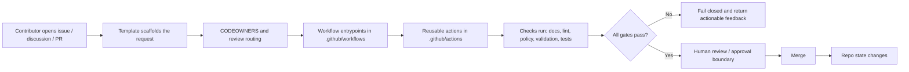

<!-- [KFM_META_BLOCK_V2]
doc_id: kfm://doc/github-readme-v1
title: .github
type: standard
version: v1
status: draft
owners: verify via /.github/CODEOWNERS
created: 2026-03-07
updated: 2026-03-07
policy_label: public
related: [/README.md, /.github/CODEOWNERS, /.github/workflows, /.github/actions, /policy, /tests]
tags: [kfm, github, ci, governance, docs]
notes: [Directory README for GitHub-side automation, templates, ownership routing, and merge discipline.]
[/KFM_META_BLOCK_V2] -->

<a id="top"></a>

# `.github`
GitHub-native control plane for workflows, templates, review routing, ownership signals, and merge discipline.

> **Status:** draft  
> **Owners:** verify in [`./CODEOWNERS`](./CODEOWNERS)  
>       
> **Quick jump:** [Purpose](#purpose) · [Repo fit](#repo-fit) · [Accepted inputs](#accepted-inputs) · [Exclusions](#exclusions) · [Current snapshot](#current-control-plane-snapshot) · [Quickstart](#quickstart) · [Operating rules](#operating-rules) · [Diagram](#diagram) · [Definition of done](#definition-of-done) · [FAQ](#faq)

## Purpose

This directory is the repository’s GitHub-side automation and collaboration surface.

It should hold the things that shape how work enters the repo, how it is reviewed, how merge gates are expressed, and how contributor-facing templates stay aligned with KFM’s evidence-first posture.

### Truth labels used here

| Label | Meaning |
|---|---|
| **CONFIRMED** | Publicly visible in the repo or directly stated by the governing KFM docs. |
| **PROPOSED** | Recommended operating posture or structure for this directory. |
| **UNKNOWN** | Not yet verified on the current branch or may live outside the repo in GitHub settings. |

### Scope

| Status | Statement |
|---|---|
| **CONFIRMED** | `.github/` is the place for workflows, templates, and CODEOWNERS-class collaboration controls. |
| **CONFIRMED** | This directory is for automation and contribution control, not business logic. |
| **PROPOSED** | `.github/README.md` should be the directory-level contract for what belongs here and how changes are reviewed. |
| **UNKNOWN** | Exact branch protections, rulesets, and which checks are currently merge-blocking in GitHub settings. |

## Repo fit

**Path:** `/.github/README.md`

**Repo role:** directory guide for GitHub-native collaboration and automation.

**Upstream**
- repo-root governance in [`/README.md`](../README.md)
- KFM architecture and evidence posture
- branch protection and ruleset configuration that may live outside the repo
- contributor and reviewer expectations

**Downstream**
- workflow entrypoints in [`./workflows/`](./workflows/)
- reusable actions in [`./actions/`](./actions/)
- issue, discussion, and PR templates
- ownership routing via [`./CODEOWNERS`](./CODEOWNERS)
- support and collaboration files such as [`./SUPPORT.md`](./SUPPORT.md)

### What this README is for

Use this file for:
- directory purpose and boundaries
- current file/folder map
- rules for workflow and template changes
- verification-first contributor guidance
- merge-gate and review-discipline expectations

Do **not** use this file for:
- authoritative runtime policy logic
- API schemas or contracts
- dataset manifests or registry content
- generated evidence bundles or receipts
- secrets, tokens, or local developer machine config

## Accepted inputs

The following belong in `.github/` when they are GitHub-facing and repo-governance relevant:

| Input | Examples | Why it belongs here |
|---|---|---|
| Workflow entrypoints | CI, lint, docs, policy-gate, release, validation workflows | They define GitHub-triggered automation. |
| Reusable GitHub actions | composite actions, reusable helpers, action wrappers | They keep repeated workflow logic centralized. |
| Contribution templates | issue forms, PR templates, discussion templates | They guide structured intake and review. |
| Ownership and routing metadata | `CODEOWNERS`, review-routing helpers | They shape responsibility and review paths. |
| Repo-side governance manifests | required-check manifests, label configs, update configs | They keep GitHub behavior inspectable in-repo. |
| Community support files | code of conduct, support guidance | They govern collaboration surfaces. |
| Docs lint / contribution guardrails | markdown or template enforcement wiring | Docs are a production surface in KFM. |

## Exclusions

The following do **not** belong here:

| Exclusion | Why it stays out | Where it belongs instead |
|---|---|---|
| App/runtime business logic | `.github/` is not an application module. | `apps/` or `packages/` |
| Policy source of truth | Templates can request evidence, but policy must be enforced by governed layers and tests. | `policy/` and backend enforcement paths |
| API and schema definitions | Public contracts should be versioned with contract surfaces, not buried in workflow files. | `contracts/` or `schemas/` |
| Dataset specs, catalogs, provenance records | Data lifecycle artifacts must stay on the truth path. | `data/` |
| Runbooks and long-form architecture docs | Keep long operational guidance versioned in the docs plane. | `docs/` |
| Secrets, credentials, tokens | Never commit secrets to the repo. | secret manager / CI secret store |
| Generated build outputs or evidence bundles | Promotion artifacts are not configuration. | governed output paths under `data/`, `artifacts/`, or release surfaces |

## Current control plane snapshot

### Public `main` snapshot

The current public directory snapshot that this README is designed to cover is:

```text
.github/
├── DISCUSSION_TEMPLATE/
├── ISSUE_TEMPLATE/
├── PULL_REQUEST_TEMPLATE/
├── actions/
├── workflows/
├── CODEOWNERS
├── CODE_OF_CONDUCT.md
├── PULL_REQUEST_TEMPLATE.md
├── README.md
├── SUPPORT.md
├── dependabot.yml
├── labeler.yml
└── required-checks.v1.json
```

### Current control plane map

| Path | Status | Intended use in this README |
|---|---|---|
| `DISCUSSION_TEMPLATE/` | **CONFIRMED path** / **PROPOSED role** | Structured discussion intake and guided community threads. |
| `ISSUE_TEMPLATE/` | **CONFIRMED path** / **PROPOSED role** | Structured bug, feature, governance, or task intake. |
| `PULL_REQUEST_TEMPLATE/` | **CONFIRMED path** / **PROPOSED role** | Shared PR scaffolds or specialized PR variants. |
| `actions/` | **CONFIRMED path** / **PROPOSED role** | Reusable local GitHub actions to keep workflows small and consistent. |
| `workflows/` | **CONFIRMED path** / **PROPOSED role** | Workflow entrypoints for checks, validation, automation, and release gates. |
| `CODEOWNERS` | **CONFIRMED path** / **PROPOSED role** | Ownership routing and required review boundaries. |
| `CODE_OF_CONDUCT.md` | **CONFIRMED path** / **PROPOSED role** | Community behavior expectations for repo collaboration surfaces. |
| `PULL_REQUEST_TEMPLATE.md` | **CONFIRMED path** / **PROPOSED role** | Default pull request template. |
| `README.md` | **CONFIRMED path** / **CONFIRMED role** | Directory guide for this control plane. |
| `SUPPORT.md` | **CONFIRMED path** / **PROPOSED role** | Support and help-routing guidance. |
| `dependabot.yml` | **CONFIRMED path** / **PROPOSED role** | Dependency/update automation config. |
| `labeler.yml` | **CONFIRMED path** / **PROPOSED role** | Label automation or label-routing config. |
| `required-checks.v1.json` | **CONFIRMED path** / **UNKNOWN exact schema** / **PROPOSED role** | Repo-local manifest of merge or validation checks. |

### Directory responsibilities

| Topic | Best home | Why |
|---|---|---|
| GitHub event wiring | `.github/workflows/` | Keeps repo automation explicit and reviewable. |
| Shared workflow building blocks | `.github/actions/` | Avoids copy-paste workflow logic. |
| Contributor intake forms | `.github/ISSUE_TEMPLATE/`, `.github/DISCUSSION_TEMPLATE/`, PR templates | Shapes better requests and reviews. |
| Ownership routing | `.github/CODEOWNERS` | Makes review responsibility visible. |
| Required-check naming / manifests | `.github/required-checks.v1.json` | Keeps check names versioned near workflow changes. |
| Support, conduct, contribution UX | `.github/` top-level docs | Keeps GitHub-facing collaboration materials together. |
| Runtime policy logic | `policy/` | Policy must remain testable and separate from UI/forms. |
| Contracts and schemas | `contracts/`, `schemas/` | Public interface guarantees need their own governed home. |

[Back to top](#top)

## Quickstart

Use this to re-ground `.github/` in the current branch before making claims about how the repo works.

```bash
# inspect the current Git revision
git rev-parse HEAD

# inspect the GitHub control plane surface
find .github -maxdepth 3 -type f | sort
find .github -maxdepth 3 -type d | sort

# inspect workflow names and common safety knobs
grep -RIn "^name:" .github/workflows || true
grep -RIn "^[[:space:]]*permissions:" .github/workflows || true
grep -RIn "workflow_call:|concurrency:|timeout-minutes:" .github/workflows || true

# inspect common governance touchpoints
grep -RIn "CODEOWNERS|required-checks|dependabot|labeler" .github || true

# inspect related governance surfaces outside .github
find policy -maxdepth 3 -type f 2>/dev/null | sort
find tests -maxdepth 3 -type f 2>/dev/null | sort
```

### Verify these before documenting branch behavior as fact

1. Which workflow names are actually active on the target branch?
2. Which checks are required in GitHub branch protection or rulesets?
3. Which reusable actions are production-critical versus placeholder?
4. Which templates are default versus specialized?
5. Which automation paths can create changes, and where is human approval enforced?

## Operating rules

### 1) Workflow changes

When you add or modify a workflow:

1. keep permissions least-privilege
2. make failures visible and fail-closed
3. keep workflow names stable if they are referenced by required checks
4. separate generation from approval for governance-significant outputs
5. prefer reusable actions or reusable workflows over repeated YAML
6. update this README when the control-plane shape or expectations change

### 2) Template changes

When you update issue, discussion, or PR templates:

1. ask for the minimum information needed to review well
2. request evidence and impact, not fluff
3. do not ask contributors to paste secrets, credentials, or private tokens
4. keep templates aligned with the root repo posture and contribution docs
5. do not pretend that a template itself enforces policy; templates guide, policies gate

### 3) Ownership and review routing

When you change `CODEOWNERS` or review routing:

1. preserve clear accountability
2. avoid collapsing submitter and approver for policy-significant changes
3. keep governance-heavy areas explicitly owned
4. verify that review expectations still match actual branch settings

### 4) Required-check manifests

If `required-checks.v1.json` is used as a manifest:

1. update it in the same change as workflow-name changes
2. avoid stale check names that silently desync from GitHub settings
3. keep the schema/version explicit
4. document whether GitHub rulesets read from it directly or whether it is advisory only

### 5) Docs are a production surface

Because KFM treats docs as operational, `.github/` changes should also consider:
- template clarity
- README accuracy
- review ergonomics
- support discoverability
- merge-gate transparency

## Diagram


```mermaid
flowchart LR
    A[Contributor opens issue / discussion / PR] --> B[Template scaffolds the request]
    B --> C[CODEOWNERS and review routing]
    C --> D[Workflow entrypoints in .github/workflows]
    D --> E[Reusable actions in .github/actions]
    E --> F[Checks run: docs, lint, policy, validation, tests]
    F --> G{All gates pass?}
    G -- No --> H[Fail closed and return actionable feedback]
    G -- Yes --> I[Human review / approval boundary]
    I --> J[Merge]
    J --> K[Repo state changes]
```

## Suggested growth lanes

These are safe expansion lanes for `.github/` if and only if they are verified or intentionally added:

| Lane | Status | Why it matters |
|---|---|---|
| Reusable policy-gate workflows | **PROPOSED** | Reduces repeated CI logic and makes governance checks portable. |
| Docs-lint workflows | **PROPOSED** | Keeps README and template quality from drifting. |
| Evidence-gate automation | **PROPOSED** | Makes receipts/checksums/policy checks visible before merge. |
| SBOM / provenance automation | **PROPOSED** | Improves release auditability and supply-chain traceability. |
| Label and dependency automation | **PROPOSED** | Keeps triage and maintenance lighter without bypassing review. |
| Auto-revert-on-violation patterns | **PROPOSED** | Supports fail-closed recovery for automation mistakes. |

## Definition of done

A `.github/` change is in good shape when all of the following are true:

- [ ] The change fits the directory boundary and does not smuggle runtime logic into GitHub config.
- [ ] Workflow names, check names, and manifests remain aligned.
- [ ] Permissions are least-privilege and automation does not self-approve policy-significant releases.
- [ ] Templates ask for useful evidence and do not solicit secrets.
- [ ] `CODEOWNERS` and reviewer routing remain intentional.
- [ ] README and contribution-facing docs were updated when behavior changed.
- [ ] Any required-check or ruleset assumptions are explicitly verified.
- [ ] The change is additive, reversible, and reviewable.
- [ ] Policy enforcement remains in governed backend/tested layers, not just in form text.
- [ ] There is a clear rollback path if the automation misbehaves.

## FAQ

### Why keep some facts marked `UNKNOWN`?
Because branch protections and rulesets can exist outside the repo, and KFM should not claim hidden GitHub settings as if they were proven by files alone.

### Why not put policy logic in PR templates?
Templates help contributors provide context, but policy must be enforced by governed code, tests, and merge gates.

### Why is `required-checks.v1.json` treated cautiously?
Its path is visible, but its exact schema and whether GitHub settings read it directly still need verification.

### Why keep `.github/` separate from runtime code?
To preserve clean boundaries between collaboration/automation surfaces and application/business logic.

### Should evidence bundles live under `.github/`?
No. `.github/` can trigger checks around evidence, but the evidence itself belongs on the governed truth path.

## Appendix

<details>
<summary><strong>Proposed future control-plane patterns</strong></summary>

### Reusable workflow posture
When stable, prefer reusable workflows for cross-cutting checks such as:
- metadata validation
- provenance guards
- policy gates
- docs lint
- release attestations

### Local action posture
Use `.github/actions/` for:
- repeated validation wrappers
- shared environment setup
- common artifact naming
- small, testable workflow helpers

### Evidence-aware PR posture
A strong KFM PR template usually asks for:
- what changed
- why it changed
- affected paths
- validation run
- evidence or receipts
- rollback notes
- policy or governance impact

### Safety posture
Prefer:
- pinned actions or exact versions
- explicit permissions
- explicit timeouts and concurrency rules
- stable required-check names
- visible failure over silent success

</details>

<details>
<summary><strong>Minimal maintenance checklist</strong></summary>

1. Review `.github/README.md`
2. Review `CODEOWNERS`
3. Review workflow inventory
4. Review template inventory
5. Review required-check mapping
6. Verify out-of-repo branch protections
7. Update docs and rollback notes together

</details>

[Back to top](#top)
