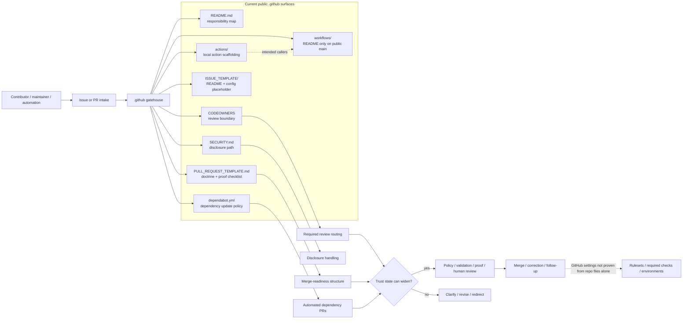

<!-- [KFM_META_BLOCK_V2]
doc_id: kfm://doc/repo/.github/readme
title: .github README
type: standard
version: v2
status: draft
owners: @bartytime4life
created: 2026-03-15
updated: 2026-03-28
policy_label: NEEDS_VERIFICATION
related: [../README.md, ../CONTRIBUTING.md, ../SECURITY.md, ../docs/governance/, ../docs/architecture/, ../docs/domains/, ../docs/runbooks/, ../docs/adr/, ../contracts/, ../policy/, ../data/registry/, ../apps/, ../packages/, ../infra/, ../tools/, ../scripts/, ../tests/, ./ISSUE_TEMPLATE/, ./actions/, ./workflows/, ./CODEOWNERS, ./PULL_REQUEST_TEMPLATE.md, ./SECURITY.md, ./dependabot.yml]
tags: [kfm, github, governance, ci-cd, verification, review, delivery, dependabot]
notes: [Created date preserved from the supplied baseline record; owner value is grounded in current public CODEOWNERS coverage for `/.github/`; current public `main` shows `.github/workflows/README.md` but no checked-in workflow YAML in that directory; policy label, rulesets, required checks, environment approvals, and private-reporting settings remain NEEDS VERIFICATION.]
[/KFM_META_BLOCK_V2] -->

<div align="center">
  <strong>Kansas Frontier Matrix</strong><br />
  <sub>Repository gatehouse for governance, review, CI/CD, and delivery evidence</sub>
</div>

# `.github`

Repository-wide governance, contributor intake, review routing, automation scaffolding, and delivery-control entrypoint for Kansas Frontier Matrix.


| Field | Value |
|---|---|
| Status | **active** directory · **draft** README revision |
| Owners | **`@bartytime4life`** *(current public `CODEOWNERS` coverage for `/.github/`)* |
| Path | `.github/README.md` |
| Default branch | `main` |
| Visibility | public |
| Audience | maintainers, reviewers, contributors, release stewards |
| Repo role | gatehouse for intake, review boundaries, local GitHub automation, workflow documentation, dependency-update policy, and disclosure/release-control surfaces |
| Trust posture | **CONFIRMED** current public repo tree and public Markdown surfaces · **CONFIRMED** KFM doctrine · **UNKNOWN** GitHub rulesets, required checks, environment approvals, OIDC/app permissions, and private-reporting settings |
| Current public tree state | `.github/` contains `ISSUE_TEMPLATE/`, `actions/`, `workflows/`, `CODEOWNERS`, `PULL_REQUEST_TEMPLATE.md`, `README.md`, `SECURITY.md`, and `dependabot.yml`; `workflows/` is README-only on public `main` |

**Quick jump:** [Scope](#scope) · [Repo fit](#repo-fit) · [Accepted inputs](#accepted-inputs) · [Exclusions](#exclusions) · [Directory tree](#directory-tree) · [Quickstart](#quickstart) · [Usage](#usage) · [Diagram](#diagram) · [Current public inventory](#current-public-inventory--control-surfaces) · [Task list / definition of done](#task-list--definition-of-done) · [FAQ](#faq) · [Appendix](#appendix)

> [!IMPORTANT]
> This revision is **public-tree-grounded** rather than merely documentary.
>
> It confirms the current public `main` inventory of `.github/` and several adjacent repo surfaces. It does **not** claim verification of GitHub platform settings that are not derivable from public files alone, including protected-branch rules, required checks, environment approvals, private vulnerability-reporting configuration, GitHub App permissions, or OIDC trust wiring.
>
> Use these labels throughout this file:
> - **CONFIRMED** — directly supported by the current public repo tree, adjacent public Markdown, or attached KFM doctrine
> - **INFERRED** — conservative interpretation that follows from confirmed repo/doctrine evidence
> - **PROPOSED** — doctrine-consistent realization guidance not yet proven as checked-in behavior
> - **UNKNOWN** — not established strongly enough to present as current repo or platform reality
> - **NEEDS VERIFICATION** — placeholder or platform detail that should be checked before merge

## Scope

`.github/` is KFM’s repository-level **gatehouse**.

This is where contributor intake, review routing, ownership boundaries, disclosure posture, update automation, and workflow-bearing delivery controls become explicit repo surfaces instead of ambient intention. In KFM terms, `.github/` is one of the clearest repository expressions of the **trust membrane**: the place where changes are supposed to cross review, verification, and release-bearing gates before they widen into outward-facing consequence.

A strong `.github/` tree does more than “host CI.” It keeps responsibility visible. It shapes intake before drift spreads. It helps documentation, templates, policy checks, and release evidence move through one governed stream rather than fragment into side channels.

### Evidence boundary used here

| Evidence layer | What this README treats as settled |
|---|---|
| **CONFIRMED doctrine** | KFM’s truth path, trust membrane, authoritative-versus-derived split, cite-or-abstain posture, fail-closed defaults, promotion as a governed state transition, and documentation as a production-facing trust surface |
| **CONFIRMED current public repo tree** | exact checked-in `.github/` inventory on public `main`, including `ISSUE_TEMPLATE/`, `actions/`, `workflows/`, `CODEOWNERS`, `PULL_REQUEST_TEMPLATE.md`, `README.md`, `SECURITY.md`, and `dependabot.yml` |
| **CONFIRMED current public adjacent docs** | root `README.md`, `CONTRIBUTING.md`, root `SECURITY.md`, and directory inventories under `docs/`, `data/`, `policy/`, `contracts/`, `tests/`, and `tools/` |
| **UNKNOWN / NEEDS VERIFICATION** | protected branches, required checks, rulesets, environment approvals, private reporting settings, GitHub App permissions, OIDC trust relationships, unpublished workflow history, and any non-public deployment or release controls |

### Current public signals worth carrying forward

| Public signal | What it supports | Status |
|---|---|---|
| Public repo with default branch `main` | GitHub is the active repo-facing control plane | CONFIRMED |
| `.github/` includes intake, ownership, security, actions, workflow, and dependency-update surfaces | the gatehouse is real and non-trivial in the checked-in tree | CONFIRMED |
| `.github/workflows/` contains `README.md` only | current public `main` does **not** expose checked-in workflow YAMLs in that directory | CONFIRMED |
| `.github/actions/` contains multiple local action directories plus docs | reusable repo-local automation scaffolding exists even without checked-in workflow YAMLs on public `main` | CONFIRMED |
| `CODEOWNERS` assigns global fallback and `/.github/` coverage to `@bartytime4life` | review routing exists, but is currently broad and single-owner | CONFIRMED |
| `PULL_REQUEST_TEMPLATE.md` requires truth labels, evidence links, doctrine impact, and affected-surface checklists | PR review is structured around KFM governance language | CONFIRMED |
| `dependabot.yml` is checked in | dependency-update policy is part of the repo-side control surface | CONFIRMED |
| both `.github/SECURITY.md` and `../SECURITY.md` exist | disclosure guidance needs one canonical path or explicit delegation | CONFIRMED existence / NEEDS VERIFICATION canonicalization |

> [!NOTE]
> Platform state is not the same thing as repo state. A checked-in file can describe required checks or disclosure posture, but it cannot by itself prove that GitHub settings, rulesets, reviewer gates, or private-reporting switches currently match the prose.

[Back to top](#github)

## Repo fit

**Path:** `.github/README.md`

**Role in repo:** directory README for repository-wide governance, contributor intake, review boundaries, reusable GitHub automation, workflow documentation, disclosure posture, and dependency-update policy.

**Why it exists:** explain how repository-side control surfaces preserve KFM’s truth path without pretending that `.github/` is the canonical home of contracts, policy bundles, runtime code, data artifacts, or long-form doctrine.

### Upstream and downstream anchors

| Direction | Path | Why it matters | Status in this README |
|---|---|---|---|
| Upstream | [`../README.md`](../README.md) | root repo identity and orientation | CONFIRMED |
| Upstream | [`../CONTRIBUTING.md`](../CONTRIBUTING.md) | contributor expectations and evidence-bounded change discipline | CONFIRMED |
| Upstream | [`../SECURITY.md`](../SECURITY.md) | currently-existing second security-policy path that must stay aligned or delegate clearly | CONFIRMED |
| Upstream | [`../docs/governance/`](../docs/governance/) | governance doctrine and repo-facing review rules | CONFIRMED path |
| Upstream | [`../docs/architecture/`](../docs/architecture/) | architecture doctrine adjacent to delivery and review surfaces | CONFIRMED path |
| Upstream | [`../docs/domains/`](../docs/domains/) | Kansas-first operating lanes that change burden and review posture | CONFIRMED path |
| Upstream | [`../docs/runbooks/`](../docs/runbooks/) | operator and rollback/correction procedure home | CONFIRMED path |
| Upstream | [`../docs/adr/`](../docs/adr/) | decision records that should travel with behavior-significant governance change | CONFIRMED path |
| Upstream | [`../contracts/`](../contracts/) | canonical machine-readable contracts and schemas | CONFIRMED path |
| Upstream | [`../policy/`](../policy/) | executable policy bundles, fixtures, and tests | CONFIRMED path |
| Upstream | [`../data/registry/`](../data/registry/) | source descriptors and intake registry material | CONFIRMED path |
| Downstream | [`./CODEOWNERS`](./CODEOWNERS) | executable review boundary map | CONFIRMED |
| Downstream | [`./ISSUE_TEMPLATE/`](./ISSUE_TEMPLATE/) | contributor issue-intake surface | CONFIRMED |
| Downstream | [`./PULL_REQUEST_TEMPLATE.md`](./PULL_REQUEST_TEMPLATE.md) | PR review contract and doctrine checklist | CONFIRMED |
| Downstream | [`./actions/`](./actions/) | repo-local reusable GitHub Actions logic and scaffolding | CONFIRMED |
| Downstream | [`./workflows/`](./workflows/) | workflow documentation lane; currently README-only on public `main` | CONFIRMED |
| Downstream | [`./SECURITY.md`](./SECURITY.md) | repo-local disclosure-policy surface | CONFIRMED |
| Downstream | [`./dependabot.yml`](./dependabot.yml) | dependency-update automation policy | CONFIRMED |

<details>
<summary><strong>Broader repo context</strong> — current public <code>main</code> root snapshot</summary>

```text
repo/
├── .github/
├── apps/
├── brand/
├── configs/
├── contracts/
├── data/
├── docs/
├── examples/
├── infra/
├── migrations/
├── packages/
├── policy/
├── schemas/
├── scripts/
├── tests/
├── tools/
├── CHANGELOG.md
├── CODE_OF_CONDUCT.md
├── CONTRIBUTING.md
├── LICENSE
├── README.md
└── SECURITY.md
```

</details>

[Back to top](#github)

## Accepted inputs

The following content belongs in `.github/` when it applies across the repository rather than to one package or application.

| Input class | What belongs here | Why it belongs here |
|---|---|---|
| Review-boundary files | `CODEOWNERS`, repo-wide review-routing notes, path ownership, self-protection rules | review is part of KFM’s trust system |
| Structured contributor intake | issue-template chooser files, issue-template docs, PR templates, merge-readiness checklists | intake should be shaped before change widens |
| Reusable repo-local automation | composite actions, setup helpers, policy/install helpers, provenance or metadata guards | keeps repeated steps reviewable and local to the repo |
| Workflow definitions and workflow docs | CI, validation, promotion, correction, rollback, reconciliation, and release-control lanes | repo-wide control and trust-state transitions live here when checked in |
| Security and disclosure entrypoints | `SECURITY.md`, disclosure flow docs, safe-harbor guidance, automation-identity notes | trust-bearing reporting needs a clear repo-level home |
| Dependency update policy | `dependabot.yml` and adjacent governance notes | automated dependency change is part of delivery posture, not an afterthought |

## Exclusions

`.github/` can gate, reference, or validate these surfaces, but it should not quietly replace them as their canonical home.

| Does **not** belong here as canonical truth | Keep it here instead |
|---|---|
| machine-readable schemas, envelopes, OpenAPI specs, vocabularies | [`../contracts/`](../contracts/) and [`../schemas/`](../schemas/) |
| policy bodies, reason-code registries, fixtures, decision tests | [`../policy/`](../policy/) |
| canonical data artifacts, source descriptors, lifecycle-zone payloads, receipts, published datasets | [`../data/`](../data/) and [`../data/registry/`](../data/registry/) |
| runtime services, UI logic, ingestion code, evidence resolvers | [`../apps/`](../apps/) and [`../packages/`](../packages/) |
| long-form doctrine, ADRs, standards, runbooks, architecture manuals | [`../docs/`](../docs/) |
| secrets, private vulnerability details, unpublished review material, exact restricted coordinates | never in public `.github/`; route through stewarded or private paths |
| release artifacts, immutable manifests, proof packs | owning artifact home or designated release/evidence path, not ad hoc `.github/` storage |

[Back to top](#github)

## Directory tree

Current public `main` shows the following checked-in `.github/` layout.

```text
.github/
├── ISSUE_TEMPLATE/
│   ├── README.md
│   └── config.yml                     # zero-byte placeholder on current public main
├── actions/
│   ├── metadata-validate-v2/
│   ├── metadata-validate/
│   ├── opa-gate/
│   ├── provenance-guard/
│   ├── sbom-produce-and-sign/
│   ├── src/
│   ├── README.md
│   └── action.yml                     # zero-byte placeholder on current public main
├── workflows/
│   └── README.md                      # no checked-in workflow YAML visible on current public main
├── CODEOWNERS
├── PULL_REQUEST_TEMPLATE.md
├── README.md
├── SECURITY.md
└── dependabot.yml
```

> [!TIP]
> The tree above is stronger than the earlier documentary-only draft because it reflects the current public `main` listing. The remaining blind spots are GitHub settings and any non-public or historical state that does not appear in the checked-in tree.

## Quickstart

Before changing repo-wide governance surfaces, inspect the current checkout and compare it against the public-main snapshot above.

```bash
# 0) Start from the repo root
git rev-parse --show-toplevel 2>/dev/null || pwd

# 1) Inventory the gatehouse
find .github -maxdepth 2 -type f | sort
find .github -maxdepth 2 -type d | sort

# 2) Inspect the highest-signal repo-side control surfaces
sed -n '1,220p' .github/README.md
sed -n '1,220p' .github/CODEOWNERS
sed -n '1,260p' .github/PULL_REQUEST_TEMPLATE.md
sed -n '1,260p' .github/SECURITY.md
sed -n '1,260p' .github/dependabot.yml

# 3) Inspect current intake and local-action state
find .github/ISSUE_TEMPLATE -maxdepth 1 -type f | sort
find .github/actions -maxdepth 2 -type f | sort
test -s .github/ISSUE_TEMPLATE/config.yml || echo ".github/ISSUE_TEMPLATE/config.yml is empty"
test -s .github/actions/action.yml || echo ".github/actions/action.yml is empty"

# 4) Inspect current workflow lane state
find .github/workflows -maxdepth 1 -type f | sort
find .github/workflows -maxdepth 1 \( -name '*.yml' -o -name '*.yaml' \) | sort

# 5) Check adjacent authority surfaces that .github should gate, not replace
find docs -maxdepth 2 -type d | sort | sed -n '1,160p'
find data -maxdepth 2 -type d | sort | sed -n '1,160p'
find policy -maxdepth 2 -type d | sort | sed -n '1,160p'
find contracts -maxdepth 2 -type f | sort | sed -n '1,120p'
find tests -maxdepth 2 -type d | sort | sed -n '1,160p'

# 6) Platform-state checks happen outside the repo tree:
#    - protected branches / rulesets
#    - required status checks
#    - environment reviewers / deployment approvals
#    - private vulnerability reporting
#    - GitHub App and OIDC permissions
```

## Usage

Use this README as the responsibility map for repo-side governance work.

1. **Inspect before editing.** Confirm the live tree, not just remembered structure or historical discussion.
2. **Map the change to trust impact.** Ask whether the edit changes intake, ownership, merge-blocking logic, disclosure flow, dependency automation, release evidence, or correction posture.
3. **Keep trust-bearing automation review-bearing.** KFM doctrine prefers visible deltas, attached evidence, and reversible changes whenever automation could change trust state.
4. **Update adjacent docs in the same change stream.** If review routing, disclosure posture, automation lanes, or dependency policy change, the corresponding README, template, or runbook should travel with the same PR.

### Build, deploy, and promote are different moves

| Move | What changes | Why `.github/` cares |
|---|---|---|
| **Build** | a versioned artifact or proof object exists | repo automation, metadata guards, and attest/review surfaces often begin here |
| **Deploy** | runtime placement or hosted execution changes | environment approvals, rollback readiness, and post-deploy checks may be triggered here |
| **Promote** | trust state changes from candidate to releasable/publishable | policy, docs, review, and proof obligations become mandatory here |

### Current public-main reading of the gatehouse

| Surface family | Current public `main` state | Consequence |
|---|---|---|
| Contributor issue intake | `ISSUE_TEMPLATE/` exists, but current visible files are `README.md` plus a zero-byte `config.yml` | intake directory is present, but no checked-in issue forms are visible on public `main` |
| PR review intake | `PULL_REQUEST_TEMPLATE.md` is present and substantial | PRs already carry structured KFM review prompts |
| Review ownership | `CODEOWNERS` uses broad single-owner coverage with explicit `/.github/` self-protection | routing exists, but granularity is intentionally conservative |
| Local action scaffolding | multiple repo-local action directories are checked in | repeated workflow steps are intended to stay local and reviewable |
| Workflow lane | `workflows/README.md` is present, but no `.yml`/`.yaml` files are visible in that directory on public `main` | current public branch shows documented intent rather than checked-in workflow definitions |
| Dependency automation | `dependabot.yml` is present and multi-ecosystem | dependency update policy is active as repo config |
| Security disclosure | both `.github/SECURITY.md` and root `SECURITY.md` exist | canonical disclosure wording should be unified or delegated cleanly |

### When this file should change

- when `.github/` inventory changes
- when workflow YAML files are added, removed, or renamed
- when issue or PR intake surfaces change
- when security-path canonicalization changes
- when local action scaffolding changes materially
- when dependency-update policy changes
- when GitHub-settings verification steps need sharper guidance

[Back to top](#github)

## Diagram


```mermaid
flowchart LR
    A[Contributor / maintainer / automation] --> B[Issue or PR intake]
    B --> C[.github gatehouse]

    subgraph G["Current public .github surfaces"]
      G1["README.md<br/>responsibility map"]
      G2["CODEOWNERS<br/>review boundary"]
      G3["PULL_REQUEST_TEMPLATE.md<br/>doctrine + proof checklist"]
      G4["ISSUE_TEMPLATE/<br/>README + config placeholder"]
      G5["actions/<br/>local action scaffolding"]
      G6["workflows/<br/>README only on public main"]
      G7["dependabot.yml<br/>dependency update policy"]
      G8["SECURITY.md<br/>disclosure path"]
    end

    C --> G1
    C --> G2
    C --> G3
    C --> G4
    C --> G5
    C --> G6
    C --> G7
    C --> G8

    G2 --> H[Required review routing]
    G3 --> I[Merge-readiness structure]
    G5 -. intended callers .-> G6
    G7 --> J[Automated dependency PRs]
    G8 --> K[Disclosure handling]

    H --> L{Trust state can widen?}
    I --> L
    J --> L

    L -->|yes| M[Policy / validation / proof / human review]
    L -->|no| N[Clarify / revise / redirect]

    M --> O[Merge / correction / follow-up]
    O -. GitHub settings not proven from repo files alone .-> P[Rulesets / required checks / environments]
```

## Current public inventory & control surfaces

| Surface | Current evidence status | Primary role | Why it is sensitive |
|---|---|---|---|
| [`./README.md`](./README.md) | CONFIRMED | repo-side responsibility map | drift here blurs the control plane |
| [`./CODEOWNERS`](./CODEOWNERS) | CONFIRMED | executable review routing; current broad ownership coverage | changes approval scope and separation of duty |
| [`./PULL_REQUEST_TEMPLATE.md`](./PULL_REQUEST_TEMPLATE.md) | CONFIRMED | structured PR intake with truth labels, evidence links, doctrine impact, and surface checklists | weak PR prompts degrade review quality |
| [`./ISSUE_TEMPLATE/README.md`](./ISSUE_TEMPLATE/README.md) | CONFIRMED | issue-intake guidance | contributor intake should stay governed rather than improvised |
| [`./ISSUE_TEMPLATE/config.yml`](./ISSUE_TEMPLATE/config.yml) | CONFIRMED current file presence | issue chooser config path | currently a zero-byte placeholder on public `main` |
| [`./actions/`](./actions/) | CONFIRMED | repo-local reusable GitHub Actions scaffolding | local actions can hide trust-bearing behavior if undocumented |
| [`./actions/action.yml`](./actions/action.yml) | CONFIRMED current file presence | root action manifest path | currently a zero-byte placeholder on public `main` |
| [`./workflows/README.md`](./workflows/README.md) | CONFIRMED | workflow documentation lane | current public branch shows docs without checked-in workflow YAMLs |
| `./workflows/*.yml|*.yaml` | CONFIRMED current public absence | checked-in workflow definitions | none visible on public `main` at the time of this revision |
| [`./SECURITY.md`](./SECURITY.md) | CONFIRMED | repo-local disclosure-policy surface | public disclosure posture needs one canonical path |
| [`../SECURITY.md`](../SECURITY.md) | CONFIRMED | second checked-in security-policy path | duplicate policy surfaces must stay aligned or delegate cleanly |
| [`./dependabot.yml`](./dependabot.yml) | CONFIRMED | dependency update automation policy | bot-driven dependency PRs still affect trust and delivery posture |
| GitHub rulesets / required checks / env approvals | UNKNOWN in this session | platform enforcement | cannot be inferred from checked-in docs alone |

### Current public action inventory

| Path | Observed state | Posture |
|---|---|---|
| `./actions/metadata-validate-v2/` | present | CONFIRMED path |
| `./actions/metadata-validate/` | present | CONFIRMED path |
| `./actions/opa-gate/` | present | CONFIRMED path |
| `./actions/provenance-guard/` | present | CONFIRMED path |
| `./actions/sbom-produce-and-sign/` | present | CONFIRMED path |
| `./actions/src/` | present | CONFIRMED path |
| `./actions/README.md` | present | CONFIRMED path |
| `./actions/action.yml` | present, zero-byte in current public main | CONFIRMED current snapshot |

### Current public dependency-update coverage

| Ecosystem | Visible scope on public `main` | Schedule signal |
|---|---|---|
| `github-actions` | root `/` | weekly, Monday |
| `docker` | `/`, `/apps/*`, `/packages/*`, `/infra/*` | weekly, Monday |
| `npm` | `/`, `/apps/*`, `/packages/*` | weekly, Tuesday |
| `pip` | `/`, `/apps/*`, `/packages/*` | weekly, Wednesday |
| `cargo` | `/`, `/apps/*`, `/packages/*` | weekly, Thursday |

[Back to top](#github)

## Task list / definition of done

- [ ] The live checkout matches the tree documented above.
- [ ] `.github/README.md`, `.github/CODEOWNERS`, `.github/PULL_REQUEST_TEMPLATE.md`, `.github/SECURITY.md`, and `.github/dependabot.yml` were re-read in the same branch being merged.
- [ ] `ISSUE_TEMPLATE/` still contains exactly the files documented here, or this README was updated in the same PR.
- [ ] `actions/` still contains the documented subdirectories, or this README was updated in the same PR.
- [ ] `workflows/` was checked for actual `.yml` / `.yaml` files before any workflow claim was merged.
- [ ] Any zero-byte placeholders (`ISSUE_TEMPLATE/config.yml`, `actions/action.yml`) remain intentional and documented, or they were replaced with real content.
- [ ] `CODEOWNERS` coverage still matches the review expectations described here.
- [ ] `.github/SECURITY.md` and `../SECURITY.md` are either text-aligned or one clearly delegates to the other.
- [ ] Branch protection, rulesets, required checks, environment approvals, and private-reporting settings were verified in GitHub settings when relevant.
- [ ] UNKNOWN items remain explicit instead of being rewritten as certainty.
- [ ] Docs, templates, and automation changes that affect trust state move through the same review stream.

## FAQ

### Does current public `main` expose checked-in workflow YAML files?

Not in the public directory listing inspected for this revision. `./workflows/README.md` is present, but no `.yml` or `.yaml` files were visible in `./workflows/` on public `main`.

### Does current public `main` expose issue-form templates?

The issue-template directory exists, but the visible checked-in files are `README.md` plus a zero-byte `config.yml`. No issue-form or markdown template files were visible in that directory on public `main`.

### Who currently owns `.github/`?

Current public `CODEOWNERS` assigns the global fallback to `@bartytime4life` and explicitly assigns `/.github/` plus `/.github/CODEOWNERS` to `@bartytime4life`.

### Does `dependabot.yml` count as a governance surface?

Yes. It is repo-side automation policy: checked-in configuration that controls how dependency update PRs are opened and grouped across ecosystems and directories.

### What remains unverified after this revision?

GitHub private-reporting settings, protected-branch rules, required checks, rulesets, environment approvals, GitHub App permissions, OIDC trust relationships, and any non-public release or deployment controls.

## Appendix

<details>
<summary><strong>Confirmed public-main snapshot notes</strong></summary>

### `.github/` currently visible on public `main`

- `ISSUE_TEMPLATE/` exists with `README.md` and zero-byte `config.yml`
- `actions/` exists with five named action directories, `src/`, `README.md`, and zero-byte `action.yml`
- `workflows/` exists with `README.md` only
- `CODEOWNERS`, `PULL_REQUEST_TEMPLATE.md`, `README.md`, `SECURITY.md`, and `dependabot.yml` are checked in

### Adjacent repo paths confirmed during this revision

- root directories: `apps/`, `brand/`, `configs/`, `contracts/`, `data/`, `docs/`, `examples/`, `infra/`, `migrations/`, `packages/`, `policy/`, `schemas/`, `scripts/`, `tests/`, `tools/`
- `docs/` subdirectories confirmed in the public listing: `adr/`, `architecture/`, `domains/`, `governance/`, `runbooks/`, among others
- `data/registry/` is present
- `policy/` contains `bundles/`, `fixtures/`, `policy-runtime/`, and `tests/`
- `tests/` contains `accessibility/`, `contracts/`, `e2e/`, `integration/`, `policy/`, `reproducibility/`, and `unit/`
- `tools/` contains `attest/`, `catalog/`, `ci/`, `diff/`, `docs/`, `probes/`, and `validators/`

### Practical reading rule

This directory is currently strongest as a **repo-side control map** plus **local automation scaffold**. The biggest visible gap on public `main` is not the absence of governance prose; it is the absence of checked-in workflow YAMLs under `.github/workflows/`.

</details>

<details>
<summary><strong>Open verification backlog</strong></summary>

1. Verify whether workflow YAML files exist on non-public branches, in history, or only outside the current public `main` state.
2. Confirm whether `ISSUE_TEMPLATE/config.yml` and `actions/action.yml` are intentional zero-byte placeholders or incomplete scaffolding.
3. Choose and enforce one canonical public security-policy path, or explicitly delegate from one file to the other.
4. Recheck `CODEOWNERS` granularity if ownership expands beyond the current broad single-owner baseline.
5. Export or inspect GitHub rulesets, required checks, environment approvals, and private vulnerability-reporting settings.
6. Reconcile `.github/README.md`, `.github/workflows/README.md`, `.github/actions/README.md`, root `README.md`, and `CONTRIBUTING.md` so they describe the same current control-plane reality.
7. Retire UNKNOWN items only when direct repo or platform evidence is attached to the same PR.

</details>

[Back to top](#github)
