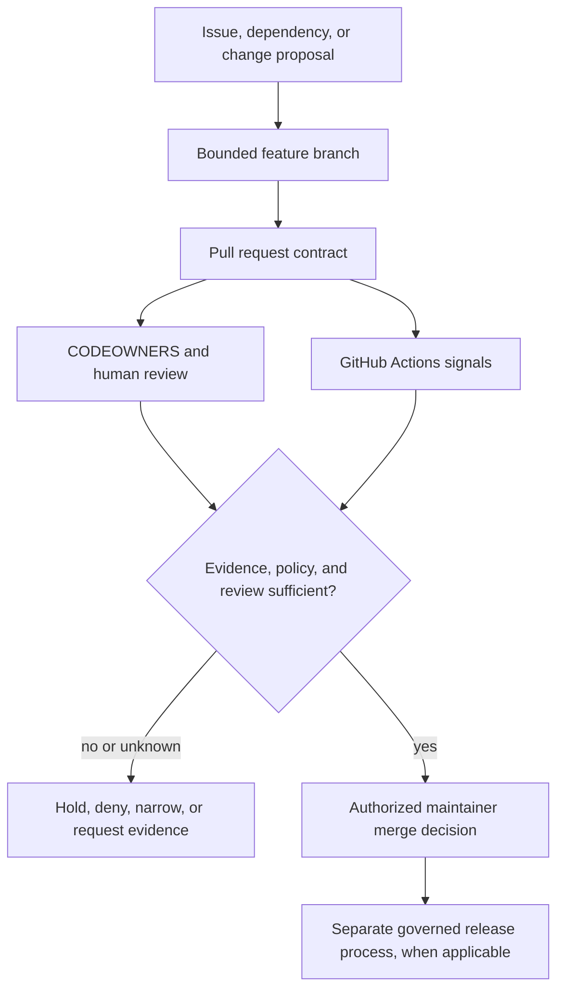

<!-- [KFM_META_BLOCK_V2]
doc_id: kfm://doc/github-folder-readme
title: .github — GitHub Platform Governance Hooks
type: README
version: v1.5
status: draft; repository-grounded; current tree counted; workflow maturity bounded
owners: ["@bartytime4life"]
created: 2026-05-11
updated: 2026-08-08
policy_label: public
owning_root: .github/
responsibility: GitHub-platform governance hooks, review routing, dependency intake, issue and pull-request intake, and CI orchestration
truth_posture: cite-or-abstain; implementation claims are bounded to the pinned repository snapshot
evidence_snapshot:
  repository: bartytime4life/Kansas-Frontier-Matrix
  base_ref: main
  base_commit: 4989f6d5145908dfc56f778b39082719ce1788ad
  root_tree: 2a86a09845646a130972b8c4cad9a8a4ae51bcc7
  github_readme_prior_blob: 3bef7347b113473215e20e48b4ee85a1b304f580
  workflows_tree: a417dccf118d69edd0145629f81524717c93b849
  issue_template_tree: 188d3879975bd1096a58350c9c3a6bf63ddbedc6
  inventory: 203 tracked paths; 190 workflow YAML files; 6 issue chooser templates
related:
  - ../README.md
  - ../CONTRIBUTING.md
  - ../SECURITY.md
  - ../docs/doctrine/directory-rules.md
  - ../docs/architecture/directory-rules.md
  - ../docs/adr/ADR-0029-adopt-directory-governance-standard-v2.md
  - ../docs/doctrine/ai-build-operating-contract.md
  - ../docs/registers/DRIFT_REGISTER.md
  - ../docs/registers/VERIFICATION_BACKLOG.md
  - CODEOWNERS
  - PULL_REQUEST_TEMPLATE.md
  - ISSUE_TEMPLATE/README.md
  - workflows/README.md
notes:
  - "The path count and workflow filename count are exact for the pinned Git trees. They do not prove GitHub settings, branch protection, workflow success, per-workflow safety, release approval, or publication."
  - "The v1.4 forty-four-workflow snapshot is preserved in Git history but is superseded as a description of the current tree."
  - "Accepted ADR-0029 makes docs/doctrine/directory-rules.md the sole writable Directory Rules authority. The architecture-path copy remains a read-only compatibility surface."
[/KFM_META_BLOCK_V2] -->

<a id="top"></a>

<p align="center">
  
</p>

# `.github/` — GitHub platform governance hooks

[](#status-and-evidence-boundary)
[](#confirmed-inventory)
[](workflows/README.md)
[](ISSUE_TEMPLATE/README.md)
[](#authority-boundary)
[](#authority-boundary)

> GitHub Actions, review routing, issue and pull-request intake, and dependency-update configuration for KFM. This root orchestrates repository checks and collaboration signals; it does not own policy, schemas, contracts, evidence, release decisions, or publication.

> [!IMPORTANT]
> A workflow pass proves only that the declared job completed for the declared revision and inputs. It does not prove `EvidenceBundle` closure, rights clearance, policy approval, human review, release readiness, deployment, or publication.

## Quick navigation

- [Purpose](#purpose)
- [Authority boundary](#authority-boundary)
- [Status and evidence boundary](#status-and-evidence-boundary)
- [Confirmed inventory](#confirmed-inventory)
- [Platform surface contracts](#platform-surface-contracts)
- [Operating flow](#operating-flow)
- [Workflow growth and maturity boundary](#workflow-growth-and-maturity-boundary)
- [What belongs here](#what-belongs-here)
- [What does not belong here](#what-does-not-belong-here)
- [Security and trust controls](#security-and-trust-controls)
- [Validation](#validation)
- [Review and change discipline](#review-and-change-discipline)
- [Related authority](#related-authority)
- [Open verification items](#open-verification-items)
- [Rollback](#rollback)
- [Changelog](#changelog)

## Purpose

`.github/` is the KFM responsibility root for GitHub-specific platform integration:

- GitHub Actions orchestration;
- CODEOWNERS review routing;
- pull-request and issue intake templates;
- Dependabot configuration;
- optional GitHub community-health metadata.

It translates repository-owned commands and KFM governance expectations into review-visible platform behavior. It must remain thin: reusable validation, policy, domain logic, release logic, and data-lifecycle behavior stay in their owning roots and are invoked from here.

## Authority boundary

Accepted Directory Rules define `.github/` as the platform-integration and repository-automation root. The same rules explicitly deny this root authority over KFM truth, release approval, or proof that review occurred.

| Concern | Authority owner | `.github/` role |
|---|---|---|
| GitHub events, path filters, job graphs, token permissions, runners, and check names | `.github/workflows/` | Define GitHub-hosted orchestration. |
| Review routing | `.github/CODEOWNERS` | Route requests to verified GitHub identities; not prove review, independence, or approval. |
| Contribution intake | `.github/ISSUE_TEMPLATE/`, `.github/PULL_REQUEST_TEMPLATE.md` | Require scope, evidence, validation, and rollback information; not accept the claim. |
| Dependency proposals | `.github/dependabot.yml` | Open reviewable update proposals; not establish compatibility, security, or release readiness. |
| Semantic meaning | `contracts/` | Workflows may invoke checks; they do not redefine contracts. |
| Machine-checkable shape | `schemas/` | Workflows validate canonical schemas; they do not become schema authority. |
| Allow, deny, restrict, hold, or abstain decisions | `policy/` | Workflows evaluate reviewed policy; they do not author policy inline. |
| Expected behavior | `tests/`, `fixtures/` | CI executes deterministic cases; YAML is not the unique implementation. |
| Evidence, receipts, proofs, and lifecycle instances | governed `data/` lanes | Logs and artifacts are reviewer aids unless admitted through a governed transition. |
| Release, correction, withdrawal, and rollback decisions | `release/` | CI may verify or dry-run; it does not approve, promote, or publish. |

Neither a commit, pull request, check, artifact upload, merge, badge, nor GitHub Release is a KFM publication event.

## Status and evidence boundary

This edition is pinned to `main@4989f6d5145908dfc56f778b39082719ce1788ad` and the Git tree identities recorded in the metadata block.

| Surface | Confirmed repository state | Boundary |
|---|---|---|
| Tracked `.github/` paths | **203** | Exact for the pinned tree: five top-level files, seven issue-template files, one workflow README, and 190 workflow files. GitHub settings are external. |
| Workflows | **190 `.yml` files** plus [`workflows/README.md`](workflows/README.md) | Exact filename count. Per-workflow triggers, permissions, action pins, network use, maturity, and hosted outcomes were not re-audited for all 190 in this documentation slice. |
| Issue intake | **6 Markdown chooser templates** plus [`ISSUE_TEMPLATE/README.md`](ISSUE_TEMPLATE/README.md) | No issue-form YAML or chooser `config.yml` is present in the pinned issue-template tree. Blank-issue behavior remains settings-dependent. |
| Pull-request intake | [`PULL_REQUEST_TEMPLATE.md`](PULL_REQUEST_TEMPLATE.md) | Tracked and review-visible; completion and enforcement remain human/process questions. |
| Review routing | [`CODEOWNERS`](CODEOWNERS) routes all paths to `@bartytime4life` with narrower path entries | File behavior is confirmed; required code-owner review and separation of duties remain **NEEDS VERIFICATION**. |
| Dependency intake | [`dependabot.yml`](dependabot.yml) covers pip, npm, GitHub Actions, and pre-commit | Static configuration is confirmed. Execution history, alerts, and update state were not inspected. |
| Funding | [`FUNDING.yml`](FUNDING.yml) is a comment-only placeholder | It configures no active funding provider. |
| Root `CODEOWNERS` | Absent from the pinned repository root | `.github/CODEOWNERS` is the tracked GitHub-supported review-routing file. |

> [!WARNING]
> Branch protection, rulesets, repository token defaults, private vulnerability reporting, environments, labels, Dependabot execution, and workflow run results live outside this file tree. Keep those claims `NEEDS VERIFICATION` until inspected through current settings or exact-head run evidence.

## Confirmed inventory

```text
.github/
├── README.md
├── CODEOWNERS
├── FUNDING.yml                         # comment-only placeholder
├── PULL_REQUEST_TEMPLATE.md
├── dependabot.yml
├── ISSUE_TEMPLATE/
│   ├── README.md
│   ├── adr.md
│   ├── bug.md
│   ├── evidence_correction.md
│   ├── feature.md
│   ├── sensitivity_concern.md
│   └── source_admission.md
└── workflows/
    ├── README.md
    └── 190 workflow .yml files
```

The workflow subtree README records the current filename-count boundary and the audit work still required. The issue-template README owns chooser-specific guidance.

## Platform surface contracts

| Surface | Current role | Authority limit |
|---|---|---|
| [`CODEOWNERS`](CODEOWNERS) | Default and path-specific review routing | Not a `ReviewRecord`, stewardship assignment, or proof that review occurred. |
| [`PULL_REQUEST_TEMPLATE.md`](PULL_REQUEST_TEMPLATE.md) | Task contract, evidence, Directory Rules, threat preflight, validation, and rollback prompts | Not approval, release, or publication authority. |
| [`dependabot.yml`](dependabot.yml) | Weekly dependency-update proposals across four ecosystems | Proposal-only; no automatic compatibility or merge claim. |
| [`ISSUE_TEMPLATE/`](ISSUE_TEMPLATE/README.md) | Public-safe issue routing | Intake only; labels and settings may be external or unverified. |
| [`workflows/`](workflows/README.md) | GitHub Actions orchestration | Non-publisher; every workflow must be interpreted from its exact steps and current run evidence. |
| [`FUNDING.yml`](FUNDING.yml) | GitHub funding/community-health surface | Inactive placeholder. |

## Operating flow


```mermaid
flowchart TD
    I["Issue, dependency, or change proposal"] --> B["Bounded feature branch"]
    B --> P["Pull request contract"]
    P --> C["CODEOWNERS and human review"]
    P --> W["GitHub Actions signals"]
    C --> D{"Evidence, policy, and review sufficient?"}
    W --> D
    D -->|no or unknown| H["Hold, deny, narrow, or request evidence"]
    D -->|yes| M["Authorized maintainer merge decision"]
    M --> R["Separate governed release process, when applicable"]
```

This flow is repository collaboration, not the KFM data lifecycle. It must not collapse `RAW -> WORK / QUARANTINE -> PROCESSED -> CATALOG / TRIPLET -> PUBLISHED` into GitHub status.

## Workflow growth and maturity boundary

The prior v1.4 README recorded **44** workflows at `main@c455e51be776a355a392284711898af092fb423f`. The pinned current tree contains **190**, an increase of **146** workflow files.

That increase is a tree fact, not a maturity claim. It creates a maintenance obligation:

1. every workflow must have one bounded responsibility;
2. trigger and path-filter coverage must be inspectable;
3. permissions, untrusted inputs, actions, runners, network use, caches, artifacts, and failure masking must be reviewed;
4. workflow and job names must be checked for ruleset coupling;
5. holds, skips, partial coverage, and substantive validation must remain distinguishable;
6. redundant or overlapping workflows must be reconciled rather than inferred safe from filenames.

The companion [`workflows/README.md`](workflows/README.md) is updated with the current count and explicitly retires the old 44-file classification as a current inventory. A complete 190-workflow behavioral audit remains **NEEDS VERIFICATION**.

## What belongs here

- GitHub Actions workflow definitions under `workflows/`.
- Repository-local reusable or composite actions under `actions/` when actual reuse is established.
- One active CODEOWNERS file at a GitHub-supported location.
- GitHub issue, pull-request, discussion, funding, and dependency-intake configuration.
- Minimal comments explaining permissions, trigger trust boundaries, stable check names, and rollback coupling.
- README documentation for this root and substantial platform subtrees.

## What does not belong here

- validator or domain logic owned by `tools/`, `packages/`, `pipelines/`, or applications;
- Rego, allowlists, sensitivity rules, rights rules, or release policy owned by `policy/`;
- contracts, schemas, fixtures, source descriptors, canonical evidence, receipts, proofs, catalogs, or releases;
- credentials, private endpoints, restricted payloads, exact sensitive locations, or secret-bearing logs;
- ordinary CI paths that write directly to `data/published/`, catalog/triplet authority, or release authority;
- duplicate configuration created only to make the tree appear complete;
- workflows created solely to obtain a green badge.

## Security and trust controls

### Confirmed in this documentation slice

- `.github/CODEOWNERS` contains one verified executable owner identity, `@bartytime4life`, and explicitly disclaims review or release authority.
- `dependabot.yml` defines reviewable proposals for four ecosystems and no private registry.
- the issue-template tree contains six Markdown chooser templates and no issue-form YAML or chooser configuration file;
- this change modifies documentation only; no workflow, permission, trigger, action reference, template behavior, dependency configuration, secret, or repository setting changes.

### Required for workflow changes

Every workflow change must document and validate:

- event and changed-path scope;
- untrusted-input reachability;
- least-privilege token permissions;
- secret and OIDC exposure;
- runner trust;
- network and dependency behavior;
- cache and artifact retention;
- failure masking and finite outcomes;
- check-name and ruleset coupling;
- rollback and external side effects.

> [!CAUTION]
> Do not place vulnerabilities, credentials, restricted source material, living-person private data, DNA/genomic data, exact rare-species or archaeology locations, or critical-infrastructure exposure details in public issues, pull requests, logs, artifacts, or generated receipts. Follow [`SECURITY.md`](../SECURITY.md) and fail closed.

## Validation

### Repository-native checks

```bash
# Inspect the exact review scope.
git status --short
git diff --check
git diff --name-only <base>...HEAD

# Validate workflow YAML when workflow files change.
actionlint .github/workflows/*.yml

# Run repository checks applicable to the changed behavior.
make validate
```

Do not claim a command passed unless it was actually run. A README-only packet should additionally verify:

- one H1 per README;
- balanced fences, alerts, HTML, and details blocks;
- heading hierarchy and fragment links;
- every repository-relative link at the proposed head;
- inventory arithmetic against pinned Git trees;
- no secret, credential, signed URL, or exact-sensitive-location material;
- no changed workflow, trigger, permission, template, CODEOWNERS, Dependabot, or check-name behavior.

## Review and change discipline

1. Pin the base commit and inspect overlapping branches, pull requests, issues, and recent merges.
2. Read [`CONTRIBUTING.md`](../CONTRIBUTING.md), [`SECURITY.md`](../SECURITY.md), accepted Directory Rules, this README, and the nearest subtree README.
3. Define the event, path scope, untrusted-input boundary, permissions, network use, expected outcomes, and rollback before changing a workflow.
4. Preserve stable workflow and job names unless ruleset coupling is verified and deliberately migrated.
5. Keep one bounded responsibility per branch and default to a draft pull request for governance-significant or AI-authored work.
6. Never self-approve, merge, publish, deploy, enable auto-merge, or weaken a gate without the required authority.
7. Recount and re-audit after base drift; rapid workflow growth makes cached inventory unsafe.

## Related authority

| Path | Relationship |
|---|---|
| [`../CONTRIBUTING.md`](../CONTRIBUTING.md) | Repository contribution, evidence, validation, branch, PR, and receipt discipline. |
| [`../SECURITY.md`](../SECURITY.md) | Private-first security reporting and sensitive-information boundary. |
| [`../docs/doctrine/directory-rules.md`](../docs/doctrine/directory-rules.md) | Sole writable Directory Rules authority adopted by ADR-0029. |
| [`../docs/architecture/directory-rules.md`](../docs/architecture/directory-rules.md) | Read-only compatibility surface retained by ADR-0029's migration plan. |
| [`../docs/adr/ADR-0029-adopt-directory-governance-standard-v2.md`](../docs/adr/ADR-0029-adopt-directory-governance-standard-v2.md) | Accepted placement and authority decision. |
| [`../docs/doctrine/ai-build-operating-contract.md`](../docs/doctrine/ai-build-operating-contract.md) | AI-assisted work, truth labels, receipts, review, and rollback. |
| [`../policy/`](../policy/) | Allow, deny, restrict, hold, and abstain authority. |
| [`../tools/validators/`](../tools/validators/) | Repository-owned validator logic invoked by CI. |
| [`../schemas/`](../schemas/) and [`../contracts/`](../contracts/) | Machine shape and semantic meaning. |
| [`../tests/`](../tests/) and [`../fixtures/`](../fixtures/) | Enforceable behavior and deterministic examples. |
| [`../data/receipts/`](../data/receipts/) and [`../data/proofs/`](../data/proofs/) | Governed receipt and proof homes. |
| [`../release/`](../release/) | Release, correction, withdrawal, and rollback authority. |

## Open verification items

- **NEEDS VERIFICATION** — exact current rulesets, branch protections, and required workflow/job names.
- **NEEDS VERIFICATION** — whether required code-owner review is enabled and whether independent review is available.
- **NEEDS VERIFICATION** — repository and organization default `GITHUB_TOKEN` permissions.
- **NEEDS VERIFICATION** — current conclusions, failure causes, logs, and artifact retention across all 190 workflows.
- **NEEDS VERIFICATION** — complete trigger, path-filter, permission, runner, secret/OIDC, network, cache, artifact, action-pin, and write-scope inventory for all 190 workflows.
- **NEEDS VERIFICATION** — overlapping, redundant, stale, or misleading workflow/check names introduced during rapid expansion.
- **NEEDS VERIFICATION** — issue labels, blank-issue chooser behavior, and private vulnerability reporting settings.
- **NEEDS VERIFICATION** — Dependabot execution, alert, and security-update state.
- **PROPOSED hardening** — generate and validate the workflow inventory from the Git tree so future README counts cannot silently drift.
- **PROPOSED cleanup** — remove `FUNDING.yml` or configure a verified provider; the comment-only placeholder has no active effect.

## Rollback

Before merge, close the draft pull request or revert the documentation commits on the feature branch. After an authorized merge, use a transparent revert or forward correction that restores the prior README bytes, rerun the same documentation checks, and confirm that no workflow or platform setting changed. Do not rewrite shared history.

## Changelog

| Date | Version | Change |
|---|---|---|
| 2026-08-08 | v1.5 | Re-pinned the root to `main@4989f6d…`; reconciled 203 tracked `.github/` paths, 190 workflows, and six issue templates; retired the 44-workflow snapshot as current evidence; separated exact tree facts from unverified per-workflow behavior; and preserved the non-publisher authority boundary. |
| 2026-07-31 | v1.4 | Reconciled the complete 57-path tree and 44-workflow static posture at `main@c455e51…`; recorded the trusted-base `pull_request_target` exception, mixed action-pinning posture, accepted Directory Rules authority, and corrected the workflow-threat-preflight fragment. |
| 2026-07-22 | v1.3 | Reconciled the parent README to the complete 54-path tree, 41 workflows, six issue templates, current CODEOWNERS and Dependabot configuration, static permission posture, and explicit external-settings boundary. |
| 2026-07-08 | v1.2 | Added a repository-aware draft, but retained a partial inventory and target workflow map. |
| 2026-05-22 | v1.1 | Established the doctrine-grounded GitHub governance boundary. |

[Back to top](#top)
