<div align="center">

# 🏗️ Kansas Frontier Matrix — **System Architecture**  
`docs/architecture/ARCHITECTURE.md`

**Purpose:** Define the end-to-end architecture — **ingestion → AI/ML → graph → API → web UI → governance** — emphasizing **reproducibility, provenance, accessibility, security, and performance**.

[]()
[]()
[]()
[]()
[]()

</div>

---

## 📚 Overview

The **Kansas Frontier Matrix (KFM)** unifies historical, environmental, and cultural data into an open, dual-deployment knowledge system (web + standalone). It uses **semantic graph models**, **FAIR+CARE governance**, **AI/ML** pipelines, and **ledger-verified provenance** under **MCP-DL v6.4.3**.

**Core Tenets**
- Deterministic, idempotent pipelines with full CI validation and manifests + checksums.  
- Semantic + spatiotemporal models (CIDOC CRM + OWL-Time + GeoSPARQL).  
- Immutable, discoverable assets (STAC/DCAT + COG/PMTiles + Parquet).  
- WCAG-compliant, fast UI; Focus Mode for entity-centric exploration.  
- Governance baked in: ISO 50001/14064 energy & carbon, ISO 27001 security, ethics (CARE).  

> **Tip:** Every module must publish a self-validation report (`reports/self-validation/*.json`) consumed by CI.

---

## 🧭 Goals & Non-Goals

**Goals**
- Integrate heterogeneous sources into a traceable **knowledge graph**.
- Support **Focus Mode** for any entity (person, place, event, layer).
- Guarantee **offline** access via signed **PMTiles** & prefetch bundles.

**Non-Goals**
- Replace GIS desktops; host generic LLM endpoints; store mutable raw secrets.

---

## 🗺️ High-Level Architecture

```mermaid
flowchart LR
  subgraph SOURCES["Sources"]
    A["Historical Maps (COG/GeoTIFF)"]
    B["GIS Layers (SHP/GeoJSON)"]
    C["Text Archives (PDF/OCR/TXT)"]
    D["Time-Series (NOAA/USGS/FEMA/USDM)"]
  end

  subgraph ETL_AI["ETL & AI/ML (Python)"]
    E["Ingest (fetch · checksums · manifests)"]
    F["Transform (georef · normalize · CRS/CF · COG/GeoJSON)"]
    G["NLP/NER/Geocode (spaCy · Transformers)"]
    H["Entity Linking (GNIS/GeoNames) + Scoring (PROV-O)"]
    I["Catalog Build (STAC/DCAT)"]
  end

  subgraph STORAGE["Storage"]
    J["Neo4j Graph (CIDOC CRM · OWL-Time)"]
    K["Asset Store (COG · GeoJSON · PMTiles · Parquet)"]
    L["Catalog (STAC/DCAT)"]
  end

  subgraph API["API Layer"]
    M["FastAPI/GraphQL · ETags · Rate Limits"]
  end

  subgraph WEBUI["Web UI (React/MapLibre/Timeline)"]
    N["MapLibre GL + PMTiles"]
    O["Canvas Timeline (60fps)"]
    P["Focus Mode (entity ego-network)"]
    Q["AI Summaries (explainability)"]
    R["PWA + Offline Cache + SSR"]
  end

  A-->E; B-->E; C-->E; D-->E
  E-->F-->G-->H-->I
  F-->K; H-->J; I-->L
  J-->M; K-->M; L-->M
  M-->N; M-->O; M-->P; M-->Q; M-->R
```



---

## 🧱 Component Responsibilities

### 1) ETL & AI/ML
- **Ingest:** manifests + checksums; license capture; endpoint health checks.
- **Transform:** CRS policy (**EPSG:4326** for interchange), CF/NetCDF normalization, resampling, tiling (COG/PMTiles), unit/temporal harmonization.
- **AI:** NER, geocoding, entity linking (GNIS/GeoNames), explainability (SHAP/LIME), drift monitoring (PSI/KL/KS).
- **Catalog:** STAC/DCAT with `bbox`, `datetime/interval`, `license`, `checksum:sha256`, sustainability fields (energy/carbon).

### 2) Knowledge Graph (Neo4j)
- **Nodes:** `Person`, `Place`, `Event`, `Document`, `Layer`, `Organization`.
- **Edges:** CRM relations (e.g., `P7_took_place_at`), provenance (PROV-O), temporal (OWL-Time instants/intervals), geometries (GeoSPARQL WKT).
- **Constraints:** uniqueness, mandatory timestamps, checksum properties on artifacts.

### 3) Asset Store & Catalog
- **COG/PMTiles/Parquet** artifacts; immutable URLs; SHA-256 + PGP signatures; STAC collection/catalog with backlinks to governance ledger.

### 4) API Layer
- **FastAPI/GraphQL**; pagination; field selectors; **ETags**; **rate limiting**; **versioning** (`/v{n}`); **OpenAPI** & contract tests.
- **Focus Endpoint:** `/focus/{id}` returns typed ego-network (graph cut + evidence).

### 5) Web UI
- React 18, MapLibre GL, Canvas timeline (virtualized), **PWA/SSR**; ARIA coverage; keyboard shortcuts; **color-contrast tokens**; offline tile & catalog cache; Focus Mode orchestration.

---

## 🗂️ Repository Layout (expanded & aligned)

```
Kansas-Frontier-Matrix/
├── src/
│   ├── pipelines/            # ETL jobs (ingest/transform/catalog)
│   ├── ai/                   # NER, explainability, drift modules
│   ├── graph/                # Neo4j schema, Cypher, constraints
│   ├── api/                  # FastAPI/GraphQL, auth, throttling
│   └── utils/                # checksums, manifests, logging stdlib
├── web/                      # React + MapLibre + Timeline + PWA
├── data/
│   ├── sources/              # declarative source manifests (JSON)
│   ├── raw/                  # external fetched (LFS/DVC pointers)
│   ├── processed/            # normalized data (COG/GeoJSON/Parquet)
│   ├── stac/                 # STAC items/collections/catalog
│   └── work/
│       ├── tmp/
│       │   ├── climate/…     # climate workspace (aligned)
│       │   └── hazards/…     # hazards workspace (aligned)
│       └── checksums/        # global checksum registries
├── docs/
│   ├── architecture/         # this file + diagrams
│   ├── standards/            # governance, a11y, security
│   ├── contracts/            # data/api/graph contracts
│   └── adr/                  # architecture decision records
├── tools/                    # CLIs, make targets, codegen
├── tests/                    # unit/contract/semantic/ui/perf
└── .github/                  # workflows, CODEOWNERS, issue templates
```

**Canonical Make Targets (extended)**

```
make setup                    # bootstrap dev env
make data                     # end-to-end ETL (safe)
make stac-validate            # validate STAC items/collections
make test                     # unit + contract + ui + semantic
make perf-budget              # web/api performance budget checks
make release                  # build SBOM, SLSA, sign artifacts
make focus-validate           # run Focus Mode contract tests
```

---

## 🎯 Focus Mode Contract (API/UI/Graph)

| Layer | Contract | Target |
|---|---|---|
| API `/focus/{id}` | returns: `{node, neighbors[], edges[], evidence[], metrics}` | **p95 ≤ 300 ms**, payload ≤ 250 KB |
| Graph expansion | TTL-bounded k-hop expansion + type filters | ≤ 200 ms |
| UI | map/timeline filtered + accessible summary within 1s | **60 fps**, **ARIA complete** |

---

## 🔐 Security, Integrity & Zero-Trust

- **Supply chain:** SBOM (SPDX), **SLSA** attestations, pinned actions; image scans (Trivy).
- **Secrets:** sealed env; no plaintext in repo; least-privilege tokens; short-lived creds.
- **Data:** SHA-256 + PGP signatures; immutable asset hosting; signed PMTiles bundles.
- **AuthZ:** role-based scopes for admin/data/guest; API rate limiting; audit logs.
- **Backups/DR:** encrypted object storage; catalog + graph snapshots; restore runbooks.

---

## 📡 Observability & SLOs

- **OTel** traces + metrics exported to `releases/*/architecture-telemetry.json`.  
- Dashboards: API latency/p95, Focus endpoint, tile cache hit ratio, bundle size.  
- **Error budgets:** 99.9% API, 99.9% tile server; alerting on burn rate 2h/6h.  
- **Budget bars:** Web cold start < 2.5 s; offline load < 3 s; graph query p95 < 300 ms.

---

## 🧪 Testing & CI/CD (matrix)

| Type | Scope | Tooling | Gate |
|---|---|---|---|
| Unit | ETL transforms, utils | `pytest` | required |
| Contract | API schemas & GraphQL | `schemathesis` | required |
| Semantic | Graph rules/constraints | `cypher-lint` | required |
| UI/E2E | A11y, keyboard paths | `Playwright` + axe | required |
| Security | SAST/Containers | CodeQL + Trivy | required |
| Metadata | STAC/DCAT | `stac-validate`, JSON Schema | required |
| Docs | MCP/Lint | `docs-validate`, pre-commit | required |
| Perf | Budgets | custom k6/Playwright traces | required |

**Primary Workflows (.github/workflows)**
- `site.yml` (build/deploy), `stac-validate.yml`, `codeql.yml`, `trivy.yml`, `sbom.yml`, `docs-validate.yml`, `perf-budget.yml`, `focus-validate.yml`.

---

## 🧭 CRS & Temporal Policy

- **CRS:** EPSG:4326 for interchange; store native CRS as metadata; reproject on export when needed.  
- **Temporal:** OWL-Time instants/intervals; ISO-8601 always; collection ranges must be explicit.

---

## 🌐 Offline & Distribution

- **PMTiles** bundles (signed) + service worker cache; prefetch STAC catalog & minimal assets.  
- **SSR + PWA** hybrid for quick TTFB & robust offline; stale-while-revalidate strategy.  
- **CDN**: immutable asset versioning; ETag/Cache-Control headers; range requests for tiles.

---

## 📜 ADRs (current highlights)

1. **ADR-001:** Adopt STAC/DCAT dual catalog for assets & datasets.  
2. **ADR-002:** Graph semantics: CIDOC CRM + OWL-Time + GeoSPARQL hybrid.  
3. **ADR-003:** Focus Mode contract (API+UI+Graph) and budget.  
4. **ADR-004:** PMTiles for offline; signed bundles + checksums.  
5. **ADR-005:** SLSA + SBOM required for every release.  

> ADRs live under `docs/adr/`, each with status, context, decision, and consequences.

---

## 📈 Performance Budgets

| Layer | Metric | Target |
|---|---|---|
| API | p95 | < 300 ms |
| Web | Cold start | < 2.5 s |
| Offline | App load | < 3 s |
| Graph | ego-network expansion | < 200 ms |
| Tiles | cache hit ratio | ≥ 85% |
| Energy | build/run | ≤ 25 Wh |

---

## ✅ Compliance Matrix

| Domain | Standard | Practice |
|---|---|---|
| Metadata | STAC 1.0 / DCAT 3.0 | Catalog + checksum required |
| Semantics | CIDOC CRM / OWL-Time / PROV-O | Interop entities/events/time & provenance |
| Data | GeoJSON / COG / PMTiles / Parquet | Immutable, open, reproducible |
| Docs | MCP-DL v6.4.3 | Docs-as-Code, validated in CI |
| A11y | WCAG 2.1 AA | Automated + manual audits |
| Security | ISO 27001 / SLSA | SBOM + attestations + scans |
| Sustainability | ISO 50001 / 14064 | Energy & carbon logged; RE100 offsets |

---

## 🗓️ Version History

| Version | Date | Changes | Author |
|---|---|---|---|
| v4.2.0 | 2025-10-27 | **Expanded layout parity, SLOs, zero-trust, offline/SSR strategy, ADR index, make targets, perf budgets, CI matrix.** | @kfm-architecture |
| v4.1.3 | 2025-10-24 | Pure raw markdown; guaranteed native GitHub rendering. | @kfm-architecture |
| v4.1.2 | 2025-10-24 | Fixed GitHub table rendering. | @kfm-architecture |
| v4.1.1 | 2025-10-24 | Closed mermaid fence; badge tweaks. | @kfm-architecture |
| v4.1.0 | 2025-10-24 | Streamlined badges; callouts per KFM style. | @kfm-architecture |
| v4.0.0 | 2025-10-22 | Original Diamond⁹ Ω release. | @kfm-architecture |

---

<div align="center">

[]()
[]()
[]()
[]()
[]()

</div>

<!-- MCP-FOOTER-BEGIN
MCP-VERSION: v6.4.3
MCP-TIER: Diamond⁹ Ω / Crown∞Ω Ultimate
DOC-PATH: docs/architecture/ARCHITECTURE.md
MCP-CERTIFIED: true
SBOM-GENERATED: true
SLSA-ATTESTED: true
A11Y-VERIFIED: true
FAIR-CARE-COMPLIANT: true
GOVERNANCE-LEDGER-LINKED: true
SECURITY-THREAT-MATRIX: true
CODEOWNERS-MAPPED: true
OBSERVABILITY-ACTIVE: true
PERFORMANCE-BUDGET-P95: 2.5 s
GENERATED-BY: KFM-Automation/DocsBot
LAST-VALIDATED: 2025-10-27
MCP-FOOTER-END -->
