<div align="center">

# 🧩 **Kansas Frontier Matrix — GitHub Configuration & Automation Overview**  
`.github/README.md`

**Purpose:**  
Define repository-level **automation, validation, telemetry, and governance** for the Kansas Frontier Matrix (KFM).  
Documents CI/CD pipelines, FAIR+CARE ethical checks, security posture, and provenance enforcement under **MCP-DL v6.3** and **Diamond⁹ Ω / Crown∞Ω** standards.

[](../docs/README.md)  
[](../LICENSE)  
[](../docs/standards/faircare.md)  
[]()

</div>

---

## 📘 Overview

The `.github/` directory encapsulates KFM’s **automation, governance, and reproducibility** layer.

GitHub Actions enforce:

- **FAIR+CARE** ethics  
- **MCP-DL v6.3** documentation-first governance  
- **STAC/DCAT metadata validation**  
- **AI model compliance** (bias, drift, explainability logs)  
- **Security & supply-chain integrity** (SLSA + SPDX)  
- **Sustainability telemetry** (ISO 50001/14064 energy & CO₂e)

Every workflow produces immutable artifacts referenced in:

- `../releases/v10.3.0/sbom.spdx.json`  
- `../releases/v10.3.0/manifest.zip`  
- `../releases/v10.3.0/focus-telemetry.json`

All results synchronize into **FAIR+CARE governance ledgers**.

---

## 🗂️ Directory Layout

```text
.github/
├── ARCHITECTURE.md                 # CI/CD architecture (full breakdown)
├── README.md                       # This automation overview
│
├── workflows/                      # GitHub Actions workflow suite
│   ├── stac-validate.yml           # STAC/DCAT schema validation
│   ├── stac-dcat-bridge.yml        # STAC↔DCAT synchronization
│   ├── faircare-validate.yml       # FAIR+CARE audit & cultural consent validation
│   ├── docs-lint.yml               # Docs schema + anchors + YAML/JSON linting
│   ├── codeql.yml                  # Static security analysis (SARIF)
│   ├── trivy.yml                   # CVE scanning of images + lockfiles
│   ├── build-and-deploy.yml        # Web build + static deployment
│   ├── telemetry-export.yml        # CI/CD + sustainability telemetry
│   ├── ai-model-audit.yml          # Bias, drift, explainability, model-card checks
│   └── stream-ingest.yml           # Streaming ETL deploy + heartbeat validator
│
├── ISSUE_TEMPLATE/
│   ├── data_submission.yml         # Dataset contracts + STAC submission
│   ├── feature_request.yml         # Proposals
│   ├── bug_report.yml              # Defects (reproducible)
│   └── governance_form.yml         # FAIR+CARE Council requests
│
├── pull_request_template.md        # MCP-DL v6.3 PR template (docs required)
├── dependabot.yml                  # Dependency governance
├── SECURITY.md                     # Security policy + CVD
└── FUNDING.yml                     # Sponsorship metadata
````

---

## 🔁 Continuous Integration (CI)

| Stage            | Workflow                   | Enforces                                       | Artifacts                                           |
| ---------------- | -------------------------- | ---------------------------------------------- | --------------------------------------------------- |
| Data Validation  | `stac-validate.yml`        | STAC 1.0 / DCAT 3.0 structure, bbox, checksums | `reports/self-validation/stac/summary.json`         |
| STAC↔DCAT Bridge | `stac-dcat-bridge.yml`     | Catalog parity & metadata synchronization      | `reports/self-validation/bridge/parity_report.json` |
| FAIR+CARE Audit  | `faircare-validate.yml`    | CARE flags, consent metadata, provenance       | `reports/fair/faircare_summary.json`                |
| Docs Lint        | `docs-lint.yml`            | Headings, anchors, front-matter, link validity | `reports/self-validation/docs/lint_summary.json`    |
| Security         | `codeql.yml` / `trivy.yml` | SARIF + CVE scans (CRITICAL blocks merge)      | `reports/security/{codeql,trivy}/`                  |
| AI Audit         | `ai-model-audit.yml`       | Drift, bias, SHAP, model card schema           | `reports/audit/ai_model_faircare.json`              |
| Streaming ETL    | `stream-ingest.yml`        | Heartbeat, deploy, pipeline healthchecks       | `reports/stream/health_snapshot.json`               |

All CI workflows contribute telemetry to:

```text
../releases/v10.3.0/focus-telemetry.json
```

---

## 🚀 Continuous Deployment (CD)

CD processes:

* Build **frontend** + **docs**
* Validate outputs (integrity, A11y, STAC/DCAT links)
* Publish static assets with content-hash paths
* Generate provenance (`sbom.spdx.json`, `manifest.zip`)
* Export telemetry + attach governance events

Deployment sequence:

1. Validate
2. Build
3. Deploy
4. Export telemetry
5. Update governance ledgers

---

## ⚙️ Workflow → Artifact Mapping

| Workflow                | Output                         | Location                                    |
| ----------------------- | ------------------------------ | ------------------------------------------- |
| `stac-validate.yml`     | STAC validation summary & logs | `docs/reports/self-validation/stac/`        |
| `stac-dcat-bridge.yml`  | Catalog parity report          | `docs/reports/self-validation/bridge/`      |
| `faircare-validate.yml` | CARE audit summary             | `docs/reports/fair/faircare_summary.json`   |
| `docs-lint.yml`         | Markdown + YAML lint           | `docs/reports/self-validation/docs/`        |
| `codeql.yml`            | SARIF security logs            | `docs/reports/security/codeql/`             |
| `trivy.yml`             | CVE reports                    | `docs/reports/security/trivy/`              |
| `build-and-deploy.yml`  | Build performance metrics      | `docs/reports/telemetry/build_metrics.json` |
| `telemetry-export.yml`  | Aggregated telemetry           | `../releases/v10.3.0/focus-telemetry.json`  |
| `ai-model-audit.yml`    | AI ethics report               | `docs/reports/audit/ai_model_faircare.json` |
| `stream-ingest.yml`     | Stream ETL heartbeat logs      | `docs/reports/stream/health_snapshot.json`  |

---

## 🧮 Automation Flow

```mermaid
flowchart TD
  A["Commit / PR / Scheduled Run"] --> B["Validation (STAC · FAIR+CARE · Docs)"]
  B --> C["Security (CodeQL · Trivy)"]
  C --> D["Build & Deploy"]
  D --> E["Telemetry Export"]
  E --> F["Governance Ledger Sync"]
```



Outputs feed:

* Provenance records
* Telemetry dashboards
* FAIR+CARE Council ledgers

---

## 🧠 Governance & Ethics Enforcement

| Layer          | Standard        | Automation                       |
| -------------- | --------------- | -------------------------------- |
| FAIR           | STAC/DCAT       | `stac-validate.yml`              |
| CARE           | CARE flags      | `faircare-validate.yml`          |
| MCP-DL         | Docs-as-Code    | `docs-lint.yml`                  |
| SLSA / SPDX    | Supply-chain    | `sbom.spdx.json`, `manifest.zip` |
| Sustainability | ISO 50001/14064 | `telemetry-export.yml`           |

Governance artifacts:

* `../docs/reports/audit/github_workflows_ledger.json`
* `../docs/reports/audit/governance_ledger.json`

---

## 🔒 Security Posture

| Control           | Mechanism                | Policy                    |
| ----------------- | ------------------------ | ------------------------- |
| CodeQL            | Static analysis          | CRITICAL → block merge    |
| Trivy             | CVE scanning             | CRITICAL → block merge    |
| Dependabot        | Dependency updates       | Weekly auto-PRs           |
| Signing           | GPG/SSH signatures       | Required for commits/tags |
| Secrets           | OIDC + Encrypted Secrets | No secrets in repo        |
| Branch Protection | Required checks          | 2 approvals + green CI    |

See the full policy:

```text
.github/SECURITY.md
```

---

## 📊 Telemetry & CI Reporting

Telemetry includes:

* STAC/DCAT pass ratios
* FAIR+CARE scores
* Docs lint compliance
* Security vulnerability summaries
* Build runtimes & energy use
* CO₂e footprints
* AI audit outcomes

Telemetry dashboards stored under:

```text
../docs/reports/telemetry/
```

---

## 🧭 Cross-References

* `ARCHITECTURE.md` — CI/CD architecture
* `../docs/README.md` — Documentation index
* `../src/ARCHITECTURE.md` — System architecture
* `../tools/README.md` — Tools
* `../docs/standards/faircare.md` — FAIR+CARE Framework

---

## 🕰️ Version History

| Version | Date       | Author            | Summary                                                                |
| ------- | ---------- | ----------------- | ---------------------------------------------------------------------- |
| v10.3.1 | 2025-11-13 | DevSecOps Team    | v10.3 alignment; telemetry schema updates; consistent formatting.      |
| v10.2.2 | 2025-11-12 | DevSecOps Team    | Added streaming ETL workflow; enhanced CVE gating; expanded telemetry. |
| v10.0.0 | 2025-11-09 | FAIR+CARE Council | Introduced AI audit telemetry; SLSA/SPDX pipeline.                     |
| v9.7.0  | 2025-05-05 | KFM Core Team     | Initial automation index; docs linting + FAIR+CARE validation.         |

---

<div align="center">

**© 2025 Kansas Frontier Matrix — MIT**
Automated under **Master Coder Protocol v6.3**
FAIR+CARE Certified · Diamond⁹ Ω / Crown∞Ω Ultimate Certified

[Back to Docs Index](../docs/README.md) · [CI/CD Architecture](ARCHITECTURE.md)

</div>
```
