<div align="center">

# ⚙️ **Kansas Frontier Matrix — GitHub Infrastructure Overview**  
`.github/README.md`

**The governed CI/CD, validation, and automation backbone of the Kansas Frontier Matrix monorepo.**

[](../docs/kfm_markdown_protocol_v11.md)  
[](../docs/standards/faircare.md)  
[](../LICENSE)  
[](#-version-history)

</div>

## 🧭 Purpose

The `.github/` directory implements the **GitHub infrastructure plane** of the Kansas Frontier Matrix (KFM):

- CI/CD pipelines that build, test, validate, and deploy the system  
- FAIR+CARE and governance enforcement for **every change**  
- STAC/DCAT, ontology, and JSON-LD schema validation  
- Security & supply-chain hardening (SBOM, SLSA-style attestations, vulnerability scanning)  
- Telemetry capture for Focus Mode, governance dashboards, and sustainability metrics  
- Issue / PR templates encoding documentation-first and ethics-first rules  

Nothing reaches:

- protected branches (`main`, `release/*`),  
- the **Neo4j graph**, or  
- the **published STAC/DCAT catalogs**

without successfully passing through `.github/` workflows.

## 🗂️ Directory Layout

```text
.github/
│
├── README.md                   # This overview document
├── ARCHITECTURE.md             # Deep-dive CI/CD & governance architecture (see also /ARCHITECTURE.md)
│
├── workflows/                  # GitHub Actions automation
│   ├── ci.yml                  # Core CI: lint, typecheck, test, build, schemas
│   ├── docs_validate.yml       # Markdown + YAML front-matter + KFM-MDP v11 validation
│   ├── stac_validate.yml       # STAC collection/item validation
│   ├── dcat_validate.yml       # DCAT dataset validation
│   ├── faircare_validate.yml   # FAIR+CARE & ethics checks
│   ├── data_pipeline.yml       # ETL/data workflows & lineage checks
│   ├── telemetry_export.yml    # Telemetry bundling for releases
│   ├── sbom_verify.yml         # SBOM + checksum + SLSA provenance
│   ├── site.yml                # Docs + web build and deployment
│   └── security_audit.yml      # Dependency & workflow security scanning
│
├── ISSUE_TEMPLATE/             # Issue templates (governance-aware)
│   ├── bug_report.md           # For defects in code or data behavior
│   ├── feature_request.md      # New features / enhancements
│   └── data_issue.md           # Dataset issues + CARE classification
│
├── PULL_REQUEST_TEMPLATE.md    # Required metadata: CARE, provenance, a11y, telemetry
├── CODEOWNERS                  # Module ownership & review boundaries
├── dependabot.yml              # Automated dependency updates
└── SECURITY.md                 # Security & vulnerability disclosure policy
```

## 🧬 Role in the KFM Stack

```mermaid
flowchart TB
  subgraph Dev ["Developer & Data Contributor Space"]
    A["Code & Data Changes
    src · web · data · docs"] --> B["Pull Request"]
  end

  subgraph Hub ["GitHub Infrastructure Plane (.github)"]
    B --> C["Workflows
    .github/workflows/*"]
    C --> D["Validation & Governance
    Lint · Tests · Schemas · FAIR+CARE"]
    D --> E["Artifacts & Telemetry
    SBOM · Reports · Focus Telemetry"]
  end

  E --> F["Protected Branches
  main · release/*"]
  F --> G["Deployments
  Graph · Web · Docs · Data Releases"]
```



The `.github/` directory is a **first-class subsystem**, not an afterthought. It:

- Encodes the **policies** described in `ARCHITECTURE.md` and `docs/standards/*`  
- Enforces **FAIR+CARE**, sovereignty, and reliability rules  
- Guards the **software and data supply chain**  
- Produces **telemetry and governance artifacts** used across the platform  

## 🧪 CI/CD Stages (v11)

All workflows together implement a **multi-stage, governance-aware CI/CD pipeline**.

### 1️⃣ Lint & Style

- **Code:** ESLint, Prettier, TypeScript checks  
- **Styles:** Stylelint (CSS/Tailwind) and design token validation  
- **Markdown:**  
  - KFM-MDP v11 conformance  
  - YAML front-matter checks (required keys, valid values)  
  - Fence integrity (no broken boxes, valid inner code blocks)  

Any lint failure → **PR blocked**.

### 2️⃣ Schema & Metadata Validation

Ensures all persisted artifacts are **schema-conformant**:

- STAC Items & Collections (`schemas/stac/*`)  
- DCAT Datasets (`schemas/dcat/*`)  
- Telemetry payloads (`schemas/telemetry/*`)  
- JSON-LD contexts (`schemas/jsonld/*`)  
- Story Node and Focus Mode schemas  
- GitHub-doc JSON/SHACL shapes (this file’s own schema included)  

Metadata that fails validation **never reaches main**.

### 3️⃣ Testing (Unit → Integration → E2E)

- **Unit tests**: core libraries, ETL utilities, map helpers, graph adapters  
- **Integration tests**: API ↔ graph ↔ data flows  
- **E2E tests**: web + backend flows for critical user journeys  
- **Accessibility tests**: automated a11y checks on key pages  
- **Data tests**: Great Expectations / similar for tabular & raster outputs  

No green test matrix → **no merges**.

### 4️⃣ Governance & Ethics Enforcement

Driven by `faircare_validate.yml` and policy docs:

- FAIR metrics checks (F1–A1–I1–R1)  
- CARE compliance for sensitive data (Indigenous rights, archaeology, personal data)  
- Coordinate masking rules for protected sites  
- License & usage rights verification  
- Provenance completeness for new datasets and transformations  
- AI content governance (no speculative claims, clear labeling of generated text)  

Governance failures require **explicit FAIR+CARE Council or delegate sign-off**.

### 5️⃣ Security & Supply Chain

Using `security_audit.yml`, `dependabot.yml`, and `sbom_verify.yml`:

- Dependency vulnerability scanning  
- SBOM generation and signature verification  
- SLSA-style provenance for release builds  
- Workflow hardening checks (principle of least privilege, secret usage review)  
- Automatic PRs for dependency bumps with CODEOWNER review  

Security is continuously enforced at the workflow level.

### 6️⃣ Build, Package & Deploy

- Web client (React + MapLibre + Cesium) builds  
- Documentation site (including Focus Mode docs and Story Nodes)  
- Packaging of:
  - `manifest.zip`  
  - `sbom.spdx.json`  
  - `focus-telemetry.json`  
- Optional promotion to:
  - app hosting environments  
  - static docs hosting  
  - data portals / STAC endpoints  

Only artifacts that pass all previous stages may be **deployed or published**.

## 🧩 Governance & Policy Hooks

### Issue Templates (`ISSUE_TEMPLATE/`)

Each template encodes key governance prompts:

- **Bug Report**  
  - Impacted subsystem (src, web, data, docs, pipelines)  
  - Expected vs actual behavior  
  - Severity and potential data/UX impact  

- **Feature Request**  
  - User stories and beneficiaries  
  - A11y impact and performance implications  
  - Governance or ethics ramifications (e.g., new predictive models)  

- **Data Issue**  
  - Dataset origin and STAC/DCAT identifiers  
  - CARE classification and Indigenous rights flags  
  - Requested corrective action (masking, takedown, errata)  

### PR Template (`PULL_REQUEST_TEMPLATE.md`)

Pull requests must declare:

- CARE/sensitivity classification  
- Provenance and licensing for new or modified datasets  
- Changes to schemas or ontologies  
- A11y impact of UI updates  
- Telemetry changes (metrics added, removed, or altered)  
- Required reviewers (CODEOWNERS + governance delegates where needed)  

This enforces **documentation-first, governance-first** development.

## 🔒 Security Model

Core security controls:

- Protected branches (`main`, `release/*`) with required checks  
- CODEOWNERS-based review rules for critical directories  
- Restriction of **who** can trigger deployments and destructive actions  
- Dependency and workflow scanning for vulnerabilities  
- GitHub security advisories and Dependabot PRs integrated into CI  
- Clear vulnerability disclosure policy in `SECURITY.md`  

Security is treated as part of the **normal development lifecycle**, not an afterthought.

## 📊 Telemetry & Observability

`.github` workflows stream telemetry into the KFM observability stack:

- CI stability and duration  
- Test coverage and flakiness  
- Schema/metadata validation failure categories  
- Governance violations and their resolution times  
- Energy and carbon estimates per workflow run  
- A11y coverage signals and error rates  

These metrics power:

- FAIR+CARE governance dashboards  
- Reliability & sustainability reports  
- Focus Mode “system introspection” Story Nodes  
- Release engineering retrospectives  

## 🕰️ Version History

| Version | Date       | Summary                                                                                              |
|--------:|-----------:|------------------------------------------------------------------------------------------------------|
| v11.0.0 | 2025-11-19 | v11 upgrade; aligned with KFM-MDP v11, added extended metadata, sustainability hooks, and lineage.   |
| v10.4.1 | 2025-11-16 | Extended governance/AI metadata and refined directory overview.                                      |
| v10.4.0 | 2025-11-15 | Rewrote for KFM-MDP v10.4; clarified CI/CD + governance + telemetry architecture.                   |
| v10.3.2 | 2025-11-14 | Added STAC, DCAT, governance, and telemetry integration.                                            |
| v10.0.0 | 2025-11-10 | Initial GitHub infrastructure overview.                                                             |

<div align="center">

**© 2025 Kansas Frontier Matrix — MIT License**  
⚙️ GitHub Infrastructure Plane · Diamond⁹ Ω / Crown∞Ω Certified  
FAIR+CARE Compliant · MCP-DL v6.3 · KFM-MDP v11.0.0 · KFM-OP v11.0  

[Back to Repository Architecture](../ARCHITECTURE.md) ·  
[Governance Charter](../docs/standards/governance/ROOT-GOVERNANCE.md)

</div>
