<div align="center">

# ⚙️ Kansas Frontier Matrix — GitHub Automation & Governance  
`.github/`

**Mission:** Centralize and manage **automation, CI/CD workflows, issue templates, and governance tools**  
for the Kansas Frontier Matrix (KFM) — ensuring reproducibility, validation, and compliance across all data and code pipelines.

[](../.github/workflows/site.yml)
[](../.github/workflows/stac-validate.yml)
[](../.github/workflows/codeql.yml)
[](../.github/workflows/trivy.yml)
[](https://pre-commit.com/)
[](../docs/)
[](../LICENSE)

</div>

---

## 📚 Overview

The `.github/` directory houses **GitHub-specific automation assets** and  
configuration files that enforce reproducibility, integrity, and project governance.

This includes:
- 🧠 Continuous integration (CI) and deployment workflows  
- 🧩 Validation pipelines for data, STAC metadata, and checksums  
- 🧱 Security scans, build tests, and documentation publishing  
- 🪶 Templates for pull requests, issues, and discussions  
- ⚙️ Policy definitions ensuring compliance with the **Master Coder Protocol (MCP)**  

All automation defined here helps guarantee that Kansas Frontier Matrix remains  
**auditable**, **reproducible**, and **standards-compliant** across all data and software layers.

---

## 🗂️ Directory Layout

```bash
.github/
├── README.md
├── workflows/                # CI/CD workflow definitions
│   ├── site.yml              # Build & deploy static documentation site
│   ├── stac-validate.yml     # STAC validation for data/stac catalog
│   ├── fetch.yml             # Automated data fetching via manifests
│   ├── checksums.yml         # Compute & verify SHA-256 integrity hashes
│   ├── codeql.yml            # Code quality and dependency scanning
│   ├── trivy.yml             # Security vulnerability scanning
│   ├── pre-commit.yml        # Automated linting and formatting checks
│   └── auto-merge.yml        # Automated PR merging when all checks pass
├── ISSUE_TEMPLATE/           # Issue templates (feature, bug, documentation)
│   ├── bug_report.md
│   ├── feature_request.md
│   └── data_request.md
├── PULL_REQUEST_TEMPLATE.md  # PR description and checklist for contributors
└── FUNDING.yml               # Optional: open-source funding configuration
````

> **Note:** All workflows are fully reproducible and version-controlled under MCP documentation standards.

---

## ⚙️ Core Workflows

| Workflow                | Purpose                                                           | Trigger                      | Key Output                             |
| :---------------------- | :---------------------------------------------------------------- | :--------------------------- | :------------------------------------- |
| **`site.yml`**          | Builds and deploys the documentation site and static web assets.  | `push` to `main`             | `_site/` static site                   |
| **`stac-validate.yml`** | Validates all STAC collections and items in `data/stac/`.         | `pull_request` or `push`     | Validation report (`stac-report.json`) |
| **`fetch.yml`**         | Automates data acquisition using `data/sources/*.json` manifests. | Scheduled or manual dispatch | Updated `data/raw/`                    |
| **`checksums.yml`**     | Computes and validates SHA-256 checksums for all datasets.        | On data changes              | `data/checksums/` updates              |
| **`codeql.yml`**        | Runs GitHub’s CodeQL scanner for Python security analysis.        | Weekly schedule              | CodeQL dashboard                       |
| **`trivy.yml`**         | Scans container images and dependencies for CVEs.                 | On `push` or `PR`            | Security report                        |
| **`pre-commit.yml`**    | Enforces code quality, formatting, and linting.                   | Every PR                     | Pre-commit validation log              |
| **`auto-merge.yml`**    | Merges PRs automatically if all checks and reviews pass.          | Post-check success           | Auto-merged PRs                        |

---

## 🧩 Issue & PR Governance

### 🪶 Pull Request Template

Each PR uses `.github/PULL_REQUEST_TEMPLATE.md`,
enforcing structured change descriptions and reproducibility compliance.

**Example Checklist:**

```markdown
- [ ] Code and documentation follow MCP standards
- [ ] Added or updated relevant README files
- [ ] Checksum and STAC validation passed
- [ ] All CI workflows succeeded
```

### 🧾 Issue Templates

Located under `.github/ISSUE_TEMPLATE/`, these provide structured guidance for:

* **Bug reports:** Reproducible descriptions of software or data issues.
* **Feature requests:** Proposals for new features or data domains.
* **Data requests:** Requests to integrate new datasets into KFM.

---

## 🧮 CI/CD Workflow Integration

The CI/CD architecture connects GitHub Actions directly to KFM’s ETL and validation pipelines.

```mermaid
flowchart TD
  A["Push or PR"] --> B["🔍 Pre-Commit + Lint"]
  B --> C["⚙️ Build & Test Pipelines (CodeQL, Trivy)"]
  C --> D["📦 Data Validation (STAC + Checksums)"]
  D --> E["🧠 Deploy Site + Artifacts"]
  E --> F["✅ Auto Merge if All Checks Pass"]

  style A fill:#f8f9fa,stroke:#555
  style D fill:#eafaf1,stroke:#228b22
  style E fill:#e8f0ff,stroke:#0055cc
```



<!-- END OF MERMAID -->

---

## 🧠 MCP Compliance Summary

| MCP Principle           | Implementation                                                          |
| :---------------------- | :---------------------------------------------------------------------- |
| **Documentation-first** | Every automation workflow and policy documented in `.github/README.md`. |
| **Reproducibility**     | Workflows produce deterministic results with logged runs.               |
| **Open Standards**      | Uses YAML for configuration, aligned with GitHub Actions specs.         |
| **Provenance**          | CI logs stored and versioned automatically.                             |
| **Auditability**        | All automation steps traceable in workflow history.                     |

---

## 🧩 Integration with Repository Components

| Directory        | Connection                                            |
| :--------------- | :---------------------------------------------------- |
| `data/`          | Validated by checksum and STAC workflows.             |
| `src/pipelines/` | Linked to data ETL steps and CI job outputs.          |
| `web/`           | Deployed through `site.yml` build workflow.           |
| `docs/`          | Published automatically from `main` after validation. |

---

## 🧹 Maintenance & Security

* **Update Frequency:** Review all workflow dependencies monthly.
* **Secrets Management:** Store API keys in GitHub Actions secrets (`Settings → Secrets → Actions`).
* **Workflow Review:** Major updates require 1 peer review and MCP compliance check.
* **Security Validation:** Trivy and CodeQL run automatically weekly.

---

## 📅 Version History

| Version | Date       | Summary                                                                           |
| :------ | :--------- | :-------------------------------------------------------------------------------- |
| v1.0    | 2025-10-04 | Initial GitHub automation directory documentation (workflows, governance, CI/CD). |

---

<div align="center">

**Kansas Frontier Matrix** — *“Automation with Integrity — Every Workflow Proven.”*
📍 [`.github/`](.) · Centralized automation, CI/CD, and governance system for the Kansas Frontier Matrix.

</div>
