<!--
GOVERNED ARTIFACT NOTICE
FILE: .github/README.md
This README defines repo governance + CI enforcement surfaces. Changes are production changes.
If you change meaning (not just phrasing), route through governance review (CODEOWNERS + CI gates).
-->

# .github/ — KFM GitHub Operations, Governance & CI Gates


> [!IMPORTANT]
> **Why this file exists**
>
> This `.github/README.md` is the **single source of truth** for repo governance and CI enforcement:
> what must exist in `.github/`, which checks are mandatory, and which rules are **non-negotiable**.
>
> **Change impact:** Treat changes to this file as **production changes** (governance surface).

---

## 📌 Quick links

Repo governance surfaces:
- Repo root README: `../README.md`
- CODEOWNERS: `./CODEOWNERS` *(required)*
- Security policy: `./SECURITY.md`
- Contributing: `../CONTRIBUTING.md`
- PR template: `./PULL_REQUEST_TEMPLATE.md` *(recommended)*
- Workflows: `./workflows/` *(required)*
- Dependabot: `./dependabot.yml` *(recommended)*
- Release drafter: `./release-drafter.yml` *(optional)*

Governed planes:
- Docs: `../docs/README.md`
- Data: `../data/README.md`
- Backend: `../src/README.md`
- Web UI: `../web/README.md`
- Tools: `../tools/README.md`
- Tests: `../tests/README.md`
- Releases: `../releases/README.md`

---

## 🧭 Table of contents

- [Governance header](#governance-header-treat-as-production)
- [Non-negotiables](#non-negotiables-kfm-invariants)
- [Governance surfaces](#governance-surfaces-what-is-protected)
- [Required `.github/` inventory](#required-github-inventory)
- [Branch protections and required checks](#branch-protections-and-required-checks)
- [Status check contract](#status-check-contract)
- [CI gate matrix](#ci-gate-matrix-no-merge-without-proof)
- [Promotion Contract enforcement](#promotion-contract-enforcement)
- [Evidence resolver contract](#evidence-resolver-contract)
- [Kill switch requirements](#kill-switch-requirements)
- [Workflow security](#workflow-security)
- [Supply chain](#supply-chain-release-and-deploy)
- [Governance incidents and break-glass](#governance-incidents-and-break-glass)
- [When CI fails](#when-ci-fails-quick-diagnosis)
- [Definition of done](#definition-of-done-for-githubreadmemd)

---

## Governance header (treat as production)

| Field | Value |
|---|---|
| Document | `.github/README.md` |
| Status | **Governed** (changes require review) |
| Applies to | workflows, branch protections, CODEOWNERS, templates, release gating, promotion enforcement |
| Version | `v1.7.0` |
| Effective date | **2026-02-15** |
| Review cadence | quarterly + out-of-band for security advisories/toolchain changes |
| Owners | defined in `.github/CODEOWNERS` *(required)* |
| Review triggers | changes touching `.github/**`, `policy/**`, `contracts/**`/`schemas/**`, `data/**`, `docs/**`, `releases/**` |

> [!WARNING]
> **Fail-closed governance rule:** If a required enforcement surface is missing (policy, receipts, catalogs, contract tests), the system denies promotion/merge/release by default.

---

## Non-negotiables (KFM invariants)

1) **Trust membrane**
- UI/external clients never access databases or object storage directly.
- All access is via governed API gateway + policy decision point.
- Core backend logic never bypasses repository interfaces to talk to storage.

2) **Fail-closed policy**
- Default deny at policy boundaries (runtime + CI).
- Missing policy inputs / missing receipts / missing catalogs / missing citations → deny/abstain.

3) **Promotion Contract is mandatory**
- Raw → Work → Processed promotion requires:
  - receipts (run manifest/record) + validation reports
  - deterministic checksums
  - catalogs (DCAT always; STAC conditional; PROV required)
  - sensitivity classification + redaction provenance
- No contract → no publish.

4) **Deterministic identity**
- `spec_hash = sha256(JCS(spec))` (RFC 8785 canonical JSON).
- Receipts include `spec_schema_id` + `spec_recipe_version` where applicable.

5) **Evidence-first**
- Evidence references are resolvable (`prov://`, `stac://`, `dcat://`, `doc://`, `graph://`, optional `oci://`).
- Focus Mode must cite or abstain and always returns `audit_ref`.

6) **Immutability**
- `releases/` is append-only; never edit an existing release folder.

---

## Governance surfaces (what is protected)

These paths are governance-critical and must be CODEOWNED and CI-gated:

- `.github/**` (workflows, templates, CODEOWNERS, security policy)
- `policy/**` (OPA/Rego, tests, bundles)
- `contracts/**` and/or `schemas/**` (Promotion Contract + receipt/catalog/api schemas)
- `data/**` (zones, catalogs, receipts, checksums)
- `docs/**` (standards, templates, governance docs, Story Nodes)
- `src/**` (API boundary, pipelines, evidence resolver, audit)
- `releases/**` (immutable shipping records)

> [!CAUTION]
> Any attempt to weaken gates for these surfaces is a **governance incident** until reviewed and resolved.

---

## Required `.github/` inventory

This section is intentionally explicit. If any **Required** item is missing, CI must fail closed.

| Path | Required | Purpose | Owner surface |
|---|---:|---|---|
| `.github/README.md` | ✅ | This governance + CI contract | CODEOWNERS |
| `.github/CODEOWNERS` | ✅ | Review enforcement for governed paths | CODEOWNERS |
| `.github/SECURITY.md` | ✅ | Vulnerability reporting + security expectations | CODEOWNERS |
| `.github/workflows/` | ✅ | CI gatehouse + release workflows | CODEOWNERS |
| `.github/dependabot.yml` | ⛳ | Dependency updates + hygiene (recommended) | CODEOWNERS |
| `.github/PULL_REQUEST_TEMPLATE.md` | ⛳ | Standard PR evidence checklist (recommended) | CODEOWNERS |
| `.github/release-drafter.yml` | 🟦 | Release note automation (optional) | CODEOWNERS |

> [!NOTE]
> If you add any new `.github/**` file, it is automatically a governance surface and must be CODEOWNED.

### Canonical workflow naming (recommended)

To reduce confusion and keep branch protection stable, status checks should use stable names.

Recommended prefix: `kfm/…` (example: `kfm/docs`), but the minimum contract below accepts the shorter existing names.

---

## Branch protections and required checks

### Required branch protection settings (e.g., `main`)

- PRs required; no direct pushes
- CODEOWNERS reviews required
- required status checks must pass (**no bypass**)
- no force push
- “require branches to be up to date before merging” *(recommended)*
- signed commits and signed tags *(strongly recommended; enforce when org is ready)*
- linear history *(recommended unless you rely on merge commits for audit semantics)*

### Minimum required repo/org settings (recommended)

- Require 2FA for organization members
- Enable secret scanning + push protection (where available)
- Enable dependency graph + Dependabot alerts
- Enable code scanning (e.g., CodeQL) on default branch

---

## Status check contract

These checks are **merge-blocking** on governed branches.

### Required status checks (minimum)

| Check name | Gate intent | “Fail closed” definition |
|---|---|---|
| `docs` | Documentation correctness | lint/link/template/citations must pass |
| `stories` | Story Node governance | schema + citation resolvability must pass |
| `contracts` | Contract validity | schemas + fixtures + compat tests pass |
| `receipts` | Promotion proof | run manifests/checksums/spec_hash pass |
| `catalogs` | Catalog/provenance | DCAT always; STAC conditional; PROV required |
| `policy` | Policy-as-code | unit + regression tests pass (default deny holds) |
| `api-contract` | API stability | `/api/v1` non-breaking changes only |
| `build` | Repo build health | build/lint/test/smoke pass |

### Recommended status checks

| Check name | Adds protection for | Notes |
|---|---|---|
| `security` | SAST/SCA/secrets | Code scanning + dependency review + secret scans |
| `supply-chain` | Release integrity | SBOM + provenance attestations + signature verify |
| `e2e` | UI/API integration | Nightly/pre-release |
| `watchers` | Connectors integrity | Only if watchers exist and can be exercised |

> [!IMPORTANT]
> If you change the **name** of any required check, you must update:
> 1) Branch protection rules, **and**
> 2) Any documentation referencing the check, **and**
> 3) Any CI dashboards/runbooks.

---

## CI gate matrix (no merge without proof)

This is the “merge gatehouse” for the truth path.

```mermaid
flowchart LR
  PR[Pull Request] --> C1[CI: required checks]
  C1 -->|pass| R[CODEOWNERS approvals]
  R --> M[Merge to protected branch]
  M --> REL[Release workflow]
  REL --> PROM[Promotion gates: raw→work→processed]
  PROM --> SERVE[Governed API + Policy]
  SERVE --> UX[UI + Story Nodes + Focus Mode]
```



### Docs & Story Nodes

Required validations:
- Markdown lint (style + structure)
- Link-check (internal + external per policy)
- Template validation (Story Node v3)
- Citation resolvability:
  - Every citation must resolve to an evidence view
  - Missing or unresolvable citations → fail

### Contracts & schemas

Required validations:
- JSON Schema validation for:
  - Promotion Contract objects
  - Receipt/run manifest
  - Catalog artifacts (DCAT/STAC/PROV profiles)
  - API contract schemas (OpenAPI/GraphQL as applicable)
- Compatibility tests:
  - “No breaking change” gate for `/api/v1`
  - Breaking change → require `/api/v2` or feature flag plan

### Receipts & promotion proofs

Required validations:
- run manifest schema validation
- `spec_hash` semantics validation:
  - correct canonicalization + hashing method
  - mismatch → fail
- checksums verification for referenced artifacts
- deterministic outputs (when applicable):
  - repeated run must not drift without version bump + new receipts

### Catalogs & provenance

Required validations:
- DCAT validation (**always**)
- STAC validation (**when spatial assets exist**)
- PROV validation (**always**; required lineage)
- cross-link integrity:
  - catalogs must point to checksums/receipts
  - evidence resolver must be able to traverse references
  - broken links → fail

### Policy-as-code

Required validations:
- `opa test` unit tests
- `conftest test` regression suite enforcing:
  - default deny
  - Promotion Contract guard (“no receipts → no promote/serve”)
  - cite-or-abstain contract for Focus Mode/Story Nodes
  - sensitivity gates (redaction/generalization where required)

---

## Promotion Contract enforcement

Promotion is merge-blocking and release-blocking.

Rules:
- any change that results in new/updated `data/processed/**` must also include:
  - valid receipts/run manifest(s)
  - checksums (deterministic)
  - catalogs (DCAT + PROV; STAC if spatial)
- CI must deny if receipts/catalogs/checksums are missing or invalid
- runtime policy must deny serving artifacts that lack required promotion proofs

> [!WARNING]
> **No “manual exceptions”** that bypass receipts/catalogs/checksums.
> If you need an emergency action, use the break-glass workflow described below and record the incident.

---

## Evidence resolver contract

Acceptance criteria (non-negotiable):
- every `citation.ref` returned by Focus Mode resolves to a human-readable evidence view in **≤ 2 API calls**
- missing refs → 404
- unauthorized/policy denied → 403 (non-leaky)
- supported schemes:
  - `prov://`
  - `stac://`
  - `dcat://`
  - `doc://`
  - `graph://`
  - optional `oci://`

### Evidence resolver test harness (required)

CI must include contract tests that assert:
- scheme routing is correct
- the returned evidence view includes enough metadata to:
  - identify dataset/version
  - identify artifact checksum(s)
  - identify lineage/audit references
- “deny” responses do not leak sensitive detail

---

## Kill switch requirements

KFM must be able to disable risky surfaces **without redeploying code**.

Required behavior:
- if kill switch enabled (`KFM_GOVERNANCE_KILL_SWITCH=true` or equivalent):
  - publish/promote workflows must fail closed
  - release workflows must not publish artifacts
  - Focus Mode can be disabled via policy without code changes

Recommended expansions:
- component-level switches (independent toggles):
  - `KFM_DISABLE_FOCUS_MODE`
  - `KFM_DISABLE_PUBLISH`
  - `KFM_DISABLE_PUBLIC_CATALOG`
- policy-driven overrides scoped by:
  - environment (dev/stage/prod)
  - tenant/org
  - sensitivity class

---

## Workflow security

These rules apply to **all** workflows in `.github/workflows/**`.

### Action hardening (required)

- pin third-party actions by **commit SHA**
- least-privilege `GITHUB_TOKEN` permissions per job:
  - default `permissions: read-all` (or more strict)
  - elevate only where needed, per job
- avoid `pull_request_target` unless absolutely necessary
- secrets scanning/push protection enabled (where available)
- prefer OIDC / GitHub Apps over long-lived PATs
- treat forks/untrusted PRs as hostile:
  - do not expose secrets to untrusted code
  - do not run privileged jobs on untrusted PRs

### Runner hygiene (required)

- avoid self-hosted runners for untrusted PRs
- if self-hosted runners are used:
  - isolate per-repo or per-trust tier
  - ephemeral runners preferred
  - restrict network egress where possible
  - separate “build” from “publish” runners

<details>
  <summary><strong>Recommended workflow permissions skeleton</strong></summary>

```yaml
# Example only. Align actual permissions to the minimum required.
permissions: read-all

jobs:
  docs:
    permissions:
      contents: read
    runs-on: ubuntu-latest
    steps:
      - uses: actions/checkout@<PINNED_SHA>
      # ...
```
</details>

---

## Supply chain (release and deploy)

When enabled:
- SBOM (SPDX) produced/verified
- provenance attestations (in-toto/SLSA) produced/verified
- signatures verified (cosign/rekor)

Release records in `releases/` must be immutable and verifiable by checksums.

### Release immutability contract (required)

- releases are append-only
- each release folder must include:
  - checksums
  - catalog references
  - provenance/audit references
  - (optional) SBOM + attestations
- editing an existing release folder is a governance incident

---

## Governance incidents and break-glass

> [!CAUTION]
> **Definition — Governance incident:** any change, configuration, workflow, or exception that weakens
> fail-closed behavior, trust membrane enforcement, provenance/citation guarantees, or release immutability.

### Break-glass is allowed only for security containment

Break-glass is not “ship faster.” It is a documented emergency measure.

Minimum break-glass requirements:
- incident record created (issue + label `governance-incident`)
- CODEOWNERS approval required (even if expedited)
- post-incident follow-up required:
  - add/restore missing gates
  - add regression tests proving the bypass is closed
  - document root cause + remediation steps

---

## When CI fails (quick diagnosis)

| Failure | Usually means | Fix |
|---|---|---|
| `contracts` | schema mismatch | update schema + fixtures; keep fail closed |
| `receipts` | run manifest invalid / checksum mismatch | regenerate deterministically; fix spec_hash or checksums |
| `catalogs` | invalid DCAT/STAC/PROV or broken links | repair catalogs; fix cross-links |
| `policy` | policy regression | update policy/tests; do not weaken deny |
| `api-contract` | `/api/v1` breaking change | refactor or bump to `/api/v2` |
| `docs/stories` | template/citation failures | fix headings/citations/resolution |
| `build` | build/smoke failures | align Docker contexts; fix env wiring |

---

## Definition of done for `.github/README.md`

- [ ] required `.github` items exist and are CODEOWNED
- [ ] branch protections enforce PR + CODEOWNERS + required checks
- [ ] CI gates run on every PR and fail closed
- [ ] promotion contract enforced via receipts + catalogs + checksums
- [ ] evidence resolver and cite-or-abstain contracts are enforced
- [ ] workflows are hardened (pinned actions + least privilege + fork-safe)
- [ ] releases are immutable and verifiable via `releases/`
