<div align="center">

# ⚙️ **Kansas Frontier Matrix — GitHub Infrastructure Overview**  
`.github/README.md`

**The governed CI/CD, validation, and automation backbone of the Kansas Frontier Matrix monorepo.**

[](../docs/standards/kfm_markdown_protocol_v11.md)  
[](../docs/standards/faircare.md)  
[](../LICENSE)  
[](#-version-history)

</div>

--- ✦ ---

## 🧭 Purpose

The `.github/` directory implements the **GitHub-side infrastructure plane** of the Kansas Frontier Matrix (KFM):

- CI/CD pipelines (build, test, validate, deploy)  
- FAIR+CARE and governance enforcement  
- STAC/DCAT, ontology, and schema validation  
- Security & supply-chain hardening (SBOM, SLSA, vulnerability scanning)  
- Telemetry capture for Focus Mode and governance dashboards  
- Issue / PR templates that encode documentation-first, ethics-first rules  

Nothing enters the **main branch**, the **graph**, or the **published STAC catalogs** without passing through these controls.

--- ✦ ---

## 🗂 Directory Layout

```text
.github/
│
├── README.md                   # This overview document
├── ARCHITECTURE.md             # Deep-dive CI/CD & governance architecture
│
├── workflows/                  # GitHub Actions automation
│   ├── ci.yml                  # Core CI: lint, typecheck, test, build, schemas
│   ├── docs_validate.yml       # Markdown + front-matter + KFM-MDP v11 validation
│   ├── stac_validate.yml       # STAC collection/item validation
│   ├── dcat_validate.yml       # DCAT dataset validation
│   ├── faircare_validate.yml   # FAIR+CARE & ethics checks
│   ├── data_pipeline.yml       # ETL/data workflows & lineage checks
│   ├── telemetry_export.yml    # Telemetry bundling for releases
│   ├── sbom_verify.yml         # SBOM + checksum + SLSA provenance
│   ├── site.yml                # Docs + web build and deployment
│   └── security_audit.yml      # Dependency & workflow security scanning
│
├── ISSUE_TEMPLATE/             # Issue templates (governance-aware)
│   ├── bug_report.md           # For defects in code or data behavior
│   ├── feature_request.md      # New features / enhancements
│   └── data_issue.md           # Dataset issues + CARE classification
│
├── PULL_REQUEST_TEMPLATE.md    # Required metadata: CARE, provenance, a11y, telemetry
├── CODEOWNERS                  # Module ownership & review boundaries
├── dependabot.yml              # Automated dependency updates
└── SECURITY.md                 # Security & vulnerability disclosure policy
```

--- ✦ ---

## 🔧 Infrastructure Role in the KFM Stack

```mermaid
flowchart TB
  subgraph Dev
    A[Code & Data Changes<br/>src · web · data · docs] --> B[Pull Request]
  end

  subgraph GitHub Infrastructure [GitHub Infrastructure Plane]
    B --> C[Workflows in .github/workflows]
    C --> D[Validation & Governance<br/>Lint · Tests · Schemas · FAIR+CARE]
    D --> E[Artifacts & Telemetry<br/>SBOM · Reports · Focus Telemetry]
  end

  E --> F[Protected Branches<br/>main · release/*]
  F --> G[Deployments<br/>Graph · Web · Docs · Data Releases]
```



The `.github/` directory **is not ancillary**. It is a **first-class subsystem** that:

- Encodes policies  
- Enforces standards  
- Guards the supply chain  
- Writes governance and telemetry outputs used across the platform  

--- ✦ ---

## 🧪 CI/CD Stages (v11)

All workflows collectively implement a **multi-stage, governance-aware CI/CD model**.

### 1️⃣ Lint & Style

- **Code**: ESLint, Prettier, TypeScript checks  
- **Styles**: Stylelint (CSS/Tailwind), design token validation  
- **Markdown**:  
  - KFM-MDP v11 rules  
  - YAML front-matter validation  
  - Prohibited patterns (broken fences, missing metadata)  

Failing lint → PR blocked.

---

### 2️⃣ Schema & Metadata Validation

Ensures that all persisted artifacts are **schema-conformant**:

- Story Node v3 schemas  
- STAC Items & Collections (geo assets)  
- DCAT Datasets (catalog-level metadata)  
- Telemetry payloads  
- Governance metadata (FAIR+CARE fields)  
- Pipeline and configuration JSON/YAML schemas  

This stage guarantees machine-readability and interoperability.

---

### 3️⃣ Testing (Unit → Integration → E2E)

- **Unit tests**: core libraries, ETL functions, utility modules  
- **Integration tests**: API, graph, data integration paths  
- **E2E tests**: web + backend flows (where configured)  
- **A11y tests**: automated accessibility checks (axe/Lighthouse)  
- **Schema tests**: Great Expectations suites for critical datasets  

No green test suite → no merge.

---

### 4️⃣ Governance & Ethics Enforcement

Driven by `faircare_validate.yml`:

- FAIR metrics checks (F1-A1-I1-R1)  
- CARE compliance (Indigenous flags, coordinate masking, license rules)  
- Sensitive dataset detection (archaeology, personal data, restricted sites)  
- Provenance completeness (source references, transformation notes)  
- AI output governance (labeling of generated content, no speculative claims)  

Violations halt workflows and require **explicit governance review**.

---

### 5️⃣ Security & Supply Chain Hardening

Driven by `security_audit.yml`, `dependabot.yml`, and SBOM workflows:

- Vulnerability scanning (dependencies + OS)  
- SBOM generation and verification (`sbom_verify.yml`)  
- SLSA-like provenance recording for builds  
- Workflow integrity checks (no untrusted code, no unsafe actions)  
- Dependency update automation with review gates  

Security issues **must be resolved or explicitly accepted** before release.

---

### 6️⃣ Build, Package & Deploy

- Web client build (React + MapLibre + Cesium)  
- Docs build, including Focus Mode and Story Node docs  
- Packaging of:
  - `releases/<version>/manifest.zip`  
  - `releases/<version>/sbom.spdx.json`  
  - `releases/<version>/focus-telemetry.json`  
- Optional deployment to:
  - Static hosting for docs  
  - App hosting for web frontend  
  - Data release locations (e.g., STAC endpoints, data portals)  

All deployments draw from **validated and provenance-logged** artifacts only.

--- ✦ ---

## 🧩 Governance & Policy Hooks

### Issue Templates (`ISSUE_TEMPLATE/`)

Each issue template encodes governance prompts:

- **Bug Report**  
  - Impacted subsystem (src, web, data, docs)  
  - Regression vs new behavior  
  - Affected datasets or Story Nodes  

- **Feature Request**  
  - User stories and accessibility impact  
  - Data/AI implications  
  - Governance or ethics considerations  

- **Data Issue**  
  - Data type and source  
  - CARE classification and Indigenous rights considerations  
  - Licensing and provenance concerns  
  - Requested masking or update actions  

### PR Template (`PULL_REQUEST_TEMPLATE.md`)

Requires contributors to specify:

- CARE / sensitivity classification  
- Provenance notes for new datasets  
- A11y impact (UI changes)  
- Telemetry impact (new metrics, increased cost)  
- Schema / ontology updates  
- Governance reviewer (when relevant)  

This ensures all changes are **documented, reviewable, and ethically framed**.

--- ✦ ---

## 🔒 Security Model

Key controls:

- Protected branches (`main`, `release/*`)  
- Required reviews and CODEOWNERS-based approvals  
- Status checks (all core workflows) as mandatory  
- Restricted write permissions for workflows  
- Secret scanning and environment hardening  
- No direct pushing to release branches without passing workflows  

Security is treated as a **continuous process**, not a one-time checklist.

--- ✦ ---

## 📊 Telemetry & Observability Integration

The `.github` workflows feed into KFM’s broader observability fabric:

- CI duration and stability  
- Test pass/fail trends  
- Energy and carbon estimates per workflow  
- Validation failure taxonomy (schemas, ethics, security)  
- A11y coverage statistics  
- Release-level summaries in `focus-telemetry.json`  

These metrics are consumed by:

- Governance dashboards  
- Focus Mode system introspection  
- Reliability and energy reports  
- Release retrospectives  

--- ✦ ---

## 🕰️ Version History

| Version  | Date         | Summary                                                                                              |
|---------:|-------------:|------------------------------------------------------------------------------------------------------|
| v11.0.0  | 2025-11-18   | Ground-up v11 rebuild; aligned with KFM-MDP v11, expanded governance metadata & observability docs. |
| v10.4.1  | 2025-11-16   | Added extended governance/AI metadata and refined directory overview.                               |
| v10.4.0  | 2025-11-15   | Full rewrite for KFM-MDP v10.4; CI/CD + governance + telemetry architecture.                       |
| v10.3.2  | 2025-11-14   | Added STAC, DCAT, governance, and telemetry integration.                                            |
| v10.3.1  | 2025-11-13   | Initial GitHub infrastructure outline.                                                              |

--- ✦ ---

<div align="center">

**© 2025 Kansas Frontier Matrix — MIT License**  
Validated under **MCP-DL v6.3** and **KFM-MDP v11.0.0**  
**FAIR+CARE Certified · Public Document · GitHub Infrastructure Plane**

</div>
