<div align="center">

<!-- Optional: repo seal/branding (keep relative; avoid broken absolute links) -->
<!--  -->

# 🧰 `.github/` — Community Health & Automation for **Kansas Frontier Matrix (KFM)**

**KFM is a governed, evidence-first “living atlas” for Kansas — every layer has receipts.**  
<sub><em>“The map behind the map” — no source, no answer.</em></sub>

<br/>

<!-- Status / Governance / CI -->


</div>

---

## 🧭 Quick Links

- **Workflows:** `.github/workflows/`
- **Issue templates:** `.github/ISSUE_TEMPLATE/`
- **PR template:** `.github/pull_request_template.md`
- **Security policy:** `.github/SECURITY.md`
- **Code ownership:** `.github/CODEOWNERS`
- **Repo entrypoint:** `../README.md`
- **Governance root:** `../docs/governance/ROOT_GOVERNANCE.md`
- **Docs master guide:** `../docs/MASTER_GUIDE_v13.md`

> [!NOTE]
> This README describes **the intended, governed role** of `.github/` in the KFM architecture.
> If your repository differs today, treat the deltas as a **work plan**.

---

## 📘 Overview

### What this folder is for
`.github/` is the **policy + automation surface** for KFM. It is where we:
- enforce **trust boundaries** (policy gates, schema checks, link integrity),
- keep **security + compliance** visible,
- standardize **contributor workflows** (issues/PRs),
- protect the **Truth Path** (raw → processed → catalog → db → api → ui/ai),
- ensure releases ship with **auditability** (SBOM, attestations, provenance bundles).

### KFM posture (non-negotiables)
- ✅ **Evidence-first**: anything published to UI/AI must be traceable.
- ✅ **Fail-closed**: if validation can’t prove correctness → block the merge.
- ✅ **Governance-first**: CARE/FAIR + sovereignty constraints are enforced at boundaries.
- ✅ **API boundary**: UI does not bypass policy gates by querying databases directly.
- ✅ **Content-only Markdown**: no YAML front matter in governed docs.

---

## 🗂️ Directory Layout

### Expected `.github/` contents

```text
.github/
├─ workflows/                  # CI: validation, tests, policy gates, release pipelines
├─ ISSUE_TEMPLATE/             # issue forms / templates (bugs, datasets, governance)
├─ PULL_REQUEST_TEMPLATE.md    # PR checklist + governance flags
├─ CODEOWNERS                  # review routing by subsystem
├─ SECURITY.md                 # security policy + disclosure channel
└─ README.md                   # (this file) how .github enforces the trust contract
```

<details>
<summary><strong>📦 How this ties into the repo “one home per subsystem” rule</strong></summary>

- `.github/` is the **automation + governance gateway**.
- `docs/` is the **canonical documentation contract**.
- `data/` is the **evidence vault** (raw/processed/catalog/prov).
- `schemas/` is the **validation truth** (JSON Schema / contracts).
- `tests/` is the **trust harness** (unit/integration/governance tests).
- `src/server/` is the **enforced API boundary**.

</details>

---

## 🗺️ Diagrams

### The KFM Truth Path (what CI protects)



### CI as the “Trust Membrane” (deny-by-default)

```mermaid
flowchart TD
  PR["🔀 Pull Request Opened"] --> Lint["🧹 Markdown lint + repo lint"]
  Lint --> Links["🔗 Link integrity + asset checks"]
  Links --> Schema["🧾 Schema validation (STAC / DCAT / PROV / Story Nodes)"]
  Schema --> Policy["🛡️ Policy gate (OPA / Conftest rules)"]
  Policy --> Tests["🧪 Unit + Integration tests"]
  Tests --> Sec["🔒 Security scans (deps / secrets / SBOM)"]
  Sec --> Merge{"✅ All gates pass?"}
  Merge -->|"Yes"| Main["🎉 Merge allowed"]
  Merge -->|"No"| Block["⛔ Fail closed + actionable errors"]
```


---

## 🧪 CI Gates & Checks

### Gate matrix (minimum expectations)

| Gate | What it checks | Typical inputs | Fails when |
|---|---|---|---|
| Markdown lint | formatting, headings, consistency | `docs/`, `README.md` | invalid structure / lint violations |
| Link integrity | internal links, images, anchors | all Markdown | broken refs / missing assets |
| Schema validation | STAC/DCAT/PROV/story-node contracts | `schemas/`, `data/catalog/`, `data/stac/`, `data/prov/` | JSON invalid / contract drift |
| Policy gate | governance + sensitivity + release rules | policy bundles | prohibited paths, missing labels, unsafe content |
| Tests | unit/integration/contract tests | `tests/` | failing tests, missing fixtures |
| Security scans | secrets, dependencies, SBOM | repo + lockfiles | secrets found, critical CVEs, missing attestations |
| Release checks | versioning, manifests, provenance | `releases/` | incomplete release bundle |

> [!IMPORTANT]
> If a change touches **datasets, provenance, schemas, policy**, or **Focus Mode**, it should be treated as a **governance-impacting PR**.

---

## 🧾 Pull Request Rules (Fail-Closed)

### PR checklist (copy into PR description)

- [ ] **Truth Path respected** (no bypass around catalogs/prov/api boundary)
- [ ] **Docs updated** (governed docs reflect reality; no drift)
- [ ] **Schemas updated** (if structure changed)
- [ ] **Provenance present** (if data/outputs changed)
- [ ] **Policy impact assessed** (OPA/Conftest gates)
- [ ] **Security checks clean** (no secrets; deps reviewed)
- [ ] **Tests added/updated** (unit/integration as needed)
- [ ] **Release notes ready** (if user-facing / data-facing change)

<details>
<summary><strong>⚖️ Governance review triggers</strong></summary>

Request explicit governance review when you introduce or modify:
- Indigenous/community data, sovereignty controls, or access rules
- precise locations for sensitive cultural/ecological sites
- new public dataset releases or licensing/consent assumptions
- Prompt Gate / citation enforcement rules for Focus Mode
- policy logic (OPA/Rego), classification, redaction rules
- any “automation that can publish” (release pipelines, deploy jobs)

</details>

---

## 🛡️ Security & Compliance

### Security posture (baseline)
- **Least privilege** for workflows (minimal `permissions:`).
- **Secrets discipline**: never commit tokens; use GitHub Environments where needed.
- **SBOM + signing** for release artifacts when feasible.
- **Dependency hygiene**: lockfiles, audits, and automated updates with review gates.

> [!WARNING]
> If a workflow can deploy, publish, upload artifacts, or change release state, it must be treated as **production-grade**:
> explicit permissions, pinned actions, and policy-gated execution.

---

## 🧠 Focus Mode & AI Safety (Governed)

Focus Mode is a **retrieval-first** assistant that must:
- pull evidence from governed stores,
- cite sources (dataset IDs / provenance bundles / docs),
- refuse to answer when evidence is missing.

<details>
<summary><strong>🔒 AI guardrails (expected)</strong></summary>

- Prompt injection resistance (sanitization + allowlist tools)
- Citation enforcement checks
- “No Source, No Answer” behavior
- Sandboxed execution (no unapproved tools)
- Local-first model preference where required

</details>

---

## 🧰 Local Developer Notes (Optional)

> [!TIP]
> Keep CI reproducible locally. Provide `make`/`task` wrappers where possible.

### Common local commands (example)
```bash
# lint docs
make docs-lint

# validate schemas
make schemas-validate

# run tests
make test

# run policy gate locally
make policy-test
```

<details>
<summary><strong>🧯 Troubleshooting CI failures</strong></summary>

- **Lint failures**: fix headings, list indentation, trailing spaces, broken fences.
- **Link failures**: use relative links; ensure assets exist; avoid renamed anchors.
- **Schema failures**: validate JSON against the correct schema version; regenerate artifacts.
- **Policy failures**: read the policy error; it should tell you exactly what rule was violated.
- **Security failures**: rotate the leaked secret immediately; purge from history if required.

</details>

---

## 🕰️ Version History

| Version | Date (YYYY-MM-DD) | Author | Notes |
|---|---:|---|---|
| 0.2.0 | 2026-02-08 | KFM Maintainers | Added advanced formatting, CI matrices, callouts, and governance triggers |
| 0.1.0 | 2026-02-08 | KFM Maintainers | Initial `.github/README.md` baseline |
