# 🤝 `.github/` — Collaboration & Automation Hub (Kansas Frontier Matrix)

[](#-how-to-contribute)
[](https://github.com/bartytime4life/Kansas-Frontier-Matrix/issues)
[](#-pull-requests)
[](https://github.com/bartytime4life/Kansas-Frontier-Matrix/actions/workflows/ci.yml)
[](https://github.com/bartytime4life/Kansas-Frontier-Matrix/actions/workflows/codeql.yml)
[](../LICENSE)

> [!NOTE]
> This README documents **how we collaborate on GitHub**: issues, pull requests, reviews, labels, protection rules, and automation.  
> ✅ Start with the project overview: **[`../README.md`](../README.md)**

---

## ⚡ Quick links

| Action | Link |
|---|---|
| 🐛 Report a bug | [Open bug report](https://github.com/bartytime4life/Kansas-Frontier-Matrix/issues/new?template=bug_report.yml) |
| ✨ Request a feature | [Open feature request](https://github.com/bartytime4life/Kansas-Frontier-Matrix/issues/new?template=feature_request.yml) |
| 🗺️ Request a data layer/source | [Request a layer/source](https://github.com/bartytime4life/Kansas-Frontier-Matrix/issues/new?template=data_layer_request.yml) |
| ❓ Ask a question | [Ask a question](https://github.com/bartytime4life/Kansas-Frontier-Matrix/issues/new?template=question.yml) |
| 🧪 See CI runs | [GitHub Actions](https://github.com/bartytime4life/Kansas-Frontier-Matrix/actions) |
| 🔐 Security policy | [`./SECURITY.md`](./SECURITY.md) *(add if missing)* |

> [!TIP]
> If a template link 404s, use the chooser: https://github.com/bartytime4life/Kansas-Frontier-Matrix/issues/new/choose

---

## 🧭 What we’re building (context in 20 seconds)

Kansas Frontier Matrix (KFM) is an **open-source geospatial + historical mapping hub**: we ingest historical maps, modern GIS layers, and archival documents; normalize them into consistent spatial formats (e.g., GeoTIFF/COG + GeoJSON); connect text ↔ places ↔ time; and surface everything in an interactive map UI (2D/3D + time slider). 🗺️⏳

```mermaid
flowchart LR
  A["📦 Data Sources<br/>maps • GIS • docs"] --> B["🧰 Ingestion & Processing<br/>georef • convert • parse/OCR"];
  B --> C["🗃️ Data Catalog<br/>STAC-like metadata"];
  B --> D["📚 Document KB<br/>places • dates • excerpts"];
  C --> E["🧠 AI/Analysis Layer<br/>cross-reference & pattern finding"];
  D --> E;
  E --> F["🌐 Web UI<br/>Map + Timeline + Insights"];
```



> [!IMPORTANT]
> This `.github/` folder is the **GitHub operations layer** for KFM — keep it clean, predictable, and boring (in the best way). ✅

---

## 🧩 What lives in `.github/`

This folder defines the “how we ship” layer: templates, workflows, routing, and governance. 🤖🧾

```text
📁 .github/
├─ 📁 workflows/                      # 🤖 CI/CD + automation
│  ├─ ci.yml                          # ✅ tests + lint + typecheck
│  ├─ codeql.yml                      # 🔐 CodeQL security scan (recommended)
│  ├─ pages.yml                       # 🌐 build/deploy docs/UI (optional)
│  ├─ data-refresh.yml                # 🗺️ scheduled catalog/layer refresh (optional)
│  ├─ security.yml                    # 🔎 dependency + secret scans (optional)
│  └─ release.yml                     # 🏷️ release packaging (optional)
├─ 📁 ISSUE_TEMPLATE/                 # 🧾 guided issue creation (issue forms)
│  ├─ bug_report.yml
│  ├─ feature_request.yml
│  ├─ data_layer_request.yml
│  └─ question.yml
├─ 📄 PULL_REQUEST_TEMPLATE.md        # ✅ PR checklist & review prompts
├─ 📄 CODEOWNERS                      # 👀 review routing by area
├─ 📄 dependabot.yml                  # ♻️ dependency updates (recommended)
├─ 📄 labels.yml                      # 🏷️ canonical label taxonomy (recommended)
├─ 📄 release-drafter.yml             # 📝 auto-draft release notes (optional)
├─ 📄 SECURITY.md                     # 🔐 vuln reporting (recommended)
└─ 📄 README.md                       # 📍 you are here
```

> [!NOTE]
> If any of the files above don’t exist yet, this README acts as the **spec** for what we should add next.

---

## 🔁 Workflow: Issue → PR → Merge → Ship

```mermaid
flowchart LR
  I["🧾 Issue"] --> T["🏷️ Triage + Labels"];
  T --> B["🌿 Branch"];
  B --> P["✅ Pull Request"];
  P --> C["🤖 CI Checks"];
  C --> R["👀 Review<br/>CODEOWNERS"];
  R --> M["🔀 Merge"];
  M --> D["📦 Deploy / Data Publish"];
```



### 🧠 Working agreements (short + strict)
- **If it changes behavior, it needs docs.** 📚
- **If it changes data, it needs provenance.** 🧾🗺️
- **If CI fails, we don’t merge.** 🤖🚫
- **If it’s unclear, open an issue first.** 🧭

---

## 🛡️ Branch protection & merge strategy

These are configured in **Repo Settings** (not as files). Recommended guardrails:

- ✅ Require PRs (no direct pushes to `main`)
- ✅ Require status checks (CI + security checks)
- ✅ Require at least **1–2 approvals** (CODEOWNERS if relevant)
- ✅ Require “Resolve conversations” before merge
- ✅ Block force-pushes to protected branches
- ✅ Prefer **Squash merge** to keep history clean (or **Rebase merge** if you enforce linear history)

> [!TIP]
> If you enable auto-merge, only allow it when **all required checks** pass.

---

## 🧾 Issues

Use issues for **everything**: bugs, data layers, UI changes, pipeline improvements, docs, research notes.

### ✅ Before filing
- Search existing issues/PRs
- Add screenshots (UI), logs (pipelines), or minimal repro (code)
- For geospatial requests: include **time range** + **spatial extent** (bbox, county, township/range, etc.)

### 🏷️ Recommended issue categories (labels)
- `type:bug` 🐛 — something broken
- `type:feature` ✨ — new capability
- `type:data` 🗺️ — new layer/source, ingestion, catalog updates
- `type:docs` 📚 — documentation improvements
- `type:chore` 🧹 — refactor, tooling, dependencies
- `type:security` 🔐 — security-related changes *(avoid public details; see below)*

> [!TIP]
> Use **checklists** inside issues when the task has multiple steps. It makes PR review faster. ✅✅✅

---

## ✅ Pull Requests

PRs should be **small, reviewable, and testable**.

### 🌿 Branch naming
- `feat/<short-scope>` — new features
- `fix/<short-scope>` — bug fixes
- `data/<source-or-layer>` — data/catalog changes
- `docs/<topic>` — documentation

### 🧪 PR must include
- A clear summary (“what + why”)
- Testing notes (unit/integration/manual)
- Docs updates **if behavior changes**
- Data provenance notes **if layers change** (see below)

### 📏 PR size guideline
Prefer < **400 lines** changed unless there’s a strong reason.

### 🧾 PR description essentials (geo-specific)
Include:
- **EPSG**
- **bbox** (or named region)
- **time coverage** (year / range / undated)
- **format** (COG/GeoJSON/etc.)
- **preview proof** (screenshot + zoom level)

> [!IMPORTANT]
> Link issues in the PR body using: `Closes #123` ✅  
> This auto-closes issues on merge and keeps history tidy.

---

## 👀 Reviews & ownership

### ✅ CODEOWNERS = routing
- CODEOWNERS live in **[`./CODEOWNERS`](./CODEOWNERS)** 👀  
- If you’re unsure who owns an area, open an issue with `status:needs-triage` and we’ll route it.

### 🤝 Review etiquette
- Review **the change**, not the person.
- Ask for evidence: screenshots, logs, benchmarks, repro steps.
- Prefer “suggestion” comments over blockers when possible.
- If you request changes, be explicit: **what** and **why**.

---

## 🏷️ Label taxonomy (keep it consistent)

Use prefixes so filters, search, and boards stay sane:

- `type:*` → intent (bug/feature/data/docs/chore/security)
- `area:*` → subsystem
  - `area:pipeline` 🧰
  - `area:catalog` 🗃️
  - `area:ai` 🧠
  - `area:web` 🌐
  - `area:db` 🗄️
  - `area:docs` 📚
- `priority:*` → urgency (`p0`, `p1`, `p2`)
- `status:*` → workflow state (`blocked`, `needs-info`, `ready`, `in-progress`)
- `good-first-issue` 🌱 → newcomer-friendly

> [!TIP]
> Keep labels **predictable**. “Cute” labels are fun… until boards become unusable. 😅

---

## 🤖 Automation & required checks

### ✅ What CI should do (minimum bar)
- Lint + formatting checks
- Unit tests (fast)
- Type checking (where applicable)
- Build (web + CLI tooling)
- Optional: integration tests for pipelines (nightly or on-demand)

### 🔐 Security automation (recommended)
- CodeQL scanning
- Secret scanning (and push protection)
- Dependency alerts + Dependabot PRs

> [!CAUTION]
> GitHub Actions should follow **least privilege**: minimal permissions, pinned actions, no secret echoing.

### 🧯 If CI fails
- Fix the root cause (don’t “just rerun” unless it’s a flaky upstream)
- Paste the key error lines into the PR description or a comment
- If it’s flaky: open an issue labeled `type:chore` + `status:needs-triage`

---

## 🏷️ Releases & changelogs

Recommended flow (if/when you formalize releases):

- Use **Release Drafter** to keep release notes up-to-date (`release-drafter.yml`) 📝
- Tag releases (`vX.Y.Z`) when:
  - the public API changes,
  - data catalog schema changes,
  - the UI has user-visible changes,
  - ingestion pipelines change in a non-trivial way.
- Keep release notes **user-facing** (what changed, why it matters, breaking changes, migration steps).

> [!TIP]
> If you adopt **Conventional Commits** later, you can auto-generate changelogs more reliably.

---

## 🗺️ Data & layer contribution rules (non-negotiable)

### ✅ Provenance checklist (required)
Any new/updated dataset **must** include:

- Source name + link (or archive reference)
- License/terms (or “unknown” with rationale)
- Spatial reference (EPSG) and units
- Time coverage (single year, range, or “undated”)
- Processing steps (georef points count, resampling, simplification, etc.)
- Checksums (recommended) and version stamp

> [!WARNING]
> If we can’t explain where the data came from and how it was processed, we can’t trust it — and it won’t ship.

### 🧱 Preferred formats
- Raster: **COG** (Cloud-Optimized GeoTIFF) ✅
- Vector: **GeoJSON** (or GeoPackage/Shapefile when justified)
- Interchange for Google Earth: **KML/KMZ** (regionated if large)
- Tiles: vector/raster tiles only when needed for UX/performance

### 🧪 Validation expectations
- Geometry validity checks (self-intersections, empty geometries)
- Topology checks where relevant (boundaries, networks)
- “Looks right” QA: render a quick preview in the web UI / QGIS
- Document the test: screenshot + bbox + zoom level

### 🧳 Large files policy (recommended)
- Prefer **data in releases or external object storage**, not Git history
- Use **Git LFS** only when necessary and agreed upon
- Never commit raw scans if licensing is unclear

---

## 🧠 AI / analytics contributions (keep it scientific)

We accept AI/ML contributions when they are:
- Transparent (inputs/outputs + limitations)
- Evaluated (not vibes)
- Reproducible (seeded, versioned, documented)

### 🧾 Required artifacts for ML-ish PRs
- A short **dataset note** (what, where from, known biases)
- An **evaluation note** (metrics + what “good” means)
- A **model/experiment card** in `mcp/model_cards/` (or equivalent)

> [!TIP]
> Avoid statistical foot-guns: document sampling, leakage risks, p-hacking risks, and how you validated.

---

## 🧱 Architecture & code quality expectations

### 🧼 Clean boundaries
We bias toward **clean architecture**:
- UI concerns stay in `web/`
- Domain logic stays testable (not glued to frameworks)
- Adapters (DB/API/IO) are swappable and mocked in tests

### 🧰 Tooling norms
- Prefer reproducible CLI tooling (`make`, `task`, or scripts)
- Keep pipelines deterministic (idempotent steps, clear outputs)
- Log important steps (inputs, outputs, counts, timings)

### 🐳 Docker-first (when possible)
If it runs in CI, it should run locally. Containerization helps.

---

## 🔐 Security & privacy

- Never commit secrets (tokens, keys, credentials)
- Use GitHub Secrets + environment variables
- For vulnerabilities: open a **private** report (or follow `SECURITY.md` if present)

> [!CAUTION]
> Don’t paste sensitive endpoints, server IPs, or access patterns in public issues.

---

## 🌐 Frontend contributions (maps + time)

UI work should keep these goals in mind:
- Layer toggles + strong legend behavior 🗺️
- Timeline/time slider that filters layers cleanly ⏳
- Progressive loading for heavy data (tiles, regionated KML, etc.)
- Accessibility + responsive layouts 📱🖥️

---

## ✅ Definition of Done

Use this as the final self-check before requesting review:

- [ ] Issue is linked (or clearly explained why not)
- [ ] Tests added/updated (or explained why not)
- [ ] Docs updated (README/ARCHITECTURE/SOP) if behavior changed
- [ ] Data provenance included (if data touched)
- [ ] No secrets in commits, logs, or screenshots
- [ ] Reviewer can reproduce locally (steps included)

---

## 📚 Project reference library (the “why” behind our standards)

<details>
<summary><strong>📖 Expand the full reading map (PDFs)</strong></summary>

### 🧭 Core project docs
- `docs/architecture/Kansas Frontier Matrix (KFM) – Master Technical Specification.pdf`
- `docs/architecture/Kansas Frontier Matrix (KFM) – Comprehensive Technical Documentation.pdf` *(if separate)*

### 🗺️ GIS, geoprocessing, remote sensing
- `docs/library/Geographic Information System Basics - geographic-information-system-basics.pdf`
- `docs/library/geoprocessing-with-python.pdf`
- `docs/library/python-geospatial-analysis-cookbook.pdf`
- `docs/library/making-maps-a-visual-guide-to-map-design-for-gis.pdf`
- `docs/library/Cloud-Based Remote Sensing with Google Earth Engine-Fundamentals and Applications.pdf`
- `docs/library/Google Earth Engine Applications.pdf`

### 🧭 Maps APIs & web mapping
- `docs/library/Google Maps API Succinctly - google_maps_api_succinctly.pdf`
- `docs/library/google-maps-javascript-api-cookbook.pdf`

### 🌐 Web + graphics + 3D
- `docs/library/responsive-web-design-with-html5-and-css3.pdf`
- `docs/library/webgl-programming-guide-interactive-3d-graphics-programming-with-webgl.pdf`
- `docs/library/Computer Graphics using JAVA 2D & 3D.pdf`

### 🧠 AI, agents, ML foundations
- `docs/library/AI Foundations of Computational Agents 3rd Ed.pdf`
- `docs/library/Artificial-neural-networks-an-introduction.pdf`
- `docs/library/deep-learning-in-python-prerequisites.pdf`
- `docs/library/Data Mining Concepts & applictions.pdf`

### 📈 Statistics, experiments, and modeling discipline
- `docs/library/Understanding Statistics & Experimental Design.pdf`
- `docs/library/Statistics Done Wrong - Alex_Reinhart-Statistics_Done_Wrong-EN.pdf`
- `docs/library/Bayesian computational methods.pdf`
- `docs/library/regression-analysis-with-python.pdf`
- `docs/library/graphical-data-analysis-with-r.pdf`
- `docs/library/Data Science &-  Machine Learning (Mathematical & Statistical Methods).pdf`

### 🧪 Simulation, optimization, and advanced math
- `docs/library/Scientific Modeling and Simulation_ A Comprehensive NASA-Grade Guide.pdf`
- `docs/library/Generalized Topology Optimization for Structural Design.pdf`
- `docs/library/Spectral Geometry of Graphs.pdf`

### 🧰 Engineering foundations (systems, DBs, tooling)
- `docs/library/clean-architectures-in-python.pdf`
- `docs/library/implementing-programming-languages-an-introduction-to-compilers-and-interpreters.pdf`
- `docs/library/Introduction-to-Docker.pdf`
- `docs/library/Node.js Notes for Professionals - NodeJSNotesForProfessionals.pdf`
- `docs/library/PostgreSQL Notes for Professionals - PostgreSQLNotesForProfessionals.pdf`
- `docs/library/MySQL Notes for Professionals - MySQLNotesForProfessionals.pdf`
- `docs/library/Scalable Data Management for Future Hardware.pdf`
- `docs/library/applied-data-science-with-python-and-jupyter.pdf`
- `docs/library/MATLAB Programming for Engineers Stephen J. Chapman.pdf`

### 🧑‍⚖️ Ethics & philosophy (how we treat data + people)
- `docs/library/Introduction to Digital Humanism.pdf`
- `docs/library/Principles of Biological Autonomy - book_9780262381833.pdf`

</details>

---

## 🧑‍💻 Maintainers & ownership

- CODEOWNERS live in **[`./CODEOWNERS`](./CODEOWNERS)** 👀  
- If you’re unsure who owns an area, open an issue with `status:needs-triage` and we’ll route it.

---

## 🧾 Next “missing but expected” files

If they don’t exist yet, consider adding:

- `SECURITY.md` 🔐 (vulnerability reporting)
- `CONTRIBUTING.md` 🤝 (expanded dev setup + conventions)
- `docs/ARCHITECTURE.md` 🧱 (system boundaries + runtime diagram)
- `.github/workflows/ci.yml` ✅ (lint/test/build)
- `.github/PULL_REQUEST_TEMPLATE.md` ✅ (checklist)
- `.github/dependabot.yml` ♻️ (dependency updates)
- `.github/labels.yml` 🏷️ (label source of truth)
- `.github/release-drafter.yml` 📝 (release notes automation)

---

## 🙌 How to contribute

1. Pick an issue (or open one) 🧾  
2. Claim it (comment) ✍️  
3. Create a branch 🌿  
4. Open a PR ✅  
5. Iterate with review feedback 👀  
6. Merge when checks are green 🤖🟢  

---

**Thanks for building the Matrix.** 🧭🗺️✨