# 🤝 `.github/` — Collaboration & Automation Hub (Kansas Frontier Matrix)

[](#-how-to-contribute)
[](https://github.com/bartytime4life/Kansas-Frontier-Matrix/issues)
[](#-pull-requests)
[](https://github.com/bartytime4life/Kansas-Frontier-Matrix/actions/workflows/ci.yml)
[](https://github.com/bartytime4life/Kansas-Frontier-Matrix/actions/workflows/codeql.yml)
[](#-documentation-protocol-kfm-mdp--why-our-gates-are-strict)
[-f59e0b)](#-non-negotiables-v13-invariants)
[](#-data-promotion-gates-stacdcatprov)
[](#-security--privacy)
[](#-automation--required-checks)
[](../LICENSE)

> [!NOTE]
> This README documents **how we collaborate on GitHub**: issues, pull requests, reviews, labels, branch protection rules, and automation.  
> ✅ Start with the project overview: **[`../README.md`](../README.md)**

> [!IMPORTANT]
> This `.github/` folder is the **GitHub operations layer** for KFM — keep it clean, predictable, and boring (in the best way). ✅🧾  
> The *real* innovation happens in data + catalogs + pipelines + graph + UI — **but it only scales if this layer stays disciplined.** 🧭

---

## 🧾 Policy metadata

| Field | Value |
|---|---|
| File | `.github/README.md` |
| Status | Active ✅ |
| Last updated | **2026-01-09** |
| KFM-MDP baseline | **v11.2.6** |
| Master Guide | **v13 (draft)** |
| Core governance | FAIR + CARE (data + people) |
| Minimum metadata bar | STAC + DCAT + PROV for promoted artifacts |
| Default posture | **Fail-closed** on promotion-critical gates 🚦 |

---

## ⚡ Quick links

| Action | Link |
|---|---|
| 🐛 Report a bug | [Open bug report](https://github.com/bartytime4life/Kansas-Frontier-Matrix/issues/new?template=bug_report.yml) |
| ✨ Request a feature | [Open feature request](https://github.com/bartytime4life/Kansas-Frontier-Matrix/issues/new?template=feature_request.yml) |
| 🗺️ Request a data layer/source | [Request a layer/source](https://github.com/bartytime4life/Kansas-Frontier-Matrix/issues/new?template=data_layer_request.yml) |
| 🧰 Request a pipeline / automation | [Open pipeline request](https://github.com/bartytime4life/Kansas-Frontier-Matrix/issues/new?template=pipeline_request.yml) *(spec — add if missing)* |
| 🎬 Request a Story Node | [Open Story Node request](https://github.com/bartytime4life/Kansas-Frontier-Matrix/issues/new?template=story_node_request.yml) *(spec — add if missing)* |
| ❓ Ask a question | [Ask a question](https://github.com/bartytime4life/Kansas-Frontier-Matrix/issues/new?template=question.yml) |
| 🧪 See CI runs | [GitHub Actions](https://github.com/bartytime4life/Kansas-Frontier-Matrix/actions) |
| 🔐 Security policy | [`./SECURITY.md`](./SECURITY.md) *(recommended)* |
| 🧾 Workflows docs | [`./workflows/README.md`](./workflows/README.md) *(add if missing)* |
| 🧯 Kill-switch spec | [`../.kfm/kill-switch.yml`](../.kfm/kill-switch.yml) *(spec — add if missing)* |
| 🧪 Deterministic replay runner | [`../tools/kfm-sim-run/`](../tools/kfm-sim-run/) *(spec — add if missing)* |

> [!TIP]
> If a template link 404s, use the chooser: <https://github.com/bartytime4life/Kansas-Frontier-Matrix/issues/new/choose>

---

<details>
<summary><strong>🧭 Table of contents</strong></summary>

- [🧭 What we’re building](#-what-were-building)
- [🧬 Non-negotiables (v13 invariants)](#-non-negotiables-v13-invariants)
- [🧩 What lives in <code>.github/</code>](#-what-lives-in-github)
- [🔁 Workflow: Issue → PR → Merge → Promote → Ship](#-workflow-issue--pr--merge--promote--ship)
- [🛡️ Branch protection & merge strategy](#-branch-protection--merge-strategy)
- [🤖 Automation & required checks](#-automation--required-checks)
- [🧾 Documentation Protocol (KFM‑MDP) — why our gates are strict](#-documentation-protocol-kfm-mdp--why-our-gates-are-strict)
- [🧪 Deterministic replay lane: <code>kfm-sim-run</code>](#-deterministic-replay-lane-kfm-sim-run)
- [🧯 Kill-switch (fail‑closed) rules](#-kill-switch-fail-closed-rules)
- [🧾 Issues](#-issues)
- [✅ Pull Requests](#-pull-requests)
- [👀 Reviews & ownership](#-reviews--ownership)
- [🏷️ Label taxonomy](#-label-taxonomy)
- [🔎 Data promotion gates (STAC/DCAT/PROV)](#-data-promotion-gates-stacdcatprov)
- [🧪 Evidence artifacts (analysis/model outputs) — collaboration rules](#-evidence-artifacts-analysismodel-outputs--collaboration-rules)
- [🎬 Story Nodes + narrative layer](#-story-nodes--narrative-layer)
- [🧠 Focus Mode (advisory AI)](#-focus-mode-advisory-ai)
- [🤖 Agents & autonomy boundaries (WPE)](#-agents--autonomy-boundaries-wpe)
- [🔐 Security & privacy](#-security--privacy)
- [📚 Project reference library](#-project-reference-library-the-why-behind-our-standards)
- [🧾 Next “missing but expected” files](#-next-missing-but-expected-files)
- [🙌 How to contribute](#-how-to-contribute)

</details>

---

## 🧭 What we’re building

Kansas Frontier Matrix (KFM) is a **living atlas of Kansas** 🏛️🗺️ that connects:

- 🧾 historical archives & scanned maps  
- 🛰️ modern geospatial + remote sensing layers  
- 🗄️ spatial databases (**PostGIS**) + a knowledge graph (**Neo4j**)  
- 🔌 a **contract-first API** boundary (e.g., FastAPI/services)  
- 🌐 a modern map UI (**MapLibre/WebGL**) with optional **3D Story Nodes** 🎬 (e.g., Cesium + MapLibre handoff)

KFM is intentionally **pipeline-driven** and **governance-driven**:

- data moves through a strict order (**ETL → catalogs → graph → API → UI → narratives → Focus Mode**)  
- validation gates aren’t optional 🚦  
- promoted artifacts must be **discoverable + trustworthy** (STAC/DCAT/PROV + policy checks) 🧾

### 🗺️ System order (CI mirrors this)

```mermaid
flowchart LR
  A["📦 Sources<br/>maps • GIS • docs • sensors"] --> B["🧰 ETL / Pipelines<br/>deterministic • idempotent"]
  B --> C["🗃️ Catalogs<br/>STAC + DCAT"]
  B --> D["🧾 Provenance<br/>PROV"]
  C --> E["🕸️ Knowledge Graph<br/>Neo4j (+ ontology bindings)"]
  D --> E
  E --> F["🔌 API Layer<br/>FastAPI / services"]
  F --> G["🌐 Web UI<br/>MapLibre/WebGL"]
  G --> H["🎬 Story Nodes<br/>narrative + camera paths + citations"]
  H --> I["🧠 Focus Mode<br/>advisory insights (grounded)"]
```



> [!TIP]
> If you touch anything upstream (ETL/catalog/graph), you’re touching everything downstream.  
> That’s why gates are strict. 🚦✅

---

## 🧬 Non-negotiables (v13 invariants)

These are the “rules of the road” that keep the Matrix coherent as it grows:

1) **Pipeline ordering is absolute**: ETL → Catalogs → Graph → API → UI → Story Nodes → Focus Mode  
2) **API boundary rule**: the frontend must never query the graph DB directly — UI talks to **API only**  
3) **Provenance first**: every public claim should trace to a dataset, catalog entry, or archival source  
4) **Deterministic ETL**: same inputs + config = same outputs (idempotent)  
5) **Evidence-first narrative**: Story Nodes separate **facts** vs **interpretation**, and cite sources  
6) **Sovereignty & classification propagate**: outputs cannot be “less restricted” than inputs  
7) **Validation gates are real**: missing metadata/provenance is a merge blocker for promoted artifacts  
8) **Clean architecture bias**: domain rules are not “wherever the code landed” (keep layers clean) 🧱  
9) **Stable IDs forever**: IDs are contracts (catalog IDs, graph IDs, story IDs) 🏷️

> [!IMPORTANT]
> These invariants are meant to be **enforceable by CI**, not “nice ideas.” 🤖✅

---

## 🧩 What lives in `.github/`

This folder defines the **how-we-ship** layer: templates, workflows, routing, and governance. 🤖🧾

```text
📁 .github/
├─ 📁 workflows/                                 # 🤖 CI/CD + automation
│  ├─ ci.yml                                     # ✅ lint + unit tests + typecheck + build (baseline)
│  ├─ integration.yml                            # 🧬 PostGIS/adapter integration lane (recommended)
│  ├─ codeql.yml                                 # 🔐 SAST scanning (recommended)
│  ├─ kfm-ci.yml                                 # 🧱 orchestrator workflow (spec; recommended)
│  ├─ kfm-policy-gate.yml                        # 🧑‍⚖️ Conftest/OPA PR gate (spec; recommended)
│  ├─ catalog-qa.yml                             # 🔎 quick STAC/DCAT sanity checks (spec)
│  ├─ stac-validate.yml                          # 🧾 full STAC schema validation (spec)
│  ├─ dcat-validate.yml                          # 🧾 DCAT validation (spec)
│  ├─ prov-validate.yml                          # 🧾 PROV validation (spec)
│  ├─ sbom.yml                                   # 📦 SBOM generation (spec)
│  ├─ attest.yml                                 # 🖊️ provenance attestations/signing (spec)
│  ├─ story-lint.yml                             # 🎬 Story Node linting (spec)
│  ├─ docs-linkcheck.yml                         # 🔗 doc link checker (spec)
│  ├─ pages.yml                                  # 🌐 build/deploy docs/UI (optional)
│  ├─ release.yml                                # 🏷️ release packaging (optional)
│  └─ reusables/
│     ├─ kfm-reusable-ci.yml                      # ♻️ reusable CI core (spec; recommended)
│     └─ kfm-reusable-policy.yml                  # ♻️ reusable policy gate (spec; optional)
├─ 📁 actions/                                   # 🧩 reusable composite actions (optional)
│  ├─ setup-conftest/                             # 🧑‍⚖️ install + cache conftest/opa (spec)
│  ├─ check-kill-switch/                          # 🧯 fail-closed “stop button” (spec)
│  └─ story-lint/                                 # 🎬 Story Node linting helper (spec)
├─ 📁 ISSUE_TEMPLATE/                             # 🧾 guided issue creation (issue forms)
│  ├─ bug_report.yml
│  ├─ feature_request.yml
│  ├─ data_layer_request.yml
│  ├─ pipeline_request.yml                        # 🧰 spec — add if missing
│  ├─ story_node_request.yml                      # 🎬 spec — add if missing
│  └─ question.yml
├─ 📄 PULL_REQUEST_TEMPLATE.md                    # ✅ PR checklist & review prompts
├─ 📄 CODEOWNERS                                  # 👀 review routing by area
├─ 📄 dependabot.yml                              # ♻️ dependency updates (recommended)
├─ 📄 labels.yml                                  # 🏷️ canonical label taxonomy (recommended)
├─ 📄 release-drafter.yml                          # 📝 auto-draft release notes (optional)
├─ 📄 SECURITY.md                                  # 🔐 vuln reporting (recommended)
└─ 📄 README.md                                    # 📍 you are here
```

> [!NOTE]
> If any “spec” file above doesn’t exist yet, this README is the **spec**.  
> ✅ As you implement each file, remove “spec” tags so this stays honest. 🧾

---

## 🔁 Workflow: Issue → PR → Merge → Promote → Ship

```mermaid
flowchart LR
  I["🧾 Issue"] --> T["🏷️ Triage + Labels"]
  T --> B["🌿 Branch"]
  B --> P["✅ Pull Request"]
  P --> C["🤖 Checks<br/>CI + security + data/story gates"]
  C --> R["👀 Review<br/>CODEOWNERS + governance (when needed)"]
  R --> M["🔀 Merge"]
  M --> G["🚦 Promotion Gate<br/>Validate → Provenance → Catalog"]
  G --> D["📦 Deploy / Data Publish"]
```



### 🚦 Promotion saga (KFM-MDP style)

```mermaid
flowchart LR
  A["🧰 Build artifacts"] --> B["🧾 Validate<br/>STAC/DCAT/PROV + policy"]
  B --> C["🔁 Deterministic replay<br/>kfm-sim-run (optional lane)"]
  C --> D["📦 SBOM<br/>generate + attach"]
  D --> E["🖊️ Sign/Attest<br/>OIDC + DSSE/Sigstore-ish"]
  E --> F["📤 Publish<br/>atomic + immutable"]
  F --> G["🗃️ Catalog update<br/>federation-ready"]
  G --> H["🧯 Rollback ready<br/>kill-switch / tags"]
```



> [!TIP]
> “Promotion” is where we get safety: **fail-closed**, log what happened, and never break downstream consumers. ✅🧯

---

## 🛡️ Branch protection & merge strategy

Configured in **Repo Settings** (not files). Recommended guardrails:

- ✅ Require PRs (no direct pushes to `main`)  
- ✅ Require status checks (CI + security + relevant data/story gates)  
- ✅ Require at least **1–2 approvals** (CODEOWNERS when applicable)  
- ✅ Require “Resolve conversations” before merge  
- ✅ Block force-pushes to protected branches  
- ✅ Prefer **Squash merge** for clarity (or **Rebase merge** for linear history)

### ✅ Recommended required checks (baseline)

- `ci` ✅  
- `codeql` 🔐 *(if enabled)*  
- `policy-gate` 🧑‍⚖️ *(required when `data/**`, `docs/**`, `src/**`, or `web/**` touches governed surfaces — spec)*  
- `catalog-qa` 🔎 *(required when `data/**` changes — spec)*  
- `story-lint` 🎬 *(required when Story Nodes change — spec)*  

> [!NOTE]
> Keep “required checks” **change-aware**. If the PR doesn’t touch `data/**`, don’t block merges on catalog gates.

---

## 🤖 Automation & required checks

### ✅ What CI should do (minimum bar)

- Lint + formatting checks  
- Unit tests (fast)  
- Type checking (where applicable)  
- Build (web + CLI tooling)  
- Security scans (CodeQL + dependency review)  
- **Change-aware gates** (data/story/docs rules only when touched)  

### 🧭 Gate matrix (what triggers what)

| Change type | Examples | Required gates |
|---|---|---|
| 🧠 Core code | API logic, parsers, pipelines | `ci`, `codeql`, `dependency-review` |
| 🗺️ Data/catalog | `data/**`, STAC/DCAT/PROV | `catalog-qa` (fast), plus `stac-validate`/`dcat-validate`/`prov-validate` (full lane) |
| 🎬 Story Nodes | `docs/reports/story_nodes/**` | `story-lint` (template + citations + sensitivity) |
| 📚 Docs/specs | `docs/**`, `schemas/**` | `docs-linkcheck`, `schema-validate`, `policy-gate` |
| 🌐 Web UI | `web/**` | `ci` (build), optional preview deploy |
| 🤖 Workflows | `.github/workflows/**` | `actionlint` *(recommended)*, least-privilege review |

> [!CAUTION]
> Workflows are security-sensitive. Treat them like production code. 🔐

---

## 🧾 Documentation Protocol (KFM‑MDP) — why our gates are strict

KFM’s doc + metadata discipline is not “extra paperwork” — it is the mechanism that keeps a Kansas-scale atlas **auditable**. 🧾🧠

### ✅ KFM‑MDP core expectations

- **Docs are artifacts** (reviewable, versioned, referenced from catalogs when relevant)  
- **Schemas are contracts** (breaking changes must be deliberate and versioned)  
- **Links are dependencies** (broken links break trust and onboarding)  
- **Claims are evidence-linked** (especially in Story Nodes + Focus Mode)  

### 🤖 Doc-focused gates (recommended)

- YAML/front-matter validation for governed docs (Story Nodes, model cards, run manifests)  
- Markdown lint (headings, anchors, code fences)  
- Link checking (internal + external, with allowlist/denylist)  
- Schema validation (JSON Schema for Story Nodes, catalogs, contracts)  
- “Fact vs interpretation” checks for narrative artifacts 🎬 

> [!TIP]
> If a doc is “important enough to cite,” it’s important enough to gate. ✅

---

## 🧪 Deterministic replay lane: `kfm-sim-run`

This is the **reproducibility backbone**: a CLI + CI lane that can re-run the relevant pipeline steps with a pinned environment and emit structured artifacts. 🧪🧾

### 🎯 What it’s for

- **Replay** an ETL/catalog/graph run deterministically  
- Produce **diffs** against prior outputs  
- Emit a compact “promotion packet” (STAC/DCAT/PROV + reports + gate results)  
- Optionally open a **draft PR** from the outputs (spec)  

### 🧰 Suggested CLI shape (spec)

```bash
# deterministic replay (example shape)
python -m tools.kfm_sim_run \
  --domain "catalog" \
  --change "data/catalog/stac/**" \
  --seed 12345 \
  --time "2026-01-09T00:00:00Z" \
  --out ".kfm/out/simrun/"
```

### 📦 Expected outputs under `--out/` (spec)

```text
.kfm/out/simrun/
├─ stac/                     # generated STAC
├─ dcat/                     # generated DCAT rollups
├─ prov/                     # generated PROV
├─ diffs/                    # structured diffs (before/after)
├─ reports/
│  ├─ summary.md            # human-readable summary
│  └─ gates.json            # machine-readable gate results
└─ attestations/             # optional signing inputs/outputs
```

> [!IMPORTANT]
> Determinism is a **feature**: if a run can’t be replayed, it can’t be trusted (or maintained). ✅

---

## 🧯 Kill-switch (fail-closed) rules

We maintain a “stop button” for automation so we can fail-closed during incidents, compromised runners, or governance pauses. 🧯

### ✅ Rules of the kill-switch

- **Kill-switch ON → promotion-critical jobs stop** (or run in audit-only mode)  
- Kill-switch state must be visible (logs + summary output)  
- Prefer a repo variable (e.g., `KFM_KILL_SWITCH=true`) plus an optional file flag (e.g., `.kfm/kill-switch.yml`)  

### 🧯 Recommended workflow pattern (spec)

- First job step checks kill-switch  
- If enabled: exit with a clear message **before** any publish/sign step  
- CI remains “green” only for **non-promotion** lanes (lint, docs) unless you explicitly want a global stop

> [!TIP]
> A kill-switch is not pessimism — it’s operational maturity. ✅🧯

---

## 🧾 Issues

Use issues for **everything**: bugs, layers, pipelines, UI changes, docs, research notes, governance questions.

### ✅ Before filing

- Search existing issues/PRs  
- Add screenshots (UI), logs (pipelines), or minimal repro (code)  
- Geo requests: include **time range** + **spatial extent** (bbox, county, township/range, etc.)  
- Catalog/pipeline requests: include **dataset id**, expected STAC/DCAT shape, and provenance needs

### 🏷️ Recommended issue labels

- `type:bug` 🐛 — something broken  
- `type:feature` ✨ — new capability  
- `type:data` 🗺️ — new layer/source, ingestion, catalog updates  
- `type:pipeline` 🧰 — ETL/automation/schedulers/validators  
- `type:docs` 📚 — documentation improvements  
- `type:story` 🎬 — Story Nodes / narrative layer  
- `type:chore` 🧹 — refactor, tooling, dependencies  
- `type:security` 🔐 — security-related changes *(avoid public details; see SECURITY.md)*  

---

## ✅ Pull Requests

PRs should be **small, reviewable, and testable**.

### 🌿 Branch naming

- `feat/<short-scope>` — new features  
- `fix/<short-scope>` — bug fixes  
- `data/<source-or-layer>` — data/catalog changes  
- `pipe/<pipeline-or-validator>` — pipeline/CI/automation work  
- `docs/<topic>` — documentation  
- `story/<slug>` — Story Nodes  
- `sim/<domain>/<YYYYMMDD>-<shortsha>` — deterministic replay output branches *(spec)*

### 🧪 PR must include

- Clear summary (“what + why”)  
- Testing notes (unit/integration/manual)  
- Docs updates **if behavior changes**  
- Data provenance notes **if layers change**  
- Sensitivity notes **if locations or communities could be impacted**  

### 📏 PR size guideline

Prefer < **400 lines** changed unless there’s a strong reason.

### 🧾 PR description essentials (geo/data-specific)

Include:

- **CRS/EPSG** (and whether you used STAC `proj:*` fields)  
- **bbox** (or named region)  
- **time coverage** (year / range / “undated”)  
- **format** (COG/GeoJSON/tiles/etc.)  
- **preview proof** (screenshot + zoom level)  
- **catalog impact**: which `collection.json` / `catalog.json` changed  
- **provenance impact**: which PROV record(s) were added/updated  
- **license/attribution**: how downstream users should cite/attribute  

> [!IMPORTANT]
> Link issues in the PR body using: `Closes #123` ✅  
> This auto-closes issues on merge and keeps history tidy.

---

## 👀 Reviews & ownership

### ✅ CODEOWNERS = routing

- CODEOWNERS live in **[`./CODEOWNERS`](./CODEOWNERS)** 👀  
- If you’re unsure who owns an area, open an issue with `status:needs-triage` and we’ll route it.

### 🤝 Review etiquette

- Review **the change**, not the person.  
- Ask for evidence: screenshots, logs, benchmarks, repro steps.  
- Prefer “suggestion” comments over blockers when possible.  
- If you request changes, be explicit: **what** and **why**.

---

## 🏷️ Label taxonomy

Use prefixes so filters, search, and boards stay sane:

- `type:*` → intent (bug/feature/data/pipeline/story/docs/chore/security)  
- `area:*` → subsystem  
  - `area:pipeline` 🧰  
  - `area:catalog` 🗃️  
  - `area:stac` 🧾  
  - `area:dcat` 🧾  
  - `area:prov` 🧾  
  - `area:graph` 🕸️  
  - `area:api` 🔌  
  - `area:web` 🌐 
  - `area:db` 🗄️  
  - `area:story` 🎬 
  - `area:docs` 📚  
- `priority:*` → urgency (`p0`, `p1`, `p2`)  
- `status:*` → workflow state (`blocked`, `needs-info`, `ready`, `in-progress`)  
- `good-first-issue` 🌱 → newcomer-friendly  
- `governance:*` → extra review triggers  
  - `governance:sovereignty` 🧭  
  - `governance:sensitive-locations` 🗺️  
  - `governance:license` 🧾  
  - `governance:privacy` 🔒  

> [!TIP]
> Cute labels are fun… until boards become unusable. 😅 Keep it predictable.

---

## 🔎 Data promotion gates (STAC/DCAT/PROV)

### ✅ The staging rule (fail-closed)

Artifacts should follow a staged lifecycle:

- `data/raw/` → immutable source snapshots 📥  
- `data/work/` → intermediate transforms (discardable) 🧪  
- `data/processed/` → publish-ready artifacts 🗄️  
- `data/catalog/stac/` → STAC Items/Collections that reference processed artifacts 🧾  
- `data/catalog/dcat/` → DCAT roll-ups/distributions 🗃️  
- `data/prov/` → PROV docs linking inputs → activities → outputs 🧬  

> [!IMPORTANT]
> If it’s going to show up in the UI, it must be **cataloged and traceable**. 🗃️🧾

### ✅ Provenance checklist (required)

Any new/updated dataset **must** include:

- Source name + link (or archive reference)  
- License/terms (or “unknown” with rationale)  
- Spatial reference (EPSG) and units  
- Time coverage (single year, range, or “undated”)  
- Processing steps (georef points count, resampling, simplification, etc.)  
- Checksums + version stamp *(recommended)*  

### 🧱 Preferred formats

- Raster: **COG** (Cloud-Optimized GeoTIFF) ✅  
- Vector: **GeoJSON** (or GeoPackage when justified)  
- Tables: **Parquet** for analytics/time series *(CSV OK for ingest)*  
- Tiles: vector/raster tiles when needed for UX/perf (document tile scheme + zoom bounds)  

### 🖼️ Scan + media rules (maps & archives)

- Prefer **lossless** masters (archival fidelity)  
- Use lossy derivatives for previews only  
- Record compression/resampling choices in provenance (it’s a scientific decision)  

---

## 🧪 Evidence artifacts (analysis/model outputs) — collaboration rules

Treat analysis output like **data with lineage**, not screenshots in a PR. 🧠📈

### ✅ What counts as an evidence artifact

- notebooks (clean + runnable)  
- plots/figures (with code to reproduce)  
- metrics tables + model cards  
- simulation runs + sensitivity analyses  
- remote sensing reducers + time-series outputs  

### ✅ DoD for publishing evidence artifacts

- saved under `mcp/` (or `docs/reports/analyses/`)  
- registered in **STAC/DCAT** (if it’s a “first-class output”)  
- PROV emitted (inputs → params → outputs)  
- uncertainty + limitations reported (where applicable)  
- linked from Story Nodes only after registration  

> [!CAUTION]
> If the analysis could influence decisions, it **must** include uncertainty and assumptions. No “single-number certainty.” 🚦

---

## 🎬 Story Nodes + narrative layer

Story Nodes are **machine-ingestible storytelling**: Markdown + structured metadata that links narrative to KFM data/graph assets.

### ✅ Story Node rules

- Facts require citations/evidence links  
- Interpretations are allowed, but must be labeled as such  
- “AI assist” is **opt-in** and must be labeled  
- Sensitive locations must be generalized (precision policy)  

### 🧾 Story Node front-matter (template)

```yaml
---
id: story.kansas.<slug>
title: "Human-readable title"
time_range: [YYYY, YYYY]
places:
  - kfm.place.<place_id>
entities:
  - kfm.entity.<entity_id>
claims:
  - text: "Factual claim that must be evidence-linked."
    evidence:
      - stac:item: kfm.stac.<collection_or_item_id>
      - archive: "KSHS ref / call number / citation"
interpretations:
  - text: "Interpretation / narrative framing (non-factual)."
ai_assist:
  used: false
sensitivity:
  level: public
  location_precision: county  # or township, bbox, h3_6, etc.
---
```

> [!NOTE]
> Story Nodes should reference durable identifiers (catalog IDs + graph IDs), not fragile URLs.

---

## 🧠 Focus Mode (advisory AI)

Focus Mode is a **human-first advisory layer**:

- it surfaces narrative summaries and “what connects to what” 
- it should be grounded in KFM sources whenever possible  
- it is never autonomous; users remain in control  

### ✅ Focus Mode rules

- Outputs should be provenance-linked (citations or dataset references)  
- Never leak sensitive location precision (respect `sensitivity.location_precision`)  
- Distinguish **fact** vs **interpretation**  
- Treat AI outputs as artifacts (store + catalog + trace) if we intend to publish them  

---

## 🤖 Agents & autonomy boundaries (WPE)

KFM may use assistants/agents for *supporting* work (triage, doc linting, summarization, metadata suggestions) — but **not for ungoverned publishing**.

### 🧭 The WPE pattern (Watcher → Planner → Executor)

- 👀 **Watcher**: observes changes (PR diff, file paths, labels)  
- 🧠 **Planner**: proposes a plan (what to run, what to update, what gates apply)  
- 🛠️ **Executor**: runs approved tools *only* (CI jobs, linters, validators)  

### ✅ Guardrails

- **Default deny** on any publish/sign/promotion step unless gates pass  
- Kill-switch respected (see above) 🧯  
- “AI-suggested” changes must be reviewable and evidence-linked  
- No autonomous merging into protected branches  

> [!IMPORTANT]
> The assistant can help you ship faster — but **humans own accountability**. ✅

---

## 🔐 Security & privacy

- Never commit secrets (tokens, keys, credentials)  
- Use GitHub Secrets + environment variables  
- For vulnerabilities: use **private reporting** (see `SECURITY.md`)  

### 🧭 Data sensitivity rule (hard)

If a dataset includes **sensitive locations** (culturally sensitive sites, protected resources, critical infrastructure, etc.):

- generalize location precision (mask/jitter/grid indexing like H3 when appropriate)  
- restrict access where required  
- do not publish exact coordinates unless explicitly permitted by governance  

> [!CAUTION]
> Don’t paste sensitive endpoints, server IPs, access patterns, or raw credentials into public issues/PRs.

### 🛡️ Defensive posture (what we accept)

KFM’s security references exist to improve **defensive hardening** and auditing.  
We do **not** accept contributions that add misuse-ready exploitation instructions. 🚫

---

## 📚 Project reference library (the “why” behind our standards)

> [!WARNING]
> Reference PDFs may have **different licenses** than this repo. Keep them in `docs/library/` (or outside the repo) and respect upstream terms.

<details>
<summary><strong>🧠 Influence map (how project files shape collaboration + gates)</strong></summary>

| Subsystem | What it influences | Project files |
|---|---|---|
| 🧱 System blueprint | architecture layers, graph + API boundaries, publishing philosophy | `docs/specs/Kansas Frontier Matrix (KFM) – Comprehensive Technical Documentation.docx` |
| 🧾 Markdown + doc discipline | doc protocol, Story Node rules, schema-first docs | `docs/specs/MARKDOWN_GUIDE_v13.md.gdoc` • `docs/specs/Comprehensive Markdown Guide_ Syntax, Extensions, and Best Practices.docx` |
| 🤖 CI + automation design | reusable workflows, OPA/Conftest gates, kill-switch, deterministic replay | `docs/specs/Latest Ideas.pdf` |
| 🗺️ GIS + spatial ops | PostGIS patterns, geometry ops, exporting, overlays | `docs/library/python-geospatial-analysis-cookbook.pdf` • `docs/library/PostgreSQL Notes for Professionals - PostgreSQLNotesForProfessionals.pdf` |
| 🛰️ Remote sensing | reducers, time-series, Earth Engine workflow mental models | `docs/library/Cloud-Based Remote Sensing with Google Earth Engine-Fundamentals and Applications.pdf` |
| 🎨 Cartography + map design | hierarchy, labels, legend discipline, mobile mapping constraints | `docs/library/making-maps-a-visual-guide-to-map-design-for-gis.pdf` • `docs/library/Mobile Mapping_ Space, Cartography and the Digital - 9789048535217.pdf` |
| 🌐 Web UI + 3D | responsive patterns, WebGL fundamentals, 2D→3D story performance | `docs/library/responsive-web-design-with-html5-and-css3.pdf` • `docs/library/webgl-programming-guide-interactive-3d-graphics-programming-with-webgl.pdf` |
| 🖼️ Imaging | lossless vs lossy tradeoffs, scan handling, storage decisions | `docs/library/compressed-image-file-formats-jpeg-png-gif-xbm-bmp.pdf` |
| 📈 Stats + inference | experiment design, diagnostics, regression workflows | `docs/library/Understanding Statistics & Experimental Design.pdf` • `docs/library/regression-analysis-with-python.pdf` • `docs/library/Regression analysis using Python - slides-linear-regression.pdf` • `docs/library/graphical-data-analysis-with-r.pdf` |
| 🎲 Bayesian reasoning | priors/posteriors, credible intervals, uncertainty reporting | `docs/library/think-bayes-bayesian-statistics-in-python.pdf` |
| 🧪 Simulation discipline | verification/validation, UQ, sensitivity analysis, reproducible runs | `docs/library/Scientific Modeling and Simulation_ A Comprehensive NASA-Grade Guide.pdf` |
| ⚙️ Systems + scaling | query compilation mental model, stream/event processing, concurrency discipline | `docs/library/Scalable Data Management for Future Hardware.pdf` • `docs/library/concurrent-real-time-and-distributed-programming-in-java-threads-rtsj-and-rmi.pdf` |
| 🧭 Interoperability & governance | data sovereignty, trust, policy-driven sharing | `docs/library/Data Spaces.pdf` |
| ❤️ Ethics + accountability | human-centered governance, autonomy framing, AI law context | `docs/library/Introduction to Digital Humanism.pdf` • `docs/library/Principles of Biological Autonomy - book_9780262381833.pdf` • `docs/library/On the path to AI Law’s prophecies and the conceptual foundations of the machine learning age.pdf` |
| 🧮 Advanced math + optimization | graph geometry + optimization primitives (future features) | `docs/library/Spectral Geometry of Graphs.pdf` • `docs/library/Generalized Topology Optimization for Structural Design.pdf` |
| 🛡️ Security awareness (defensive) | hardening mindset + audit thinking | `docs/library/ethical-hacking-and-countermeasures-secure-network-infrastructures.pdf` • `docs/library/Gray Hat Python - Python Programming for Hackers and Reverse Engineers (2009).pdf` |
| 🧰 General programming shelf | broad cross-language patterns | `docs/library/A programming Books.pdf` • `docs/library/B-C programming Books.pdf` • `docs/library/D-E programming Books.pdf` • `docs/library/F-H programming Books.pdf` • `docs/library/I-L programming Books.pdf` • `docs/library/M-N programming Books.pdf` • `docs/library/O-R programming Books.pdf` • `docs/library/S-T programming Books.pdf` • `docs/library/U-X programming Books.pdf` |

</details>

<details>
<summary><strong>📦 Full list (by domain) — project files</strong></summary>

### 🧭 Canonical KFM docs (project-defining)
- `docs/specs/Kansas Frontier Matrix (KFM) – Comprehensive Technical Documentation.docx`  
- `docs/specs/Latest Ideas.pdf`  
- `docs/specs/MARKDOWN_GUIDE_v13.md.gdoc`  
- `docs/specs/Comprehensive Markdown Guide_ Syntax, Extensions, and Best Practices.docx`  

### 🗺️ GIS, geoprocessing, cartography
- `docs/library/python-geospatial-analysis-cookbook.pdf`  
- `docs/library/PostgreSQL Notes for Professionals - PostgreSQLNotesForProfessionals.pdf`  
- `docs/library/making-maps-a-visual-guide-to-map-design-for-gis.pdf`  
- `docs/library/Mobile Mapping_ Space, Cartography and the Digital - 9789048535217.pdf`  
- `docs/library/compressed-image-file-formats-jpeg-png-gif-xbm-bmp.pdf`  

### 🛰️ Remote sensing and Earth Engine
- `docs/library/Cloud-Based Remote Sensing with Google Earth Engine-Fundamentals and Applications.pdf`  

### 🌐 Web + graphics + 3D
- `docs/library/responsive-web-design-with-html5-and-css3.pdf`  
- `docs/library/webgl-programming-guide-interactive-3d-graphics-programming-with-webgl.pdf`  

### 📈 Statistics, experiments, modeling discipline
- `docs/library/Understanding Statistics & Experimental Design.pdf`  
- `docs/library/regression-analysis-with-python.pdf`  
- `docs/library/Regression analysis using Python - slides-linear-regression.pdf`  
- `docs/library/graphical-data-analysis-with-r.pdf`  
- `docs/library/think-bayes-bayesian-statistics-in-python.pdf`  
- `docs/library/Scientific Modeling and Simulation_ A Comprehensive NASA-Grade Guide.pdf`  

### 🧪 Optimization, advanced math
- `docs/library/Generalized Topology Optimization for Structural Design.pdf`  
- `docs/library/Spectral Geometry of Graphs.pdf`  

### 🧰 Systems, scalable data, interoperability
- `docs/library/Scalable Data Management for Future Hardware.pdf`  
- `docs/library/concurrent-real-time-and-distributed-programming-in-java-threads-rtsj-and-rmi.pdf`  
- `docs/library/Data Spaces.pdf`  

### ❤️ Ethics, autonomy, and governance
- `docs/library/Introduction to Digital Humanism.pdf`  
- `docs/library/Principles of Biological Autonomy - book_9780262381833.pdf`  
- `docs/library/On the path to AI Law’s prophecies and the conceptual foundations of the machine learning age.pdf`  

### 🛡️ Security (defensive)
- `docs/library/ethical-hacking-and-countermeasures-secure-network-infrastructures.pdf`  
- `docs/library/Gray Hat Python - Python Programming for Hackers and Reverse Engineers (2009).pdf`  

### 🧱 General programming shelf (bundles)
- `docs/library/A programming Books.pdf`  
- `docs/library/B-C programming Books.pdf`  
- `docs/library/D-E programming Books.pdf`  
- `docs/library/F-H programming Books.pdf`  
- `docs/library/I-L programming Books.pdf`  
- `docs/library/M-N programming Books.pdf`  
- `docs/library/O-R programming Books.pdf`  
- `docs/library/S-T programming Books.pdf`  
- `docs/library/U-X programming Books.pdf`  

</details>

---

## 🧾 Next “missing but expected” files

If they don’t exist yet, consider adding (or tracking as “spec” work):

### GitHub ops (this folder)
- `.github/SECURITY.md` 🔐 (vulnerability reporting)  
- `.github/CONTRIBUTING.md` 🤝 (setup + conventions + style)  
- `.github/labels.yml` 🏷️ (label source of truth)  
- `.github/PULL_REQUEST_TEMPLATE.md` ✅ (PR checklist)  
- `.github/workflows/kfm-ci.yml` 🧱 (orchestrator)  
- `.github/workflows/kfm-policy-gate.yml` 🧑‍⚖️ (Conftest/OPA PR gate)  
- `.github/workflows/catalog-qa.yml` 🔎 (fast STAC/DCAT gate)  
- `.github/workflows/sbom.yml` 📦 (Syft/SPDX)  
- `.github/workflows/attest.yml` 🖊️ (OIDC attestations)  
- `.github/workflows/story-lint.yml` 🎬 (Story Nodes lint)  

### Repo-wide governance + reliability
- `policies/` 🧑‍⚖️ (OPA policies: promotion, privacy, license, sensitivity)  
- `.kfm/kill-switch.yml` 🧯 (fail-closed safety switch)  
- `schemas/` 🧩 (Story Node + manifest + contract JSON Schemas)  
- `tools/validation/` ✅ (schema + link + catalog validators)  
- `tools/kfm-sim-run/` 🧪 (deterministic replay runner)  
- `CITATION.cff` 📌 (research-style citation metadata)  
- `CODE_OF_CONDUCT.md` ❤️ (community standards)  
- `.pre-commit-config.yaml` 🧹 (local guardrails)  

---

## 🙌 How to contribute

1. Pick an issue (or open one) 🧾  
2. Claim it (comment) ✍️  
3. Create a branch 🌿  
4. Open a PR ✅  
5. Iterate with review feedback 👀  
6. Merge when checks are green 🤖🟢  

---

**Thanks for building the Matrix.** 🧭🗺️✨
