Got it. I’ll print the entire file — pure, unstyled, repo-ready markdown — inside one single fenced block. Nothing outside, nothing interpreted. Exactly how you’d paste it into GitHub and have it render correctly.

Here it is:

---
title: "🏗️ Kansas Frontier Matrix — System Architecture (Diamond⁹ Ω / Crown∞Ω Ultimate Certified)"
path: "docs/architecture/ARCHITECTURE.md"
version: "v4.1.3"
last_updated: "2025-10-24"
review_cycle: "Quarterly / Autonomous"
commit_sha: "<latest-commit-hash>"
sbom_ref: "releases/v4.1.0/sbom.spdx.json"
slsa_attestation: "releases/v4.1.0/slsa.attestation.json"
manifest_ref: "releases/v4.1.0/manifest.zip"
data_contract_ref: "docs/contracts/data-contract-v3.json"
api_contract_ref: "docs/contracts/api-contract-v2.yaml"
graph_contract_ref: "docs/contracts/graph-contract-v2.cql"
telemetry_ref: "releases/v4.1.0/architecture-telemetry.json"
telemetry_schema: "schemas/telemetry/architecture-v7.json"
validation_reports:
  - "reports/self-validation/architecture-validation.json"
  - "reports/security/codeql-summary.json"
  - "reports/security/trivy-summary.json"
  - "reports/stac/catalog-validation.json"
  - "reports/a11y/web-a11y-audit.json"
governance_ref: "docs/standards/governance.md"
doc_id: "KFM-ARCH-OVERVIEW-v4.1.3"
maintainers: ["@kfm-architecture", "@kfm-data", "@kfm-web", "@kfm-ai"]
approvers: ["@kfm-governance", "@kfm-security", "@kfm-accessibility"]
reviewed_by: ["@kfm-ethics", "@kfm-fair"]
ci_required_checks: ["pre-commit", "stac-validate", "codeql", "trivy", "sbom", "docs-validate"]
license: ["MIT (code)", "CC-BY 4.0 (docs/data)"]
mcp_version: "MCP-DL v6.4.3"
alignment:
  - FAIR / CARE
  - WCAG 2.1 AA / 3.0 Ready
  - STAC 1.0 / DCAT 3.0
  - CIDOC CRM / OWL-Time / PROV-O / GeoSPARQL
  - ISO 50001 / ISO 14064 / ISO 27001 / ISO 19115
status: "Diamond⁹ Ω / Crown∞Ω Ultimate Certified"
maturity: "FAIR+CARE+ISO+Ledger Verified · AI Explainable · Sustainable · Autonomous"
focus_validation: true
tags: ["architecture","etl","stac","neo4j","react","maplibre","api","provenance","fair","care","slsa","sbom","security","observability","wcag","pwa","ssr","governance","crs","timeline","offline","pmtiles"]
---

<div align="center">

# 🏗️ Kansas Frontier Matrix — **System Architecture**  
`docs/architecture/ARCHITECTURE.md`

**Purpose:** Define the end-to-end architecture — ingestion → AI/ML → graph → API → web UI — emphasizing **reproducibility, provenance, accessibility, and performance**.

[]()
[]()
[]()
[]()
[]()

</div>

---

## 📚 Overview

The **Kansas Frontier Matrix (KFM)** unifies historical, environmental, and cultural data into an open, dual-deployment knowledge system (web + standalone). It uses a **semantic graph**, **FAIR+CARE governance**, and **AI/ML** pipelines under **MCP-DL v6.4.3**.

**Core Tenets**
- Deterministic, reproducible pipelines with full CI validation.  
- Semantic + spatiotemporal models (CIDOC CRM + OWL-Time).  
- Immutable, discoverable data assets (STAC/DCAT + COG/PMTiles).  
- WCAG-compliant, performant UI.  
- Built-in governance and sustainability metrics (ISO 50001 / 14064).  

> **Tip:** Every module must publish a self-validation report (`reports/self-validation/*.json`) consumed by CI.

---

## 🧭 Goals & Non-Goals

**Goals**
- Integrate heterogeneous sources into a traceable **knowledge graph**.  
- Support **Focus Mode** queries centered on any entity (person, place, event).  
- Guarantee **offline access** via signed **PMTiles** bundles.  

**Non-Goals**
- Generic GIS platform or general-purpose LLM service.  

---

## 🗺️ High-Level Architecture

```mermaid
flowchart LR
  subgraph SOURCES["Sources"]
    A["Historical Maps (COG/GeoTIFF)"]
    B["GIS Layers (Shapefile/GeoJSON)"]
    C["Text Archives (PDF/OCR/TXT)"]
    D["Time-Series (NOAA/USGS/FEMA)"]
  end

  subgraph ETL_AI["ETL & AI/ML (Python)"]
    E["Ingest (fetch · checksums · manifests)"]
    F["Transform (georef · normalize · COG/GeoJSON)"]
    G["NLP/NER/Geocode (spaCy · Transformers)"]
    H["Entity Linking & Scoring"]
    I["Catalog Build (STAC/DCAT)"]
  end

  subgraph STORAGE["Storage"]
    J["Neo4j Graph"]
    K["Asset Store (COG · GeoJSON · PMTiles)"]
    L["Catalog (STAC/DCAT)"]
  end

  subgraph API["API Layer"]
    M["FastAPI/GraphQL"]
  end

  subgraph WEBUI["Web UI"]
    N["MapLibre GL"]
    O["Canvas Timeline"]
    P["Focus Mode"]
    Q["AI Summaries"]
  end

  A --> E
  B --> E
  C --> E
  D --> E

  E --> F
  F --> G
  G --> H
  H --> I

  F --> K
  H --> J
  I --> L

  J --> M
  K --> M
  L --> M

  M --> N
  M --> O
  M --> P
  M --> Q
```



---

## 🧱 Component Responsibilities

### 1 · ETL & AI/ML
- Idempotent ingest via manifests + checksums.  
- spaCy + Transformers for NER/Geocode; GNIS crosswalk.  
- STAC/DCAT catalog build with CRS/time/license metadata.  

### 2 · Knowledge Graph
- Nodes: `Person`, `Place`, `Event`, `Document`, `Layer`.  
- Semantics: CIDOC CRM relations + OWL-Time intervals + GeoSPARQL geometry.  

### 3 · Asset Store & Catalog
- SHA-256 verified artifacts; immutable URLs; STAC paging.  

### 4 · API Layer
- FastAPI + GraphQL with ETags, pagination, field selects.  
- `/focus/{id}` for entity ego-network queries.  

### 5 · Web UI
- MapLibre + Canvas timeline @ 60 fps.  
- Entity-centric Focus Mode; keyboard + ARIA coverage 100%.  

---

## 🧩 Repository Layout

```
Kansas-Frontier-Matrix/
├── src/        # ETL, AI/ML, Graph, API
├── web/        # React + MapLibre + Timeline
├── data/       # sources/raw/processed/stac
├── docs/       # MCP-DL docs + ADRs
├── tools/      # CLIs + CI scripts
├── tests/      # unit/contract/UI/perf
└── .github/    # workflows + CODEOWNERS
```

**Canonical Make Targets**

```
make setup
make data
make test
make stac-validate
make release
```

---

## 🎛️ Focus Mode Contract

| Layer | Function | Performance Target |
| :---- | :-------- | :---------------- |
| API (`/focus/{id}`) | Returns ego-network JSON | p95 ≤ 300 ms |
| Web UI | Auto-filter map/timeline | 60 fps |
| Graph | Expands contextual edges | latency ≤ 200 ms |

---

## 🔐 Security & Integrity

- SHA-256 artifact signing + SLSA attestation.  
- Secrets via sealed env; public assets read-only.  
- OTel metrics → `architecture-telemetry.json`.  
- WCAG 2.1 AA audits each quarter.  

> ⚠ **Important:** All STAC items must embed license, bbox, time, and checksum or **fail validation**.

---

## 🧪 Testing & CI/CD

| Type | Scope | Tool |
| :---- | :------ | :------ |
| Unit | ETL transforms | pytest |
| Contract | API schemas | schemathesis |
| Semantic | Graph rules | cypher-lint |
| UI/E2E | Accessibility flows | Playwright |
| Security | CodeQL + Trivy | GitHub Actions |

---

## 📈 Performance Budgets

| Layer | Metric | Target |
| :---- | :------ | :------ |
| API | p95 | < 300 ms |
| Web | Cold start | < 2.5 s |
| Offline | App load | < 3 s |
| Energy | Build/run | ≤ 25 Wh |

---

## ✅ Compliance Matrix

| Domain | Standard | Practice |
| :------ | :---------- | :----------- |
| Metadata | STAC 1.0 / DCAT 3.0 | Catalog + checksum required |
| Semantics | CIDOC CRM / OWL-Time | Interop entities/events/time |
| Data | GeoJSON / COG / PMTiles | Immutable open formats |
| Docs | MCP-DL v6.4.3 | Docs-as-Code validated |
| A11y | WCAG 2.1 AA | Automated + manual audits |
| Security | ISO 27001 / SLSA | SBOM + attestations |
| Sustainability | ISO 50001 / 14064 | Energy & carbon logged |

---

## 🗓️ Version History

| Version | Date | Changes | Author |
| :------ | :---- | :-------- | :------ |
| v4.1.3 | 2025-10-24 | Pure raw markdown; guaranteed native GitHub rendering (pipe tables, no chat formatting). | @kfm-architecture |
| v4.1.2 | 2025-10-24 | Fixed GitHub table rendering (pipe syntax). | @kfm-architecture |
| v4.1.1 | 2025-10-24 | Closed mermaid fence, fixed separators and badges. | @kfm-architecture |
| v4.1.0 | 2025-10-24 | Streamlined badges, added callouts and horizontal rule per KFM style. | @kfm-architecture |
| v4.0.0 | 2025-10-22 | Original Diamond⁹ Ω release. | @kfm-architecture |

---

<div align="center">

[]()
[]()
[]()
[]()
[]()

</div>

<!-- MCP-FOOTER-BEGIN
MCP-VERSION: v6.4.3
MCP-TIER: Diamond⁹ Ω / Crown∞Ω Ultimate
DOC-PATH: docs/architecture/ARCHITECTURE.md
MCP-CERTIFIED: true
SBOM-GENERATED: true
SLSA-ATTESTED: true
A11Y-VERIFIED: true
FAIR-CARE-COMPLIANT: true
GOVERNANCE-LEDGER-LINKED: true
SECURITY-THREAT-MATRIX: true
CODEOWNERS-MAPPED: true
OBSERVABILITY-ACTIVE: true
PERFORMANCE-BUDGET-P95: 2.5 s
GENERATED-BY: KFM-Automation/DocsBot
LAST-VALIDATED: 2025-10-24
MCP-FOOTER-END -->