<div align="center">

# ⚙️ Kansas Frontier Matrix — GitHub Automation & Governance  
**Path:** `.github/`

**Mission:** Serve as the **central automation and governance hub**  
for the **Kansas Frontier Matrix (KFM)** — ensuring  
**reproducibility**, **security**, **provenance**, and **MCP compliance**  
across all datasets, pipelines, and documentation.

[](../.github/workflows/site.yml)
[](../.github/workflows/stac-validate.yml)
[](../.github/workflows/codeql.yml)
[](../.github/workflows/trivy.yml)
[](https://pre-commit.com/)
[](../docs/)
[](../LICENSE)

</div>

---

## 🧭 Overview

The `.github/` directory defines **how KFM automates, validates, and secures**  
its entire system lifecycle using **GitHub Actions**, **pre-commit hooks**,  
and **Master Coder Protocol (MCP)** principles.

Automation here ensures the repository remains:  
✅ **Deterministic** 🔍 **Traceable** 🔐 **Secure** 🧾 **Self-Documenting** 🧮 **MCP-Verified**

---

## 🧱 Directory Layout

```bash
.github/
├── workflows/
│   ├── site.yml               # Build & deploy documentation (GitHub Pages)
│   ├── stac-validate.yml      # Validate STAC collections & JSON schemas
│   ├── codeql.yml             # Static code analysis and dependency scanning
│   ├── trivy.yml              # Container & dependency vulnerability scans
│   ├── pre-commit.yml         # Enforce linting, formatting, and tests
│   └── auto-merge.yml         # Automatically merges PRs when all checks pass
│
├── ISSUE_TEMPLATE/
│   ├── bug_report.md
│   ├── feature_request.md
│   └── data_request.md
│
├── PULL_REQUEST_TEMPLATE.md   # MCP-compliant PR checklist
└── FUNDING.yml
````

---

## ⚙️ Core Workflows

| Workflow              | Purpose                                        | Trigger              | Primary Output          |
| --------------------- | ---------------------------------------------- | -------------------- | ----------------------- |
| **site.yml**          | Build & deploy documentation & web UI          | `push → main`        | `_site/` (GitHub Pages) |
| **stac-validate.yml** | Validate STAC collections/items + JSON schemas | `push, pull_request` | `stac-report.json`      |
| **codeql.yml**        | Run CodeQL static analysis for Python code     | `schedule, push`     | CodeQL Dashboard        |
| **trivy.yml**         | Scan containers & dependencies for CVEs        | `push, pull_request` | Trivy SARIF Report      |
| **pre-commit.yml**    | Run linting, formatting, and unit tests        | `pull_request`       | Pre-commit Log          |
| **auto-merge.yml**    | Auto-merge PRs when all checks pass            | `post-check success` | Merged PR               |

> ℹ️ **Note:** Enable “Allow auto-merge” in repo settings for automation to function.
> CI/CD is fully deterministic with **pinned action versions** and reproducible logs.

---

## 🧩 CI/CD Flow Diagram


<!-- END OF MERMAID -->

---

## 🧮 MCP Compliance Matrix

| MCP Principle           | Implementation Example in `.github/`                 |
| ----------------------- | ---------------------------------------------------- |
| **Documentation-First** | Each workflow documented & versioned in PRs          |
| **Reproducibility**     | Deterministic pipelines using pinned versions        |
| **Provenance**          | STAC + SHA-256 validation ensures dataset integrity  |
| **Auditability**        | Logs, SARIF, & CI artifacts retained for review      |
| **Open Standards**      | YAML + JSON Schema + STAC 1.0.x adopted project-wide |

---

## 🧾 Issue & PR Governance

**✅ Pull Request Checklist**

* [x] Documentation updated
* [x] STAC + checksum validation passed
* [x] CodeQL + Trivy scans clean
* [x] All CI workflows successful
* [x] MCP reproducibility verified

**🧩 Issue Templates**

* 🐞 Bug Report — reproduction steps, environment, logs
* 💡 Feature Request — rationale, impact statement
* 🗺️ Data Request — dataset proposal & license source

---

## 🔒 Security & Maintenance Policy

| Focus Area       | Policy / Action                                     |
| ---------------- | --------------------------------------------------- |
| **Secrets**      | Stored only in → Settings › Secrets › Actions       |
| **Weekly Scans** | Trivy & CodeQL scheduled weekly                     |
| **Peer Review**  | Require two-review approval for workflow changes    |
| **Maintenance**  | Monthly: update action versions & dependency caches |
| **Branch Rules** | Require signed commits & passing status checks      |

---

## 🧠 Maintainer Guidelines

1. Keep workflows **modular** — one YAML per automation purpose.
2. Always **pin versions** (`@v3`, never `@latest`).
3. Use `actions/cache` for dependency acceleration.
4. Fail fast with clear log visibility and error exits.
5. Auto-merge only after all MCP and CI policies are met.

---

## 💻 Quick CLI Reference

```bash
# Run pre-commit locally
pre-commit install
pre-commit run --all-files

# Trigger a workflow manually
gh workflow run site.yml

# List recent runs
gh run list
```

---

## 🧭 Workflow Dependency Graph

```mermaid
graph LR
    subgraph CI/CD
    A["Pre-Commit Checks"] --> B["STAC Validation"]
    B --> C["CodeQL Scan"]
    C --> D["Trivy Security"]
    D --> E["Build + Deploy"]
    E --> F["Auto-Merge"]
    end

    A --> G["Artifacts & Logs → Audit Trail"]
    F --> H["MCP Verification Log"]

    classDef node fill:#f8f9fa,stroke:#555,color:#111;
    class A,B,C,D,E,F,H node;
```



<!-- END OF MERMAID -->

---

## 🕓 Version History

| Version    | Date       | Summary                                          |
| ---------- | ---------- | ------------------------------------------------ |
| **v1.0.0** | 2025-10-04 | Initial governance & CI/CD documentation         |
| **v1.1.0** | 2025-10-06 | Improved workflow tables & visual hierarchy      |
| **v1.2.0** | 2025-10-07 | Full MCP alignment + accessibility diagram fixes |
| **v1.3.0** | 2025-10-08 | Added dependency graph + security policy section |

---

<div align="center">

### ⚙️ Kansas Frontier Matrix — Automation with Integrity

**“.github/” serves as the orchestration layer for reproducibility, verification, and MCP governance across the entire repository.**

🧭 *Every workflow. Every dataset. Every artifact — Proven.*

</div>
