<div align="center">

# ⚙️ Kansas Frontier Matrix — GitHub Automation & Governance  
**Path:** `.github/`

**Mission:** Central **automation + governance hub** for the Kansas Frontier Matrix (KFM) — enforcing
**reproducibility**, **security**, **provenance**, **versioning**, and **MCP compliance** across all code, data, and docs.

[](../.github/workflows/site.yml)
[](../.github/workflows/stac-validate.yml)
[](../.github/workflows/codeql.yml)
[](../.github/workflows/trivy.yml)
[](https://pre-commit.com/)
[](../docs/)
[](../LICENSE)

</div>

---

```yaml
---
title: "KFM • .github — Automation & Governance"
version: "v1.6.0"
last_updated: "2025-10-13"
owners: ["@bartytime4life", "@kfm-architecture", "@kfm-security"]
status: "Stable"
maturity: "Production"
tags: ["ci", "cd", "governance", "security", "mcp", "stac", "provenance", "versioning", "oidc"]
license: "MIT"
---
````

---

## 🧭 Overview

`.github/` defines **how** KFM automates, validates, governs, versions, and secures its lifecycle using
**GitHub Actions**, **branch protections**, **pre-commit**, and **MCP** standards.
Automation guarantees the repo is: ✅ **Deterministic** 🔍 **Traceable** 🔐 **Secure** 🧾 **Auditable** 🧮 **MCP-Verified**

Every commit, workflow, dataset, and artifact becomes part of the **verifiable chain of reproducibility**.

---

## 🧱 Directory Layout

```bash
.github/
├── workflows/
│   ├── site.yml               # Build & deploy docs and site (GitHub Pages)
│   ├── stac-validate.yml      # Validate STAC collections/items & JSON Schemas
│   ├── codeql.yml             # Static analysis for Python/JS
│   ├── trivy.yml              # Container vulnerability scans (CVE reports)
│   ├── pre-commit.yml         # Linting + style enforcement + tests
│   ├── auto-merge.yml         # Automatically merge passing PRs (policy-bound)
│   └── reusables.yml          # Reusable jobs (lint, cache, matrix) for DRY CI
│
├── ISSUE_TEMPLATE/
│   ├── bug_report.md          # Structured bug report (logs + env info)
│   ├── feature_request.md     # Enhancement proposals
│   └── data_request.md        # Dataset addition/change request
│
├── PULL_REQUEST_TEMPLATE.md   # MCP-aligned PR checklist (reproducibility, provenance)
├── FUNDING.yml                # Funding + sponsor links
├── CODEOWNERS                 # Review routing and ownership (enforced by branch rules)
├── GOVERNANCE.md              # Roles, responsibilities, decision model
└── SECURITY.md                # Security policy, disclosure, rotation & hardening
```

> **Pinning Policy:** All Actions are **pinned** by version or commit SHA (no `@latest`) for deterministic runs.

---

## ⚙️ Core Workflows

| Workflow            | Purpose                                      | Trigger             | Output                      |
| ------------------- | -------------------------------------------- | ------------------- | --------------------------- |
| `site.yml`          | Build & deploy documentation + site          | push→`main`, manual | `_site/` → GitHub Pages     |
| `stac-validate.yml` | Validate STAC catalogs + checksums + schemas | push, PR            | `stac-report.json` artifact |
| `codeql.yml`        | Static analysis (security audit)             | schedule, push, PR  | CodeQL Dashboard + SARIF    |
| `trivy.yml`         | CVE scans for images/deps                    | push, PR            | SARIF vulnerability report  |
| `pre-commit.yml`    | Lint/format/tests/spellcheck                 | pull_request        | Pre-commit log              |
| `auto-merge.yml`    | Policy-gated auto-merge                      | all checks succeed  | Merged PR + provenance log  |
| `reusables.yml`     | Reusable jobs (lint/matrix/cache)            | called by other wf  | Shared steps, DRY CI        |

---

## 🧩 CI/CD Flow Visualization


---

## 🧮 MCP Compliance Matrix

| MCP Principle         | Implementation in `.github/`                               |
| --------------------- | ---------------------------------------------------------- |
| Documentation-First   | Inline workflow docs + version headers + CHANGELOG entries |
| Reproducibility       | Pinned actions + deterministic matrices + caches           |
| Provenance            | SHA-256 checksums + STAC validation & reports              |
| Auditability          | CI logs, SARIF, artifacts retained (≥ 90 days)             |
| Open Standards        | YAML, JSON Schema, STAC 1.0.x used universally             |
| Security Transparency | CodeQL & Trivy SARIF attached to runs + release bundles    |
| Accessibility         | Public status/logs (non-secret outputs)                    |

---

## 🔐 Security & Permissions Hardening

**Minimal Permissions in every workflow (top-level):**

```yaml
permissions:
  contents: read
  actions: read
  security-events: write   # only when uploading SARIF
```

**OIDC for deployments (no long-lived secrets):**

```yaml
permissions:
  id-token: write
  contents: read
# Cloud side: trust GitHub OIDC issuer; map env/repo to deploy role
```

**Pin every action (example):**

```yaml
uses: actions/checkout@3df4f6c4d8c9b # v4.1.1 commit SHA
uses: actions/setup-node@v4
uses: actions/cache@v3
```

**Concurrency & timeouts:**

```yaml
concurrency:
  group: ${{ github.workflow }}-${{ github.ref }}
  cancel-in-progress: true
timeout-minutes: 20
```

**Artifact retention & logs:**

```yaml
defaults:
  run:
    shell: bash
# In job:
- name: Upload STAC report
  uses: actions/upload-artifact@v4
  with:
    name: stac-report.json
    path: stac-report.json
    retention-days: 90
```

---

## 🧾 Issue & Pull Request Governance

### ✅ Pull Request Checklist (template + required checks)

* [ ] Docs updated & linked (MCP-DL v6.2)
* [ ] STAC & checksums pass
* [ ] Unit + integration tests passed
* [ ] CodeQL/Trivy clean (no new High/Critical)
* [ ] Provenance & license metadata included
* [ ] Repro steps (commands/env) provided

### 🧩 Issue Templates

| Template               | Purpose                                              |
| ---------------------- | ---------------------------------------------------- |
| 🐞 **Bug Report**      | Repro errors w/ environment, logs, screenshots       |
| 💡 **Feature Request** | Proposal w/ rationale, acceptance criteria, UX notes |
| 🗺️ **Data Request**   | Dataset + license + STAC metadata + validation scope |

---

## 🌿 Versioning & Release Management

**Repository SemVer:** `vMAJOR.MINOR.PATCH`
**Workflows:** `x-kfm-version: vX.Y` header comment inside each `*.yml`
**Datasets:** STAC `properties.version` + dataset CHANGELOG
**Models:** version + training manifest in model card
**Citable Releases:** GitHub Tag → Zenodo DOI (archives: STAC report, SARIF, site bundle)

**Release Flow**

```text
feature/* → PR → main
          → tag vX.Y.Z → GitHub Release
          → Upload artifacts (STAC report, SARIF, site bundle)
```

**Backports:** Patch-only cherry-picks to `release/*` require Security + Maintainers approval.

---

## 🌳 Branching Strategy & Protections

* **main**: protected; production; squash merges; signed commits; all checks required
* **release/***: backport patch-lines for supported versions
* **feature/***: short-lived, rebased on latest `main` prior to merge

**Required Checks:** pre-commit, tests, CodeQL, Trivy, STAC validate, pages build (if docs changed)

---

## 👥 Roles & CODEOWNERS

**CODEOWNERS (excerpt)**

```txt
# Core ownership
*                                 @kfm-maintainers

# Security-sensitive areas
.github/workflows/*               @kfm-security @kfm-architecture
tools/containers/*                @kfm-security

# Data catalogs & STAC
data/stac/**                      @kfm-data @kfm-architecture
data/sources/**                   @kfm-data

# Web UI
web/**                            @kfm-web

# ETL/AI/ML
src/**                            @kfm-data @kfm-ml
```

> Ownership + **2-review** policy enforced for security and workflow folders.

---

## 🧠 Maintainer Guidelines

1. **Modular Workflows** — one purpose per YAML; small, composable jobs
2. **Document Everything** — top comment header w/ purpose, owners, version, links
3. **Pin Versions** — no `@latest`; use tagged versions or SHAs
4. **Fail Fast** — clear exit codes, minimal log noise, human-readable errors
5. **Test Locally** — `act` or `gh workflow run` prior to merge
6. **Cache Wisely** — `actions/cache@v3` w/ precise keys; prune stale monthly
7. **Regular Audits** — monthly review of secrets, permissions, run-times, costs

---

## 🧭 Workflow Dependency Graph

```mermaid
graph LR
    subgraph "Continuous Integration"
      A["Pre-Commit Checks"] --> B["STAC Validation"]
      B --> C["CodeQL Scan"]
      C --> D["Trivy Security Audit"]
      D --> E["Build + Deploy (Docs/Web UI)"]
      E --> F["Auto-Merge + Provenance Log"]
    end

    F --> G["Artifacts → MCP Verification"]
    G --> H["Audit Trail (SARIF + JSON Logs)"]

    classDef node fill:#fafafa,stroke:#555,color:#111;
    class A,B,C,D,E,F,G,H node;
%% END OF MERMAID
```



---

## 💻 CLI Utilities

```bash
# 🔍 Run pre-commit checks
pre-commit install
pre-commit run --all-files

# 🧪 Trigger a workflow manually
gh workflow run site.yml

# 📜 List latest workflow runs
gh run list

# 🧾 Download an artifact from last run
gh run download --name "stac-report.json"
```

---

## 📜 Example Policy Stubs

**GOVERNANCE.md (excerpt)**

```markdown
# Governance
## Roles
- Maintainers: roadmap, releases, final reviews
- Security: secret rotation, CVE triage, workflow approvals
- Data Stewards: STAC schema, dataset provenance
## Decisions
- Lazy consensus in issues/PRs; escalate to Maintainers for tie-break
## Meetings
- Monthly triage; quarterly roadmap review
```

**SECURITY.md (excerpt)**

```markdown
# Security Policy
- Report vulnerabilities to security@kfm.org (PGP key in repo)
- SLA: triage 48h, fix plan 7d, patch release 14d (severity-dependent)
- Secret Rotation: quarterly; immediate upon suspected compromise
```

**PULL_REQUEST_TEMPLATE.md (excerpt)**

```markdown
### Summary
- [ ] Docs updated (MCP-DL v6.2)
- [ ] STAC & checksums pass
- [ ] Tests pass
- [ ] CodeQL/Trivy clean
- [ ] Provenance & license included
- [ ] Repro steps (commands/env)
```

---

## 🕓 Version History

| Version | Date       | Summary                                                          |
| ------- | ---------- | ---------------------------------------------------------------- |
| v1.6.0  | 2025-10-13 | Hardened permissions/OIDC; added concurrency; reusable workflows |
| v1.5.0  | 2025-10-10 | Added release flow, CODEOWNERS, governance & security            |
| v1.4.0  | 2025-10-09 | Dependency graph, CLI examples, and badges                       |
| v1.3.0  | 2025-10-08 | Enhanced MCP matrix + STAC reporting                             |
| v1.2.0  | 2025-10-07 | Added security policy & auto-merge                               |
| v1.1.0  | 2025-10-06 | Workflow documentation & diagrams                                |
| v1.0.0  | 2025-10-04 | Initial CI/CD governance structure                               |

---

<div align="center">

### ⚙️ Kansas Frontier Matrix — Automation with Integrity

“.github/” orchestrates **reproducibility, verification, versioning, and governance**
throughout every dataset, pipeline, and artifact — the **heartbeat of MCP**.

🧭 Every workflow · Every commit · Every result — **Proven, versioned, and reproducible.**

</div>
```
