<div align="center">

# 🤖 **Kansas Frontier Matrix — Automation & Governance (v1.7.1 · Tier-Ω+∞ Certified)**  
`📁 .github/workflows/README.md`

**Mission:** Operate, document, and govern the **automated CI/CD + AI/DataOps orchestration layer** of the **Kansas Frontier Matrix (KFM)**.  
All automations are **reproducible**, **secure**, and **ethically governed**, aligning with **Master Coder Protocol (MCP-DL v6.3.2)**, **FAIR**, and **CARE** principles.

[](./site.yml)
[](./stac-validate.yml)
[](./codeql.yml)
[](./trivy.yml)
[](https://pre-commit.com/)
[](./sbom.yml)
[](../../docs/)
[](../../LICENSE)

</div>

---

<details><summary>📚 Table of Contents</summary>

- [🧰 Overview](#-overview)
- [📘 Context & Scope](#-context--scope)
- [🌐 Multi-Environment Provenance Grid](#-multi-environment-provenance-grid)
- [🔄 CI/CD Workflow Overview](#-cicd-workflow-overview)
- [🗾 Validation Flow (CI Lifecycle)](#-validation-flow-ci-lifecycle)
- [⚙️ Core Workflows](#-core-workflows)
- [🧮 Workflow Dependency Graph](#-workflow-dependency-graph)
- [📈 Workflow Observability & Telemetry](#-workflow-observability--telemetry)
- [🤖 AI Drift & Governance Automation](#-ai-drift--governance-automation)
- [🛡 Security Threat Model & Hardening Grid](#-security-threat-model--hardening-grid)
- [📋 Change-Control Register](#-change-control-register)
- [⚙️ Workflow Versioning Policy](#-workflow-versioning-policy)
- [📦 Artifacts Manifest](#-artifacts-manifest)
- [🧲 MCP Compliance Matrix](#-mcp-compliance-matrix)
- [🔒 Security & Provenance](#-security--provenance)
- [📦 Supply Chain & SLSA Verification](#-supply-chain--slsa-verification)
- [📄 Compliance & Audit Reference Table](#-compliance--audit-reference-table)
- [📡 Automation Interfaces & APIs](#-automation-interfaces--apis)
- [📊 Telemetry Dashboard Snapshots](#-telemetry-dashboard-snapshots)
- [📜 Linked ADRs & SOPs](#-linked-adrs--sops)
- [🧾 Data Ethics & Cultural Safeguards](#-data-ethics--cultural-safeguards)
- [🧯 Runbooks & Incident SLAs](#-runbooks--incident-slas)
- [🗄 Versioning & Governance Certification](#-versioning--governance-certification)
- [📊 CI/CD Health Matrix](#-cicd-health-matrix)
- [🗳 Metadata & Provenance Ledger](#-metadata--provenance-ledger)
- [📂 Related Documentation](#-related-documentation)
- [🗓 Version History](#-version-history)

</details>

---

## 🧰 Overview
`.github/workflows/` is the **automation core** of KFM — orchestrating reproducible CI/CD pipelines,  
data integrity checks, AI governance, and STAC validation.  
Every commit is verified through a chain of **cryptographic provenance**, **policy enforcement**, and **automated documentation updates**.

---

## 📘 Context & Scope
This document governs every automation defined under `.github/workflows/`.  
It serves as the **single source of truth** for CI/CD and AI/DataOps governance.  
Cross-referenced by:  
- `docs/architecture/repo-focus.md` (overall system design)  
- `docs/standards/security.md` (security & compliance policy)  
- `docs/standards/ci-telemetry.md` (observability)  
- `docs/standards/ai-ethics.md` (AI automation & ethics)  
All workflows must declare their schema version and reference this README’s hash for provenance.

---

## 🌐 Multi-Environment Provenance Grid
```yaml
environments:
  ci:
    runners: ubuntu-latest
    logs_retention: 14d
    observability: enabled
  cd:
    runners: ubuntu-latest
    artifacts: [site, docs]
    retention: 365d
  ai:
    workflows: [ai-model.yml, ai-ethics.yml, ai-bias.yml]
    model_lineage: tracked
  dataops:
    workflows: [stac-validate.yml, dvc-sync.yml, checksums.yml]
    checksum_integrity: enforced
  infraops:
    workflows: [sbom.yml, trivy.yml, gitleaks.yml]
    slsa_provenance: verified
```

---

## 🔄 CI/CD Workflow Overview

```mermaid
flowchart TD
  A["Commit / PR"] --> B["Pre-Commit Hooks (Lint · Test · Docs)"]
  B --> C["Validation (STAC · Checksums · Docs)"]
  C --> D["Security Scans (CodeQL · Trivy · Gitleaks)"]
  D --> E["AI Model Audits (NER · Bias · Fairness)"]
  E --> F["Build & Deploy (Docs · Pages · Containers)"]
  F --> G["Archive Logs (SBOM · SLSA · Provenance)"]
```


---

## 🗾 Validation Flow (CI Lifecycle)


---

## ⚙️ Core Workflows
| Workflow | Trigger | Purpose |
|:--|:--|:--|
| `pre-commit.yml` | PR | Linting, formatting, testing |
| `stac-validate.yml` | PR / Push | STAC schema + checksum validation |
| `checksums.yml` | Data push | SHA-256 integrity verification |
| `docs-validate.yml` | PR / Push | Metadata, links, and WCAG validation |
| `ai-model.yml` | Nightly | Train/test validation + metrics card |
| `ai-ethics.yml` | Weekly | AI bias, fairness, explainability audits |
| `external-sync.yml` | Weekly | NOAA/USGS/FEMA schema heartbeat |
| `codeql.yml` | PR / Schedule | Code security scanning |
| `trivy.yml` | Weekly | CVE + dependency scanning |
| `sbom.yml` | Release | SBOM + CycloneDX attestations |
| `policy-check.yml` | PR | Policy-as-Code compliance |
| `auto-merge.yml` | Post-Checks | Merge automation |
| `docs-drift.yml` | Weekly | Detect drift between CI docs and workflows |

---

## 🧮 Workflow Dependency Graph


---

## 📈 Workflow Observability & Telemetry
```yaml
telemetry:
  exporter: "OpenTelemetry (OTLP v1.1) + Prometheus"
  metrics:
    - ci_runtime_seconds
    - artifact_upload_latency
    - ai_model_eval_time
    - trivy_critical_count
    - stac_validation_rate
    - doc_lint_errors
  dashboards: "https://metrics.kfm.ai/observability"
  alerts: anomaly_detection: enabled
```
**Example Prometheus metric**
```json
{"metric":"ci_runtime_seconds","labels":{"workflow":"stac-validate"},"value":42.3}
```

---

## 🤖 AI Drift & Governance Automation
- **Workflow Drift Detector:** scans for unpinned actions and metadata drift.  
- **Bias Benchmarks:** automated corpus test across historical + cultural data.  
- **Ethical Impact Eval:** outputs `ai_ethics_report.json` with transparency metadata.  
- **LLM Audit Hooks:** automated factual grounding interrogation for AI output validation.

---

## 🛡 Security Threat Model & Hardening Grid
| Threat | Mitigation | Workflow |
|:--|:--|:--|
| Supply chain injection | Pin GH Actions by SHA | all |
| Data poisoning | Validate STAC lineage | stac-validate |
| Secrets exposure | OIDC short-lived tokens | all |
| Model tampering | Model hash diff + lineage verify | ai-model |
| Log forgery | Signed `.prov.json` + SARIF | codeql |
| Bias propagation | Regression benchmark tests | ai-ethics |
| Docs tamper | MCP schema validation | docs-validate |

---

## 📋 Change-Control Register
```yaml
changes:
  - {date: "2025-10-20", file: "ai-model.yml", change: "Refined evaluation metrics schema", reviewer: "@kfm-ai", pr: "#412"}
  - {date: "2025-10-19", file: "docs-validate.yml", change: "Added WCAG checker to link scan", reviewer: "@kfm-docs", pr: "#409"}
```

---

## ⚙️ Workflow Versioning Policy
```yaml
versioning:
  policy: "Workflow SemVer (vX.Y.Z)"
  registry: ".github/workflows/workflow_versions.yml"
  changelog_dir: ".github/workflows/changelog/"
  auto_update: true
  release_tag: "ci-governance-v*"
```

---

## 📦 Artifacts Manifest
| Artifact | Format | Retention | Verified By |
|:--|:--|:--|:--|
| `sbom.cdx.json` | CycloneDX JSON | 365 d | Syft |
| `vuln-report.json` | JSON | 90 d | Trivy |
| `.prov.json` | JSON | Permanent | gha-provenance |
| `slsa.attestation.json` | JSON | Permanent | gha-provenance |
| `secret-report.json` | JSON | 30 d | Gitleaks |

---

## 🧲 MCP Compliance Matrix
| MCP Pillar | Implementation | Verified |
|:--|:--|:--:|
| Documentation-First | Updated READMEs + ADRs | ✅ |
| Reproducibility | Makefile + pinned SHAs | ✅ |
| Provenance | `.prov.json` + SLSA | ✅ |
| Auditability | Artifacts + SBOM | ✅ |
| FAIR/CARE | Metadata + Ethics Ledger | ✅ |

---

## 🔒 Security & Provenance
```json
{
 "run_id":"wf_987654321",
 "workflow":"stac-validate.yml",
 "commit":"{{GIT_COMMIT}}",
 "sha256":"{{HASH}}",
 "env":"ci",
 "slsa_attestation":true,
 "timestamp":"{build.date}"
}
```

---

## 📦 Supply Chain & SLSA Verification
| Capability | Tool | Output |
|:--|:--|:--|
| SBOM | Syft | `sbom.cdx.json` |
| CVE Scan | Trivy | `vuln-report.json` |
| Provenance | gha-provenance | `slsa.attestation.json` |
| Secrets Scan | Gitleaks | `secret-report.json` |
| Policy Check | OPA / Conftest | PR gate |

---

## 📄 Compliance & Audit Reference Table
| Domain | Evidence File | Validation Workflow |
|:--|:--|:--|
| STAC Integrity | `stac-validation.log` | stac-validate.yml |
| FAIR Metadata | `metadata_audit.json` | docs-validate.yml |
| AI Ethics | `ai_ethics_report.json` | ai-ethics.yml |
| Security | `vuln-report.json` + `sbom.cdx.json` | trivy.yml / sbom.yml |
| SLSA Attestation | `slsa.attestation.json` | sbom.yml |
| MCP Alignment | `mcp_audit.yaml` | policy-check.yml |

---

## 📡 Automation Interfaces & APIs
| Interface | Method | Purpose |
|:--|:--|:--|
| `/api/ci/status` | GET | Returns latest CI run metrics |
| `.github/actions/mcp-validate` | Composite Action | Validates MCP metadata + docs |
| `.github/actions/prov-sign` | Composite Action | GPG-signs `.prov.json` for provenance integrity |

---

## 📊 Telemetry Dashboard Snapshots
>   
> _Figure 1: Real-time workflow metrics exported via Prometheus → Grafana._

---

## 📜 Linked ADRs & SOPs
| Document | Purpose | Status |
|:--|:--|:--|
| `docs/adr/ADR-012-ci-versioning.md` | Defines workflow semantic versioning policy | ✅ |
| `docs/adr/ADR-017-ai-ethics-gates.md` | Establishes bias & consent checks | ✅ |
| `docs/sop/incident-response.md` | Response procedure for build/security incidents | ✅ |

---

## 🧾 Data Ethics & Cultural Safeguards
- STAC `properties.data_ethics` required for protected datasets.  
- Cultural/tribal datasets reviewed by `@kfm-ethics`.  
- `ai-ethics.yml` validates dataset consent metadata pre-publish.  
- Ethics ledger stored in `docs/standards/ethics/ledger/`.

---

## 🧯 Runbooks & Incident SLAs
| Type | SLA | Description |
|:--|:--|:--|
| Build failure | ≤ 30 min triage | `make validate` + assign maintainer |
| Security incident | ≤ 4 h triage / 24 h fix | follow `incident-response.md` |
| AI regression | ≤ 72 h RCA | retrain + log fix |
| Docs drift | ≤ 48 h correction | auto-sync via `docs-drift.yml` |

---

## 🗄 Versioning & Governance Certification
| Tier | Description | Met |
|:--|:--|:--:|
| Tier-A | Basic CI/CD + checksums | ✅ |
| Tier-S | STAC + DVC + FAIR validation | ✅ |
| Tier-Ω | SBOM + SLSA + Policy checks | ✅ |
| Tier-Ω+∞ | AI ethics + telemetry + governance | ✅ |

---

## 📊 CI/CD Health Matrix
| Metric | Target | Actual | Status |
|:--|:--|:--|:--:|
| Workflow success rate | 100% | 99.8% | ⚙️ |
| Artifact verification | 100% | 100% | ✅ |
| A11y coverage | ≥ 95% | 97% | ✅ |
| Action pinning | 100% | 100% | ✅ |
| CVE (critical) | 0 | 0 | ✅ |

---

## 🗳 Metadata & Provenance Ledger
```yaml
metadata:
  file: ".github/workflows/README.md"
  version: "v1.7.1"
  maintainers: ["@kfm-security","@kfm-architecture","@kfm-ai"]
  license: ["MIT (code)", "CC-BY-4.0 (docs)"]
  audit_date: "{build.date}"
  provenance_files:
    - ".prov.json"
    - "sbom.cdx.json"
    - "slsa.attestation.json"
  dashboard: "https://metrics.kfm.ai/ci-governance"
```

---

## 📂 Related Documentation
| Path | Description |
|:--|:--|
|