# Kansas Frontier Matrix (KFM)

**Kansas Frontier Matrix** is an open-source, *governed* “living atlas” of Kansas that turns geospatial + historical sources into **reproducible datasets**, **open catalogs**, a **Neo4j knowledge graph**, a **contract-first API**, and a **MapLibre/React UI**—with **Story Nodes** and **Focus Mode** delivering *evidence-linked* narrative context.

If you’re new, start here:

- **Canonical pipeline + repo structure (v13):** `docs/MASTER_GUIDE_v13.md`
- **Governance & review gates:** `docs/governance/ROOT_GOVERNANCE.md`, `docs/governance/REVIEW_GATES.md`
- **Templates (required formats):** `docs/templates/`
- **Narrative content home:** `docs/reports/story_nodes/`

---

## What KFM produces

KFM is designed so that every user-facing claim, map layer, or narrative can be traced back to governed sources.

- **Data products:** `data/raw/ → data/work/ → data/processed/`
- **Boundary catalogs (required):**  
  - STAC: `data/stac/`  
  - DCAT: `data/catalog/dcat/`  
  - PROV: `data/prov/`
- **Knowledge graph (derived, reproducible):** Neo4j graph built from catalog + provenance references
- **API boundary (governed):** `src/server/` (REST + optional GraphQL) with redaction + contract enforcement
- **UI:** `web/` (React + MapLibre; optional Cesium)
- **Narratives:** Story Nodes (`docs/reports/story_nodes/`) + Focus Mode (evidence-only context bundle)

---

## Non‑negotiables (v13 invariants)

These are hard rules. If a change violates them, CI should fail.

1. **Pipeline ordering is absolute:**  
   **ETL → Catalogs (STAC/DCAT/PROV) → Graph → API → UI → Story Nodes → Focus Mode**
2. **API boundary rule:** the frontend **never** queries Neo4j directly—**all access goes through the API**.
3. **Provenance first:** nothing is “published” or referenced downstream without STAC/DCAT **and** PROV.
4. **Deterministic ETL:** idempotent, config-driven, fully logged (reproducible outputs for identical inputs).
5. **Evidence-first narrative:** Story Nodes and Focus Mode require sourced claims; AI text must be flagged + provenance-linked.
6. **Sovereignty/classification propagation:** outputs can’t be less restricted than inputs (redaction/approval is required).

---

## High-level pipeline diagram

```mermaid
flowchart LR
  subgraph Data
    A["Raw Sources"] --> B["ETL + Normalization"]
    B --> C["STAC Items + Collections"]
    C --> D["DCAT Dataset Views"]
    C --> E["PROV Lineage Bundles"]
  end

  C --> G["Neo4j Graph (references back to catalogs)"]
  G --> H["API Layer (contracts + redaction)"]
  H --> I["Map UI — React · MapLibre · (optional) Cesium"]
  I --> J["Story Nodes (governed narratives)"]
  J --> K["Focus Mode (provenance-linked context bundle)"]
```



---

## Quickstart

> The exact service names/ports are defined in `docker-compose.yml`. The steps below describe the standard v13 workflow.

### Prerequisites

- Git
- Docker + Docker Compose
- Python (recommended: 3.11+)
- Node.js (recommended: 20+)

Optional but recommended:

- `pre-commit`
- A Python env manager (`venv`, `conda`, `micromamba`, or `uv`)

### 1) Clone

```bash
git clone https://github.com/bartytime4life/Kansas-Frontier-Matrix.git
cd Kansas-Frontier-Matrix
```

### 2) Configure environment

```bash
cp .env.example .env
```

Open `.env` and set values as needed. Common variables include:

- `NEO4J_URI`
- `NEO4J_USER`
- `NEO4J_PASSWORD`

### 3) Start core services

```bash
docker compose up -d
```

Typical local endpoints (confirm in `docker-compose.yml`):

- Neo4j Browser: `http://localhost:7474`
- Neo4j Bolt: `bolt://localhost:7687`
- API: `http://localhost:8000`
- Web dev server: `http://localhost:5173`

### 4) Run the web UI

```bash
cd web
npm ci
npm run dev
```

### 5) Run validation locally (recommended)

```bash
pre-commit install
pre-commit run --all-files
pytest -q
```

---

## Repository layout (v13)

This is the **canonical** structure (one home per subsystem):

```text
📁 docs/
├── 📁 governance/
│   ├── 📄 ROOT_GOVERNANCE.md
│   ├── 📄 ETHICS.md
│   ├── 📄 SOVEREIGNTY.md
│   └── 📄 REVIEW_GATES.md
└── 📁 reports/
    └── 📁 story_nodes/
        ├── 📁 templates/
        ├── 📁 draft/
        └── 📁 published/
            └── 📁 <story_slug>/
                ├── 📄 story.md
                └── 📁 assets/

📁 mcp/
   ├── 📁 runs/
   └── 📁 experiments/

📁 schemas/
├── 📁 stac/
├── 📁 dcat/
├── 📁 prov/
├── 📁 storynodes/
├── 📁 ui/
└── 📁 telemetry/

📁 src/
├── 📁 pipelines/
├── 📁 graph/
└── 📁 server/

📁 tests/
📁 tools/
📁 web/
📁 releases/

📄 README.md
📄 LICENSE
📄 CITATION.cff
📄 CHANGELOG.md
📄 CONTRIBUTING.md
📄 SECURITY.md
📄 .editorconfig
📄 .pre-commit-config.yaml
📄 docker-compose.yml
📄 .env.example
```

---

## Canonical pipeline (how work should flow)

### 1) ETL (deterministic)

- **Code:** `src/pipelines/`
- **Inputs:** `data/raw/<domain>/`
- **Intermediates:** `data/work/<domain>/`
- **Outputs:** `data/processed/<domain>/`

Rules:
- Keep ETL deterministic (no “creative” inference in extraction).
- Emit stable IDs/hashes where possible.
- Log run configuration and inputs/outputs.

### 2) Catalog boundary artifacts (required)

At “publish time,” every dataset/evidence artifact must generate:

- **STAC:** `data/stac/collections/` and `data/stac/items/`
- **DCAT:** `data/catalog/dcat/` (JSON-LD)
- **PROV:** `data/prov/` (lineage bundle: inputs → activities → outputs)

These are the **only** valid interfaces into downstream stages.

### 3) Graph build (derived store)

- **Code:** `src/graph/`
- **Imports/static graph data:** `data/graph/`

Graph principle:
- Graph nodes should **reference catalogs** (STAC/DCAT/PROV IDs/links) instead of duplicating payloads.

### 4) API boundary (contract-first + governed)

- **Code:** `src/server/`
- **Contracts/specs:** place under `src/server/contracts/` (or a consistent subfolder)

Rules:
- Redaction/classification enforcement happens here.
- API is the only interface the UI can use.

### 5) Web UI (Map + Timeline + Panels)

- **Code:** `web/`
- UI fetches governed datasets/story bundles from the API.
- UI must not contain “hidden data files” that bypass catalogs/provenance.

### 6) Story Nodes (governed narrative content)

- **Templates:** `docs/templates/`
- **Draft:** `docs/reports/story_nodes/draft/`
- **Published:** `docs/reports/story_nodes/published/<story_slug>/`

Rules:
- Story Nodes must be machine-ingestible and provenance-linked.
- Every claim/media item must reference cataloged evidence.

### 7) Focus Mode (evidence-only contextual bundle)

Focus Mode is an interactive view that presents Story Node context (map + timeline) using only provenance-linked content.

Rules:
- No unsourced narrative.
- AI suggestions (if used) must be clearly labeled, provenance-linked, and governance-filtered.

---

## Domain expansion pattern

When adding a new data domain:

1. Create domain staging folders:
   - `data/raw/<new-domain>/`
   - `data/work/<new-domain>/`
   - `data/processed/<new-domain>/`

2. Add ETL under:
   - `src/pipelines/<new-domain>/` (or consistent structure within `src/pipelines/`)

3. Publish boundary artifacts:
   - STAC → `data/stac/`
   - DCAT → `data/catalog/dcat/`
   - PROV → `data/prov/`

4. Add a domain runbook:
   - `docs/data/<new-domain>/README.md`

---

## Evidence artifacts (AI/analysis outputs) pattern

KFM treats analysis outputs and AI-generated datasets as **first-class datasets**:

- Store under `data/processed/<domain-or-project>/`
- Catalog in STAC/DCAT with clear “derived/AI-generated” labeling
- Trace in PROV with method + parameters + confidence/uncertainty
- Integrate into graph only with explicit provenance pointers
- Expose via API only (never directly embedded in UI)

---

## Validation & CI/CD expectations

KFM CI enforces “data like code” gates, including:

- Markdown protocol & YAML front-matter validation
- Link/reference validation (docs + Story Nodes)
- JSON Schema validation (STAC/DCAT/PROV + Story Node schemas + telemetry/UI schemas)
- Graph integrity tests (fixtures, constraints, ontology consistency)
- API contract tests (OpenAPI/GraphQL + endpoint behavior)
- Security/governance scans (secrets, PII, sensitive locations, classification downgrades)

Automation note:
- The project supports scheduled ingestion/refresh workflows (e.g., daily automation at **03:00 UTC**) that stage updates, run governance checks, and promote/tag releases if compliant.

---

## Contributing

- Read: `CONTRIBUTING.md`
- Security reporting: `SECURITY.md`
- Follow governance: `docs/governance/*`

Common contribution types:

### Add/modify a dataset
- Add/modify ETL in `src/pipelines/`
- Update `data/processed/` outputs (or ensure pipelines can produce them)
- Add STAC/DCAT/PROV artifacts
- Add/update schemas if needed (`schemas/`)
- Add tests (`tests/`)
- Add or update domain docs (`docs/data/<domain>/README.md`)

### Add a Story Node
- Start from `docs/templates/TEMPLATE__STORY_NODE_V3.md`
- Place draft in `docs/reports/story_nodes/draft/`
- Publish into `docs/reports/story_nodes/published/<story_slug>/`
- Ensure all claims cite cataloged evidence

### Change an API contract
- Use `docs/templates/TEMPLATE__API_CONTRACT_EXTENSION.md`
- Update contract artifacts + tests
- Keep changes backward-compatible unless versioned

---

## Release artifacts

`releases/` is reserved for generated, versioned artifacts such as:

- SBOMs
- Manifests
- Telemetry exports
- Governance ledger sync packages

---

## License & citation

- License: `LICENSE`
- Citation: `CITATION.cff` (preferred for academic/research use)

---

## Project reference library (design & implementation)

This project’s architecture and methods were developed alongside a curated set of reference documents. These are not “required reading,” but they’re the baseline for consistent engineering, reproducible science, and GIS correctness.

> Recommended repo location (optional): `docs/library/` (or maintain locally in your workspace).

### KFM core / governance / repo operations
- `Kansas Frontier Matrix System.docx`
- `MARKDOWN_GUIDE_v13.md` (Master Guide v13 source)
- `Inside and Out of GitHub_ A Deep Guide for the Kansas Frontier Matrix.docx`
- `Comprehensive Markdown Guide_ Syntax, Extensions, and Best Practices.docx`
- `clean-architectures-in-python.pdf`
- `Command Line Kung Fu_ Bash Scripting Tricks, Linux Shell Programming Tips, and Bash One-liners - Command_Line_Kung_Fu_Bash_Scripting_Tricks,_Linux_Shell_Program.pdf`

### GIS, cartography, web mapping, and Earth Engine
- `Geographic Information System Basics - geographic-information-system-basics.pdf`
- `geoprocessing-with-python.pdf`
- `python-geospatial-analysis-cookbook.pdf`
- `making-maps-a-visual-guide-to-map-design-for-gis.pdf`
- `Google Maps API Succinctly - google_maps_api_succinctly.pdf`
- `google-maps-javascript-api-cookbook.pdf`
- `Cloud-Based Remote Sensing with Google Earth Engine-Fundamentals and Applications.pdf`
- `Google Earth Engine Applications.pdf`
- `webgl-programming-guide-interactive-3d-graphics-programming-with-webgl.pdf`
- `responsive-web-design-with-html5-and-css3.pdf`
- `Computer Graphics using JAVA 2D & 3D.pdf`

### Data science, statistics, ML, and simulation rigor
- `Understanding Statistics & Experimental Design.pdf`
- `Statistics Done Wrong - Alex_Reinhart-Statistics_Done_Wrong-EN.pdf`
- `regression-analysis-with-python.pdf`
- `Bayesian computational methods.pdf`
- `graphical-data-analysis-with-r.pdf`
- `Data Science &-  Machine Learning (Mathematical & Statistical Methods).pdf`
- `Data Mining Concepts & applictions.pdf`
- `deep-learning-in-python-prerequisites.pdf`
- `Artificial-neural-networks-an-introduction.pdf`
- `AI Foundations of Computational Agents 3rd Ed.pdf`
- `Scientific Modeling and Simulation_ A Comprehensive NASA-Grade Guide.pdf`

### Databases, scalability, and systems
- `Scalable Data Management for Future Hardware.pdf`
- `PostgreSQL Notes for Professionals - PostgreSQLNotesForProfessionals.pdf`
- `MySQL Notes for Professionals - MySQLNotesForProfessionals.pdf`

### Graphs, optimization, and theory
- `Spectral Geometry of Graphs.pdf`
- `Generalized Topology Optimization for Structural Design.pdf`

### Programming ecosystems
- `Node.js Notes for Professionals - NodeJSNotesForProfessionals.pdf`
- `implementing-programming-languages-an-introduction-to-compilers-and-interpreters.pdf`
