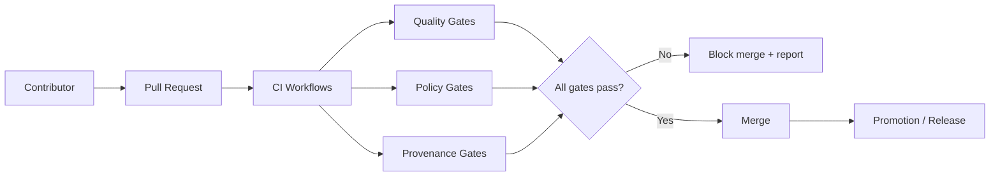

<!-- [KFM_META_BLOCK_V2]
doc_id: kfm://doc/3c0d5c1f-14d4-4b4f-9b2b-9bc3d5c1c7b0
title: .github/README — GitHub Governance & Community Files
type: standard
version: v1
status: draft
owners: kfm-engineering; kfm-governance
created: 2026-02-22
updated: 2026-02-22
policy_label: restricted
related:
  - kfm://doc/kfm-definitive-design-governance-guide-vnext
  - ../README.md
  - ./CONTRIBUTING.md
  - ./SECURITY.md
  - ./CODE_OF_CONDUCT.md
tags:
  - kfm
  - github
  - governance
notes:
  - Badge row uses Shields.io (static) until repo identifiers are wired for dynamic badges.
[/KFM_META_BLOCK_V2] -->

<a id="top"></a>

# KFM GitHub Operations
Map-first • time-aware • governed delivery — **community files + CI/policy gate index**

**Status:** Draft (vNext) • **Owners:** KFM Engineering + Governance


[Quick start](#quick-start) •
[Folder map](#folder-map) •
[CI and promotion gates](#ci-and-promotion-gates) •
[Issue and PR templates](#issue-and-pr-templates) •
[Governance and policy](#governance-and-policy) •
[Security](#security-and-responsible-disclosure) •
[Contacts](#contacts-and-owners)

---

## Quick start

- **Filing an issue:** use the templates in `.github/ISSUE_TEMPLATE/` (bug, feature, governance, data/pipeline, story node).
- **Opening a PR:** follow `CONTRIBUTING.md`, keep changes small, and include evidence (links, citations, or artifact hashes).
- **Changing data or policy behavior:** expect CI to **fail-closed** until promotion/metadata/policy gates pass.

> NOTE  
> This README is an **index + contract** for the GitHub-side “trust membrane” (workflows, templates, and guardrails).  
> If a link 404s, it means the file hasn’t been created in this repo yet.

---

## Folder map

Recommended (minimum) structure for `.github/`:

```text
.github/
├─ README.md                      # This file
├─ CODEOWNERS                     # Ownership + review routing (REQUIRED)
├─ CODE_OF_CONDUCT.md             # Community standards (REQUIRED for public repos)
├─ CONTRIBUTING.md                # How to contribute (REQUIRED)
├─ SECURITY.md                    # Vulnerability reporting (REQUIRED)
├─ PULL_REQUEST_TEMPLATE.md       # PR checklist (RECOMMENDED)
├─ ISSUE_TEMPLATE/                # Issue forms (RECOMMENDED)
│  ├─ bug_report.yml
│  ├─ feature_request.yml
│  ├─ governance_request.yml
│  ├─ data_pipeline_change.yml
│  └─ story_node.yml
└─ workflows/                     # CI, policy gates, release gates (REQUIRED)
   ├─ ci.yml
   ├─ policy-gates.yml
   ├─ provenance-audit.yml
   └─ release.yml
```

### What belongs here vs elsewhere

- Put **repository-wide defaults** here: templates, owner routing, CI policy gates, security policy.
- Put **product docs** in `/docs` (or the repo root `README.md`).
- Put **data schemas / contracts** in their owning package/module (then referenced by CI).

---

## CI and promotion gates

KFM uses “fail closed” gates to protect integrity, provenance, and policy obligations.



### Gate categories

**Quality**
- formatting/lint
- unit/integration tests
- typed builds (TypeScript) where applicable

**Security**
- dependency scanning (and lockfile integrity)
- SAST/secret scanning (block leaked credentials)

**Governance**
- **policy label required** on datasets, docs that affect behavior, and Story Nodes
- redaction checks for restricted locations / private persons / vulnerable infrastructure

**Data truth path**
- no promotion to **Published** without metadata + validation + provenance + checksums


> WARNING  
> If permissions/sensitivity are unclear, default is **deny** (generalize/redact; require governance review).

---

## Issue and PR templates

### Issue templates

Use templates to keep triage consistent:

- **Bug report:** expected vs actual, reproducible steps, logs/artifacts.
- **Feature request:** user story, acceptance criteria, policy impacts.
- **Governance request:** policy label changes, redaction guidance, release criteria.
- **Data/pipeline change:** source/license, schema, validation rules, promotion plan.
- **Story Node:** narrative claim + evidence bundle refs + map footprint + time bounds.

### PR expectations

A PR should include:

- scope: what changed + why
- evidence: links/artifact IDs/checksums (as applicable)
- tests: added/updated, or justification if not possible
- rollback: how to revert safely
- governance: policy labels, redaction notes, approval path

---

## Governance and policy

These are the non-negotiables enforced through CI + review:

- **Evidence-first UX:** every claim should link back to evidence or be labeled **Unknown**.
- **Trust membrane:** frontends never talk directly to storage; access flows through governed APIs.
- **Promotion contract:** no RAW → Published jumps; each promotion emits an audit record.

If a change touches governance-sensitive areas, tag the PR/issue appropriately and request review from the relevant owners (see `CODEOWNERS`).

---

## Security and responsible disclosure

- Use `SECURITY.md` for reporting vulnerabilities.
- Never post secrets or exploit details in public issues.
- Security fixes should land with tests and clear rollback notes.

---

## Badge maintenance

The badges at the top use **Shields.io** and are intentionally **static** until this repo’s canonical
org/repo identifiers and workflow filenames are finalized.

When ready, swap in dynamic badges (examples):

```md


```

---

## Contacts and owners

- **Engineering owners:** see `CODEOWNERS`
- **Governance owners:** see `CODEOWNERS`
- **Security contact:** see `SECURITY.md`

---

## Definition of Done

- [ ] Badges render and reflect reality (or are clearly marked “static”)
- [ ] At least one Mermaid diagram renders
- [ ] Directory tree is present and matches current structure
- [ ] Templates exist for the main work types (bug/feature/governance/data/story)
- [ ] CI workflows enforce fail-closed promotion/policy gates
- [ ] Links are relative and lintable (no broken internal links)
- [ ] Policy labels + redaction defaults are stated (default-deny if unclear)

---

[Back to top](#top)
