<div align="center">

# Kansas Frontier Matrix (KFM) — Governed Geospatial & Historical Knowledge System 🧭🗺️

**KFM turns heterogeneous Kansas history + geospatial data into a governed, evidence-first system:**  
**data → pipeline → catalogs → governed APIs → Focus Mode + map UI**.

<br/>


<!-- OPTIONAL: replace ORG/REPO with real values once workflows exist -->
<!--
[](https://github.com/ORG/REPO/actions/workflows/ci.yml)
[](https://github.com/ORG/REPO/actions/workflows/docs.yml)
[](https://github.com/ORG/REPO/actions/workflows/policy.yml)
-->

</div>

---

## Why KFM Exists

Kansas history and geography live across **maps, archives, datasets, and narrative sources**. KFM’s mission is to unify those sources into a **reproducible, inspectable, citation-first** system that supports:

- **Layered maps over time** (raster + vector, historical → modern)
- **Text-to-place linkage** (documents tied to locations + dates)
- **Governed AI** that *must* show its work (citations + audit references)
- **Public-facing exploration** (web map UI + Focus Mode)

> [!IMPORTANT]
> KFM is a **governed** system. If evidence cannot be resolved, the system must **abstain** rather than guess.

---

## Table of Contents

- [Non-Negotiables (Read This First)](#non-negotiables-read-this-first)
- [How KFM Works (End-to-End)](#how-kfm-works-end-to-end)
- [Architecture (Clean Layers + Trust Membrane)](#architecture-clean-layers--trust-membrane)
- [Data Lifecycle (Raw → Work → Processed)](#data-lifecycle-raw--work--processed)
- [Focus Mode (Cite or Abstain)](#focus-mode-cite-or-abstain)
- [Repository Layout](#repository-layout)
- [Getting Started](#getting-started)
- [CI Gates (Quality, Governance, Supply Chain)](#ci-gates-quality-governance-supply-chain)
- [Contributing](#contributing)
- [Security](#security)
- [Roadmap](#roadmap)

---

## Non-Negotiables (Read This First)

KFM’s “boss mode” invariants are enforced as design + CI requirements:

| Invariant | What it means | Why it exists | Enforced by |
|---|---|---|---|
| **Trust membrane** | UI/external clients never access databases directly; all access goes through **governed API + policy boundary** | Prevents bypassing governance, provenance, and sensitivity rules | API gateway + policy middleware |
| **Fail-closed policy** | If policy cannot prove a request is allowed, **deny** | Safer-than-sorry for sensitive or uncertain cases | Policy-as-code (OPA) default deny |
| **Dataset promotion gates** | Only promoted datasets can serve production queries | Stops “raw”/unvalidated artifacts from becoming “truth” | CI checksums + catalog validation |
| **Focus Mode must cite or abstain** | Every answer returns citations + an **audit reference** | Prevents hallucinations; ensures accountability | Evidence resolution API + UI audit panel |

> [!NOTE]
> These invariants are explicitly called out in the KFM blueprint docs (trust membrane, fail-closed checks, STAC/DCAT/PROV promotion gates, and “cite or abstain”).  

---

## How KFM Works (End-to-End)

```mermaid
flowchart LR
  A[External Sources<br/>maps • records • APIs • archives] --> B[Ingest + Normalize<br/>fetch • convert • reproject • parse]
  B --> C[data/raw<br/>immutable inputs]
  C --> D[data/work<br/>intermediate + QA]
  D --> E[data/processed<br/>serving truth]
  E --> F[Catalogs<br/>STAC + DCAT + PROV]
  F --> G[Governed APIs<br/>data • tiles • search • evidence]
  G --> H[UI + Focus Mode<br/>map • timeline • story nodes]
  G --> I[Audit Ledger<br/>append-only<br/>policy + AI outputs]
```



---

## Architecture (Clean Layers + Trust Membrane)

KFM is built with strict boundaries:

- **Domain layer:** pure entities/models (no DB/UI dependencies)
- **Use case/service layer:** workflows + business rules; depends only on interfaces
- **Interfaces/integration layer:** ports/contracts + adapters; API boundaries live here
- **Infrastructure layer:** PostGIS/PostgreSQL, graph DB, search/vector, object storage, runtime hosts

```mermaid
flowchart TB
  UI["Frontend: React/Map UI"] -->|"HTTPS"| GW["API Gateway"]
  Ext["External Clients"] -->|"HTTPS"| GW

  GW --> POL["Policy (OPA) — default deny"]
  POL --> GW

  GW --> API["App Services — Use Cases"]
  API -->|"ports"| Repo["Repo Interfaces"]
  Repo --> PG["PostGIS/Postgres"]
  Repo --> GDB["Graph DB"]
  Repo --> OBJ["Object Storage (COGs • catalogs • docs)"]
  API --> AUD["Audit Ledger (append-only)"]
```



> [!IMPORTANT]
> **Trust membrane** = the rule that the UI never talks directly to storage, and core logic never bypasses repository interfaces.

---

## Data Lifecycle (Raw → Work → Processed)

KFM treats **promotion** as a governed act:

- **raw**: immutable source captures (files/API snapshots)
- **work**: intermediate transforms + validation reports
- **processed**: the only zone eligible for serving production answers/layers

### Promotion Gate Checklist (CI-Enforced)

A dataset can be promoted only when:

- [ ] License present
- [ ] Sensitivity classification present
- [ ] Schema + geospatial checks pass
- [ ] Checksums computed
- [ ] **STAC/DCAT/PROV** artifacts exist and validate
- [ ] Audit event recorded
- [ ] Human approval if sensitive

> [!TIP]
> Treat catalogs + provenance as first-class outputs: promotion is blocked if run records or validation reports are missing.

---

## Focus Mode (Cite or Abstain)

**Focus Mode** is KFM’s grounded assistant. It must:

- Provide **citations/footnotes** that resolve to governed evidence
- Produce an **audit reference** for every answer
- **Abstain** when evidence cannot be resolved

### Evidence Resolution (Design Contract)

Every provenance/citation reference must be resolvable via an API endpoint, including (examples):

- `prov://...`
- `stac://...`
- `dcat://...`
- `doc://...`
- `graph://...`

> [!WARNING]
> If a claim cannot be grounded, the correct behavior is: **“Not enough evidence to answer (see audit_ref …)”**.

---

## Repository Layout

This README assumes a repo layout that supports governance + CI gates. Adjust names, keep the intent.

```text
.
├── .github/
│   ├── README.md
│   ├── workflows/
│   │   ├── ci.yml
│   │   ├── docs.yml
│   │   ├── policy.yml
│   │   └── data-gates.yml
│   ├── ISSUE_TEMPLATE/
│   └── PULL_REQUEST_TEMPLATE.md
├── docs/
│   ├── architecture/
│   ├── governance/
│   ├── runbooks/
│   └── story-nodes/
│       └── templates/
├── services/
│   ├── api-gateway/
│   ├── focus-mode/
│   ├── data-catalog/
│   └── policy/
├── packages/
│   ├── ui/
│   └── shared/
├── data/
│   ├── raw/
│   ├── work/
│   ├── processed/
│   └── catalog/
│       ├── stac/
│       ├── dcat/
│       └── prov/
├── infra/
│   ├── docker/
│   ├── k8s/
│   └── terraform/
├── scripts/
└── Makefile
```

> [!NOTE]
> If you are using the GitHub **organization profile README**, GitHub expects `./profile/README.md` inside the `.github` repo. This file is still useful as an org-wide engineering front door.

---

## Getting Started

> [!IMPORTANT]
> The commands below are **template-friendly**. Replace with your real Make targets / Compose files once confirmed.

### Prerequisites

- Docker / container runtime
- Git
- (Optional) Node.js + package manager for UI
- (Optional) Python toolchain for ingestion scripts

### Local Dev (Illustrative)

```bash
# 1) Clone
git clone https://github.com/ORG/REPO.git
cd REPO

# 2) Bring up infra (db/object store/etc.)
docker compose up -d

# 3) Run services
make dev

# 4) Run governance gates locally
make lint test policy-test data-validate
```

---

## CI Gates (Quality, Governance, Supply Chain)

A minimal “governed CI” set should include:

- [ ] **Docs:** lint + link-check + template validator
- [ ] **Stories:** Story Node validator + citation resolution
- [ ] **Data:** STAC/DCAT/PROV validation + checksums
- [ ] **Policy:** `opa test` regression suite
- [ ] **Supply chain:** SBOM (SPDX) + provenance attestation (SLSA/in-toto)

<details>
<summary><strong>Recommended CI philosophy</strong></summary>

- Fail fast on policy violations (default deny).
- Treat data/catalog validation as “tests,” not as “best effort.”
- Require proofs (checksums + provenance) before serving new datasets.

</details>

---

## Contributing

We welcome contributions—**with provenance**.

### Contribution Rules (Short Version)

- Every dataset change must include:
  - source reference + license
  - sensitivity classification
  - validation report
  - catalog updates (STAC/DCAT/PROV)
- Every Story Node must include citations for factual claims.
- PRs should be small, reversible, and testable.

### Pull Request Checklist

- [ ] Linked issue (or created one)
- [ ] Tests updated/added
- [ ] Docs updated (if behavior changed)
- [ ] Policy impact reviewed (if relevant)
- [ ] Data gates pass (if relevant)

---

## Security

- Use **least privilege** access in services.
- Secrets never committed to Git.
- Policy changes require review and regression tests.

> [!WARNING]
> Governance is part of security: sensitivity handling and policy enforcement are not optional.

---

## Roadmap

High-level build order (to avoid rework):

1. **Governed API gateway + policy-as-code** (fail-closed)
2. **Catalog + provenance primitives** (STAC/DCAT/PROV)
3. **Promotion gates + audit ledger** (CI-enforced)
4. **Focus Mode evidence resolution** (citations + audit_ref)
5. UI: map layers + timeline + evidence review

---

## Provenance (Governing Docs)

KFM is anchored on governed design artifacts (internal):

- Next-Gen Blueprint & Primary Guide (build-ready boundaries + guarantees)
- Data Source Integration Blueprint (connectors + data lifecycle + gates)
- Data source inventory (licenses + access patterns + coverage)

---

<div align="center">

**KFM Principle:** *If it can’t be traced, it can’t be trusted.* 🔎

</div>
