<!--
GOVERNED ARTIFACT NOTICE
FILE: .github/README.md
This README defines repo governance + CI enforcement surfaces. Changes are production changes.
If you change meaning (not just phrasing), route through governance review (CODEOWNERS + CI gates).

KFM RULE: This document is a contract. If the repo cannot satisfy a stated “Required” item, that is a
governance gap and MUST fail closed until remediated (or the contract is amended via governance review).
-->

# .github/ — KFM GitHub Operations, Governance & CI Gates


> [!IMPORTANT]
> **Why this file exists**
>
> This `.github/README.md` is the **single source of truth (SSoT)** for GitHub operations and CI enforcement:
> what must exist in `.github/`, which checks are mandatory, and which rules are **non-negotiable**.
>
> **Change impact:** Treat changes to this file as **production changes** (trust boundary + enforcement surface).

---

## 📌 Quick Links

Repo governance surfaces:
- Repo root README (system guarantees): `../README.md`
- CODEOWNERS: `./CODEOWNERS` ✅ *(required)*
- Security policy: `./SECURITY.md` ✅ *(required)*
- Contributing: `../CONTRIBUTING.md` ⛳ *(recommended; required if repo is open to external contributions)*
- PR template: `./PULL_REQUEST_TEMPLATE.md` ⛳ *(recommended; required once multiple contributors exist)*
- Workflows: `./workflows/` ✅ *(required)*
- Dependabot: `./dependabot.yml` ⛳ *(recommended; required once dependencies exist)*
- Release drafter config: `./release-drafter.yml` 🟦 *(optional)*
- Issue templates: `./ISSUE_TEMPLATE/` ⛳ *(recommended; required for governance incidents in mature repos)*

Governed planes (contracts must align):
- Docs: `../docs/README.md`
- Data: `../data/README.md`
- Backend: `../src/README.md`
- Web UI: `../web/README.md`
- Tools: `../tools/README.md`
- Tests: `../tests/README.md`
- Releases: `../releases/README.md`

---

## 🧭 Table Of Contents

- [Governance Header](#governance-header-treat-as-production)
- [Authority Ladder](#authority-ladder-github-operations)
- [Non-Negotiables](#non-negotiables-kfm-invariants)
- [Contract-To-Gate Mapping](#contract-to-gate-mapping-what-proves-what)
- [Governance Surfaces](#governance-surfaces-what-is-protected)
- [Required `.github/` Inventory](#required-github-inventory)
- [CODEOWNERS Contract](#codeowners-contract-coverage--validation)
- [PR And Issue Workflow Contract](#pr-and-issue-workflow-contract-evidence--incidents)
- [Repository Settings Baseline](#repository-settings-baseline-required-to-hold-the-line)
- [Branch Protections And Required Checks](#branch-protections-and-required-checks)
- [Status Check Contract](#status-check-contract)
- [Check Run Naming Contract](#check-run-naming-contract-github-actions-reality-check)
- [Required Workflow Inventory](#required-workflow-inventory-stable-names--outputs)
- [CI Artifacts And Reporting Contract](#ci-artifacts-and-reporting-contract)
- [CI Gate Matrix](#ci-gate-matrix-no-merge-without-proof)
- [Promotion Contract Enforcement](#promotion-contract-enforcement)
- [Evidence Resolver Contract](#evidence-resolver-contract)
- [Focus Mode And Story Nodes Governance](#focus-mode-and-story-nodes-governance)
- [Kill Switch Requirements](#kill-switch-requirements)
- [Policy Parity: CI And Runtime](#policy-parity-ci-and-runtime)
- [Workflow Security](#workflow-security)
- [Supply Chain](#supply-chain-release-and-deploy)
- [Dependency Updates Policy](#dependency-updates-policy-dependabotrenovate)
- [Governance Config Drift Detection](#governance-config-drift-detection-settings-are-part-of-the-system)
- [Governance Incidents And Break-Glass](#governance-incidents-and-break-glass)
- [When CI Fails](#when-ci-fails-quick-diagnosis)
- [Definition Of Done](#definition-of-done-for-githubreadmemd)

---

## Governance Header (Treat As Production)

| Field | Value |
|---|---|
| Document | `.github/README.md` |
| Status | **Governed** (changes require review) |
| Applies to | workflows, branch protections, CODEOWNERS, templates, release gating, promotion enforcement |
| Version | `v1.8.1` *(bump when meaning changes)* |
| Effective date | **2026-02-15** |
| Review cadence | quarterly + out-of-band for security advisories/toolchain changes |
| Owners | defined in `.github/CODEOWNERS` ✅ *(required)* |
| Review triggers | changes touching `.github/**`, `policy/**`, `contracts/**`/`schemas/**`, `data/**`, `docs/**`, `releases/**` |

> [!WARNING]
> **Fail-closed governance rule:** If a required enforcement surface is missing (policy, receipts, catalogs, contract tests, workflow hardening), the system denies promotion/merge/release by default.

---

## Authority Ladder (GitHub Operations)

If something conflicts, resolve in this order:

1) **Repo guarantees** (`../README.md` and this file)  
2) **Fail-closed policy** (default deny beats convenience)  
3) **Contracts/schemas** (`contracts/**` or `schemas/**`)  
4) **Receipts + catalogs** (`data/work/**`, `data/catalog/**`)  
5) **Workflows** (`.github/workflows/**`) must implement (not redefine) the contract  
6) **Runbooks/docs** (`docs/**`) clarify, but do not weaken gates  

> [!NOTE]
> If you need to relax an invariant: write an ADR, update contracts + tests first, then adjust gates. Never weaken gates as a shortcut.

---

## Non-Negotiables (KFM Invariants)

1) **Trust membrane**
- UI/external clients never access databases or object storage directly.
- All access is via governed API gateway + policy decision point.
- Core backend logic never bypasses repository interfaces to talk to storage.

2) **Fail-closed policy**
- Default deny at policy boundaries (runtime + CI).
- Missing policy inputs / missing receipts / missing catalogs / missing citations → deny/abstain.

3) **Promotion Contract is mandatory**
- Raw → Work → Processed promotion requires:
  - receipts (run manifest/record) + validation reports
  - deterministic checksums
  - catalogs (DCAT always; STAC conditional; PROV required)
  - sensitivity classification + redaction provenance
- No contract → no publish.

4) **Deterministic identity**
- `spec_hash = sha256(JCS(spec))` (RFC 8785 canonical JSON).
- Receipts include `spec_schema_id` + `spec_recipe_version` where applicable.

5) **Evidence-first**
- Evidence references are resolvable (`prov://`, `stac://`, `dcat://`, `doc://`, `graph://`, optional `oci://`).
- Focus Mode must cite or abstain and always returns `audit_ref`.

6) **Immutability**
- `releases/` is append-only; never edit an existing release folder.

---

## Contract-To-Gate Mapping (What Proves What)

This table answers the recurring “missing thing” question: **which CI checks prove which promises**.

| Repo promise (root README) | CI check(s) that prove it | Runtime enforcement surface |
|---|---|---|
| Trust membrane (no direct DB/object access) | `build` + `security` (static checks) + optional e2e | network policy + API gateway + authn/authz |
| Fail closed (default deny) | `policy` (OPA/conftest regressions) | PDP denies on missing inputs / load failures |
| Processed serves truth | `receipts` + `catalogs` | API reads only from processed catalogs |
| Promotion Contract required | `receipts` + `catalogs` + `contracts` | deny serving artifacts lacking proofs |
| Deterministic spec hashing | `receipts` | receipt validator + determinism checks |
| Evidence refs resolvable | `stories` + (contract tests) | evidence resolver: 404/403 semantics |
| Cite-or-abstain + audit_ref | `stories` + `policy` + (focus contract tests) | Focus/Story response validator + audit sink |
| Immutable releases | `release` (and `supply-chain` when enabled) | append-only release folder + checksum verify |

> [!IMPORTANT]
> If a promise has no proving CI gate, it is **not a guarantee** yet.

---

## Governance Surfaces (What Is Protected)

These paths are governance-critical and must be CODEOWNED and CI-gated:

- `.github/**` (workflows, templates, CODEOWNERS, security policy, issue templates)
- `policy/**` (OPA/Rego, tests, bundles)
- `contracts/**` and/or `schemas/**` (Promotion Contract + receipt/catalog/api schemas)
- `data/**` (zones, catalogs, receipts, checksums)
- `docs/**` (standards, templates, governance docs, Story Nodes)
- `src/**` (API boundary, pipelines, evidence resolver, audit)
- `releases/**` (immutable shipping records)

> [!CAUTION]
> Any attempt to weaken gates for these surfaces is a **governance incident** until reviewed and resolved.

---

## Required `.github/` Inventory

This section is intentionally explicit. If any **Required** item is missing, CI must fail closed.

| Path | Required | Purpose | Owner surface |
|---|---:|---|---|
| `.github/README.md` | ✅ | This governance + CI contract | CODEOWNERS |
| `.github/CODEOWNERS` | ✅ | Review enforcement for governed paths | CODEOWNERS |
| `.github/SECURITY.md` | ✅ | Vulnerability reporting + security expectations | CODEOWNERS |
| `.github/workflows/` | ✅ | CI gatehouse + release workflows | CODEOWNERS |
| `.github/PULL_REQUEST_TEMPLATE.md` | ⛳ | PR evidence checklist (recommended) | CODEOWNERS |
| `.github/dependabot.yml` | ⛳ | Dependency updates + hygiene (recommended) | CODEOWNERS |
| `.github/ISSUE_TEMPLATE/` | ⛳ | Standardized issues + incidents (recommended) | CODEOWNERS |
| `.github/release-drafter.yml` | 🟦 | Release note automation (optional) | CODEOWNERS |
| `.github/actions/` | 🟦 | Reusable composite actions (optional; if used, must be pinned + CODEOWNED) | CODEOWNERS |

> [!IMPORTANT]
> If you add any new `.github/**` file, it is automatically a governance surface and must be CODEOWNED.

### Recommended issue templates (mature governance)

If `./ISSUE_TEMPLATE/` exists, include these names (or equivalents):

- `governance-incident.yml` *(required once break-glass exists)*
- `security-vulnerability.yml` *(or direct to SECURITY.md)*
- `dataset-onboarding.yml`
- `contract-change.yml`
- `policy-change.yml`

---

## CODEOWNERS Contract (Coverage + Validation)

A common “missing part” is **CODEOWNERS drift**: the file exists, but it doesn’t actually protect the trust surfaces.

### Coverage requirements (minimum)

`./CODEOWNERS` MUST:

- Cover **all governance surfaces** listed above.
- Include explicit ownership for:
  - `.github/workflows/**` (workflows are the gatehouse)
  - `policy/**` (default deny is life-or-death for governance)
  - `contracts/**` / `schemas/**` (Promotion Contract + schemas)
  - `data/**` and `releases/**` (truth + shipping records)
- Avoid “orphan paths” where a new directory can be created without an owner.

### Validation requirements (required)

CI must include a **CODEOWNERS validation gate** that fails closed if:

- CODEOWNERS has syntax errors,
- required governed path patterns are missing, or
- protected paths are not actually owned (e.g., wildcard mistakes).

> [!TIP]
> Put the CODEOWNERS validator under `tools/` and run it in the `contracts` or `policy` workflow as an early step.

<details>
  <summary><strong>Example minimal CODEOWNERS patterns (illustrative)</strong></summary>

```text
# Governance gatehouse
.github/ @ORG/kfm-governance

# Policy and contracts
policy/ @ORG/kfm-governance @ORG/kfm-security
contracts/ @ORG/kfm-governance
schemas/ @ORG/kfm-governance

# Truth surfaces
data/ @ORG/kfm-data-stewards @ORG/kfm-governance
releases/ @ORG/kfm-release-managers @ORG/kfm-governance

# Product/code planes
src/ @ORG/kfm-backend
web/ @ORG/kfm-frontend
docs/ @ORG/kfm-docs
tests/ @ORG/kfm-quality
tools/ @ORG/kfm-quality
```
</details>

---

## PR And Issue Workflow Contract (Evidence + Incidents)

### Pull request evidence contract (recommended → required when >1 contributor)

PRs that touch governance surfaces MUST include:

- **What changed** (short)
- **What contract it affects** (Promotion/Policy/Evidence/Audit/etc.)
- **What proof exists** (CI artifacts, reports)
- **How to verify locally** (commands)
- **Risk notes** (what could break; rollback)

> [!NOTE]
> If `.github/PULL_REQUEST_TEMPLATE.md` exists, it should include a checklist aligned to the required CI gates.

### Governance incident mechanics (required once break-glass exists)

Repo must have:
- an issue template for governance incidents *(recommended above)*,
- labels:
  - `governance-incident`
  - `security`
  - `policy-change`
  - `contract-change`
  - `dataset-onboarding`
  - `release-blocker`
- a documented “close-the-loop” expectation:
  - restore gates
  - add regression tests
  - publish incident summary (internal is fine)

---

## Repository Settings Baseline (Required To Hold The Line)

These are **GitHub settings** (not files) that must be configured. If not configured, treat as a governance gap.

> [!IMPORTANT]
> The repo is not “governed” because a README says so. It becomes governed when GitHub settings enforce it.

### Required org/repo settings (minimum)

- Require PRs (no direct pushes) on protected branches
- Require CODEOWNERS reviews
- Require status checks to pass (no bypass)
- Disallow force-push on protected branches
- Enable secret scanning + push protection (where available)
- Enable dependency graph + Dependabot alerts
- Enable code scanning (e.g., CodeQL) on default branch

### Recommended hardening (strongly recommended)

- Require 2FA for organization members
- Require signed commits and signed tags
- Require branches to be up to date before merging
- Linear history (unless merge commits are used for audit semantics)
- Restrict who can bypass branch protections to a minimal “break-glass” group
- Protect tags used for releases (e.g., `v*`) to prevent tag rewriting

<details>
<summary><strong>Verification checklist for maintainers (manual)</strong></summary>

- [ ] Branch protection rule exists for `main` (and `release/*` if used)
- [ ] Required status checks list matches this README
- [ ] CODEOWNERS review is required and cannot be bypassed
- [ ] Secret scanning / push protection enabled
- [ ] Code scanning enabled and scheduled
- [ ] “Allow GitHub Actions to create and approve pull requests” disabled unless explicitly needed
- [ ] Tag protection exists for release tags (if org supports it)
- [ ] Merge method policy is explicit (squash vs merge vs rebase) and consistent with audit needs

</details>

---

## Branch Protections And Required Checks

### Required branch protection settings (e.g., `main`)

- PRs required; no direct pushes
- CODEOWNERS reviews required
- Required status checks must pass (**no bypass**)
- No force push
- “Require branches to be up to date before merging” *(recommended)*
- Signed commits and signed tags *(strongly recommended; enforce when org is ready)*
- Linear history *(recommended unless you rely on merge commits for audit semantics)*

---

## Status Check Contract

These checks are **merge-blocking** on governed branches.

### Required status checks (minimum)

| Check name | Gate intent | “Fail closed” definition |
|---|---|---|
| `docs` | Documentation correctness | lint/link/template/citations must pass |
| `stories` | Story Node governance | schema + citation resolvability must pass |
| `contracts` | Contract validity | schemas + fixtures + compat tests pass |
| `receipts` | Promotion proof | run manifests/checksums/spec_hash pass |
| `catalogs` | Catalog/provenance | DCAT always; STAC conditional; PROV required |
| `policy` | Policy-as-code | unit + regression tests pass (default deny holds) |
| `api-contract` | API stability | `/api/v1` non-breaking changes only |
| `build` | Repo build health | build/lint/test/smoke pass |

### Recommended status checks

| Check name | Adds protection for | Notes |
|---|---|---|
| `security` | SAST/SCA/secrets | Code scanning + dependency review + secret scans |
| `supply-chain` | Release integrity | SBOM + provenance attestations + signature verify |
| `e2e` | UI/API integration | Nightly/pre-release |
| `watchers` | Connectors integrity | Only if watchers exist and can be exercised |
| `config-drift` | GitHub settings drift | See [Config Drift](#governance-config-drift-detection-settings-are-part-of-the-system) |

> [!IMPORTANT]
> If you change the **name** of any required check, you must update:
> 1) Branch protection rules, **and**
> 2) Any documentation referencing the check, **and**
> 3) Any CI dashboards/runbooks.

---

## Check Run Naming Contract (GitHub Actions Reality Check)

This is a frequently-missed detail and a common “boss sees missing parts” finding:

> [!IMPORTANT]
> GitHub branch protection requires **check run names**, which (for GitHub Actions) are effectively the **job names** (or job IDs if no `name:` is set) — *not* the workflow filename, and not reliably the workflow `name:`.

### Required practices (to keep required checks stable)

- For each required check (`docs`, `policy`, etc.), ensure there is a **job** with:
  - `id:` (job key) stable, and
  - `name:` set exactly to the required check name (recommended).
- Prefer **one required job per workflow** (simple and stable).
- If you use a “mega workflow” with multiple jobs:
  - branch protection must list the **job `name` values**,
  - the required set must always run on PRs.
- If you call reusable workflows (`workflow_call`):
  - verify the resulting check run names are stable (they can differ from expectations).

<details>
  <summary><strong>Minimal stable check naming skeleton (recommended)</strong></summary>

```yaml
name: docs

on:
  pull_request:
  push:
    branches: [main]

permissions:
  contents: read

jobs:
  docs:
    name: docs
    runs-on: ubuntu-latest
    steps:
      - uses: actions/checkout@<PINNED_SHA>
      - run: make docs-lint
```
</details>

---

## Required Workflow Inventory (Stable Names + Outputs)

The boss-level missing piece in many repos is not “what checks exist,” but **which workflow produces which check** and **what proof it uploads**.

> [!WARNING]
> **Contract:** Required checks MUST correspond to stable **job names** (see [Check Run Naming Contract](#check-run-naming-contract-github-actions-reality-check)).

### Recommended workflow files and job outputs

| Workflow file | Workflow `name:` | Job name (required check) | Runs on | Notes |
|---|---|---|---|---|
| `.github/workflows/docs.yml` | `docs` | `docs` | PR + push | markdownlint + link check + template lint |
| `.github/workflows/stories.yml` | `stories` | `stories` | PR + push | Story Node v3 schema + citation resolver |
| `.github/workflows/contracts.yml` | `contracts` | `contracts` | PR + push | JSON Schema + compat tests + CODEOWNERS validation |
| `.github/workflows/receipts.yml` | `receipts` | `receipts` | PR + push | spec_hash + checksums + run manifests |
| `.github/workflows/catalogs.yml` | `catalogs` | `catalogs` | PR + push | DCAT/STAC/PROV validators + link integrity |
| `.github/workflows/policy.yml` | `policy` | `policy` | PR + push | opa test + conftest + regression suite |
| `.github/workflows/api-contract.yml` | `api-contract` | `api-contract` | PR + push | OpenAPI diff + breaking change gate |
| `.github/workflows/build.yml` | `build` | `build` | PR + push | build + unit tests + smoke |
| `.github/workflows/security.yml` | `security` | `security` | schedule + PR | CodeQL + dependency review + secret scans |
| `.github/workflows/config-drift.yml` | `config-drift` | `config-drift` | schedule + manual | checks GitHub settings baseline |
| `.github/workflows/supply-chain.yml` | `supply-chain` | `supply-chain` | release/tag | SBOM + attestations + signatures |
| `.github/workflows/release.yml` | `release` | *(not a merge gate)* | tag | writes immutable release records |
| `.github/workflows/break-glass.yml` | `break-glass` | *(restricted)* | manual | emergency containment only |

> [!NOTE]
> If the repo uses fewer workflows, it is still responsible for producing the **required status checks** above.
> “One mega workflow” is acceptable if it emits the same check names, fails closed, and uploads required artifacts.

### Workflow authoring rules (mandatory)

- Third-party actions MUST be pinned by commit SHA.
- `permissions:` MUST be minimal per workflow and per job.
- Workflows MUST be fork-safe (no secrets to untrusted PRs).
- Each gate MUST upload proof artifacts (see next section).

---

## CI Artifacts And Reporting Contract

CI is not just pass/fail. CI must produce **reviewable evidence**.

### Required artifact outputs (minimum)

| Gate | Must upload artifacts | Format expectations |
|---|---|---|
| `docs` | lint report + link check report | `report.json` *(machine)* + `report.md` *(human)* |
| `stories` | schema validation report + citation resolution report | machine + human |
| `contracts` | schema validation output + compat diff report | machine + human |
| `receipts` | receipt validation report + checksum verification report | machine + human |
| `catalogs` | validation output + cross-link integrity report | machine + human |
| `policy` | opa/conftest output + regression summary | machine + human |
| `api-contract` | OpenAPI diff (breaking/non-breaking) | machine + human |
| `build` | unit test summary + smoke logs | machine + human |

> [!IMPORTANT]
> “Works on my machine” is not evidence. If a gate asserts a guarantee, it must upload proof that reviewers can inspect.

### Artifact naming contract (recommended)

To make artifacts predictable:

- Artifact name: `kfm-ci-<gate>-reports`
- Inside artifact:
  - `reports/<gate>/report.json`
  - `reports/<gate>/report.md`
  - optional raw logs under `reports/<gate>/logs/**`

### Use GitHub Step Summary (recommended)

Each job should also write a short summary to `GITHUB_STEP_SUMMARY` linking:
- what was checked,
- what artifacts were uploaded,
- failure hints (when failing).

### Artifact retention and sensitivity

- Artifacts must not include secrets or sensitive coordinates.
- Prefer redaction/generalization in reports when needed.
- Retention should be long enough for incident analysis:
  - recommend ≥ 30 days for PR artifacts
  - recommend ≥ 180 days for release artifacts

---

## CI Gate Matrix (No Merge Without Proof)

This is the “merge gatehouse” for the truth path.

```mermaid
flowchart LR
  PR[Pull Request] --> C1[CI: required checks]
  C1 -->|pass| R[CODEOWNERS approvals]
  R --> M[Merge to protected branch]
  M --> REL[Release workflow]
  REL --> PROM[Promotion gates: raw→work→processed]
  PROM --> SERVE[Governed API + Policy]
  SERVE --> UX[UI + Story Nodes + Focus Mode]
```



### Docs & Story Nodes

Required validations:
- Markdown lint (style + structure)
- Link-check (internal + external per policy)
- Template validation (Story Node v3)
- Citation resolvability:
  - Every citation must resolve to an evidence view
  - Missing or unresolvable citations → fail

### Contracts & Schemas

Required validations:
- JSON Schema validation for:
  - Promotion Contract objects
  - Receipt/run manifest
  - Catalog artifacts (DCAT/STAC/PROV profiles)
  - API contract schemas (OpenAPI/GraphQL as applicable)
- Compatibility tests:
  - “No breaking change” gate for `/api/v1`
  - Breaking change → require `/api/v2` or feature flag plan

### Receipts & Promotion Proofs

Required validations:
- Run manifest schema validation
- `spec_hash` semantics validation:
  - correct canonicalization + hashing method
  - mismatch → fail
- Checksums verification for referenced artifacts
- Deterministic outputs (when applicable):
  - repeated run must not drift without version bump + new receipts

### Catalogs & Provenance

Required validations:
- DCAT validation (**always**)
- STAC validation (**when spatial assets exist**)
- PROV validation (**always**; required lineage)
- Cross-link integrity:
  - catalogs must point to checksums/receipts
  - evidence resolver must be able to traverse references
  - broken links → fail

### Policy-as-code

Required validations:
- `opa test` unit tests
- `conftest test` regression suite enforcing:
  - default deny
  - Promotion Contract guard (“no receipts → no promote/serve”)
  - cite-or-abstain contract for Focus Mode/Story Nodes
  - sensitivity gates (redaction/generalization where required)

---

## Promotion Contract Enforcement

Promotion is merge-blocking and release-blocking.

Rules:
- Any change that results in new/updated `data/processed/**` must also include:
  - valid receipts/run manifest(s)
  - checksums (deterministic)
  - catalogs (DCAT + PROV; STAC if spatial)
- CI must deny if receipts/catalogs/checksums are missing or invalid
- Runtime policy must deny serving artifacts that lack required promotion proofs

> [!WARNING]
> **No “manual exceptions”** that bypass receipts/catalogs/checksums.
> If you need an emergency action, use the break-glass workflow described below and record the incident.

---

## Evidence Resolver Contract

Acceptance criteria (non-negotiable):
- every `citation.ref` returned by Focus Mode resolves to a human-readable evidence view in **≤ 2 API calls**
- missing refs → 404
- unauthorized/policy denied → 403 (non-leaky)
- supported schemes:
  - `prov://`
  - `stac://`
  - `dcat://`
  - `doc://`
  - `graph://`
  - optional `oci://`

### Evidence resolver test harness (required)

CI must include contract tests that assert:
- scheme routing is correct
- the returned evidence view includes enough metadata to:
  - identify dataset/version
  - identify artifact checksum(s)
  - identify lineage/audit references
- “deny” responses do not leak sensitive detail

---

## Focus Mode And Story Nodes Governance

Both Story Nodes and Focus Mode are user-facing claim surfaces. They must obey the same rule:

> [!IMPORTANT]
> **Cite or abstain.** Every answer/story claim is either:
> - supported by resolvable citations, or
> - explicitly abstains, and still emits an `audit_ref`.

Required CI gates:
- Story Node schema validation
- Citation resolution tests for all `citation.ref` values
- Sensitivity gates for published Story Nodes (redaction/generalization where required)
- Output contract validation for Focus Mode response shape (when mockable in CI)

Recommended additional gates:
- Gold-set evaluation harness for Focus Mode (truthfulness + abstention correctness)
- Regression tests for known sensitive queries and denial behavior

---

## Kill Switch Requirements

KFM must be able to disable risky surfaces **without redeploying code**.

Required behavior:
- if kill switch enabled (`KFM_GOVERNANCE_KILL_SWITCH=true` or equivalent):
  - publish/promote workflows must fail closed
  - release workflows must not publish artifacts
  - Focus Mode can be disabled via policy without code changes

Recommended expansions:
- component-level switches (independent toggles):
  - `KFM_DISABLE_FOCUS_MODE`
  - `KFM_DISABLE_PUBLISH`
  - `KFM_DISABLE_PUBLIC_CATALOG`
- policy-driven overrides scoped by:
  - environment (dev/stage/prod)
  - tenant/org
  - sensitivity class

---

## Policy Parity: CI And Runtime

A common “missing thing” is **policy drift**: CI tests one policy bundle, runtime runs another.

> [!WARNING]
> **Contract:** The same policy bundle (or the same policy commit SHA) must be used for:
> - CI regression tests, and
> - runtime policy decision point (PDP).

Required practices:
- Build a versioned policy bundle artifact from `policy/**`
- Stamp it with:
  - `policy_bundle_sha`
  - source commit SHA
  - build timestamp (non-authoritative metadata)
- Validate in CI that:
  - policy bundle build is deterministic (where feasible)
  - default-deny behavior holds
- Record the policy bundle reference in release records

Recommended:
- Treat policy bundle as a release artifact, not an environment “config tweak”
- Disallow serving when policy cannot load (fail closed)

---

## Workflow Security

These rules apply to **all** workflows in `.github/workflows/**`.

### Action hardening (required)

- Pin third-party actions by **commit SHA**
- Least-privilege `GITHUB_TOKEN` permissions per job:
  - default to read-only permissions
  - elevate only where needed, per job
- Avoid `pull_request_target` unless absolutely necessary
- Treat forks/untrusted PRs as hostile:
  - do not expose secrets to untrusted code
  - do not run privileged jobs on untrusted PRs

### Runner hygiene (required)

- Avoid self-hosted runners for untrusted PRs
- If self-hosted runners are used:
  - isolate per repo or per trust tier
  - ephemeral runners preferred
  - restrict network egress where possible
  - separate “build” from “publish” runners

<details>
  <summary><strong>Recommended workflow permissions skeleton</strong></summary>

```yaml
# Example only. Align actual permissions to the minimum required.
permissions:
  contents: read

jobs:
  docs:
    name: docs
    permissions:
      contents: read
    runs-on: ubuntu-latest
    steps:
      - uses: actions/checkout@<PINNED_SHA>
      # ...
```
</details>

---

## Supply Chain (Release And Deploy)

When enabled:
- SBOM (SPDX or CycloneDX) produced/verified
- provenance attestations (in-toto/SLSA) produced/verified
- signatures verified (cosign/rekor or equivalent)

Release records in `releases/` must be immutable and verifiable by checksums.

### Release immutability contract (required)

- releases are append-only
- each release folder must include:
  - checksums
  - catalog references
  - provenance/audit references
  - (optional) SBOM + attestations
- editing an existing release folder is a governance incident

### Release tagging contract (recommended)

- Tag format: `vMAJOR.MINOR.PATCH`
- Protect tags (if org supports it) to prevent rewriting shipped tags
- Release workflow must:
  - verify required gates
  - write immutable release record folder
  - attach or reference SBOM/attestations when enabled

---

## Dependency Updates Policy (Dependabot/Renovate)

Dependency updates are a security surface. They must be governed, not “auto-merged blindly.”

Minimum rules:
- Automated update PRs must still pass **all required checks**
- Updates that touch `.github/**`, `policy/**`, `contracts/**`, or `releases/**` require CODEOWNERS review
- Auto-merge (if enabled) is allowed only for:
  - patch/minor updates that do not touch governance surfaces, and
  - after required checks pass

Recommended:
- Group GitHub Actions updates separately from application dependencies
- Pin actions; let Dependabot bump pinned SHAs where possible
- Require a `security` gate for dependency updates that introduce high/critical issues

---

## Governance Config Drift Detection (Settings Are Part Of The System)

GitHub settings are governance infrastructure. If they drift, the system is no longer governed.

### Required (manual) drift check

Maintainers MUST periodically confirm:
- branch protections still exist and match required checks,
- CODEOWNERS review is still required and non-bypassable,
- secret scanning / push protection is enabled,
- code scanning is enabled.

### Recommended (automated) drift check

Add a scheduled workflow `config-drift` that:

- calls GitHub APIs (or `gh api`) to inspect:
  - branch protection rules
  - required checks list
  - bypass allowances (who can bypass)
- fails (or opens an issue) on mismatch
- never exposes secrets (read-only)

> [!NOTE]
> Not all orgs allow reading all settings via token scope. If the drift check cannot be implemented, track as a governance gap and handle manually until enabled.

---

## Governance Incidents And Break-Glass

> [!CAUTION]
> **Definition — Governance incident:** any change, configuration, workflow, or exception that weakens
> fail-closed behavior, trust membrane enforcement, provenance/citation guarantees, or release immutability.

### Break-glass is allowed only for security containment

Break-glass is not “ship faster.” It is a documented emergency measure.

Minimum break-glass requirements:
- incident record created (issue + label `governance-incident`)
- CODEOWNERS approval required (even if expedited)
- post-incident follow-up required:
  - add/restore missing gates
  - add regression tests proving the bypass is closed
  - document root cause + remediation steps

Recommended extras:
- A dedicated `break-glass` workflow that:
  - runs only on `workflow_dispatch`
  - requires environment approvals
  - logs an incident artifact (who/what/why/when)

---

## When CI Fails (Quick Diagnosis)

| Failure | Usually means | Fix |
|---|---|---|
| `contracts` | schema mismatch / CODEOWNERS invalid | update schema + fixtures; fix CODEOWNERS; keep fail closed |
| `receipts` | run manifest invalid / checksum mismatch | regenerate deterministically; fix spec_hash or checksums |
| `catalogs` | invalid DCAT/STAC/PROV or broken links | repair catalogs; fix cross-links |
| `policy` | policy regression / drift | update policy/tests; do not weaken deny |
| `api-contract` | `/api/v1` breaking change | refactor or bump to `/api/v2` |
| `docs/stories` | template/citation failures | fix headings/citations/resolution |
| `build` | build/smoke failures | align Docker contexts; fix env wiring |
| `config-drift` | GitHub settings drift | restore protections/settings; record incident if needed |

---

## Definition Of Done For `.github/README.md`

- [ ] required `.github` items exist and are CODEOWNED
- [ ] CODEOWNERS coverage is validated and protects governance surfaces
- [ ] repository settings enforce PR + CODEOWNERS + required checks
- [ ] required status check names are stable and mapped to **job names**
- [ ] CI gates run on every PR and fail closed
- [ ] CI uploads reviewable proof artifacts (machine + human reports)
- [ ] promotion contract enforced via receipts + catalogs + checksums
- [ ] evidence resolver and cite-or-abstain contracts are enforced
- [ ] policy parity: CI bundle == runtime bundle (no drift)
- [ ] workflows are hardened (pinned actions + least privilege + fork-safe)
- [ ] releases are immutable and verifiable via `releases/`
- [ ] (recommended) config drift detection exists (manual or automated)
