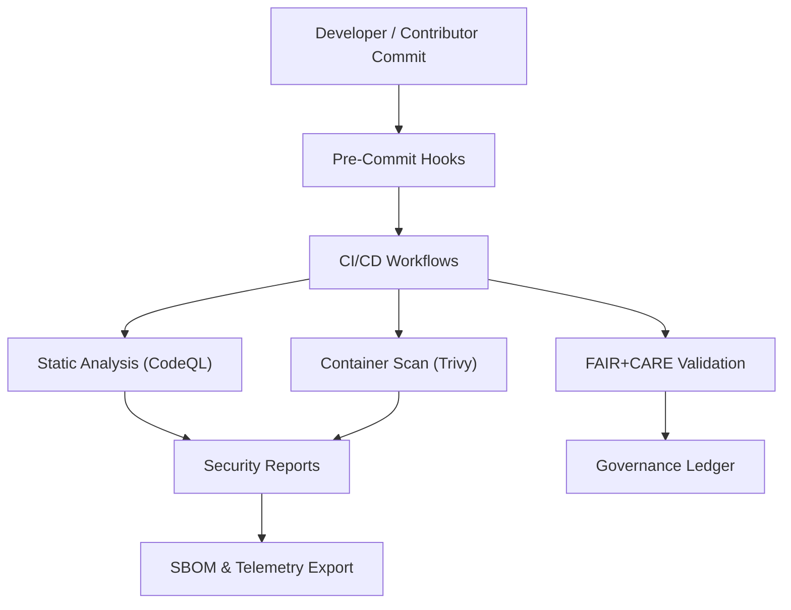

<div align="center">

# 🛡️ **Kansas Frontier Matrix — Security Policy**
`.github/SECURITY.md`

**Purpose:** Define the coordinated vulnerability disclosure, dependency management, and security response process for the Kansas Frontier Matrix (KFM) platform.  
All practices align with the **Master Coder Protocol (MCP v6.3)**, **FAIR+CARE governance**, and **Diamond⁹ Ω / Crown∞Ω Ultimate Certification** standards.

[](../docs/README.md)
[](../LICENSE)
[](../docs/standards/faircare.md)
[]()

</div>

---

## 🔐 Overview

Security within Kansas Frontier Matrix is based on **transparency, reproducibility, and prevention**.  
All contributors, maintainers, and automated workflows share responsibility for ensuring that data, code, and deployment pipelines remain safe, ethical, and auditable.

The project’s open-source ecosystem runs on **containerized, dependency-scanned infrastructure** and adheres to security best practices from:
- **OWASP Top 10**
- **NIST SP 800-218 Secure Software Development Framework (SSDF)**
- **GitHub Advanced Security** and **SLSA 1.0** provenance standards

---

## 🧩 Scope

This policy applies to:
- The **monorepo** (`KansasFrontierMatrix`) including all code under `/src`, `/web`, `/tools`, and `/data`.
- All **workflows** in `.github/workflows/**`.
- Any **containers or services** deployed via Docker, Kubernetes, or GitHub Pages.
- The **Neo4j**, **FastAPI**, and **React/MapLibre** systems used in production and testing.

---

## 🚨 Reporting a Vulnerability

If you discover a security issue, please **report it responsibly** and **do not create a public GitHub issue**.

### 📬 Report via Email
Send your report to:
```
security@kansasfrontiermatrix.org
```

Include:
- A clear, descriptive summary of the issue.  
- Steps to reproduce (if applicable).  
- Potential impact and affected files or modules.  
- Your contact information for follow-up.

You will receive acknowledgment **within 72 hours**, and a response or resolution plan **within 10 business days**.

---

## 🔒 Responsible Disclosure Policy

We adhere to **Coordinated Vulnerability Disclosure (CVD)** guidelines.  
To protect users and research contributors:

1. **Do not disclose** vulnerabilities publicly until an official patch is released.  
2. We may credit security researchers in release notes (with consent).  
3. All fixes are validated against test and telemetry environments prior to public deployment.  
4. Affected users are notified through the **CHANGELOG** and **releases/v*/sbom.spdx.json**.  

---

## 🧮 Automated Security Workflows

KFM uses continuous scanning and dependency validation via GitHub Actions.  

| Workflow | Function | Schedule |
|-----------|-----------|-----------|
| `codeql.yml` | Static code analysis for Python, JavaScript, and TypeScript. | Weekly |
| `trivy.yml` | Scans Docker images and dependencies for vulnerabilities. | Weekly + on push |
| `dependabot.yml` | Automatic dependency version checks and security alerts. | Daily |
| `faircare-validate.yml` | Verifies data governance (ethical & licensing compliance). | On PR |
| `audit-logs.yml` | Generates build audit trail and hashes. | On release |

All reports are logged in:
```
reports/security/{codeql|trivy|dependabot}/
```

Results feed into the system-wide telemetry at:
`releases/v9.7.0/focus-telemetry.json`

---

## 🧰 Secure Development Practices

### ✅ General Rules
- All commits must be **signed (`--signoff`)** and verified.  
- Only **FAIR+CARE-validated datasets** are allowed in `data/sources/`.  
- Sensitive data (e.g., API keys) must never be committed; use **GitHub Secrets**.  
- Dependencies are reviewed quarterly and locked in **requirements.txt** and **package-lock.json**.  
- Code reviews require **two approvals** for any security-sensitive changes.  

### 🐳 Containers
- Each Docker image is scanned with **Trivy** before merge or release.  
- Base images must be minimal and verified (`debian:bookworm-slim` or `python:3.10-slim`).  
- No `root` containers are permitted; non-root users are enforced via Dockerfiles.  

### 🔑 Secrets Management
- Environment secrets (`API_KEYS`, `DEPLOY_TOKEN`, `NEO4J_PASS`) are stored in GitHub Encrypted Secrets.  
- Secrets are rotated every 90 days and access is restricted to approved maintainers.  

---

## 🧾 Security Architecture Diagram



---

## 🧱 Provenance, Auditing & SBOMs

Each release generates an **SPDX Software Bill of Materials** and provenance attestation.

| File | Description |
|------|--------------|
| `releases/v9.7.0/sbom.spdx.json` | Lists all components and their licenses. |
| `releases/v9.7.0/focus-telemetry.json` | Aggregates build metrics and validation status. |
| `reports/audit/github-security-ledger.json` | Chronological log of vulnerability scans and resolutions. |

These files are immutable, timestamped, and referenced by the governance ledger under `docs/standards/governance/`.

---

## ⚖️ FAIR+CARE Security Governance

KFM applies **FAIR+CARE** not only to data, but also to software security:

| Principle | Application |
|------------|--------------|
| **Findable** | Vulnerability reports tracked via internal issue codes and changelogs. |
| **Accessible** | Public summaries shared after patch deployment. |
| **Interoperable** | SBOMs use SPDX + CycloneDX formats for cross-platform compatibility. |
| **Reusable** | Reproducible builds validated through SLSA provenance. |
| **CARE** | Ensures no exploit or data practice harms communities or stakeholders. |

---

## 🧩 Reporting Channels

| Contact Type | Channel | Response SLA |
|---------------|----------|---------------|
| Security Vulnerabilities | `security@kansasfrontiermatrix.org` | 72 hours |
| Governance or Ethical Concerns | `governance@kansasfrontiermatrix.org` | 5 business days |
| Data Breach or Privacy Issue | Internal KFM Ethics Council | 48 hours (triage) |
| General Questions | [GitHub Discussions](https://github.com/bartytime4life/Kansas-Frontier-Matrix/discussions) | Ongoing |

---

## 🕰️ Version History

| Version | Date | Author | Summary |
|----------|------|---------|----------|
| v9.7.0 | 2025-11-05 | A. Barta | Created unified SECURITY policy with FAIR+CARE integration and CI automation. |
| v9.5.0 | 2025-10-20 | A. Barta | Added Trivy and SBOM attestation workflows. |
| v9.3.1 | 2025-09-02 | KFM Core Team | Refined disclosure timelines and automated alerting. |
| v9.0.0 | 2025-06-01 | KFM Core Team | Initial security and governance policy. |

---

<div align="center">

**© 2025 Kansas Frontier Matrix — MIT / CC-BY 4.0**  
Maintained under **Master Coder Protocol v6.3** · FAIR+CARE Certified · Diamond⁹ Ω / Crown∞Ω Ultimate Certified  
For urgent vulnerabilities: [security@kansasfrontiermatrix.org](mailto:security@kansasfrontiermatrix.org)

</div>
