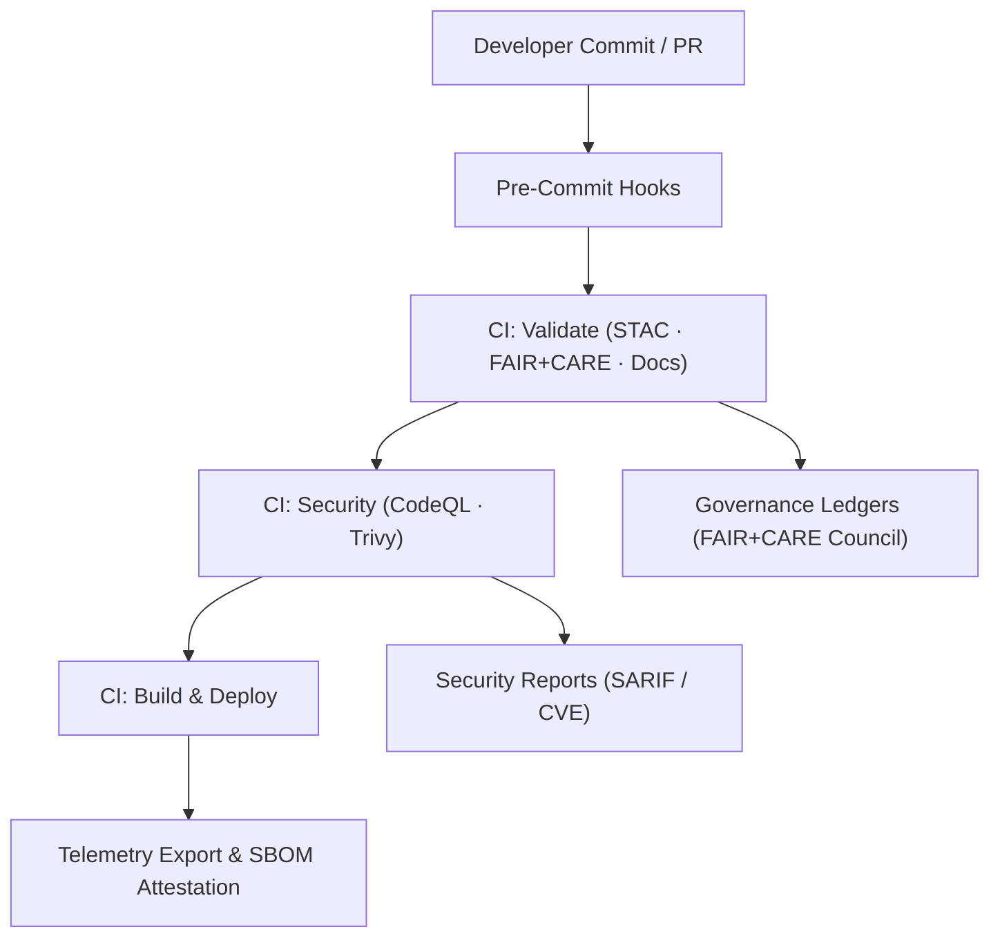

<div align="center">

# 🛡️ **Kansas Frontier Matrix — Security Policy**  
`.github/SECURITY.md`

**Purpose:**  
Define coordinated vulnerability disclosure (CVD), secure development lifecycle, CI-first security controls, and supply-chain provenance so software, datasets, and models are **safe, auditable, and ethical** under **MCP-DL v6.3**, **FAIR+CARE**, and **SLSA**.

[](../docs/README.md)
[](../LICENSE)
[](../docs/standards/faircare.md)
[]()

</div>

---

## 📘 Overview

Security at KFM follows **transparency → prevention → reproducibility**.  
We adopt **OWASP Top 10**, **NIST SSDF (SP 800-218)**, **SLSA 1.0** provenance, and **GitHub Advanced Security**. Results are exported to a single snapshot:

```
../releases/v10.2.0/focus-telemetry.json
```

> All security artifacts are referenced by **SBOM/manifest**:  
> `../releases/v10.2.0/manifest.zip` · `../releases/v10.2.0/sbom.spdx.json`

---

## 🧩 Scope

This policy covers:

- **Monorepo:** `src/`, `web/`, `data/`, `tools/`, `.github/`  
- **Workflows:** `.github/workflows/**`  
- **Runtime artifacts:** Docker images, static site, API services  
- **Stacks:** Neo4j (graph), FastAPI/GraphQL (API), React/MapLibre (web)

---

## 🚨 Reporting a Vulnerability (CVD)

**Do not file a public issue.** Report privately:

```text
security@kansasfrontiermatrix.org
```

Include:
- Summary, impact, suspected CWE/CVE, and **CVSS v3.1** score if available  
- Reproduction steps, affected files/modules, and PoC  
- Environment details and logs (if available)  
- Your contact and disclosure preferences (credit/anonymity)

**SLA:** Acknowledge within **72 hours**; mitigation plan within **10 business days**.

Optional encrypted channel: provide your PGP key in the email to arrange secure exchange.

---

## 🔒 Responsible Disclosure

- No public disclosure until a **patch/release** is available and users have a remediation path.  
- Researchers may be credited in release notes (with consent).  
- Fixes are validated in CI and **staged with telemetry** before deployment.  
- Notices appear in the CHANGELOG and within **SBOM** (`sbom.spdx.json`) + **manifest**.

**Embargo Window:** Default **30 days** (can vary by severity/coordination).

---

## 🧭 Severity, Triage & Remediation

| Severity | Criteria (illustrative) | Target Response | Target Fix |
|---|---|---|---|
| **CRITICAL** | RCE, auth bypass, secret exposure, supply-chain compromise | 24h triage | 7 days |
| **HIGH** | Privilege escalation, significant data disclosure | 48h triage | 14 days |
| **MEDIUM** | XSS/CSRF with limited blast radius, info leak | 5 days | 30 days |
| **LOW** | Best-practice deviation, non-exploitable misconfig | 10 days | 45 days |

> ⚠️ **Important:** We **block merges** on CRITICAL CVEs or CRITICAL static-analysis findings until remediated.

---

## ⚙️ Workflow → Security Artifact Mapping

| Workflow | Purpose | Primary Artifacts |
|---|---|---|
| `codeql.yml` | Static code analysis (Python, JS/TS) | `reports/security/codeql/*.sarif` |
| `trivy.yml` | Image & dependency CVE scanning (fail on **CRITICAL**) | `reports/security/trivy/*.json` |
| `faircare-validate.yml` | Ethical governance for datasets | `reports/fair/faircare_summary.json` |
| `docs-lint.yml` | Policy/doc conformance & metadata checks | `reports/self-validation/docs/lint_summary.json` |
| `ai-model-audit.yml` | Bias, drift, explainability attestations | `reports/audit/ai_model_faircare.json` |
| `telemetry-export.yml` | Consolidated security & build metrics | `../releases/v10.2.0/focus-telemetry.json` |

---

## 🛡️ Secure Development Practices

### ✅ General Rules
- **Signed commits** and verified authorship (GPG/SSH), signed tags & releases  
- **No secrets in Git** — use **GitHub Encrypted Secrets / OIDC** only  
- **Dependency locks** maintained (Dependabot + quarterly review)  
- **Two approvals** for security-sensitive changes  
- **Reproducible builds** with checksums and **SLSA** attestations

### 🐳 Containers
- Minimal, non-root images (e.g., `python:3.11-slim`, `debian:bookworm-slim`)  
- Trivy scan required (CRITICAL ⇒ **block**)  
- Immutable digests pinned in CI (no `latest`)

### 🔑 Secrets Management
- Secrets: `API_KEYS`, `DEPLOY_TOKEN`, `NEO4J_PASS` → **GitHub Secrets**  
- **Rotation ≤ 90 days**; least-privilege scopes  
- Secret usage audited via workflow logs and OIDC policies

---

## 🧮 Security Architecture (CI-First)



**Ledgers (immutable):**  
`../docs/reports/audit/{github_workflows_ledger.json, governance_ledger.json, release-manifest-log.json}`

---

## 🔗 Supply-Chain Provenance & SBOMs

| File | Description |
|---|---|
| `../releases/v10.2.0/sbom.spdx.json` | SPDX inventory (licenses, packages, checksums) |
| `../releases/v10.2.0/manifest.zip` | Release manifest (artifact list + hashes) |
| `../releases/v10.2.0/focus-telemetry.json` | Build, validation, and security metrics |
| `../docs/reports/audit/release-manifest-log.json` | Append-only release proofs |
| _Optional_: `../releases/v10.2.0/bom.cdx.json` | CycloneDX export for tooling parity |

> SBOM entries link to security outputs so verification is **one hop** from a release tag.

---

## ⚖️ FAIR+CARE Security Governance

Security is held to FAIR+CARE, extending ethics to code, data, and AI:

| Principle | Application |
|---|---|
| **Findable** | Vulnerabilities tracked with IDs & ledger references |
| **Accessible** | Post-patch public summaries; artifacts in repo |
| **Interoperable** | SPDX & CycloneDX supported for SBOM export |
| **Reusable** | Reproducible builds with SLSA attestations |
| **CARE** | Handling avoids harm to communities/contributors; context preserved |

---

## 🔁 Branch Protection & Access Controls

| Control | Policy |
|---|---|
| Reviews | ≥ 2 approving reviews required |
| Status Checks | All CI workflows green before merge |
| Force Push | Disabled on `main` |
| Allowed Actors | Least-privilege teams; fine-grained PATs |
| Audit Trail | Workflow + ledger entries for every release |

---

## 📮 Security Contacts

| Topic | Channel | SLA |
|---|---|---|
| Vulnerabilities | `security@kansasfrontiermatrix.org` | 72 hours |
| Ethics/Governance | `governance@kansasfrontiermatrix.org` | 5 business days |
| Data Breach | FAIR+CARE Council (internal) | 48 hours triage |
| General Support | GitHub Discussions | Ongoing |

---

## 🕰️ Version History

| Version | Date | Author | Summary |
|---|---|---|---|
| v10.2.2 | 2025-11-12 | FAIR+CARE Council & DevSecOps | Aligned to v10.2: severity matrix, CVSS guidance, OIDC secrets policy, immutable ledger references, energy/CO₂ telemetry. |
| v10.0.0 | 2025-11-09 | A. Barta | Upgraded to v10: added AI audit workflow, ISO 50001/14064 telemetry linkage, CycloneDX export note, and SLSA provenance alignment. |
| v9.7.0 | 2025-11-05 | A. Barta | Unified SECURITY policy with FAIR+CARE and CI automation; added workflow→artifact map. |
| v9.5.0 | 2025-10-20 | A. Barta | Introduced Trivy scanning and SBOM attestation. |
| v9.3.1 | 2025-09-02 | KFM Core Team | Refined disclosure timelines and Dependabot cadence. |
| v9.0.0 | 2025-06-01 | KFM Core Team | Initial security policy and governance integration. |

---

<div align="center">

**© 2025 Kansas Frontier Matrix — MIT / CC-BY 4.0**  
Maintained under **Master Coder Protocol v6.3** · FAIR+CARE Certified · Diamond⁹ Ω / Crown∞Ω Ultimate Certified  
[Back to Automation Overview](README.md) · [Governance Charter](../docs/standards/governance/ROOT-GOVERNANCE.md)

</div>