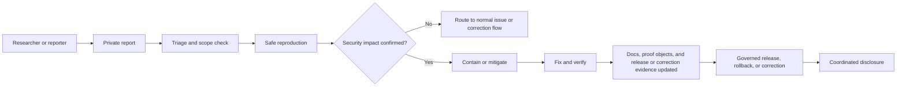

<!-- [KFM_META_BLOCK_V2]
doc_id: kfm://doc/<NEEDS-VERIFICATION-UUID>
title: KFM GitHub Security Policy
type: standard
version: v1
status: draft
owners: @bartytime4life
created: <NEEDS-VERIFICATION-DATE>
updated: <NEEDS-VERIFICATION-DATE>
policy_label: public
related: [../README.md, ../CONTRIBUTING.md, ./README.md, ./CODEOWNERS, <NEEDS-VERIFICATION: ../SECURITY.md>]
tags: [kfm, security, github, disclosure]
notes: [UUID and dates need verification, verify live owner mapping against ./CODEOWNERS, keep one canonical disclosure-policy path across this file and any root SECURITY.md if present]
[/KFM_META_BLOCK_V2] -->

# KFM GitHub Security Policy

Private-first vulnerability reporting, safe handling, and coordinated disclosure for Kansas Frontier Matrix repository surfaces.

| Field | Value |
|---|---|
| Status | experimental *(document status: `draft`)* |
| Owners | `@bartytime4life` *(verify against live `./CODEOWNERS` before merge)* |
| Path | `.github/SECURITY.md` |
| Repo fit | GitHub-facing vulnerability-reporting and disclosure entrypoint for repo-wide security issues |
| Confirmed adjacent surfaces | [`../README.md`](../README.md) · [`../CONTRIBUTING.md`](../CONTRIBUTING.md) · [`./README.md`](./README.md) · [`./CODEOWNERS`](./CODEOWNERS) |
| Canonical disclosure path | `.github/SECURITY.md` *(if a root `../SECURITY.md` exists, make it a short pointer or exact mirror after repo verification)* |
| Quick jumps | [Scope](#scope) · [Repo fit](#repo-fit) · [Accepted inputs](#accepted-inputs) · [Exclusions](#exclusions) · [Report a vulnerability](#report-a-vulnerability) · [Good-faith research and safe harbor](#good-faith-research-and-safe-harbor) · [Supported scope](#supported-scope) · [Security-affecting change checklist](#security-affecting-change-checklist) · [FAQ](#faq) |


> [!IMPORTANT]
> Keep one canonical disclosure-policy path. If the repo also keeps a root `../SECURITY.md`, either reduce that file to a short pointer or keep it word-for-word aligned with this file after live repo verification.

> [!NOTE]
> This draft is intentionally strict about uncertainty. Private-reporting inboxes, GitHub private-advisory settings, acknowledgement windows, branch-protection details, CODEOWNERS enforcement, and exact workflow names must be rechecked in the live repository before publication.

## Scope

Use this file for KFM’s public-facing security entrypoint: how to report vulnerabilities privately, what kinds of issues count as security problems, and how coordinated disclosure should work for repo-wide security-affecting issues.

KFM treats security as part of the governed publication system, not as a detached hardening appendix. That means this file covers more than classic software defects. It also covers failures that could weaken the trust membrane, let derived layers masquerade as truth, bypass policy or review gates, expose sensitive material, or let AI/runtime surfaces answer without governed evidence.

[Back to top](#kfm-github-security-policy)

## Repo fit

**Path:** `.github/SECURITY.md`  
**Role:** GitHub-facing disclosure and reporting surface for repository-wide security issues.

**Upstream context**
- [`../README.md`](../README.md) — repo identity and high-level project framing
- [`../CONTRIBUTING.md`](../CONTRIBUTING.md) — contributor workflow and normal non-security change paths
- [`./README.md`](./README.md) — `.github/` operating context
- [`./CODEOWNERS`](./CODEOWNERS) — review ownership boundary

**Downstream effect**
- private report intake
- maintainer triage and containment
- governed remediation, mitigation, rollback, or correction
- release/correction evidence updates
- coordinated disclosure once users are not needlessly exposed

> [!WARNING]
> Treat any unverified root-level `SECURITY.md`, private-advisory setting, workflow path, or escalation alias as a merge-time verification item, not as a settled repo fact.

## Accepted inputs

Use this policy for private reports involving the following security-affecting categories.

| Report type | Examples | Why it belongs here |
|---|---|---|
| Access-control or boundary failure | auth bypass, privilege escalation, direct client access to canonical stores, direct client access to model runtime, steward-surface privilege bleed | These weaken the trust membrane and least-privilege posture. |
| Evidence or citation failure | broken evidence resolution, consequential uncited output, policy-bypass retrieval, stale or unsupported claims presented as current | In KFM, trust failures are security failures. |
| Policy or release-integrity failure | missing proof objects, broken promotion gate, unsigned release artifact, spec-hash drift, missing redaction/generalization, incorrect review state | Publication and promotion are governed security transitions. |
| Secrets, supply-chain, or automation failure | credential leaks, long-lived automation secrets, workflow over-permission, dependency or attestation failure, signing-chain weakness | These can compromise both delivery trust and runtime safety. |
| Runtime exposure or unsafe serving | public exposure of local model runtime, canonical store exposure, insecure service defaults, ungoverned internal surface exposed externally | These threaten both confidentiality and controlled response behavior. |
| Availability or correction-path failure | denial-of-service, rollback gap, correction failure, stale-without-warning behavior, release that cannot be withdrawn cleanly | KFM must preserve safe negative outcomes and recoverability. |
| Rights or sensitivity leakage | exact-location exposure, release of redaction-sensitive material, unresolved rights posture, unsafe archival/heritage disclosure | KFM security includes stewardship and publication safety, not just exploit prevention. |

## Exclusions

| Exclusion | Why it stays out | Where it goes instead |
|---|---|---|
| Feature requests, product ideas, or normal UX feedback | Not security by itself | [`../CONTRIBUTING.md`](../CONTRIBUTING.md) or normal issue flow |
| Ordinary data/content corrections with no confidentiality, integrity, release, or policy impact | These follow governed correction paths, not security disclosure | normal correction / review workflow |
| Canonical policy rule bodies, schemas, or test fixtures | This file should not become a policy store or contract registry | policy / contract surfaces |
| Environment-specific incident commands or operator-only recovery details | Public policy should not become an internal runbook dump | internal runbooks and ops docs |
| Public proof-of-concept release before coordination | Can increase user exposure before containment | private reporting path only |
| Social engineering, retaliatory access, counterattack, or hackback | Explicitly incompatible with responsible disclosure posture | prohibited |

## KFM security posture

KFM security is broader than generic web-application hardening. The repo should treat the following as non-negotiable:

| Principle | What it means here |
|---|---|
| Trust membrane | Clients and public surfaces must not bypass governed APIs to reach canonical stores, raw artifacts, caches, or model runtimes directly. |
| Governed publication | Security starts before runtime: intake, validation, review, promotion, release, correction, and rollback all carry trust obligations. |
| Authoritative vs. derived separation | Canonical truth stays distinct from search, graph, vector, tile, cache, export, and summary layers. |
| Fail closed | Missing evidence, unclear rights, broken citations, unresolved sensitivity, or missing review should block, narrow, generalize, deny, or abstain rather than publish optimistically. |
| Short-lived automation identity | Delivery automation should prefer GitHub App and OIDC/workload identity over long-lived secrets or ambient credentials. |
| Policy in CI and runtime | Policy is not just documentation; it must gate PRs, releases, publication, and response shaping. |
| Trust-visible surfaces | Evidence, freshness, review state, rights posture, and partial/stale/generalized states should be visible where users act on them. |
| Negative outcomes are valid | `hold`, `deny`, `abstain`, `generalized`, `superseded`, and `withdrawn` are acceptable security-preserving outcomes. |

## Report a vulnerability

Report security issues privately first.

### Private reporting channel

| Field | Value |
|---|---|
| Primary private channel | `NEEDS VERIFICATION — add monitored security inbox or confirmed GitHub private reporting path` |
| Secondary / fallback | `NEEDS VERIFICATION — add confidential maintainer fallback` |
| GitHub private advisory / private reporting setting | `NEEDS VERIFICATION` |
| Public issue tracker | Do **not** use for undisclosed security reports |
| Encrypted exchange | `OPTIONAL / NEEDS VERIFICATION` |
| Acknowledgement target | `NEEDS VERIFICATION` |
| Status update cadence | `NEEDS VERIFICATION` |
| Coordinated disclosure target | `NEEDS VERIFICATION` |
| Bounty / reward program | `NEEDS VERIFICATION — do not imply one unless the live repo actually offers it` |

> [!WARNING]
> Replace the reporting placeholders above before publishing this policy as the live public repo entrypoint.

### What to send

A useful report includes:
- affected surface, path, workflow, route, or component
- clear impact statement
- reproduction steps
- smallest safe proof of concept
- expected safe behavior vs. observed behavior
- whether the issue affects confidentiality, integrity, availability, policy enforcement, evidence linkage, release integrity, review state, or correction behavior
- any logs, screenshots, digests, or receipts needed to reproduce the issue, with sensitive data minimized or redacted
- any suggested mitigation, containment, or rollback consideration

<details>
<summary><strong>Private report template</strong></summary>

```text
Subject: [KFM SECURITY] short title

Affected surface:
Environment/profile:
Impact:
Category:
Reproduction steps:
Minimal proof of concept:
Expected safe behavior:
Observed behavior:
Sensitive data touched (if any):
Suggested mitigation or containment:
Disclosure constraints or timing concerns:
Contact preference:
```

</details>

## Good-faith research and safe harbor

KFM should prefer defined lanes over silence and ambiguity.

Good-faith research is welcome when it is:
- authorized, or performed under a clearly published safe-harbor lane
- privacy-respecting and data-minimizing
- limited to what is necessary to demonstrate the issue
- promptly and privately reported
- documented clearly enough to support verification and remediation
- careful not to degrade availability, expose unrelated data, or expand access beyond the minimum needed

If you accidentally encounter a vulnerability, stop after confirming the issue, avoid unrelated access, preserve the minimum evidence needed to explain what happened, and report it through the safest available private channel.

> [!NOTE]
> This section expresses intended project policy. Jurisdiction-specific legal treatment, formal safe-harbor promises, and enforcement details must be reviewed against the live repo policy, operator contacts, and applicable law before being treated as a legal guarantee.

### Out-of-scope and prohibited testing

Unless KFM publishes explicit written authorization, the following are out of scope:
- social engineering, phishing, or attempts against maintainers, contributors, vendors, or third parties
- physical intrusion or facility-access attempts
- denial-of-service, destructive load testing, or intentionally availability-impacting behavior
- accessing, downloading, modifying, or retaining unrelated data once exposure is proven
- pivoting into third-party, shared, or upstream systems
- mass scanning or automated exploitation beyond agreed scope
- testing that targets exact locations, culturally sensitive materials, or restricted historical/ecological content without explicit authorization
- retaliatory access, counterattack, or hackback

[Back to top](#kfm-github-security-policy)

## Supported scope

Exact supported version numbers and live release inventory were not directly verified for this draft. Until the live repo surfaces those details, use the matrix below.

| Scope | Current posture |
|---|---|
| Exact version / release matrix | `NEEDS VERIFICATION` |
| Repository surfaces that affect governed publication, policy, verification, runtime trust, or release integrity | In scope |
| Public-facing behavior that can weaken evidence visibility, review state, rights posture, or freshness signaling | In scope |
| Derived layers such as search, graph, vector, tile, cache, export, summary, and AI response surfaces | In scope when the issue affects truth, policy inheritance, rebuildability, or user safety |
| Local-only or hosted runtime profiles described by KFM doctrine | In scope when the issue affects exposure, policy enforcement, evidence resolution, or auditability |
| Superseded, stale-visible, generalized, withdrawn, or corrected outputs | Still reportable; remediation may be correction, withdrawal, redaction, generalization, or rollback rather than a code patch |
| Third-party infrastructure not controlled by KFM | Out of scope unless the issue is created by KFM-controlled configuration, exposure, or handling |

## Triage, remediation, and disclosure

KFM should handle security issues as governed operational work, not as ad hoc heroics.

### Triage lens

Prioritize by:
- external reachability
- privilege yield
- exploit maturity
- asset criticality
- policy or evidence impact
- ease of abuse in the real environment
- blast radius across public claims, exports, review surfaces, or runtime trust objects

### Remediation model

| Outcome | Meaning |
|---|---|
| Remediation | Remove the weakness |
| Mitigation | Reduce exposure while the weakness remains |
| Acceptance | Explicitly own and time-bound residual risk |

### Disclosure model

1. Receive privately.
2. Confirm scope and authorization.
3. Reproduce safely.
4. Contain or mitigate if needed.
5. Fix.
6. Verify with negative and happy-path tests.
7. Update documentation, runbooks, and release evidence.
8. Release, correct, withdraw, or roll back with evidence-bearing traceability.
9. Coordinate disclosure once users are not needlessly exposed.

No public disclosure should outrun containment, fix verification, or a clearly defined coordinated-disclosure window.

## Reporting flow


```mermaid
flowchart LR
    A[Researcher or reporter] --> B[Private report]
    B --> C[Triage and scope check]
    C --> D[Safe reproduction]
    D --> E{Security impact confirmed?}
    E -- No --> F[Route to normal issue or correction flow]
    E -- Yes --> G[Contain or mitigate]
    G --> H[Fix and verify]
    H --> I[Docs, proof objects, and release or correction evidence updated]
    I --> J[Governed release, rollback, or correction]
    J --> K[Coordinated disclosure]
```

## Security-affecting change checklist

Use this list for any change that can affect trust, exposure, release integrity, or runtime safety.

- [ ] Threat-model impact reviewed
- [ ] Trust membrane preserved; no new direct client/store or client/model bypass
- [ ] Least-privilege impact reviewed for users, services, jobs, and secrets
- [ ] Policy and evidence resolution still occur in the request or publication path
- [ ] Negative paths tested where relevant: deny, abstain, citation-negative, stale-state, correction, rollback
- [ ] Documentation, examples, diagrams, and runbooks were updated with the behavior
- [ ] Release evidence and rollback/correction posture were reviewed
- [ ] Sensitive data, exact locations, and restricted content remain correctly withheld or generalized
- [ ] Any model runtime remains behind the governed API and is not directly exposed
- [ ] Recovery implications reviewed: backup, restore, supersession, correction notice, or withdrawal path
- [ ] Review ownership still matches [`./CODEOWNERS`](./CODEOWNERS)

## FAQ

### Can I open a public issue?

Not for undisclosed security findings. Use a private reporting path.

### What if I am not sure the issue is security-related?

Report it privately anyway if it could affect confidentiality, integrity, availability, policy enforcement, evidence linkage, release integrity, correction behavior, runtime trust, or rights/sensitivity handling.

### Do AI and evidence failures count?

Yes. In KFM, a trust failure includes uncited or unresolved consequential output, policy-bypass retrieval, unsafe model exposure, stale or generalized material presented without the right trust cues, or any route that weakens cite-or-abstain behavior.

### What if I accidentally accessed data?

Stop immediately, minimize retention, do not continue exploring unrelated data, preserve the minimum evidence needed to explain what happened, and report it privately.

### Does this policy confirm a bug bounty or reward program?

No reward program is confirmed in this draft. Add one here only if the live repo actually offers it.

### Are denial, abstention, withdrawal, or generalization valid outcomes?

Yes. KFM is fail-closed. A safe negative outcome is better than a polished but unsafe or unsupported result.

[Back to top](#kfm-github-security-policy)

## Appendix

<details>
<summary><strong>Publication-ready verification backlog</strong></summary>

Before merging this file, verify and complete the following:

- [ ] Confirm the private reporting inbox or GitHub private-reporting path.
- [ ] Confirm whether a root `../SECURITY.md` exists and decide whether it should point here or mirror this file exactly.
- [ ] Verify live owner mapping against [`./CODEOWNERS`](./CODEOWNERS).
- [ ] Replace acknowledgement, status-update, and coordinated-disclosure placeholders.
- [ ] Confirm whether the repo offers encryption guidance, a bounty program, or neither.
- [ ] Recheck live branch-protection and CODEOWNERS enforcement expectations referenced by this policy.
- [ ] Verify any linked internal runbooks or recovery docs before adding them.
- [ ] Set the final KFM metadata UUID and commit-time dates in the meta block.
- [ ] Recheck all relative links against the live checkout before commit.

</details>
