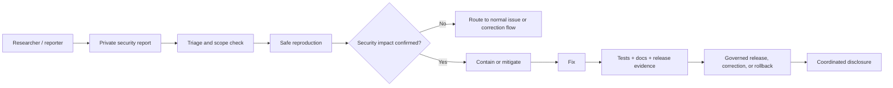

<!-- [KFM_META_BLOCK_V2]
doc_id: kfm://doc/<NEEDS-VERIFICATION-UUID>
title: KFM GitHub Security Policy
type: standard
version: v1
status: draft
owners: @bartytime4life
created: YYYY-MM-DD
updated: YYYY-MM-DD
policy_label: public
related: [../SECURITY.md, ../CONTRIBUTING.md, ../README.md, ./README.md, ./CODEOWNERS]
tags: [kfm, security, github, disclosure]
notes: [UUID and dates need verification; keep one canonical disclosure-policy path across this file and ../SECURITY.md]
[/KFM_META_BLOCK_V2] -->

# KFM GitHub Security Policy

Private-first vulnerability reporting, safe handling, and disclosure rules for repo-wide security issues in Kansas Frontier Matrix.

| Field | Value |
|---|---|
| Status | draft |
| Owners | `@bartytime4life` |
| Path | `.github/SECURITY.md` |
| Confirmed companion surfaces | [`../SECURITY.md`](../SECURITY.md) · [`../CONTRIBUTING.md`](../CONTRIBUTING.md) · [`../README.md`](../README.md) · [`./README.md`](./README.md) · [`./CODEOWNERS`](./CODEOWNERS) |
| Quick jumps | [Scope](#scope) · [Repo fit](#repo-fit) · [Security posture](#security-posture) · [Report a vulnerability](#report-a-vulnerability) · [Safe harbor](#good-faith-research-and-safe-harbor) · [Supported scope](#supported-release-scope) · [Checklist](#security-affecting-change-checklist) · [FAQ](#faq) |


> [!IMPORTANT]
> This file is the GitHub-facing disclosure entrypoint for KFM. If the repository keeps both this file and [`../SECURITY.md`](../SECURITY.md), do not let them drift: keep one canonical policy path and make the other a short pointer or remove it after repo verification.

> [!NOTE]
> Repo-facing facts below are intentionally narrow. Private advisory settings, reporting inboxes, workflow inventory, SLAs, and any incident/runbook links that are not directly confirmed should remain `NEEDS VERIFICATION` until the live repo settings and operational surfaces are checked.

## Scope

Use this file for the repo’s public-facing security entrypoint: how to report vulnerabilities privately, what kinds of issues count as security problems, what research is in scope, and how coordinated disclosure should work.

This file is for:
- private vulnerability reporting
- KFM-specific security categories such as trust-membrane bypass, policy bypass, evidence-resolution failure, release-integrity drift, rights or sensitivity leakage, and unsafe runtime exposure
- disclosure, remediation, and coordinated-release expectations
- GitHub-side security guidance that should stay aligned with review ownership and repo governance

This file is not for:
- ordinary bug reports, feature requests, or product ideas
- canonical policy rule bodies or their tests
- authoritative API contracts, schema definitions, or vocabulary files
- incident runbooks with environment-specific secrets or operator-only details
- replacing the broader project security doctrine in [`../SECURITY.md`](../SECURITY.md)

[Back to top](#kfm-github-security-policy)

## Repo fit

**Path:** `.github/SECURITY.md`  
**Role:** GitHub-facing disclosure and security-contact surface for repository-wide issues.

**Confirmed upstream anchors**
- [`../SECURITY.md`](../SECURITY.md) — broader KFM security doctrine and hardening posture
- [`../CONTRIBUTING.md`](../CONTRIBUTING.md) — normal contribution and review flow
- [`../README.md`](../README.md) — repo-wide identity, truth posture, and top-level fit
- [`./README.md`](./README.md) — `.github/` governance and collaboration surface
- [`./CODEOWNERS`](./CODEOWNERS) — current review ownership boundary

**Expected security-adjacent surfaces** *(NEEDS VERIFICATION before linking or naming as active controls)*
- `./workflows/`
- `../policy/`
- `../contracts/`
- `../docs/runbooks/`
- `../infra/`

> [!NOTE]
> Keep this file narrowly focused on disclosure and safe handling. Canonical security controls, policy logic, release proof objects, and runtime guardrails belong in their own governed paths.

## Accepted inputs

Use this policy for reports involving:

| Report type | Examples | Why it belongs here |
|---|---|---|
| Access-control failure | auth bypass, privilege escalation, direct store/model access | These threaten the trust membrane and least-privilege posture. |
| Evidence or citation failure | broken evidence resolution, uncited consequential output, stale support shown as current | KFM security includes trust failures, not just classic exploits. |
| Policy and release-integrity failure | policy bypass, missing proof objects, unsigned artifacts, rollback gap | Publication and promotion are governed security transitions in KFM. |
| Secrets, supply chain, and runtime exposure | credential leaks, dependency compromise, unsafe deployment configuration, public model exposure | These can weaken both runtime safety and release trust. |
| Availability or correction-path failure | denial-of-service, resource exhaustion, broken rollback or correction behavior | KFM must preserve safe negative outcomes and correction capability. |

## Exclusions

| Exclusion | Why it stays out | Where it goes instead |
|---|---|---|
| Feature requests or normal UX/product ideas | Not a security issue by itself | [`../CONTRIBUTING.md`](../CONTRIBUTING.md) or normal issue flow |
| Ordinary data/content corrections with no confidentiality, integrity, or policy impact | These follow governed correction flow, not security disclosure | data review / correction workflow |
| Authoritative policy rule bodies and fixtures | This file should not become a policy store | `../policy/` |
| Schemas, OpenAPI contracts, and validation vocabularies | This file may reference them, but must not replace them | `../contracts/` or `../schemas/` |
| Environment-specific incident or recovery commands | Public policy should not become an operator secret dump | runbooks under `../docs/` or `../infra/` |
| Public proof-of-concept release before coordination | Can increase exposure before containment | private reporting path only |
| Retaliatory access, hack back, or unauthorized escalation | Explicitly incompatible with KFM’s governed posture | prohibited |

## Security posture

KFM security is broader than generic web-app hardening. The repo should treat the following as non-negotiable:

| Principle | What it means here |
|---|---|
| Truth path | Trust-bearing outputs stay downstream of governed intake, validation, catalog closure, policy, review, release state, and correction. |
| Trust membrane | Clients and public surfaces must not bypass governed APIs to reach canonical stores, raw artifacts, caches, or model runtimes directly. |
| Fail closed | Missing evidence, unresolved rights, broken citations, policy ambiguity, or unverified release state should block or narrow output rather than allow best-effort publication. |
| Authoritative vs. derived separation | Search, vector, tile, graph, cache, summary, and AI layers are useful accelerators, not sovereign truth. |
| Least privilege | Security applies across onboarding, build, publish, runtime, rollback, and correction—not only at the perimeter. |
| Documentation as production surface | Security-affecting changes must update contracts, examples, runbooks, rollback notes, and release evidence in the same governed change stream. |
| Promotion as a governed state change | Release, deployment, rollback, and correction should preserve evidence, not hide it. |

## Report a vulnerability

Report security issues privately first.

### Private reporting channel

| Field | Value |
|---|---|
| Primary private channel | `NEEDS VERIFICATION — add monitored security inbox or confirmed private advisory path` |
| Secondary / fallback | `NEEDS VERIFICATION — add confidential maintainer fallback` |
| Public issue tracker | Do **not** use for undisclosed security reports |
| Encrypted exchange | `OPTIONAL / NEEDS VERIFICATION` |
| Acknowledgement target | `NEEDS VERIFICATION` |
| Status update cadence | `NEEDS VERIFICATION` |
| Coordinated disclosure target | `NEEDS VERIFICATION` |

Until these values are verified and published, keep reports private and avoid posting exploit details in issues, pull requests, discussions, or public chat.

### What to send

A useful report includes:
- affected surface, path, route, workflow, or component
- clear impact statement
- reproduction steps
- smallest safe proof of concept
- expected safe behavior vs. observed behavior
- whether the issue affects confidentiality, integrity, availability, policy enforcement, evidence linkage, release integrity, or correction behavior
- any logs, screenshots, traces, digests, or receipts needed to reproduce the issue, with sensitive data minimized or redacted
- any suggested mitigation or containment guardrail

<details>
<summary><strong>Private report template</strong></summary>

```text
Subject: [KFM SECURITY] short title

Affected surface:
Environment/profile:
Impact:
Category:
Reproduction steps:
Minimal proof of concept:
Expected safe behavior:
Observed behavior:
Sensitive data touched (if any):
Suggested mitigation/containment:
Disclosure constraints or timing concerns:
Contact preference:
```

</details>

## Good-faith research and safe harbor

KFM should prefer clear, bounded reporting lanes over silence and ambiguity.

Good-faith research is welcome when it is:
- authorized, or performed under a clearly published safe-harbor lane
- privacy-respecting and data-minimizing
- limited to what is necessary to demonstrate the issue
- promptly and privately reported
- documented clearly enough to support verification and remediation
- careful not to degrade availability, expose unrelated data, or expand access beyond the minimum needed

If you accidentally encounter a vulnerability, stop after confirming the issue, avoid unrelated access, preserve minimal notes, and report it through the safest available private channel.

### Out-of-scope and prohibited testing

The following are out of scope unless KFM publishes explicit written authorization for them:
- social engineering, phishing, or attempts against maintainers, contributors, vendors, or third parties
- physical intrusion or facility-access attempts
- denial-of-service, destructive load testing, or intentionally availability-impacting behavior
- accessing, downloading, modifying, or retaining unrelated data once exposure is proven
- pivoting into third-party, shared, or upstream systems
- mass scanning or automated exploitation beyond agreed scope
- testing that targets exact locations, culturally sensitive materials, or restricted historical/ecological content without explicit authorization
- retaliatory access, counterattack, or hack back

[Back to top](#kfm-github-security-policy)

## Supported release scope

Exact supported version numbers were not confirmed in the repo-facing evidence reviewed for this file. Until the release inventory is surfaced and linked here, use the matrix below.

| Scope | Current posture |
|---|---|
| Exact release/version matrix | `NEEDS VERIFICATION` |
| Current governed code, docs, and policy surface under active review | Treat as in scope for security reporting |
| Currently promoted release artifacts | In scope |
| Superseded, stale-visible, generalized, or withdrawn surfaces | Still reportable; remediation may be correction, withdrawal, generalization, or rollback rather than a code patch |
| Local-only phase-one runtime posture | In scope, especially for exposure, policy, evidence, and audit-path failures |
| Third-party infrastructure not controlled by KFM | Out of scope unless the issue is created by KFM-controlled configuration or handling |

## Triage, remediation, and disclosure

KFM should handle security issues as governed operational work, not as ad hoc heroics.

### Triage lens

Prioritize by:
- external reachability
- privilege yield
- exploit maturity
- asset criticality
- policy or evidence impact
- ease of abuse in the real environment
- blast radius across public claims, exports, review surfaces, or runtime trust objects

### Remediation model

| Outcome | Meaning |
|---|---|
| Remediation | Remove the weakness |
| Mitigation | Reduce exposure while the weakness remains |
| Acceptance | Explicitly own and time-bound residual risk |

### Disclosure model

1. Receive privately.
2. Confirm scope and authorization.
3. Reproduce safely.
4. Contain or mitigate if needed.
5. Fix.
6. Verify with negative and happy-path tests.
7. Update documentation, runbooks, and release evidence.
8. Release, correct, withdraw, or roll back with evidence-bearing traceability.
9. Coordinate disclosure once users are not needlessly exposed.

No public disclosure should outrun containment, fix verification, or a clearly defined coordinated-disclosure window.

## Reporting flow


```mermaid
flowchart LR
    A[Researcher / reporter] --> B[Private security report]
    B --> C[Triage and scope check]
    C --> D[Safe reproduction]
    D --> E{Security impact confirmed?}
    E -- No --> F[Route to normal issue or correction flow]
    E -- Yes --> G[Contain or mitigate]
    G --> H[Fix]
    H --> I[Tests + docs + release evidence]
    I --> J[Governed release, correction, or rollback]
    J --> K[Coordinated disclosure]
```

## Security-affecting change checklist

Use this list for any change that can affect trust, exposure, release integrity, or runtime safety.

- [ ] Threat-model impact reviewed
- [ ] Trust membrane preserved; no new direct client/store or client/model bypass
- [ ] Least-privilege impact reviewed for users, services, jobs, and secrets
- [ ] Negative paths tested where relevant: deny, abstain, citation-negative, stale-state, correction, rollback
- [ ] Policy and evidence resolution still occur in the request path
- [ ] Documentation, examples, diagrams, and runbooks were updated with the behavior
- [ ] Release evidence and rollback/correction posture were reviewed
- [ ] Sensitive data, exact locations, and restricted content remain correctly withheld or generalized
- [ ] Any model runtime remains behind the governed API and is not directly exposed
- [ ] Recovery implications reviewed: backup, restore, supersession, correction notice, or withdrawal path
- [ ] Review ownership still matches [`./CODEOWNERS`](./CODEOWNERS)

## FAQ

### Can I open a public issue?

Not for undisclosed security findings. Use a private reporting path.

### What if I am not sure the issue is security-related?

Report it privately anyway if it could affect confidentiality, integrity, availability, policy enforcement, evidence linkage, release integrity, correction behavior, or runtime trust.

### Does this policy cover AI and evidence failures?

Yes. In KFM, a trust failure includes uncited or unresolved consequential output, policy-bypass retrieval, unsafe model exposure, or any route that weakens cite-or-abstain behavior.

### What if I accidentally accessed data?

Stop immediately, minimize retention, do not continue exploring unrelated data, preserve the minimum evidence needed to explain what happened, and report it privately.

### Are denial, abstention, withdrawal, or generalization valid outcomes?

Yes. KFM is fail-closed. A safe negative outcome is better than a polished but unsafe or unsupported result.

[Back to top](#kfm-github-security-policy)

## Appendix

<details>
<summary><strong>Publication-ready verification backlog</strong></summary>

Before merging this file, verify and complete the following:

- [ ] Confirm whether this file will replace [`../SECURITY.md`](../SECURITY.md), coexist with it, or reduce one path to a short pointer.
- [ ] Replace placeholder contact channels, acknowledgement targets, status cadence, and coordinated-disclosure window.
- [ ] Confirm whether GitHub private advisory or equivalent private reporting is enabled for this repo.
- [ ] Add any repo-local incident, rollback, recovery, or advisory runbooks that should be linked from here.
- [ ] Verify whether any `.github` workflow surfaces should be referenced explicitly from this file.
- [ ] Set the final KFM metadata UUID and commit-time dates in the meta block.
- [ ] Re-check every relative link against the live checkout before commit.

</details>
