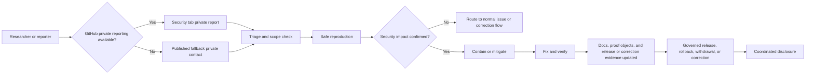

<!-- [KFM_META_BLOCK_V2]
doc_id: kfm://doc/<NEEDS-VERIFICATION-UUID>
title: KFM GitHub Security Policy
type: standard
version: v1
status: draft
owners: @bartytime4life
created: 2026-03-15
updated: 2026-03-28
policy_label: public
related: [../README.md, ../CONTRIBUTING.md, ./README.md, ./CODEOWNERS, ../SECURITY.md]
tags: [kfm, security, github, disclosure]
notes: [UUID still needs verification, created/updated dates are based on current public Git history for .github/SECURITY.md, GitHub Security page currently renders .github/SECURITY.md and exposes private reporting, both .github/SECURITY.md and root SECURITY.md still exist, fallback inbox/SLA/rulesets/branch protection still need verification]
[/KFM_META_BLOCK_V2] -->

# KFM GitHub Security Policy

Private-first vulnerability reporting, safe handling, and coordinated disclosure for Kansas Frontier Matrix repository surfaces.

| Field | Value |
|---|---|
| Status | `experimental` *(document status: `draft`)* |
| Owners | `@bartytime4life` *(confirmed by [`./CODEOWNERS`](./CODEOWNERS); broad single-owner baseline at current repo scope)* |
| Badges | ![Status badge][badge-status] ![Owners badge][badge-owners] ![Path badge][badge-path] ![Reporting badge][badge-reporting] ![Posture badge][badge-posture] ![Trust badge][badge-trust] |
| Quick jumps | [Scope](#scope) · [Repo fit](#repo-fit) · [Accepted inputs](#accepted-inputs) · [Exclusions](#exclusions) · [Supported releases and scope](#supported-releases-and-scope) · [Report a vulnerability](#report-a-vulnerability) · [Good-faith research and safe-harbor](#good-faith-research-and-safe-harbor) · [Disclosure flow](#disclosure-flow) · [Checklist](#security-affecting-change-checklist) · [FAQ](#faq) · [Appendix](#appendix) |
| Intended path | `.github/SECURITY.md` |
| Canonical disclosure path | `.github/SECURITY.md` *(root [`../SECURITY.md`](../SECURITY.md) also exists today; keep it delegating or text-aligned to avoid drift)* |

> [!IMPORTANT]
> The current public GitHub Security tab exposes **Report a vulnerability**. Use that lane first. Keep `.github/SECURITY.md` as the canonical public policy, and keep the root [`../SECURITY.md`](../SECURITY.md) delegating or text-aligned so disclosure guidance does not drift.

> [!NOTE]
> This draft is intentionally strict about uncertainty. GitHub private vulnerability reporting is visible in the current public repo UI, but monitored fallback inboxes, acknowledgement windows, rulesets, required checks, branch-protection settings, and any alternate confidential escalation path still need verification before this document is treated as fully publication-ready.

## Scope

Use this file for KFM’s public-facing GitHub security entrypoint: how to report vulnerabilities privately, what kinds of issues count as security problems, how maintainers should triage them, and how coordinated disclosure should work for repository-wide security-affecting issues.

KFM treats security as part of the governed publication system, not as a detached hardening appendix. That means this policy covers more than classic software defects. It also covers failures that could weaken the trust membrane, let derived layers masquerade as authority, bypass policy or review gates, expose sensitive material, or let AI/runtime surfaces answer without governed evidence.

[Back to top](#kfm-github-security-policy)

## Repo fit

**Path:** `.github/SECURITY.md`  
**Role:** GitHub-facing disclosure and reporting surface for repository-wide security issues.

### Upstream context

- [`../README.md`](../README.md) — repository identity and project framing
- [`../CONTRIBUTING.md`](../CONTRIBUTING.md) — normal contribution flow for non-security changes
- [`./README.md`](./README.md) — `.github/` operating context
- [`./CODEOWNERS`](./CODEOWNERS) — review ownership boundary
- [`../SECURITY.md`](../SECURITY.md) — current secondary public security-policy path that should delegate here or remain text-aligned

### Downstream effect

- GitHub private vulnerability intake through the Security tab
- public issue intake that should redirect sensitive disclosures away from [`./ISSUE_TEMPLATE/README.md`](./ISSUE_TEMPLATE/README.md)
- maintainer triage and containment
- governed remediation, mitigation, rollback, or correction
- release / correction evidence updates
- coordinated disclosure once users are not needlessly exposed

> [!WARNING]
> Treat any unpublished fallback inbox, escalation alias, ruleset assumption, required-check claim, or branch-protection expectation as a merge-time verification item, not as a settled repo fact.

## Accepted inputs

Use this policy for **private** reports involving the following security-affecting categories.

| Report type | Examples | Why it belongs here |
|---|---|---|
| Access-control or boundary failure | auth bypass, privilege escalation, direct client access to canonical stores, direct client access to model runtime, steward-surface privilege bleed | These weaken the trust membrane and least-privilege posture. |
| Evidence or citation failure | broken evidence resolution, consequential uncited output, policy-bypass retrieval, stale or unsupported claims presented as current | In KFM, trust failures are security failures. |
| Policy or release-integrity failure | missing proof objects, broken promotion gate, unsigned or unattested release artifact, spec-hash drift, missing redaction/generalization, incorrect review state | Publication and promotion are governed security transitions. |
| Supply-chain, workflow, or automation failure | credential leaks, over-permissioned GitHub Actions, review-bypass workflow logic, missing attestations, unsafe automation token usage | GitHub automation is part of KFM’s governed delivery path. |
| Runtime exposure or unsafe serving | public exposure of local model runtime, canonical-store exposure, insecure service defaults, ungoverned internal surface exposed externally | These threaten confidentiality, integrity, and controlled response behavior. |
| Availability or correction-path failure | denial-of-service, rollback gap, correction failure, stale-without-warning behavior, release that cannot be withdrawn cleanly | KFM must preserve safe negative outcomes and recoverability. |
| Rights, sensitivity, or stewardship leakage | exact-location exposure, release of redaction-sensitive material, unresolved rights posture, unsafe archival/heritage disclosure | KFM security includes stewardship and publication safety, not just exploit prevention. |
| Security-affecting documentation or disclosure-path failure | broken private reporting instructions, misleading contributor guidance, docs that route researchers into public exposure, unsafe example commands | In KFM, docs are part of the production trust surface. |

## Exclusions

| Exclusion | Why it stays out | Where it goes instead |
|---|---|---|
| Feature requests, product ideas, or normal UX feedback | Not security by itself | [`../CONTRIBUTING.md`](../CONTRIBUTING.md) or normal issue flow |
| Ordinary data/content corrections with no confidentiality, integrity, release, or policy impact | These follow governed correction paths, not security disclosure | normal correction / review workflow |
| Canonical policy rule bodies, schemas, or test fixtures | This file should not become a policy store or contract registry | policy / contract surfaces |
| Environment-specific incident commands or operator-only recovery details | Public policy should not become an internal runbook dump | internal runbooks and ops docs |
| Public proof-of-concept release before coordination | It can increase user exposure before containment | private reporting path only |
| Social engineering, retaliatory access, counterattack, or hackback | Explicitly incompatible with responsible disclosure posture | prohibited |
| Cosmetic documentation edits with no disclosure, trust, or safety consequence | Not security by itself | normal docs workflow |

## Supported releases and scope

Repository release support still needs explicit maintainer definition, but several repo-surface facts are already visible.

| Scope | Current posture |
|---|---|
| Default branch / active maintenance line | `main` |
| GitHub Releases view | `No releases currently visible` |
| Exact supported-version matrix | `NEEDS VERIFICATION` |
| Repository surfaces that affect governed publication, policy, verification, runtime trust, or release integrity | In scope |
| GitHub workflow, ruleset, CODEOWNERS, secret, attestation, or branch-protection paths that can weaken trust or release integrity | In scope |
| Public-facing behavior that weakens evidence visibility, review state, rights posture, or freshness signaling | In scope |
| Derived layers such as search, graph, vector, tile, cache, export, summary, and AI response surfaces | In scope when the issue affects truth, policy inheritance, rebuildability, or user safety |
| Local-only or privately hosted runtime profiles described by KFM doctrine | In scope when the issue affects exposure, policy enforcement, evidence resolution, or auditability |
| Superseded, stale-visible, generalized, withdrawn, or corrected outputs | Still reportable; remediation may be correction, withdrawal, redaction, generalization, or rollback rather than a code patch |
| Third-party infrastructure not controlled by KFM | Out of scope unless the issue is created by KFM-controlled configuration, exposure, or handling |

> [!NOTE]
> The absence of published GitHub Releases does not by itself define the supported-version policy. Maintainers should publish an explicit support window here if support is narrower than “current `main` branch plus unreleased repository state.”

> [!NOTE]
> Current public `main` shows `.github/workflows/README.md` only. Public GitHub Actions history remains visible, but that history should be treated as historical signal rather than proof of currently checked-in workflow YAML, required checks, or platform-side rules.

## Report a vulnerability

Report security issues **privately first**.

### Private reporting lanes

| Lane | When to use | Status |
|---|---|---|
| GitHub **Security → Report a vulnerability** | Preferred GitHub-native lane for this public repository | `CONFIRMED available` |
| Private security inbox | Fallback if maintainers publish a monitored non-GitHub confidential lane | `NEEDS VERIFICATION` |
| Confidential maintainer fallback | Use only if the primary lane is unavailable and maintainers explicitly publish a confidential fallback | `NEEDS VERIFICATION` |
| Public issue / discussion / pull request | Never for undisclosed security findings | Do **not** use |

| Field | Value |
|---|---|
| Primary private channel | `GitHub Security tab → Report a vulnerability` |
| Secondary / fallback | `NEEDS VERIFICATION — publish a monitored inbox or explicit confidential maintainer fallback if one exists` |
| Encryption / public key | `OPTIONAL / NEEDS VERIFICATION` |
| Acknowledgement target | `NEEDS VERIFICATION` |
| Status update cadence | `NEEDS VERIFICATION` |
| Coordinated disclosure target | `NEEDS VERIFICATION` |
| Bounty / reward program | `No program is confirmed in visible project evidence; verify before publication` |

> [!WARNING]
> Do not publish a fallback inbox, public key, or disclosure SLA here unless the channel is actually monitored and the response expectations are real.

> [!NOTE]
> GitHub private vulnerability reporting and `SECURITY.md` are related but distinct. In this repository the GitHub advisory intake button is currently visible, so that is the preferred lane. This file remains the canonical public policy and fallback instruction surface.

### What to send

A useful report includes:

- affected surface, path, workflow, route, or component
- clear impact statement
- reproduction steps
- the smallest safe proof of concept
- expected safe behavior vs. observed behavior
- whether the issue affects confidentiality, integrity, availability, policy enforcement, evidence linkage, release integrity, review state, correction behavior, or runtime trust
- any logs, screenshots, digests, or receipts needed to reproduce the issue, with sensitive data minimized or redacted
- any suggested mitigation, containment, or rollback consideration

<details>
<summary><strong>Private report template</strong></summary>

```text
Subject: [KFM SECURITY] short title

Affected surface:
Environment/profile:
Impact:
Category:
Reproduction steps:
Minimal proof of concept:
Expected safe behavior:
Observed behavior:
Sensitive data touched (if any):
Suggested mitigation or containment:
Disclosure constraints or timing concerns:
Contact preference:
```

</details>

[Back to top](#kfm-github-security-policy)

## Good-faith research and safe harbor

KFM should prefer defined lanes over silence and ambiguity.

Good-faith research is welcome when it is:

- authorized, or performed under a clearly published safe-harbor lane
- privacy-respecting and data-minimizing
- limited to what is necessary to demonstrate the issue
- promptly and privately reported
- documented clearly enough to support verification and remediation
- careful not to degrade availability, expose unrelated data, or expand access beyond the minimum needed

If you accidentally encounter a vulnerability, stop after confirming the issue, avoid unrelated access, preserve the minimum evidence needed to explain what happened, and report it through the safest available private channel.

> [!NOTE]
> This section expresses intended project policy, not a legal guarantee. Jurisdiction-specific legal treatment, formal safe-harbor promises, and enforcement details must be reviewed against the live repo policy, operator contacts, and applicable law before being treated as a legal assurance.

### Out-of-scope and prohibited testing

Unless KFM publishes explicit written authorization, the following are out of scope:

- social engineering, phishing, or attempts against maintainers, contributors, vendors, or third parties
- physical intrusion or facility-access attempts
- denial-of-service, destructive load testing, or intentionally availability-impacting behavior
- accessing, downloading, modifying, or retaining unrelated data once exposure is proven
- pivoting into third-party, shared, or upstream systems
- mass scanning or automated exploitation beyond agreed scope
- testing that targets exact locations, culturally sensitive materials, or restricted historical/ecological content without explicit authorization
- retaliatory access, counterattack, or hackback

## Triage, remediation, and coordinated disclosure

KFM should handle security issues as governed operational work, not as ad hoc heroics.

### Triage lens

Prioritize by:

- external reachability
- privilege yield
- exploit maturity
- asset criticality
- policy or evidence impact
- ease of abuse in the real environment
- blast radius across public claims, exports, review surfaces, or runtime trust objects

### Remediation model

| Outcome | Meaning |
|---|---|
| Remediation | Remove the weakness |
| Mitigation | Reduce exposure while the weakness remains |
| Acceptance | Explicitly own and time-bound residual risk |
| Correction / withdrawal / redaction | Repair a trust-bearing public surface even when the right response is not only a code patch |

### Coordinated disclosure model

1. Receive privately.
2. Confirm scope and authorization.
3. Reproduce safely.
4. Contain or mitigate if needed.
5. Fix.
6. Verify with negative-path and happy-path checks.
7. Update documentation, runbooks, proof objects, and release/correction evidence.
8. Release, correct, withdraw, or roll back with evidence-bearing traceability.
9. Publish coordinated disclosure once users are not needlessly exposed.

Where GitHub repository security advisories are enabled, use that private advisory flow as the preferred GitHub-native coordination surface for private discussion, fix coordination, and later publication.

No public disclosure should outrun containment, fix verification, or a clearly defined coordinated-disclosure window.

## Disclosure flow


```mermaid
flowchart LR
    A[Researcher or reporter] --> B{GitHub private reporting available?}
    B -- Yes --> C[Security tab private report]
    B -- No --> D[Published fallback private contact]
    C --> E[Triage and scope check]
    D --> E
    E --> F[Safe reproduction]
    F --> G{Security impact confirmed?}
    G -- No --> H[Route to normal issue or correction flow]
    G -- Yes --> I[Contain or mitigate]
    I --> J[Fix and verify]
    J --> K[Docs, proof objects, and release or correction evidence updated]
    K --> L[Governed release, rollback, withdrawal, or correction]
    L --> M[Coordinated disclosure]
```

Above: a high-level disclosure path showing private intake, safe reproduction, containment, fix verification, evidence updates, and coordinated disclosure.

## Security-affecting change checklist

Use this list for any change that can affect trust, exposure, release integrity, or runtime safety.

- [ ] Threat-model impact reviewed
- [ ] Trust membrane preserved; no new direct client/store or client/model bypass
- [ ] Least-privilege impact reviewed for users, services, jobs, secrets, and automation tokens
- [ ] GitHub Security tab private reporting remains enabled, or an alternate confidential lane is published in the same change
- [ ] Workflow permissions minimized and short-lived identity preferred where adopted
- [ ] CODEOWNERS, required reviews, and ruleset/branch-protection impact reviewed
- [ ] Required checks, docs gates, policy gates, and attestation/signing gates still match intended trust posture
- [ ] Policy and evidence resolution still occur in the request or publication path
- [ ] Required proof objects still exist where the lane depends on them
- [ ] Negative paths tested where relevant: deny, abstain, citation-negative, stale-state, correction, rollback
- [ ] Documentation, examples, diagrams, and runbooks were updated with the behavior
- [ ] Sensitive data, exact locations, and restricted content remain correctly withheld or generalized
- [ ] Recovery implications reviewed: backup, restore, supersession, correction notice, or withdrawal path

## FAQ

### Can I open a public issue?

Not for undisclosed security findings. Use a private reporting path instead. The current public issue-intake guidance already treats security disclosures as out-of-band from normal issue flow.

### Is GitHub private vulnerability reporting currently available here?

Yes. The repository’s public Security tab currently exposes **Report a vulnerability**. Use that lane first.

### What if I am not sure the issue is security-related?

Report it privately anyway if it could affect confidentiality, integrity, availability, policy enforcement, evidence linkage, release integrity, correction behavior, runtime trust, or rights/sensitivity handling.

### Do AI and evidence failures count?

Yes. In KFM, a trust failure includes uncited or unresolved consequential output, policy-bypass retrieval, unsafe model exposure, stale or generalized material presented without the right trust cues, or any route that weakens cite-or-abstain behavior.

### Do documentation or workflow issues count?

Yes, when they weaken disclosure safety, contributor review gates, trust cues, policy enforcement, or release integrity.

### Does GitHub private vulnerability reporting replace this file?

No. In this repository it is currently the preferred GitHub-native intake lane. This file remains the canonical public policy and fallback instruction surface.

### What if I accidentally accessed data?

Stop immediately, minimize retention, do not continue exploring unrelated data, preserve the minimum evidence needed to explain what happened, and report it privately.

### Does this policy confirm a bug bounty or reward program?

No program is confirmed in this draft. Add one here only if the live repo actually offers it.

### Are denial, abstention, withdrawal, or generalization valid outcomes?

Yes. KFM is fail-closed. A safe negative outcome is better than a polished but unsafe or unsupported result.

[Back to top](#kfm-github-security-policy)

## Appendix

<details>
<summary><strong>Publication-ready verification backlog</strong></summary>

Before merging this file, verify and complete the following:

- [ ] Reconfirm that GitHub private vulnerability reporting remains enabled and visible in the public Security tab.
- [ ] Confirm the private reporting inbox or maintainers’ fallback contact, if any exists beyond the GitHub advisory lane.
- [ ] Decide whether the root [`../SECURITY.md`](../SECURITY.md) should become a short pointer to this file or remain text-aligned with it.
- [ ] Replace acknowledgement, status-update, and coordinated-disclosure placeholders with real maintained values.
- [ ] Confirm whether the repo offers encryption guidance, a reward program, or neither.
- [ ] Recheck live rulesets, branch protection, required status checks, signed-commit settings, and CODEOWNERS enforcement expectations referenced by this policy.
- [ ] Recheck the live `.github/workflows/` inventory and any platform-side required checks before linking security expectations to specific workflow gates elsewhere.
- [ ] Ensure public issue-intake guidance continues to route undisclosed security findings away from public issues.
- [ ] Set the final KFM metadata UUID in the meta block.
- [ ] Reconfirm the `updated:` value in the meta block if this file changes again before merge.
- [ ] Recheck all relative links against the live checkout before commit.

</details>

[badge-status]: https://img.shields.io/badge/status-experimental-orange
[badge-owners]: https://img.shields.io/badge/owners-bartytime4life-lightgrey
[badge-path]: https://img.shields.io/badge/path-.github%2FSECURITY.md-blue
[badge-reporting]: https://img.shields.io/badge/reporting-private--first-red
[badge-posture]: https://img.shields.io/badge/posture-fail--closed-0a7d5a
[badge-trust]: https://img.shields.io/badge/trust-governed--publication-1f6feb
