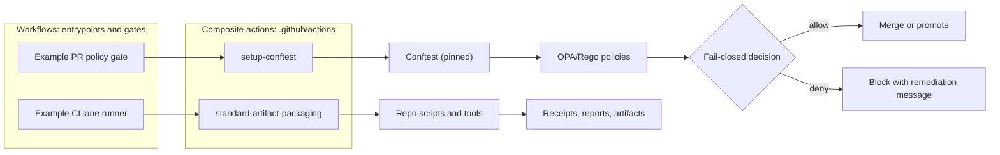

<!-- [KFM_META_BLOCK_V2]
doc_id: kfm://doc/569309c3-c3af-40d7-8e23-9f45b08c1e81
title: Reusable GitHub Actions
type: standard
version: v1
status: draft
owners: TBD
created: 2026-02-22
updated: 2026-02-24
policy_label: public
related:
  - .github/actions/
tags:
  - kfm
  - ci
  - github-actions
  - governance
notes:
  - Documents the reusable composite actions in .github/actions and their governance expectations.
[/KFM_META_BLOCK_V2] -->

# .github/actions

Reusable **composite actions** for KFM’s GitHub Actions workflows. These are repo-owned building blocks for **CI lanes**, **policy gates**, and **provenance/receipt packaging**.

**Status:** draft • **Owners:** TBD (set in `CODEOWNERS`)  
   

- [Where this fits in the repo](#where-this-fits-in-the-repo)
- [What lives here](#what-lives-here)
- [What does not live here](#what-does-not-live-here)
- [How this relates to workflows](#how-this-relates-to-workflows)
- [Directory layout](#directory-layout)
- [Action registry](#action-registry)
- [Action contract](#action-contract)
- [Conventions](#conventions)
- [Security and governance](#security-and-governance)
- [Governance triggers](#governance-triggers)
- [Receipt and provenance outputs](#receipt-and-provenance-outputs)
- [Add a new action](#add-a-new-action)
- [Testing and validation](#testing-and-validation)
- [Definition of done](#definition-of-done)

---

## Where this fits in the repo

- **Workflows** under `.github/workflows/` are the entrypoints (PR checks, scheduled jobs, release automation).
- **This directory** (`.github/actions/`) contains **repo-owned** reusable actions that workflows call via local paths:
  - `uses: ./.github/actions/<action-dir>`

> **NOTE**
> This folder is part of the **trust membrane**: actions here can affect gates, promotion, provenance, and attestations.
> Treat changes as production changes (reviewable, testable, reversible).
>
> *Guiding principle:* actions orchestrate; they should **not** silently redefine policy, bypass gates, or introduce unreviewed supply-chain risk.

---

## What lives here

This directory is for **reusable, repo-owned** GitHub Actions that:

- Reduce duplication across multiple workflows (e.g., “install pinned tool X”).
- Encapsulate *cross-cutting* CI steps (setup, validation toolchains, standardized artifact packaging).
- Keep “lane” workflows consistent (inputs change; structure stays stable).

> **NOTE**
> Keep actions small. Domain logic should generally live in versioned scripts/modules in the repo (so it can be unit tested), and actions should orchestrate those scripts.

---

## What does not live here

Do **not** put the following directly in `.github/actions/`:

- Large, complex business logic that can’t be unit tested (put it in `scripts/`, `tools/`, or a versioned package/module).
- Unpinned “install from the internet” pipelines that do not verify integrity (checksums/signatures).
- Long-lived secrets, credentials, or embedded tokens.
- One-off workflow glue that only a single workflow will ever use (keep it in the workflow file unless it will be reused).

> **WARNING**
> If an action needs elevated permissions or interacts with releases/signing/publishing, it MUST be explicitly documented and reviewed as governance-relevant.

---

## How this relates to workflows

- **Workflows** live under `.github/workflows/` (entrypoints, PR gates, scheduled automation).
- **Reusable workflows** (if used) typically live under `.github/workflows/reusables/` and are invoked via:
  - `uses: ./.github/workflows/reusables/<name>.yml`
- **Composite actions** (this folder) are invoked via:
  - `uses: ./.github/actions/<action-dir>`

### End-to-end CI and GitOps loop

Names shown are **examples / intended patterns**; update to match the repo.



---

## Directory layout

Recommended (adjust as needed):

```text
.github/
└─ actions/                                   # Reusable GitHub Actions (composite/custom) used by workflows
   ├─ README.md                               # ← You are here: index of actions + usage + governance notes
   │
   ├─ setup-conftest/                         # Example action: install/configure Conftest for policy checks
   │  ├─ action.yml                           # Action definition (inputs/outputs/runs)
   │  └─ README.md                            # Optional: per-action docs (examples, inputs, troubleshooting)
   │
   └─ <action-name>/                          # One folder per reusable action
      ├─ action.yml                           # Action definition
      └─ README.md                            # Optional: per-action docs (examples, inputs, troubleshooting)
```

---

## Action registry

Keep this table current. Each action should be **discoverable**, **reviewable**, and **scoped**.

**Lifecycle legend**
- `active`: used by at least one workflow path
- `planned`: placeholder (not yet implemented/used)
- `deprecated`: still present but scheduled for removal (include migration note)

**Governance level legend**
- `lane-helper`: developer ergonomics; does not decide allow/deny and does not publish
- `gate`: participates in allow/deny decisions (policy checks, validations)
- `publish`: signs, releases, uploads, or otherwise pushes artifacts beyond the build sandbox

> **NOTE**
> This README cannot confirm which action directories exist in the repo. Treat the table below as the **source of intent** and update it when actions are added/removed.

| Action (dir) | Exists | Lifecycle | Governance level | Type | Owner | Purpose | Inputs | Outputs | Notes |
|---|---:|---|---|---|---|---|---|---|---|
| `setup-conftest/` | ? | `planned` | `gate` | composite | `CODEOWNERS` | Install a pinned Conftest version for policy checks | `version` (opt), `arch` (opt) | `conftest-path` (opt) | Treat version bumps as **governed** changes (review + tests). If this action is not implemented, leave as `planned` or remove the row until it exists. |
| *(add here)* | ? | *(active/planned/deprecated)* | *(lane-helper/gate/publish)* | *(composite/js/docker)* | *(CODEOWNERS)* | *(what it does)* | *(inputs)* | *(outputs)* | *(security + governance notes)* |

### Keeping the registry honest

When you add/remove an action, update this table and ensure at least one CI path calls it.

Suggested quick checks (run locally):

- `ls -1 .github/actions/`
- `find .github/actions -maxdepth 2 -name action.yml -o -name action.yaml`

> **TIP**
> Keep “Owner” aligned with `CODEOWNERS` for the directory. Example:
>
> ```text
> # CODEOWNERS (example; update to match your org/team structure)
> .github/actions/ @ORG/ci-owners
> .github/actions/setup-conftest/ @ORG/security-owners
> ```

---

## Action contract

All actions in this directory MUST meet the following minimum contract so they remain safe to reuse and easy to govern.

### Required files

Each action directory contains:

- `action.yml` (or `action.yaml`) — the action definition
- (Recommended) `README.md` — usage, inputs/outputs, required permissions, failure modes

### Required documentation fields

Each action README (or a section in this README) documents:

- **Purpose**: one sentence stating what this action does and does not do
- **Inputs**: name, type/shape, defaults, validation rules
- **Outputs**: names and semantics (write to `$GITHUB_OUTPUT`, never parse logs downstream)
- **Required permissions**: minimum job `permissions:` required (note: permissions are granted by workflows, not actions)
- **Network and downloads**:
  - whether the action reaches the network
  - what it downloads
  - how integrity is verified (checksum/signature)
- **Failure modes**:
  - what can fail
  - what a developer should do next
  - how to reproduce locally (where feasible)

### Runtime invariants

- Fail closed: any validation failure exits non-zero.
- Prefer deterministic execution: same inputs should produce the same outputs.
- Do not bypass governed interfaces: if an action touches storage, catalogs, indexing, or publishing, call the approved repo scripts or governed APIs rather than reaching infrastructure directly.
- Do not print secrets, tokens, or sensitive file paths.
- If calling third-party actions or downloading binaries:
  - pin versions (prefer commit SHA pinning for actions)
  - verify checksums/signatures for binaries
  - record the versions used (logs and/or receipts)

---

## Conventions

### Naming

- Prefer kebab-case directory names: `setup-conftest`, `build-sbom`, `verify-receipts`.
- If an action is KFM-specific, prefix with `kfm-` (optional).

### Versioning and change control

- Prefer **pinned versions** for tooling installs and third-party actions.
- Treat action directories as **internal APIs** for workflows:
  - changing inputs/outputs is a breaking change for callers
  - gate/publish actions require stricter review than lane helpers

### Inputs, outputs, and logs

- Inputs: declare in `action.yml` and validate early (fail fast).
- Outputs: write to `$GITHUB_OUTPUT` (do not parse logs downstream).
- Logs:
  - Use `::group::` / `::endgroup::` sparingly to keep logs readable.
  - Never echo secrets or sensitive data.

---

## Security and governance

These are defaults; tighten further when operating on restricted data.

### Minimal permissions

- Workflows should grant the **minimum** job `permissions:` needed.
- Actions must not assume they can write releases, packages, or contents unless explicitly granted by the workflow.

> **NOTE**
> `permissions:` is configured at the workflow/job level. Actions must document the minimum permissions they require; they cannot safely assume broad defaults.

### Secrets handling

- Do not bake secrets into actions.
- Pass secrets as workflow `secrets:` to jobs and then as action inputs/env.
- Avoid printing environment variables or command arguments that might contain secrets.

### Supply chain hygiene

- Pin third-party actions (prefer commit SHA pinning where feasible).
- Prefer keyless, short-lived credentials (OIDC) over long-lived tokens when the workflow supports it.
- Avoid unverified “download and execute” steps; if downloading binaries, verify **checksum/signature**.

### Fail-closed behavior

Actions used in `gate` or `publish` roles MUST:

- Exit non-zero on any validation/policy failure.
- Produce explicit, actionable remediation messages.

---

## Governance triggers

Treat the following as **promotion-gate relevant** (requires extra review + explicit testing evidence in the PR):

| Trigger | Why it’s sensitive | Minimum expectation |
|---|---|---|
| Tool version bump (e.g., Conftest/OPA) | Can change allow/deny outcomes | Pin version, run at least one gate workflow path, record before/after behavior or rationale |
| Expanding permissions / writing `contents:` | Increases blast radius | Justify, keep least-privilege, document required permissions in action README |
| New network downloads | Supply chain risk | Pin version + verify checksum/signature; prefer vendor release artifacts |
| Changes to receipt/provenance packaging | Affects traceability | Validate schema + ensure downstream consumers still parse outputs |
| Any change that affects allow/deny decisions | Trust membrane | Fail-closed tests, remediation messaging, documented decision path |
| Any publish/signing step added | External impact | Document destinations, signing identity, and rollback plan; require explicit approval |

---

## Receipt and provenance outputs

Some actions (especially `gate` and `publish`) produce artifacts that become inputs to downstream gates, promotion, or audit. When an action affects a decision boundary, it should emit **machine-readable evidence**.

### Recommended receipt pattern

- Write structured outputs to `$GITHUB_OUTPUT` for workflow branching.
- Upload a **receipt artifact** (JSON) so decisions are reviewable after the run.

Example receipt payload (shape, not a mandated schema):

```json
{
  "receipt_version": "v1",
  "generated_at": "2026-02-24T00:00:00Z",
  "git": { "sha": "<commit-sha>", "ref": "<ref>" },
  "workflow": { "name": "<workflow>", "run_id": "<id>", "job": "<job>" },
  "tools": [
    { "name": "conftest", "version": "x.y.z", "integrity": { "sha256": "<sha256>" } }
  ],
  "decision": { "status": "deny", "reason": "policy_violation", "details_path": "reports/policy.json" },
  "artifacts": [
    { "path": "reports/policy.json", "sha256": "<sha256>" }
  ]
}
```

> **TIP**
> If you already have an established receipt schema elsewhere in the repo, reference it here and keep the examples aligned.

---

## Add a new action

1. Create a folder: `.github/actions/<action-name>/`
2. Add `action.yml` (or `action.yaml`)
3. (Recommended) Add an action-level `README.md` that satisfies the [Action contract](#action-contract)
4. Add (or extend) a workflow that calls the action so it’s exercised in CI
5. Register it in the [Action registry](#action-registry)

### Minimal composite action template

```yaml
# .github/actions/<action-name>/action.yml
name: "<Action name>"
description: "<What this action does>"
inputs:
  example_input:
    description: "Example input"
    required: false
    default: ""
outputs:
  example_output:
    description: "Example output"
    value: ${{ steps.main.outputs.example_output }}
runs:
  using: "composite"
  steps:
    - id: main
      shell: bash
      run: |
        set -euo pipefail
        echo "example_output=ok" >> "$GITHUB_OUTPUT"
```

---

## Testing and validation

Suggested minimum checks (wire these into your CI as available):

- `action.yml` schema sanity (lint)
- shell safety (`set -euo pipefail`, quoting)
- pinning / dependency review for installs
- run the action in at least one workflow path

Recommended additional checks for repo-owned composite actions:

- `actionlint` for workflow/action YAML where applicable
- `shellcheck` for any bash scripts embedded or referenced
- a “smoke workflow” that runs each `active` action at least once on PRs

> **TIP**
> A composite action is “tested” when at least one workflow path executes it and asserts expected outputs/artifacts.

---

## Definition of done

- [ ] Action is added under `.github/actions/<name>/action.yml`
- [ ] Action satisfies the [Action contract](#action-contract)
- [ ] Action appears in the [Action registry](#action-registry) with lifecycle + governance level
- [ ] Inputs/outputs are documented
- [ ] Failure modes are explicit and fail-closed
- [ ] No secrets are logged; required permissions are minimal and documented
- [ ] Tool/action versions are pinned where practical
- [ ] CI path exercises the action (at least one workflow)
- [ ] If the action participates in allow/deny or publish decisions, it emits a receipt/provenance artifact

---

<details>
<summary><strong>Optional: per-action README skeleton</strong></summary>

```markdown
# <action-name>

## Purpose

## Inputs

## Outputs

## Required permissions

## Network and downloads

## Example usage

## Failure modes
```

</details>

---

[Back to top](#githubactions)
