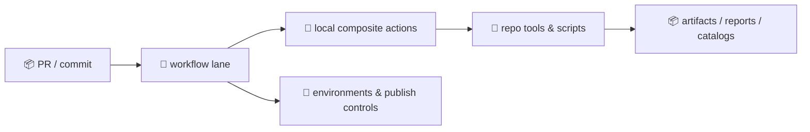
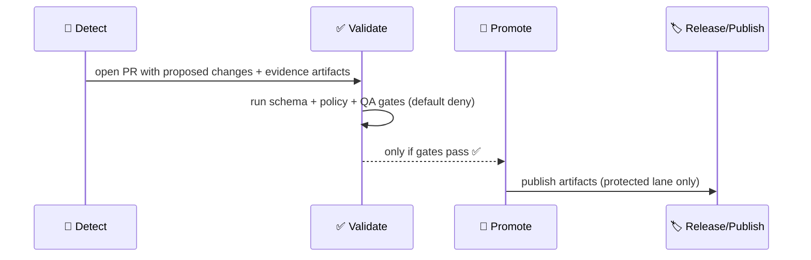

<a id="top"></a>

# 🧩 `.github/actions/` — Reusable GitHub Actions for Kansas Frontier Matrix (KFM)

[](https://github.com/bartytime4life/Kansas-Frontier-Matrix/actions/workflows/ci.yml)
[](https://github.com/bartytime4life/Kansas-Frontier-Matrix/actions/workflows/codeql.yml)
[](https://github.com/bartytime4life/Kansas-Frontier-Matrix/actions/workflows/pages.yml)


> 🧭 **What this folder is:** repo-local GitHub Actions (mostly **composite actions**) that standardize KFM’s CI/CD step-bundles so lanes stay consistent, auditable, and boring.  
> 🧾 **KFM north star:** trust first (**provenance + integrity**), then speed (**caching + parallel lanes**).  
> 🧬 **KFM evidence rule:** every dataset is a first-class citizen with a **catalog triplet** (**STAC + DCAT + PROV**) and intake is blocked when provenance/metadata is missing.  [oai_citation:0‡Kansas Frontier Matrix (KFM) – Comprehensive Architecture, Features, and Design.pdf](file-service://file-Qj23Z329hf1Q1WD86hXYfL) [oai_citation:1‡Kansas Frontier Matrix (KFM) – Comprehensive Architecture, Features, and Design.pdf](file-service://file-Qj23Z329hf1Q1WD86hXYfL)

> [!IMPORTANT]
> **Composite actions are infrastructure.** Treat them like production code:
> - least privilege 🔐
> - deterministic & idempotent outputs ♻️ (same inputs/config → same outputs; reruns are no-ops)  [oai_citation:2‡Kansas Frontier Matrix (KFM) – Comprehensive Architecture, Features, and Design.pdf](file-service://file-Qj23Z329hf1Q1WD86hXYfL)
> - contract-first validation 🧾 (schemas + profiles + API contracts)
> - provenance-first artifacts 🔎 (PROV + checksums + lineage)
> - evidence-first narrative 📚 (citations required; fact vs interpretation)
> - sovereignty + classification propagation 🛂 (no downgrades without review)
> - default-deny promotion 🚦 (fail-closed gates)
> - PR-mediated automation only 🧯 (no “agent writes to main”)

---

## 🧾 Policy metadata

| Field | Value |
|---|---|
| File | `.github/actions/README.md` |
| Status | Active ✅ *(spec + operating guide)* |
| Last updated | **2026-01-26** |
| Canonical workflow docs | `.github/workflows/README.md` |
| Canonical security policy | `SECURITY.md` *(repo root)* or `.github/SECURITY.md` *(mirror)* |
| Canonical repository contract | `docs/MASTER_GUIDE_v13.md` *(expected path; v13 contract)* |
| Canonical docs protocol | `docs/standards/KFM_MARKDOWN_WORK_PROTOCOL.md` *(front-matter + DoD)*  [oai_citation:3‡Comprehensive Markdown Guide_ Syntax, Extensions, and Best Practices.docx](file-service://file-J6rFRcp4ExCCeCdTevQjxz) |
| Policy engine | `tools/validation/policy/` *(OPA/Conftest; default-deny)*  [oai_citation:4‡Kansas Frontier Matrix (KFM) – AI System Overview 🧭🤖.pdf](file-service://file-P4zHoJicw1HG6bXmqFygG8) |
| Evidence metadata | `data/catalog/**` + `data/prov/**` *(STAC/DCAT/PROV)*  [oai_citation:5‡Kansas Frontier Matrix (KFM) – Comprehensive Architecture, Features, and Design.pdf](file-service://file-Qj23Z329hf1Q1WD86hXYfL) |
| Automation posture | W‑P‑E (Watcher → Planner → Executor) under PR gates + kill-switch |  [oai_citation:6‡Kansas Frontier Matrix (KFM) – Comprehensive Architecture, Features, and Design.pdf](file-service://file-Qj23Z329hf1Q1WD86hXYfL) [oai_citation:7‡Kansas Frontier Matrix (KFM) – AI System Overview 🧭🤖.pdf](file-service://file-P4zHoJicw1HG6bXmqFygG8) |

---

## ⚡ Quick links

| Need | Go |
|---|---|
| 🧭 Project overview | [`../../README.md`](../../README.md) |
| 🧪 Workflows hub (lanes + templates) | [`../workflows/README.md`](../workflows/README.md) |
| 🤝 GitHub ops hub | [`../README.md`](../README.md) |
| 🛡️ Security policy | [`../../SECURITY.md`](../../SECURITY.md) *(or* [`../SECURITY.md`](../SECURITY.md)*)* |
| 🧱 Master guide (repo contract) | `../../docs/MASTER_GUIDE_v13.md` *(expected path)* |
| 🧾 Standards & profiles | `../../docs/standards/` *(STAC/DCAT/PROV + markdown protocol)* |
| 🗃️ Library manifest | `../../docs/library/MANIFEST.yml` *(recommended; prevents “lost PDFs” drift)* |
| 🧑‍⚖️ Policy gates (OPA/Conftest) | `../../tools/validation/policy/` *(expected)* |
| 🧬 SBOM action | [`./sbom/README.md`](./sbom/README.md) *(expected)* |
| 🖊️ Attest action | [`./attest/README.md`](./attest/README.md) *(expected)* |

> [!TIP]
> If a link 404s, this README still defines the **contract/spec** for what we expect to implement.  
> Please open an issue tagged `type:pipeline` + `area:ci` (+ `area:security` if relevant).

---

<details>
<summary><strong>📌 Table of contents</strong></summary>

- [🧭 Why <code>.github/actions/</code> exists](#why)
- [🧱 Where actions fit](#where)
- [🧬 Detect → Validate → Promote (lane pattern)](#lane-pattern)
- [🧠 W‑P‑E automation contract (Watcher → Planner → Executor)](#wpe)
- [🧭 KFM invariants (actions must not break)](#invariants)
- [🏗️ Layer boundaries & isolation](#layers)
- [🗺️ Repo structure alignment (v13 map)](#repo-map)
- [🔢 Versioning & compatibility contract](#versioning)
- [🧪 Scientific rigor (V&V + UQ + reproducibility)](#vvuq)
- [🔐 Threat model & trust boundaries (actions edition)](#threat-model)
- [🛂 Data classification & access control](#classification)
- [🧪 Minimum CI gates (v13 “hard rails”)](#ci-gates)
- [🗂️ Action catalog (recommended set)](#action-catalog)
- [✅ Action contract (inputs, outputs, artifacts)](#action-contract)
- [🎛️ Kill switch & safe defaults](#kill-switch)
- [🧾 Provenance, checksums, lineage, signing](#provenance)
- [🧪 Testing local actions](#testing)
- [🧷 Templates (copy/paste)](#templates)
- [🧑‍⚖️ Review checklist](#review-checklist)
- [📚 Project reference library](#reference-library)

</details>

---

<a id="why"></a>

## 🧭 Why `.github/actions/` exists

KFM workflows cover **code + data + metadata + graph semantics + narrative artifacts**. The same steps repeat everywhere:

- setup Python + Node (often with GIS deps like GDAL/PROJ)
- run lint/tests and emit artifacts
- validate governed **Markdown protocol** (front-matter + DoD)  [oai_citation:8‡Comprehensive Markdown Guide_ Syntax, Extensions, and Best Practices.docx](file-service://file-J6rFRcp4ExCCeCdTevQjxz)
- validate **STAC/DCAT/PROV** (metadata is the contract)  [oai_citation:9‡Kansas Frontier Matrix (KFM) – Comprehensive Architecture, Features, and Design.pdf](file-service://file-Qj23Z329hf1Q1WD86hXYfL)
- enforce “no mystery data”: pipeline reads `data/raw/**`, writes `data/processed/**`, records `data/prov/**` (no ad‑hoc edits)  [oai_citation:10‡Kansas Frontier Matrix (KFM) – Comprehensive Architecture, Features, and Design.pdf](file-service://file-Qj23Z329hf1Q1WD86hXYfL)
- enforce governed publishing (stage → validate → promote)
- capture run provenance (inputs → transforms → outputs)
- produce supply-chain evidence (SBOM + attestations)
- enforce classification propagation (no “public outputs” from restricted inputs)

**Composite actions standardize those sequences once** and reuse them across workflows without YAML drift.

> [!NOTE]
> Design rule:
> - ✅ **Composite action** = repeatable *step bundle* (“setup + run tool + upload report”)
> - ✅ **Reusable workflow** = repeatable *lane/pipeline* (“PR lane”, “nightly integration”, “release lane”)
> - ✅ **Tool/CLI (in `tools/` or `src/`)** = repeatable *domain logic* (ETL, catalog QA, provenance emission)

---

<a id="where"></a>

## 🧱 Where actions fit



**Text version:** PR triggers workflow → workflow calls local actions → actions call repo tools/scripts → tools produce artifacts → workflow publishes artifacts *(only in protected lanes)*.

> [!IMPORTANT]
> Actions are “glue.” Keep KFM domain logic in `tools/` / `src/` so it can be unit-tested and reused outside GitHub Actions.

---

<a id="lane-pattern"></a>

## 🧬 Detect → Validate → Promote (lane pattern)

KFM treats pipelines like scientific instrumentation: **observe → record → verify → publish** 🔬🧾



### What this means for actions ✅
- Actions must be safe in PR lanes (**no secrets**, least privilege).
- Validation actions must be **fail-closed** when used as promotion gates.
- Promotion lanes should require evidence artifacts (minimum set):
  - SBOM present 🧬
  - provenance present 🧾
  - checksums present 🔒
  - policy gate pass ✅ (OPA/Conftest)  [oai_citation:11‡Kansas Frontier Matrix (KFM) – AI System Overview 🧭🤖.pdf](file-service://file-P4zHoJicw1HG6bXmqFygG8)
  - classification checks pass 🛂

> [!CAUTION]
> Any automation (human or agent) must flow through PRs and validation gates.  
> **No direct writes to `main`** for governed outputs.

---

<a id="wpe"></a>

## 🧠 W‑P‑E automation contract (Watcher → Planner → Executor)

KFM uses a **Watcher–Planner–Executor** mindset for safe automation:
- **Watcher** detects new data/changes (prefer ETag/Last-Modified; avoid redundant downloads).  [oai_citation:12‡Kansas Frontier Matrix (KFM) – Comprehensive Architecture, Features, and Design.pdf](file-service://file-Qj23Z329hf1Q1WD86hXYfL)
- **Planner** decides *what to run*, and checks it won’t violate policy.
- **Executor** runs in an isolated environment, produces artifacts + evidence, and reports status.  [oai_citation:13‡Kansas Frontier Matrix (KFM) – Comprehensive Architecture, Features, and Design.pdf](file-service://file-Qj23Z329hf1Q1WD86hXYfL)

### Guardrails that actions must support 🧯
- A global **kill switch** (fail closed for publish lanes).  [oai_citation:14‡Kansas Frontier Matrix (KFM) – AI System Overview 🧭🤖.pdf](file-service://file-P4zHoJicw1HG6bXmqFygG8)
- Policy packs are **versioned + auditable** (no “silent rule changes”).  [oai_citation:15‡Kansas Frontier Matrix (KFM) – AI System Overview 🧭🤖.pdf](file-service://file-P4zHoJicw1HG6bXmqFygG8)
- Outputs always include: report.json + summary.md + checksums + provenance hooks.

---

<a id="invariants"></a>

## 🧭 KFM invariants (actions must not break)

These are enforceable guardrails. If an action violates one, CI should fail loudly.

1) 🧬 **Evidence-first ingestion is mandatory**  
Each dataset run emits a **catalog triplet** (**STAC + DCAT + PROV**) and missing provenance blocks intake.  [oai_citation:16‡Kansas Frontier Matrix (KFM) – Comprehensive Architecture, Features, and Design.pdf](file-service://file-Qj23Z329hf1Q1WD86hXYfL) [oai_citation:17‡Kansas Frontier Matrix (KFM) – Comprehensive Architecture, Features, and Design.pdf](file-service://file-Qj23Z329hf1Q1WD86hXYfL)

2) ♻️ **Deterministic & idempotent**  
Pipelines are designed to be deterministic and idempotent; actions must preserve this property (no hidden mutable state).  [oai_citation:18‡Kansas Frontier Matrix (KFM) – Comprehensive Architecture, Features, and Design.pdf](file-service://file-Qj23Z329hf1Q1WD86hXYfL)

3) 🔌 **API boundary rule**  
UI consumes APIs only; last-mile governance happens in the API (permissions, redaction, provenance injection).  [oai_citation:19‡Kansas Frontier Matrix (KFM) – Comprehensive UI System Overview (Technical Architecture Guide).pdf](file-service://file-MbEYbsLWBmpXVYXVF79c38) [oai_citation:20‡Kansas Frontier Matrix (KFM) – AI System Overview 🧭🤖.pdf](file-service://file-P4zHoJicw1HG6bXmqFygG8)

4) 🧠 **AI is advisory-only + evidence-backed**  
Focus Mode is an advisory layer and must not publish or mutate state autonomously; AI outputs must remain provenance-linked.  [oai_citation:21‡MARKDOWN_GUIDE_v13.md.gdoc](file-service://file-UYVruFXfueR8veHMUKeugU) [oai_citation:22‡Kansas Frontier Matrix (KFM) – AI System Overview 🧭🤖.pdf](file-service://file-P4zHoJicw1HG6bXmqFygG8)

5) 🛂 **Sovereignty + classification propagation**  
Sensitive locations/data must be handled with governance annotations and redaction/generalization at the API boundary.  [oai_citation:23‡Kansas Frontier Matrix (KFM) – AI System Overview 🧭🤖.pdf](file-service://file-P4zHoJicw1HG6bXmqFygG8)

6) 🚦 **Default-deny promotion**  
Promotion lanes fail closed for missing SBOM/provenance/checksums or policy violations.  [oai_citation:24‡Kansas Frontier Matrix (KFM) – AI System Overview 🧭🤖.pdf](file-service://file-P4zHoJicw1HG6bXmqFygG8)

---

<a id="layers"></a>

## 🏗️ Layer boundaries & isolation (closed layers ≈ safer change)

KFM is intentionally layered: UI is at the end of the pipeline and consumes a governed API that filters sensitive data and injects provenance details.  [oai_citation:25‡Kansas Frontier Matrix (KFM) – Comprehensive UI System Overview (Technical Architecture Guide).pdf](file-service://file-MbEYbsLWBmpXVYXVF79c38)

### Closed layers rule of thumb 🔒
Treat core subsystems as *closed layers* unless explicitly documented otherwise:

- UI → API → storage/graph
- Story/Focus → (reads) API/catalogs/graph only
- ETL → catalogs/prov → (then) graph ingest

> [!NOTE]
> Closed layers aren’t about speed—they’re about **governance + testability + auditability**.

---

<a id="repo-map"></a>

## 🗺️ Repo structure alignment (v13 map)

This is the **expected** KFM “v13” shape that actions/workflows should assume.

```text
📁 .github/
├── 📁 actions/                 # ✅ you are here (composite actions)
└── 📁 workflows/               # reusable lanes + job templates

📁 data/
└── 📁 <domain>/
    ├── 📁 raw/                 # 🔒 immutable inputs
    ├── 📁 work/                # ♻️ intermediate
    ├── 📁 processed/           # ✅ final outputs
    └── 📄 README.md            # domain runbook

📁 data/catalog/
├── 📁 stac/                    # published STAC catalogs
└── 📁 dcat/                    # published DCAT records

📁 data/prov/                   # published PROV bundles (JSON-LD)

📁 docs/
├── 📄 MASTER_GUIDE_v13.md
├── 📁 standards/               # markdown protocol + profiles
├── 📁 templates/
├── 📁 architecture/
├── 📁 governance/
└── 📁 library/
    └── 📄 MANIFEST.yml         # ✅ index: title/license/source/location

📁 schemas/                     # machine-readable schemas used by validation actions
📁 src/                         # pipelines + graph + server
📁 tools/                       # validation, policy, QA, release tooling
📁 web/                         # UI (React/MapLibre/Cesium/WebGL)
📁 mcp/                         # methods & computational experiments (runs, notebooks, model cards)

📄 CITATION.cff  📄 SECURITY.md  📄 CHANGELOG.md  📄 CONTRIBUTING.md
```

---

<a id="versioning"></a>

## 🔢 Versioning & compatibility contract

KFM treats versioning as part of the contract (especially for graph + APIs + releases).  [oai_citation:26‡MARKDOWN_GUIDE_v13.md.gdoc](file-service://file-UYVruFXfueR8veHMUKeugU)

### Required checks in CI lanes ✅
- **Graph/Ontology**: ontology/schema version bumps require migrations + validation fixtures.  [oai_citation:27‡MARKDOWN_GUIDE_v13.md.gdoc](file-service://file-UYVruFXfueR8veHMUKeugU)
- **API contracts**: OpenAPI/GraphQL diffs must be reviewed + tested; breaking changes require explicit versioning.  [oai_citation:28‡MARKDOWN_GUIDE_v13.md.gdoc](file-service://file-UYVruFXfueR8veHMUKeugU)
- **Release artifacts**: releases bundle checksums + SBOM + provenance and are traceable to code + inputs.  [oai_citation:29‡MARKDOWN_GUIDE_v13.md.gdoc](file-service://file-UYVruFXfueR8veHMUKeugU)

---

<a id="vvuq"></a>

## 🧪 Scientific rigor (V&V + UQ + reproducibility)

KFM ships evidence and derived analysis artifacts, so CI must support scientific workflow expectations:
- write the research question / objective
- document methods + parameters
- collect data with traceability
- present results with reproducible linkage to code + inputs
- capture uncertainty / limitations
- iterate with a recorded trail (electronic lab notebook style).  [oai_citation:30‡Scientific Method _ Research _ Master Coder Protocol Documentation.pdf](file-service://file-HTpax4QbDgguDwxwwyiS32)

### What actions should enforce ✅
- Every modeling/analysis run emits:
  - `run_uuid` + `build-info.json`
  - inputs manifest (paths + hashes)
  - outputs manifest (paths + hashes)
  - parameters + seeds record
  - PROV activity bundle linking inputs → activities → outputs

> [!IMPORTANT]
> If an analysis artifact appears in the UI, it must move through the same governed pipeline and remain provenance-linked.  [oai_citation:31‡Kansas Frontier Matrix (KFM) – Comprehensive UI System Overview (Technical Architecture Guide).pdf](file-service://file-MbEYbsLWBmpXVYXVF79c38)

---

<a id="threat-model"></a>

## 🔐 Threat model & trust boundaries (actions edition)

### 🧨 Common risks we design around
- **Supply chain:** unpinned third-party actions; unsafe `curl | bash`
- **Secrets exposure:** leaking tokens in logs/artifacts
- **Catalog poisoning:** malformed STAC/DCAT fields or links
- **Artifact tampering:** publishing without checksums + attestations
- **Untrusted PR execution:** forks attempting exfiltration
- **Classification leakage:** “public” workflows processing restricted artifacts
- **Policy drift:** rules changed without review (must be versioned/audited)  [oai_citation:32‡Kansas Frontier Matrix (KFM) – AI System Overview 🧭🤖.pdf](file-service://file-P4zHoJicw1HG6bXmqFygG8)

### 🔐 Boundary rules (non-negotiable)
- No secrets in PR lanes (especially forks).
- No “download arbitrary URL from PR input.”
- Promotion lanes require explicit environment protection.
- Prefer digest-pinned images and commit-SHA pinned actions.

---

<a id="classification"></a>

## 🛂 Data classification & access control (Data Spaces mindset)

KFM assumes governance is not optional:
- provenance-first + FAIR/CARE-aligned stewardship are core platform principles  [oai_citation:33‡Kansas Frontier Matrix (KFM) – Comprehensive Platform Overview and Roadmap.pdf](file-service://file-J9i6fUc35zPWB2U62zUnEN)
- sensitive entities can be flagged and filtered/generalized at the API boundary  [oai_citation:34‡Kansas Frontier Matrix (KFM) – AI System Overview 🧭🤖.pdf](file-service://file-P4zHoJicw1HG6bXmqFygG8)

### Classification propagation rule 🧷
**Outputs inherit the strictest classification of their inputs** unless:
- an approved redaction/de-identification step exists **and**
- the step is recorded in PROV **and**
- policy gates approve promotion.

### Markdown/doc metadata hook 🏷️
KFM doc templates support explicit fields (e.g., `classification`, `care_label`, `sensitivity`) so governance signals travel with artifacts.  [oai_citation:35‡Comprehensive Markdown Guide_ Syntax, Extensions, and Best Practices.docx](file-service://file-J6rFRcp4ExCCeCdTevQjxz)

---

<a id="ci-gates"></a>

## 🧪 Minimum CI gates (v13 “hard rails”)

These gates are the “trust backbone” of KFM. Most are implemented as local composite actions calling repo tools.

### ✅ Gate set (recommended baseline)
1) 🧾 **Markdown protocol + DoD validation** (front-matter, required sections, checklists)  [oai_citation:36‡Comprehensive Markdown Guide_ Syntax, Extensions, and Best Practices.docx](file-service://file-J6rFRcp4ExCCeCdTevQjxz)
2) 🔗 **Link/reference validation** (internal links + citations resolve)
3) 📦 **Schema validation** (STAC/DCAT/PROV + story metadata)  [oai_citation:37‡Kansas Frontier Matrix (KFM) – Comprehensive Architecture, Features, and Design.pdf](file-service://file-Qj23Z329hf1Q1WD86hXYfL)
4) 🧠 **Graph integrity checks** (no mystery nodes; governance properties)  [oai_citation:38‡Kansas Frontier Matrix (KFM) – AI System Overview 🧭🤖.pdf](file-service://file-P4zHoJicw1HG6bXmqFygG8)
5) 🔌 **API contract tests** (OpenAPI + GraphQL)
6) 🛡️ **Policy-as-code** (OPA/Conftest; default deny)  [oai_citation:39‡Kansas Frontier Matrix (KFM) – AI System Overview 🧭🤖.pdf](file-service://file-P4zHoJicw1HG6bXmqFygG8)
7) 🧬 **Supply chain evidence** (SBOM + signed attestations)  [oai_citation:40‡Kansas Frontier Matrix (KFM) – Comprehensive Platform Overview and Roadmap.pdf](file-service://file-J9i6fUc35zPWB2U62zUnEN)

> [!IMPORTANT]
> “If it’s not validated in CI, it’s not real.”  
> Any lane that publishes must run the full gate set **fail-closed**.

---

<a id="action-catalog"></a>

## 🗂️ Action catalog (recommended set)

> Keep actions small and composable. Avoid “mega actions.”  
> Convention: **one machine-readable report + one human summary** per action.

### 🧩 Foundation actions
| Action | Purpose | Typical workflows |
|---|---|---|
| `setup-kfm` | Python + Node toolchain + caches (+ optional GIS deps) | `ci.yml`, `ui.yml`, `integration.yml` |
| `toolchain-pin` | verify pinned tool versions / lockfiles / digests | all lanes |
| `build-info` | emit `build-info.json` + tool versions + checksums | integration/release |
| `kill-switch` | global stop button for publish/promotion lanes | publish/release |
| `link-check` | fail on broken internal links & missing references | docs/story lanes |

### ✅ Validation & governance actions
| Action | Purpose | Typical workflows |
|---|---|---|
| `markdown-protocol` | validate governed Markdown (front-matter + DoD) | docs/story lanes |
| `catalog-qa` | fast STAC/DCAT checks + link checks (PR lane) | `catalog-qa.yml` |
| `metadata-validate` | schema/profile validation: STAC/DCAT/PROV | nightly/full lanes |
| `graph-integrity` | graph schema + invariant checks | graph lanes |
| `api-contract-test` | OpenAPI + GraphQL schema lint + diffs | server lanes |
| `governance-scan` | secrets/PII/sensitive-location scan (configurable) | PR + nightly |
| `classification-gate` | block classification downgrades | promotion lanes |
| `policy-gate` | OPA/Conftest evaluation (default deny) | promotion lanes |
| `provenance-guard` | require PROV completeness + checksums | promotion lanes |

### 🧪 Scientific & modeling actions (VVUQ-ready)
| Action | Purpose | Typical workflows |
|---|---|---|
| `experiment-protocol` | emit run protocol (params + seeds + assumptions) | modeling lanes |
| `vvuq-report` | verification/validation + uncertainty summaries | modeling lanes |
| `stats-sanity` | regression/EDA baselines + drift checks | analysis lanes |

> 🧠 **Roadmap hook:** KFM’s roadmap includes a deterministic scenario simulator (`kfm-sim-run`) that extends provenance-first philosophy to “what-if” changes and keeps production clean.  [oai_citation:41‡Kansas Frontier Matrix (KFM) – Comprehensive Platform Overview and Roadmap.pdf](file-service://file-J9i6fUc35zPWB2U62zUnEN)

### 🧬 Supply-chain & publishing actions
| Action | Purpose | Typical workflows |
|---|---|---|
| `docker-build` | buildx + caching + labels + digests | `docker.yml` |
| `sbom` | generate SBOM (SPDX/CycloneDX) | `release.yml` |
| `attest` | create/attach attestations (OIDC-based where possible) | `release.yml` |
| `sign-artifact` | Sigstore Cosign signing for promoted artifacts | release/publish lanes  [oai_citation:42‡Kansas Frontier Matrix (KFM) – Comprehensive Platform Overview and Roadmap.pdf](file-service://file-J9i6fUc35zPWB2U62zUnEN) |
| `release-bundle` | assemble `releases/<tag>/` + checksums | tags/releases |
| `oci-publish` | publish datasets/models/notebooks as OCI artifacts (ORAS) | federation/release lanes  [oai_citation:43‡Kansas Frontier Matrix (KFM) – Comprehensive Platform Overview and Roadmap.pdf](file-service://file-J9i6fUc35zPWB2U62zUnEN) [oai_citation:44‡Kansas Frontier Matrix (KFM) – Comprehensive Platform Overview and Roadmap.pdf](file-service://file-J9i6fUc35zPWB2U62zUnEN) |

### 🧠 Lineage & automation support
| Action | Purpose | Typical workflows |
|---|---|---|
| `openlineage-emit` | emit OpenLineage event (run_uuid correlation) | integration/release |
| `prov-emit` | emit PROV JSON-LD bundle (inputs → activity → outputs) | integration/release |
| `detect-changes` | compute stable fingerprints (ETag/Last-Modified/hash) | scheduled lanes  [oai_citation:45‡Kansas Frontier Matrix (KFM) – Comprehensive Architecture, Features, and Design.pdf](file-service://file-Qj23Z329hf1Q1WD86hXYfL) |
| `pr-compose` | assemble PR-ready artifact bundle + summaries | automation lanes |

---

<a id="action-contract"></a>

## ✅ Action contract (inputs, outputs, artifacts)

### ✅ Inputs (strings only)
GitHub Actions inputs are strings. For booleans, accept:
- `"true" | "false"`

Recommended common inputs across KFM actions:
- `fail_on_warn` → `"true"` in promotion lanes
- `out_dir` → default `.artifacts/out/<action>`
- `summary_to_step` → `"true"` (append to `$GITHUB_STEP_SUMMARY`)
- `run_uuid` → optional override (otherwise generated)
- `classification` → optional override **only if validated** (never downgrade silently)

### ✅ Outputs (standard keys)
Recommended outputs across actions:
- `ok` → `"true" | "false"`
- `report_path` → JSON report path
- `summary_path` → Markdown summary path
- `artifact_dir` → directory containing outputs
- `run_uuid` → stable run UUID for correlation
- `classification` → resolved classification (post-policy)

> [!IMPORTANT]
> Do **not** pass secrets via action outputs. Outputs can leak into logs and downstream steps.

### 📦 Artifact layout (default expectation)
```text
📁 .artifacts/
├─ 📁 out/
│  └─ 📁 <action-name>/
│     ├─ 📄 report.json
│     ├─ 📄 summary.md
│     ├─ 📄 inputs.manifest.json
│     ├─ 📄 outputs.manifest.json
│     └─ 📁 logs/
├─ 📁 attestations/
│  ├─ 📄 materials.sbom.spdx.json
│  ├─ 📄 provenance.dsse.json
│  └─ 📄 checksums.sha256
└─ 📁 lineage/
   ├─ 📄 openlineage.json
   └─ 📄 prov.jsonld
```

---

<a id="kill-switch"></a>

## 🎛️ Kill switch & safe defaults

KFM automation is powerful **without being autonomous**. A global kill-switch is a required safety valve, especially for publish lanes.  [oai_citation:46‡Kansas Frontier Matrix (KFM) – AI System Overview 🧭🤖.pdf](file-service://file-P4zHoJicw1HG6bXmqFygG8)

### 🧯 Kill switch behavior
- If `KFM_KILL_SWITCH=true` → fail closed for publish/promotion jobs
- For non-publish jobs, “skip heavy lanes” is acceptable only if baseline safety checks still run

Recommended signal sources:
- env var: `KFM_KILL_SWITCH`
- config file: `.kfm/kill-switch.yml` *(or `ops/feature_flags/agents.yml`)*

---

<a id="provenance"></a>

## 🧾 Provenance, checksums, lineage, signing

KFM treats provenance as both a **scientific integrity control** and a **security control**:
- datasets carry the STAC/DCAT/PROV triplet  [oai_citation:47‡Kansas Frontier Matrix (KFM) – Comprehensive Architecture, Features, and Design.pdf](file-service://file-Qj23Z329hf1Q1WD86hXYfL)
- AI outputs can be captured as PROV activities and logged in an append-only ledger  [oai_citation:48‡Kansas Frontier Matrix (KFM) – AI System Overview 🧭🤖.pdf](file-service://file-P4zHoJicw1HG6bXmqFygG8)
- promoted artifacts can be signed (Sigstore Cosign) for authenticity checks  [oai_citation:49‡Kansas Frontier Matrix (KFM) – Comprehensive Platform Overview and Roadmap.pdf](file-service://file-J9i6fUc35zPWB2U62zUnEN)

### ✅ Minimum expectation for any promoted artifact
- `build-info.json` (who/what/when/where ran)
- `checksums.sha256`
- PROV JSON-LD record(s): inputs → activities → outputs
- SBOM snapshot (SPDX JSON recommended)
- optional signing/attestations (OIDC + Sigstore)

---

<a id="testing"></a>

## 🧪 Testing local actions

### ✅ Minimum expectation
Every local action should include:
- `README.md` describing purpose, inputs, outputs, examples
- smoke workflow: `.github/workflows/actions-smoke.yml`
- fixture inputs (tiny STAC/DCAT/PROV, tiny policy pack)
- artifact upload on failure (`.artifacts/**`)

### 🧪 Suggested smoke workflow coverage
- run `setup-kfm`
- run `markdown-protocol` on templates
- run `link-check` on docs/story fixtures
- run `catalog-qa` on fixture catalogs
- run `graph-integrity` on fixture graph
- run `api-contract-test` on mock/fixture API
- run `policy-gate` on allow/deny cases
- run `classification-gate` on downgrade scenarios
- run `build-info` and upload `.artifacts/**`

---

<a id="templates"></a>

## 🧷 Templates (copy/paste)

<details>
<summary><strong>🧩 Composite action skeleton — <code>.github/actions/&lt;name&gt;/action.yml</code></strong></summary>

```yaml
name: "kfm/<name>"
description: "Reusable step bundle for Kansas Frontier Matrix workflows."

inputs:
  out_dir:
    description: "Artifact output directory"
    required: false
    default: ".artifacts/out/<name>"
  fail_on_warn:
    description: "Fail if warnings are present"
    required: false
    default: "true"
  summary_to_step:
    description: "Append summary.md to GitHub step summary"
    required: false
    default: "true"
  run_uuid:
    description: "Optional run UUID (otherwise derived from run_id + sha)"
    required: false
    default: ""

outputs:
  ok:
    description: "Whether the action succeeded logically"
    value: ${{ steps.meta.outputs.ok }}
  report_path:
    description: "Path to the generated report artifact"
    value: ${{ steps.meta.outputs.report_path }}
  summary_path:
    description: "Path to the generated markdown summary"
    value: ${{ steps.meta.outputs.summary_path }}
  artifact_dir:
    description: "Directory containing outputs"
    value: ${{ steps.meta.outputs.artifact_dir }}
  run_uuid:
    description: "Run UUID used to correlate artifacts"
    value: ${{ steps.meta.outputs.run_uuid }}

runs:
  using: "composite"
  steps:
    - name: 🧾 Context (safe)
      shell: bash
      run: |
        set -euo pipefail
        echo "action=kfm/<name>"
        echo "repo=$GITHUB_REPOSITORY"
        echo "sha=$GITHUB_SHA"
        echo "run_id=$GITHUB_RUN_ID"

    - name: ✅ Run task
      shell: bash
      run: |
        set -euo pipefail
        OUT="${{ inputs.out_dir }}"
        mkdir -p "$OUT/logs"

        RUN_UUID="${{ inputs.run_uuid }}"
        if [ -z "$RUN_UUID" ]; then
          RUN_UUID="${GITHUB_RUN_ID}-${GITHUB_SHA::8}"
        fi

        # TODO: call repo tool(s) here
        # Example report schema: { ok, warnings[], errors[], run_uuid, artifact_dir }
        cat > "$OUT/report.json" <<JSON
        {
          "ok": true,
          "warnings": [],
          "errors": [],
          "run_uuid": "${RUN_UUID}",
          "artifact_dir": "${OUT}"
        }
JSON

        echo "✅ kfm/<name> ok" > "$OUT/summary.md"
        echo "" >> "$OUT/summary.md"
        echo "- run_uuid: \`${RUN_UUID}\`" >> "$OUT/summary.md"
        echo "- artifact_dir: \`${OUT}\`" >> "$OUT/summary.md"

        if [ "${{ inputs.summary_to_step }}" = "true" ]; then
          cat "$OUT/summary.md" >> "$GITHUB_STEP_SUMMARY"
        fi

        # Optional: fail on warnings in promotion lanes
        if [ "${{ inputs.fail_on_warn }}" = "true" ]; then
          # replace with real jq checks once report has warnings
          true
        fi

    - name: 📦 Set outputs
      id: meta
      shell: bash
      run: |
        set -euo pipefail
        OUT="${{ inputs.out_dir }}"
        RUN_UUID="${{ inputs.run_uuid }}"
        if [ -z "$RUN_UUID" ]; then
          RUN_UUID="${GITHUB_RUN_ID}-${GITHUB_SHA::8}"
        fi

        echo "ok=true" >> "$GITHUB_OUTPUT"
        echo "report_path=$OUT/report.json" >> "$GITHUB_OUTPUT"
        echo "summary_path=$OUT/summary.md" >> "$GITHUB_OUTPUT"
        echo "artifact_dir=$OUT" >> "$GITHUB_OUTPUT"
        echo "run_uuid=$RUN_UUID" >> "$GITHUB_OUTPUT"
```

</details>

<details>
<summary><strong>🧯 Kill switch action — fail closed in publish lanes</strong></summary>

```yaml
name: "kfm/kill-switch"
description: "Fail-closed stop button for promotion/publish jobs."

inputs:
  mode:
    description: "fail|skip (prefer fail for publish lanes)"
    required: false
    default: "fail"
  flag_env:
    description: "Env var name for kill switch"
    required: false
    default: "KFM_KILL_SWITCH"

runs:
  using: "composite"
  steps:
    - name: 🧯 Check kill switch
      shell: bash
      run: |
        set -euo pipefail
        FLAG_NAME="${{ inputs.flag_env }}"
        FLAG_VALUE="${!FLAG_NAME:-false}"

        echo "kill_switch=${FLAG_VALUE}" >> "$GITHUB_STEP_SUMMARY"

        if [ "$FLAG_VALUE" = "true" ]; then
          echo "🧯 Kill switch is ON (${FLAG_NAME}=true)." >> "$GITHUB_STEP_SUMMARY"
          if [ "${{ inputs.mode }}" = "skip" ]; then
            echo "Skipping as requested." >> "$GITHUB_STEP_SUMMARY"
            exit 0
          fi
          echo "Failing closed." >> "$GITHUB_STEP_SUMMARY"
          exit 1
        fi

        echo "✅ Kill switch is OFF." >> "$GITHUB_STEP_SUMMARY"
```

</details>

<details>
<summary><strong>✅ Example usage — call a local action from a workflow</strong></summary>

```yaml
jobs:
  catalog_gate:
    runs-on: ubuntu-latest
    permissions:
      contents: read

    steps:
      - uses: actions/checkout@v4

      - name: ✅ Run Catalog QA
        uses: ./.github/actions/catalog-qa
        with:
          fail_on_warn: "true"
```

</details>

---

<a id="review-checklist"></a>

## 🧑‍⚖️ Review checklist

Use this checklist for new actions and major changes:

- [ ] Deterministic & idempotent (no hidden mutable state)  [oai_citation:50‡Kansas Frontier Matrix (KFM) – Comprehensive Architecture, Features, and Design.pdf](file-service://file-Qj23Z329hf1Q1WD86hXYfL)
- [ ] Inputs validated (string booleans handled explicitly)
- [ ] Outputs standardized (`ok`, `report_path`, `summary_path`, `run_uuid`, etc.)
- [ ] No secrets printed or passed via outputs
- [ ] Minimal permissions documented; workflows enforce least privilege
- [ ] Produces a JSON report + Step Summary
- [ ] Schema validation included if touching STAC/DCAT/PROV/story metadata
- [ ] Policy gate (OPA/Conftest) included if used for promotion lanes  [oai_citation:51‡Kansas Frontier Matrix (KFM) – AI System Overview 🧭🤖.pdf](file-service://file-P4zHoJicw1HG6bXmqFygG8)
- [ ] Classification propagation enforced if touching `data/**`
- [ ] If publishing: checksums + provenance + SBOM + signing expectations present  [oai_citation:52‡Kansas Frontier Matrix (KFM) – Comprehensive Platform Overview and Roadmap.pdf](file-service://file-J9i6fUc35zPWB2U62zUnEN)
- [ ] Smoke workflow exists; logs/artifacts uploaded on failure
- [ ] Local README exists next to the action

---

<a id="reference-library"></a>

## 📚 Project reference library

> ⚠️ Reference materials may have licenses different from repo code.  
> Index them in `docs/library/MANIFEST.yml` and respect upstream terms.

<details>
<summary><strong>🧱 Canonical KFM specs (must-read)</strong></summary>

- `Kansas Frontier Matrix (KFM) – Comprehensive Platform Overview and Roadmap.pdf`  [oai_citation:53‡Kansas Frontier Matrix (KFM) – Comprehensive Platform Overview and Roadmap.pdf](file-service://file-J9i6fUc35zPWB2U62zUnEN)
- `Kansas Frontier Matrix (KFM) – Comprehensive Architecture, Features, and Design.pdf`  [oai_citation:54‡Kansas Frontier Matrix (KFM) – Comprehensive Architecture, Features, and Design.pdf](file-service://file-Qj23Z329hf1Q1WD86hXYfL)
- `Kansas Frontier Matrix (KFM) – Comprehensive UI System Overview (Technical Architecture Guide).pdf`  [oai_citation:55‡Kansas Frontier Matrix (KFM) – Comprehensive UI System Overview (Technical Architecture Guide).pdf](file-service://file-MbEYbsLWBmpXVYXVF79c38)
- `Kansas Frontier Matrix (KFM) – AI System Overview 🧭🤖.pdf`  [oai_citation:56‡Kansas Frontier Matrix (KFM) – AI System Overview 🧭🤖.pdf](file-service://file-P4zHoJicw1HG6bXmqFygG8)
- `📚 Kansas Frontier Matrix (KFM) – Expanded Technical & Design Guide.pdf`  [oai_citation:57‡MARKDOWN_GUIDE_v13.md.gdoc](file-service://file-UYVruFXfueR8veHMUKeugU)
- `Kansas Frontier Matrix (KFM) – Comprehensive Technical Documentation.pdf`  [oai_citation:58‡Kansas Frontier Matrix (KFM) – Comprehensive Technical Documentation.pdf](file-service://file-VgLA7nv34M5muqZ5MQxBLG)

</details>

<details>
<summary><strong>🧾 Documentation standards (protocol + DoD)</strong></summary>

- `docs/standards/KFM_MARKDOWN_WORK_PROTOCOL.md` *(expected path)*
- `MARKDOWN_GUIDE_v13.md.gdoc`  [oai_citation:59‡MARKDOWN_GUIDE_v13.md.gdoc](file-service://file-UYVruFXfueR8veHMUKeugU)
- `Comprehensive Markdown Guide_ Syntax, Extensions, and Best Practices.docx`  [oai_citation:60‡Comprehensive Markdown Guide_ Syntax, Extensions, and Best Practices.docx](file-service://file-J6rFRcp4ExCCeCdTevQjxz)

</details>

<details>
<summary><strong>🔬 Scientific method + reproducibility protocols</strong></summary>

- `Scientific Method _ Research _ Master Coder Protocol Documentation.pdf`  [oai_citation:61‡Scientific Method _ Research _ Master Coder Protocol Documentation.pdf](file-service://file-HTpax4QbDgguDwxwwyiS32)

</details>

<details>
<summary><strong>🗺️ Foundational architecture origins</strong></summary>

- `Kansas-Frontier-Matrix_ Open-Source Geospatial Historical Mapping Hub Design.pdf`  [oai_citation:62‡Kansas-Frontier-Matrix_ Open-Source Geospatial Historical Mapping Hub Design.pdf](file-service://file-64djFYQUCmxN1h6L6X7KUw)

</details>

<details>
<summary><strong>📦 Library bundles & “PDF portfolio” inputs (extract + index)</strong></summary>

> Some uploaded references are **PDF portfolios** (Acrobat containers). Extract them into individual PDFs so search/indexing works, then add entries to `docs/library/MANIFEST.yml`.

- `AI Concepts & more.pdf`  [oai_citation:63‡AI Concepts & more.pdf](file-service://file-K6BctJjeUwvyCahLf9qdwr)
- `Maps-GoogleMaps-VirtualWorlds-Archaeological-Computer Graphics-Geospatial-webgl.pdf`  [oai_citation:64‡Maps-GoogleMaps-VirtualWorlds-Archaeological-Computer Graphics-Geospatial-webgl.pdf](file-service://file-RshcX5sNY2wpiNjRfoP6z6)
- `Various programming langurages & resources 1.pdf`  [oai_citation:65‡📚 Kansas Frontier Matrix (KFM) – Expanded Technical & Design Guide.pdf](file-service://file-Tjmzn5F3sT5VNvVFhqj1Vo)  [oai_citation:66‡Various programming langurages & resources 1.pdf](file-service://file-4wp3wSSZs7gk5qHWaJVudi)
- `Data Managment-Theories-Architures-Data Science-Baysian Methods-Some Programming Ideas.pdf`  [oai_citation:67‡Kansas Frontier Matrix (KFM) – Comprehensive Technical Documentation.pdf](file-service://file-VgLA7nv34M5muqZ5MQxBLG)  [oai_citation:68‡Kansas Frontier Matrix (KFM) – Comprehensive Technical Documentation.pdf](file-service://file-VgLA7nv34M5muqZ5MQxBLG)
- `Mapping-Modeling-Python-Git-HTTP-CSS-Docker-GraphQL-Data Compression-Linux-Security.pdf`  [oai_citation:69‡Kansas Frontier Matrix (KFM) – Comprehensive Technical Documentation.pdf](file-service://file-VgLA7nv34M5muqZ5MQxBLG)
- `Geographic Information-Security-Git-R coding-SciPy-MATLAB-ArcGIS-Apache Spark-Type Script-Web Applications.pdf`  [oai_citation:70‡Kansas Frontier Matrix (KFM) – Comprehensive Platform Overview and Roadmap.pdf](file-service://file-J9i6fUc35zPWB2U62zUnEN)

</details>

---

<p align="right"><a href="#top">⬆️ Back to top</a></p>