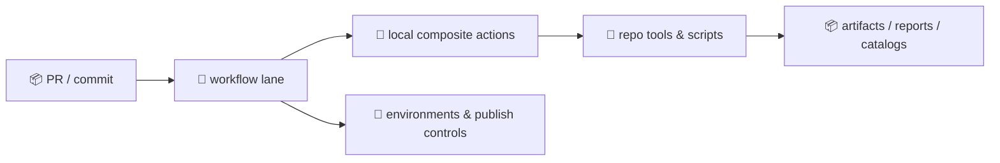
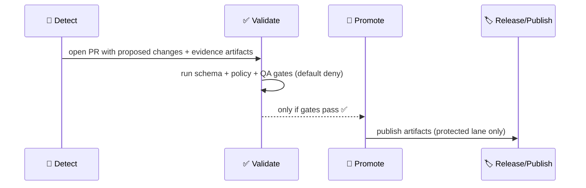

<a id="top"></a>

# 🧩 `.github/actions/` — Reusable GitHub Actions for Kansas Frontier Matrix (KFM)

[](https://github.com/bartytime4life/Kansas-Frontier-Matrix/actions/workflows/ci.yml)
[](https://github.com/bartytime4life/Kansas-Frontier-Matrix/actions/workflows/codeql.yml)
[](https://github.com/bartytime4life/Kansas-Frontier-Matrix/actions/workflows/pages.yml)


> 🧰 This folder contains **repo-local GitHub Actions** (primarily **composite actions**) used by KFM workflows to keep CI/CD **boring, consistent, governed, and auditable**.
>
> 🧭 **KFM pipeline order (don’t break it):**  
> **ETL → Metadata (STAC/DCAT/PROV) → Graph → API → UI → Story Nodes → Focus Mode** ✅🧾

> [!IMPORTANT]
> **Composite actions are infrastructure.** Treat them like production code:
> - least privilege 🔐 (permissions minimized)
> - deterministic & idempotent outputs ♻️
> - contract-first validation 🧾 (schemas + profiles)
> - provenance-first artifacts 🔎 (PROV + checksums + lineage)
> - default-deny promotion 🚦 (fail-closed gates)
> - PR-mediated automation only 🧯 (no “agent writes to main”)

---

## 🧾 Policy metadata

| Field | Value |
|---|---|
| File | `.github/actions/README.md` |
| Status | Active ✅ *(spec + operating guide)* |
| Last updated | **2026-01-11** |
| Canonical workflow docs | `.github/workflows/README.md` |
| Canonical security policy | `SECURITY.md` (repo root) or `.github/SECURITY.md` (mirror) |
| Canonical repository structure | `docs/MASTER_GUIDE_v13.md` *(v13 contract)* |
| KFM “north star” | trust first (provenance + integrity), then speed (caching + parallel lanes) |

---

## ⚡ Quick links

| Need | Go |
|---|---|
| 🧭 Project overview | [`../../README.md`](../../README.md) |
| 🧪 Workflows hub (lanes + templates) | [`../workflows/README.md`](../workflows/README.md) |
| 🤝 GitHub ops hub | [`../README.md`](../README.md) |
| 🛡️ Security policy | [`../../SECURITY.md`](../../SECURITY.md) *(or* [`../SECURITY.md`](../SECURITY.md)*)* |
| 🧱 Master guide (repo contract) | `../../docs/MASTER_GUIDE_v13.md` *(expected path)* |
| 🧾 Standards & profiles | `../../docs/standards/` *(expected: STAC/DCAT/PROV + markdown protocol)* |
| 🧑‍⚖️ Policy gates (OPA/Conftest) | `../../tools/validation/policy/` *(expected)* |
| 🧬 SBOM action | [`./sbom/README.md`](./sbom/README.md) |
| 🖊️ Attest action | [`./attest/README.md`](./attest/README.md) *(expected)* |

> [!TIP]
> If a link 404s, this README is still the **spec** for what we intend to implement.  
> Please open an issue tagged `type:pipeline` + `area:ci` (+ `area:security` if relevant).

---

<details>
<summary><strong>📌 Table of contents</strong></summary>

- [🧭 Why <code>.github/actions/</code> exists](#-why-githubactions-exists)
- [🧱 Where actions fit (actions vs workflows vs tools)](#-where-actions-fit-actions-vs-workflows-vs-tools)
- [🧬 Detect → Validate → Promote (the lane pattern)](#-detect--validate--promote-the-lane-pattern)
- [🧭 KFM invariants (actions must not break)](#-kfm-invariants-actions-must-not-break)
- [🗺️ Repo structure alignment (v13 map)](#️-repo-structure-alignment-v13-map)
- [🔐 Threat model & trust boundaries (actions edition)](#-threat-model--trust-boundaries-actions-edition)
- [🗂️ Action catalog (recommended set)](#️-action-catalog-recommended-set)
- [✅ Action contract (inputs, outputs, artifacts)](#-action-contract-inputs-outputs-artifacts)
- [🎛️ Kill switch & safe defaults](#-kill-switch--safe-defaults)
- [🧾 Provenance, checksums, lineage, and signing](#-provenance-checksums-lineage-and-signing)
- [🧪 Testing local actions](#-testing-local-actions)
- [🧷 Templates (copy/paste)](#-templates-copypaste)
- [🧑‍⚖️ Review checklist](#️-review-checklist)
- [📚 Project reference library](#-project-reference-library)

</details>

---

## 🧭 Why `.github/actions/` exists

KFM workflows cover **code + data + metadata + graph semantics + story/model artifacts**. The same sequences repeat everywhere:

- setup Python + Node (sometimes GIS deps like GDAL/PROJ)
- run lint/tests and emit artifacts
- validate **STAC/DCAT/PROV** (metadata is a contract)
- enforce governed publishing (stage → validate → promote)
- capture run provenance (inputs → transforms → outputs)
- produce supply-chain evidence (SBOM + attestations)

**Composite actions standardize those sequences once** and reuse them across many workflows without YAML drift.

> [!NOTE]
> Design rule:
> - ✅ **Composite action** = repeatable *step bundle* (“setup + run tool + upload report”)
> - ✅ **Reusable workflow** = repeatable *lane/pipeline* (“PR lane”, “nightly integration”, “release lane”)
> - ✅ **Tool/CLI (in `tools/` or `src/`)** = repeatable *domain logic* (ETL transforms, catalog QA, provenance emission)

---

## 🧱 Where actions fit (actions vs workflows vs tools)



**Text version:** PR triggers workflow → workflow calls local actions → actions call repo tools/scripts → tools produce artifacts → workflow publishes artifacts (only in protected lanes).

> [!IMPORTANT]
> Actions are “glue.” Keep KFM domain logic in `tools/` / `src/` where it can be unit-tested and reused outside GitHub Actions.

---

## 🧬 Detect → Validate → Promote (the lane pattern)

KFM treats pipelines like scientific instrumentation: **observe → record → verify → publish**.



### What this means for actions ✅
- Actions should be safe to run in PR lanes (no secrets, least privilege).
- Validation actions must be **fail-closed** when used as promotion gates.
- Promotion lanes should require:
  - SBOM present 🧬
  - provenance present 🧾
  - checksums present 🔒
  - policy gate pass ✅

> [!CAUTION]
> Any “automation” (human or agent) must flow through PRs and validation gates.  
> **No direct writes to `main`** for governed outputs.

---

## 🧭 KFM invariants (actions must not break)

These are enforceable guardrails. If an action violates one, CI should fail loudly.

1) 🧬 **Pipeline order is absolute**  
**ETL → Metadata (STAC/DCAT/PROV) → Graph → API → UI → Story Nodes → Focus Mode**  
Actions must not create shortcuts that bypass required stages or validations.

2) 🧾 **Contract-first**  
Schemas, catalogs, API contracts, and graph shapes are first-class artifacts.  
If a contract drifts, CI fails **before** merge.

3) 🧠 **Evidence-first narrative & advisory-only Focus Mode**  
Story nodes and Focus Mode outputs must be **evidence-backed** (citations / references).  
Focus Mode is guidance, not autonomy. 🧠🧷

4) ♻️ **Deterministic & idempotent**  
Same inputs + pinned toolchain + seed → same outputs. Actions must not introduce mystery state.

5) 🚦 **Default-deny promotion**  
Promotion lanes must be **fail-closed** for missing SBOM/provenance/checksums, broken links, or policy violations.

6) 🔌 **API boundary rule**  
Don’t introduce workflows/actions that make the UI query graph DB directly. UI consumes **APIs** only.

---

## 🗺️ Repo structure alignment (v13 map)

This is the **expected** KFM “v13” shape that actions/workflows should assume. If your repo differs, either:
- update the repo to match, or
- update actions to accept `root`/`paths` inputs explicitly.

```text
📁 data/
└── 📁 <domain>/
    ├── 📁 raw/              # read-only inputs
    ├── 📁 work/             # intermediate
    ├── 📁 processed/        # final outputs
    ├── 📁 mappings/         # dataset ↔ STAC/DCAT/PROV mapping notes (optional)
    └── 📄 README.md         # domain runbook

📁 docs/
├── 📄 MASTER_GUIDE_v13.md
├── 📁 standards/            # markdown protocol + repo structure + profiles
│   ├── 📄 KFM_STAC_PROFILE.md
│   ├── 📄 KFM_DCAT_PROFILE.md
│   └── 📄 KFM_PROV_PROFILE.md
├── 📁 templates/            # universal docs + story nodes + API contract extensions
└── 📁 reports/              # published validation & story outputs (optional)

📁 schemas/                  # machine-readable schemas used by validation actions
├── 📁 stac/
├── 📁 dcat/
├── 📁 prov/
└── 📁 storynodes/

📁 src/
├── 📁 pipelines/            # ETL + transforms
├── 📁 graph/                # graph build + reasoning
└── 📁 server/               # API

📁 web/                      # UI
📁 tools/                    # validation, policy, QA, release tooling
📁 releases/                 # packaged releases (output of protected lanes)

📄 CITATION.cff  📄 SECURITY.md  📄 CHANGELOG.md  📄 CONTRIBUTING.md
```

---

## 🔐 Threat model & trust boundaries (actions edition)

Composite actions run on runners and can touch secrets, artifacts, and publish lanes.

### 🧨 Common risks we design around
- **Supply chain:** unpinned third-party actions; unsafe `curl | bash`
- **Secrets exposure:** printing env vars; leaking tokens in logs/artifacts
- **Catalog poisoning:** malicious/malformed STAC/DCAT fields or links triggering unsafe fetches
- **Artifact tampering:** publishing without checksums/provenance or without atomic staging
- **Untrusted PR execution:** forks running code that tries to exfiltrate secrets
- **Classification leakage:** “public” workflows accidentally processing restricted artifacts

> [!CAUTION]
> Default stance: treat **everything from a PR** as untrusted input until validated (JSON/GeoJSON, STAC catalogs, tilesets, PDFs, 3D assets, etc.).

### 🔐 Boundary rules (non-negotiable)
- No secrets in PR lanes (especially forks).
- No “download arbitrary URL from PR input.”
- Promotion lanes require explicit environment protection.
- Prefer **digest-pinned** images and **commit-SHA pinned** actions.

---

## 🗂️ Action catalog (recommended set)

> Keep actions small and composable. Avoid “mega actions.”  
> Convention: **one machine-readable report + one human summary** per action.

### 🧩 Foundation actions
| Action | Purpose | Typical workflows |
|---|---|---|
| `setup-kfm` | Python + Node toolchain + caches (+ optional GIS deps) | `ci.yml`, `ui.yml`, `integration.yml` |
| `toolchain-pin` | Verify pinned tool versions / lockfiles / digests | all lanes |
| `kill-switch` | global “stop button” for risky publish paths | publish/release |
| `build-info` | emit `build-info.json` + tool versions + checksums | integration/release |

### ✅ Validation & governance actions
| Action | Purpose | Typical workflows |
|---|---|---|
| `markdown-protocol` | validate governed Markdown front-matter + DoD checklist | docs/story lanes |
| `catalog-qa` | fast STAC/DCAT gate + link checks (PR lane) | `catalog-qa.yml` |
| `metadata-validate` | schema/profile validation: STAC/DCAT/PROV | nightly/full lanes |
| `graph-integrity` | validate graph schema + invariants (shape checks) | graph lanes |
| `api-contract-test` | validate API contracts + schema diffs | server lanes |
| `governance-scan` | secrets/PII/sensitive-location checks (configurable) | PR lanes + nightly |
| `policy-gate` | OPA/Conftest (default deny) | promotion lanes |
| `provenance-guard` | require PROV + classification propagation | promotion lanes |

### 🧬 Supply-chain & publishing actions
| Action | Purpose | Typical workflows |
|---|---|---|
| `docker-build` | buildx + caching + labels + digests | `docker.yml` |
| `sbom` | generate SBOM (SPDX/CycloneDX) | `release.yml` |
| `attest` | create/attach attestations (OIDC-based where possible) | `release.yml` |
| `release-bundle` | assemble `releases/<tag>/` payload + checksums | tags/releases |

### 🧠 Automation support (W-P-E friendly)
| Action | Purpose | Typical workflows |
|---|---|---|
| `openlineage-emit` | emit OpenLineage event for run UUID | integration/release |
| `prov-emit` | emit PROV JSON-LD: inputs → activities → outputs | integration/release |
| `detect-changes` | compute stable fingerprints (ETag/Last-Modified/hash) | scheduled lanes |
| `pr-compose` | assemble PR-ready artifact bundle + summaries | automation lanes |

> [!TIP]
> The **W-P-E model** (Watcher → Planner → Executor) is enforced by workflow policy:
> - automation proposes changes in PRs
> - validation lanes run
> - promotion lanes are human-governed and default-deny

---

## ✅ Action contract (inputs, outputs, artifacts)

### ✅ Inputs (strings only)
GitHub Actions inputs are strings. For booleans, accept and validate:
- `"true" | "false"`

Recommended common inputs across KFM actions:
- `fail_on_warn` → `"true"` in promotion lanes
- `out_dir` → default `.artifacts/out/<action>`
- `summary_to_step` → `"true"` (append to `$GITHUB_STEP_SUMMARY`)
- `run_uuid` → optional override (otherwise generated)

### ✅ Outputs (standard keys)
Recommended output keys across actions:
- `ok` → `"true" | "false"`
- `report_path` → path to JSON report
- `summary_path` → path to Markdown summary
- `artifact_dir` → directory containing outputs
- `run_uuid` → stable UUID for run correlation
- `inputs_manifest` / `outputs_manifest` → (optional) JSON lists of paths + sha256

### 📦 Artifact layout (default expectation)
We keep **ephemeral** outputs under `.artifacts/` (gitignored), and publish only from protected lanes:

```text
📁 .artifacts/
├─ 📁 out/
│  └─ 📁 <action-name>/
│     ├─ 📄 report.json
│     ├─ 📄 summary.md
│     └─ 📁 logs/
├─ 📁 attestations/
│  ├─ 📄 materials.sbom.spdx.json
│  ├─ 📄 provenance.dsse.json
│  └─ 📄 checksums.sha256
└─ 📁 lineage/
   └─ 📄 openlineage.json
```

> [!IMPORTANT]
> **Do not** pass secrets via action outputs. Outputs can leak into logs and downstream steps.

---

## 🎛️ Kill switch & safe defaults

KFM automation is designed to be powerful **without being autonomous**.

### 🧯 Kill switch behavior
- If `KFM_KILL_SWITCH=true` → **fail closed** for publish/promotion jobs.
- For non-publish jobs, “skip heavy lanes” is acceptable only if basic safety checks still run.

Recommended signal sources:
- env var: `KFM_KILL_SWITCH`
- config file: `.kfm/kill-switch.yml` *(or `ops/feature_flags/agents.yml` for automation gating)*

> [!NOTE]
> The W-P-E model is designed with a **single, global kill switch** to stop automation quickly.

---

## 🧾 Provenance, checksums, lineage, and signing

KFM treats provenance as a **security control** and a **scientific integrity control**.

### ✅ Minimum expectation for any promoted artifact
- `build-info.json` (who/what/when/where ran)
- `checksums.sha256` for promoted artifacts
- PROV JSON-LD record(s) linking inputs → activities → outputs
- SBOM snapshot for the build/run toolchain (SPDX JSON recommended)
- Optional signing/attestations for releases

### 🔎 Lineage correlation (OpenLineage + PROV)
We use:
- OpenLineage events for operational lineage + run UUID correlation
- PROV JSON-LD for semantic provenance graphs

> [!TIP]
> “If it can’t be reproduced, it can’t be trusted.”  
> Build-info + checksums + PROV + SBOM make debugging and rollback possible.

---

## 🧪 Testing local actions

### ✅ Minimum expectation
Every local action should include:
- `README.md` describing purpose, inputs, outputs, examples
- smoke workflow: `.github/workflows/actions-smoke.yml`
- fixture inputs (tiny STAC, tiny DCAT, tiny PROV, tiny policy pack)
- artifact upload on failure (logs + reports)

### 🧪 Suggested smoke workflow coverage
- run `setup-kfm`
- run `markdown-protocol` on templates
- run `catalog-qa` on fixture catalogs
- run `policy-gate` on known allow/deny cases
- run `build-info` and upload `.artifacts/**`

---

## 🧷 Templates (copy/paste)

<details>
<summary><strong>🧩 Composite action skeleton — <code>.github/actions/&lt;name&gt;/action.yml</code></strong></summary>

```yaml
name: "kfm/<name>"
description: "Reusable step bundle for Kansas Frontier Matrix workflows."

inputs:
  out_dir:
    description: "Artifact output directory"
    required: false
    default: ".artifacts/out/<name>"
  fail_on_warn:
    description: "Fail if warnings are present"
    required: false
    default: "true"

outputs:
  ok:
    description: "Whether the action succeeded logically"
    value: ${{ steps.meta.outputs.ok }}
  report_path:
    description: "Path to the generated report artifact"
    value: ${{ steps.meta.outputs.report_path }}
  run_uuid:
    description: "Run UUID used to correlate artifacts"
    value: ${{ steps.meta.outputs.run_uuid }}

runs:
  using: "composite"
  steps:
    - name: 🧾 Context (safe)
      shell: bash
      run: |
        echo "action=kfm/<name>"
        echo "repo=$GITHUB_REPOSITORY"
        echo "sha=$GITHUB_SHA"
        echo "run_id=$GITHUB_RUN_ID"

    - name: ✅ Run task
      shell: bash
      run: |
        set -euo pipefail
        OUT="${{ inputs.out_dir }}"
        mkdir -p "$OUT"
        echo '{"ok": true, "warnings": []}' > "$OUT/report.json"
        echo "✅ <name> ok" > "$OUT/summary.md"
        cat "$OUT/summary.md" >> "$GITHUB_STEP_SUMMARY"

    - name: 📦 Set outputs
      id: meta
      shell: bash
      run: |
        set -euo pipefail
        OUT="${{ inputs.out_dir }}"
        RUN_UUID="${GITHUB_RUN_ID}-${GITHUB_SHA::8}"
        echo "ok=true" >> "$GITHUB_OUTPUT"
        echo "report_path=$OUT/report.json" >> "$GITHUB_OUTPUT"
        echo "run_uuid=$RUN_UUID" >> "$GITHUB_OUTPUT"
```

</details>

<details>
<summary><strong>🧯 Kill switch action — fail closed in publish lanes (spec)</strong></summary>

```yaml
name: "kfm/kill-switch"
description: "Fail-closed stop button for promotion/publish jobs."

inputs:
  mode:
    description: "fail|skip (prefer fail for publish lanes)"
    required: false
    default: "fail"
  flag_env:
    description: "Env var name for kill switch"
    required: false
    default: "KFM_KILL_SWITCH"

runs:
  using: "composite"
  steps:
    - name: 🧯 Check kill switch
      shell: bash
      run: |
        set -euo pipefail
        FLAG_NAME="${{ inputs.flag_env }}"
        FLAG_VALUE="${!FLAG_NAME:-false}"
        echo "kill_switch=${FLAG_VALUE}" >> "$GITHUB_STEP_SUMMARY"

        if [ "$FLAG_VALUE" = "true" ]; then
          echo "🧯 Kill switch is ON (${FLAG_NAME}=true)." >> "$GITHUB_STEP_SUMMARY"
          if [ "${{ inputs.mode }}" = "skip" ]; then
            echo "Skipping as requested." >> "$GITHUB_STEP_SUMMARY"
            exit 0
          fi
          echo "Failing closed." >> "$GITHUB_STEP_SUMMARY"
          exit 1
        fi

        echo "✅ Kill switch is OFF." >> "$GITHUB_STEP_SUMMARY"
```

</details>

<details>
<summary><strong>✅ Example usage — call a local action from a workflow</strong></summary>

```yaml
jobs:
  catalog_gate:
    runs-on: ubuntu-latest
    permissions:
      contents: read

    steps:
      - uses: actions/checkout@v4

      - name: ✅ Run Catalog QA
        uses: ./.github/actions/catalog-qa
        with:
          fail_on_warn: "true"
```

</details>

<details>
<summary><strong>📦 Build-info pattern — reproducibility artifact (spec)</strong></summary>

```json
{
  "repo": "bartytime4life/Kansas-Frontier-Matrix",
  "sha": "<GITHUB_SHA>",
  "run_id": "<GITHUB_RUN_ID>",
  "workflow": "<GITHUB_WORKFLOW>",
  "actor": "<GITHUB_ACTOR>",
  "timestamp_utc": "<ISO8601 | KFM_VCLOCK_UTC>",
  "toolchain": {
    "python": "3.12.1",
    "node": "20.11.0"
  },
  "inputs": [
    {"path": "data/raw/foo.tif", "sha256": "<...>"}
  ],
  "outputs": [
    {"path": "data/processed/foo.cog.tif", "sha256": "<...>"},
    {"path": "data/stac/foo/collection.json", "sha256": "<...>"}
  ]
}
```

</details>

---

## 🧑‍⚖️ Review checklist

Use this checklist for **new actions** and major changes:

- [ ] Deterministic & idempotent (no hidden mutable state)
- [ ] Inputs validated (string booleans handled explicitly)
- [ ] Outputs standardized (`ok`, `report_path`, `run_uuid`, etc.)
- [ ] No secrets printed or passed via outputs
- [ ] Minimal permissions documented; workflows must set least privilege
- [ ] Produces a JSON report + Step Summary
- [ ] If touching `data/**`: supports STAC/DCAT/PROV and classification propagation gates
- [ ] If producing published artifacts: emits checksums + provenance + SBOM expectations
- [ ] If publishing: runs only in protected lanes (main/tags/dispatch + environments)
- [ ] Smoke workflow exists; logs/artifacts uploaded on failure
- [ ] Local README exists next to the action

---

## 📚 Project reference library

> ⚠️ Reference materials may have licenses different from repo code.  
> Keep them under `docs/library/` (or outside the repo) and respect upstream terms.

<details>
<summary><strong>🧱 Canonical KFM specs (must-read)</strong></summary>

- `docs/specs/Kansas Frontier Matrix (KFM) – Comprehensive Technical Documentation.docx`
- `docs/specs/🌟 Kansas Frontier Matrix – Latest Ideas & Future Proposals.docx`
- `docs/MASTER_GUIDE_v13.md` *(expected; repo structure + pipeline contract)*
- `docs/standards/*` *(expected; STAC/DCAT/PROV profiles + markdown protocol)*
- `Comprehensive Markdown Guide_ Syntax, Extensions, and Best Practices.docx` *(docs governance & formatting patterns)*

</details>

<details>
<summary><strong>🔐 Governance, sovereignty, and human-centered constraints</strong></summary>

- `SECURITY.md` (this repo)
- `docs/library/Data Spaces.pdf` *(policy enforcement & classification concepts)*
- `docs/library/Introduction to Digital Humanism.pdf` *(sovereignty + human values framing)*
- `docs/library/Principles of Biological Autonomy - book_9780262381833.pdf`
- `docs/library/On the path to AI Law’s prophecies and the conceptual foundations of the machine learning age.pdf`

</details>

<details>
<summary><strong>🗺️ GIS, cartography, remote sensing (data QA reality)</strong></summary>

- `docs/library/python-geospatial-analysis-cookbook.pdf`
- `docs/library/PostgreSQL Notes for Professionals - PostgreSQLNotesForProfessionals.pdf`
- `docs/library/making-maps-a-visual-guide-to-map-design-for-gis.pdf`
- `docs/library/Mobile Mapping_ Space, Cartography and the Digital - 9789048535217.pdf`
- `docs/library/Cloud-Based Remote Sensing with Google Earth Engine-Fundamentals and Applications.pdf`
- `docs/library/compressed-image-file-formats-jpeg-png-gif-xbm-bmp.pdf`

</details>

<details>
<summary><strong>📈 Modeling, statistics, simulation (reproducibility + V&amp;V mindset)</strong></summary>

- `docs/library/Scientific Modeling and Simulation_ A Comprehensive NASA-Grade Guide.pdf`
- `docs/library/Understanding Statistics & Experimental Design.pdf`
- `docs/library/regression-analysis-with-python.pdf`
- `docs/library/Regression analysis using Python - slides-linear-regression.pdf`
- `docs/library/graphical-data-analysis-with-r.pdf`
- `docs/library/think-bayes-bayesian-statistics-in-python.pdf`
- `docs/library/Generalized Topology Optimization for Structural Design.pdf`
- `docs/library/Spectral Geometry of Graphs.pdf`

</details>

<details>
<summary><strong>🌐 UI, web, and 3D visualization (why UI lanes exist)</strong></summary>

- `docs/library/responsive-web-design-with-html5-and-css3.pdf`
- `docs/library/webgl-programming-guide-interactive-3d-graphics-programming-with-webgl.pdf`

</details>

<details>
<summary><strong>⚙️ Systems, scaling, concurrency (why lanes + caches matter)</strong></summary>

- `docs/library/Scalable Data Management for Future Hardware.pdf`
- `docs/library/concurrent-real-time-and-distributed-programming-in-java-threads-rtsj-and-rmi.pdf`

</details>

<details>
<summary><strong>🛡️ Security references (defensive-only)</strong></summary>

> These are **defensive references**. Do **not** treat them as requests for offensive techniques.

- `docs/library/ethical-hacking-and-countermeasures-secure-network-infrastructures.pdf`
- `docs/library/Gray Hat Python - Python Programming for Hackers and Reverse Engineers (2009).pdf`

</details>

<details>
<summary><strong>📚 Programming shelf bundles (cross-language fundamentals)</strong></summary>

- `docs/library/A programming Books.pdf`
- `docs/library/B-C programming Books.pdf`
- `docs/library/D-E programming Books.pdf`
- `docs/library/F-H programming Books.pdf`
- `docs/library/I-L programming Books.pdf`
- `docs/library/M-N programming Books.pdf`
- `docs/library/O-R programming Books.pdf`
- `docs/library/S-T programming Books.pdf`
- `docs/library/U-X programming Books.pdf`

</details>

<details>
<summary><strong>🤖 ML / AI (optional)</strong></summary>

- `Deep Learning for Coders with fastai and PyTorch - Deep.Learning.for.Coders.with.fastai.and.PyTorchpdf` *(library reference; may not be indexed in all tooling)*

</details>

---

<p align="right"><a href="#top">⬆️ Back to top</a></p>
