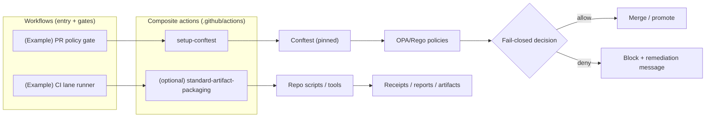

<!-- [KFM_META_BLOCK_V2]
doc_id: kfm://doc/569309c3-c3af-40d7-8e23-9f45b08c1e81
title: Reusable GitHub Actions
type: standard
version: v1
status: draft
owners: TBD
created: 2026-02-22
updated: 2026-02-22
policy_label: public
related:
  - .github/actions/
tags:
  - kfm
  - ci
  - github-actions
  - governance
notes:
  - Documents the reusable composite actions in .github/actions and their governance expectations.
[/KFM_META_BLOCK_V2] -->

# .github/actions

Reusable **composite actions** for KFM’s GitHub Actions workflows (CI lanes, policy gates, provenance packaging).

**Status:** draft • **Owners:** TBD (set in CODEOWNERS)  
  

- [What lives here](#what-lives-here)
- [How this relates to workflows](#how-this-relates-to-workflows)
- [Directory layout](#directory-layout)
- [Action registry](#action-registry)
- [Conventions](#conventions)
- [Security and governance](#security-and-governance)
- [Add a new action](#add-a-new-action)
- [Testing and validation](#testing-and-validation)
- [Definition of done](#definition-of-done)

---

## What lives here

This directory is for **reusable, repo-owned** GitHub Actions that:

- Reduce duplication across multiple workflows (e.g., “install pinned tool X”).
- Encapsulate *cross-cutting* CI steps (setup, validation toolchains, standardized artifact packaging).
- Keep “lane” workflows consistent (inputs change; structure stays stable).

> **NOTE**
> Keep actions small. Domain logic should generally live in versioned scripts/modules in the repo (so it can be unit tested), and actions should orchestrate those scripts.

---

## How this relates to workflows

- **Workflows** live under `.github/workflows/` (entrypoints, PR gates, scheduled automation).
- **Reusable workflows** (if used) typically live under `.github/workflows/reusables/` and are invoked via `uses: ./.github/workflows/reusables/<name>.yml`.
- **Composite actions** (this folder) are invoked via `uses: ./.github/actions/<action-dir>`.

### End-to-end (conceptual) CI/GitOps loop

Names shown are **examples / intended patterns**; update to match the repo.



---

## Directory layout

Recommended (adjust as needed):

```text
.github/
  actions/
    README.md  # <— you are here
    setup-conftest/
      action.yml
      README.md  # optional per-action doc
    <action-name>/
      action.yml
      README.md  # optional
```

---

## Action registry

Keep this table current. Each action should be **discoverable** and **reviewable**.

| Action (dir) | Type | Purpose | Inputs | Outputs | Notes |
|---|---|---|---|---|---|
| `setup-conftest/` | composite | Install a pinned Conftest version for policy gates | `version` (optional), `arch` (optional) | `conftest-path` (optional) | Treat version bumps as **governed** changes (review + tests). |
| *(add here)* | *(composite/js/docker)* | *(what it does)* | *(inputs)* | *(outputs)* | *(security + governance notes)* |

---

## Conventions

### Naming

- Prefer kebab-case directory names: `setup-conftest`, `build-sbom`, `verify-receipts`.
- If an action is KFM-specific, prefix with `kfm-` (optional).

### Versioning and change control

- Prefer **pinned versions** for tooling installs and third-party actions.
- If an action changes behavior for promotion, signing, attestations, or policy gates:
  - Treat it as a **governance-relevant change** (review, test, and document).

### Inputs, outputs, and logs

- Inputs: declare in `action.yml` and validate early (fail fast).
- Outputs: write to `$GITHUB_OUTPUT` (do not parse logs downstream).
- Logs:
  - Use `::group::` / `::endgroup::` sparingly to keep logs readable.
  - Never echo secrets or sensitive data.

---

## Security and governance

These are defaults; tighten further when operating on restricted data.

### Minimal permissions

- Workflows should grant the **minimum** `permissions:` needed per job.
- Actions must not assume they can write releases, packages, or contents unless explicitly granted.

### Secrets handling

- Do not bake secrets into actions.
- Pass secrets as workflow `secrets:` to jobs and then as action inputs/env.
- Avoid printing environment variables or command arguments that might contain secrets.

### Supply chain hygiene

- Pin third-party actions (prefer commit SHA pinning where feasible).
- Prefer keyless, short-lived credentials (OIDC) over long-lived tokens when the workflow supports it.

### Fail-closed behavior

Actions used in “gate” positions MUST:

- Exit non-zero on any validation/policy failure.
- Produce explicit, actionable remediation messages.

---

## Add a new action

1. Create a folder: `.github/actions/<action-name>/`
2. Add `action.yml` (or `action.yaml`)
3. (Recommended) Add an action-level `README.md` for:
   - inputs/outputs
   - required permissions
   - example usage snippet
4. Add (or extend) a workflow that calls the action so it’s exercised in CI.
5. Register it in the [Action registry](#action-registry).

### Minimal composite action template

```yaml
# .github/actions/<action-name>/action.yml
name: "<Action name>"
description: "<What this action does>"
inputs:
  example_input:
    description: "Example input"
    required: false
    default: ""
outputs:
  example_output:
    description: "Example output"
    value: ${{ steps.main.outputs.example_output }}
runs:
  using: "composite"
  steps:
    - id: main
      shell: bash
      run: |
        set -euo pipefail
        echo "example_output=ok" >> "$GITHUB_OUTPUT"
```

---

## Testing and validation

Suggested minimum checks (wire these into your CI as available):

- `action.yml` schema sanity (lint)
- shell safety (`set -euo pipefail`, quoting)
- pinning / dependency review for installs
- run the action in at least one workflow path

> **TIP**
> A composite action is “tested” when at least one workflow path executes it and asserts expected outputs/artifacts.

---

## Definition of done

- [ ] Action is added under `.github/actions/<name>/action.yml`
- [ ] Action appears in [Action registry](#action-registry)
- [ ] Inputs/outputs are documented
- [ ] Failure modes are explicit and fail-closed
- [ ] No secrets are logged; required permissions are minimal and documented
- [ ] Tool/action versions are pinned where practical
- [ ] CI path exercises the action (at least one workflow)

---

<details>
<summary><strong>Optional: per-action README skeleton</strong></summary>

```markdown
# <action-name>

## Purpose

## Inputs

## Outputs

## Required permissions

## Example usage

## Failure modes
```

</details>

---

[Back to top](#githubactions)
