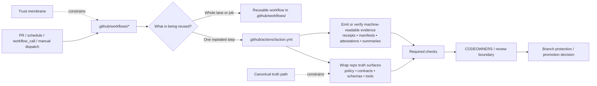

<!-- [KFM_META_BLOCK_V2]
doc_id: kfm://doc/<pending-uuid>
title: .github/actions/
type: standard
version: v1
status: draft
owners: @bartytime4life
created: <NEEDS VERIFICATION>
updated: 2026-03-21
policy_label: <NEEDS VERIFICATION>
related: [../README.md, ../workflows/, ../CODEOWNERS, ../../policy/, ../../contracts/, ../../schemas/]
tags: [kfm, github-actions, ci-cd, governance]
notes: [doc_id placeholder pending registry allocation, created and policy_label require repo verification, owner value inherited from supplied draft and should be branch-verified, related links reflect intended repo topology rather than mounted-tree confirmation]
[/KFM_META_BLOCK_V2] -->

<a id="top"></a>

# `.github/actions/`

Reusable repo-local GitHub Actions contract and bootstrap surface for KFM’s repeated workflow steps.


| Field | Value |
|---|---|
| Status | `experimental` |
| Owners | `@bartytime4life` *(from the supplied baseline · NEEDS VERIFICATION as a branch-backed doc owner marker)* |
| Path | `.github/actions/README.md` |
| Repo fit | `.github/` control-plane support surface for repo-local actions called from [`../workflows/`](../workflows/) |
| Repo signal | Repository audit artifact reports `bartytime4life/Kansas-Frontier-Matrix`, default branch `main`, public · **INFERRED** |
| Current-session evidence limit | PDF corpus and support artifacts were visible; mounted repo tree, live workflow YAML, CODEOWNERS contents, manifests, and runtime logs were **not** directly inspected |
| Truth posture | **CONFIRMED** KFM doctrine for fail-closed gates, evidence-bearing CI/CD, PR-first mutation, and machine-checkable release artifacts · **PROPOSED** local-action catalog and starter layout in this directory · **UNKNOWN / NEEDS VERIFICATION** actual `.github/actions/` inventory, current callers, and branch protections |
| Quick jumps | [Scope](#scope) · [Repo fit](#repo-fit) · [Accepted inputs](#accepted-inputs) · [Exclusions](#exclusions) · [Directory tree](#directory-tree) · [Quickstart](#quickstart) · [Usage](#usage) · [Diagram](#diagram) · [Operating tables](#operating-tables) · [Task list / Definition of done](#task-list--definition-of-done) · [FAQ](#faq) · [Appendix](#appendix) |

> [!IMPORTANT]
> This README is source-bounded. It documents the **contract and intended shape** of repo-local actions for KFM, not a branch-verified inventory of what already exists under `.github/actions/`.

> [!NOTE]
> KFM doctrine treats CI/CD as part of the control plane: policy gates, receipts, attestations, provenance checks, and promotion rules must remain reviewable, fail-closed, and subordinate to the governed truth path.

> [!WARNING]
> A repo-local action may wrap policy, schema, contract, or tooling logic, but it must not quietly become the only place where that logic survives.

---

## Scope

Use `.github/actions/` for **repo-local GitHub Actions** that centralize repeated, governance-significant workflow steps.

Good fits include:

- policy-gate wrappers
- receipt / manifest verification helpers
- attestation and Rekor evidence steps
- SBOM-and-signing helpers
- small metadata or provenance validation wrappers
- repeatable summary / evidence-posting steps

In KFM terms, this directory is a **step-level reuse surface**, not the home of canonical truth.

[Back to top](#top)

---

## Repo fit

**Path:** `.github/actions/README.md`  
**Role in repo:** directory README for repo-local actions used by KFM workflow orchestration.

### Upstream and downstream surfaces

| Surface | Relationship to `.github/actions/` | Status |
|---|---|---|
| [`../README.md`](../README.md) | `.github/` gatehouse / control-plane overview | **PROPOSED** adjacency · branch presence **NEEDS VERIFICATION** |
| [`../workflows/`](../workflows/) | Primary caller of repo-local actions and home of reusable workflow orchestration | **CONFIRMED** doctrinal role · exact inventory **NEEDS VERIFICATION** |
| [`../CODEOWNERS`](../CODEOWNERS) | Review boundary for `.github/**` and other governance-sensitive files | **INFERRED** from repo-audit support artifact · current contents **NEEDS VERIFICATION** |
| [`../../policy/`](../../policy/) | Canonical policy bodies and fixtures that actions should call, not duplicate | **CONFIRMED** doctrinal surface · exact branch path **NEEDS VERIFICATION** |
| [`../../contracts/`](../../contracts/) | Canonical contract surfaces | **CONFIRMED** doctrinal surface · exact branch path **NEEDS VERIFICATION** |
| [`../../schemas/`](../../schemas/) | Canonical schemas and validation definitions | **CONFIRMED** doctrinal surface · exact branch path **NEEDS VERIFICATION** |
| `../../tools/`, `../../scripts/`, `../../packages/` | Heavier logic that actions should wrap rather than re-implement | **CONFIRMED** doctrinal role · exact branch paths **NEEDS VERIFICATION** |

### KFM boundary rule

A local action may **invoke**:

- policy checks
- schema validation
- receipt / manifest verification
- attestation tooling
- repo-local helper scripts

A local action should **not** become the sovereign source of:

- policy meaning
- contract structure
- dataset truth
- promotion authority

[Back to top](#top)

---

## Accepted inputs

| Input type | What belongs here | Typical examples |
|---|---|---|
| Directory contract | README guidance for local actions | this file |
| Local action definitions | Repo-local action folders with `action.yml` | `./opa-gate/action.yml` |
| Action-scoped docs | Inputs, outputs, permissions, caveats, usage | `./<action>/README.md` |
| Small action-local helpers | Tight scripts coupled to one action | `./<action>/src/check.sh` |
| Tiny fixtures / smoke artifacts | Minimal action-level tests or examples | `./<action>/tests/fixtures/` |
| Summary formatting helpers | PR summary or evidence-posting wrappers | `./rekor-evidence/` or similar |

[Back to top](#top)

---

## Exclusions

| Keep out of `.github/actions/` | Why | Put it here instead |
|---|---|---|
| Canonical policy rules | Actions should wrap enforcement, not own policy truth | [`../../policy/`](../../policy/) |
| Canonical schemas and API contracts | Actions consume these; they do not define them | [`../../schemas/`](../../schemas/), [`../../contracts/`](../../contracts/) |
| Reusable workflow orchestration | Job- and pipeline-level orchestration belongs at workflow level | [`../workflows/`](../workflows/) |
| Large shared runtime logic | Harder to test, version, and reuse when hidden in actions | `../../tools/`, `../../scripts/`, `../../packages/` |
| Secrets or environment credentials | Local actions must not become credential stores | repo settings / environments / external secret managers |
| Unreviewed publish or deploy shortcuts | KFM promotion is a governed state transition | promotion lanes in workflows with required gates |
| Canonical evidence artifacts | Actions may emit or verify them, but should not become their long-term storage home | governed data / release / evidence locations elsewhere in the repo |

[Back to top](#top)

---

## Directory tree

### Current-session visibility

```text
.github/actions/
└── README.md   # target file in this request; live branch presence still NEEDS VERIFICATION
```

### Evidence-aligned starter shape (**PROPOSED**)

```text
.github/actions/
├── README.md
├── opa-gate/
│   ├── action.yml
│   ├── README.md
│   └── src/
├── sigstore-attest/
│   ├── action.yml
│   ├── README.md
│   └── src/
├── rekor-evidence/
│   ├── action.yml
│   ├── README.md
│   └── src/
├── run-manifest/
│   ├── action.yml
│   ├── README.md
│   └── src/
└── sbom-produce-and-sign/
    ├── action.yml
    ├── README.md
    └── src/
```

> [!NOTE]
> The design corpus proposes overlapping names for similar helpers, including `rekor-evidence`, `rekor-upload`, `run-manifest`, `provenance-guard`, and `kfm__metadata__validate`. Normalize this naming **before** implementing multiple near-duplicate wrappers.

[Back to top](#top)

---

## Quickstart

### 1) Inspect what actually exists

```bash
find .github/actions -maxdepth 2 \( -name action.yml -o -name README.md \) | sort
```

```bash
grep -R "uses: ./.github/actions/" -n .github/workflows 2>/dev/null || true
```

```bash
grep -R "workflow_call:" -n .github/workflows 2>/dev/null || true
```

```bash
test -f .github/CODEOWNERS \
  && sed -n '1,160p' .github/CODEOWNERS \
  || echo ".github/CODEOWNERS not found"
```

### 2) Bootstrap the first repo-local action (**illustrative**)

This example starts with a thin `opa-gate/` wrapper. The default policy path is intentionally **not** baked into the action because the attached design notes show unresolved path drift across `mcp/gates`, `.mcp/gates`, and `policy/opa/...`.

```bash
mkdir -p .github/actions/opa-gate

cat > .github/actions/opa-gate/action.yml <<'YAML'
name: opa-gate
description: Run a repo-local Conftest / OPA policy gate.
inputs:
  subject:
    description: File or directory to validate.
    required: true
  policy-path:
    description: Path to the policy bundle to use.
    required: true
runs:
  using: composite
  steps:
    - name: Policy gate
      shell: bash
      run: |
        set -euo pipefail
        conftest test "${{ inputs.subject }}" --policy "${{ inputs.policy-path }}"
YAML
```

```bash
cat > .github/actions/opa-gate/README.md <<'MD'
# `opa-gate`

Thin wrapper for repo-local Conftest / OPA execution.

## Inputs

| Name | Required | Default | Description |
|---|---:|---|---|
| `subject` | yes | — | File or directory to validate |
| `policy-path` | yes | — | Policy bundle to use |

## Usage

```yaml
- name: Policy gate
  uses: ./.github/actions/opa-gate
  with:
    subject: mcp/run_manifest.json
    policy-path: .mcp/gates # illustrative; replace with the repo's confirmed policy root
```

## Security notes

- no secrets required
- intended to fail closed on policy denial
- wraps repo policy; does not replace it
MD
```

### 3) Call it from a workflow (**illustrative**)

```yaml
jobs:
  policy_gate:
    runs-on: ubuntu-latest
    permissions:
      contents: read
    steps:
      - uses: actions/checkout@v4
        with:
          persist-credentials: false

      - name: Install Conftest
        run: |
          curl -sSfL https://raw.githubusercontent.com/open-policy-agent/conftest/master/install.sh \
            | sh -s -- -b /usr/local/bin

      - name: Policy gate
        uses: ./.github/actions/opa-gate
        with:
          subject: mcp/run_manifest.json
          policy-path: .mcp/gates
```

[Back to top](#top)

---

## Usage

### Pick the right reuse shape

| Shape | Use when | Keep logic here | Do **not** use for |
|---|---|---|---|
| Inline workflow step | One-off job logic unique to a single workflow | tiny, local glue | repeated governance steps |
| Repo-local action | Repeated **step** logic used across jobs/workflows in this repo | thin wrappers, stable inputs/outputs, summary helpers | whole pipelines or large business logic |
| Reusable workflow | Repeated **job / lane** shape across modules or repos | orchestration, permissions, environments, promotion sequences | tiny helper steps |
| Repo tool / script / package | Heavier logic with its own tests, runtime, and reuse story | durable validation/build/transform code | being hidden inside YAML or action glue |

### Action design rules

Repo-local actions in KFM should be:

- **single-purpose**
- **thin**
- **reviewable**
- **deterministic**
- **fail-closed when used in gates**
- **easy to swap out**

### Minimum contract for every action folder

| Requirement | Why it matters |
|---|---|
| `action.yml` | Explicit machine-readable interface |
| local `README.md` | Reviewer-visible purpose, usage, and caveats |
| explicit `inputs` | Prevents hidden path and environment assumptions |
| explicit `outputs` when relevant | Keeps downstream behavior inspectable |
| action-local helper scripts only when small | Prevents action sprawl and hidden runtimes |
| one workflow usage example | Makes adoption and review faster |
| security note | Documents permissions, secrets, and failure behavior |

### Security and governance rules

1. **Least privilege first**  
   Start from read-only permissions and widen only when the lane genuinely needs more.

2. **OIDC beats long-lived secrets**  
   For provenance, attestation, or registry interactions, prefer short-lived identity and verifiable signing flows over static credentials.

3. **Fail closed**  
   Missing manifests, failed schema checks, missing attestations, policy denials, or unverifiable provenance should block merge or promotion.

4. **Protect `pull_request_target` lanes**  
   If a workflow uses `pull_request_target`, keep it read-only and avoid executing untrusted fork code with elevated permissions.

5. **Prefer `persist-credentials: false` where writeback is unnecessary**  
   Especially in policy and attestation lanes.

6. **Attest the declared run, not random build detritus**  
   KFM evidence lanes should center the declared manifest / receipt contract.

7. **Prefer GitHub App or workflow orchestration for PR mutation**  
   Opening PRs, attaching labels, or commenting evidence links belongs at workflow / app level more than inside a tiny local action.

### Versioning and compatibility

Repo-local actions are path-based, so changes land immediately for their callers.

Use these rules:

- prefer additive inputs over breaking renames
- deprecate visibly before removal
- split folders only when a real compatibility break exists
- keep action names stable once referenced widely
- treat action interfaces like repo-local APIs

A practical compatibility pattern:

```text
.github/actions/
├── opa-gate/
└── opa-gate-v2/
```

[Back to top](#top)

---

## Diagram


```mermaid
flowchart LR
    A[PR / schedule / workflow_call / manual dispatch] --> B[.github/workflows/*]
    B --> C{What is being reused?}

    C -->|One repeated step| D[.github/actions/<action>/action.yml]
    C -->|Whole lane or job| E[Reusable workflow in .github/workflows/]

    D --> F[Wrap repo truth surfaces<br/>policy • contracts • schemas • tools]
    D --> G[Emit or verify machine-readable evidence<br/>receipts • manifests • attestations • summaries]

    F --> H[Required checks]
    G --> H
    H --> I[CODEOWNERS / review boundary]
    I --> J[Branch protection / promotion decision]

    K[Canonical truth path] -. constrains .-> F
    L[Trust membrane] -. constrains .-> B
```

[Back to top](#top)

---

## Operating tables

### Proposed starter catalog

| Candidate action | Job it would do | Status | Notes |
|---|---|---|---|
| `opa-gate/` | Wrap Conftest / OPA with repo-local defaults | **PROPOSED** | Strongly repeated in design notes |
| `sigstore-attest/` | Wrap keyless attestation / signing steps with KFM metadata | **PROPOSED** | Keep secrets posture explicit |
| `rekor-evidence/` | Extract and publish Rekor / transparency-log evidence into job summary or artifact output | **PROPOSED** | Avoid embedding policy logic here |
| `run-manifest/` | Verify required manifest / receipt fields and expected files | **PROPOSED** | Consolidated name; overlaps with `provenance-guard` in some notes |
| `sbom-produce-and-sign/` | Produce SBOM and sign / attest it | **PROPOSED** | Best treated as a narrow helper action |
| `kfm__metadata__validate/` | Validate metadata globs against schemas | **PROPOSED** | Candidate exists in design notes, but naming style drifts from the kebab-case family |

### Naming normalization watchpoint

| Pattern seen in the design corpus | Examples | Recommended handling here |
|---|---|---|
| Short kebab-case action names | `opa-gate`, `sigstore-attest`, `rekor-evidence` | Prefer for action folder names |
| Double-underscore prefixed names | `kfm__metadata__validate` | Better suited to reusable workflows or transitional names |
| Near-duplicate provenance names | `run-manifest`, `provenance-guard`, `rekor-upload`, `rekor-evidence` | Normalize before implementation to avoid wrapper sprawl |

[Back to top](#top)

---

## Task list / Definition of done

A new repo-local action is ready for merge when:

- [ ] it has one clear responsibility
- [ ] it includes `action.yml`
- [ ] it includes an action-local `README.md`
- [ ] its inputs are explicit
- [ ] its outputs are explicit when reused downstream
- [ ] its steps fail loudly and safely
- [ ] its permissions are minimal
- [ ] it does not echo secrets
- [ ] it does not silently widen branch or token capabilities
- [ ] it wraps canonical repo truth instead of copying it
- [ ] it includes one workflow usage example
- [ ] it has at least one smoke path, fixture path, or exercising workflow
- [ ] it preserves KFM’s PR-first, fail-closed posture
- [ ] any claim stronger than **PROPOSED** has been branch-verified

[Back to top](#top)

---

## FAQ

### Why document this directory before the mounted tree is verified?

Because KFM benefits from setting the **contract** before copy-paste action sprawl begins. This README is a controlled bootstrap surface, not a claim that the branch is already populated.

### Local action or reusable workflow?

Use a **local action** for a repeated **step**.  
Use a **reusable workflow** for a repeated **job or lane**.

### Where should policy logic live?

In the repo’s canonical policy surface.  
A local action may *call* policy evaluation, but it should not become the only place where policy semantics survive.

### Can a local action publish or deploy by itself?

Not as an uncontrolled shortcut. Any publish or promotion lane should stay inside governed workflows, preserve evidence, and respect review, branch, and policy gates.

### Why is the naming guidance conservative?

Because the attached design notes already show naming drift. This README prefers one normalization pass over multiple overlapping wrappers that do nearly the same thing.

[Back to top](#top)

---

## Appendix

<details>
<summary>Starter composite action template</summary>

### Minimal `action.yml`

```yaml
name: "<action-name>"
description: "One-sentence description of the action."

inputs:
  working-directory:
    description: "Directory to operate in."
    required: false
    default: "."

outputs: {}

runs:
  using: "composite"
  steps:
    - name: Execute action logic
      shell: bash
      working-directory: ${{ inputs.working-directory }}
      run: |
        set -euo pipefail
        echo "Replace with real logic"
```

### Minimal action README

```markdown
# `<action-name>`

Short purpose statement.

## Inputs

| Name | Required | Default | Description |
|---|---:|---|---|
| `working-directory` | no | `.` | Directory to operate in |

## Outputs

| Name | Description |
|---|---|
| _none_ | — |

## Usage

```yaml
- name: Run <action-name>
  uses: ./.github/actions/<action-name>
  with:
    working-directory: .
```

## Security notes

- required permissions:
- secrets used:
- fail-closed behavior:
```

</details>

<details>
<summary>Reviewer prompts for maintainers</summary>

- Does this action centralize a repeated step, or is it premature abstraction?
- Does it wrap canonical repo truth instead of copying it?
- Would a reusable workflow be the better shape?
- Are the permissions narrower than the surrounding job?
- Does the README explain enough for a reviewer to approve it confidently?
- Does the action preserve evidence or only print logs?
- Are all claims about branch paths and policy roots actually verified?

</details>

[Back to top](#top)
