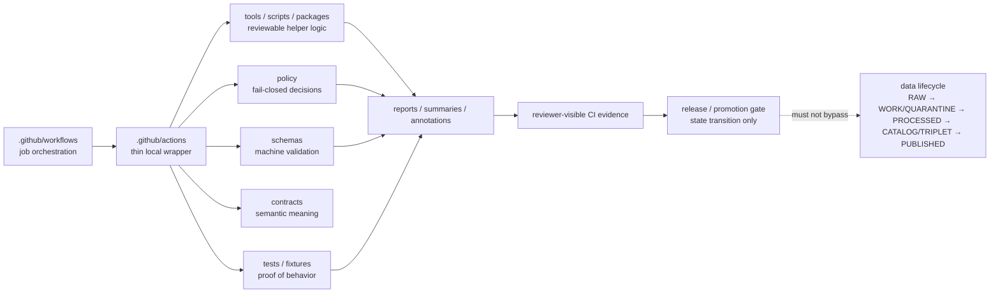

<!-- [KFM_META_BLOCK_V2]
doc_id: kfm://doc/TODO-NEEDS-VERIFICATION
title: .github/actions
type: standard
version: v1
status: draft
owners: TODO: owner not verified
created: TODO: YYYY-MM-DD
updated: TODO: YYYY-MM-DD
policy_label: TODO: public
related: [
  ../README.md,
  ../CODEOWNERS,
  ../PULL_REQUEST_TEMPLATE.md,
  ../workflows/README.md,
  ../watchers/README.md,
  ../SECURITY.md,
  ../../README.md,
  ../../CONTRIBUTING.md,
  ../../SECURITY.md,
  ../../contracts/README.md,
  ../../schemas/README.md,
  ../../policy/README.md,
  ../../tests/README.md,
  ../../tools/README.md,
  ../../scripts/README.md,
  ../../tools/ci/README.md,
  ../../tools/attest/README.md,
  ../../tools/validators/promotion_gate/README.md
]
tags: [kfm, github, actions, composite-actions, ci, policy-gates, provenance, release-evidence]
notes: [
  "README-like lane contract for repo-local GitHub Actions.",
  "doc_id, owners, created date, updated date, policy_label, active-branch inventory, workflow callers, and platform enforcement remain NEEDS VERIFICATION.",
  "Local actions are thin step wrappers only; canonical contract, schema, policy, release, proof, and publication authority stays in the owning responsibility roots."
]
[/KFM_META_BLOCK_V2] -->

<a id="top"></a>

# `.github/actions`

Repo-local GitHub Actions for thin, reviewable CI step reuse inside the KFM governed control plane.

> [!NOTE]
> **Status:** `draft`  
> **Owners:** `TODO: verify against ../CODEOWNERS`  
> **Authority:** `PROPOSED` lane contract; active-branch implementation is `NEEDS VERIFICATION`  
> **Repo fit:** `.github/actions/README.md` inside the `.github/` gatehouse root  
> **Review burden:** platform, security, policy, contract/schema, and release-evidence reviewers should verify that local actions wrap governed logic without becoming hidden authority.


**Quick jumps:** [Scope](#scope) · [Repo fit](#repo-fit) · [Accepted contents](#accepted-contents) · [Exclusions](#exclusions) · [Operating model](#operating-model) · [Inventory to verify](#inventory-to-verify) · [Local action contract](#local-action-contract) · [Action lanes](#action-lanes) · [Quickstart](#quickstart) · [Security and permissions](#security-and-permissions) · [Review gates](#review-gates) · [Rollback](#rollback) · [Open verification](#open-verification)

> [!IMPORTANT]
> Local actions are **not** the truth source, policy authority, schema authority, release authority, secret store, or publication mechanism. They are thin wrappers that make workflow steps easier to review. Heavy logic belongs in `tools/`, `scripts/`, `packages/`, `policy/`, `schemas/`, `contracts/`, `tests/`, or release/evidence roots as appropriate.

## Scope

`.github/actions/` owns repo-local GitHub Action wrappers used by workflow YAML to call repeatable validation, policy, provenance, SBOM, and release-evidence steps.

This lane should help reviewers answer five questions quickly:

| Question | Expected answer |
| --- | --- |
| What step is this action wrapping? | A narrow, named task with explicit inputs and outputs. |
| Where does the real authority live? | In the owning KFM root: `policy/`, `schemas/`, `contracts/`, `tools/`, `scripts/`, `tests/`, `release/`, or `data/`. |
| What can fail? | Schema, policy, provenance, signing, fixture, permission, or caller checks should fail closed. |
| What evidence is emitted? | Logs, summaries, validation reports, receipts, annotations, SBOMs, or links to governed artifacts. |
| What must not happen here? | No hidden publication, no raw data exposure, no long-lived credentials, no direct model/runtime truth, and no schema/policy drift. |

[Back to top](#top)

## Repo fit

| Relation | Path | Role |
| --- | --- | --- |
| This lane | `./README.md` | Directory contract for repo-local actions. |
| Parent gatehouse | `../README.md` | GitHub governance, templates, ownership, watchers, workflows, and security-facing docs. |
| Ownership | `../CODEOWNERS` | Must identify who reviews `.github/` and action-lane changes. |
| PR evidence | `../PULL_REQUEST_TEMPLATE.md` | Should require evidence for action, workflow, permission, and release-impact changes. |
| Workflow callers | `../workflows/README.md` | Workflow orchestration belongs there; actions are reusable step wrappers. |
| Watcher neighbors | `../watchers/README.md` | Watchers may trigger or feed workflows, but should not bypass review or promotion. |
| Root posture | `../../README.md` | KFM identity, trust membrane, lifecycle, and contributor orientation. |
| Semantics | `../../contracts/README.md` | Human-readable meaning of SourceDescriptor, EvidenceBundle, DecisionEnvelope, ReleaseManifest, and related trust objects. |
| Machine validation | `../../schemas/README.md` | JSON Schema and machine-checkable shape validation. |
| Policy | `../../policy/README.md` | Allow, deny, restrict, abstain, promotion, sensitivity, and rights logic. |
| Verification | `../../tests/README.md` | Tests, fixtures, negative paths, and regression proof. |
| Helper logic | `../../tools/README.md`, `../../scripts/README.md` | Reviewable implementation helpers and orchestration scripts. |
| Release evidence helpers | `../../tools/ci/README.md`, `../../tools/attest/README.md` | Reviewer summaries, proof-pack checks, digest/signature support, and attestation-adjacent helpers. |

[Back to top](#top)

## Accepted contents

A subdirectory under `.github/actions/` is acceptable when it is a **thin repo-local action wrapper** with clear review boundaries.

| Accepted item | Required posture |
| --- | --- |
| `action.yml` or `action.yaml` | Defines a narrow action interface with explicit inputs, outputs, shell behavior, and no hidden authority. |
| Action-specific `README.md` | Explains purpose, inputs, outputs, permissions, failure modes, examples, tests, and rollback. |
| Tiny wrapper script | Acceptable only when small, local, and action-specific; larger logic should move to `tools/`, `scripts/`, or `packages/`. |
| Test fixtures | Prefer `tests/` or action-local `tests/fixtures/` only when the README explains why locality matters. |
| Templates | Allowed for action-specific summaries, SBOM metadata, provenance snippets, or annotations. |
| Migration note | Required when replacing or versioning an existing action name. |

[Back to top](#top)

## Exclusions

| Do not place here | Correct home |
| --- | --- |
| Canonical contract meaning | `../../contracts/` |
| Machine schema authority | `../../schemas/` |
| Policy decisions or Rego bundles as the primary authority | `../../policy/` |
| Full validators or reusable release tooling | `../../tools/validators/`, `../../tools/`, or `../../packages/` |
| Broad orchestration scripts | `../../scripts/` |
| Workflow job composition | `../workflows/` |
| Long-lived credentials, tokens, private keys, or trust roots | GitHub environments, OIDC, external secret management, or platform policy |
| Canonical evidence archives, proof packs, or release manifests | `../../data/`, `../../release/`, or the repo’s verified release/proof roots |
| Direct publish shortcuts | Governed promotion workflow with review, manifest, correction path, and rollback target |
| Public access to RAW, WORK, QUARANTINE, unpublished candidates, or direct model output | Governed API and released artifacts only |

[Back to top](#top)

## Operating model


```mermaid
flowchart LR
  W[.github/workflows<br/>job orchestration] --> A[.github/actions<br/>thin local wrapper]

  A --> T[tools / scripts / packages<br/>reviewable helper logic]
  A --> P[policy<br/>fail-closed decisions]
  A --> S[schemas<br/>machine validation]
  A --> C[contracts<br/>semantic meaning]
  A --> X[tests / fixtures<br/>proof of behavior]

  T --> R[reports / summaries / annotations]
  P --> R
  S --> R
  X --> R

  R --> G[reviewer-visible CI evidence]
  G --> M[release / promotion gate<br/>state transition only]

  M -. must not bypass .-> D[data lifecycle<br/>RAW → WORK/QUARANTINE → PROCESSED → CATALOG/TRIPLET → PUBLISHED]
```

Action wrappers may help workflows produce reviewer-visible evidence. They must not silently promote, publish, rewrite canonical truth, or turn successful CI into release approval.

[Back to top](#top)

## Inventory to verify

Run these checks in the active checkout before changing this lane:

```bash
# Confirm active branch and repo root.
git status --short
git branch --show-current
git rev-parse --show-toplevel

# Inventory local action files.
find .github/actions -maxdepth 3 -type f | sort

# Detect empty action metadata.
find .github/actions -name 'action.yml' -o -name 'action.yaml' | while read -r f; do
  test -s "$f" || printf 'EMPTY %s\n' "$f"
done

# Identify workflow callers.
grep -R "uses: ./.github/actions/" -n .github/workflows 2>/dev/null || true

# Check ownership and PR evidence expectations.
sed -n '1,160p' .github/CODEOWNERS
sed -n '1,220p' .github/PULL_REQUEST_TEMPLATE.md
```

### Previously observed action names to reconcile

The following names have appeared in KFM planning/public-tree lineage and should be preserved or explicitly migrated if present on the active branch:

```text
.github/actions/
├── README.md
├── action.yml
├── metadata-validate/
├── metadata-validate-v2/
├── opa-gate/
├── provenance-guard/
├── sbom-produce-and-sign/
└── src/
```

> [!CAUTION]
> Treat the list above as a reconciliation target, not as proof of the active branch. If the active branch differs, update this README’s inventory and explain the migration instead of forcing old names back into the tree.

[Back to top](#top)

## Local action contract

Each real local action should satisfy this minimum contract before a workflow depends on it.

| Requirement | Why it matters |
| --- | --- |
| One narrow purpose | Prevents action folders from becoming hidden tool suites. |
| Explicit `inputs` and `outputs` | Keeps workflow review possible. |
| Minimal permissions documented | Prevents privilege drift. |
| Fail-closed behavior | KFM should deny, hold, abstain, or error rather than guess. |
| No secret custody | Actions may consume short-lived credentials supplied by the caller, not own them. |
| No direct publish path | Promotion is a governed state transition with manifest, review, correction path, and rollback target. |
| Clear evidence output | Logs, summaries, reports, or annotations must be inspectable. |
| Tests or fixture examples | Proves happy path and negative path. |
| Related contract/schema/policy links | Shows where authority lives outside the action wrapper. |
| Rollback note | Explains how to remove or disable safely. |

### Minimal action README shape

```markdown
# `<action-name>`

One-line action purpose.

> [!NOTE]
> **Status:** `draft | experimental | active | deprecated`
> **Owners:** `<verified owner or TODO>`
> **Authority:** `PROPOSED | CONFIRMED | NEEDS VERIFICATION`
> **Inputs:** `<summary>`
> **Outputs:** `<summary>`
> **Permissions:** `<minimum caller permissions>`

## Scope

## Inputs

## Outputs

## Permissions

## Failure behavior

## Evidence emitted

## Example caller

## Tests

## Rollback

## Open verification
```

[Back to top](#top)

## Action lanes

| Lane | Role | Authority boundary | Minimum hardening before use |
| --- | --- | --- | --- |
| `metadata-validate/` | Validate metadata files against approved schemas. | `schemas/` owns machine shape; `contracts/` owns meaning. | Non-empty `action.yml`, schema path input, invalid fixture test, clear fail-closed output. |
| `metadata-validate-v2/` | Versioned metadata validation wrapper if legacy and v2 callers must coexist. | Same as `metadata-validate/`; version split must be justified. | Migration note, caller inventory, compatibility tests, deprecation plan if temporary. |
| `opa-gate/` | Run policy checks over supplied subjects. | `policy/` owns policy logic and reason codes. | Explicit subject and policy inputs, deny fixture, no silent allow on missing policy. |
| `provenance-guard/` | Check provenance references, receipts, or build evidence presence. | `data/receipts`, `data/proofs`, `release/`, and contracts define proof semantics. | Missing-provenance negative test, report output, release-impact note. |
| `sbom-produce-and-sign/` | Produce SBOM and signing/attestation-adjacent artifacts. | `tools/attest/`, release policy, and platform OIDC rules own deeper trust behavior. | OIDC/permissions review, no long-lived keys, artifact output contract, rollback instructions. |
| `src/` | Shared micro-helpers only when too small to justify a package. | Larger logic belongs in `tools/`, `scripts/`, or `packages/`. | README explaining why helpers stay here, tests, no hidden publish or policy logic. |
| root `action.yml` | Only if the whole directory intentionally exposes one action. | Usually avoid; per-action directories are clearer. | Explain why root action exists and how it differs from sub-actions. |

[Back to top](#top)

## Quickstart

### Inspect action readiness

```bash
# Show likely action entrypoints.
find .github/actions -maxdepth 2 \( -name 'action.yml' -o -name 'action.yaml' \) -print | sort

# Check for placeholder-only README files.
grep -RIn "Placeholder file to keep this directory in version control" .github/actions 2>/dev/null || true

# Check for hidden executable-heavy action folders.
find .github/actions -maxdepth 3 -type f \
  \( -name '*.sh' -o -name '*.py' -o -name '*.js' -o -name '*.ts' \) \
  | sort
```

### Starter composite action pattern

```yaml
name: opa-gate
description: Run a repo-local policy gate against a supplied subject and policy path.

inputs:
  subject:
    description: File or directory to evaluate.
    required: true
  policy-path:
    description: Policy directory to use.
    required: true

outputs:
  result:
    description: Policy gate result label.

runs:
  using: composite
  steps:
    - name: Evaluate policy
      shell: bash
      run: |
        set -euo pipefail
        test -e "${{ inputs.subject }}"
        test -d "${{ inputs.policy-path }}"
        conftest test "${{ inputs.subject }}" --policy "${{ inputs.policy-path }}"
        echo "result=PASS" >> "$GITHUB_OUTPUT"
```

> [!IMPORTANT]
> This example is a starter interface only. It is not proof that `conftest` is installed, that the active repo has this action implemented, or that policy gates are merge-blocking. Workflow callers must install/pin tools and declare minimum permissions.

### Starter workflow caller pattern

```yaml
jobs:
  opa_gate:
    runs-on: ubuntu-latest
    permissions:
      contents: read

    steps:
      - uses: actions/checkout@v4
        with:
          persist-credentials: false

      - name: Confirm conftest is available
        run: command -v conftest

      - name: Evaluate policy
        uses: ./.github/actions/opa-gate
        with:
          subject: fixtures
          policy-path: policy
```

[Back to top](#top)

## Security and permissions

| Concern | Rule |
| --- | --- |
| Default permissions | Workflow callers should start with `contents: read`. Add write scopes only when justified. |
| OIDC | Use only where signing, provenance, or trusted publishing requires it. Document why. |
| Tokens | Do not store tokens in action folders. Prefer short-lived GitHub-provided credentials or approved external secret management. |
| Checkout | Prefer `persist-credentials: false` unless a later step genuinely needs repository write access. |
| Third-party tools | Pin or verify installation in workflow/tooling docs. Do not assume host availability. |
| Shell behavior | Use `set -euo pipefail` in Bash steps. Fail closed on missing input, missing policy, missing schema, or missing evidence. |
| Publication | Actions may prepare evidence; they do not approve publication. |
| Sensitive data | Do not expose RAW, WORK, QUARANTINE, precise sensitive locations, living-person data, DNA/genomic data, secret material, or unpublished candidates. |

[Back to top](#top)

## Review gates

Before merging a change under `.github/actions/`, reviewers should be able to check every item below.

- [ ] Active branch inventory was inspected.
- [ ] `../CODEOWNERS` coverage was checked.
- [ ] New or changed action has a narrow purpose.
- [ ] Inputs, outputs, failure behavior, and evidence emitted are documented.
- [ ] Required workflow permissions are documented and minimal.
- [ ] No action stores secrets, private keys, trust roots, or long-lived credentials.
- [ ] Heavy reusable logic was kept in `tools/`, `scripts/`, or `packages/`.
- [ ] Contract, schema, policy, and test authority remains outside action glue.
- [ ] Negative-path behavior fails closed.
- [ ] Workflow callers, if any, were updated or noted.
- [ ] Rollback or disablement path is clear.
- [ ] No action bypasses promotion, review, release manifest, correction, or rollback controls.

[Back to top](#top)

## Rollback

Rollback for this lane should be small and explicit.

| Change type | Safe rollback |
| --- | --- |
| New unused action | Delete the action directory and update this README inventory. |
| Changed action used by workflows | Revert the action and workflow caller together. |
| Deprecated action | Keep a migration note until caller inventory confirms no remaining users. |
| Permission expansion | Revert workflow permission changes first, then inspect logs for unexpected write behavior. |
| Release-evidence action failure | Disable caller workflow or gate step, preserve logs/artifacts, and file a correction or incident note if release posture was affected. |

Do not delete receipts, proof packs, release manifests, or correction records merely because an action changed. Those artifacts are part of audit history.

[Back to top](#top)

## Open verification

| Item | Status | Why it matters |
| --- | --- | --- |
| Active branch `.github/actions/` inventory | `NEEDS VERIFICATION` | Determines whether the README is documenting real action metadata or placeholder names. |
| `../CODEOWNERS` owner coverage | `NEEDS VERIFICATION` | Determines reviewers and badge truth. |
| Workflow callers | `NEEDS VERIFICATION` | Prevents breaking hidden or branch-local dependencies. |
| Root `action.yml` purpose | `NEEDS VERIFICATION` | Root action metadata may be accidental, empty, or intentionally public. |
| Tool availability for OPA/Conftest/SBOM/signing | `NEEDS VERIFICATION` | Workflow examples must not imply unverified tools are present. |
| Contract/schema/policy authority split | `NEEDS VERIFICATION` | Prevents local actions from settling unresolved authority questions. |
| Platform enforcement: required checks, rulesets, environments, OIDC | `NEEDS VERIFICATION` | Merge and release behavior cannot be inferred from README text. |

[Back to top](#top)

<details>
<summary><strong>Maintainer notes</strong></summary>

### Status labels for this lane

| Label | Use |
| --- | --- |
| `CONFIRMED` | Verified from the active checkout, command output, or current repo files. |
| `PROPOSED` | Recommended design or target shape not verified as current implementation. |
| `UNKNOWN` | Not enough evidence to make the claim. |
| `NEEDS VERIFICATION` | Checkable before merge or rollout. |

### Anti-patterns to reject

- Hiding policy decisions in action glue.
- Treating successful CI as publication approval.
- Giving every action broad write permissions.
- Adding signing steps without OIDC/trust-root review.
- Keeping large validators inside `.github/actions/`.
- Publishing release artifacts without release manifests and rollback targets.
- Using action folders as secret stores.
- Letting placeholder actions appear active without a clear status label.

</details>

[Back to top](#top)
