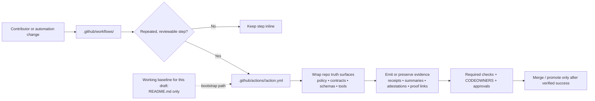

<!-- [KFM_META_BLOCK_V2]
doc_id: kfm://doc/<pending-uuid>
title: .github/actions/
type: standard
version: v1
status: draft
owners: @bartytime4life
created: <NEEDS VERIFICATION>
updated: 2026-03-19
policy_label: <NEEDS VERIFICATION>
related: [../README.md, ../workflows/, ../CODEOWNERS, ../../policy/, ../../contracts/, ../../schemas/]
tags: [kfm, github-actions, ci-cd, governance]
notes: [doc_id placeholder pending registry allocation, created and policy_label require repo verification, related links assume standard .github adjacency and should be branch-verified]
[/KFM_META_BLOCK_V2] -->

<a id="top"></a>

# `.github/actions/`

Reusable GitHub Actions contract and bootstrap surface for KFM’s repo-level workflow building blocks.


| Field | Value |
|---|---|
| Status | experimental |
| Owners | `@bartytime4life` |
| Path | `.github/actions/README.md` |
| Working baseline | `README.md` only in the supplied draft for this directory · **NEEDS VERIFICATION** against the mounted repo tree |
| Truth posture | **CONFIRMED** KFM doctrine for PR-first, fail-closed, evidence-bearing CI/CD and GitHub Actions as a guardrail layer · **PROPOSED** local-action catalog, folder contract, and bootstrap examples in this directory · **UNKNOWN / NEEDS VERIFICATION** exact mounted `.github/actions/` contents, live workflow callers, CODEOWNERS rules, required checks, and branch-protection settings |
| Quick jumps | [Scope](#scope) · [Repo fit](#repo-fit) · [Accepted inputs](#accepted-inputs) · [Exclusions](#exclusions) · [Directory tree](#directory-tree) · [Quickstart](#quickstart) · [Usage](#usage) · [Diagram](#diagram) · [Operating tables](#operating-tables) · [Task list / Definition of done](#task-list--definition-of-done) · [FAQ](#faq) · [Appendix](#appendix) |

> [!IMPORTANT]
> Current-session evidence for this draft was PDF-only, not a mounted repository checkout.
>
> Read this file as the **directory contract and bootstrap plan** for reusable repo-local actions. It does **not** claim that the live branch already contains a populated local-action catalog.

> [!NOTE]
> In March 2026 KFM doctrine, GitHub Actions acts as a **universal guardrail and promotion/gating layer**, not the scheduler of record for long-running governed orchestration.
>
> That means local actions in this directory should stay **thin**, **step-scoped**, **reviewable**, and **replaceable**.

---

## Scope

Use `.github/actions/` for **reusable repo-local GitHub Actions** that centralize repeated, governance-significant workflow steps.

Good fits include:

- policy-gate wrappers
- attestation and receipt helpers
- pinned setup/bootstrap helpers for repeatable CI tools
- provenance / Rekor / release-proof summary steps
- standard setup steps with KFM-safe defaults
- check-summary formatting for repeatable review signals

Do **not** use this directory as:

- the canonical home of OPA/Rego policy bodies
- the canonical home of JSON Schema, OpenAPI, STAC, DCAT, or PROV definitions
- a dumping ground for one-off shell blocks
- a replacement for reusable workflows under [`../workflows/`](../workflows/)
- a place to hide secrets, deploy credentials, or environment-specific operational logic

[Back to top](#top)

---

## Repo fit

**Path:** `.github/actions/README.md`  
**Role in repo:** directory README for reusable local actions that support KFM’s repository-side control plane.

### Expected upstream and downstream surfaces

This README is designed to sit beside the following repo surfaces:

- [`../README.md`](../README.md) — `.github/` gatehouse / governance entrypoint
- [`../workflows/`](../workflows/) — workflow orchestration layer and primary caller of local actions
- [`../CODEOWNERS`](../CODEOWNERS) — review boundary for `.github/**` and related governance surfaces
- [`../../policy/`](../../policy/) — canonical policy bodies and fixtures
- [`../../schemas/`](../../schemas/) — canonical schemas
- [`../../contracts/`](../../contracts/) — canonical contract surfaces
- [`../../tools/`](../../tools/) / [`../../scripts/`](../../scripts/) / [`../../packages/`](../../packages/) — heavier reusable logic that local actions should wrap rather than duplicate

> [!CAUTION]
> The links above reflect the **intended local topology** for this README.
>
> Their exact presence and current contents still require branch verification because the mounted repo tree was not directly visible in this session.

### KFM boundary rule

A local action may **invoke** policy, contracts, schemas, scripts, and verification logic, but it should not quietly become the only place where that logic survives.

[Back to top](#top)

---

## Accepted inputs

| Input type | What belongs here | Typical examples |
|---|---|---|
| Directory-level guidance | The contract for how repo-local actions should be created, named, and reviewed | this README |
| Composite action definitions | Thin reusable step wrappers | `action.yml` inside future action folders |
| Action-scoped docs | Inputs, outputs, permissions, failure modes, usage | `./<action-name>/README.md` |
| Small action-local helpers | Short scripts tightly coupled to one action | `src/check.sh`, `src/verify.py` |
| Action-local fixtures | Tiny self-test or lint fixtures | `tests/fixtures/` under an action |
| Review-facing defaults | Logging, shell-safety, permission, or summary conventions | helper actions such as `setup-conftest/` |

[Back to top](#top)

---

## Exclusions

| Keep out of `.github/actions/` | Why | Put it here instead |
|---|---|---|
| Canonical policy rules | Actions should wrap enforcement, not own policy truth | [`../../policy/`](../../policy/) |
| Canonical schemas and API contracts | Actions consume these; they do not define them | [`../../schemas/`](../../schemas/), [`../../contracts/`](../../contracts/) |
| Reusable workflow orchestration | Job- and pipeline-level orchestration belongs at workflow level | [`../workflows/`](../workflows/) |
| Heavy shared runtime logic | Large reusable logic should live in repo tooling or packages | [`../../tools/`](../../tools/), [`../../scripts/`](../../scripts/), [`../../packages/`](../../packages/) |
| Secrets or environment credentials | Local actions must not become secret stores | GitHub environments / secret managers / repo settings |
| Release manifests, receipts, or proof packs as authoritative data | Those are governed evidence artifacts, not action docs | governed data / release lanes elsewhere in the repo |

[Back to top](#top)

---

## Directory tree

### Working baseline (**supplied for this draft · NEEDS VERIFICATION**)

```text
.github/actions/
└── README.md
```

### Evidence-aligned target shape (**PROPOSED**)

```text
.github/actions/
├── README.md
├── setup-conftest/
│   ├── action.yml
│   └── README.md
├── opa-gate/
│   ├── action.yml
│   ├── README.md
│   └── src/
├── sigstore-attest/
│   ├── action.yml
│   ├── README.md
│   └── src/
└── rekor-evidence/
    ├── action.yml
    ├── README.md
    └── src/
```

> [!NOTE]
> The target shape above is a **bootstrap map**, not a claim about the current branch.
>
> The names are aligned to documented KFM examples and support material, but remain **PROPOSED** until the live repo tree is surfaced and reviewed.

[Back to top](#top)

---

## Quickstart

### 1) Inspect the current state

```bash
find .github/actions -maxdepth 2 -type f | sort
```

```bash
grep -R "uses: ./.github/actions/" -n .github/workflows 2>/dev/null || true
```

```bash
test -f .github/CODEOWNERS \
  && sed -n '1,120p' .github/CODEOWNERS \
  || echo ".github/CODEOWNERS not found"
```

### 2) Bootstrap the first local action (**PROPOSED**)

This example starts with a thin `opa-gate/` composite action. It assumes `conftest` is already available in the job environment or provided by a separate helper action such as a future `setup-conftest/`.

```bash
mkdir -p .github/actions/opa-gate/src

cat > .github/actions/opa-gate/action.yml <<'YAML'
name: opa-gate
description: Run repo-default Conftest / OPA checks against a target path.
inputs:
  target:
    description: File or directory to validate.
    required: true
  policy-path:
    description: Policy directory to use.
    required: false
    default: policy/
runs:
  using: composite
  steps:
    - name: Conftest gate
      shell: bash
      run: |
        set -euo pipefail
        conftest test "${{ inputs.target }}" --policy "${{ inputs.policy-path }}"
YAML

cat > .github/actions/opa-gate/README.md <<'MD'
# `opa-gate`

Thin wrapper for repo-local Conftest / OPA execution.

## Inputs

| Name | Required | Default | Description |
|---|---:|---|---|
| `target` | yes | — | File or directory to validate |
| `policy-path` | no | `policy/` | Policy directory to use |

## Usage

```yaml
- name: Policy gate
  uses: ./.github/actions/opa-gate
  with:
    target: data/catalog/
```

## Security notes

- no secrets required
- fails closed on policy denial
- intended to wrap repo policy, not replace it
MD
```

### 3) Wire it from a workflow (**illustrative**)

```yaml
jobs:
  policy_gates:
    runs-on: ubuntu-latest
    permissions:
      contents: read
    steps:
      - uses: actions/checkout@v4

      - name: Install Conftest
        run: |
          curl -L https://github.com/open-policy-agent/conftest/releases/download/v0.56.0/conftest_Linux_x86_64.tar.gz \
            | tar xz
          sudo mv conftest /usr/local/bin/

      - name: Policy gate
        uses: ./.github/actions/opa-gate
        with:
          target: data/catalog/
```

[Back to top](#top)

---

## Usage

### When to promote logic into a local action

| Situation | Keep inline | Promote into `.github/actions/` |
|---|---|---|
| One-off step unique to one workflow | yes | no |
| Same step repeated across multiple workflows | no | yes |
| Governance-significant check with stable inputs and stable failure semantics | rarely | yes |
| Large multi-job orchestration | no | use a reusable workflow instead |
| Heavy shared logic better maintained as a script or tool | no | wrap the tool, do not re-implement it |
| Experimental step likely to churn rapidly | usually | only after the interface stabilizes |

### Action design rules

Local actions should be:

- **single-purpose**
- **thin**
- **deterministic**
- **safe by default**
- **clear in failure**
- **easy to review**
- **easy to replace**

### Action contract

Every action folder should include:

| Requirement | Why it matters |
|---|---|
| `action.yml` | Makes the interface explicit and machine-readable |
| local `README.md` | Keeps purpose, usage, and caveats visible in review |
| explicit `inputs` | Prevents hidden assumptions |
| explicit `outputs` when relevant | Keeps downstream workflow behavior inspectable |
| safe shell defaults | Prevents silent partial failure |
| example usage snippet | Speeds review and adoption |
| security note | Documents permissions, secrets, and failure behavior |

### Security and governance rules

1. **Least privilege first**  
   Default workflow permissions should start from read-only and widen only when required.

2. **OIDC beats long-lived secrets**  
   Where attestation, signing, or cloud auth is involved, prefer short-lived identity over static credentials.

3. **Fail closed**  
   If a local action participates in policy, release, provenance, or publication gates, missing evidence should block the path.

4. **Do not duplicate canonical truth**  
   Policy stays in [`../../policy/`](../../policy/). Schemas stay in [`../../schemas/`](../../schemas/) and [`../../contracts/`](../../contracts/). Actions wrap those surfaces.

5. **Prefer machine-readable evidence to log-only success**  
   If an action participates in a governed gate, it should preserve or emit evidence that workflows can pass forward, not just print “done”.

6. **Be explicit about trusted refs**  
   If a gate uses `pull_request_target`, keep it read-only and avoid executing untrusted fork code under elevated permissions.

### Versioning and compatibility

Because local actions are path-referenced, changes land immediately for their callers.

Use these rules:

- avoid breaking changes on `main` without a migration plan
- prefer additive inputs with sensible defaults
- version by folder only when a real compatibility break exists
- deprecate visibly before removal
- treat action interfaces like repo-local APIs

A practical pattern:

```text
.github/actions/
├── opa-gate/
└── opa-gate-v2/
```

[Back to top](#top)

---

## Diagram


```mermaid
flowchart LR
    A[Contributor or automation change] --> B[.github/workflows/]
    B --> C{Repeated, reviewable step?}

    C -->|No| D[Keep step inline]
    C -->|Yes| E[.github/actions/<action>/action.yml]

    E --> F[Wrap repo truth surfaces<br/>policy • contracts • schemas • tools]
    F --> G[Emit or preserve evidence<br/>receipts • summaries • attestations • proof links]
    G --> H[Required checks + CODEOWNERS + approvals]
    H --> I[Merge / promote only after verified success]

    X[Working baseline for this draft:<br/>README.md only] -. bootstrap path .-> E
```

[Back to top](#top)

---

## Operating tables

### Control surfaces

| Surface | Role | Status in this README |
|---|---|---|
| [`../workflows/`](../workflows/) | Workflow orchestration layer and main consumer of local actions | **CONFIRMED** as a KFM control-plane responsibility · exact mounted path and inventory **NEEDS VERIFICATION** |
| [`../CODEOWNERS`](../CODEOWNERS) | Review boundary for `.github/**` and related governance surfaces | **CONFIRMED** as a review-control concept · exact mounted file and rules **NEEDS VERIFICATION** |
| [`../../policy/`](../../policy/) | Canonical policy bodies and fixtures | **CONFIRMED** doctrinal surface · exact mounted path **NEEDS VERIFICATION** |
| [`../../schemas/`](../../schemas/) | Canonical validation schemas | **CONFIRMED** doctrinal surface · exact mounted path **NEEDS VERIFICATION** |
| [`../../contracts/`](../../contracts/) | Canonical contract surfaces | **CONFIRMED** doctrinal surface · exact mounted path **NEEDS VERIFICATION** |
| [`../../tools/`](../../tools/), [`../../scripts/`](../../scripts/), [`../../packages/`](../../packages/) | Heavier reusable logic that actions should call instead of duplicating | **CONFIRMED** doctrinal surfaces · exact mounted paths **NEEDS VERIFICATION** |
| Branch protection / required checks / environments | Repo settings outside the visible tree | **UNKNOWN / NEEDS VERIFICATION** |

### Evidence-aligned first action families

> These are **PROPOSED** bootstrap candidates, not a current inventory claim.

| Proposed action | Job it would do | Typical consumer |
|---|---|---|
| `setup-conftest/` | Install a pinned Conftest toolchain with repo-safe defaults | policy workflows |
| `opa-gate/` | Run repo-default OPA / Conftest checks with consistent logging and exit behavior | PR policy gate |
| `sigstore-attest/` | Wrap keyless attestation with repo-standard metadata and permissions guidance | release / attestation lane |
| `rekor-evidence/` | Extract and surface Rekor evidence in summaries or artifacts | promotion / review lane |
| `run-manifest/` | Validate or materialize receipt/provenance helper steps around `run_manifest`-style artifacts | governed release lane |

[Back to top](#top)

---

## Task list / Definition of done

A new local action is ready for merge when:

- [ ] it has one clear responsibility
- [ ] it includes `action.yml`
- [ ] it includes an action-local `README.md`
- [ ] its inputs are explicit
- [ ] its outputs are explicit when reused downstream
- [ ] its shell steps fail loudly and safely
- [ ] it does not echo secrets
- [ ] it does not silently widen workflow permissions
- [ ] it does not duplicate canonical policy or schema truth
- [ ] it includes one workflow usage example
- [ ] it has at least one reviewable smoke path, fixture path, or exercising workflow
- [ ] it preserves KFM’s PR-first, fail-closed posture
- [ ] any implementation claim stronger than `PROPOSED` has been branch-verified

[Back to top](#top)

---

## FAQ

### Why document this directory before it is populated?

Because empty directories grow quickly and inconsistently once copy-paste pressure starts. KFM benefits from setting the contract before action sprawl begins.

### Local action or reusable workflow?

Use a **local action** for a repeated **step**.  
Use a **reusable workflow** for a repeated **job or pipeline shape**.

### Where should policy logic live?

In [`../../policy/`](../../policy/).  
A local action may invoke policy evaluation, but it should not become the only place where policy semantics are preserved.

### Can a local action publish or deploy by itself?

Not as an uncontrolled shortcut. If it participates in publish or deploy lanes, it should remain inside governed workflows, emit or preserve evidence, and respect merge-blocking / promotion gates.

### How strict should future action names be?

Prefer **verb-first kebab-case**. Use KFM-specific naming only when the wrapper is genuinely KFM-specific and likely to coexist with a more generic equivalent.

[Back to top](#top)

---

## Appendix

<details>
<summary>Bootstrap template for a new composite action</summary>

### Minimal `action.yml`

```yaml
name: "<action-name>"
description: "One-sentence description of the action."

inputs:
  working-directory:
    description: "Directory to operate in."
    required: false
    default: "."

outputs: {}

runs:
  using: "composite"
  steps:
    - name: Execute action logic
      shell: bash
      working-directory: ${{ inputs.working-directory }}
      run: |
        set -euo pipefail
        echo "Replace with real logic"
```

### Minimal action README

```markdown
# `<action-name>`

Short purpose statement.

## Inputs

| Name | Required | Default | Description |
|---|---:|---|---|
| `working-directory` | no | `.` | Directory to operate in |

## Outputs

| Name | Description |
|---|---|
| _none_ | — |

## Usage

```yaml
- name: Run <action-name>
  uses: ./.github/actions/<action-name>
  with:
    working-directory: .
```

## Security notes

- required permissions:
- secrets used:
- fail-closed behavior:
```

### Review prompts for maintainers

- Does this action centralize a repeated step, or is it premature abstraction?
- Does it wrap canonical repo truth instead of copying it?
- Would a reusable workflow be the better shape?
- Are the permissions narrower than the surrounding job?
- Does the README explain enough for a reviewer to approve it confidently?

</details>

[Back to top](#top)