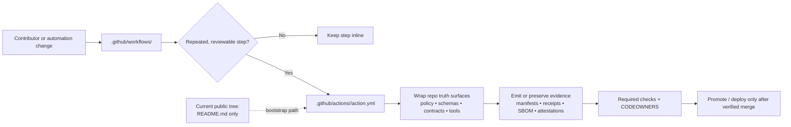

<a id="top"></a>

# `.github/actions/`
Reusable GitHub Actions contract and bootstrap surface for KFM’s repo-level workflow building blocks.


| Field | Value |
|---|---|
| Status | experimental |
| Owners | `@bartytime4life` |
| Path | `.github/actions/README.md` |
| Current public tree | `README.md` only |
| Truth posture | **CONFIRMED** current tree + governing KFM doctrine · **PROPOSED** first reusable local-action catalog · **UNKNOWN** exact live workflow coverage, required checks, and branch-protection settings outside the visible tree |
| Quick jumps | [Scope](#scope) · [Repo fit](#repo-fit) · [Accepted inputs](#accepted-inputs) · [Exclusions](#exclusions) · [Directory tree](#directory-tree) · [Quickstart](#quickstart) · [Usage](#usage) · [Diagram](#diagram) · [Operating tables](#operating-tables) · [Task list / Definition of done](#task-list--definition-of-done) · [FAQ](#faq) · [Appendix](#appendix) |

> [!IMPORTANT]
> The current public tree shows `.github/actions/README.md` and no action subdirectories.
>  
> Read this file as the **directory contract and bootstrap plan** for reusable local actions. It does **not** claim that a populated local-action catalog already exists on `main`.

> [!NOTE]
> In KFM, local actions are not a second source of truth for policy, schemas, release manifests, or runtime behavior. They are thin, reviewable wrappers around repeated workflow steps that help keep CI/CD **PR-first**, **fail-closed**, and evidence-aware.

---

## Scope

Use `.github/actions/` for **reusable repo-local GitHub Actions** that centralize repeated, governance-significant workflow steps.

Good fits include:

- policy-gate wrappers
- metadata-validation wrappers
- provenance / receipt checks
- SBOM / attestation helpers
- standard setup steps with KFM-safe defaults
- check-summary formatting for repeatable review signals

Do **not** use this directory as:

- the canonical home of OPA/Rego policy bodies
- the canonical home of JSON Schema, OpenAPI, STAC, DCAT, or PROV definitions
- a dumping ground for one-off shell blocks
- a replacement for reusable workflows under [`../workflows/`](../workflows/)
- a place to hide secrets, deploy credentials, or environment-specific operational logic

[Back to top](#top)

---

## Repo fit

**Path:** `.github/actions/README.md`  
**Role in repo:** directory README for reusable local GitHub Actions that support KFM’s repository-side control plane.

### Upstream anchors

- [`../README.md`](../README.md) — `.github/` gatehouse and repo-governance entrypoint
- [`../../README.md`](../../README.md) — repo-root operating posture and truth boundary
- [`../../CONTRIBUTING.md`](../../CONTRIBUTING.md) — contributor workflow and review burden
- [`../CODEOWNERS`](../CODEOWNERS) — ownership and review boundary
- [`../../policy/`](../../policy/) — canonical policy bodies and fixtures
- [`../../schemas/`](../../schemas/) — canonical validation schemas
- [`../../contracts/`](../../contracts/) — canonical contract surfaces

### Downstream consumers

- [`../workflows/`](../workflows/) — workflow orchestration layer that calls local actions
- `./<action-name>/action.yml` — per-action composite entrypoint when local actions land
- `./<action-name>/README.md` — per-action contract, usage, and troubleshooting notes

### KFM boundary rule

A local action may **invoke** policy, schemas, tools, and validation logic, but it should not quietly become the only place where that logic survives.

[Back to top](#top)

---

## Accepted inputs

| Input type | What belongs here | Typical examples |
|---|---|---|
| Directory-level guidance | The contract for how local actions should be created and reviewed | this README |
| Composite action definitions | Thin reusable step wrappers | `action.yml` files inside future action folders |
| Action-scoped docs | Inputs, outputs, permissions, failure modes, usage | `./<action-name>/README.md` |
| Small action-local helpers | Short scripts tightly coupled to one action | `src/check.sh`, `src/verify.py` |
| Action-local test fixtures | Small examples for self-test or lint coverage | `tests/fixtures/` under an action |
| Review-facing defaults | Logging, shell-safety, and permission conventions | shared bootstrap patterns used by multiple actions |

---

## Exclusions

| Keep out of `.github/actions/` | Why | Put it here instead |
|---|---|---|
| Canonical policy rules | Actions should wrap enforcement, not own policy truth | [`../../policy/`](../../policy/) |
| Canonical schemas and API contracts | Actions consume these; they do not define them | [`../../schemas/`](../../schemas/), [`../../contracts/`](../../contracts/) |
| Reusable workflow orchestration | Job- and pipeline-level orchestration belongs at workflow level | [`../workflows/`](../workflows/) |
| Heavy shared runtime logic | Large reusable logic should live in repo tooling or packages | [`../../tools/`](../../tools/), [`../../scripts/`](../../scripts/), `../../packages/` |
| Secrets or environment credentials | Local actions must not become secret stores | GitHub settings / environments / external secret manager |
| Release manifests, receipts, or proof packs as authoritative data | Those are governed evidence artifacts, not action docs | governed data / release lanes elsewhere in the repo |

[Back to top](#top)

---

## Directory tree

### Current public tree (**CONFIRMED**)

```text
.github/actions/
└── README.md
```

### Mature target shape (**PROPOSED**)

```text
.github/actions/
├── README.md
├── metadata-validate/
│   ├── action.yml
│   ├── README.md
│   └── src/
├── opa-gate/
│   ├── action.yml
│   ├── README.md
│   └── src/
├── provenance-guard/
│   ├── action.yml
│   ├── README.md
│   └── src/
└── sbom-produce-and-sign/
    ├── action.yml
    ├── README.md
    └── src/
```

> [!CAUTION]
> The mature tree above is a **target shape**, not a claim about the current checkout.
>  
> Keep current-state and target-state language separate. KFM’s documentation rules explicitly reject attractive overstatement.

[Back to top](#top)

---

## Quickstart

### 1) Inspect the current state

```bash
find .github/actions -maxdepth 2 -type f | sort
```

```bash
find .github -maxdepth 2 -type f | sort
```

```bash
sed -n '1,120p' .github/CODEOWNERS
```

### 2) Bootstrap the first local action (**PROPOSED**)

```bash
mkdir -p .github/actions/opa-gate/src
cat > .github/actions/opa-gate/action.yml <<'YAML'
name: opa-gate
description: Run repo-default Conftest / OPA checks against a target path.
inputs:
  target:
    description: File or directory to validate.
    required: true
runs:
  using: composite
  steps:
    - name: Conftest gate
      shell: bash
      run: |
        set -euo pipefail
        conftest test "${{ inputs.target }}" --policy policy/
YAML

cat > .github/actions/opa-gate/README.md <<'MD'
# `opa-gate`

Thin wrapper for repo-local Conftest / OPA execution.

## Inputs

| Name | Required | Description |
|---|---:|---|
| `target` | yes | File or directory to validate |

## Usage

```yaml
- name: Policy gate
  uses: ./.github/actions/opa-gate
  with:
    target: data/catalog/
```

## Security notes

- no secrets required
- action fails closed on policy denial
MD
```

### 3) Wire it from a workflow (**illustrative**)

```yaml
jobs:
  policy_gates:
    runs-on: ubuntu-latest
    permissions:
      contents: read
    steps:
      - uses: actions/checkout@v4
      - name: Policy gate
        uses: ./.github/actions/opa-gate
        with:
          target: data/catalog/
```

[Back to top](#top)

---

## Usage

### When to promote logic into a local action

| Situation | Keep inline | Promote into `.github/actions/` |
|---|---|---|
| One-off step unique to one workflow | yes | no |
| Same step repeated across multiple workflows | no | yes |
| Governance-significant check with stable inputs and stable failure semantics | rarely | yes |
| Large multi-job orchestration | no | use a reusable workflow instead |
| Heavy shared logic better maintained as a script or tool | no | wrap the tool, do not re-implement it |
| Experimental step likely to churn rapidly | usually | only after the interface stabilizes |

### Action design rules

Local actions should be:

- **single-purpose**
- **thin**
- **deterministic**
- **safe by default**
- **clear in failure**
- **easy to review**
- **easy to replace**

### Action contract

Every action folder should include:

| Requirement | Why it matters |
|---|---|
| `action.yml` | Makes the interface explicit and machine-readable |
| local `README.md` | Keeps purpose, usage, and caveats visible in review |
| explicit `inputs` | Prevents hidden assumptions |
| explicit `outputs` when relevant | Keeps downstream workflow behavior inspectable |
| safe shell defaults | Prevents silent partial failure |
| example usage snippet | Speeds review and adoption |
| security note | Documents permissions, secrets, and failure behavior |

### Security and governance rules

1. **Least privilege first**  
   Default workflow permissions should start from read-only and widen only when required.

2. **OIDC beats long-lived secrets**  
   Where attestation, signing, or cloud auth is involved, prefer short-lived identity over static credentials.

3. **Fail closed**  
   If a local action participates in policy, release, provenance, or publication gates, missing evidence should block the path.

4. **Do not duplicate canonical truth**  
   Policy stays in [`../../policy/`](../../policy/). Schemas stay in [`../../schemas/`](../../schemas/) and [`../../contracts/`](../../contracts/). Actions wrap those surfaces.

5. **Prefer machine-readable evidence to log-only success**  
   If an action participates in a governed gate, it should preserve or emit evidence that workflows can pass forward, not just print “done”.

### Versioning and compatibility

Because local actions are path-referenced, changes land immediately for their callers.

Use these rules:

- avoid breaking changes on `main` without a migration plan
- prefer additive inputs with sensible defaults
- version by folder only when a real compatibility break exists
- deprecate visibly before removal
- treat action interfaces like repo-local APIs

A practical pattern:

```text
.github/actions/
├── metadata-validate/
└── metadata-validate-v2/
```

[Back to top](#top)

---

## Diagram


```mermaid
flowchart LR
    A[Contributor or automation change] --> B[.github/workflows/]
    B --> C{Repeated, reviewable step?}
    C -->|No| D[Keep step inline]
    C -->|Yes| E[.github/actions/<action>/action.yml]
    E --> F[Wrap repo truth surfaces<br/>policy • schemas • contracts • tools]
    F --> G[Emit or preserve evidence<br/>manifests • receipts • SBOM • attestations]
    G --> H[Required checks + CODEOWNERS]
    H --> I[Promote / deploy only after verified merge]

    X[Current public tree:<br/>README.md only] -. bootstrap path .-> E
```

[Back to top](#top)

---

## Operating tables

### Control surfaces

| Surface | Role | Status in this README |
|---|---|---|
| [`../workflows/`](../workflows/) | Workflow orchestration layer and main consumer of local actions | **CONFIRMED** directory exists; exact current workflow inventory remains outside this file |
| [`../CODEOWNERS`](../CODEOWNERS) | Review boundary for `.github/**` and related governance surfaces | **CONFIRMED** |
| [`../../policy/`](../../policy/) | Canonical OPA / Rego policy bodies and fixtures | **CONFIRMED** directory exists |
| [`../../schemas/`](../../schemas/) | Canonical validation schemas | **CONFIRMED** directory exists |
| [`../../contracts/`](../../contracts/) | Canonical contract surfaces | **CONFIRMED** directory exists |
| [`../../tools/`](../../tools/), [`../../scripts/`](../../scripts/) | Heavier reusable logic that actions should call instead of duplicating | **CONFIRMED** directories exist |
| Branch protection / required checks / environments | Repo settings outside the visible tree | **UNKNOWN / NEEDS VERIFICATION** |

### Proposed first action families

> These are **illustrative**, not current inventory.

| Proposed action | Job it would do | Typical consumer |
|---|---|---|
| `metadata-validate/` | Validate STAC / DCAT / PROV metadata against schema + policy | catalog / metadata gate |
| `opa-gate/` | Run repo-default Conftest / OPA checks with consistent logging | PR policy gate |
| `provenance-guard/` | Require run manifests, PROV links, and no orphan outputs | release / publish gate |
| `sbom-produce-and-sign/` | Generate SBOM and produce signing / attestation evidence | release / artifact integrity lane |
| `sigstore-attest/` | Wrap keyless attestation with repo-standard metadata | attestation / release evidence lane |

[Back to top](#top)

---

## Task list / Definition of done

A new local action is ready for merge when:

- [ ] it has one clear responsibility
- [ ] it includes `action.yml`
- [ ] it includes an action-local `README.md`
- [ ] its inputs are explicit
- [ ] its outputs are explicit when reused downstream
- [ ] its shell steps fail loudly and safely
- [ ] it does not echo secrets
- [ ] it does not duplicate canonical policy or schema truth
- [ ] it includes one workflow usage example
- [ ] it has at least one reviewable test path, smoke path, or exercising workflow
- [ ] it preserves KFM’s PR-first, fail-closed posture
- [ ] any implementation claim stronger than `PROPOSED` has been branch-verified

[Back to top](#top)

---

## FAQ

### Why document this directory before it is populated?

Because empty directories grow fast and inconsistently once copy-paste pressure starts. KFM benefits from setting the contract before action sprawl begins.

### Local action or reusable workflow?

Use a **local action** for a repeated **step**.  
Use a **reusable workflow** for a repeated **job or pipeline shape**.

### Where should policy logic live?

In [`../../policy/`](../../policy/).  
A local action may invoke policy evaluation, but it should not become the only place where policy semantics are preserved.

### Can a local action publish or deploy by itself?

Not as an uncontrolled shortcut. If it participates in publish or deploy lanes, it should remain inside governed workflows, emit or preserve evidence, and respect merge-blocking / promotion gates.

### Should future action names be KFM-prefixed?

Prefer **verb-first kebab-case**. Add a `kfm-` prefix only when the wrapper is explicitly KFM-specific and likely to coexist with a more generic equivalent.

[Back to top](#top)

---

## Appendix

<details>
<summary>Bootstrap template for a new composite action</summary>

### Minimal `action.yml`

```yaml
name: "<action-name>"
description: "One-sentence description of the action."

inputs:
  working-directory:
    description: "Directory to operate in."
    required: false
    default: "."

outputs: {}

runs:
  using: "composite"
  steps:
    - name: Execute action logic
      shell: bash
      working-directory: ${{ inputs.working-directory }}
      run: |
        set -euo pipefail
        echo "Replace with real logic"
```

### Minimal action README

```markdown
# `<action-name>`

Short purpose statement.

## Inputs

| Name | Required | Default | Description |
|---|---:|---|---|
| `working-directory` | no | `.` | Directory to operate in |

## Outputs

| Name | Description |
|---|---|
| _none_ | — |

## Usage

```yaml
- name: Run <action-name>
  uses: ./.github/actions/<action-name>
  with:
    working-directory: .
```

## Security notes

- required permissions:
- secrets used:
- fail-closed behavior:
```

### Review prompts for maintainers

- Does this action centralize a repeated step, or is it premature abstraction?
- Does it wrap canonical repo truth instead of copying it?
- Would a reusable workflow be the better shape?
- Are the permissions narrower than the surrounding job?
- Does the README explain enough for a reviewer to approve it confidently?

</details>

[Back to top](#top)
