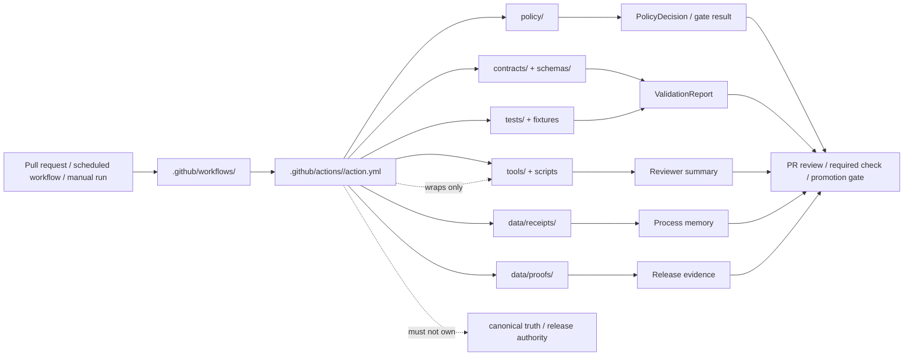

<!-- [KFM_META_BLOCK_V2]
doc_id: kfm://doc/github/actions-readme/NEEDS-VERIFICATION
title: .github/actions
type: standard
version: v1.1
status: draft
owners: @bartytime4life
created: NEEDS-VERIFICATION
updated: 2026-04-27
policy_label: public
related: [../README.md, ../CODEOWNERS, ../PULL_REQUEST_TEMPLATE.md, ../workflows/README.md, ../watchers/README.md, ../../README.md, ../../contracts/README.md, ../../schemas/README.md, ../../policy/README.md, ../../tests/README.md, ../../tools/README.md, ../../tools/validators/README.md, ../../tools/attest/README.md, ../../tools/ci/README.md, ../../data/receipts/README.md, ../../data/proofs/README.md]
tags: [kfm, github-actions, ci-cd, governance, local-actions, policy-gates, provenance]
notes: [doc_id and created date require document-registry or git-history verification, owner is grounded in CODEOWNERS fallback coverage for /.github/actions/ and should be rechecked before merge, policy_label is based on public repository exposure and should be checked against the policy-label registry, this README documents repo-local action boundaries and seeded composite-action scaffolds, workflow callers required checks OIDC environments and platform settings remain NEEDS VERIFICATION]
[/KFM_META_BLOCK_V2] -->

<a id="top"></a>

# `.github/actions`

Thin, reviewable, repo-local GitHub Action wrappers for Kansas Frontier Matrix governance steps.

> [!IMPORTANT]
> **Status:** `experimental`  
> **Owners:** `@bartytime4life`  
> **Path:** `.github/actions/README.md`  
> **Documented local-action inventory:** `metadata-validate`, `opa-gate`, `provenance-guard`, `sbom-produce-and-sign`, plus a shared-helper placeholder under `src/`.  
> **Verification boundary:** action folders and metadata can be inspected from the repository tree; workflow callers, required-check wiring, OIDC trust, environments, branch protection, and emitted receipt/proof behavior must be verified separately.  
> **KFM boundary rule:** local actions may wrap governance checks. They do not define policy, own canonical truth, approve promotion, store release proof, or publish on their own.


**Quick jumps:** [Scope](#scope) · [Operating law](#operating-law) · [Repo fit](#repo-fit) · [Current inventory](#current-inventory) · [Accepted inputs](#accepted-inputs) · [Exclusions](#exclusions) · [Action maturity model](#action-maturity-model) · [Quickstart](#quickstart) · [Usage](#usage) · [Security defaults](#security-defaults) · [Diagram](#diagram) · [Operating tables](#operating-tables) · [Definition of done](#definition-of-done) · [FAQ](#faq) · [Appendix](#appendix)

> [!NOTE]
> This README is intentionally conservative. It documents the seam where repository-local actions can live, but it does not claim that a local action is release-significant, required by branch protection, wired to a caller workflow, trusted for OIDC, or emitting durable evidence until that status is verified from checked-in workflow files and GitHub platform settings.

---

## Scope

`.github/actions/` is the **step-level reuse seam** inside KFM’s GitHub control surface.

Use it for small composite actions that make repeated workflow steps easier to review, reuse, and test. A healthy local action may wrap metadata validation, policy evaluation, provenance checks, receipt checks, SBOM generation, signing support, or reviewer-summary rendering.

It must not become the root authority for policy, contracts, schemas, evidence, receipts, proofs, promotion, correction, release state, or repository truth.

### What this surface protects

| KFM concern | Boundary rule |
|---|---|
| **Governance** | Local actions may call policy gates; they do not define policy meaning. |
| **Contracts and schemas** | Local actions may validate contracts and schemas; they do not become the contract home. |
| **Receipts** | Local actions may emit or check process-memory receipts; durable receipt storage belongs elsewhere. |
| **Proofs** | Local actions may help assemble or verify proof signals; release-significant proof storage is not here. |
| **Promotion** | Local actions may block unsafe transitions; they do not self-approve publication. |
| **Secrets** | Local actions must not store secrets, long-lived credentials, or untracked local overrides. |
| **AI and summaries** | Local actions may summarize generated reports; summaries remain review aids, not proof. |

[Back to top](#top)

---

## Operating law

KFM’s repository automation must preserve the same trust posture as the rest of the system.

```text
RAW -> WORK / QUARANTINE -> PROCESSED -> CATALOG / TRIPLET -> PUBLISHED
```

A local action may assist with one gate in that lifecycle. It must not collapse the lifecycle, silently convert candidate material into published material, or let generated language stand in for evidence.

### Non-negotiables

- Public-facing claims must remain traceable to admissible evidence, review state, policy posture, release state, and correction lineage.
- Promotion is a governed state transition, not a file move and not a convenience action.
- EvidenceBundle outranks generated summaries, logs, annotations, and rendered Markdown.
- Derived artifacts such as tiles, summaries, SBOMs, attestations, and reviewer notes are not canonical truth by themselves.
- Fail closed when an action guards policy, provenance, evidence, release, secrets, or publication.

> [!CAUTION]
> A repo-local action can become trust-bearing. It must not become truth-bearing by itself.

[Back to top](#top)

---

## Repo fit

**Path:** `.github/actions/README.md`  
**Role:** directory README for repo-local GitHub Actions, placeholder-to-action graduation rules, and the boundary between step wrappers and canonical KFM trust surfaces.

| Direction | Surface | Relationship |
|---|---|---|
| Parent gatehouse | [`../README.md`](../README.md) | Describes `.github/` as the repository-side control surface. |
| Ownership | [`../CODEOWNERS`](../CODEOWNERS) | Routes `.github/actions/` review through the current owner rule; recheck before merge. |
| PR intake | [`../PULL_REQUEST_TEMPLATE.md`](../PULL_REQUEST_TEMPLATE.md) | Keeps changes tied to truth labels, evidence, validation, rollback, and review burden. |
| Caller lane | [`../workflows/README.md`](../workflows/README.md) | Workflows orchestrate jobs, permissions, and promotion choreography; actions provide reusable steps. |
| Adjacent watcher lane | [`../watchers/README.md`](../watchers/README.md) | Watcher docs may eventually call through actions or workflows, but do not prove action runtime by themselves. |
| Root posture | [`../../README.md`](../../README.md) | Keeps this surface aligned to KFM’s governed, evidence-first, map-first, time-aware mission. |
| Contract authority | [`../../contracts/README.md`](../../contracts/README.md), [`../../schemas/README.md`](../../schemas/README.md) | Actions may validate these surfaces, not redefine them. |
| Policy authority | [`../../policy/README.md`](../../policy/README.md) | Actions may invoke allow/deny checks, but policy meaning belongs here. |
| Verification burden | [`../../tests/README.md`](../../tests/README.md), [`../../tests/ci/README.md`](../../tests/ci/README.md), [`../../tests/validators/README.md`](../../tests/validators/README.md) | Fixtures and tests prove action behavior; a README alone does not. |
| Durable tooling | [`../../tools/README.md`](../../tools/README.md), [`../../tools/validators/README.md`](../../tools/validators/README.md), [`../../tools/attest/README.md`](../../tools/attest/README.md), [`../../tools/ci/README.md`](../../tools/ci/README.md) | Logic that grows beyond thin step glue should graduate here. |
| Process memory | [`../../data/receipts/README.md`](../../data/receipts/README.md) | Receipts record process memory outside action folders. |
| Release evidence | [`../../data/proofs/README.md`](../../data/proofs/README.md) | Proofs remain distinct from logs, summaries, and receipts. |

[Back to top](#top)

---

## Current inventory

### Documented snapshot

```text
.github/actions/
├── README.md
├── metadata-validate/
│   ├── action.yml
│   ├── README.md
│   └── src/validate.sh
├── opa-gate/
│   ├── action.yml
│   ├── README.md
│   └── src/evaluate.sh
├── provenance-guard/
│   ├── action.yml
│   ├── README.md
│   └── src/verify.sh
├── sbom-produce-and-sign/
│   ├── action.yml
│   ├── README.md
│   └── src/build.sh
└── src/
    └── README.md
```

Treat these as seeded, composable wrappers until caller workflows, fixture coverage, required-check status, and platform settings are verified.

### Verification posture

| Surface | Current posture | What still needs checking |
|---|---|---|
| Directory README | **CONFIRMED** as this documented surface. | Metadata registry values and link resolution. |
| Seeded local-action folders | **CONFIRMED from source-check note / verify on branch before merge.** | Actual branch inventory, non-empty metadata, executable scripts, and local README quality. |
| Workflow callers | **NEEDS VERIFICATION.** | Checked-in workflow YAML plus GitHub Actions run behavior. |
| Required checks | **UNKNOWN.** | Branch protection and repository settings. |
| OIDC / environments | **UNKNOWN.** | GitHub environments, permissions, and trusted audience configuration. |
| Durable receipt/proof emission | **UNKNOWN.** | Workflow artifacts, receipts, proof packs, or attestation bundles. |

### Next target shape

```text
.github/actions/
├── <existing seeded actions>/
│   ├── action.yml
│   ├── README.md
│   ├── src/
│   └── tests/fixtures/
├── <future local actions>/
│   ├── action.yml
│   ├── README.md
│   ├── src/
│   ├── templates/
│   └── tests/fixtures/
└── src/
    ├── README.md
    └── <tiny-shared-helper>.*
```

> [!TIP]
> Keep each action single-purpose. When the logic becomes reusable outside GitHub Actions, move it into `tools/`, `scripts/`, `packages/`, or another verified owner surface and let the local action call it.

[Back to top](#top)

---

## Accepted inputs

Use this directory only for files tightly coupled to repo-local action contracts.

| Accepted input | What belongs here | Typical shape |
|---|---|---|
| Directory contract | Purpose, scope, current inventory, and action graduation rules. | `README.md` |
| Action metadata | Machine-readable GitHub Action contract. | `<action-name>/action.yml` |
| Action-local README | Inputs, outputs, permissions, examples, caveats, and failure behavior. | `<action-name>/README.md` |
| Tiny helper code | Minimal action-local logic that does not deserve a durable tool lane. | `<action-name>/src/*` |
| Smoke fixtures | Minimal public-safe fixtures for the action’s own behavior. | `<action-name>/tests/fixtures/*` |
| Summary templates | Small step-summary, receipt, or review-output templates. | `<action-name>/templates/*` |
| Migration notes | Temporary notes when replacing, renaming, or versioning a local action. | `<action-name>/migration.md` |

### Input rules

1. Keep every action single-purpose.
2. Make inputs, outputs, permissions, dependencies, and failure states explicit.
3. Use minimal permissions by default.
4. Fail closed when the action guards policy, provenance, contracts, receipts, proofs, or release state.
5. Keep durable logic in `tools/`, `scripts/`, `packages/`, or another verified owner surface.
6. Do not imply a caller exists until a checked-in workflow or platform configuration proves it.
7. Keep public-safe fixtures small and reviewable.
8. Make reviewer summaries visibly non-authoritative.

[Back to top](#top)

---

## Exclusions

Keep these out of `.github/actions/` unless there is a narrow wrapper reason and the ownership boundary remains obvious.

| Do not keep here | Better home | Why |
|---|---|---|
| Canonical contracts or schema law | [`../../contracts/`](../../contracts/), [`../../schemas/`](../../schemas/) | Contract meaning must remain readable outside action glue. |
| Policy bundles, Rego, allow/deny semantics, obligations | [`../../policy/`](../../policy/) | Policy must stay explicit, testable, and independently reviewable. |
| Multi-job workflows, promotion lanes, scheduled jobs | [`../workflows/`](../workflows/) | Job orchestration belongs in workflow YAML and workflow docs. |
| Watcher doctrine or source-refresh strategy | [`../watchers/`](../watchers/) or future verified watcher owner surface | Watcher behavior changes trust state and needs its own boundary. |
| Mature validators or reusable CLIs | [`../../tools/validators/`](../../tools/validators/), [`../../tools/`](../../tools/), [`../../scripts/`](../../scripts/) | Durable behavior deserves normal tooling lifecycle, tests, and docs. |
| Canonical receipt archives | [`../../data/receipts/`](../../data/receipts/) | Receipts are process memory, not action-local files. |
| Release proof packs or signatures | [`../../data/proofs/`](../../data/proofs/), release surfaces, or attestation tooling | Proofs must remain inspectable outside workflow glue. |
| Secrets, tokens, credentials, local overrides | GitHub environments, org/repo secrets, or external secret management | Action folders must never become secret stores. |
| Direct publish shortcuts | Governed workflow and promotion paths | KFM promotion is a governed state transition, not a convenience action. |
| Free-form AI answer generation | Governed AI runtime behind evidence and policy checks | Model output is interpretive, not root truth. |

> [!WARNING]
> If deleting one local action would erase important knowledge about what is publishable, what policy decided, or how a release is reconstructed, the action is carrying too much authority.

[Back to top](#top)

---

## Action maturity model

| Level | Name | Evidence required | Allowed use |
|---:|---|---|---|
| 0 | Placeholder | Directory or README only. | Documentation and planning. |
| 1 | Metadata present | `action.yml` exists, declares inputs/outputs, and has a local README. | Manual invocation in controlled workflows. |
| 2 | Fixture-covered | Positive and negative fixtures exist; failure behavior is documented. | Non-release CI checks. |
| 3 | Caller-wired | At least one checked-in workflow invokes the action. | Required-check candidate. |
| 4 | Gate-bearing | Minimal permissions, fail-closed behavior, review docs, rollback plan, and security posture are verified. | Governance or release-adjacent gates. |
| 5 | Mature / graduate | Logic is independently testable outside GitHub Actions. | Move durable logic to `tools/`, `scripts/`, or packages; keep the action as a wrapper. |

[Back to top](#top)

---

## Quickstart

Run these commands from the repository root before changing this directory.

### 1. Inspect the current action surface

```bash
# Show exactly what is checked in under the local-action seam.
find .github/actions -maxdepth 3 -type f 2>/dev/null | sort

# Detect composite-action metadata.
find .github/actions -name action.yml -type f -print 2>/dev/null | sort

# Re-read the parent GitHub gatehouse and workflow caller lane.
sed -n '1,220p' .github/README.md
sed -n '1,220p' .github/workflows/README.md
sed -n '1,220p' .github/watchers/README.md
```

### 2. Check ownership and review burden

```bash
sed -n '1,160p' .github/CODEOWNERS
sed -n '1,260p' .github/PULL_REQUEST_TEMPLATE.md
```

### 3. Check canonical authority surfaces before adding action logic

```bash
for f in \
  contracts/README.md \
  schemas/README.md \
  policy/README.md \
  tests/README.md \
  tests/ci/README.md \
  tests/validators/README.md \
  tools/README.md \
  tools/validators/README.md \
  tools/attest/README.md \
  tools/ci/README.md \
  data/receipts/README.md \
  data/proofs/README.md
do
  test -f "$f" && { echo "===== $f"; sed -n '1,180p' "$f"; } || true
done
```

### 4. Search for existing callers before inventing a new action

```bash
grep -R "uses: ./.github/actions/" -n .github/workflows 2>/dev/null || true
git grep -nE "metadata-validate|opa-gate|provenance-guard|sbom|receipt|proof|attest|conftest|cosign" -- . 2>/dev/null || true
```

### 5. Check script posture

```bash
find .github/actions -type f \( -name '*.sh' -o -name '*.bash' \) -print0 2>/dev/null |
  xargs -0 -r grep -nE "set -euo pipefail|GITHUB_OUTPUT|GITHUB_STEP_SUMMARY|curl|wget|git push|gh release|secrets\." || true
```

[Back to top](#top)

---

## Usage

Use repo-local actions when a repeated **step** deserves a named contract but does not deserve a full workflow, package, or tool lane.

### Choose the right reuse shape

| Shape | Use when | Keep logic here | Do not use for |
|---|---|---|---|
| Inline workflow step | The command is unique to one job and unlikely to repeat. | Tiny job-local glue. | Repeated governance steps. |
| Repo-local action | A repeated step needs stable inputs/outputs within this repo. | Thin wrappers, small summaries, action-local smoke logic. | Multi-job orchestration or canonical policy. |
| Reusable workflow | The repeated unit is a job or lane with its own permissions, environment, or artifact choreography. | Orchestration, promotion sequence, reviewer handoff. | Tiny helper steps. |
| Repo tool or script | Logic deserves independent tests, richer runtime support, or reuse outside GitHub Actions. | Durable validators, transformers, resolvers, summary renderers. | Hidden YAML-only behavior. |

### Seeded action families

| Action | Purpose | Current posture | Graduation condition |
|---|---|---|---|
| `metadata-validate/` | Validate metadata blocks, README structure, fixture headers, or source descriptors. | Seeded local wrapper; caller status requires verification. | Non-empty `action.yml`, fixture set, failure examples, and caller workflow. |
| `opa-gate/` | Wrap fail-closed OPA / Conftest policy checks. | Seeded local wrapper; caller status requires verification. | Explicit policy path, subject path, expected outcomes, and negative-path fixtures. |
| `provenance-guard/` | Verify provenance, receipt refs, EvidenceBundle refs, or attestation pointers. | Seeded local wrapper; caller status requires verification. | Clear distinction between receipts, proofs, logs, summaries, and attestations. |
| `sbom-produce-and-sign/` | Wrap SBOM generation and signing support for release evidence. | Seeded local wrapper; caller status requires verification. | Minimal permissions, no publish authority, and explicit handoff to proof or attest surfaces. |

### Future candidate actions

| Candidate action | Purpose | Graduation condition |
|---|---|---|
| `docs-structure-check/` | Call documentation tooling without absorbing documentation policy. | Tooling stays in `tools/docs/`; action only wraps invocation. |
| `ci-summary-publish/` | Publish compact reviewer summaries from existing generated reports. | Summary is marked as review aid, not authoritative proof. |
| `evidence-ref-check/` | Validate that referenced evidence identifiers resolve through expected fixtures or released records. | EvidenceBundle resolution contract and failure fixtures are present. |
| `release-manifest-check/` | Check release-manifest shape before promotion review. | Release authority remains outside the action; action only reports gate status. |

[Back to top](#top)

---

## Minimal contracts

The examples below are starter contracts. They become current implementation only after the corresponding files are checked in, invoked by a verified workflow, and covered by reviewable tests or fixtures.

### Illustrative action contract

```yaml
# .github/actions/opa-gate/action.yml
name: opa-gate
description: Run a repo-local OPA / Conftest policy gate against a supplied subject and policy path.

inputs:
  subject:
    description: File or directory to evaluate.
    required: true
  policy-path:
    description: Repo policy path to use.
    required: true

outputs:
  gate-status:
    description: One of PASS, FAIL, or ERROR.

runs:
  using: composite
  steps:
    - name: Evaluate policy
      shell: bash
      run: |
        set -euo pipefail

        if ! command -v conftest >/dev/null 2>&1; then
          echo "gate-status=ERROR" >> "$GITHUB_OUTPUT"
          echo "conftest is not available" >&2
          exit 2
        fi

        if conftest test "${{ inputs.subject }}" --policy "${{ inputs.policy-path }}"; then
          echo "gate-status=PASS" >> "$GITHUB_OUTPUT"
        else
          echo "gate-status=FAIL" >> "$GITHUB_OUTPUT"
          exit 1
        fi
```

### Illustrative workflow call

```yaml
jobs:
  policy_gate:
    runs-on: ubuntu-latest
    permissions:
      contents: read
    steps:
      - uses: actions/checkout@v4
        with:
          persist-credentials: false

      - name: Ensure conftest is available
        shell: bash
        run: |
          command -v conftest >/dev/null

      - name: Evaluate policy
        uses: ./.github/actions/opa-gate
        with:
          subject: fixtures
          policy-path: policy
```

[Back to top](#top)

---

## Security defaults

Local actions should make safe behavior the default and unsafe behavior hard to reach.

| Concern | Default |
|---|---|
| Checkout | `persist-credentials: false` unless write access is explicitly justified. |
| Permissions | `contents: read` by default; add write scopes only in workflows that truly need them. |
| Shell behavior | `set -euo pipefail` for Bash entrypoints. |
| Secrets | No secrets in action folders, examples, fixtures, logs, summaries, or generated docs. |
| External network | Avoid by default. If needed, document why, pin sources, and fail safely. |
| Publishing | No direct publish, release, deploy, or promotion shortcuts inside local action wrappers. |
| Generated summaries | Mark as review aids; do not label them proof. |
| Tool versions | Pin or verify where governance depends on behavior. |

[Back to top](#top)

---

## Evidence, receipt, and proof boundaries

| Object family | Action may do | Action must not do |
|---|---|---|
| `ValidationReport` | Run or wrap validation, surface pass/fail, preserve logs. | Redefine schema meaning. |
| `PolicyDecision` | Invoke policy tests and surface finite outcomes. | Decide policy semantics outside `policy/`. |
| `RunReceipt` | Emit process-memory references or summary paths. | Treat receipt as release proof. |
| `EvidenceBundle` | Check references or closure signals. | Replace admissible evidence with generated text. |
| `ProofPack` | Verify or assemble pointers when called by a governed workflow. | Store release proof locally in action folders. |
| `ReleaseManifest` | Validate shape before release review. | Publish, approve, or promote release state alone. |
| `ReviewerSummary` | Render a compact reviewer aid. | Present summary as authoritative proof. |

[Back to top](#top)

---

## Diagram


```mermaid
flowchart LR
  PR["Pull request / scheduled workflow / manual run"] --> WF[".github/workflows/"]
  WF --> ACT[".github/actions/<action>/action.yml"]

  ACT --> POL["policy/"]
  ACT --> CON["contracts/ + schemas/"]
  ACT --> TST["tests/ + fixtures"]
  ACT --> TOOL["tools/ + scripts"]
  ACT --> REC["data/receipts/"]
  ACT --> PROOF["data/proofs/"]

  POL --> DEC["PolicyDecision / gate result"]
  CON --> VAL["ValidationReport"]
  TST --> VAL
  TOOL --> SUM["Reviewer summary"]
  REC --> MEM["Process memory"]
  PROOF --> REL["Release evidence"]

  DEC --> REVIEW["PR review / required check / promotion gate"]
  VAL --> REVIEW
  SUM --> REVIEW
  MEM --> REVIEW
  REL --> REVIEW

  ACT -. "wraps only" .-> TOOL
  ACT -. "must not own" .-> TRUTH["canonical truth / release authority"]
```

[Back to top](#top)

---

## Operating tables

### Truth labels used here

| Label | Meaning in this README |
|---|---|
| **CONFIRMED** | Verified from the current source check, checked-in repository evidence, or directly inspectable adjacent files. |
| **INFERRED** | Conservative interpretation from confirmed structure and KFM doctrine. |
| **PROPOSED** | Recommended action shape, name, contract, or usage not yet verified as current checked-in implementation. |
| **UNKNOWN** | Not proven from current source check, mounted checkout, workflow inventory, repository settings, or emitted artifacts. |
| **NEEDS VERIFICATION** | Must be checked against the actual branch, git history, platform settings, or generated proof before merge or rollout. |

### Graduation gates

| Gate | Required evidence |
|---|---|
| **Inventory gate** | Directory exists, `action.yml` exists, local README exists. |
| **Contract gate** | Inputs, outputs, permissions, dependencies, and failure modes are declared. |
| **Boundary gate** | Action wraps canonical policy, schema, test, receipt, proof, or tool surfaces without redefining them. |
| **Fixture gate** | At least one positive and one negative path is exercised where risk matters. |
| **Caller gate** | At least one checked-in workflow caller or explicit migration note exists. |
| **Security gate** | No long-lived secret assumptions, no broad default permissions, no hidden publish path. |
| **Review gate** | PR includes evidence, rollback/correction impact, and docs updates where behavior changed. |

### Anti-patterns

| Anti-pattern | Why it is unsafe | Fix |
|---|---|---|
| Action defines policy meaning inline. | Policy becomes hidden in CI glue. | Move policy to `policy/`; action only invokes it. |
| Action writes release proof under `.github/actions/`. | Proof becomes hard to inspect and govern. | Store proof under release/proof surfaces. |
| Action publishes on success. | Promotion collapses into a step outcome. | Hand off to governed promotion workflow. |
| Action assumes broad write permissions. | Least privilege is lost. | Declare exact workflow permissions. |
| Action generates uncited reviewer language. | Summary can be mistaken for evidence. | Require EvidenceRef/EvidenceBundle references or label as non-authoritative. |
| Action stores tokens or local overrides. | Secret boundary is breached. | Use GitHub environments or approved secret management. |

### Failure outcomes

| Outcome | Meaning | Expected behavior |
|---|---|---|
| `PASS` | Gate succeeded and required outputs were emitted. | Continue workflow. |
| `FAIL` | Gate ran and found a policy, validation, evidence, provenance, or release issue. | Fail the step and surface reviewer-readable details. |
| `ABSTAIN` | Evidence is insufficient to make the requested claim. | Fail closed when release-significant; otherwise mark review-needed. |
| `DENY` | Policy blocks the requested action. | Fail closed. |
| `ERROR` | Tooling, dependency, input, or environment failure. | Fail closed and make the technical issue visible. |

[Back to top](#top)

---

## Definition of done

A local action is ready to graduate from proposal to implementation when:

- [ ] the action has one clear responsibility
- [ ] `<action-name>/action.yml` exists and is non-empty
- [ ] `<action-name>/README.md` describes inputs, outputs, permissions, examples, and failure behavior
- [ ] default permissions are minimal
- [ ] the action does not store secrets or assume hidden credentials
- [ ] canonical policy, contract, schema, receipt, proof, and release meanings remain outside the action folder
- [ ] the action fails loudly and safely when used as a gate
- [ ] fixtures or tests cover at least one success path and one failure path where risk matters
- [ ] at least one caller workflow or migration note is checked in
- [ ] any reviewer-facing summary is marked as a summary, not proof
- [ ] any emitted receipt/proof reference preserves the receipt/proof distinction
- [ ] related docs are updated in the same PR
- [ ] rollback is documented for any action that can block promotion or affect release evidence

A directory-level README revision is ready when:

- [ ] current inventory is accurate for the target branch
- [ ] all future action names are labeled **PROPOSED**
- [ ] no command assumes non-existent paths without guards
- [ ] relative links resolve from `.github/actions/README.md`
- [ ] current owner, status, and metadata placeholders are honest
- [ ] no current implementation behavior is claimed without branch evidence
- [ ] the Markdown renders cleanly on GitHub

[Back to top](#top)

---

## FAQ

### Are composite actions currently checked in here?

This README documents four seeded local-action scaffolds: `metadata-validate`, `opa-gate`, `provenance-guard`, and `sbom-produce-and-sign`. Re-run the inventory commands on the target branch before merge. Workflow usage, required-check status, and runtime behavior remain **NEEDS VERIFICATION** until callers and runs are inspected.

### Can a local action enforce policy?

Yes, as a wrapper. The policy meaning itself belongs in `policy/`, with tests and fixtures outside the action folder.

### Can a local action emit a receipt?

Yes, if the workflow and repository design call for it. The action may emit or reference process memory, but durable receipt storage belongs in `data/receipts/`.

### Can a local action create or publish proof?

It may help assemble, verify, or summarize proof signals. It should not become release proof storage or publish authority.

### Should action logic live in `.github/actions/src/`?

Only while it remains tiny, generic, and clearly action-local. Durable logic should graduate to `tools/`, `scripts/`, or another verified owner surface.

### What is the smallest credible next action?

Choose one seeded action, verify its `action.yml`, add a local README if needed, add public-safe fixtures, wire one guarded workflow caller, and document rollback.

### What should block merge?

Block merge when the action changes release, policy, proof, provenance, or publication posture without updated docs, negative-path fixtures, minimal permissions, and rollback instructions.

[Back to top](#top)

---

## Appendix

<details>
<summary>Pre-publish checklist</summary>

- [ ] KFM meta block wrapper is present and synchronized with the visible title.
- [ ] Status, owners, badges, path, repo fit, and quick jumps are present.
- [ ] Current inventory is stated without overclaiming implementation.
- [ ] Accepted inputs and exclusions are explicit.
- [ ] Directory tree includes documented current state and proposed target shape.
- [ ] Mermaid diagram reflects real responsibility boundaries.
- [ ] Examples are labeled illustrative.
- [ ] Commands are language-tagged and guarded where paths may be absent.
- [ ] Policy, contract, schema, receipt, proof, workflow, tool, and release boundaries remain distinct.
- [ ] No secret or direct-publish shortcut is introduced.
- [ ] Unknowns and verification gaps remain visible.

</details>

<details>
<summary>Reviewer verification checklist</summary>

```bash
# Confirm this file and adjacent GitHub gatehouse docs.
sed -n '1,320p' .github/actions/README.md
sed -n '1,260p' .github/README.md
sed -n '1,260p' .github/workflows/README.md
sed -n '1,220p' .github/watchers/README.md

# Confirm owner routing.
sed -n '1,180p' .github/CODEOWNERS

# Confirm action metadata that now exists.
find .github/actions -maxdepth 3 -type f | sort
find .github/actions -name action.yml -type f -print | sort

# Confirm callers.
grep -R "uses: ./.github/actions/" -n .github/workflows 2>/dev/null || true

# Confirm action logic does not absorb canonical authority.
git grep -nE "policy|schema|EvidenceBundle|RunReceipt|ReleaseManifest|ProofPack|PromotionDecision" -- .github/actions 2>/dev/null || true
```

</details>

<details>
<summary>Action README starter card</summary>

````markdown
# <action-name>

One-line purpose for a thin repo-local GitHub Action wrapper.

> [!IMPORTANT]
> **Status:** experimental  
> **Owners:** @bartytime4life  
> **Path:** `.github/actions/<action-name>/README.md`  
> **Caller status:** NEEDS VERIFICATION  
> **Authority boundary:** wraps checks; does not own policy, contracts, schemas, receipts, proofs, or release state.

## Inputs

| Input | Required | Meaning |
|---|---:|---|
| `<input>` | yes | What this action consumes. |

## Outputs

| Output | Meaning |
|---|---|
| `<output>` | What downstream jobs may read. |

## Failure behavior

- fail closed on missing required inputs
- fail closed on unresolved policy / evidence / provenance when used as a gate
- emit clear GitHub annotations for reviewer-visible errors

## Example

```yaml
- uses: ./.github/actions/<action-name>
  with:
    <input>: <value>
```

## Boundaries

This action may call tools, validators, policy checks, or summary renderers. It must not redefine their authority.
````

</details>

<details>
<summary>Source-status log for this README</summary>

| Item | Status |
|---|---|
| Current `.github/actions/` inventory | **CONFIRMED from documented source-check note / NEEDS VERIFICATION on the target branch before merge.** |
| Owner fallback for `/.github/actions/` | **CONFIRMED from documented CODEOWNERS note / recheck before merge.** |
| Current workflow callers | **NEEDS VERIFICATION** from checked-in workflow YAML and platform settings. |
| Required checks and branch protection | **UNKNOWN** from repository files alone. |
| OIDC and environment trust | **UNKNOWN** until platform settings are inspected. |
| Doc ID and created date | **NEEDS VERIFICATION** from document registry or git history. |

</details>

[Back to top](#top)
