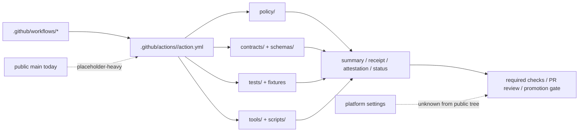

<!-- [KFM_META_BLOCK_V2]
doc_id: kfm://doc/<pending-uuid>
title: .github/actions/
type: standard
version: v1
status: draft
owners: @bartytime4life
created: <NEEDS VERIFICATION>
updated: 2026-04-03
policy_label: public
related: [../README.md, ../workflows/README.md, ../watchers/README.md, ../CODEOWNERS, ../PULL_REQUEST_TEMPLATE.md, ../SECURITY.md, ../../policy/, ../../contracts/, ../../schemas/, ../../tests/, ../../tools/, ../../scripts/]
tags: [kfm, github-actions, ci-cd, governance]
notes: [doc_id placeholder pending registry allocation, created date needs git-history verification, public-main repo tree rechecked 2026-04-03, platform settings and non-public workflow state remain UNKNOWN]
[/KFM_META_BLOCK_V2] -->

<a id="top"></a>

# `.github/actions/`

Repo-local action contracts and thin step wrappers for validation, provenance, and review-bearing delivery in Kansas Frontier Matrix.


| Field | Value |
|---|---|
| Status | `experimental` |
| Owners | `@bartytime4life` *(confirmed current public `CODEOWNERS` coverage for `/.github/`)* |
| Path | `.github/actions/README.md` |
| Default branch | `main` |
| Visibility | `public` |
| Repo fit | Repo-local action surface inside the [`.github`](../README.md) gatehouse; upstream from [`../workflows/README.md`](../workflows/README.md) and adjacent to [`../watchers/README.md`](../watchers/README.md) |
| Current public tree state | `README.md`, root `action.yml` *(0 bytes on public `main`)*, placeholder `src/`, and README-only placeholder directories: `metadata-validate/`, `metadata-validate-v2/`, `opa-gate/`, `provenance-guard/`, `sbom-produce-and-sign/` |
| Truth posture | **CONFIRMED** current public repo tree, current public Markdown surfaces, and current `CODEOWNERS` coverage · **INFERRED** intended action seam for review-bearing automation · **PROPOSED** graduation path from placeholders to usable local actions · **UNKNOWN** GitHub rulesets, required checks, OIDC wiring, environment approvals, non-public callers, and runtime proof depth |
| Quick jumps | [Scope](#scope) · [Current public deltas](#current-public-deltas) · [Repo fit](#repo-fit) · [Accepted inputs](#accepted-inputs) · [Exclusions](#exclusions) · [Directory tree](#directory-tree) · [Quickstart](#quickstart) · [Usage](#usage) · [Diagram](#diagram) · [Current public inventory](#current-public-inventory) · [Task list / definition of done](#task-list--definition-of-done) · [FAQ](#faq) · [Appendix](#appendix) |

> [!IMPORTANT]
> Public `main` is now inspectable enough that this README should describe `.github/actions/` as it actually exists today, not only as a hypothetical control-plane surface.

> [!NOTE]
> The current public inventory is **real but placeholder-heavy**. The named action directories exist, but public `main` does not yet show directory-local `action.yml` contracts or action-local implementation files for them.

> [!WARNING]
> Repo-local actions may enforce contracts, policy checks, receipts, or attestations, but they must never become the only place where policy meaning, schema meaning, or release authority survives.

---

## Scope

`.github/actions/` is the **step-level reuse seam** inside KFM’s repository-side control plane.

Use this directory for thin, reviewable, repo-local actions that centralize repeated workflow **steps** such as:

- metadata and fixture validation
- deny-by-default policy checks
- provenance and receipt guards
- SBOM production and signing wrappers
- small summary or verification helpers

Do **not** use this directory as the sovereign home of policy, contract meaning, canonical evidence, or publish authority. In KFM, those meanings must stay readable outside workflow glue.

[Back to top](#top)

---

## Current public deltas

Earlier drafts treated `.github/actions/` as mostly inferred. That is no longer the right posture.

| Delta | Current public signal | Why it matters | Posture |
|---|---|---|---|
| Inventory is now visible | Public `main` shows named action directories plus `README.md`, `src/`, and a root `action.yml` | This README can now separate current inventory from proposed future shape | **CONFIRMED** |
| Current inventory is placeholder-heavy | Each visible named action directory currently exposes `README.md` only, and that README is a placeholder text file | The directory is real, but the checked-in action contracts are not yet present on public `main` | **CONFIRMED** |
| Root-level `action.yml` exists but is empty | `.github/actions/action.yml` is present and 0 bytes | Treat it as a placeholder or unresolved root artifact until its role is justified or it is removed | **CONFIRMED** file · **INFERRED** non-usable action contract |
| Caller inventory remains unproven | Public `main` shows [`../workflows/README.md`](../workflows/README.md) only, not checked-in workflow YAML files | Active callers of these local actions cannot be established from the visible branch tree | **CONFIRMED** current snapshot · **UNKNOWN** live callers |
| Version drift is already visible | `metadata-validate/` and `metadata-validate-v2/` coexist | Versioned action namespaces should be justified by a real caller migration, not left as permanent ambiguity | **CONFIRMED** inventory · **PROPOSED** cleanup rule |

[Back to top](#top)

---

## Repo fit

Path: `.github/actions/README.md`

Role in repo: directory README for repo-local GitHub Actions, local action contracts, placeholder-to-production graduation rules, and the boundary between workflow orchestration and canonical truth surfaces.

### Upstream and adjacent anchors

| Relation | Path | Why it matters |
|---|---|---|
| Parent gatehouse | [`../README.md`](../README.md) | Defines `.github/` as the repository-side gatehouse for review, verification, and governed delivery |
| Workflow caller lane | [`../workflows/README.md`](../workflows/README.md) | Workflows orchestrate jobs and permissions; local actions should stay at repeated-step scope |
| Adjacent watcher docs | [`../watchers/README.md`](../watchers/README.md) | Watcher scaffolds may eventually point to workflow or action seams, but do not by themselves prove live action usage |
| Review ownership | [`../CODEOWNERS`](../CODEOWNERS) | Makes control-plane review routing explicit |
| PR evidence contract | [`../PULL_REQUEST_TEMPLATE.md`](../PULL_REQUEST_TEMPLATE.md) | Keeps action changes tied to truth labels, validation evidence, rollout, and rollback |
| Security surface | [`../SECURITY.md`](../SECURITY.md) | Keeps repo-side security guidance close to action and workflow changes |
| Canonical policy truth | [`../../policy/`](../../policy/) | Actions may evaluate policy, but should not own policy meaning |
| Canonical contract and schema truth | [`../../contracts/`](../../contracts/), [`../../schemas/`](../../schemas/) | Actions may validate these surfaces, not redefine them |
| Validation surfaces | [`../../tests/`](../../tests/) | Smoke coverage, fixtures, and failure cases should remain inspectable outside YAML |
| Durable helper surfaces | [`../../tools/`](../../tools/), [`../../scripts/`](../../scripts/) | Heavy or shared logic belongs here when it outgrows thin local-action scope |

### KFM boundary rule

A repo-local action may **invoke**:

- policy evaluation
- schema and metadata validation
- proof-pack or receipt verification
- SBOM and signing helpers
- small repo-owned scripts

A repo-local action should **not** become the sovereign home of:

- policy semantics
- canonical contract definitions
- canonical evidence state
- release authority
- correction or supersession truth

[Back to top](#top)

---

## Accepted inputs

Use this directory for artifacts that are tightly coupled to a repo-local action contract.

| Input type | What belongs here | Typical shape |
|---|---|---|
| Directory contract | Directory-level rules, purpose, and inventory notes | `README.md` |
| Action metadata | Machine-readable action contract | `<action>/action.yml` |
| Action-local docs | Inputs, outputs, usage, permissions, caveats | `<action>/README.md` |
| Tiny helper code | Small logic that exists only to support one action or a very small shared helper surface | `<action>/src/*` or `src/*` |
| Smoke fixtures | Minimal exercising inputs for validation or negative-path checks | `<action>/tests/fixtures/*` |
| Summary / receipt templates | Job summary or proof-object formatting helpers | `<action>/templates/*` |

[Back to top](#top)

---

## Exclusions

Keep these out of `.github/actions/` unless there is a narrow wrapper reason and the ownership boundary remains obvious.

| Keep out of `.github/actions/` | Why | Put it here instead |
|---|---|---|
| Canonical policy bundles | Actions should wrap policy, not own it | [`../../policy/`](../../policy/) |
| Canonical schemas / contract truth | Contract meaning must stay reviewable outside action glue | [`../../contracts/`](../../contracts/), [`../../schemas/`](../../schemas/) |
| Whole workflow lanes | Job orchestration belongs at workflow level | [`../workflows/`](../workflows/) |
| Large shared runtime logic | Harder to test, version, and reason about when hidden inside action folders | [`../../tools/`](../../tools/), [`../../scripts/`](../../scripts/) |
| Secrets or long-lived credentials | Actions must not become secret stores | GitHub environments or external secret management |
| Direct publish shortcuts | KFM promotion is a governed state transition | workflow-controlled promotion paths |
| Canonical evidence archives | Actions may emit links or receipts, but not become long-term evidence truth | governed evidence and release locations elsewhere in the repo |

[Back to top](#top)

---

## Directory tree

### Current public `main` snapshot (**CONFIRMED**)

```text
.github/actions/
├── README.md
├── action.yml                  # 0 bytes on public main
├── metadata-validate/
│   └── README.md               # placeholder
├── metadata-validate-v2/
│   └── README.md               # placeholder
├── opa-gate/
│   └── README.md               # placeholder
├── provenance-guard/
│   └── README.md               # placeholder
├── sbom-produce-and-sign/
│   └── README.md               # placeholder
└── src/
    └── README.md               # placeholder
```

### Graduated target shape (**PROPOSED**)

```text
.github/actions/
├── README.md
├── metadata-validate/
│   ├── action.yml
│   ├── README.md
│   ├── src/
│   └── tests/fixtures/
├── metadata-validate-v2/       # only if callers truly still require both versions
│   ├── action.yml
│   ├── README.md
│   └── migration.md
├── opa-gate/
│   ├── action.yml
│   ├── README.md
│   ├── src/
│   └── tests/fixtures/
├── provenance-guard/
│   ├── action.yml
│   ├── README.md
│   ├── src/
│   └── templates/
├── sbom-produce-and-sign/
│   ├── action.yml
│   ├── README.md
│   ├── src/
│   └── templates/
└── src/                        # only if cross-action helpers stay tiny and generic
    ├── README.md
    └── <shared-helper>.*
```

> [!NOTE]
> The proposed tree keeps the **current public names** rather than replacing them with generic examples. That makes the hardening path reviewable against the actual visible inventory.

[Back to top](#top)

---

## Quickstart

### 1) Inspect what actually exists

```bash
# Inventory the directory
find .github/actions -maxdepth 2 -type f | sort

# Detect empty action metadata files
find .github/actions -name action.yml -size 0 -print

# Confirm which current files are only placeholder keepers
grep -R "Placeholder file to keep this directory in version control." .github/actions -n || true

# Look for current workflow callers, if any
grep -R "uses: ./.github/actions/" -n .github/workflows 2>/dev/null || true

# Check ownership and PR evidence expectations
sed -n '1,80p' .github/CODEOWNERS
sed -n '1,200p' .github/PULL_REQUEST_TEMPLATE.md
```

### 2) Turn one placeholder into a real local action (**illustrative**)

Start with `opa-gate/` or `metadata-validate/`, because those names already exist on public `main` and map cleanly to KFM’s strongest recurring delivery pressures.

```yaml
# .github/actions/opa-gate/action.yml
name: opa-gate
description: Run a repo-local OPA / Conftest policy gate against a supplied subject and policy path.

inputs:
  subject:
    description: File or directory to evaluate.
    required: true
  policy-path:
    description: Repo policy path to use.
    required: true

runs:
  using: composite
  steps:
    - name: Evaluate policy
      shell: bash
      run: |
        set -euo pipefail
        conftest test "${{ inputs.subject }}" --policy "${{ inputs.policy-path }}"
```

### 3) Call it from a workflow (**illustrative**)

```yaml
jobs:
  opa_gate:
    runs-on: ubuntu-latest
    permissions:
      contents: read

    steps:
      - uses: actions/checkout@v4
        with:
          persist-credentials: false

      - name: Make conftest available
        run: |
          command -v conftest >/dev/null

      - name: Evaluate policy
        uses: ./.github/actions/opa-gate
        with:
          subject: fixtures
          policy-path: policy
```

> [!IMPORTANT]
> The example above is a starter contract, not a claim that the current public repo already contains this implementation. Public `main` currently shows the placeholder directory name, not the action metadata file.

[Back to top](#top)

---

## Usage

Use repo-local actions when a repeated **step** deserves a named, reviewable contract.

### Choose the right reuse shape

| Shape | Use when | Keep logic here | Do **not** use for |
|---|---|---|---|
| Inline workflow step | Logic is unique to one job and unlikely to repeat | tiny job-local glue | repeated governance steps |
| Repo-local action | A repeated step needs stable inputs/outputs inside this repo | thin wrappers, summaries, small reusable step logic | whole multi-job lanes |
| Reusable workflow | The repeated thing is a job or lane with its own permissions or environments | orchestration, promotion sequences, review choreography | tiny helper steps |
| Repo tool or script | Logic deserves independent tests, richer runtime support, or reuse beyond one action | durable validators, transforms, resolvers | being hidden in YAML |

### Current placeholder intent map

| Current path | Best-fit role once implemented | Notes |
|---|---|---|
| `metadata-validate/` | metadata, schema, and fixture validation | good first graduation target |
| `metadata-validate-v2/` | incompatible replacement only if both versions must coexist temporarily | document caller migration or retire it |
| `opa-gate/` | deny-by-default policy evaluation | keep bundle path explicit |
| `provenance-guard/` | receipt, attestation, or evidence-envelope verification | should fail closed on missing proof |
| `sbom-produce-and-sign/` | SBOM generation plus signing wrapper | signing is acceptable here; publish authority is not |
| `src/` | tiny shared helpers only | move durable logic out when complexity grows |

### Design rules

A good KFM repo-local action is:

- single-purpose
- thin
- explicit about inputs
- explicit about outputs when downstream jobs depend on them
- deterministic where possible
- fail-closed when used as a gate
- boring to review
- easy to replace when contracts mature

### Versioning rule

Keep both `metadata-validate/` and `metadata-validate-v2/` only when there is a real caller migration to justify the split.

| Situation | Better move |
|---|---|
| No current callers can be shown | pick one path and retire the other |
| Callers still need both | keep both temporarily and document migration |
| Only names differ but contract does not | collapse to one action path |
| The new contract is materially incompatible | suffix the newer action only after documenting the break |

### Shared `src/` rule

`src/` at the directory root should remain tiny and generic. If helper code starts carrying domain logic, policy meaning, or durable validation behavior, move it to [`../../tools/`](../../tools/) or [`../../scripts/`](../../scripts/) instead.

[Back to top](#top)

---

## Diagram


```mermaid
flowchart LR
    W[.github/workflows/*] --> A[.github/actions/<action>/action.yml]

    A --> P[policy/]
    A --> C[contracts/ + schemas/]
    A --> T[tests/ + fixtures]
    A --> S[tools/ + scripts/]

    P --> R[summary / receipt / attestation / status]
    C --> R
    T --> R
    S --> R

    R --> G[required checks / PR review / promotion gate]

    X[public main today] -. placeholder-heavy .-> A
    Y[platform settings] -. unknown from public tree .-> G
```

[Back to top](#top)

---

## Current public inventory

| Path | Current visible state | Interpretation | Next hardening move |
|---|---|---|---|
| `./README.md` | Present and substantial | Directory contract exists, but it still carries pre-inspection uncertainty language | Update to public-main-grounded inventory |
| `./action.yml` | Present, 0 bytes | Root artifact is unresolved and not a usable action contract as-is | remove it or justify a real role |
| `./metadata-validate/README.md` | Present; placeholder-only | Namespace reserved, not yet implemented | add `action.yml`, action-local README, fixtures |
| `./metadata-validate-v2/README.md` | Present; placeholder-only | Versioned namespace reserved, migration purpose not yet shown | prove caller split or retire |
| `./opa-gate/README.md` | Present; placeholder-only | Best current candidate for a deny-by-default gate | add thin composite action contract |
| `./provenance-guard/README.md` | Present; placeholder-only | Intended proof / receipt / attestation gate | add explicit inputs, outputs, and fail-closed behavior |
| `./sbom-produce-and-sign/README.md` | Present; placeholder-only | Intended supply-chain helper surface | keep outputs and signing scope explicit |
| `./src/README.md` | Present; placeholder-only | Reserved shared helper surface | keep tiny, or move logic out |
| Current workflow callers | Not visible on public `main` | Active use cannot be proved from the branch tree | verify with git history or non-public settings before overclaiming |

### Gaps that still block “implemented local actions” status

- directory-local `action.yml` files are not yet visible for the named action directories
- action-local README contracts are not yet visible for the named action directories
- smoke fixtures or tests are not yet visible under the action directories
- public `main` does not currently show workflow YAML callers for these actions
- the root `action.yml` is empty and therefore unresolved

[Back to top](#top)

---

## Task list / definition of done

A placeholder action directory is ready to graduate when:

- [ ] it has one clear responsibility
- [ ] it includes a non-empty directory-local `action.yml`
- [ ] it includes an action-local `README.md`
- [ ] its inputs are explicit
- [ ] its outputs are explicit where downstream jobs depend on them
- [ ] its default permissions are minimal
- [ ] it does not smuggle in secret or token assumptions
- [ ] it fails loudly and safely
- [ ] it wraps canonical repo truth instead of copying it
- [ ] it includes one caller example
- [ ] it has at least one smoke path, fixture path, or exercising workflow
- [ ] any stronger-than-`PROPOSED` claim about callers has been branch-verified
- [ ] the relationship between `metadata-validate/` and `metadata-validate-v2/` is explained
- [ ] the root `.github/actions/action.yml` is either removed or given a documented role
- [ ] related docs or runbooks are updated if behavior changed materially

[Back to top](#top)

---

## FAQ

### Why revise this README now?

Because the older checked-in draft still speaks from a “mounted tree unavailable” posture. Public `main` is now visible enough to document the current inventory honestly.

### What does the empty top-level `action.yml` mean?

It means the path exists, but its role is unresolved from public-tree evidence. Until it is populated or removed, treat it as a placeholder artifact rather than a usable action contract.

### Are these actions live?

**UNKNOWN from public `main`.** The directory names are real; the public tree does not currently prove directory-local `action.yml` files, live workflow callers, or exercised runtime behavior.

### Should both `metadata-validate/` and `metadata-validate-v2/` stay?

Only if there is a real caller migration or a real incompatible contract split to justify both. Otherwise, collapse to one path.

### Can repo-local actions publish or self-approve changes?

No. KFM’s trust-bearing publication and promotion steps belong in governed workflow and review paths, not in hidden helper steps.

[Back to top](#top)

---

## Appendix

<details>
<summary>Minimal composite action starter for an existing placeholder directory</summary>

### `action.yml`

```yaml
name: "<action-name>"
description: "One-sentence description of the action."

inputs:
  working-directory:
    description: "Directory to operate in."
    required: false
    default: "."

outputs: {}

runs:
  using: composite
  steps:
    - name: Execute action logic
      shell: bash
      working-directory: ${{ inputs.working-directory }}
      run: |
        set -euo pipefail
        echo "Replace with real logic"
```

### Action-local `README.md`

```markdown
# `<action-name>`

Short purpose statement.

## Inputs

| Name | Required | Default | Description |
|---|---:|---|---|
| `working-directory` | no | `.` | Directory to operate in |

## Outputs

| Name | Description |
|---|---|
| _none_ | — |

## Usage

```yaml
- name: Run <action-name>
  uses: ./.github/actions/<action-name>
  with:
    working-directory: .
```

## Security notes

- required permissions:
- secrets used:
- fail-closed behavior:
```

</details>

<details>
<summary>Reviewer prompts for maintainers</summary>

- Is this action centralizing a repeated step, or only hiding complexity?
- Does it wrap canonical repo truth instead of duplicating it?
- Would a reusable workflow be the better shape?
- Are the permissions narrower than the surrounding job?
- Can a reviewer understand failure behavior from the README alone?
- Does the action emit something inspectable, or only print logs?
- Are any path claims in the action README actually branch-verified?
- Does the action leave a rollback or correction path visible?

</details>

[Back to top](#top)
