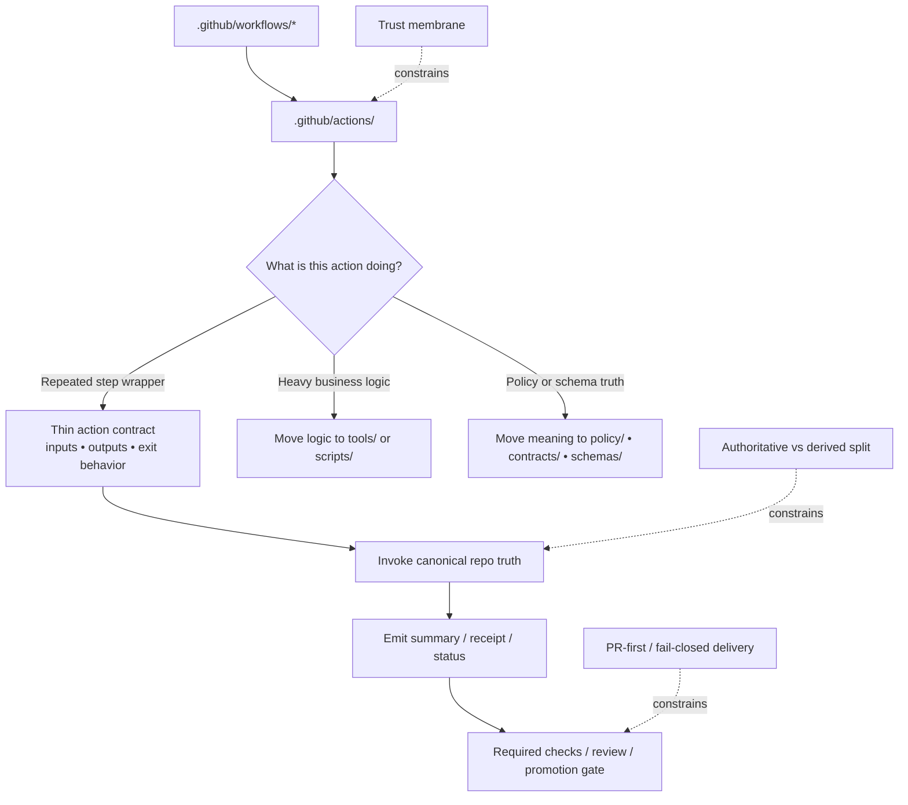

<!-- [KFM_META_BLOCK_V2]
doc_id: kfm://doc/<pending-uuid>
title: .github/actions/
type: standard
version: v1
status: draft
owners: @bartytime4life
created: <NEEDS VERIFICATION>
updated: 2026-03-28
policy_label: <NEEDS VERIFICATION>
related: [../workflows/, ../CODEOWNERS, ../PULL_REQUEST_TEMPLATE.md, ../../policy/, ../../contracts/, ../../schemas/, ../../tools/, ../../scripts/]
tags: [kfm, github-actions, ci-cd, governance]
notes: [doc_id placeholder pending registry allocation, owner value inherited from supplied baseline and not branch-verified in the current session, created and policy_label require repo verification, related links are kept to repo-intended control-plane surfaces and need mounted-tree confirmation]
[/KFM_META_BLOCK_V2] -->

<a id="top"></a>

# `.github/actions/`

Repo-local GitHub Actions for repeated, governance-significant workflow steps in KFM.


| Field | Value |
|---|---|
| Status | `experimental` |
| Owners | `@bartytime4life` *(inherited from supplied baseline · NEEDS VERIFICATION against mounted branch ownership)* |
| Path | `.github/actions/README.md` |
| Repo fit | Repo-local action surface beneath `.github/`, intended to be called from [`../workflows/`](../workflows/) |
| Current evidence window | Attached KFM PDF corpus plus repo-grounded summary artifacts; mounted repo tree, live workflow YAML, tests, and runtime logs were not directly visible in this session |
| Verified repo signal | Repo-grounded evidence confirms `.github/CODEOWNERS`, `.github/PULL_REQUEST_TEMPLATE.md`, and `.github/workflows/README.md`; active merge-blocking workflow YAML remains **UNKNOWN** |
| Truth posture | **CONFIRMED** KFM doctrine for fail-closed gates, receipt-bearing delivery, PR-first governance, and authoritative-vs-derived separation · **INFERRED** `.github/actions/` as the step-level reuse seam inside `.github/` · **UNKNOWN / NEEDS VERIFICATION** actual branch inventory under this directory |
| Quick jumps | [Scope](#scope) · [Repo fit](#repo-fit) · [Accepted inputs](#accepted-inputs) · [Exclusions](#exclusions) · [Directory tree](#directory-tree) · [Quickstart](#quickstart) · [Usage](#usage) · [Diagram](#diagram) · [Operating tables](#operating-tables) · [Task list / Definition of done](#task-list--definition-of-done) · [FAQ](#faq) · [Appendix](#appendix) |

> [!IMPORTANT]
> This README is intentionally contract-first. It documents what `.github/actions/` **should** be responsible for in KFM, not a branch-verified inventory of what already exists there.

> [!NOTE]
> In KFM, delivery mechanics are part of the trust system. A local action may help enforce policy, contracts, receipts, and attestations, but it must remain subordinate to the canonical truth path and the governed release flow.

> [!WARNING]
> Do not let a repo-local action become the only place where policy meaning, schema meaning, or evidence rules survive. Actions should wrap canonical repo truth, not quietly replace it.

---

## Scope

`.github/actions/` is the **step-level reuse seam** in KFM’s control plane.

Use it for repo-local GitHub Actions that centralize repeated workflow steps such as:

- policy-gate wrappers
- contract / fixture validation entrypoints
- receipt and summary emitters
- attestation or verification helpers
- small, stable workflow glue that would otherwise be duplicated across jobs

This directory is **not** the home of canonical policy, contract, schema, or domain logic. Those belong in their own repo surfaces and are merely invoked from here.

[Back to top](#top)

---

## Repo fit

This README sits at the boundary between workflow orchestration and repo truth surfaces.

### Upstream and downstream surfaces

| Surface | Relationship to `.github/actions/` | Current-session status |
|---|---|---|
| [`../workflows/`](../workflows/) | Primary caller of repo-local actions; owns job/lane orchestration | **CONFIRMED** as a documented repo surface · active YAML inventory **UNKNOWN** |
| [`../CODEOWNERS`](../CODEOWNERS) | Review boundary for control-plane changes under `.github/**` | **CONFIRMED** as cited repo surface · exact branch rules **NEEDS VERIFICATION** |
| [`../PULL_REQUEST_TEMPLATE.md`](../PULL_REQUEST_TEMPLATE.md) | Review checklist surface for proof, fixtures, and trust-bearing changes | **CONFIRMED** as cited repo surface |
| [`../../policy/`](../../policy/) | Canonical policy meaning, reason codes, obligation codes, and deny-by-default logic | **CONFIRMED** doctrinal surface · exact mounted contents **NEEDS VERIFICATION** |
| [`../../contracts/`](../../contracts/) | Canonical contract families and machine-checkable shapes | **CONFIRMED** doctrinal surface · exact mounted contents **NEEDS VERIFICATION** |
| [`../../schemas/`](../../schemas/) | Companion schema/documentation surface; authority split still needs branch verification | **CONFIRMED** cited repo surface · canonical-vs-pointer decision **NEEDS VERIFICATION** |
| [`../../tools/`](../../tools/) | Heavier validator/runtime helpers actions should call rather than duplicate | **CONFIRMED** cited repo surface |
| [`../../scripts/`](../../scripts/) | Small repo scripts and entrypoints reusable from actions | **CONFIRMED** cited repo surface |

### KFM boundary rule

A repo-local action may **invoke**:

- policy evaluation
- schema and fixture validation
- release-proof and receipt assembly
- attestation or verification tooling
- small repo-owned scripts

A repo-local action should **not** become the sovereign home of:

- policy semantics
- contract definitions
- canonical evidence state
- release authority
- correction truth

[Back to top](#top)

---

## Accepted inputs

Use this directory for artifacts that are tightly coupled to a repo-local action contract.

| Input type | What belongs here | Typical shape |
|---|---|---|
| Directory contract | Guidance for how local actions should behave in KFM | `README.md` |
| Action definition | Machine-readable action contract | `<action>/action.yml` |
| Action-local docs | Inputs, outputs, usage, permissions, caveats | `<action>/README.md` |
| Small helper code | Tiny scripts that exist only to support one action | `<action>/src/*` |
| Smoke fixtures | Minimal samples for local verification | `<action>/tests/fixtures/*` |
| Summary templates | Job summary or receipt formatting helpers | `<action>/templates/*` |

[Back to top](#top)

---

## Exclusions

Keep these out of `.github/actions/` unless there is a very narrow wrapper reason.

| Keep out of `.github/actions/` | Why | Put it here instead |
|---|---|---|
| Canonical policy bundles | Actions should wrap policy, not own it | [`../../policy/`](../../policy/) |
| Canonical schemas / contract truth | Contract meaning must stay reviewable outside action glue | [`../../contracts/`](../../contracts/), [`../../schemas/`](../../schemas/) |
| Whole workflow lanes | Job orchestration belongs at workflow level | [`../workflows/`](../workflows/) |
| Large shared runtime logic | Harder to test, version, and reason about when hidden in action folders | [`../../tools/`](../../tools/), [`../../scripts/`](../../scripts/) |
| Secrets or credentials | Actions must not become secret stores | GitHub environments / external secret management |
| Unreviewed publish shortcuts | KFM promotion is a governed state transition | workflow-controlled promotion lanes |
| Canonical evidence archives | Actions may emit receipt pointers, but not become long-term evidence truth | governed evidence and release locations elsewhere in the repo |

[Back to top](#top)

---

## Directory tree

### Current-session certainty

```text
.github/actions/
└── README.md   # target of this draft; live branch presence still NEEDS VERIFICATION
```

### Evidence-aligned starter shape (**PROPOSED**)

```text
.github/actions/
├── README.md
├── policy-gate/
│   ├── action.yml
│   ├── README.md
│   └── src/
├── contracts-validate/
│   ├── action.yml
│   ├── README.md
│   └── src/
├── run-manifest/
│   ├── action.yml
│   ├── README.md
│   └── src/
├── sigstore-attest/
│   ├── action.yml
│   ├── README.md
│   └── src/
└── evidence-summary/
    ├── action.yml
    ├── README.md
    └── src/
```

> [!NOTE]
> The exact folder names above are starter names, not verified repo facts. They are chosen to align with the corpus’s strongest repeated pressures: contract validation, deny-by-default policy checks, receipts, attestations, and reviewable summaries.

[Back to top](#top)

---

## Quickstart

### 1) Inspect what actually exists

```bash
find .github/actions -maxdepth 2 \( -name action.yml -o -name README.md \) | sort
```

```bash
grep -R "uses: ./.github/actions/" -n .github/workflows 2>/dev/null || true
```

```bash
test -f .github/CODEOWNERS \
  && sed -n '1,200p' .github/CODEOWNERS \
  || echo ".github/CODEOWNERS not found"
```

```bash
test -f .github/PULL_REQUEST_TEMPLATE.md \
  && sed -n '1,200p' .github/PULL_REQUEST_TEMPLATE.md \
  || echo ".github/PULL_REQUEST_TEMPLATE.md not found"
```

### 2) Bootstrap the first thin local action (**illustrative**)

Start with a **policy-gate** wrapper, not with a heavy deployment action. The current corpus puts the highest leverage on machine-checkable contracts, fixtures, and deny-by-default policy behavior.

```bash
mkdir -p .github/actions/policy-gate
```

```yaml
# .github/actions/policy-gate/action.yml
name: policy-gate
description: Run a repo-local policy gate against a supplied subject and policy path.

inputs:
  subject:
    description: File or directory to evaluate.
    required: true
  policy-path:
    description: Path to the repo policy bundle or policy starter path.
    required: true

runs:
  using: composite
  steps:
    - name: Run policy gate
      shell: bash
      run: |
        set -euo pipefail
        conftest test "${{ inputs.subject }}" --policy "${{ inputs.policy-path }}"
```

```markdown
# `policy-gate`

Thin repo-local wrapper for a deny-by-default policy check.

## Inputs

| Name | Required | Description |
|---|---:|---|
| `subject` | yes | File or directory to evaluate |
| `policy-path` | yes | Repo policy path to use |

## Usage

```yaml
- name: Policy gate
  uses: ./.github/actions/policy-gate
  with:
    subject: fixtures/valid
    policy-path: policy
```

## Security notes

- read-only by default
- fails closed on policy denial
- wraps repo policy; does not define policy truth
```

### 3) Call it from a workflow (**illustrative**)

```yaml
jobs:
  policy_gate:
    runs-on: ubuntu-latest
    permissions:
      contents: read
    steps:
      - uses: actions/checkout@v4
        with:
          persist-credentials: false

      - name: Install Conftest
        run: |
          curl -sSfL https://raw.githubusercontent.com/open-policy-agent/conftest/master/install.sh \
            | sh -s -- -b /usr/local/bin

      - name: Evaluate fixtures
        uses: ./.github/actions/policy-gate
        with:
          subject: fixtures
          policy-path: policy
```

[Back to top](#top)

---

## Usage

Use repo-local actions when a repeated **step** deserves a named, reviewable contract.

### Choose the right reuse shape

| Shape | Use when | Keep logic here | Do **not** use for |
|---|---|---|---|
| Inline workflow step | Logic is unique to one job and unlikely to repeat | tiny job-local glue | repeated governance steps |
| Repo-local action | A repeated step needs stable inputs/outputs inside this repo | thin wrappers, summaries, small reusable step logic | whole multi-job lanes |
| Reusable workflow | The repeated thing is a job/lane with its own permissions or environments | orchestration, promotion sequences, review choreography | tiny helper steps |
| Repo tool or script | Logic deserves independent tests, richer runtime support, or reuse beyond one action | durable validators, transforms, resolvers | being hidden in YAML |

### Action design rules

A good KFM repo-local action is:

- single-purpose
- thin
- explicit about inputs
- boring to review
- deterministic where possible
- fail-closed when used as a gate
- easy to replace when contracts mature

### Minimum contract for every action folder

| Requirement | Why it matters |
|---|---|
| `action.yml` | Makes the action’s interface inspectable |
| local `README.md` | Gives reviewers a visible contract, not just YAML |
| explicit inputs | Prevents hidden path and environment assumptions |
| explicit outputs when relevant | Keeps downstream behavior traceable |
| minimal helper code | Prevents action folders from becoming shadow toolchains |
| one workflow usage example | Speeds review and adoption |
| permission / secrets note | Makes blast radius explicit |

### Security and governance rules

1. **Least privilege first**  
   Start with read-only permissions and widen only for a demonstrated need.

2. **No hidden truth**  
   If an action depends on policy or contract meaning, point back to the canonical repo surface that owns it.

3. **Fail closed**  
   Missing fixtures, missing bundle paths, missing receipts, or failed verification should stop the lane.

4. **PR-first for meaningful mutation**  
   Opening PRs, updating review artifacts, or publishing should stay in reviewable workflow/app paths, not be silently buried inside a tiny action.

5. **Receipts beat log spam**  
   Prefer deterministic machine-readable outputs or summary artifacts over console-only explanations.

6. **Stable caller contract**  
   Treat action interfaces like repo-local APIs: additive change is preferred over breaking renames.

[Back to top](#top)

---

## Diagram


```mermaid
flowchart TD
    W[.github/workflows/*] --> A[.github/actions/<action>]

    A --> B{What is this action doing?}

    B -->|Repeated step wrapper| C[Thin action contract<br/>inputs • outputs • exit behavior]
    B -->|Heavy business logic| D[Move logic to tools/ or scripts/]
    B -->|Policy or schema truth| E[Move meaning to policy/ • contracts/ • schemas/]

    C --> F[Invoke canonical repo truth]
    F --> G[Emit summary / receipt / status]
    G --> H[Required checks / review / promotion gate]

    I[Trust membrane] -. constrains .-> A
    J[Authoritative vs derived split] -. constrains .-> F
    K[PR-first / fail-closed delivery] -. constrains .-> H
```

[Back to top](#top)

---

## Operating tables

### Proposed starter catalog

| Candidate action | Job it would do | Status | Notes |
|---|---|---|---|
| `policy-gate/` | Run deny-by-default policy checks against supplied subjects | **PROPOSED** | Keeps bundle path explicit because mounted policy layout is not verified |
| `contracts-validate/` | Run schema + valid/invalid fixture validation | **PROPOSED** | Closest match to the corpus’s highest-value next artifact |
| `run-manifest/` | Assemble or verify machine-readable run receipts | **PROPOSED** | Aligns with receipt-centric promotion doctrine |
| `sigstore-attest/` | Wrap signing / attestation / verification steps | **PROPOSED** | Must stay narrow and explicit about identity assumptions |
| `evidence-summary/` | Publish concise job summaries with links to proof objects | **PROPOSED** | Summary surface only; not a replacement for evidence storage |

### Naming guidance

| Pattern | Recommended use | Avoid |
|---|---|---|
| short kebab-case | preferred folder style for local actions | vague names like `helper/` or `misc/` |
| capability-first names | `policy-gate`, `contracts-validate`, `run-manifest` | names that hide the real burden |
| version suffix only on real breaks | `policy-gate-v2/` when callers truly need both | premature version suffixes for minor edits |
| truth-surface names outside actions | keep `policy`, `contracts`, `schemas`, `evidence` in canonical repo areas | baking those semantics into action folder names as if the action owns them |

[Back to top](#top)

---

## Task list / Definition of done

A new repo-local action is ready for merge when:

- [ ] it has one clear responsibility
- [ ] it includes `action.yml`
- [ ] it includes an action-local `README.md`
- [ ] its inputs are explicit
- [ ] its outputs are explicit where downstream jobs depend on them
- [ ] its default permissions are minimal
- [ ] it does not smuggle in secret or token assumptions
- [ ] it fails loudly and safely
- [ ] it wraps canonical repo truth instead of copying it
- [ ] it includes one caller example
- [ ] it has at least one smoke path, fixture path, or exercising workflow
- [ ] any stronger-than-`PROPOSED` claim about inventory or callers has been branch-verified
- [ ] related docs or runbooks are updated if behavior changed materially

[Back to top](#top)

---

## FAQ

### Why document `.github/actions/` before the branch inventory is verified?

Because KFM repeatedly prefers contract-first hardening over decorative completeness. A clear local-action contract helps prevent control-plane sprawl even before the branch tree is fully reverified.

### Why not keep policy logic directly inside the action?

Because actions are a delivery wrapper, not the sovereign home of policy meaning. KFM’s policy posture has to stay reviewable outside step glue.

### Local action or reusable workflow?

Use a **local action** for a repeated **step**.  
Use a **reusable workflow** for a repeated **job or lane**.

### Can a repo-local action publish on its own?

Not as an uncontrolled shortcut. Trust-bearing publish or promotion must remain inside governed review and release paths.

### Why is this README conservative about exact paths and inventory?

Because current-session evidence confirms control-plane documentation surfaces, but not a mounted `.github/actions/` tree or live workflow YAML catalog.

[Back to top](#top)

---

## Appendix

<details>
<summary>Minimal composite action template</summary>

### `action.yml`

```yaml
name: "<action-name>"
description: "One-sentence description of the action."

inputs:
  working-directory:
    description: "Directory to operate in."
    required: false
    default: "."

outputs: {}

runs:
  using: composite
  steps:
    - name: Execute action logic
      shell: bash
      working-directory: ${{ inputs.working-directory }}
      run: |
        set -euo pipefail
        echo "Replace with real logic"
```

### Minimal action README

~~~markdown
# `<action-name>`

Short purpose statement.

## Inputs

| Name | Required | Default | Description |
|---|---:|---|---|
| `working-directory` | no | `.` | Directory to operate in |

## Outputs

| Name | Description |
|---|---|
| _none_ | — |

## Usage

```yaml
- name: Run <action-name>
  uses: ./.github/actions/<action-name>
  with:
    working-directory: .
```

## Security notes

- required permissions:
- secrets used:
- fail-closed behavior:
~~~

</details>

<details>
<summary>Reviewer prompts for maintainers</summary>

- Is this action centralizing a repeated step, or only hiding complexity?
- Does it wrap canonical repo truth instead of duplicating it?
- Would a reusable workflow be the better shape?
- Are the permissions narrower than the surrounding job?
- Can a reviewer understand failure behavior from the README alone?
- Does the action emit something inspectable, or only print logs?
- Are any path claims in the action README actually branch-verified?

</details>

[Back to top](#top)
