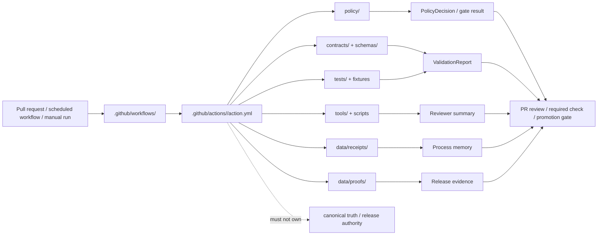

<!-- [KFM_META_BLOCK_V2]
doc_id: kfm://doc/NEEDS-VERIFICATION
title: .github/actions
type: standard
version: v1
status: draft
owners: @bartytime4life
created: NEEDS-VERIFICATION
updated: 2026-04-26
policy_label: public
related: [../README.md, ../CODEOWNERS, ../PULL_REQUEST_TEMPLATE.md, ../workflows/README.md, ../watchers/README.md, ../../README.md, ../../contracts/README.md, ../../schemas/README.md, ../../policy/README.md, ../../tests/README.md, ../../tools/README.md, ../../tools/validators/README.md, ../../tools/attest/README.md, ../../tools/ci/README.md, ../../data/receipts/README.md, ../../data/proofs/README.md]
tags: [kfm, github-actions, ci-cd, governance, local-actions]
notes: [doc_id and created date need registry or git-history verification, owner is grounded in current CODEOWNERS fallback coverage for /.github/actions/, policy label is based on public repository exposure and still should be checked against any policy-label registry, current source check shows .github/actions/ as README-only with no composite actions checked in, mounted private branch state and GitHub platform settings remain NEEDS VERIFICATION]
[/KFM_META_BLOCK_V2] -->

<a id="top"></a>

# `.github/actions`

Repo-local action boundary for thin, reviewable GitHub Action step wrappers in Kansas Frontier Matrix.

> [!IMPORTANT]
> **Status:** `experimental`  
> **Owners:** `@bartytime4life`  
> **Path:** `.github/actions/README.md`  
> **Current source-check state:** `README.md` only; no composite actions are checked in on the public `main` snapshot.  
> **Repo fit:** local action seam inside the [`.github/`](../README.md) gatehouse; shaped by [`../CODEOWNERS`](../CODEOWNERS), [`../PULL_REQUEST_TEMPLATE.md`](../PULL_REQUEST_TEMPLATE.md), [`../workflows/README.md`](../workflows/README.md), and [`../watchers/README.md`](../watchers/README.md); subordinate to canonical authority surfaces in [`../../contracts/`](../../contracts/), [`../../schemas/`](../../schemas/), [`../../policy/`](../../policy/), [`../../tests/`](../../tests/), [`../../tools/`](../../tools/), [`../../data/receipts/`](../../data/receipts/), and [`../../data/proofs/`](../../data/proofs/).


**Quick jumps:** [Scope](#scope) · [Repo fit](#repo-fit) · [Accepted inputs](#accepted-inputs) · [Exclusions](#exclusions) · [Directory tree](#directory-tree) · [Quickstart](#quickstart) · [Usage](#usage) · [Diagram](#diagram) · [Operating tables](#operating-tables) · [Task list / definition of done](#task-list--definition-of-done) · [FAQ](#faq) · [Appendix](#appendix)

> [!NOTE]
> This README is intentionally conservative. It documents the boundary for future repo-local actions without claiming that any local action contract, caller workflow, required check, OIDC path, receipt emitter, proof pack, or release gate is active until verified from the checked-in tree and platform settings.

---

## Scope

`.github/actions/` is the **step-level reuse seam** inside KFM’s GitHub control surface.

Use this directory only for small repo-local actions that make repeated workflow steps easier to review, reuse, and test. A good local action may wrap validation, policy evaluation, provenance checks, receipt checks, SBOM/signing helpers, or reviewer-summary helpers.

It must not become the root authority for policy, contracts, schemas, evidence, receipts, proofs, promotion, correction, or release state.

### What this surface should protect

| KFM concern | Boundary rule |
|---|---|
| **Governance** | Local actions may call policy gates; they do not define policy meaning. |
| **Contracts and schemas** | Local actions may validate contracts and schemas; they do not become the contract home. |
| **Receipts** | Local actions may emit or check process-memory receipts; durable receipt storage belongs elsewhere. |
| **Proofs** | Local actions may help assemble or verify proof signals; release-significant proof storage is not here. |
| **Promotion** | Local actions may block unsafe transitions; they do not self-approve publication. |
| **Secrets** | Local actions must not store secrets, long-lived credentials, or untracked local overrides. |

[Back to top](#top)

---

## Repo fit

**Path:** `.github/actions/README.md`  
**Role:** directory README for repo-local GitHub Actions, placeholder-to-action graduation rules, and the boundary between step wrappers and canonical KFM trust surfaces.

| Direction | Surface | Relationship |
|---|---|---|
| Parent gatehouse | [`../README.md`](../README.md) | Describes `.github/` as the repository-side control surface. |
| Ownership | [`../CODEOWNERS`](../CODEOWNERS) | Routes `.github/actions/` review through the broad current owner fallback. |
| PR intake | [`../PULL_REQUEST_TEMPLATE.md`](../PULL_REQUEST_TEMPLATE.md) | Keeps changes tied to truth labels, evidence, validation, rollback, and review burden. |
| Caller lane | [`../workflows/README.md`](../workflows/README.md) | Workflows orchestrate jobs, permissions, and promotion choreography; actions provide reusable steps. |
| Adjacent watcher lane | [`../watchers/README.md`](../watchers/README.md) | Watcher docs may eventually call through actions or workflows, but do not prove action runtime by themselves. |
| Root posture | [`../../README.md`](../../README.md) | Keeps this surface aligned to KFM’s governed, evidence-first, map-first, time-aware mission. |
| Contract authority | [`../../contracts/README.md`](../../contracts/README.md), [`../../schemas/README.md`](../../schemas/README.md) | Actions may validate these surfaces, not redefine them. |
| Policy authority | [`../../policy/README.md`](../../policy/README.md) | Actions may invoke allow/deny checks, but policy meaning belongs here. |
| Verification burden | [`../../tests/README.md`](../../tests/README.md), [`../../tests/ci/README.md`](../../tests/ci/README.md), [`../../tests/validators/README.md`](../../tests/validators/README.md) | Fixtures and tests prove action behavior; a README alone does not. |
| Durable tooling | [`../../tools/README.md`](../../tools/README.md), [`../../tools/validators/README.md`](../../tools/validators/README.md), [`../../tools/attest/README.md`](../../tools/attest/README.md), [`../../tools/ci/README.md`](../../tools/ci/README.md) | Logic that grows beyond thin step glue should graduate here. |
| Process memory | [`../../data/receipts/README.md`](../../data/receipts/README.md) | Receipts record process memory outside action folders. |
| Release evidence | [`../../data/proofs/README.md`](../../data/proofs/README.md) | Proofs remain distinct from logs, summaries, and receipts. |

> [!WARNING]
> A repo-local action may become trust-bearing, but it must not become truth-bearing by itself.

[Back to top](#top)

---

## Accepted inputs

Use this directory for files that are tightly coupled to repo-local action contracts.

| Accepted input | What belongs here | Typical shape |
|---|---|---|
| Directory contract | Purpose, scope, current inventory, and action graduation rules | `README.md` |
| Action metadata | Machine-readable GitHub Action contract | `<action-name>/action.yml` |
| Action-local README | Inputs, outputs, permissions, examples, caveats, failure behavior | `<action-name>/README.md` |
| Tiny helper code | Minimal action-local logic that does not deserve a durable tool lane | `<action-name>/src/*` |
| Smoke fixtures | Minimal public-safe fixtures for the action’s own behavior | `<action-name>/tests/fixtures/*` |
| Summary templates | Small step-summary, receipt, or review-output templates | `<action-name>/templates/*` |
| Migration notes | Temporary notes when replacing or versioning a local action | `<action-name>/migration.md` |

### Input rules

1. Keep every action single-purpose.
2. Make inputs and outputs explicit.
3. Use minimal permissions by default.
4. Fail closed when the action guards policy, provenance, contracts, receipts, proofs, or release state.
5. Keep durable logic in `tools/`, `scripts/`, `packages/`, or another verified owner surface.
6. Do not imply a caller exists until a checked-in workflow or platform configuration proves it.

[Back to top](#top)

---

## Exclusions

Keep these out of `.github/actions/` unless there is a narrow wrapper reason and the ownership boundary remains obvious.

| Do not keep here | Better home | Why |
|---|---|---|
| Canonical contracts or schema law | [`../../contracts/`](../../contracts/), [`../../schemas/`](../../schemas/) | Contract meaning must remain readable outside action glue. |
| Policy bundles, Rego, allow/deny semantics, obligations | [`../../policy/`](../../policy/) | Policy must stay explicit, testable, and independently reviewable. |
| Multi-job workflows, promotion lanes, scheduled jobs | [`../workflows/`](../workflows/) | Job orchestration belongs in workflow YAML and workflow docs. |
| Watcher doctrine or source-refresh strategy | [`../watchers/`](../watchers/) or future verified watcher owner surface | Watcher behavior changes trust state and needs its own boundary. |
| Mature validators or reusable CLIs | [`../../tools/validators/`](../../tools/validators/), [`../../tools/`](../../tools/), [`../../scripts/`](../../scripts/) | Durable behavior deserves normal tooling lifecycle, tests, and docs. |
| Canonical receipt archives | [`../../data/receipts/`](../../data/receipts/) | Receipts are process memory, not action-local files. |
| Release proof packs or signatures | [`../../data/proofs/`](../../data/proofs/), release surfaces, or attestation tooling | Proofs must remain inspectable outside workflow glue. |
| Secrets, tokens, credentials, local overrides | GitHub environments, org/repo secrets, or external secret management | Action folders must never become secret stores. |
| Direct publish shortcuts | Governed workflow and promotion paths | KFM promotion is a governed state transition, not a convenience action. |

> [!CAUTION]
> If deleting one local action would erase important knowledge about what is publishable, what policy decided, or how a release is reconstructed, the action is carrying too much authority.

[Back to top](#top)

---

## Directory tree

### Current public `main` snapshot (**CONFIRMED by source check**)

```text
.github/actions/
└── README.md
```

Current state is intentionally narrow: this directory is a README-only surface. Do not claim implemented composite actions until action metadata, tests or fixtures, and caller workflows are present.

### Graduated target shape (**PROPOSED**)

```text
.github/actions/
├── README.md
├── metadata-validate/
│   ├── action.yml
│   ├── README.md
│   ├── src/
│   └── tests/fixtures/
├── opa-gate/
│   ├── action.yml
│   ├── README.md
│   ├── src/
│   └── tests/fixtures/
├── provenance-guard/
│   ├── action.yml
│   ├── README.md
│   ├── templates/
│   └── tests/fixtures/
├── sbom-produce-and-sign/
│   ├── action.yml
│   ├── README.md
│   ├── templates/
│   └── tests/fixtures/
└── src/
    ├── README.md
    └── <tiny-shared-helper>.*
```

> [!NOTE]
> The target shape is a reviewable landing pattern, not a claim that these directories exist today. Add each action only when there is a real repeated workflow step and a testable contract.

[Back to top](#top)

---

## Quickstart

Run these commands from the repository root before changing this directory.

### 1) Inspect the current action surface

```bash
# Show exactly what is checked in under the local-action seam.
find .github/actions -maxdepth 3 -type f 2>/dev/null | sort

# Detect whether composite-action metadata exists yet.
find .github/actions -name action.yml -type f -print 2>/dev/null | sort

# Re-read the parent GitHub gatehouse and workflow caller lane.
sed -n '1,220p' .github/README.md
sed -n '1,220p' .github/workflows/README.md
sed -n '1,220p' .github/watchers/README.md
```

### 2) Check ownership and review burden

```bash
sed -n '1,140p' .github/CODEOWNERS
sed -n '1,220p' .github/PULL_REQUEST_TEMPLATE.md
```

### 3) Check canonical authority surfaces before adding action logic

```bash
for f in \
  contracts/README.md \
  schemas/README.md \
  policy/README.md \
  tests/README.md \
  tests/ci/README.md \
  tests/validators/README.md \
  tools/README.md \
  tools/validators/README.md \
  tools/attest/README.md \
  tools/ci/README.md \
  data/receipts/README.md \
  data/proofs/README.md
do
  test -f "$f" && { echo "===== $f"; sed -n '1,180p' "$f"; } || true
done
```

### 4) Search for existing callers before inventing a new action

```bash
grep -R "uses: ./.github/actions/" -n .github/workflows 2>/dev/null || true
git grep -nE "metadata-validate|opa-gate|provenance-guard|sbom|receipt|proof|attest|conftest|cosign" -- . 2>/dev/null || true
```

[Back to top](#top)

---

## Usage

Use repo-local actions when a repeated **step** deserves a named contract but does not deserve a full workflow, package, or tool lane.

### Choose the right reuse shape

| Shape | Use when | Keep logic here | Do not use for |
|---|---|---|---|
| Inline workflow step | The command is unique to one job and unlikely to repeat. | Tiny job-local glue. | Repeated governance steps. |
| Repo-local action | A repeated step needs stable inputs/outputs within this repo. | Thin wrappers, small summaries, action-local smoke logic. | Multi-job orchestration or canonical policy. |
| Reusable workflow | The repeated unit is a job or lane with its own permissions, environment, or artifact choreography. | Orchestration, promotion sequence, reviewer handoff. | Tiny helper steps. |
| Repo tool or script | Logic deserves independent tests, richer runtime support, or reuse outside GitHub Actions. | Durable validators, transformers, resolvers, summary renderers. | Hidden YAML-only behavior. |

### Candidate local-action families (**PROPOSED**)

| Candidate action | Purpose | Graduation condition |
|---|---|---|
| `metadata-validate/` | Validate metadata blocks, README structure, fixture headers, or source descriptors. | Non-empty `action.yml`, fixture set, failure examples, and caller workflow. |
| `opa-gate/` | Wrap fail-closed OPA / Conftest policy checks. | Explicit policy path, subject path, expected outcomes, and negative-path fixtures. |
| `provenance-guard/` | Verify provenance, receipt refs, EvidenceBundle refs, or attestation pointers. | Clear distinction between receipts, proofs, logs, and summaries. |
| `sbom-produce-and-sign/` | Wrap SBOM generation and signing support for release evidence. | Minimal permissions, no publish authority, and explicit handoff to proof or attest surfaces. |
| `docs-structure-check/` | Call documentation tooling without absorbing doc policy. | Tooling stays in `tools/docs/`; action only wraps invocation. |
| `ci-summary-publish/` | Publish compact reviewer summaries from existing generated reports. | Summary is marked as review aid, not authoritative proof. |

### Minimal illustrative action contract

The following example is illustrative only. It is not a claim that this action exists today.

```yaml
# .github/actions/opa-gate/action.yml
name: opa-gate
description: Run a repo-local OPA / Conftest policy gate against a supplied subject and policy path.

inputs:
  subject:
    description: File or directory to evaluate.
    required: true
  policy-path:
    description: Repo policy path to use.
    required: true

outputs:
  gate-status:
    description: One of PASS, FAIL, or ERROR.

runs:
  using: composite
  steps:
    - name: Evaluate policy
      shell: bash
      run: |
        set -euo pipefail
        conftest test "${{ inputs.subject }}" --policy "${{ inputs.policy-path }}"
        echo "gate-status=PASS" >> "$GITHUB_OUTPUT"
```

### Minimal illustrative workflow call

```yaml
jobs:
  policy_gate:
    runs-on: ubuntu-latest
    permissions:
      contents: read

    steps:
      - uses: actions/checkout@v4
        with:
          persist-credentials: false

      - name: Ensure conftest is available
        shell: bash
        run: |
          command -v conftest >/dev/null

      - name: Evaluate policy
        uses: ./.github/actions/opa-gate
        with:
          subject: fixtures
          policy-path: policy
```

> [!IMPORTANT]
> The examples above are starter contracts. They become current implementation only after the corresponding files are checked in, invoked by a verified workflow, and covered by reviewable tests or fixtures.

[Back to top](#top)

---

## Diagram


```mermaid
flowchart LR
  PR["Pull request / scheduled workflow / manual run"] --> WF[".github/workflows/"]
  WF --> ACT[".github/actions/<action>/action.yml"]

  ACT --> POL["policy/"]
  ACT --> CON["contracts/ + schemas/"]
  ACT --> TST["tests/ + fixtures"]
  ACT --> TOOL["tools/ + scripts"]
  ACT --> REC["data/receipts/"]
  ACT --> PROOF["data/proofs/"]

  POL --> DEC["PolicyDecision / gate result"]
  CON --> VAL["ValidationReport"]
  TST --> VAL
  TOOL --> SUM["Reviewer summary"]
  REC --> MEM["Process memory"]
  PROOF --> REL["Release evidence"]

  DEC --> REVIEW["PR review / required check / promotion gate"]
  VAL --> REVIEW
  SUM --> REVIEW
  MEM --> REVIEW
  REL --> REVIEW

  ACT -. "must not own" .-> TRUTH["canonical truth / release authority"]
```

[Back to top](#top)

---

## Operating tables

### Truth labels used here

| Label | Meaning in this README |
|---|---|
| **CONFIRMED** | Verified from the current source check, checked-in public repository evidence, or directly inspectable adjacent files. |
| **INFERRED** | Conservative interpretation from confirmed structure and KFM doctrine. |
| **PROPOSED** | Recommended action shape, name, contract, or usage not yet verified as current checked-in implementation. |
| **UNKNOWN** | Not proven from current source check, mounted checkout, workflow inventory, repository settings, or emitted artifacts. |
| **NEEDS VERIFICATION** | Must be checked against the actual branch, git history, platform settings, or generated proof before merge or rollout. |

### Current public inventory

| Surface | Current source-check state | Posture |
|---|---|---|
| `.github/actions/README.md` | Present. | **CONFIRMED** |
| Composite action folders | Not visible in the current public `main` listing. | **UNKNOWN / not currently proven** |
| Directory-local `action.yml` files | Not visible under named action folders because no named action folders are currently checked in. | **UNKNOWN / not currently proven** |
| Workflow callers | Must be verified from checked-in workflow YAML and platform settings. | **NEEDS VERIFICATION** |
| Branch rules, required checks, OIDC, environments | Not derivable from this README. | **UNKNOWN** |
| Receipt or proof emission from actions | Not proven by current README-only action inventory. | **UNKNOWN** |

### Graduation gates

| Gate | Required evidence |
|---|---|
| **Inventory gate** | Directory exists, `action.yml` exists, local README exists. |
| **Contract gate** | Inputs, outputs, permissions, dependencies, and failure modes are declared. |
| **Boundary gate** | Action wraps canonical policy, schema, test, receipt, proof, or tool surfaces without redefining them. |
| **Fixture gate** | At least one positive and one negative path is exercised where risk matters. |
| **Caller gate** | At least one checked-in workflow caller or explicit migration note exists. |
| **Security gate** | No long-lived secret assumptions, no broad default permissions, no hidden publish path. |
| **Review gate** | PR includes evidence, rollback/correction impact, and docs updates where behavior changed. |

[Back to top](#top)

---

## Task list / definition of done

A local action is ready to graduate from proposal to implementation when:

- [ ] the action has one clear responsibility
- [ ] `<action-name>/action.yml` exists and is non-empty
- [ ] `<action-name>/README.md` describes inputs, outputs, permissions, examples, and failure behavior
- [ ] default permissions are minimal
- [ ] the action does not store secrets or assume hidden credentials
- [ ] canonical policy, contract, schema, receipt, proof, and release meanings remain outside the action folder
- [ ] the action fails loudly and safely when used as a gate
- [ ] fixtures or tests cover at least one success path and one failure path where risk matters
- [ ] at least one caller workflow or migration note is checked in
- [ ] any reviewer-facing summary is marked as a summary, not proof
- [ ] any emitted receipt/proof reference preserves the receipt/proof distinction
- [ ] related docs are updated in the same PR
- [ ] rollback is documented for any action that can block promotion or affect release evidence

A directory-level README revision is ready when:

- [ ] current inventory is accurate
- [ ] all future action names are labeled **PROPOSED**
- [ ] no command assumes non-existent paths without guards
- [ ] relative links resolve from `.github/actions/README.md`
- [ ] current owner, status, and metadata placeholders are honest
- [ ] the Markdown renders cleanly on GitHub

[Back to top](#top)

---

## FAQ

### Are composite actions currently checked in here?

No, not from the current public source check. This directory is currently README-only.

### Can a local action enforce policy?

Yes, as a wrapper. The policy meaning itself belongs in `policy/`, with tests and fixtures outside the action folder.

### Can a local action emit a receipt?

Yes, if the workflow and repository design call for it. The action may emit or reference process memory, but durable receipt storage belongs in `data/receipts/`.

### Can a local action create or publish proof?

It may help assemble, verify, or summarize proof signals. It should not become release proof storage or publish authority.

### Should action logic live in `.github/actions/src/`?

Only while it remains tiny, generic, and clearly action-local. Durable logic should graduate to `tools/`, `scripts/`, or another verified owner surface.

### What is the smallest credible next action?

Add one deliberately narrow action, such as `metadata-validate/` or `opa-gate/`, with a non-empty `action.yml`, a local README, fixtures, and one verified workflow caller.

[Back to top](#top)

---

## Appendix

<details>
<summary>Pre-publish checklist</summary>

- [ ] KFM meta block wrapper is present and synchronized with the visible title.
- [ ] Status, owners, badges, path, repo fit, and quick jumps are present.
- [ ] Current inventory is stated without overclaiming implementation.
- [ ] Accepted inputs and exclusions are explicit.
- [ ] Directory tree includes both current state and proposed target shape.
- [ ] Mermaid diagram reflects real responsibility boundaries.
- [ ] Examples are labeled illustrative.
- [ ] Commands are language-tagged and guarded where paths may be absent.
- [ ] Policy, contract, schema, receipt, proof, workflow, tool, and release boundaries remain distinct.
- [ ] No secret or direct-publish shortcut is introduced.
- [ ] Unknowns and verification gaps remain visible.

</details>

<details>
<summary>Reviewer verification checklist</summary>

```bash
# Confirm this file and adjacent GitHub gatehouse docs.
sed -n '1,260p' .github/actions/README.md
sed -n '1,260p' .github/README.md
sed -n '1,260p' .github/workflows/README.md
sed -n '1,220p' .github/watchers/README.md

# Confirm owner routing.
sed -n '1,160p' .github/CODEOWNERS

# Confirm any action metadata that now exists.
find .github/actions -maxdepth 3 -type f | sort
find .github/actions -name action.yml -type f -print | sort

# Confirm callers.
grep -R "uses: ./.github/actions/" -n .github/workflows 2>/dev/null || true

# Confirm action logic does not absorb canonical authority.
git grep -nE "policy|schema|EvidenceBundle|RunReceipt|ReleaseManifest|ProofPack|PromotionDecision" -- .github/actions 2>/dev/null || true
```

</details>

<details>
<summary>Action README starter card</summary>

```markdown
# <action-name>

One-line purpose for a thin repo-local GitHub Action wrapper.

> [!IMPORTANT]
> **Status:** experimental  
> **Owners:** @bartytime4life  
> **Path:** `.github/actions/<action-name>/README.md`  
> **Caller status:** NEEDS VERIFICATION  
> **Authority boundary:** wraps checks; does not own policy, contracts, schemas, receipts, proofs, or release state.

## Inputs

| Input | Required | Meaning |
|---|---:|---|
| `<input>` | yes | What this action consumes. |

## Outputs

| Output | Meaning |
|---|---|
| `<output>` | What downstream jobs may read. |

## Failure behavior

- fail closed on missing required inputs
- fail closed on unresolved policy / evidence / provenance when used as a gate
- emit clear GitHub annotations for reviewer-visible errors

## Example

```yaml
- uses: ./.github/actions/<action-name>
  with:
    <input>: <value>
```

## Boundaries

This action may call tools, validators, policy checks, or summary renderers. It must not redefine their authority.
```

</details>

<details>
<summary>Source-status log for this README</summary>

| Item | Status |
|---|---|
| Current public `.github/actions/` inventory | **CONFIRMED** as README-only during this revision source check. |
| Owner fallback for `/.github/actions/` | **CONFIRMED** from current `CODEOWNERS`. |
| Current composite action implementations | **UNKNOWN / not currently proven**. |
| Current workflow callers | **NEEDS VERIFICATION** from checked-in workflow YAML and platform settings. |
| Required checks and branch protection | **UNKNOWN** from repository files alone. |
| Doc ID and created date | **NEEDS VERIFICATION** from document registry or git history. |

</details>

[Back to top](#top)
