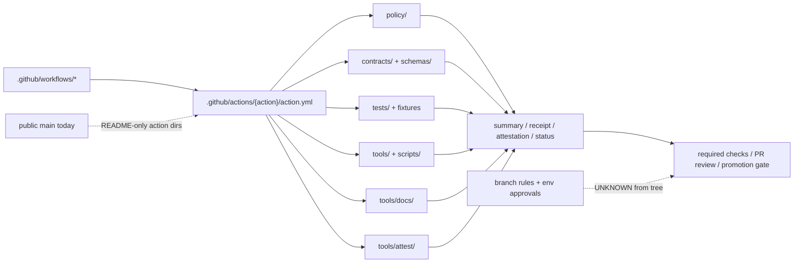

<!-- [KFM_META_BLOCK_V2]
doc_id: kfm://doc/NEEDS_VERIFICATION
title: .github/actions/
type: standard
version: v1
status: draft
owners: @bartytime4life
created: NEEDS_VERIFICATION
updated: 2026-04-16
policy_label: public
related: [
  ../README.md,
  ../workflows/README.md,
  ../watchers/README.md,
  ../CODEOWNERS,
  ../PULL_REQUEST_TEMPLATE.md,
  ../SECURITY.md,
  ../../README.md,
  ../../CONTRIBUTING.md,
  ../../policy/README.md,
  ../../contracts/README.md,
  ../../schemas/README.md,
  ../../data/receipts/README.md,
  ../../data/proofs/README.md,
  ../../data/published/README.md,
  ../../data/catalog/README.md,
  ../../tests/README.md,
  ../../tests/validators/README.md,
  ../../tests/ci/README.md,
  ../../tools/README.md,
  ../../tools/validators/README.md,
  ../../tools/validators/promotion_gate/README.md,
  ../../tools/attest/README.md,
  ../../tools/ci/README.md,
  ../../tools/docs/README.md,
  ../../scripts/README.md
]
tags: [kfm, github-actions, ci-cd, governance, local-actions, validation, receipts, proofs]
notes: [
  Updated to distinguish current README-only action directories from implemented composite-action contracts.
  Current public main confirms the .github/actions/ inventory and empty root action.yml; active workflow callers, branch rules, OIDC wiring, required checks, and non-public automation remain NEEDS VERIFICATION.
  doc_id and created date remain NEEDS VERIFICATION until the document registry and git history confirm them directly.
]
[/KFM_META_BLOCK_V2] -->

<a id="top"></a>

# `.github/actions/`

Repo-local action contracts and thin step wrappers for validation, provenance, SBOM/signing support, and review-bearing delivery inside the KFM gatehouse.

> [!IMPORTANT]
> **Status:** experimental  
> **Owners:** `@bartytime4life`  
> **Path:** `.github/actions/README.md`  
> **Repo fit:** repo-local action surface inside [`.github/`](../README.md); upstream from [`../workflows/README.md`](../workflows/README.md), adjacent to [`../watchers/README.md`](../watchers/README.md), and downstream of canonical authority surfaces in [`../../policy/README.md`](../../policy/README.md), [`../../contracts/README.md`](../../contracts/README.md), [`../../schemas/README.md`](../../schemas/README.md), [`../../data/receipts/README.md`](../../data/receipts/README.md), [`../../data/proofs/README.md`](../../data/proofs/README.md), [`../../tools/validators/README.md`](../../tools/validators/README.md), [`../../tools/attest/README.md`](../../tools/attest/README.md), [`../../tools/ci/README.md`](../../tools/ci/README.md), and [`../../tools/docs/README.md`](../../tools/docs/README.md)  
> **Badges:**          
> **Quick jumps:** [Scope](#scope) · [Current public deltas](#current-public-deltas) · [Repo fit](#repo-fit) · [Accepted inputs](#accepted-inputs) · [Exclusions](#exclusions) · [Directory tree](#directory-tree) · [Quickstart](#quickstart) · [Usage](#usage) · [Diagram](#diagram) · [Current public inventory](#current-public-inventory) · [Task list / definition of done](#task-list--definition-of-done) · [FAQ](#faq) · [Appendix](#appendix)

> [!NOTE]
> Public `main` is inspectable enough to describe `.github/actions/` as a real directory surface. It is **not** enough to claim implemented local actions, live callers, platform enforcement, or branch-protection behavior.

> [!WARNING]
> The current public inventory is **real but implementation-light**. The named action directories exist and carry README guidance, but the public tree does not yet show directory-local `action.yml` contracts for those named actions.

> [!TIP]
> Keep the KFM trust split visible here:
>
> **local action wrapper ≠ workflow lane ≠ policy authority ≠ contract authority ≠ receipt authority ≠ proof authority ≠ release authority**
>
> - `.github/actions/` wraps repeated **steps**
> - `.github/workflows/` owns job orchestration, permissions, and lane choreography
> - `policy/` owns governance meaning
> - `contracts/` and `schemas/` own contract and schema meaning
> - `data/receipts/` preserves process memory
> - `data/proofs/` preserves release-significant trust objects
> - repo-local actions may evaluate or emit trust-bearing signals, but should not become sovereign sources of truth

---

## Scope

`.github/actions/` is the **step-level reuse seam** inside KFM’s repository-side control plane.

Use this directory for thin, reviewable, repo-local actions that centralize repeated workflow **steps** such as:

- metadata and fixture validation
- deny-by-default policy checks
- provenance and receipt guards
- SBOM production and signing wrappers
- small summary or verification helpers
- narrow setup shims for tools that are repeatedly used by workflows

Do **not** use this directory as the sovereign home of policy, contract meaning, canonical evidence, release authority, or trust-object storage. In KFM, those meanings must stay readable and reviewable outside workflow glue.

### What belongs here

- directory-local `action.yml` contracts
- action-local READMEs that declare inputs, outputs, permissions, and failure behavior
- tiny action-specific helper code
- small smoke fixtures or templates directly tied to one action
- thin wrappers over stronger helpers in `tools/` or `scripts/`
- step-level summaries, receipts, or status emission when the step itself is the right place to emit them

### What should not belong here

- full multi-job orchestration
- policy bundles or policy truth
- canonical contracts and schemas
- durable validator implementations that deserve their own tool lane
- large shared runtime logic
- direct publish shortcuts or self-approving release logic
- hidden credential assumptions
- canonical receipt/proof archives

[Back to top](#top)

---

## Current public deltas

Earlier drafts treated `.github/actions/` as mostly inferred. That is no longer the right posture.

| Delta | Current public signal | Why it matters | Posture |
|---|---|---|---|
| Inventory is visible | Public `main` shows named action directories plus `README.md`, `src/`, and a root `action.yml` | This README can separate current inventory from proposed future shape | **CONFIRMED** |
| Named actions are contract-pending | Named action folders expose README guidance, but directory-local `action.yml` files are not visible | The names are real, but implemented composite-action contracts are not yet proven | **CONFIRMED** inventory · **UNKNOWN** executable depth |
| Root-level `action.yml` exists but is empty | `.github/actions/action.yml` is present and 0 bytes | Treat it as a placeholder or unresolved root artifact until its role is justified or it is removed | **CONFIRMED** file · **INFERRED** non-usable action contract |
| Caller inventory remains unproven | Public `main` currently exposes [`../workflows/README.md`](../workflows/README.md), not a proven checked-in workflow caller set | Active callers of these local actions cannot be established from the visible branch tree alone | **CONFIRMED** current snapshot · **UNKNOWN** live callers |
| Version drift is visible | `metadata-validate/` and `metadata-validate-v2/` coexist | Versioned action namespaces should be justified by a real caller migration, not left as permanent ambiguity | **CONFIRMED** inventory · **PROPOSED** cleanup rule |
| Child READMEs are not proof of implementation | Some child READMEs describe intended or documented contracts with `NEEDS VERIFICATION` language | This is useful lane doctrine, but not the same as mounted action metadata and tests | **CONFIRMED** README presence · **NEEDS VERIFICATION** action contract |
| Trust-boundary docs are explicit | `data/receipts/README.md`, `data/proofs/README.md`, `tools/attest/README.md`, `tools/docs/README.md`, watcher docs, and workflow docs now exist as adjacent surfaces | Local action guidance can be precise about what wrappers may emit versus what they must not own | **CONFIRMED** |

[Back to top](#top)

---

## Repo fit

**Path:** `.github/actions/README.md`  
**Role in repo:** directory README for repo-local GitHub Actions, local action contracts, README-only action namespaces, placeholder-to-production graduation rules, and the boundary between workflow orchestration and canonical truth surfaces.

### Upstream and adjacent anchors

| Relation | Path | Why it matters |
|---|---|---|
| Parent gatehouse | [`../README.md`](../README.md) | Defines `.github/` as the repository-side gatehouse for review, verification, and governed delivery |
| Workflow caller lane | [`../workflows/README.md`](../workflows/README.md) | Workflows orchestrate jobs, triggers, permissions, and lane choreography; local actions should stay at repeated-step scope |
| Adjacent watcher docs | [`../watchers/README.md`](../watchers/README.md) | Watcher scaffolds may point to workflow or action seams, but do not by themselves prove live action usage |
| Review ownership | [`../CODEOWNERS`](../CODEOWNERS) | Makes control-plane review routing explicit |
| PR evidence contract | [`../PULL_REQUEST_TEMPLATE.md`](../PULL_REQUEST_TEMPLATE.md) | Keeps action changes tied to truth labels, validation evidence, rollout, and rollback |
| Security surface | [`../SECURITY.md`](../SECURITY.md) | Keeps repo-side security guidance close to action and workflow changes |
| Repo root posture | [`../../README.md`](../../README.md) | Maintains evidence-first and governance-aware repo framing |
| Contribution contract | [`../../CONTRIBUTING.md`](../../CONTRIBUTING.md) | Keeps claims and automation descriptions honest |
| Canonical policy truth | [`../../policy/README.md`](../../policy/README.md) | Actions may evaluate policy, but should not own policy meaning |
| Canonical contract and schema truth | [`../../contracts/README.md`](../../contracts/README.md), [`../../schemas/README.md`](../../schemas/README.md) | Actions may validate these surfaces, not redefine them |
| Receipt surface | [`../../data/receipts/README.md`](../../data/receipts/README.md) | Actions may emit or check process memory, but must not turn receipts into proofs |
| Proof surface | [`../../data/proofs/README.md`](../../data/proofs/README.md) | Actions may participate in proof assembly or checks, but must not become proof storage |
| Validation surfaces | [`../../tests/README.md`](../../tests/README.md), [`../../tests/validators/README.md`](../../tests/validators/README.md), [`../../tests/ci/README.md`](../../tests/ci/README.md) | Smoke coverage, fixtures, and failure cases should remain inspectable outside YAML |
| Durable helper surfaces | [`../../tools/README.md`](../../tools/README.md), [`../../scripts/README.md`](../../scripts/README.md) | Heavy or shared logic belongs here when it outgrows thin local-action scope |
| Validator adjacency | [`../../tools/validators/README.md`](../../tools/validators/README.md), [`../../tools/validators/promotion_gate/README.md`](../../tools/validators/promotion_gate/README.md) | Strong validator and promotion logic should stay in durable tool lanes |
| Attestation adjacency | [`../../tools/attest/README.md`](../../tools/attest/README.md) | Sign/verify behavior belongs there; action wrappers may call into it |
| CI summary adjacency | [`../../tools/ci/README.md`](../../tools/ci/README.md) | Summary rendering belongs there when it becomes non-trivial |
| Docs-tooling adjacency | [`../../tools/docs/README.md`](../../tools/docs/README.md) | Local actions may call docs tooling but should not absorb its lane ownership |

### KFM boundary rule

A repo-local action may **invoke**:

- policy evaluation
- schema and metadata validation
- proof-pack or receipt verification
- SBOM and signing helpers
- small repo-owned scripts
- docs-structure checks
- reviewer-summary helpers

A repo-local action should **not** become the sovereign home of:

- policy semantics
- canonical contract definitions
- canonical evidence state
- release authority
- correction or supersession truth
- receipt/proof storage

[Back to top](#top)

---

## Accepted inputs

Use this directory for artifacts that are tightly coupled to a repo-local action contract.

| Input type | What belongs here | Typical shape |
|---|---|---|
| Directory contract | Directory-level rules, purpose, and inventory notes | `README.md` |
| Action metadata | Machine-readable action contract | `<action>/action.yml` |
| Action-local docs | Inputs, outputs, usage, permissions, caveats | `<action>/README.md` |
| Tiny helper code | Small logic that exists only to support one action or a very small shared helper surface | `<action>/src/*` or `src/*` |
| Smoke fixtures | Minimal exercising inputs for validation or negative-path checks | `<action>/tests/fixtures/*` |
| Summary / receipt templates | Job summary or process-memory formatting helpers | `<action>/templates/*` |
| Explicit trust refs | `receipt_ref`, `proof_ref`, attestation-visible state, or evidence-envelope refs when the action contract truly depends on them | action-local docs plus narrow implementation |
| Thin wrapper config | Inputs/outputs/permissions for wrappers over validators, attest helpers, docs tooling, or CI helpers | `action.yml` plus local README |

### Input rules

1. Keep action purpose explicit.
2. Keep permissions minimal.
3. Keep secrets external and least-privilege.
4. Keep helper code tiny unless it graduates to `tools/` or `scripts/`.
5. If the action emits receipts or trust-visible summaries, keep receipts, proofs, decisions, and summaries explicitly distinct.

[Back to top](#top)

---

## Exclusions

Keep these out of `.github/actions/` unless there is a narrow wrapper reason and the ownership boundary remains obvious.

| Keep out of `.github/actions/` | Why | Put it here instead |
|---|---|---|
| Canonical policy bundles | Actions should wrap policy, not own it | [`../../policy/`](../../policy/) |
| Canonical schemas / contract truth | Contract meaning must stay reviewable outside action glue | [`../../contracts/`](../../contracts/), [`../../schemas/`](../../schemas/) |
| Whole workflow lanes | Job orchestration belongs at workflow level | [`../workflows/`](../workflows/) |
| Large shared runtime logic | Harder to test, version, and reason about when hidden inside action folders | [`../../tools/`](../../tools/), [`../../scripts/`](../../scripts/) |
| Secrets or long-lived credentials | Actions must not become secret stores | GitHub environments or external secret management |
| Direct publish shortcuts | KFM promotion is a governed state transition | workflow-controlled promotion paths |
| Canonical evidence archives | Actions may emit links or receipts, but not become long-term evidence truth | governed evidence and release locations elsewhere in the repo |
| Receipt or proof storage | Wrappers may mention or emit process-memory objects, but should not become the sovereign storage surface | [`../../data/receipts/`](../../data/receipts/), [`../../data/proofs/`](../../data/proofs/) |
| Documentation authority | Actions may call doc checks, but should not become the home of doc structure policy | [`../../tools/docs/`](../../tools/docs/), [`../../docs/`](../../docs/) |

> [!IMPORTANT]
> If an action starts to own durable business logic, canonical truth, or release law, it has likely outgrown this directory.

[Back to top](#top)

---

## Directory tree

### Current public `main` snapshot (**CONFIRMED**)

```text
.github/actions/
├── README.md
├── action.yml                  # 0 bytes on public main
├── metadata-validate/
│   └── README.md               # experimental README; no action.yml visible
├── metadata-validate-v2/
│   └── README.md               # experimental README; no action.yml visible
├── opa-gate/
│   └── README.md               # README-only in visible tree
├── provenance-guard/
│   └── README.md               # README-only in visible tree
├── sbom-produce-and-sign/
│   └── README.md               # documented/proposed contract; no action.yml visible
└── src/
    └── README.md               # shared-helper README; no helper inventory proven here
```

### Graduated target shape (**PROPOSED**)

```text
.github/actions/
├── README.md
├── metadata-validate/
│   ├── action.yml
│   ├── README.md
│   ├── src/
│   └── tests/fixtures/
├── metadata-validate-v2/       # only if callers truly still require both versions
│   ├── action.yml
│   ├── README.md
│   └── migration.md
├── opa-gate/
│   ├── action.yml
│   ├── README.md
│   ├── src/
│   └── tests/fixtures/
├── provenance-guard/
│   ├── action.yml
│   ├── README.md
│   ├── src/
│   └── templates/
├── sbom-produce-and-sign/
│   ├── action.yml
│   ├── README.md
│   ├── src/
│   └── templates/
└── src/                        # only if cross-action helpers stay tiny and generic
    ├── README.md
    └── <shared-helper>.*
```

> [!NOTE]
> The proposed tree keeps the **current public names** rather than replacing them with generic examples. That makes the hardening path reviewable against the actual visible inventory.

[Back to top](#top)

---

## Quickstart

### 1) Inspect what actually exists

```bash
# Inventory the directory.
find .github/actions -maxdepth 2 -type f | sort

# Detect empty action metadata files.
find .github/actions -name action.yml -size 0 -print

# Confirm whether named action directories have executable metadata.
for d in .github/actions/*/; do
  printf '\n== %s ==\n' "$d"
  test -f "${d}action.yml" && sed -n '1,160p' "${d}action.yml" || echo "NO action.yml visible"
done

# Look for current workflow callers, if any.
grep -R "uses: ./.github/actions/" -n .github/workflows 2>/dev/null || true

# Check ownership and PR evidence expectations.
sed -n '1,120p' .github/CODEOWNERS
sed -n '1,220p' .github/PULL_REQUEST_TEMPLATE.md
sed -n '1,220p' .github/workflows/README.md
sed -n '1,220p' .github/watchers/README.md
sed -n '1,220p' tools/validators/README.md
sed -n '1,220p' tools/attest/README.md
sed -n '1,220p' tools/docs/README.md
```

### 2) Turn one README-only action namespace into a real local action (**illustrative**)

Start with `opa-gate/` or `metadata-validate/`, because those names already exist on public `main` and map cleanly to KFM’s strongest recurring delivery pressures.

```yaml
# .github/actions/opa-gate/action.yml
name: opa-gate
description: Run a repo-local OPA / Conftest policy gate against a supplied subject and policy path.

inputs:
  subject:
    description: File or directory to evaluate.
    required: true
  policy-path:
    description: Repo policy path to use.
    required: true

runs:
  using: composite
  steps:
    - name: Evaluate policy
      shell: bash
      run: |
        set -euo pipefail
        conftest test "${{ inputs.subject }}" --policy "${{ inputs.policy-path }}"
```

### 3) Call it from a workflow (**illustrative**)

```yaml
jobs:
  opa_gate:
    runs-on: ubuntu-latest
    permissions:
      contents: read

    steps:
      - uses: actions/checkout@v4
        with:
          persist-credentials: false

      - name: Make conftest available
        run: |
          command -v conftest >/dev/null

      - name: Evaluate policy
        uses: ./.github/actions/opa-gate
        with:
          subject: fixtures
          policy-path: policy
```

> [!IMPORTANT]
> The examples above are starter contracts, not claims that current public `main` already contains these implementations. Public `main` currently shows the action directory names and README docs, not implemented action metadata for the named directories.

[Back to top](#top)

---

## Usage

Use repo-local actions when a repeated **step** deserves a named, reviewable contract.

### Choose the right reuse shape

| Shape | Use when | Keep logic here | Do **not** use for |
|---|---|---|---|
| Inline workflow step | Logic is unique to one job and unlikely to repeat | tiny job-local glue | repeated governance steps |
| Repo-local action | A repeated step needs stable inputs/outputs inside this repo | thin wrappers, summaries, small reusable step logic | whole multi-job lanes |
| Reusable workflow | The repeated thing is a job or lane with its own permissions or environments | orchestration, promotion sequences, review choreography | tiny helper steps |
| Repo tool or script | Logic deserves independent tests, richer runtime support, or reuse beyond one action | durable validators, transforms, resolvers | being hidden in YAML |

### Current README-only intent map

| Current path | Best-fit role once implemented | Current caution |
|---|---|---|
| `metadata-validate/` | metadata, schema, and fixture validation | add or align `action.yml` before claiming implementation |
| `metadata-validate-v2/` | incompatible replacement only if both versions must coexist temporarily | document caller migration or retire |
| `opa-gate/` | deny-by-default policy evaluation | keep bundle path explicit and fail closed |
| `provenance-guard/` | receipt, attestation, or evidence-envelope verification | should fail closed on missing proof or unresolved provenance |
| `sbom-produce-and-sign/` | SBOM generation plus signing wrapper | signing support is acceptable here; publish authority is not |
| `src/` | tiny shared helpers only | move durable logic out when complexity grows |

### Design rules

A good KFM repo-local action is:

- single-purpose
- thin
- explicit about inputs
- explicit about outputs when downstream jobs depend on them
- deterministic where possible
- fail-closed when used as a gate
- boring to review
- easy to replace when contracts mature
- explicit about whether it emits process-memory receipts, higher-order proof refs, or only logs and summaries

### Versioning rule

Keep both `metadata-validate/` and `metadata-validate-v2/` only when there is a real caller migration to justify the split.

| Situation | Better move |
|---|---|
| No current callers can be shown | pick one path and retire the other |
| Callers still need both | keep both temporarily and document migration |
| Only names differ but contract does not | collapse to one action path |
| The new contract is materially incompatible | suffix the newer action only after documenting the break |

### Shared `src/` rule

`src/` at the directory root should remain tiny and generic. If helper code starts carrying domain logic, policy meaning, durable validation behavior, or trust-object interpretation, move it to [`../../tools/`](../../tools/) or [`../../scripts/`](../../scripts/) instead.

### Trust-surface rule

Where a repo-local action emits or checks trust-bearing signals:

- keep receipts as **process memory**
- keep proofs as **higher-order trust objects**
- keep validator outputs as **machine decisions**
- keep summaries as **secondary review aids**
- do not flatten them into one generic “artifact passed” story

[Back to top](#top)

---

## Diagram


```mermaid
flowchart LR
    WF[".github/workflows/*"] --> ACT[".github/actions/{action}/action.yml"]

    ACT --> POL["policy/"]
    ACT --> CS["contracts/ + schemas/"]
    ACT --> TEST["tests/ + fixtures"]
    ACT --> TOOL["tools/ + scripts/"]
    ACT --> DOCS["tools/docs/"]
    ACT --> ATTEST["tools/attest/"]

    POL --> OUT["summary / receipt / attestation / status"]
    CS --> OUT
    TEST --> OUT
    TOOL --> OUT
    DOCS --> OUT
    ATTEST --> OUT

    OUT --> REVIEW["required checks / PR review / promotion gate"]

    PUBLIC["public main today"] -. "README-only action dirs" .-> ACT
    SETTINGS["branch rules + env approvals"] -. "UNKNOWN from tree" .-> REVIEW
```

[Back to top](#top)

---

## Current public inventory

| Path | Current visible state | Interpretation | Next hardening move |
|---|---|---|---|
| `./README.md` | Present and substantial | Directory contract exists; this revision adds the required KFM Meta Block and cleans up README-only action wording | keep inventory current and branch-grounded |
| `./action.yml` | Present, 0 bytes | Root artifact is unresolved and not a usable action contract as-is | remove it or justify a real root action role |
| `./metadata-validate/README.md` | Present; experimental README | Namespace reserved and documented, but executable action metadata is not proven | add `action.yml`, action-local contract, fixtures |
| `./metadata-validate-v2/README.md` | Present; experimental README | Versioned namespace reserved; migration purpose not yet proven by callers | prove caller split or retire |
| `./opa-gate/README.md` | Present; README-only in visible tree | Best current candidate for a deny-by-default policy gate | add thin composite action contract |
| `./provenance-guard/README.md` | Present; README-only in visible tree | Intended proof / receipt / attestation gate | add explicit inputs, outputs, and fail-closed behavior |
| `./sbom-produce-and-sign/README.md` | Present; documented/proposed contract | Supply-chain helper intent is visible, but mounted `action.yml` is not proven | align README with real metadata or add the contract |
| `./src/README.md` | Present; shared-helper guidance | Reserved shared helper surface | keep tiny, or move logic out |
| Current workflow callers | Not proven from public `main` | Active use cannot be proved from the branch tree alone | verify with git history, live branch, or platform settings before overclaiming |

### Gaps that still block “implemented local actions” status

- directory-local `action.yml` files are not visible for the named action directories
- smoke fixtures or tests are not visible under the action directories
- public `main` does not currently prove workflow YAML callers for these actions
- the root `.github/actions/action.yml` is empty and therefore unresolved
- platform-level branch protection, required checks, OIDC configuration, and environment approvals remain outside public-tree evidence

[Back to top](#top)

---

## Task list / definition of done

A README-only action directory is ready to graduate when:

- [ ] it has one clear responsibility
- [ ] it includes a non-empty directory-local `action.yml`
- [ ] its action-local `README.md` matches the real `action.yml`
- [ ] its inputs are explicit
- [ ] its outputs are explicit where downstream jobs depend on them
- [ ] its default permissions are minimal
- [ ] it does not smuggle in secret or token assumptions
- [ ] it fails loudly and safely
- [ ] it wraps canonical repo truth instead of copying it
- [ ] it includes one caller example
- [ ] it has at least one smoke path, fixture path, or exercising workflow
- [ ] any stronger-than-`PROPOSED` claim about callers has been branch-verified
- [ ] the relationship between `metadata-validate/` and `metadata-validate-v2/` is explained
- [ ] the root `.github/actions/action.yml` is either removed or given a documented role
- [ ] related docs or runbooks are updated if behavior changed materially
- [ ] if receipts, proofs, or attestation-visible state participate, their roles remain explicit and non-flattened

[Back to top](#top)

---

## FAQ

### Why revise this README now?

Because the older checked-in surface already names the action lane, but it needs stronger KFM Meta Block alignment, clearer README-like structure, and tighter wording around what public `main` actually proves.

### What does the empty top-level `action.yml` mean?

It means the path exists, but its role is unresolved from public-tree evidence. Until it is populated or removed, treat it as a placeholder artifact rather than a usable action contract.

### Are these actions live?

**UNKNOWN from public `main`.** The directory names and READMEs are real; the public tree does not currently prove directory-local `action.yml` files, live workflow callers, or exercised runtime behavior for the named action directories.

### Should both `metadata-validate/` and `metadata-validate-v2/` stay?

Only if there is a real caller migration or a real incompatible contract split to justify both. Otherwise, collapse to one path.

### Can repo-local actions publish or self-approve changes?

No. KFM’s trust-bearing publication and promotion steps belong in governed workflow and review paths, not in hidden helper steps.

### Why mention receipts and proofs here?

Because repo-local actions are a common place for trust-state flattening to creep in. Mentioning them keeps process memory and higher-order proof state explicit; it does not move ownership into this directory.

### Can a child README describe a proposed action before `action.yml` exists?

Yes, but the README must keep that status visible. Treat it as lane doctrine or a contract proposal until mounted action metadata, callers, and tests prove executable behavior.

[Back to top](#top)

---

## Appendix

<details>
<summary>Minimal composite action starter for an existing README-only action directory</summary>

### `action.yml`

```yaml
name: "<action-name>"
description: "One-sentence description of the action."

inputs:
  working-directory:
    description: "Directory to operate in."
    required: false
    default: "."

outputs: {}

runs:
  using: composite
  steps:
    - name: Execute action logic
      shell: bash
      working-directory: ${{ inputs.working-directory }}
      run: |
        set -euo pipefail
        echo "Replace with real logic"
```

### Action-local `README.md`

```markdown
# `<action-name>`

Short purpose statement.

## Inputs

| Name | Required | Default | Description |
|---|---:|---|---|
| `working-directory` | no | `.` | Directory to operate in |

## Outputs

| Name | Description |
|---|---|
| _none_ | — |

## Usage

~~~yaml
- name: Run <action-name>
  uses: ./.github/actions/<action-name>
  with:
    working-directory: .
~~~

## Security notes

- required permissions:
- secrets used:
- fail-closed behavior:
```

</details>

<details>
<summary>Reviewer prompts for maintainers</summary>

- Is this action centralizing a repeated step, or only hiding complexity?
- Does it wrap canonical repo truth instead of duplicating it?
- Would a reusable workflow be the better shape?
- Are the permissions narrower than the surrounding job?
- Can a reviewer understand failure behavior from the README alone?
- Does the action emit something inspectable, or only print logs?
- Are path claims in the action README actually branch-verified?
- Does the action leave a rollback or correction path visible?
- If it emits receipts or summaries, are they clearly process-memory or secondary aids rather than sovereign proof objects?

</details>

<details>
<summary>Truth-label quick reference</summary>

| Label | Use here |
|---|---|
| **CONFIRMED** | Directly supported by current public tree evidence, checked-in Markdown, or stable KFM doctrine |
| **INFERRED** | Conservative interpretation from confirmed tree shape or adjacent docs |
| **PROPOSED** | Recommended target shape, starter pattern, or cleanup rule not yet proven in implementation |
| **UNKNOWN** | Not verified strongly enough to present as current behavior |
| **NEEDS VERIFICATION** | Important unresolved value that should be checked against git history, active branch state, platform settings, or emitted artifacts |

</details>

[Back to top](#top)