# 🧩 `.github/actions/` — Reusable GitHub Actions for Kansas Frontier Matrix (KFM)

[](https://github.com/bartytime4life/Kansas-Frontier-Matrix/actions/workflows/ci.yml)
[](https://github.com/bartytime4life/Kansas-Frontier-Matrix/actions/workflows/codeql.yml)


> 🧰 This folder contains **repo-local GitHub Actions** (mostly **composite actions**) used by our workflows.  
> 🎯 Goal: keep CI/CD **boring, consistent, and governed** while KFM itself stays ambitious: **ETL → Catalogs (STAC/DCAT/PROV) → Graph → API → UI → Story Nodes → Focus Mode**.  [oai_citation:0‡MARKDOWN_GUIDE_v13.md.gdoc](file-service://file-UYVruFXfueR8veHMUKeugU)

---

## ⚡ Quick links

| Need | Go |
|---|---|
| 🧭 Project overview | [`../../README.md`](../../README.md) |
| 🧪 Workflows (CI/CD spec + templates) | [`../workflows/README.md`](../workflows/README.md) |
| 🛡️ Security policy | [`../SECURITY.md`](../SECURITY.md) *(or `../../SECURITY.md` if kept at repo root)* |
| 🧾 Master protocol / invariants (v13) | `docs/specs/MARKDOWN_GUIDE_v13.md(.gdoc)`  [oai_citation:1‡MARKDOWN_GUIDE_v13.md.gdoc](file-service://file-UYVruFXfueR8veHMUKeugU) |
| 📘 System technical documentation | `docs/specs/Kansas Frontier Matrix (KFM) – Comprehensive Technical Documentation.docx`  [oai_citation:2‡Kansas Frontier Matrix (KFM) – Comprehensive Technical Documentation.docx](file-service://file-PaBDqECcJe7NbC8hvXNGDS) |
| ✅ Catalog QA tool | `tools/validation/catalog_qa/`  [oai_citation:3‡Kansas Frontier Matrix (KFM) – Comprehensive Technical Documentation.docx](file-service://file-PaBDqECcJe7NbC8hvXNGDS) |

---

<details>
<summary><strong>📌 Table of contents</strong></summary>

- [🧠 Why `.github/actions/` exists](#-why-githubactions-exists)
- [🧭 KFM invariants (actions must not break)](#-kfm-invariants-actions-must-not-break)
- [🧱 Trust boundary & threat model (actions edition)](#-trust-boundary--threat-model-actions-edition)
- [📁 Target folder shape](#-target-folder-shape)
- [🗂️ Action catalog (recommended set)](#️-action-catalog-recommended-set)
- [✅ Action design standards](#-action-design-standards)
- [🔐 Secrets, tokens, and environments](#-secrets-tokens-and-environments)
- [🧾 Artifacts, provenance, and checksums](#-artifacts-provenance-and-checksums)
- [🧪 Testing actions](#-testing-actions)
- [🧷 Templates (copy/paste)](#-templates-copypaste)
- [🧑‍⚖️ Review checklist](#️-review-checklist)
- [📚 Project reference library](#-project-reference-library)

</details>

---

## 🧠 Why `.github/actions/` exists

KFM’s workflows cover **code + data + metadata + model artifacts** — and the same sequences repeat everywhere:

- set up Python + Node (and sometimes GDAL/PROJ)
- run lint/tests
- validate **STAC/DCAT/PROV** (metadata is a contract, not a suggestion)  [oai_citation:4‡Kansas Frontier Matrix (KFM) – Comprehensive Technical Documentation.docx](file-service://file-PaBDqECcJe7NbC8hvXNGDS)
- produce artifacts (reports, logs, build-info)
- enforce “publish only if fully valid” (atomic promotion discipline)  [oai_citation:5‡Kansas Frontier Matrix (KFM) – Comprehensive Technical Documentation.docx](file-service://file-PaBDqECcJe7NbC8hvXNGDS)

**Composite actions let us standardize those steps once** and reuse them across many workflows without copy/paste YAML drift.  [oai_citation:6‡B-C programming Books.pdf](file-service://file-7HTVQSpDmJyTNX3ZroTMxy)

> [!TIP]
> Rule of thumb:
> - ✅ **Composite action**: repeatable *step sequence* (“setup + lint + test + upload artifacts”)  
> - ✅ **Reusable workflow**: repeatable *pipeline* (“CI lane”, “nightly integration”, “release lane”)  
> - ✅ **Script/CLI**: repeatable *domain logic* (ETL transforms, catalog QA, provenance emission)

---

## 🧭 KFM invariants (actions must not break)

These invariants are **guardrails**. If an action violates one, CI should fail loudly.

### ⭐ Invariants we enforce by default
- **Pipeline order is absolute**: **ETL → Catalogs (STAC/DCAT/PROV) → Graph → API → UI → Story Nodes → Focus Mode**.  [oai_citation:7‡MARKDOWN_GUIDE_v13.md.gdoc](file-service://file-UYVruFXfueR8veHMUKeugU)  
- **Provenance-first**: published outputs must have catalog + lineage before graph/UI/story can consume them.  [oai_citation:8‡MARKDOWN_GUIDE_v13.md.gdoc](file-service://file-UYVruFXfueR8veHMUKeugU)  
- **Deterministic & idempotent pipelines**: same input → same output; actions should *not* introduce non-determinism.  [oai_citation:9‡MARKDOWN_GUIDE_v13.md.gdoc](file-service://file-UYVruFXfueR8veHMUKeugU)  
- **Validation gates on contributions**: missing PROV, broken catalog links, or secrets leaks must fail CI.  [oai_citation:10‡MARKDOWN_GUIDE_v13.md.gdoc](file-service://file-UYVruFXfueR8veHMUKeugU)  

### ✅ What this means for actions
- Actions that touch `data/**` must be designed to support:
  - **schema/bounds checks**
  - **catalog QA**
  - **provenance presence**
  - **atomic publish** patterns (stage → validate → publish)  [oai_citation:11‡Kansas Frontier Matrix (KFM) – Comprehensive Technical Documentation.docx](file-service://file-PaBDqECcJe7NbC8hvXNGDS)

---

## 🧱 Trust boundary & threat model (actions edition)

Composite actions run on CI runners. Treat them as **critical infrastructure**.

```mermaid
flowchart LR
  PR[📦 PR / commit] --> WF[🧪 workflow.yml]
  WF --> ACT[🧩 local composite actions]
  ACT --> TOOLS[🧰 repo tools & scripts]
  TOOLS --> OUT[📦 artifacts / logs / catalogs]
  WF --> SEC[🔐 secrets & environments]
```



### 🧨 Common risks we design around
- **Supply chain**: unpinned third-party actions / scripts; unsafe curl|bash patterns  
- **Secrets exposure**: printing env vars, over-broad `GITHUB_TOKEN` permissions, logs with tokens  [oai_citation:12‡B-C programming Books.pdf](file-service://file-7HTVQSpDmJyTNX3ZroTMxy)  
- **Data integrity**: publishing broken STAC links/metadata; mismatched versions; missing provenance  [oai_citation:13‡Kansas Frontier Matrix (KFM) – Comprehensive Technical Documentation.docx](file-service://file-PaBDqECcJe7NbC8hvXNGDS)  
- **“Runner as an attack surface”**: especially risky with self-hosted runners (avoid for untrusted PR code)

> [!IMPORTANT]
> Any input crossing the workflow boundary is **untrusted** until validated — including JSON/GeoJSON, STAC catalogs, tilesets, PDFs, and 3D assets. KFM’s system design expects validation gates and controlled publishing.  [oai_citation:14‡Kansas Frontier Matrix (KFM) – Comprehensive Technical Documentation.docx](file-service://file-PaBDqECcJe7NbC8hvXNGDS)

---

## 📁 Target folder shape

> This README doubles as a **spec**. If you don’t see these actions yet, they’re “intended”. 🧭

```text
.github/actions/
├─ 🧩 setup-kfm/                    # Python + Node setup + caches (+ optional GIS deps)
│  ├─ action.yml
│  └─ README.md
├─ ✅ catalog-qa/                   # STAC/DCAT quick gate + link checks
│  ├─ action.yml
│  └─ README.md
├─ 🧾 provenance-guard/             # enforce PROV presence + classification propagation
│  ├─ action.yml
│  └─ README.md
├─ 📦 build-info/                   # generate build-info.json + checksums + digests
│  ├─ action.yml
│  └─ README.md
├─ 🐳 docker-build/                 # build + tag + (optional) scan
│  ├─ action.yml
│  └─ README.md
└─ 📄 README.md                     # you are here 👋
```

---

## 🗂️ Action catalog (recommended set)

> We keep actions small and “single purpose” so workflows can assemble lanes cleanly.  [oai_citation:15‡Kansas Frontier Matrix (KFM) – Comprehensive Technical Documentation.docx](file-service://file-PaBDqECcJe7NbC8hvXNGDS)

| Action | What it does | Typical workflows |
|---|---|---|
| `setup-kfm` | setup Python + Node, cache deps, optional GDAL/PROJ | `ci.yml`, `integration.yml`, `docs.yml` |
| `catalog-qa` | run STAC/DCAT quick gate + link checks | `catalog-qa.yml` + PR lane |
| `provenance-guard` | check PROV exists; enforce “no output less restricted than input” | data publish lanes |
| `build-info` | emit `build-info.json` + checksums for traceability | `docker.yml`, `release.yml` |
| `docker-build` | standardized buildx + caching + metadata outputs | `docker.yml` |
| `web-build` *(optional)* | Node build + bundle size checks + artifact upload | `pages.yml`, UI PR lane |
| `python-test` *(optional)* | standardized ruff/pytest/coverage packaging | `ci.yml` |
| `integration-stack` *(optional)* | orchestrate PostGIS/Neo4j service readiness checks | `integration.yml` |

---

## ✅ Action design standards

### 1) **Idempotent, deterministic, boring**
Actions must not:
- depend on wall-clock time for outputs
- mutate shared state unexpectedly
- “best-effort succeed” when validation fails

KFM’s QA and catalog guardrails depend on deterministic behaviors and fail-fast validation.  [oai_citation:16‡MARKDOWN_GUIDE_v13.md.gdoc](file-service://file-UYVruFXfueR8veHMUKeugU)

### 2) **Explicit inputs/outputs**
- Use `inputs:` for all configuration
- Use `outputs:` for anything a workflow needs later
- Write small `*.json` reports (machine-readable) + human summaries

### 3) **Least privilege by default**
- Composite actions should assume workflows pass **minimal permissions**
- Never require `contents: write` unless you’re in a protected promotion lane
- Publishing steps should run only on:
  - `push` to `main`
  - tags
  - `workflow_dispatch`
  - protected environments

Secrets + environments should be scoped carefully.  [oai_citation:17‡B-C programming Books.pdf](file-service://file-7HTVQSpDmJyTNX3ZroTMxy)

### 4) **Network is an attack surface**
- Avoid downloading arbitrary URLs from PR inputs
- If downloads are required:
  - allowlist domains
  - verify checksums (where possible)
  - store logs + sources in provenance

### 5) **Data & model integrity as “security”**
KFM treats metadata, provenance, and checksums as **security-critical controls** (tamper resistance + auditability).  [oai_citation:18‡Kansas Frontier Matrix (KFM) – Comprehensive Technical Documentation.docx](file-service://file-PaBDqECcJe7NbC8hvXNGDS)

---

## 🔐 Secrets, tokens, and environments

### ✅ What we use
- GitHub Secrets + Environments (DEV/STAGE/PROD)
- Fine-grained tokens / service principals
- Short-lived credentials whenever possible

This is the recommended practice for CI/CD systems and aligns with “scope secrets by environment” (so prod creds can’t accidentally leak into dev jobs).  [oai_citation:19‡B-C programming Books.pdf](file-service://file-7HTVQSpDmJyTNX3ZroTMxy)

### 🚫 What we do not do
- Do not echo secrets
- Do not pass secrets through action outputs
- Do not store secrets in artifacts
- Do not run deploy steps on untrusted forks

> [!TIP]
> If an action needs secrets, prefer a design where:
> - the workflow injects secrets as env vars at runtime  
> - the action validates presence but never prints the value

---

## 🧾 Artifacts, provenance, and checksums

KFM’s technical documentation and v13 guide emphasize:
- provenance emission per run
- schema/bounds validation
- catalog QA gates
- atomic publish discipline  [oai_citation:20‡Kansas Frontier Matrix (KFM) – Comprehensive Technical Documentation.docx](file-service://file-PaBDqECcJe7NbC8hvXNGDS)  [oai_citation:21‡MARKDOWN_GUIDE_v13.md.gdoc](file-service://file-UYVruFXfueR8veHMUKeugU)

### 📦 Standard artifacts (recommended)
- `unit-test-results.xml`, `coverage.xml`
- `catalog-qa.json` + `catalog-qa.md`
- `build-info.json`
- `checksums.sha256`
- `prov/<run-id>.jsonld` *(or equivalent PROV JSON-LD)*

### 🧾 Why this matters (KFM-specific)
- **Geospatial + remote sensing** workflows frequently involve multi-step intermediate assets and batch processing — artifacts make it possible to reproduce and debug.  [oai_citation:22‡Cloud-Based Remote Sensing with Google Earth Engine-Fundamentals and Applications.pdf](file-service://file-JVv3nbvtonX1HcpeERi9kV)  [oai_citation:23‡Cloud-Based Remote Sensing with Google Earth Engine-Fundamentals and Applications.pdf](file-service://file-JVv3nbvtonX1HcpeERi9kV)  
- **Modeling discipline** expects validation, residual inspection, and repeatability — artifacts keep us honest.  [oai_citation:24‡Kansas Frontier Matrix (KFM) – Comprehensive Technical Documentation.docx](file-service://file-PaBDqECcJe7NbC8hvXNGDS)  

---

## 🧪 Testing actions

### ✅ Minimum expectation
Every local action should have:
- a small `README.md` next to it describing inputs/outputs
- a “smoke test” workflow (`workflow_dispatch`) that runs the action on a tiny fixture
- log + artifact upload on failure

### 🔬 Suggested approach
- Add `.github/workflows/actions-smoke.yml` that runs:
  - `setup-kfm`
  - `catalog-qa` on fixture catalogs
  - `build-info` and uploads results

> [!NOTE]
> KFM’s QA philosophy includes unit tests, integration tests (with containers for PostGIS/graph), and E2E tests where it makes sense. Actions should make these easier, not harder.  [oai_citation:25‡Kansas Frontier Matrix (KFM) – Comprehensive Technical Documentation.docx](file-service://file-PaBDqECcJe7NbC8hvXNGDS)

---

## 🧷 Templates (copy/paste)

<details>
<summary><strong>🧩 Composite action skeleton — <code>.github/actions/&lt;name&gt;/action.yml</code></strong></summary>

```yaml
name: "kfm/<name>"
description: "Reusable step bundle for Kansas Frontier Matrix workflows."

inputs:
  fail_on_warn:
    description: "Fail if warnings are present"
    required: false
    default: "true"

outputs:
  report_path:
    description: "Path to the generated report artifact"
    value: ${{ steps.meta.outputs.report_path }}

runs:
  using: "composite"
  steps:
    - name: 🧾 Print action context (safe)
      shell: bash
      run: |
        echo "Action: kfm/<name>"
        echo "Repo: $GITHUB_REPOSITORY"
        echo "SHA:  $GITHUB_SHA"

    - name: ✅ Run task (placeholder)
      shell: bash
      run: |
        set -euo pipefail
        echo "TODO: implement"

    - name: 📦 Set outputs
      id: meta
      shell: bash
      run: |
        echo "report_path=out/report.json" >> "$GITHUB_OUTPUT"
```

</details>

<details>
<summary><strong>✅ Example usage — calling a local action from a workflow</strong></summary>

```yaml
jobs:
  catalog_gate:
    runs-on: ubuntu-latest
    permissions:
      contents: read

    steps:
      - uses: actions/checkout@v4

      - name: Run Catalog QA
        uses: ./.github/actions/catalog-qa
        with:
          fail_on_warn: "true"
```

</details>

<details>
<summary><strong>📦 Build-info pattern — write a reproducibility artifact</strong></summary>

```bash
# build-info.json (example shape)
{
  "repo": "bartytime4life/Kansas-Frontier-Matrix",
  "sha": "<GITHUB_SHA>",
  "run_id": "<GITHUB_RUN_ID>",
  "timestamp_utc": "<ISO8601>",
  "python": "<python -V>",
  "node": "<node -v>",
  "docker": "<docker version>",
  "artifacts": [
    {"path": "data/catalog/collection.json", "sha256": "<...>"},
    {"path": "data/provenance/run-123.jsonld", "sha256": "<...>"}
  ]
}
```

</details>

---

## 🧑‍⚖️ Review checklist

Use this checklist for **new actions** and major changes:

- [ ] Action is deterministic & idempotent (no hidden mutable state)  [oai_citation:26‡MARKDOWN_GUIDE_v13.md.gdoc](file-service://file-UYVruFXfueR8veHMUKeugU)  
- [ ] Inputs/outputs documented and typed (string/boolean-like strings)  
- [ ] No secrets printed or passed through outputs  [oai_citation:27‡B-C programming Books.pdf](file-service://file-7HTVQSpDmJyTNX3ZroTMxy)  
- [ ] Minimal permissions documented (`permissions:` in workflow)  
- [ ] Produces machine-readable report artifacts (JSON) + human summary  
- [ ] If data/catalog touched: runs STAC/DCAT/PROV gates  [oai_citation:28‡Kansas Frontier Matrix (KFM) – Comprehensive Technical Documentation.docx](file-service://file-PaBDqECcJe7NbC8hvXNGDS)  
- [ ] If publishing: runs only in protected lanes (main/tags/dispatch/env approvals)  
- [ ] Smoke test workflow exists and uploads logs on failure  
- [ ] README exists in action folder (what it does, inputs, outputs, examples)

---

## 📚 Project reference library

> This folder’s conventions are shaped by KFM’s architecture + governance + reproducibility discipline, plus a curated reference library.  
> ⚠️ Reference materials may have licenses different from the repo’s code license — treat them accordingly.

<details>
<summary><strong>🧱 Canonical KFM specs (must-read)</strong></summary>

- `Kansas Frontier Matrix (KFM) – Comprehensive Technical Documentation.docx`  [oai_citation:29‡Kansas Frontier Matrix (KFM) – Comprehensive Technical Documentation.docx](file-service://file-PaBDqECcJe7NbC8hvXNGDS)  
- `MARKDOWN_GUIDE_v13.md.gdoc` (pipeline invariants, provenance-first, validation gates)  [oai_citation:30‡MARKDOWN_GUIDE_v13.md.gdoc](file-service://file-UYVruFXfueR8veHMUKeugU)  

</details>

<details>
<summary><strong>🛡️ Security & governance (defensive posture + human-centered constraints)</strong></summary>

- Security policy: `../SECURITY.md`  
- `Data Spaces.pdf` (classification, access-control concepts)  [oai_citation:31‡Data Spaces.pdf](file-service://file-7UnZyJ7eCK1egnsyuYJaFq)  
- `Introduction to Digital Humanism.pdf` (human-centered governance)  [oai_citation:32‡Introduction to Digital Humanism.pdf](file-service://file-HC311tLjkcn1yRbyTBLJQQ)  
- `Principles of Biological Autonomy - book_9780262381833.pdf`  
- `On the path to AI Law’s prophecies and the conceptual foundations of the machine learning age.pdf`  [oai_citation:33‡On the path to AI Law’s prophecies and the conceptual foundations of the machine learning age.pdf](file-service://file-NtashtRjti9J1THyYXkhAv)  
- Defensive references (do **not** treat as offensive contribution requests):
  - `ethical-hacking-and-countermeasures-secure-network-infrastructures.pdf`  [oai_citation:34‡ethical-hacking-and-countermeasures-secure-network-infrastructures.pdf](file-service://file-Q7EeqPb17SD9sV8Fb12LQX)  
  - `Gray Hat Python - Python Programming for Hackers and Reverse Engineers (2009).pdf`  [oai_citation:35‡Gray Hat Python - Python Programming for Hackers and Reverse Engineers (2009).pdf](file-service://file-Mu6zixTqF9Lubf5QMjepRg)  

</details>

<details>
<summary><strong>🗺️ GIS, cartography, remote sensing (workflow complexity + data QA)</strong></summary>

- `python-geospatial-analysis-cookbook.pdf`  
- `PostgreSQL Notes for Professionals - PostgreSQLNotesForProfessionals.pdf`  
- `making-maps-a-visual-guide-to-map-design-for-gis.pdf`  
- `Mobile Mapping_ Space, Cartography and the Digital - 9789048535217.pdf`  [oai_citation:36‡Mobile Mapping_ Space, Cartography and the Digital - 9789048535217.pdf](file-service://file-AkVmsLhdFzwie5Gco3zgYj)  
- `Cloud-Based Remote Sensing with Google Earth Engine-Fundamentals and Applications.pdf`  [oai_citation:37‡Cloud-Based Remote Sensing with Google Earth Engine-Fundamentals and Applications.pdf](file-service://file-JVv3nbvtonX1HcpeERi9kV)  
- `compressed-image-file-formats-jpeg-png-gif-xbm-bmp.pdf`  [oai_citation:38‡compressed-image-file-formats-jpeg-png-gif-xbm-bmp.pdf](file-service://file-Y6V94sFtV6sy3w63LDy9fi)  

</details>

<details>
<summary><strong>📈 Modeling, statistics, simulation (reproducibility + V&V mindset)</strong></summary>

- `Understanding Statistics & Experimental Design.pdf`  
- `regression-analysis-with-python.pdf`  
- `Regression analysis using Python - slides-linear-regression.pdf`  [oai_citation:39‡Regression analysis using Python - slides-linear-regression.pdf](file-service://file-Ekbky5FwpaPHfZC2ttv6xR)  
- `graphical-data-analysis-with-r.pdf`  
- `think-bayes-bayesian-statistics-in-python.pdf`  [oai_citation:40‡think-bayes-bayesian-statistics-in-python.pdf](file-service://file-LXwJApPMVhRZgyqLb9eg7c)  
- `Scientific Modeling and Simulation_ A Comprehensive NASA-Grade Guide.pdf`  

</details>

<details>
<summary><strong>⚙️ Systems, scaling, concurrency (why CI lanes + caches matter)</strong></summary>

- `Scalable Data Management for Future Hardware.pdf`  [oai_citation:41‡Scalable Data Management for Future Hardware.pdf](file-service://file-GZ8gMsQ8hxu7GWEVd3csNE)  
- `concurrent-real-time-and-distributed-programming-in-java-threads-rtsj-and-rmi.pdf`  [oai_citation:42‡concurrent-real-time-and-distributed-programming-in-java-threads-rtsj-and-rmi.pdf](file-service://file-Y45SvXbmLoZL1MNmrcyqz6)  
- Programming shelf bundles (cross-language fundamentals):
  - `A programming Books.pdf`  
  - `B-C programming Books.pdf`  [oai_citation:43‡B-C programming Books.pdf](file-service://file-7HTVQSpDmJyTNX3ZroTMxy)  
  - `D-E programming Books.pdf`  
  - `F-H programming Books.pdf`  [oai_citation:44‡F-H programming Books.pdf](file-service://file-6M57f592rSBag5JxTUMXGm)  
  - `I-L programming Books.pdf`  [oai_citation:45‡I-L programming Books.pdf](file-service://file-EXJqY2YqS6DgUWn8zoKCp5)  
  - `M-N programming Books.pdf`  
  - `O-R programming Books.pdf`  
  - `S-T programming Books.pdf`  
  - `U-X programming Books.pdf`  

</details>

<details>
<summary><strong>🧊 Web UI + 3D graphics (why builds + asset hygiene are “security”)</strong></summary>

- `responsive-web-design-with-html5-and-css3.pdf`  
- `webgl-programming-guide-interactive-3d-graphics-programming-with-webgl.pdf`  
- *(Optional)* `Deep Learning for Coders with fastai and PyTorch - ...pdf` *(may be stored outside repo depending on licensing/tooling constraints)*  

</details>

---

<p align="right"><a href="#-githubactions--reusable-github-actions-for-kansas-frontier-matrix-kfm">⬆️ Back to top</a></p>
