# 🧩 KFM Composite Actions

**Reusable GitHub Actions building-blocks for a provenance-first, fail-closed CI/CD pipeline.**  
These actions power the “truth path” from contributions ➜ validation ➜ governed builds ➜ release artifacts.

|  |  |
| --- | --- |
|  |  |

**Quick links:**  
[📁 Folder map](#-folder-map) · [🚀 Using an action](#-using-an-action) · [🧱 Action catalog](#-action-catalog) · [🧬 Recommended wiring](#-recommended-wiring) · [🔐 Security rules](#-security-rules) · [🛠️ Developing actions](#-developing-actions) · [🧯 Troubleshooting](#-troubleshooting)

---

## 🎯 What lives here

This directory contains **local composite actions** used across KFM workflows to:

- ✅ enforce **governance gates** (policy checks, kill-switch, restricted-data rules)
- ✅ enforce **data-contract gates** (metadata + catalog validation, provenance checks)
- ✅ produce **supply-chain artifacts** (SBOM, build-info, attestations)
- ✅ standardize **setup** (tool installation and caching)

Why composite actions? Because they keep CI logic **consistent**, **reviewable**, and **reusable** across many workflows.

> [!IMPORTANT]
> If something is ambiguous, these actions should **fail closed** — the safe default is “deny / stop” until the contribution is compliant.

> [!INFO]
> **Provenance-first CI:** KFM’s pipeline is designed for transparency and trust. Every output (data, model, or map) must be traceable back to its sources — nothing enters or leaves without a record of how it got there. These composite actions ensure that *“the map behind the map”* is always captured via metadata and lineage, forming a verifiable truth path for all changes.

---

## 📁 Folder map

```text
.github/actions/
├─ 🧾 attest/               # Build provenance attestation helpers
├─ 🏷️  build-info/           # Compute version/build metadata (SHA, tags, timestamps, etc.)
├─ 🗂️  catalog-qa/           # QA checks for STAC/DCAT catalog artifacts
├─ 🧨 check-kill-switch/     # Read kill-switch state and stop workflows if enabled
├─ 🐳 docker-build/          # Build (and optionally push) container images
├─ 🛡️  governance-scan/      # Repo-wide governance scanning (licenses, restricted content, patterns)
├─ ⛔ kill-switch/           # Toggle/verify kill-switch artifacts (guardrails for releases)
├─ 🧷 metadata-validate/     # Validate metadata schemas and required dataset cards
├─ 🚦 policy-gate/           # OPA/Rego or policy tests that gate merges/releases
├─ 🧬 pr-provenance/         # PR checks for provenance artifacts + “Definition of Done”
├─ 🧾 provenance-guard/      # Prevent provenance tampering / enforce immutability rules
├─ 📦 sbom/                  # Generate SBOM for build artifacts (images/packages)
├─ 🧪 setup-conftest/        # Install/configure Conftest (OPA tool for policy testing)
├─ 🧰 setup-kfm/             # Standard project setup (Python/Node caches, toolchain, env)
└─ 🧹 story-lint/            # Lint Story Nodes (Markdown + choreography scripts + citations)
```

Tip 🧭: Each action directory should be **self-contained** and include its own `action.yml` and an action-specific `README.md`.

---

## 🚀 Using an action

### ✅ Basic pattern

In a workflow step:

```yaml
- name: 🛡️ Policy gate
  uses: ./.github/actions/policy-gate
  with:
    # Inputs vary by action — see each action/action.yml (source of truth)
    policy_dir: policy
```

### ✅ Best practice: least privilege permissions

Prefer setting permissions at workflow level:

```yaml
permissions:
  contents: read
  pull-requests: read
  id-token: write   # only if you’re doing attestations
```

### ✅ Passing paths safely

Use repo-relative paths and quote variables:

```yaml
- name: 🧷 Validate metadata
  uses: ./.github/actions/metadata-validate
  with:
    data_dir: data
    fail_on_warning: "true"
```

---

## 🧱 Action catalog

Below is the **intent** and typical usage of each action.  
Exact inputs/outputs live in each action’s `action.yml` and are the **source of truth**.

> [!TIP]
> When you add a new action: update the [📁 folder map](#-folder-map) and add an entry here so the catalog stays complete. ✅

### 🧰 Setup actions

<details>
<summary><b>🧪 setup-conftest</b> — install policy testing tools</summary>

**Purpose**
- Installs Conftest (OPA-based policy testing) and prepares it for CI use.

**Typically used in**
- `policy-gate` workflows or any job running `conftest test ...`

**Example**
```yaml
- uses: ./.github/actions/setup-conftest
```
</details>

<details>
<summary><b>🧰 setup-kfm</b> — standard CI environment bootstrap</summary>

**Purpose**
- Standardizes CI setup (language runtimes, caching, shared tooling).
- Keeps workflow YAML smaller and consistent.

**Typically used in**
- Almost every workflow as step 1 or 2.

**Example**
```yaml
- uses: ./.github/actions/setup-kfm
  with:
    python: "3.12"
    node: "20"
```
</details>

### 🛡️ Governance actions

> [!INFO]
> **Governance gates** implement KFM’s strict policy enforcement. If a rule/check fails, the pipeline blocks the change (“fail closed”).  
> They cover license requirements, forbidden content scans, and sensitive data markings (upholding CARE principles — **Collective Benefit, Authority to Control, Responsibility, Ethics**). In short: non-compliant contributions are stopped cold before they merge.

<details>
<summary><b>🚦 policy-gate</b> — the main governance gate</summary>

**Purpose**
- Runs policy checks (OPA/Rego, Conftest rules, policy unit tests).
- Enforces “fail-closed” defaults on protected paths.

**Common checks**
- license / attribution presence
- restricted data flags (CARE / sensitivity labels)
- required documentation contracts

**Example**
```yaml
- uses: ./.github/actions/policy-gate
  with:
    policy_dir: policy
    target: .
```
</details>

<details>
<summary><b>🛡️ governance-scan</b> — repo-wide scan for red flags</summary>

**Purpose**
- Pattern scans (secrets, credentials, restricted keywords, unsafe file types).
- Optional license scans or allowlist checks (implementation-dependent).

**Example**
```yaml
- uses: ./.github/actions/governance-scan
  with:
    mode: "pr"
```
</details>

<details>
<summary><b>🧨 check-kill-switch</b> — read-only stop mechanism</summary>

**Purpose**
- Checks whether a kill-switch flag is active.
- If enabled, blocks releases/deployments or other critical jobs.

**Example**
```yaml
- uses: ./.github/actions/check-kill-switch
```
</details>

<details>
<summary><b>⛔ kill-switch</b> — managed kill-switch operations</summary>

**Purpose**
- Validates or updates kill-switch artifacts (implementation-dependent).
- Used carefully — typically restricted to trusted branches and maintainers.

**Example**
```yaml
- uses: ./.github/actions/kill-switch
  with:
    action: "verify"
```
</details>

### 🗂️ Data contract actions

> [!INFO]
> **No data without metadata:** every dataset/story added to KFM must come with proper documentation and lineage.  
> These actions enforce that rule by validating schemas, checking completeness (e.g., spatial/temporal extents in STAC catalogs), and requiring provenance files for new data. This keeps content FAIR (findable, accessible, interoperable, reusable) and traceable over time.

<details>
<summary><b>🧷 metadata-validate</b> — schema + required fields validation</summary>

**Purpose**
- Validates dataset metadata (schemas, required fields, required links).
- Blocks merges when metadata is missing or malformed.

**Typical targets**
- dataset cards
- STAC JSON structure
- DCAT records
- required attribution/licensing fields

**Example**
```yaml
- uses: ./.github/actions/metadata-validate
  with:
    data_dir: data
```
</details>

<details>
<summary><b>🗂️ catalog-qa</b> — STAC/DCAT quality checks</summary>

**Purpose**
- Ensures catalog outputs are internally consistent and navigable.
- Detects broken links, missing assets, invalid extents, malformed IDs.

**Example**
```yaml
- uses: ./.github/actions/catalog-qa
  with:
    catalog_dir: data/catalog
    stac_dir: data/stac
```
</details>

<details>
<summary><b>🧬 pr-provenance</b> — PR contract checks for “truth path” compliance</summary>

**Purpose**
- Ensures PRs that add/modify data include required provenance + docs.
- Enforces the “no data enters without documentation” standard.

**Example**
```yaml
- uses: ./.github/actions/pr-provenance
  with:
    changed_paths: "${{ steps.changed.outputs.paths }}"
```
</details>

<details>
<summary><b>🧾 provenance-guard</b> — protect lineage integrity</summary>

**Purpose**
- Detects provenance record tampering or missing lineage.
- Ensures provenance logs are append-only or match expected structure.

**Example**
```yaml
- uses: ./.github/actions/provenance-guard
  with:
    provenance_dir: data/provenance
```
</details>

<details>
<summary><b>🧹 story-lint</b> — lint Story Nodes and choreography</summary>

**Purpose**
- Validates Story Node Markdown formatting and required sections.
- Validates choreography scripts (JSON/YAML) against a schema.
- Ensures citations/credits are present and well-formed.

**Example**
```yaml
- uses: ./.github/actions/story-lint
  with:
    stories_dir: docs/stories
```
</details>

### 📦 Supply chain actions

> [!INFO]
> **Supply chain trust signals:** these actions generate verifiable evidence of how artifacts were built.  
> Capturing versions, dependencies, and environment details enables stronger provenance guarantees; outputs like SLSA provenance files and SPDX SBOMs become “trust receipts” for audits and releases.

<details>
<summary><b>🐳 docker-build</b> — build container images</summary>

**Purpose**
- Standard build wrapper for Docker.
- Optionally supports caching, labels, multi-arch, and push.

**Example**
```yaml
- uses: ./.github/actions/docker-build
  with:
    context: .
    dockerfile: Dockerfile
    image: "ghcr.io/${{ github.repository }}/kfm-api:${{ github.sha }}"
```
</details>

<details>
<summary><b>📦 sbom</b> — generate SBOMs for artifacts</summary>

**Purpose**
- Produces SBOM for built images/packages.
- Stores SBOM as workflow artifact and/or attaches it to releases.

**Example**
```yaml
- uses: ./.github/actions/sbom
  with:
    image: "ghcr.io/${{ github.repository }}/kfm-api:${{ github.sha }}"
```
</details>

<details>
<summary><b>🏷️ build-info</b> — compute build metadata</summary>

**Purpose**
- Produces a standardized set of build identifiers (version, short SHA, build date, tags).
- Used to label images, releases, and attestations consistently.

**Example**
```yaml
- id: build
  uses: ./.github/actions/build-info

- run: echo "version=${{ steps.build.outputs.version }}"
```
</details>

<details>
<summary><b>🧾 attest</b> — provenance attestation</summary>

**Purpose**
- Creates attestations for build artifacts using GitHub OIDC when possible.
- Ties artifacts to source, workflow, and identity for auditing.

**Example**
```yaml
- uses: ./.github/actions/attest
  with:
    subject: "ghcr.io/${{ github.repository }}/kfm-api:${{ github.sha }}"
```
</details>

---

## 🧬 Recommended wiring

A typical “governed” workflow order looks like:

```mermaid
flowchart TD
  A[🧰 setup-kfm] --> B[🧨 check-kill-switch]
  B --> C[🚦 policy-gate]
  C --> D[🛡️ governance-scan]
  D --> E[🧷 metadata-validate]
  E --> F[🗂️ catalog-qa]
  F --> G[🧾 provenance-guard]
  G --> H[🧹 story-lint]
  H --> I[🐳 docker-build]
  I --> J[📦 sbom]
  J --> K[🧾 attest]
```



> [!NOTE]
> Not every job needs every step — but releases and protected branches should run the full chain.

---

## 🔐 Security rules

### ✅ Required practices

- 🔒 **Least privilege:** set `permissions:` explicitly (don’t rely on defaults).
- 🧷 **Pin third-party actions** by commit SHA (or prefer local actions).
- 🧼 **No secrets in logs:** never echo secrets or print env dumps.
- 🧾 **Auditable outputs:** prefer writing results to `$GITHUB_STEP_SUMMARY` and explicit artifacts.
- 🧨 **Kill-switch aware:** release and deploy workflows must honor kill-switch state.

### 🚫 Avoid

- Unpinned marketplace actions
- Downloading arbitrary scripts at runtime without checksums
- Writing credentials to disk outside of standard GitHub mechanisms

> [!TIP]
> **Observability:** Capture important results in the build summary and artifacts, not just console logs.  
> Writing to `$GITHUB_STEP_SUMMARY` gives reviewers and auditors a clean “report card” per run — without leaking sensitive info.

---

## 🛠️ Developing actions

### 📦 Minimum action structure

Each action directory should contain:

```text
.github/actions/<action-name>/
├─ action.yml
├─ README.md
└─ scripts/            # optional
```

### 🧾 Outputs & summaries

Prefer explicit, machine-readable outputs + a human-readable run summary:

```bash
# ✅ Outputs
echo "version=$VERSION" >> "$GITHUB_OUTPUT"

# 🧾 Summary
{
  echo "## 📦 Build Info"
  echo "- Version: $VERSION"
  echo "- SHA: $GITHUB_SHA"
} >> "$GITHUB_STEP_SUMMARY"
```

### 🧪 Testing guidance

- Prefer deterministic behavior (no flaky network calls).
- If network access is required, cache aggressively and retry responsibly.
- Validate locally with:
  - GitHub runner (preferred)
  - `act` for quick iterations (expect gaps vs real runners)

### 🧭 Naming conventions

- Hyphenated action names: `policy-gate`, `metadata-validate`, `story-lint`
- Inputs should be:
  - explicit (no magic)
  - documented in `action.yml`
  - mirrored in each action’s `README.md`

---

## 🧯 Troubleshooting

### “Action not found” / “Missing action.yml”

- Ensure the step uses:

```yaml
uses: ./.github/actions/<name>
```

- Confirm `action.yml` exists at that exact path.

### “Permission denied” in attest or publish steps

- Check workflow `permissions:` include the required scopes.
- Attestations often need `id-token: write`.

### “Policy gate failed” with little context

- Look for `conftest` output in logs.
- Add a summary block to `$GITHUB_STEP_SUMMARY` inside the action.
- Ensure policy rules print a helpful denial reason.

---

## 🔗 Related docs

- 📘 [`.github/README.md`](../README.md)
- 🧪 [`.github/workflows/README.md`](../workflows/README.md)
- 🧾 [`.github/ISSUE_TEMPLATE/README.md`](../ISSUE_TEMPLATE/README.md)
- 🏗️ [`docs/architecture/`](../../docs/architecture/)
- 🛡️ [`policy/`](../../policy/)

---

<sub>⬆️ <a href="#-kfm-composite-actions">Back to top</a></sub>
