<a id="top"></a>

# 🧩 `.github/actions/` — Reusable GitHub Actions for Kansas Frontier Matrix (KFM)

[](https://github.com/bartytime4life/Kansas-Frontier-Matrix/actions/workflows/ci.yml)
[](https://github.com/bartytime4life/Kansas-Frontier-Matrix/actions/workflows/codeql.yml)
[](https://github.com/bartytime4life/Kansas-Frontier-Matrix/actions/workflows/pages.yml)


> 🧰 This folder contains **repo-local GitHub Actions** (mostly **composite actions**) used by our workflows.
>
> 🎯 Goal: keep CI/CD **boring, consistent, governed, and auditable** — while KFM stays ambitious:
>
> **ETL → Metadata (STAC/DCAT/PROV) → Graph → API → UI → Story Nodes → Focus Mode**

> [!IMPORTANT]
> **Composite actions are infrastructure.** Treat them like production code:
> - least privilege 🔐
> - deterministic output 🧾
> - fail-closed gates 🚦
> - no secrets in logs 🧯

---

## 🧾 Policy metadata

| Field | Value |
|---|---|
| File | `.github/actions/README.md` |
| Status | Active ✅ *(spec + operating guide)* |
| Last updated | **2026-01-09** |
| Canonical workflow docs | `.github/workflows/README.md` |
| Canonical security policy | `SECURITY.md` (repo root) or `.github/SECURITY.md` (mirror) |
| KFM “north star” | trust first (provenance + integrity), then speed (caching + parallel lanes) |

---

## ⚡ Quick links

| Need | Go |
|---|---|
| 🧭 Project overview | [`../../README.md`](../../README.md) |
| 🧪 Workflows (CI/CD lanes + templates) | [`../workflows/README.md`](../workflows/README.md) |
| 🤝 GitHub ops hub | [`../README.md`](../README.md) |
| 🛡️ Security policy | [`../../SECURITY.md`](../../SECURITY.md) *(or* [`../SECURITY.md`](../SECURITY.md)*)* |
| 🧾 Catalog QA tool (expected) | `tools/validation/catalog_qa/` |
| 🧱 KFM standards (expected) | `docs/standards/` *(STAC/DCAT/PROV profiles)* |
| 🎬 Story Node templates (expected) | `docs/templates/` |

> [!TIP]
> If a link 404s, this README is still the **spec** for what we intend to implement.
> Please open an issue tagged `type:pipeline` + `area:ci`.

---

<details>
<summary><strong>📌 Table of contents</strong></summary>

- [🧠 Why <code>.github/actions/</code> exists](#-why-githubactions-exists)
- [🧱 Where actions fit (actions vs workflows vs scripts)](#-where-actions-fit-actions-vs-workflows-vs-scripts)
- [🧭 KFM invariants (actions must not break)](#-kfm-invariants-actions-must-not-break)
- [🔐 Threat model & trust boundaries (actions edition)](#-threat-model--trust-boundaries-actions-edition)
- [📁 Target folder shape](#-target-folder-shape)
- [🗂️ Action catalog (recommended set)](#️-action-catalog-recommended-set)
- [✅ Action contract (inputs, outputs, artifacts)](#-action-contract-inputs-outputs-artifacts)
- [🎛️ Kill switch & safe defaults](#-kill-switch--safe-defaults)
- [🧾 Provenance, checksums, and traceability](#-provenance-checksums-and-traceability)
- [🧪 Testing local actions](#-testing-local-actions)
- [🧷 Templates (copy/paste)](#-templates-copypaste)
- [🧑‍⚖️ Review checklist](#️-review-checklist)
- [📚 Project reference library](#-project-reference-library)

</details>

---

## 🧠 Why `.github/actions/` exists

KFM workflows cover **code + data + metadata + graph semantics + story/model artifacts**. The same step sequences repeat everywhere:

- setup Python + Node (sometimes GIS deps like GDAL/PROJ)
- run lint/tests and emit artifacts
- validate **STAC/DCAT/PROV** (metadata is a contract)
- enforce governed publishing (stage → validate → publish)
- capture build provenance (what ran, on what inputs, producing what outputs)

**Composite actions let us standardize those sequences once** and reuse them across many workflows without YAML drift.

> [!NOTE]
> Design rule:
> - ✅ **Composite action** = repeatable *step bundle* (“setup + run tool + upload report”)
> - ✅ **Reusable workflow** = repeatable *lane/pipeline* (“PR lane”, “nightly integration”, “release lane”)
> - ✅ **Script/CLI** = repeatable *domain logic* (ETL transforms, catalog QA, provenance emission)

---

## 🧱 Where actions fit (actions vs workflows vs scripts)

```mermaid
flowchart LR
  PR[📦 PR / commit] --> WF[🧪 workflow.yml]
  WF --> ACT[🧩 local composite actions]
  ACT --> TOOLS[🧰 repo tools & scripts]
  TOOLS --> OUT[📦 artifacts / reports / catalogs]
  WF --> ENV[🔐 secrets & environments]
```



**Text version:** PR triggers workflow → workflow calls local actions → actions call repo tools/scripts → scripts produce artifacts → workflow publishes artifacts (only in protected lanes).

> [!IMPORTANT]
> Actions are “glue.” Keep KFM domain logic in `tools/` (or equivalent) where it can be unit-tested and reused outside GitHub Actions.

---

## 🧭 KFM invariants (actions must not break)

These are enforceable guardrails. If an action violates one, CI should fail loudly.

1) 🧬 **Pipeline order is absolute**  
**ETL → Metadata (STAC/DCAT/PROV) → Graph → API → UI → Story Nodes → Focus Mode**  
Actions must not create shortcuts that bypass required stages or validations.

2) 🧾 **Contract-first**  
Schemas, catalogs, API contracts, and graph shapes are first-class artifacts.  
If a contract drifts, CI fails **before** merge.

3) ♻️ **Deterministic & idempotent pipelines**  
Same inputs + config → same outputs. Actions must not introduce “mystery state.”

4) 🚦 **Fail-closed validation gates**  
Missing provenance, broken catalog links, or classification downgrades are merge blockers for promoted artifacts.

5) 🔌 **API boundary rule**  
Don’t introduce workflows/actions that make the UI query graph DB directly. UI consumes **APIs** only.

---

## 🔐 Threat model & trust boundaries (actions edition)

Composite actions run on runners and can touch secrets, artifacts, and publish lanes.

### 🧨 Common risks we design around
- **Supply chain:** unpinned third-party actions; unsafe `curl | bash`  
- **Secrets exposure:** printing env vars; leaking tokens in artifacts/logs  
- **Catalog poisoning:** malicious/malformed STAC/DCAT fields or links triggering unsafe fetches  
- **Artifact tampering:** publishing without checksums/provenance or without atomic staging  
- **Untrusted PR execution:** forks running code that tries to exfiltrate secrets

> [!CAUTION]
> Default stance: treat **everything from a PR** as untrusted input until validated (JSON/GeoJSON, STAC catalogs, tilesets, PDFs, 3D assets, etc.).

---

## 📁 Target folder shape

This README doubles as a **spec**. If you don’t see these actions yet, they’re “intended.” 🧭

```text
.github/actions/
├─ 🧩 setup-kfm/                      # Python + Node setup + caches (+ optional GIS deps)
│  ├─ action.yml
│  └─ README.md
├─ ✅ catalog-qa/                     # fast STAC/DCAT gate + link checks (PR lane)
│  ├─ action.yml
│  └─ README.md
├─ 🧾 metadata-validate/              # schema validation: STAC/DCAT/PROV (full lane)
│  ├─ action.yml
│  └─ README.md
├─ 🧑‍⚖️ policy-gate/                  # OPA/Conftest (or equivalent) policy checks (fail-closed)
│  ├─ action.yml
│  └─ README.md
├─ 🧯 kill-switch/                    # global “stop button” for risky publish paths
│  ├─ action.yml
│  └─ README.md
├─ 🧾 provenance-guard/               # enforce PROV presence + classification propagation
│  ├─ action.yml
│  └─ README.md
├─ 📦 build-info/                     # build-info.json + tool versions + manifests
│  ├─ action.yml
│  └─ README.md
├─ 🔐 governance-scan/                # secrets/PII/sensitive-location checks (configurable)
│  ├─ action.yml
│  └─ README.md
├─ 🐳 docker-build/                   # buildx + caching + labels + digests
│  ├─ action.yml
│  └─ README.md
├─ 🧾 sbom/                           # SBOM generation (SPDX/CycloneDX)
│  ├─ action.yml
│  └─ README.md
├─ 🖊️ attest/                         # build attestations (OIDC-based where possible)
│  ├─ action.yml
│  └─ README.md
└─ 📄 README.md                       # you are here 👋
```

---

## 🗂️ Action catalog (recommended set)

> Keep actions small and composable. Avoid “mega actions.”

| Action | Purpose | Inputs (examples) | Outputs/artifacts | Typical workflows |
|---|---|---|---|---|
| `setup-kfm` | Standard dev toolchain setup | `python-version`, `node-version`, `install-gis-deps` | *(none)* | `ci.yml`, `ui.yml`, `integration.yml` |
| `catalog-qa` | Fast STAC/DCAT gate + link check | `root`, `glob`, `fail-on-warn` | `catalog-qa.json`, `catalog-qa.md` | `catalog-qa.yml` |
| `metadata-validate` | Full schema/profile validation | `stac-root`, `dcat-root`, `prov-root` | `schema-report.json` | nightly/full lanes |
| `policy-gate` | Policy enforcement (global → local) | `policy-paths`, `inputs-dir` | `policy-report.json` | promotion lanes |
| `kill-switch` | Stop publish/promotion safely | `mode=fail|skip`, `flag-path` | step summary | publish/release |
| `provenance-guard` | Require PROV + classification propagation | `prov-root`, `classification-map` | `prov-guard.json` | promotion lanes |
| `build-info` | Emit build manifest + tool versions | `artifact-globs` | `build-info.json`, `checksums.sha256` | `docker.yml`, `release.yml` |
| `governance-scan` | Secrets/PII/sensitive-loc checks | `ruleset`, `paths` | SARIF/JSON | PR lanes + nightly |
| `docker-build` | Standard container build | `image`, `tags`, `push` | digest output | `docker.yml` |
| `sbom` | Generate SBOM | `format`, `paths` | `sbom.spdx.json` | `release.yml` |
| `attest` | Create/attach attestations | `subject`, `predicate` | `attestation.json` | `release.yml` |

> [!TIP]
> Prefer a convention of **one machine-readable report** + **one human summary** per action.
> Put the human summary in `$GITHUB_STEP_SUMMARY` so it shows up in the run UI automatically.

---

## ✅ Action contract (inputs, outputs, artifacts)

### ✅ Inputs
- Treat all inputs as strings (GitHub Actions inputs are strings).
- If you want booleans, accept `"true" | "false"` and validate explicitly.

### ✅ Outputs
Standard output keys we recommend across KFM actions:
- `ok` → `"true" | "false"`
- `report_path` → path to JSON report
- `summary_path` → path to a Markdown summary (optional)
- `artifact_dir` → directory containing all outputs

### ✅ Artifacts (default expectation)
When an action runs validation or analysis, it should produce:
- `out/<action-name>/report.json`
- `out/<action-name>/summary.md`
- (optional) `out/<action-name>/logs/**`

### ✅ Logging discipline (security + debuggability)
- Never print secrets.
- Prefer structured logs (key/value lines) over noisy dumps.
- On failure: upload logs, fixtures, and reports.

> [!IMPORTANT]
> **Do not** pass secrets via action outputs. Outputs can leak into logs and downstream steps.

---

## 🎛️ Kill switch & safe defaults

KFM’s automation is designed to be powerful **without being autonomous**.

### 🧯 Kill switch behavior (recommended)
- If `KFM_KILL_SWITCH=true` → **fail closed** for publish/promotion jobs.
- For non-publish jobs, prefer “skip heavy lanes” (optional) but still run basic safety checks.

Recommended signal sources (spec):
- env var: `KFM_KILL_SWITCH` (set in repo/environment secrets or workflow env)
- config file: `.kfm/kill-switch.yml` *(or `ops/feature_flags/agents.yml` for automation gating)*

> [!NOTE]
> Kill switch exists to stop bad automation quickly (supply chain incident, runaway agent, bad release).
> In publish lanes, “skip” can be unsafe — prefer **fail**.

---

## 🧾 Provenance, checksums, and traceability

KFM treats provenance as a **security control** and a **scientific integrity control**.

### ✅ Recommended minimum per publish/release
- `build-info.json` (who/what/when/where ran)
- `checksums.sha256` for promoted artifacts
- PROV JSON-LD record(s) linking inputs → activities → outputs
- Catalog updates (STAC/DCAT) referencing immutable assets

### 🎲 Determinism contract (recommended for actions that produce artifacts)
If an action generates derived outputs, it should support:
- a **stable seed** (e.g., from commit SHA + explicit seed)
- an optional **virtual clock** for reproducible timestamps
- logs that record both values in `build-info.json`

Example environment convention (spec):
- `KFM_SEED` → overrides seed material
- `KFM_VCLOCK_UTC` → fixed clock value for reproducible runs (ISO8601)

> [!TIP]
> “If it can’t be reproduced, it can’t be trusted.”
> Build-info + checksums + PROV make debugging and rollback possible.

---

## 🧪 Testing local actions

### ✅ Minimum expectation
Every local action should have:
- `README.md` describing purpose, inputs, outputs, examples
- a smoke workflow: `.github/workflows/actions-smoke.yml`
- fixture inputs (tiny STAC collection, tiny PROV record, tiny policy set)
- artifact upload on failure

### 🧪 Suggested smoke workflow structure (spec)
- run `setup-kfm`
- run `catalog-qa` on fixture catalogs
- run `build-info` and upload outputs
- run `policy-gate` on a known “allow” + known “deny” case

> [!CAUTION]
> Actions that run in protected publish lanes should still have smoke tests — but on fixtures, not production assets.

---

## 🧷 Templates (copy/paste)

<details>
<summary><strong>🧩 Composite action skeleton — <code>.github/actions/&lt;name&gt;/action.yml</code></strong></summary>

```yaml
name: "kfm/<name>"
description: "Reusable step bundle for Kansas Frontier Matrix workflows."

inputs:
  fail_on_warn:
    description: "Fail if warnings are present"
    required: false
    default: "true"

outputs:
  ok:
    description: "Whether the action succeeded logically"
    value: ${{ steps.meta.outputs.ok }}
  report_path:
    description: "Path to the generated report artifact"
    value: ${{ steps.meta.outputs.report_path }}

runs:
  using: "composite"
  steps:
    - name: 🧾 Context (safe)
      shell: bash
      run: |
        echo "action=kfm/<name>"
        echo "repo=$GITHUB_REPOSITORY"
        echo "sha=$GITHUB_SHA"

    - name: ✅ Run task
      shell: bash
      run: |
        set -euo pipefail
        mkdir -p out/<name>
        echo '{"ok": true}' > out/<name>/report.json
        echo "✅ <name> ok" > out/<name>/summary.md
        cat out/<name>/summary.md >> "$GITHUB_STEP_SUMMARY"

    - name: 📦 Set outputs
      id: meta
      shell: bash
      run: |
        echo "ok=true" >> "$GITHUB_OUTPUT"
        echo "report_path=out/<name>/report.json" >> "$GITHUB_OUTPUT"
```

</details>

<details>
<summary><strong>🧯 Kill switch action — fail closed in publish lanes (spec)</strong></summary>

```yaml
name: "kfm/kill-switch"
description: "Fail-closed stop button for promotion/publish jobs."

inputs:
  mode:
    description: "fail|skip (prefer fail for publish lanes)"
    required: false
    default: "fail"
  flag_env:
    description: "Env var name for kill switch"
    required: false
    default: "KFM_KILL_SWITCH"

runs:
  using: "composite"
  steps:
    - name: 🧯 Check kill switch
      shell: bash
      run: |
        set -euo pipefail
        FLAG_NAME="${{ inputs.flag_env }}"
        FLAG_VALUE="${!FLAG_NAME:-false}"
        echo "kill_switch=${FLAG_VALUE}" >> "$GITHUB_STEP_SUMMARY"

        if [ "$FLAG_VALUE" = "true" ]; then
          echo "🧯 Kill switch is ON (${FLAG_NAME}=true)." >> "$GITHUB_STEP_SUMMARY"
          if [ "${{ inputs.mode }}" = "skip" ]; then
            echo "Skipping as requested." >> "$GITHUB_STEP_SUMMARY"
            exit 0
          fi
          echo "Failing closed." >> "$GITHUB_STEP_SUMMARY"
          exit 1
        fi

        echo "✅ Kill switch is OFF." >> "$GITHUB_STEP_SUMMARY"
```

</details>

<details>
<summary><strong>✅ Example usage — call a local action from a workflow</strong></summary>

```yaml
jobs:
  catalog_gate:
    runs-on: ubuntu-latest
    permissions:
      contents: read

    steps:
      - uses: actions/checkout@v4

      - name: Run Catalog QA
        uses: ./.github/actions/catalog-qa
        with:
          fail_on_warn: "true"
```

</details>

<details>
<summary><strong>📦 Build-info pattern — reproducibility artifact (spec)</strong></summary>

```json
{
  "repo": "bartytime4life/Kansas-Frontier-Matrix",
  "sha": "<GITHUB_SHA>",
  "run_id": "<GITHUB_RUN_ID>",
  "workflow": "<GITHUB_WORKFLOW>",
  "actor": "<GITHUB_ACTOR>",
  "timestamp_utc": "<ISO8601 | KFM_VCLOCK_UTC>",
  "toolchain": {
    "python": "3.12.1",
    "node": "20.11.0"
  },
  "inputs": [
    {"path": "data/raw/foo.tif", "sha256": "<...>"}
  ],
  "outputs": [
    {"path": "data/processed/foo.cog.tif", "sha256": "<...>"},
    {"path": "data/stac/foo/collection.json", "sha256": "<...>"}
  ]
}
```

</details>

---

## 🧑‍⚖️ Review checklist

Use this checklist for **new actions** and major changes:

- [ ] Deterministic & idempotent (no hidden mutable state)
- [ ] Inputs validated (string booleans handled explicitly)
- [ ] Outputs standardized (`ok`, `report_path`, etc.)
- [ ] No secrets printed or passed via outputs
- [ ] Minimal permissions documented; workflows must set least privilege
- [ ] Produces a JSON report + a Step Summary
- [ ] If touching `data/**`: supports STAC/DCAT/PROV and classification propagation gates
- [ ] If publishing: runs only in protected lanes (main/tags/dispatch + environments)
- [ ] Smoke workflow exists; logs/artifacts uploaded on failure
- [ ] Local README exists next to the action

---

## 📚 Project reference library

> ⚠️ Reference materials may have licenses different from repo code.  
> Keep them under `docs/library/` (or outside the repo) and respect upstream terms.

<details>
<summary><strong>🧱 Canonical KFM specs (must-read)</strong></summary>

- `docs/specs/Kansas Frontier Matrix (KFM) – Comprehensive Technical Documentation.docx`
- `docs/specs/MARKDOWN_GUIDE_v13.md.gdoc` *(contract-first, deterministic pipelines, validation gates)*
- `docs/specs/Latest Ideas.(pdf|docx)` *(automation patterns, kill-switch, determinism conventions)*

</details>

<details>
<summary><strong>🔐 Security, governance, and human-centered constraints</strong></summary>

- `SECURITY.md` (this repo)
- `docs/library/Data Spaces.pdf` *(policy enforcement & classification concepts)*
- `docs/library/Introduction to Digital Humanism.pdf` *(sovereignty + human values framing)*
- `docs/library/Principles of Biological Autonomy - book_9780262381833.pdf`
- `docs/library/On the path to AI Law’s prophecies and the conceptual foundations of the machine learning age.pdf`
- Defensive-only references (do **not** treat as offensive contribution requests):
  - `docs/library/ethical-hacking-and-countermeasures-secure-network-infrastructures.pdf`
  - `docs/library/Gray Hat Python - Python Programming for Hackers and Reverse Engineers (2009).pdf`

</details>

<details>
<summary><strong>🗺️ GIS, cartography, remote sensing (data QA reality)</strong></summary>

- `docs/library/python-geospatial-analysis-cookbook.pdf`
- `docs/library/PostgreSQL Notes for Professionals - PostgreSQLNotesForProfessionals.pdf`
- `docs/library/making-maps-a-visual-guide-to-map-design-for-gis.pdf`
- `docs/library/Mobile Mapping_ Space, Cartography and the Digital - 9789048535217.pdf`
- `docs/library/Cloud-Based Remote Sensing with Google Earth Engine-Fundamentals and Applications.pdf`
- `docs/library/compressed-image-file-formats-jpeg-png-gif-xbm-bmp.pdf`

</details>

<details>
<summary><strong>📈 Modeling, statistics, simulation (reproducibility + V&amp;V mindset)</strong></summary>

- `docs/library/Scientific Modeling and Simulation_ A Comprehensive NASA-Grade Guide.pdf`
- `docs/library/Understanding Statistics & Experimental Design.pdf`
- `docs/library/regression-analysis-with-python.pdf`
- `docs/library/Regression analysis using Python - slides-linear-regression.pdf`
- `docs/library/graphical-data-analysis-with-r.pdf`
- `docs/library/think-bayes-bayesian-statistics-in-python.pdf`
- `docs/library/Generalized Topology Optimization for Structural Design.pdf`
- `docs/library/Spectral Geometry of Graphs.pdf`

</details>

<details>
<summary><strong>⚙️ Systems, scaling, concurrency (why lanes + caches matter)</strong></summary>

- `docs/library/Scalable Data Management for Future Hardware.pdf`
- `docs/library/concurrent-real-time-and-distributed-programming-in-java-threads-rtsj-and-rmi.pdf`
- Programming shelf bundles (cross-language fundamentals):
  - `docs/library/A programming Books.pdf`
  - `docs/library/B-C programming Books.pdf`
  - `docs/library/D-E programming Books.pdf`
  - `docs/library/F-H programming Books.pdf`
  - `docs/library/I-L programming Books.pdf`
  - `docs/library/M-N programming Books.pdf`
  - `docs/library/O-R programming Books.pdf`
  - `docs/library/S-T programming Books.pdf`
  - `docs/library/U-X programming Books.pdf`

</details>

---

<p align="right"><a href="#top">⬆️ Back to top</a></p>
