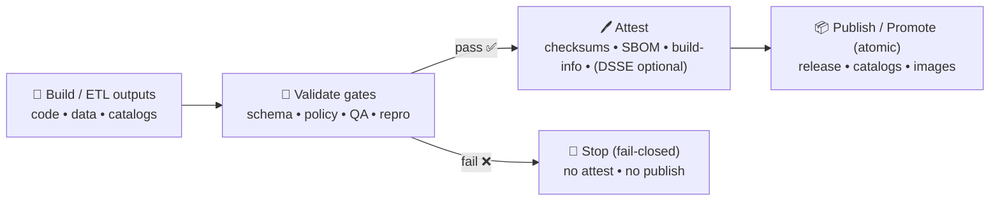

<a id="top"></a>

# 🖊️ `.github/actions/attest/` — Artifact Attestations for KFM (Checksums + SBOM + DSSE)

[](https://github.com/bartytime4life/Kansas-Frontier-Matrix/actions/workflows/ci.yml)
[](https://github.com/bartytime4life/Kansas-Frontier-Matrix/actions/workflows/codeql.yml)


> **KFM `attest`** is a **repo-local composite action** that packages **verifiable evidence** for promotion-grade artifacts:
> - 🔒 `checksums.sha256` (integrity)
> - 🧬 SBOM(s) (software composition)
> - 🧾 `build-info.json` (build context)
> - 🔏 *(optional)* DSSE-style attestation payload(s) (SLSA-inspired provenance binding)
>
> It’s designed for **promotion lanes** and the **Executor model**: attach proofs + telemetry, **never merge**, **never push to protected branches**.[^executor]

> [!IMPORTANT]
> **KFM order (don’t break it):** 🧰 ETL → 🗂️ Catalogs (STAC/DCAT/PROV) → 🕸️ Graph → 🔌 API → 🌐 UI → 🎬 Story Nodes → 🧠 Focus Mode.[^md-guide]

---

## 🧾 Action metadata

| Field | Value |
|---|---|
| 📄 File | `.github/actions/attest/README.md` |
| 📁 Folder | `.github/actions/attest/` |
| 🧩 Action type | Composite Action (`action.yml`) |
| 🟢 Status | Active ✅ *(spec/contract until implemented)* |
| 🗓️ Last updated | **2026-01-11** |
| 🧱 Canon | Contract-first + evidence-first + fail-closed gates[^md-guide] |
| 🎯 Primary purpose | Provenance + integrity for promotion/rollback |
| 🧯 Default stance | Fail closed, no secrets in logs, least privilege |

---

## ⚡ Quick links

| Need | Go |
|---|---|
| 🧩 Actions hub | [`../README.md`](../README.md) |
| 🧬 SBOM action (pairs with attest) | [`../sbom/README.md`](../sbom/README.md) |
| 🧪 Workflows hub | [`../../workflows/README.md`](../../workflows/README.md) |
| 🛡️ Security policy | [`../../../SECURITY.md`](../../../SECURITY.md) |
| 🧭 Repo overview | [`../../../README.md`](../../../README.md) |
| 📘 KFM Master Guide (ordering + invariants) | `docs/specs/MARKDOWN_GUIDE_v13.md.gdoc`[^md-guide] |
| 🌟 Latest proposals (Executor, kill-switch, Sigstore ideas) | `docs/notes/🌟 Kansas Frontier Matrix – Latest Ideas & Future Proposals.docx`[^latest-ideas] |
| 🧱 System spec (QA + governance + supply-chain posture) | `docs/specs/Kansas Frontier Matrix (KFM) – Comprehensive Technical Documentation.docx`[^tech-doc] |

> [!TIP]
> If a link 404s, this README is still the **spec** for what we intend to implement.  
> Open an issue with labels: `type:pipeline` + `area:ci` + `action:attest`.

---

<details>
<summary><strong>🧭 Table of contents</strong></summary>

- [🧠 What this action is](#-what-this-action-is)
- [🚦 Where this runs in the pipeline](#-where-this-runs-in-the-pipeline)
- [🧬 KFM invariants this action must uphold](#-kfm-invariants-this-action-must-uphold)
- [🧾 Attestation vs PROV vs STAC/DCAT](#-attestation-vs-prov-vs-stacdcat)
- [📦 KFM Attestation Bundle v1 (contract)](#-kfm-attestation-bundle-v1-contract)
- [🎛️ Inputs](#️-inputs)
- [📤 Outputs](#-outputs)
- [🔐 Required permissions](#-required-permissions)
- [🧪 Usage examples](#-usage-examples)
- [✅ Verification expectations](#-verification-expectations)
- [🧯 Failure modes & troubleshooting](#-failure-modes--troubleshooting)
- [🧰 Maintainer implementation checklist](#-maintainer-implementation-checklist)
- [📚 Reference library](#-reference-library)

</details>

---

## 🧠 What this action is

**`kfm/attest`** creates an **attestation bundle** that answers:

- **What** artifacts were produced? (paths + digests)
- **How** were they produced? (build context, toolchain, run identifiers)
- **What else proves integrity?** (SBOM presence, checksum manifest, optional DSSE payload)

### ✅ What it does
1) 🧾 **Build context capture** → emits (or copies) `build-info.json`  
2) 🔒 **Checksum manifest** → emits `checksums.sha256` for selected artifacts  
3) 🧬 **SBOM inclusion** → includes SBOM files *if provided* (prefer those generated by `kfm/sbom`)  
4) 🔏 **Optional DSSE payload(s)** → produces DSSE-style JSON payload(s) for signing/verification (Sigstore keyless is the preferred direction)[^latest-ideas]

### 🚫 What it does *not* do (by design)
- ❌ It does **not** replace schema validation (STAC/DCAT/PROV)  
- ❌ It does **not** replace policy gating (OPA/Conftest)  
- ❌ It does **not** merge PRs, push to protected branches, or publish on failure[^executor]  
- ❌ It does **not** make trust decisions — it packages the evidence so *other* gates/verifiers can decide

> [!NOTE]
> KFM treats reproducibility + traceability as part of security posture (not just “nice to have”).[^tech-doc][^nasa-trace]

---

## 🚦 Where this runs in the pipeline

Attestation belongs **after validation** and **before publish**:



> [!IMPORTANT]
> “Attest” is not a gate — it should **reflect** gate outcomes by bundling reports/links, never bypassing them.[^md-guide]

---

## 🧬 KFM invariants this action must uphold

### ✅ Invariants (non-negotiable)

- **Executor contract: never auto-merge.**  
  The Executor model opens/updates PRs and attaches evidence — **it does not merge**.[^executor]

- **Fail-closed by default.**  
  If a required input is missing (SBOM/provenance/checksum target), **fail** unless explicitly configured otherwise.

- **Determinism & idempotency-friendly.**  
  Outputs should be stable for the same inputs (avoid unstable timestamps / random ordering). Prefer:
  - stable `run_uuid`
  - explicit `idempotency_key`
  - optional fixed clock (`KFM_VCLOCK_UTC`) for reproducible timestamps[^latest-ideas][^md-guide]

- **Kill-switch must be honored.**  
  Automated lanes must respect a **single-stop control** (kill-switch) to pause risky automation quickly.[^latest-ideas]

- **Least privilege.**  
  Minimal permissions in workflows; no “god tokens”; no secrets in logs.[^tech-doc]

- **Sensitive data guardrails.**  
  If a dataset/artifact is classified beyond public, the workflow must treat it as sensitive evidence:
  - restrict uploads
  - avoid public release assets
  - redact logs/telemetry where appropriate[^data-spaces][^tech-doc]

> [!CAUTION]
> **No publish-on-fail.** If validation gates fail, do not generate “success-looking” attestations and do not promote artifacts.

---

## 🧾 Attestation vs PROV vs STAC/DCAT

KFM uses multiple trust layers (each does a different job):

- 🗂️ **STAC + DCAT** → discovery + dataset contract (what it is, where it is, license/providers, distributions)[^md-guide]  
- 🧾 **W3C PROV** → semantic lineage (inputs → activities → outputs, agents, parameters) required for boundary artifacts[^md-guide]  
- 🖊️ **Attestations (this action)** → cryptographic binding of artifact digests to build context (commit/run/tooling), supporting rollback + audit + tamper resistance[^latest-ideas]

> [!NOTE]
> Think of STAC/DCAT/PROV as **meaning** and **lineage**, and this action as the **integrity wrapper** that makes “what we shipped” verifiable.

---

## 📦 KFM Attestation Bundle v1 (contract)

This section is the **contract** policy gates can rely on (paths + stable names).

### ✅ Default output dir
By default, this action writes into:

- `attestations_dir: .artifacts/attestations`

### 🧱 Expected layout

```text
📁 .artifacts/
└─ 📁 🔏 attestations/
   ├─ 📄 checksums.sha256                 # 🔒 sha256 for all asserted artifacts
   ├─ 📄 build-info.json                  # 🧾 run + toolchain + context
   ├─ 📄 attest-summary.md                # 📝 human summary (also to Step Summary)
   ├─ 📄 bundle.manifest.json             # 📦 machine index for the bundle
   ├─ 📄 materials.sbom.spdx.json         # 🧬 SPDX (prefer from kfm/sbom)
   ├─ 📄 materials.sbom.cdx.json          # 🧬 CycloneDX (optional)
   ├─ 📄 provenance.dsse.json             # 🔏 optional DSSE payload (sign/verify)
   ├─ 📁 links/
   │  ├─ 📄 prov.path.txt                 # 🧾 pointer to PROV bundle(s)
   │  ├─ 📄 catalogs.paths.txt            # 🗂️ pointers to STAC/DCAT roots
   │  └─ 📄 gates.paths.txt               # 🧑‍⚖️ pointers to gate reports (OPA/QA/schema)
   └─ 📁 telemetry/
      ├─ 📄 openlineage.events.jsonl      # 🧵 optional lineage events (if provided)
      └─ 📄 executor.events.jsonl         # 🤖 optional agent/executor events (if provided)
```

> [!TIP]
> Treat the bundle as **immutable evidence**. If you regenerate it, it should be comparable (same subject + same inputs → same checksums), or you’ve found a determinism break worth investigating.[^nasa-trace][^stats-replication]

### 🧾 `bundle.manifest.json` (recommended shape)

```json
{
  "kfm_bundle_version": "1",
  "subject": "git+https://github.com/<org>/<repo>@<sha>",
  "run": {
    "run_id": "<GITHUB_RUN_ID>",
    "attempt": "<GITHUB_RUN_ATTEMPT>",
    "run_uuid": "<stable UUID>",
    "idempotency_key": "<stable key>"
  },
  "paths": {
    "checksums": "checksums.sha256",
    "build_info": "build-info.json",
    "sbom_spdx": "materials.sbom.spdx.json",
    "sbom_cdx": "materials.sbom.cdx.json",
    "dsse": "provenance.dsse.json"
  }
}
```

---

## 🎛️ Inputs

> GitHub Actions inputs are strings. Use `"true"` / `"false"` for booleans.

| Input | Required | Default | Meaning |
|---|---:|---|---|
| `subject` | ✅ | *(none)* | What you are attesting (git subject URI, image digest, release asset path). |
| `artifacts` | ✅ | *(none)* | Newline-separated paths/globs to checksum + include in the bundle. |
| `attestations_dir` | ❌ | `.artifacts/attestations` | Output directory for bundle files. |
| `sbom_spdx_path` | ❌ | *(empty)* | SPDX JSON SBOM path (prefer output of `kfm/sbom`). |
| `sbom_cdx_path` | ❌ | *(empty)* | CycloneDX JSON SBOM path (optional). |
| `build_info_path` | ❌ | *(empty)* | If provided, copy into bundle; otherwise generate `build-info.json`. |
| `prov_bundle_path` | ❌ | *(empty)* | Optional pointer to PROV bundle(s) (e.g., `data/prov/**`). |
| `catalog_paths` | ❌ | *(empty)* | Optional newline-separated STAC/DCAT roots included into `links/`. |
| `gate_report_paths` | ❌ | *(empty)* | Optional newline-separated report paths (OPA/Conftest, schema, QA). |
| `openlineage_event_paths` | ❌ | *(empty)* | Optional lineage events to copy into `telemetry/`. |
| `mode` | ❌ | `bundle` | `bundle` (write + upload) or `sign` (also generate DSSE payload). |
| `signer` | ❌ | `none` | `none` \| `cosign` *(workflow must provide tool)* |
| `fail_on_missing` | ❌ | `"true"` | Fail if any referenced file is missing. |
| `kill_switch_path` | ❌ | `ops/feature_flags/agents.yml` | Kill-switch path for automated lanes.[^latest-ideas] |
| `classification` | ❌ | `public` | `public` \| `internal` \| `confidential` \| `restricted` (drives upload behavior).[^data-spaces] |
| `upload_artifact` | ❌ | `"true"` | Upload bundle via `actions/upload-artifact`. |
| `artifact_name` | ❌ | `attest-${{ github.sha }}` | Artifact name for the uploaded bundle. |

> [!TIP]
> **Subject naming:** dataset and artifact identifiers should be stable and versioned.  
> KFM’s dataset ID conventions can follow patterns like `kfm.<region>.<theme>.<year_range>.v<version>` to ensure uniqueness and traceability.[^tech-doc]

---

## 📤 Outputs

| Output | Meaning |
|---|---|
| `bundle_dir` | Directory containing the attestation bundle. |
| `checksums_path` | Path to `checksums.sha256`. |
| `build_info_path` | Path to `build-info.json` (generated or copied). |
| `manifest_path` | Path to `bundle.manifest.json`. |
| `summary_path` | Path to `attest-summary.md`. |
| `dsse_path` | Path to `provenance.dsse.json` *(if produced)*. |
| `bundle_sha256` | Digest of the whole bundle (simple integrity check). |

---

## 🔐 Required permissions

Minimum recommended permissions per job:

```yaml
permissions:
  contents: read
```

If using keyless signing / Sigstore style attestation, add:

```yaml
permissions:
  contents: read
  id-token: write
```

> [!CAUTION]
> Do **not** run attestation/sign/publish on untrusted fork PRs.  
> Keep attestation on `push main`, tags, or `workflow_dispatch` + protected environments.

### 🛡️ Environment protection (recommended)
Promotion lanes should use GitHub **Environments** with required reviewers and scoped secrets (no plaintext secrets in workflow files).[^gitops-env]

---

## 🧪 Usage examples

### Example 1 — Promotion lane: bundle checksums + SBOM + build-info

```yaml
jobs:
  attest-promotion:
    runs-on: ubuntu-latest
    permissions:
      contents: read

    steps:
      - uses: actions/checkout@v4

      # Assume validation gates already ran: schema/policy/qa/repro

      - name: 🖊️ Attest (bundle)
        uses: ./.github/actions/attest
        with:
          subject: git+https://github.com/${{ github.repository }}@${{ github.sha }}
          artifacts: |
            data/stac/**/collection.json
            data/dcat/**
            data/prov/**
            reports/gates/**/*
          sbom_spdx_path: .artifacts/attestations/materials.sbom.spdx.json
          build_info_path: .artifacts/build-info/build-info.json
          gate_report_paths: |
            .artifacts/reports/policy-report.json
            .artifacts/reports/schema-report.json
            .artifacts/reports/catalog-qa.json
          upload_artifact: "true"
```

### Example 2 — Executor lane: attach evidence to PR (no merge)

```yaml
jobs:
  executor-attest:
    runs-on: ubuntu-latest
    permissions:
      contents: read
      pull-requests: write
      id-token: write  # for keyless proofs (not for merges)

    steps:
      - uses: actions/checkout@v4

      - name: 🔎 Validate (schema/policy/qa/repro)
        run: make agents-validate

      - name: 🖊️ Bundle proofs (never merge)
        uses: ./.github/actions/attest
        with:
          subject: git+https://github.com/${{ github.repository }}@${{ github.sha }}
          artifacts: |
            .artifacts/**/*
            telemetry/**/*
          mode: bundle
          upload_artifact: "true"

      - name: 🧷 Open/Update PR (no merge)
        run: python tools/agents/open_pr.py --plan ${{ inputs.plan_path }} --no-merge
```

### Example 3 — Sign mode (DSSE payload generated; signing handled by workflow)

```yaml
jobs:
  attest-sign:
    runs-on: ubuntu-latest
    permissions:
      contents: read
      id-token: write

    steps:
      - uses: actions/checkout@v4

      - name: 🖊️ Build bundle + DSSE payload
        uses: ./.github/actions/attest
        with:
          subject: git+https://github.com/${{ github.repository }}@${{ github.sha }}
          artifacts: |
            dist/**/*
          mode: sign
          signer: cosign
```

> [!NOTE]
> This action can **generate the payload** and package evidence; the workflow owns:
> - installing/verifying signer tools
> - choosing where to publish attestations
> - enforcing environments + approvals

---

## ✅ Verification expectations

### Checksums (local)
```bash
cd .artifacts/attestations
sha256sum -c checksums.sha256
```

### Bundle sanity
- `bundle.manifest.json` exists and points to real files
- SBOM exists for promotion lanes
- `build-info.json` contains commit SHA, run ID, toolchain versions

### Determinism checks
If the same artifacts are rebuilt from the same inputs, checksum drift should be explainable (or treated as a determinism failure). NASA-grade modeling discipline explicitly expects traceability to specific code versions and controlled configuration management.[^nasa-trace]

---

## 🧯 Failure modes & troubleshooting

### “Required file missing”
- Ensure upstream steps produced the expected artifacts (SBOM/build-info/PROV).
- If using globs, confirm the glob expanded to at least one file.
- For promotion lanes, do **not** disable `fail_on_missing`.

### “Attestation bundle differs across runs”
Treat as a **signal**, not noise:
- timestamps, file ordering, non-pinned deps, or non-deterministic builds are common culprits
- prefer a fixed clock (`KFM_VCLOCK_UTC`) and stable run identifiers[^latest-ideas]

### “Sensitive artifacts got uploaded”
- Ensure `classification` is set correctly.
- Use GitHub Environments + scoped permissions.
- Avoid uploading sensitive telemetry or raw inputs by default (link to secure storage instead).[^data-spaces][^tech-doc]

### “Secrets appeared in logs”
- Stop immediately; rotate/replace secrets.
- Add/strengthen scanning in `governance-scan`.
- Remember: many third-party examples hardcode passwords — treat them as *anti-patterns*.[^geo-secret]

---

## 🧰 Maintainer implementation checklist

When implementing `action.yml` for this README, ensure:

- [ ] Expands newline-separated `artifacts` globs safely and deterministically
- [ ] Emits `checksums.sha256` and `bundle.manifest.json` with stable ordering
- [ ] Generates `build-info.json` if not supplied (include tool versions, runner info)
- [ ] Copies SBOM paths into stable filenames when provided (`materials.sbom.*.json`)
- [ ] Writes a concise `attest-summary.md` + appends to `$GITHUB_STEP_SUMMARY`
- [ ] Honors kill-switch in automated lanes (fail closed for publish lanes)[^latest-ideas]
- [ ] Never prints secrets / never exposes secrets via action outputs
- [ ] Respects classification (don’t upload restricted bundles to public locations)
- [ ] Has a smoke workflow using tiny fixture artifacts (always uploads on failure)

---

## 📚 Reference library

> ⚠️ Some reference materials may have licenses different from repo code.  
> Keep them under `docs/library/` (or outside the repo) and respect upstream terms.

<details>
<summary><strong>🧱 Canonical KFM sources (must-read)</strong></summary>

- `docs/specs/MARKDOWN_GUIDE_v13.md.gdoc` — canonical ordering + invariants (contract-first, evidence-first)[^md-guide]
- `docs/specs/Kansas Frontier Matrix (KFM) – Comprehensive Technical Documentation.docx` — QA, security posture, supply chain + governance framing[^tech-doc]
- `docs/notes/🌟 Kansas Frontier Matrix – Latest Ideas & Future Proposals.docx` — Executor model, kill-switch, Sigstore/keyless ideas[^latest-ideas]

</details>

<details>
<summary><strong>🧪 Modeling, statistics, simulation (reproducibility mindset)</strong></summary>

- `docs/library/Scientific Modeling and Simulation_ A Comprehensive NASA-Grade Guide.pdf`[^nasa-trace]
- `docs/library/Understanding Statistics & Experimental Design.pdf`[^stats-replication]
- `docs/library/regression-analysis-with-python.pdf`
- `docs/library/Regression analysis using Python - slides-linear-regression.pdf`
- `docs/library/graphical-data-analysis-with-r.pdf`
- `docs/library/think-bayes-bayesian-statistics-in-python.pdf`
- `docs/library/Generalized Topology Optimization for Structural Design.pdf`
- `docs/library/Spectral Geometry of Graphs.pdf`

</details>

<details>
<summary><strong>🗺️ GIS, cartography, remote sensing (artifact reality)</strong></summary>

- `docs/library/python-geospatial-analysis-cookbook.pdf`[^geo-secret]
- `docs/library/PostgreSQL Notes for Professionals - PostgreSQLNotesForProfessionals.pdf`
- `docs/library/making-maps-a-visual-guide-to-map-design-for-gis.pdf`
- `docs/library/Mobile Mapping_ Space, Cartography and the Digital - 9789048535217.pdf`
- `docs/library/Cloud-Based Remote Sensing with Google Earth Engine-Fundamentals and Applications.pdf`
- `docs/library/compressed-image-file-formats-jpeg-png-gif-xbm-bmp.pdf`

</details>

<details>
<summary><strong>⚙️ Systems, scaling, concurrency (why determinism is hard)</strong></summary>

- `docs/library/Scalable Data Management for Future Hardware.pdf`
- `docs/library/Data Spaces.pdf`[^data-spaces]
- `docs/library/concurrent-real-time-and-distributed-programming-in-java-threads-rtsj-and-rmi.pdf`
- Programming shelf bundles (cross-language fundamentals):
  - `docs/library/A programming Books.pdf`
  - `docs/library/B-C programming Books.pdf`[^gitops-env]
  - `docs/library/D-E programming Books.pdf`
  - `docs/library/F-H programming Books.pdf`
  - `docs/library/I-L programming Books.pdf`
  - `docs/library/M-N programming Books.pdf`
  - `docs/library/O-R programming Books.pdf`
  - `docs/library/S-T programming Books.pdf`
  - `docs/library/U-X programming Books.pdf`

</details>

<details>
<summary><strong>🔐 Security awareness (defense only) + governance</strong></summary>

- `docs/library/Introduction to Digital Humanism.pdf`
- `docs/library/On the path to AI Law’s prophecies and the conceptual foundations of the machine learning age.pdf`
- `docs/library/Principles of Biological Autonomy - book_9780262381833.pdf`
- Defensive-only references (do **not** treat as offensive contribution requests):
  - `docs/library/ethical-hacking-and-countermeasures-secure-network-infrastructures.pdf`
  - `docs/library/Gray Hat Python - Python Programming for Hackers and Reverse Engineers (2009).pdf`

</details>

---

## 🔖 Footnotes

[^md-guide]: `docs/specs/MARKDOWN_GUIDE_v13.md.gdoc` — canonical pipeline ordering + contract-first/evidence-first invariants.
[^latest-ideas]: `docs/notes/🌟 Kansas Frontier Matrix – Latest Ideas & Future Proposals.docx` — Executor constraints, kill-switch concept, Sigstore/keyless direction.
[^executor]: See Executor contract in `🌟 Kansas Frontier Matrix – Latest Ideas & Future Proposals.docx` (Executor opens/updates PRs, never auto-merges).
[^tech-doc]: `docs/specs/Kansas Frontier Matrix (KFM) – Comprehensive Technical Documentation.docx` — QA, least privilege, SBOM/checksum posture, auditability.
[^nasa-trace]: `docs/library/Scientific Modeling and Simulation_ A Comprehensive NASA-Grade Guide.pdf` — reproducibility + traceability to specific code versions/commits.
[^stats-replication]: `docs/library/Understanding Statistics & Experimental Design.pdf` — replication/reproducibility framing (“replication is the gold standard”).
[^data-spaces]: `docs/library/Data Spaces.pdf` — data classification + access policy concepts (public/internal/confidential/restricted) that inform evidence handling.
[^gitops-env]: `docs/library/B-C programming Books.pdf` — GitOps principles + environment-scoped secrets guidance (use protected environments and avoid plaintext secrets).
[^geo-secret]: `docs/library/python-geospatial-analysis-cookbook.pdf` — contains examples with plaintext passwords (use as cautionary anti-pattern; scan for secrets).

---

<p align="right"><a href="#top">⬆️ Back to top</a></p>
