<a id="top"></a>

# 🖊️ `.github/actions/attest/` — Artifact Attestations for KFM (SBOM + SLSA-ish + Checksums)

[](https://github.com/bartytime4life/Kansas-Frontier-Matrix/actions/workflows/ci.yml)
[](https://github.com/bartytime4life/Kansas-Frontier-Matrix/actions/workflows/codeql.yml)


> This action produces **cryptographically verifiable “what/why/how” evidence** for KFM artifacts: **checksums**, **SBOM**, and **build provenance attestations**.
>
> It is designed for **promotion lanes** and the **Executor** model: attach proofs + telemetry, **never merge**, **never push to protected branches**. :contentReference[oaicite:0]{index=0}

---

## 🧾 Policy metadata

| Field | Value |
|---|---|
| File | `.github/actions/attest/README.md` |
| Action | `.github/actions/attest/action.yml` *(expected)* |
| Status | Active ✅ *(spec until implemented)* |
| Last updated | **2026-01-09** |
| KFM-MDP baseline | **v11.2.6** |
| Master Guide | v13 (draft) |
| Primary purpose | Provenance + integrity for promotion/rollback |

> [!NOTE]
> KFM treats **metadata + provenance as security-critical controls** and validates them as part of CI/promotion gates. :contentReference[oaicite:1]{index=1}

---

## ⚡ Quick links

| Need | Go |
|---|---|
| 🧭 Repo overview | [`../../../README.md`](../../../README.md) |
| 🤝 Collaboration hub | [`../../README.md`](../../README.md) |
| 🧪 Workflows spec | [`../../workflows/README.md`](../../workflows/README.md) |
| 🛡️ Security policy | [`../../../SECURITY.md`](../../../SECURITY.md) |
| 🧩 Actions hub | [`../README.md`](../README.md) |

---

<details>
<summary><strong>🧭 Table of contents</strong></summary>

- [🧠 What this action is](#-what-this-action-is)
- [🧬 KFM invariants this action must uphold](#-kfm-invariants-this-action-must-uphold)
- [🧾 Attestation vs PROV vs STAC/DCAT](#-attestation-vs-prov-vs-stacdcat)
- [🚦 Where this runs in the pipeline](#-where-this-runs-in-the-pipeline)
- [📥 Inputs](#-inputs)
- [📤 Outputs](#-outputs)
- [🔐 Required permissions](#-required-permissions)
- [🧪 Usage examples](#-usage-examples)
- [✅ Verification expectations](#-verification-expectations)
- [🧯 Failure modes & troubleshooting](#-failure-modes--troubleshooting)
- [📚 Reference library](#-reference-library)

</details>

---

## 🧠 What this action is

**`kfm/attest`** is a repo-local composite action that:

1) **Hashes** your chosen artifacts (checksums)  
2) **Bundles** or **attaches**:
   - SBOM (software bill of materials)
   - SLSA-ish build provenance (who/what/where built it)
   - links to KFM metadata/provenance artifacts when applicable  
3) **Uploads** a standardized “attestation bundle” as workflow artifacts (and optionally to a release/promotion lane)

It exists because KFM’s rollback and recovery posture expects **deterministic rebuilds** plus **cryptographically verifiable provenance** (so you can prove exactly what changed and restore last known-good). :contentReference[oaicite:2]{index=2}

---

## 🧬 KFM invariants this action must uphold

### ✅ Invariants (enforced by design)

- **Never merges; never pushes to protected branches.**  
  Attestations may be attached to PRs/releases, but merges remain a human + branch protection decision. :contentReference[oaicite:3]{index=3}

- **Deterministic & traceable.**  
  Attestation inputs must include commit SHA/run IDs/digests so rebuilds compare cleanly. :contentReference[oaicite:4]{index=4}

- **Kill-switch must be honored in automated lanes.**  
  The broader agent framework expects a central kill-switch file at `ops/feature_flags/agents.yml`. Attestation lanes should refuse to run when the system is in “stop” mode. :contentReference[oaicite:5]{index=5}

- **No “publish on fail.”**  
  If metadata validation, policy gates, or reproducibility checks fail, **do not attest** and **do not promote**. :contentReference[oaicite:6]{index=6}

> [!IMPORTANT]
> This action assumes the upstream workflow has already run the KFM “validate → promote” gates (schema, policy, QA, reproducibility). The attestation should reflect those results, not replace them. :contentReference[oaicite:7]{index=7}

---

## 🧾 Attestation vs PROV vs STAC/DCAT

KFM uses *multiple* trust layers—each for a different purpose:

- **STAC + DCAT** → discovery + dataset contract (what it is, where it is, license/providers, distribution links) :contentReference[oaicite:8]{index=8}
- **W3C PROV** → semantic lineage (inputs → activities → outputs, agents, parameters) and is required for publishing “boundary artifacts.” :contentReference[oaicite:9]{index=9}
- **Attestations (this action)** → cryptographic binding of *artifact digests* to *build context* (commit/run/tooling), supporting rollback, audit, and tamper resistance. :contentReference[oaicite:10]{index=10}

> [!NOTE]
> Every new dataset or evidence artifact must have STAC/DCAT/PROV, and CI validates against KFM profiles. This action is the **extra cryptographic wrapper** for promotion-grade trust. :contentReference[oaicite:11]{index=11}

---

## 🚦 Where this runs in the pipeline

KFM promotion is “stage → validate → publish”, fail-closed. Attestation belongs **after validation** and **before publish**.

```mermaid
flowchart LR
  A["🧰 Build / ETL outputs<br/>code • data • catalogs"] --> B["🔎 Validate gates<br/>schema • policy • QA • repro"]
  B -->|pass ✅| C["🖊️ Attest<br/>SBOM • provenance • checksums"]
  C --> D["📦 Publish / Promote (atomic)<br/>release • catalogs • images"]
  B -->|fail ❌| X["🧯 Stop (fail-closed)<br/>no attest • no publish"]
```



> Promotion discipline and provenance emission are explicit KFM requirements (and are treated like code in CI). :contentReference[oaicite:12]{index=12}

---

## 📥 Inputs

> Spec contract — keep inputs **explicit** and **string-only** (GitHub Actions inputs are strings).

| Input | Required | Default | Meaning |
|---|---:|---|---|
| `subject` | ✅ | *(none)* | What you are attesting (e.g., git subject URI, image digest, release asset path). |
| `artifacts` | ✅ | *(none)* | Newline-separated list of paths/globs to checksum and include in the attestation bundle. |
| `output_dir` | ❌ | `out/attest` | Where bundle files are written. |
| `sbom_path` | ❌ | *(empty)* | If provided, include and/or attest an SBOM file. |
| `build_provenance_path` | ❌ | *(empty)* | If provided, include and/or attest a build provenance predicate file. |
| `prov_bundle_path` | ❌ | *(empty)* | Optional link to W3C PROV bundle (KFM often uses `data/prov/**` or legacy `data/provenance/**`). :contentReference[oaicite:13]{index=13}:contentReference[oaicite:14]{index=14} |
| `mode` | ❌ | `bundle` | `bundle` (write outputs + upload) or `attest` (also publish attestation via configured tool). |
| `fail_on_missing` | ❌ | `true` | Fail if any referenced file is missing. |
| `kill_switch_path` | ❌ | `ops/feature_flags/agents.yml` | Location of kill-switch (automated lanes should check this). :contentReference[oaicite:15]{index=15} |

---

## 📤 Outputs

| Output | Meaning |
|---|---|
| `bundle_dir` | Output directory containing the attestation bundle. |
| `checksums_path` | SHA-256 checksums file for referenced artifacts. |
| `build_info_path` | A `build-info.json` (repo/sha/run/tool versions) used as predicate metadata. |
| `attest_summary_path` | Human-readable `attest-summary.md` for PR/release notes. |
| `bundle_sha256` | Digest of the whole bundle (for simple integrity checks). |

### 📦 Expected output shape

```text
out/attest/
├─ checksums.sha256
├─ build-info.json
├─ attest-summary.md
├─ predicates/
│  ├─ sbom.json                 # if provided
│  └─ build-provenance.json     # if provided
└─ links/
   ├─ prov.path.txt             # if provided (points to PROV bundle)
   └─ catalogs.paths.txt        # optional (STAC/DCAT paths)
```

> [!TIP]
> The rollback runbook spec references canonical locations like:
> - SBOM: `docs/security/sbom/kfm-sbom.json`
> - CI manifest: `tools/validation/manifest.yml`  
> Use stable references where possible so auditors/operators can find things quickly. :contentReference[oaicite:16]{index=16}

---

## 🔐 Required permissions

Minimum recommended job permissions:

```yaml
permissions:
  contents: read
  id-token: write   # for OIDC/Sigstore style attestations (keyless)
```

Key principle: OIDC tokens are for **attesting**, not for merges. The Executor model explicitly calls out `id-token: write` for Sigstore and forbids merge scope. :contentReference[oaicite:17]{index=17}

> [!CAUTION]
> Do **not** run attestation/publish steps on untrusted fork PRs.
> Keep attestation/promotion on `push main`, tags, or `workflow_dispatch` + protected environments.

---

## 🧪 Usage examples

### Example 1 — Attest a promotion bundle (catalogs + PROV + build-info)

```yaml
jobs:
  attest-promotion:
    runs-on: ubuntu-latest
    permissions:
      contents: read
      id-token: write

    steps:
      - uses: actions/checkout@v4

      # Assume validation gates already ran here: schema/policy/qa/repro

      - name: 🖊️ Attest promotion artifacts
        uses: ./.github/actions/attest
        with:
          subject: git+https://github.com/${{ github.repository }}@${{ github.sha }}
          artifacts: |
            data/stac/**/collection.json
            data/catalog/dcat/**
            data/prov/**
          sbom_path: docs/security/sbom/kfm-sbom.json
          build_provenance_path: artifacts/build_provenance.json
          mode: bundle
```

### Example 2 — Executor lane: attach attestations to PR evidence (no merge)

```yaml
jobs:
  executor-attest:
    runs-on: ubuntu-latest
    permissions:
      contents: read
      pull-requests: write
      id-token: write  # for OIDC/Sigstore, not for merges :contentReference[oaicite:18]{index=18}

    steps:
      - uses: actions/checkout@v4

      - name: 🧪 Validate (schema/policy/qa/repro)
        run: make agents-validate

      - name: 🖊️ Bundle proofs + attestations
        uses: ./.github/actions/attest
        with:
          subject: git+https://github.com/${{ github.repository }}@${{ github.sha }}
          artifacts: |
            artifacts/**/*
            prov/executor/**/*
            telemetry/agents/*.events.json
          mode: bundle

      - name: 🧷 Open/Update PR (no merge)
        run: python tools/agents/open_pr.py --plan ${{ inputs.plan_path }} --no-merge
```

> The Executor contract expects: “opens/updates PRs and attaches attestations… never merges.” :contentReference[oaicite:19]{index=19}

### Example 3 — Release lane: attest build provenance (Sigstore keyless style)

If your release lane uses keyless attestation, your workflow must request OIDC. The project’s promotion sketch explicitly references Sigstore keyless and build attestations. :contentReference[oaicite:20]{index=20}

---

## ✅ Verification expectations

Attestation is only useful if it can be verified:

- ✅ **Checksums** should match the exact artifacts referenced (no “mystery files”).  
- ✅ **Bundle digest** should match what’s uploaded/attached to a PR/release.  
- ✅ **Reproducibility checks** should confirm rebuild hashes match when required. :contentReference[oaicite:21]{index=21}

> [!NOTE]
> KFM’s broader validation philosophy includes: schema/bounds checks, policy (OPA), and repeatable promotion discipline, with provenance emission per run. :contentReference[oaicite:22]{index=22}

---

## 🧯 Failure modes & troubleshooting

### “OIDC token missing / cannot attest”
- Ensure the **job** includes `permissions: id-token: write`.
- Ensure you are running on a trusted trigger (not a fork PR).

### “Attestation bundle differs across runs”
- Treat this as a **determinism failure** unless you can explain it.
- Check for timestamps, non-pinned dependencies, or non-deterministic ordering in generated files.
- If relevant, emit a **reproducer artifact** (e.g., `reproduce.sh`) and keep network boundaries tight. :contentReference[oaicite:23]{index=23}

### “We have PROV but no attestations (or vice versa)”
- KFM expects **both** semantic lineage (PROV) and strong integrity evidence for promotion lanes. :contentReference[oaicite:24]{index=24}:contentReference[oaicite:25]{index=25}

---

## 📚 Reference library

> These sources shape KFM’s “boring but trustworthy” pipeline posture: **validation gates**, **provenance-first**, **promotion discipline**, and **security-aware automation**.

### Core KFM sources
- `Latest Ideas.pdf` — promotion sketches, Sigstore keyless attestation, Executor constraints, rollback runbook. :contentReference[oaicite:26]{index=26}:contentReference[oaicite:27]{index=27}:contentReference[oaicite:28]{index=28} :contentReference[oaicite:29]{index=29}
- `MARKDOWN_GUIDE_v13.md.gdoc` — STAC/DCAT/PROV alignment requirements; boundary + evidence artifact patterns. :contentReference[oaicite:30]{index=30}:contentReference[oaicite:31]{index=31} :contentReference[oaicite:32]{index=32}
- `Kansas Frontier Matrix (KFM) – Comprehensive Technical Documentation.docx` — provenance emission, atomic publish discipline, CI gates. :contentReference[oaicite:33]{index=33} :contentReference[oaicite:34]{index=34}

<details>
<summary><strong>📚 Full project library (context for governance + reproducibility)</strong></summary>

> This action is part of a bigger KFM system spanning GIS, data engineering, security posture, and scientific modeling discipline.
> Keep the library under `docs/library/` (or outside the repo) and respect upstream licenses.

- `docs/architecture/Kansas Frontier Matrix (KFM) – Comprehensive Engineering Design.docx`
- `docs/notes/Latest Ideas.pdf`
- `docs/specs/MARKDOWN_GUIDE_v13.md.gdoc`

**GIS, geoprocessing, cartography**
- `docs/library/KFM- python-geospatial-analysis-cookbook-over-60-recipes-to-work-with-topology-overlays-indoor-routing-and-web-application-analysis-with-python.pdf`
- `docs/library/python-geospatial-analysis-cookbook.pdf`
- `docs/library/making-maps-a-visual-guide-to-map-design-for-gis.pdf`
- `docs/library/Mobile Mapping_ Space, Cartography and the Digital - 9789048535217.pdf`

**Remote sensing**
- `docs/library/Cloud-Based Remote Sensing with Google Earth Engine-Fundamentals and Applications.pdf`

**Web + 3D**
- `docs/library/responsive-web-design-with-html5-and-css3.pdf`
- `docs/library/webgl-programming-guide-interactive-3d-graphics-programming-with-webgl.pdf`

**Stats + experiments + modeling discipline**
- `docs/library/Understanding Statistics & Experimental Design.pdf`
- `docs/library/regression-analysis-with-python.pdf`
- `docs/library/Regression analysis using Python - slides-linear-regression.pdf`
- `docs/library/graphical-data-analysis-with-r.pdf`
- `docs/library/think-bayes-bayesian-statistics-in-python.pdf`
- `docs/library/Scientific Modeling and Simulation_ A Comprehensive NASA-Grade Guide.pdf`

**Optimization + graphs + advanced math**
- `docs/library/Generalized Topology Optimization for Structural Design.pdf`
- `docs/library/Spectral Geometry of Graphs.pdf`

**Systems + DB + concurrency**
- `docs/library/PostgreSQL Notes for Professionals - PostgreSQLNotesForProfessionals.pdf`
- `docs/library/Scalable Data Management for Future Hardware.pdf`
- `docs/library/Data Spaces.pdf`
- `docs/library/concurrent-real-time-and-distributed-programming-in-java-threads-rtsj-and-rmi.pdf`

**Security awareness (defense only)**
- `docs/library/ethical-hacking-and-countermeasures-secure-network-infrastructures.pdf`
- `docs/library/Gray Hat Python - Python Programming for Hackers and Reverse Engineers (2009).pdf`

**Ethics & governance**
- `docs/library/Introduction to Digital Humanism.pdf`
- `docs/library/Principles of Biological Autonomy - book_9780262381833.pdf`
- `docs/library/On the path to AI Law’s prophecies and the conceptual foundations of the machine learning age.pdf`

**Imaging**
- `docs/library/compressed-image-file-formats-jpeg-png-gif-xbm-bmp.pdf`

**Programming bundles**
- `docs/library/A programming Books.pdf`
- `docs/library/B-C programming Books.pdf`
- `docs/library/D-E programming Books.pdf`
- `docs/library/F-H programming Books.pdf`
- `docs/library/I-L programming Books.pdf`
- `docs/library/M-N programming Books.pdf`
- `docs/library/O-R programming Books.pdf`
- `docs/library/S-T programming Books.pdf`
- `docs/library/U-X programming Books.pdf`

</details>

---

<p align="right"><a href="#top">⬆️ Back to top</a></p>

