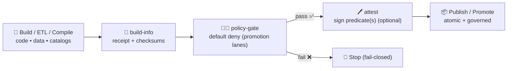

<a id="top"></a>

# 📦 `.github/actions/build-info/` — Build Receipts: Metadata + Checksums (KFM)

[](https://github.com/bartytime4life/Kansas-Frontier-Matrix/actions/workflows/ci.yml)
[](https://github.com/bartytime4life/Kansas-Frontier-Matrix/actions/workflows/codeql.yml)


> 🧾 **Purpose:** generate a **boring, standardized** build “receipt” — `build-info.json` (+ `checksums.sha256`) — so KFM runs stay **traceable, reproducible, and auditable** across:
>
> **🧰 ETL → 🗂️ STAC/DCAT/PROV → 🕸️ Graph → 🔌 API → 🌐 UI → 🎬 Story Nodes → 🧠 Focus Mode**
>
> 🧯 **Rule:** checksums help detect **accidental drift** and support **reproducibility** — they do **not** replace signatures/attestations for adversarial tampering. Pair with `🖊️ attest/`.

---

## 🧾 Policy metadata

| Field | Value |
|---|---|
| File | `.github/actions/build-info/README.md` |
| Action | `.github/actions/build-info/action.yml` *(repo-local composite action)* |
| Action ID | `kfm/build-info` |
| Status | ✅ Active *(spec + implementation guide)* |
| Last updated | **2026-01-11** |
| Baseline | **KFM-MDP v11.2.6** • **Master Guide v13 (draft)** |
| Primary outputs | `build-info.json` + `checksums.sha256` (+ optional `build-info.md`) |
| Primary consumers | `policy-gate` • `attest` • `release` • rollback runbooks |

> [!TIP]
> Keep this action **single-purpose**: “emit build metadata + digests.”  
> SBOM generation belongs in `sbom/`. Signing belongs in `attest/`.

---

## ⚡ Quick links

| Need | Go |
|---|---|
| 🧭 Repo overview | [`../../../README.md`](../../../README.md) |
| 🧩 Actions hub | [`../README.md`](../README.md) |
| 🧪 Workflows hub | [`../../workflows/README.md`](../../workflows/README.md) |
| 🛡️ Security policy | [`../../../SECURITY.md`](../../../SECURITY.md) *(or `.github/SECURITY.md` mirror)* |
| 🧬 SBOM action | [`../sbom/README.md`](../sbom/README.md) |
| 🖊️ Attestations action | [`../attest/README.md`](../attest/README.md) |
| 🧑‍⚖️ Policy gate (expected) | `📁 tools/validation/policy/` |

---

<details>
<summary><strong>📌 Table of contents</strong></summary>

- [🧠 Why `build-info` exists](#-why-build-info-exists)
- [✅ What this action does (and doesn’t)](#-what-this-action-does-and-doesnt)
- [📦 Output layout](#-output-layout)
- [🧭 Where it fits in KFM](#-where-it-fits-in-kfm)
- [🗂️ What to checksum in KFM (recommended targets)](#️-what-to-checksum-in-kfm-recommended-targets)
- [🔁 Determinism & idempotency contract](#-determinism--idempotency-contract)
- [🎛️ Inputs](#-inputs)
- [📤 Outputs](#-outputs)
- [🧬 `build-info.json` schema (recommended)](#-build-infojson-schema-recommended)
- [🧰 Usage examples](#-usage-examples)
- [🔐 Security & governance notes](#-security--governance-notes)
- [🧪 Testing the action](#-testing-the-action)
- [🧯 Troubleshooting](#-troubleshooting)
- [📚 Reference library](#-reference-library)

</details>

---

## 🧠 Why `build-info` exists

KFM is **not just an app** — it’s a system that ships:
- 🛰️ geospatial datasets + catalogs (STAC/DCAT)
- 🧾 provenance bundles (W3C PROV / JSON-LD)
- 🕸️ knowledge graph updates (Neo4j)
- 🔌 API builds + 🧭 UI builds
- 🎬 story nodes + evidence packs
- 🧪 modeling outputs + validation reports

That makes “what changed?” and “what produced this artifact?” a **first-class requirement**.

`build-info` is the **run-scoped receipt** that ties together:
- ✅ Git ref / commit SHA / run identifiers
- ✅ toolchain versions and runner context
- ✅ deterministic digests of key outputs
- ✅ optional lineage hooks (OpenLineage run UUID, PROV links)

> [!NOTE]
> In KFM, **metadata + provenance are security controls**.  
> A “receipt + digests” is the minimum set of evidence that supports audit, reproducibility checks, and rollback sanity.

---

## ✅ What this action does (and doesn’t)

### ✅ This action does
- 📄 Writes a machine-readable `build-info.json`
- 🔎 Produces `checksums.sha256` for selected paths/globs (**stable ordering**)
- 🧰 Captures toolchain versions (best-effort: Python/Node/npm/pnpm/Docker)
- 🧷 Adds run links (CI run URL, repo, workflow/job names)
- 🧠 Optionally writes a human summary `build-info.md` (PR-friendly)
- 🧬 Optionally records determinism signals:
  - `commit_seed` (if provided)
  - `idempotency_key` (if provided)
  - `vclock_utc` (if provided; record-only unless your pipeline uses it)

### ❌ This action does not
- 🧬 Generate an SBOM (use `🧬 sbom/`)
- 🔏 Sign anything (use `🖊️ attest/`)
- 🧑‍⚖️ Enforce policy (use `policy-gate` / Conftest / OPA)
- 🧪 Validate STAC/DCAT/PROV correctness (use catalog QA + schema validation)

> [!IMPORTANT]
> Treat `build-info` as a **receipt**, not a “pass/fail judge.”  
> Gates should evaluate the receipt + reports, then promotion lanes can attest/sign.

---

## 📦 Output layout

Default output directory is configurable, but we recommend a hidden artifact root:

```text
📁 .artifacts/build-info/
├─ 📄 build-info.json         # 🧾 machine-readable build metadata (receipt)
├─ 📄 checksums.sha256        # 🔎 sha256 of selected files (stable ordering)
├─ 📄 build-info.md           # 🧠 optional human summary (PR-friendly)
└─ 📄 files.manifest.json     # 🗂️ optional: explicit list of files hashed (debuggable)
```

> [!TIP]
> Prefer stable filenames (`build-info.json`, `checksums.sha256`) so policy gates and operators can find them instantly.

---

## 🧭 Where it fits in KFM



**Interpretation:** `build-info` is early evidence. Policy + validation gates decide if it’s promotable. Attestation is the cryptographic wrap.

---

## 🗂️ What to checksum in KFM (recommended targets)

> [!IMPORTANT]
> Don’t checksum “everything.” ✅  
> Checksum the **boundary artifacts** that represent the contract of a run.

### 📦 Canonical KFM “boundary artifacts”
- 🗂️ **STAC**
  - `data/stac/collections/**`
  - `data/stac/items/**`
- 📚 **DCAT**
  - `data/catalog/dcat/**`
- 🧾 **PROV**
  - `data/prov/**`
- 📝 **Reports / QA evidence**
  - `tools/**/out/**`
  - `.artifacts/**/reports/**` *(if you centralize)*
- 🐳 **Container evidence**
  - `artifacts/image-digest.txt` *(digest pinned output)*
  - SBOM outputs from `sbom/` if you include them

### 🛰️ For large raster/tilesets
Instead of hashing every tile:
- ✅ hash a **manifest** (paths + sizes + digests)
- ✅ hash the **catalog JSON** pointing to immutable objects
- ✅ hash the **PROV bundle** recording the transform parameters

> [!TIP]
> For promotion lanes, the gate should require:
> - receipt present ✅
> - checksums present ✅
> - catalogs/prov present ✅  
> …then attest/sign and publish.

---

## 🔁 Determinism & idempotency contract

KFM’s lanes are designed to be **deterministic + idempotent** where possible.

### ✅ Determinism rules for `build-info`
- 🔒 **Stable ordering:** always sort the file list before hashing
- 🧭 **Repo-relative paths:** store paths relative to workspace root
- 🧱 **No hidden state:** do not depend on runner temp files for content hashing
- 🕰️ **Time discipline:** record timestamps, but avoid embedding them into hashed outputs unless required

### ♻️ Idempotency signals (optional but recommended)
If your lane uses agent automation / replay:
- `idempotency_key` → ensures replays don’t create “double writes”
- `commit_seed` → ensures randomized steps are reproducible
- `run_uuid` (lineage) → stable identifier for observability + audit trail

> [!NOTE]
> These values are **recorded** by `build-info` — your pipeline must actually *use* them to get deterministic artifacts.

---

## 🎛️ Inputs

> Inputs are strings (GitHub Actions limitation). Use `"true"` / `"false"` for booleans.

| Input | Required | Default | Meaning |
|---|---:|---|---|
| `out_dir` | ❌ | `.artifacts/build-info` | Output directory |
| `artifact_globs` | ❌ | *(empty)* | Newline-separated globs to checksum |
| `exclude_globs` | ❌ | *(empty)* | Newline-separated globs to ignore |
| `fail_on_missing` | ❌ | `true` | Fail if any glob matches nothing |
| `include_git` | ❌ | `true` | Include repo/SHA/ref metadata |
| `include_runner` | ❌ | `true` | Include OS/arch and GitHub context fields |
| `include_toolchain` | ❌ | `true` | Include python/node/npm/pnpm versions (best effort) |
| `include_docker` | ❌ | `false` | Include docker/buildx version fields (best effort) |
| `safe_env_keys` | ❌ | `KFM_*` | Allowlist env keys to record (never dump full env) |
| `subject` | ❌ | *(empty)* | Optional “what this receipt is about” (image digest, dataset ID, etc.) |
| `commit_seed` | ❌ | *(empty)* | Optional determinism seed (record only) |
| `idempotency_key` | ❌ | *(empty)* | Optional idempotency key (record only) |
| `vclock_utc` | ❌ | *(empty)* | Optional “virtual clock” timestamp (ISO8601, record only) |
| `run_uuid` | ❌ | *(empty)* | Optional lineage run UUID (OpenLineage-style, record only) |
| `write_summary_md` | ❌ | `true` | Emit `build-info.md` and write a Step Summary |
| `write_manifest_json` | ❌ | `true` | Emit `files.manifest.json` for debuggability |
| `max_files` | ❌ | `20000` | Safety guard against runaway globbing |
| `max_total_bytes` | ❌ | `0` | Safety guard (0 = disabled). Consider enabling in PR lanes. |
| `symlink_policy` | ❌ | `deny` | `deny` \| `allow-in-repo` *(recommended)* |

> [!TIP]
> If you must include large outputs, checksum the **manifest**, not the entire blob set. 🌎📦

---

## 📤 Outputs

| Output | Meaning |
|---|---|
| `build_info_path` | Path to `build-info.json` |
| `checksums_path` | Path to `checksums.sha256` |
| `summary_path` | Path to `build-info.md` (if enabled) |
| `manifest_path` | Path to `files.manifest.json` (if enabled) |
| `build_id` | Stable-ish identifier (recommended: `${repo}@${sha}` + run context) |
| `files_hashed` | Count of hashed files |
| `total_bytes_hashed` | Total bytes hashed |

---

## 🧬 `build-info.json` schema (recommended)

> This is intentionally “boring JSON” — easy to validate and ingest into PROV/OpenLineage later.

```json
{
  "schema_version": 1,
  "kfm": {
    "mdp_baseline": "v11.2.6",
    "master_guide": "v13-draft",
    "pipeline_invariant": "ETL → STAC/DCAT/PROV → Graph → API → UI → Story Nodes → Focus Mode"
  },
  "subject": {
    "type": "git|image|dataset|artifact",
    "ref": "git+https://github.com/<org>/<repo>@<sha>"
  },
  "build": {
    "repo": "bartytime4life/Kansas-Frontier-Matrix",
    "sha": "0123456789abcdef...",
    "ref": "refs/heads/main",
    "run_id": "1234567890",
    "run_attempt": 1,
    "workflow": "CI",
    "job": "build",
    "timestamp_utc": "2026-01-11T00:00:00Z",
    "vclock_utc": "2026-01-01T00:00:00Z",
    "commit_seed": "424242",
    "idempotency_key": "kfm:promo:ks-water:2026-01-11"
  },
  "runner": {
    "os": "ubuntu-latest",
    "arch": "x64"
  },
  "toolchain": {
    "python": "3.12.1",
    "node": "20.11.0",
    "npm": "10.2.4",
    "pnpm": "9.0.0",
    "docker": "25.0.0",
    "buildx": "0.13.0"
  },
  "inputs": {
    "artifact_globs": [
      "data/stac/collections/**",
      "data/stac/items/**",
      "data/catalog/dcat/**",
      "data/prov/**"
    ],
    "exclude_globs": [
      "**/.DS_Store",
      "**/*.tmp"
    ]
  },
  "artifacts": [
    {
      "path": "data/stac/collections/ks-water/collection.json",
      "sha256": "…",
      "bytes": 12345
    }
  ],
  "checksums_file": {
    "path": ".artifacts/build-info/checksums.sha256",
    "algo": "sha256"
  },
  "lineage": {
    "run_uuid": "2f1c7f0e-0f68-4f78-8b5e-3dbb9b7af4c7",
    "provider": "openlineage",
    "events_path": ".artifacts/lineage/events.jsonl"
  },
  "links": {
    "ci_run_url": "https://github.com/<org>/<repo>/actions/runs/<run_id>"
  }
}
```

✅ Recommended companion:
- `schemas/build-info.schema.json` *(validate receipts in CI so the format stays stable)*

---

## 🧰 Usage examples

### ✅ PR lane — minimal receipt (catalog/prov only)

```yaml
- name: 📦 build-info (receipt)
  uses: ./.github/actions/build-info
  with:
    out_dir: ".artifacts/build-info"
    artifact_globs: |
      data/stac/collections/**
      data/stac/items/**
      data/catalog/dcat/**
      data/prov/**
```

### 🧪 Validation lane — include reports + reproducibility signals

```yaml
- name: 📦 build-info (validation evidence)
  uses: ./.github/actions/build-info
  with:
    out_dir: ".artifacts/build-info"
    commit_seed: "${{ env.KFM_COMMIT_SEED }}"
    idempotency_key: "${{ env.KFM_IDEMPOTENCY_KEY }}"
    run_uuid: "${{ env.KFM_RUN_UUID }}"
    artifact_globs: |
      tools/**/out/**
      data/stac/collections/**
      data/stac/items/**
      data/catalog/dcat/**
      data/prov/**
```

### 🐳 Docker lane — include digest + SBOM handoff

```yaml
- name: 🐳 Write image digest file
  run: |
    echo "${IMAGE_DIGEST}" > .artifacts/image-digest.txt

- name: 📦 build-info (include supply-chain evidence)
  uses: ./.github/actions/build-info
  with:
    out_dir: ".artifacts/build-info"
    include_docker: "true"
    subject: "image@${{ env.IMAGE_DIGEST }}"
    artifact_globs: |
      .artifacts/image-digest.txt
      .artifacts/attestations/materials.sbom.spdx.json
      .artifacts/build-provenance/provenance.json
```

### 🔏 Pairing pattern — receipt → attest (promotion lane)

```yaml
- name: 📦 build-info
  id: receipt
  uses: ./.github/actions/build-info
  with:
    out_dir: ".artifacts/build-info"
    artifact_globs: |
      data/stac/collections/**
      data/catalog/dcat/**
      data/prov/**

- name: 🖊️ attest receipt (optional)
  uses: ./.github/actions/attest
  with:
    subject: "git+https://github.com/${{ github.repository }}@${{ github.sha }}"
    artifacts: |
      ${{ steps.receipt.outputs.build_info_path }}
      ${{ steps.receipt.outputs.checksums_path }}
```

---

## 🔐 Security & governance notes

### ✅ Checksums ≠ signatures
- A checksum detects drift and supports reproducibility.
- A checksum alone does **not** prove who produced it.

✅ For adversarial integrity:
- use attestations (in-toto / DSSE / SLSA-ish predicate)
- sign via Sigstore/Cosign (keyless OIDC) or a key-based policy

### ✅ Never record secrets
This action must **never**:
- dump all environment variables
- print secret values
- write secrets into `build-info.json`

**Design rule:** only record env values from an explicit allowlist like `KFM_*`.

### ✅ Treat CI inputs as untrusted
If `artifact_globs` is user-controlled, guard against:
- path traversal `..`
- symlink escapes
- runaway expansions (`max_files`, `max_total_bytes`)

> [!CAUTION]
> Do **not** run publish/promotion or attestation steps on untrusted fork PRs.  
> Keep those lanes on `push main`, tags, or `workflow_dispatch` + protected environments.

---

## 🧪 Testing the action

Recommended smoke workflow:
- `.github/workflows/actions-smoke.yml` (manual dispatch)
  - runs `build-info` on a tiny fixture folder
  - uploads `.artifacts/build-info/**`
  - validates `build-info.json` against `schemas/build-info.schema.json` (if present)

Checklist:
- [ ] `build-info.json` written ✅
- [ ] `checksums.sha256` written ✅
- [ ] stable ordering (same globs → same checksums file ordering) ✅
- [ ] fails closed if configured (`fail_on_missing=true`) ✅
- [ ] never prints secrets (scan logs) ✅

---

## 🧯 Troubleshooting

### “Glob matched nothing” (and the job failed)
That’s usually correct behavior. Fix one of:
- the glob path(s)
- the job working directory
- set `fail_on_missing: "false"` **only when justified** (rare)

### “Checksums file changes every run”
Common causes:
- non-deterministic build outputs
- timestamps embedded in generated files
- unordered directory listings / non-stable glob expansion

Fix:
- make the upstream build deterministic (seeded)
- ensure files are written in stable order
- normalize metadata outputs where possible

### “We need to include huge rasters/tiles”
Don’t checksum every tile in CI.
Prefer:
- checksum the **manifest** listing tiles (sizes + digests)
- checksum only **catalog JSONs** + **PROV bundle**
- store deep digests in object storage and reference via immutable URIs

---

## 📚 Reference library

KFM treats **traceability** as a first-class feature:
- 🧾 provenance + evidence bundles reduce “mystery artifacts”
- 🧪 deterministic runs support scientific repeatability
- 🔐 supply chain discipline supports trust and downstream safety

### Core KFM sources
- `docs/specs/Kansas Frontier Matrix (KFM) – Comprehensive Technical Documentation.docx`
- `docs/specs/MARKDOWN_GUIDE_v13.md.gdoc` *(contract-first, validation gates, data layout)*
- `docs/notes/🌟 Kansas Frontier Matrix – Latest Ideas & Future Proposals.docx` *(Detect → Validate → Promote, OpenLineage run UUID, Sigstore ideas)*

<details>
<summary><strong>📚 Full project library (context for governance + reproducibility)</strong></summary>

> ⚠️ Reference materials may have licenses different from repo code.  
> Keep them under `docs/library/` (or outside the repo) and respect upstream terms.

**🧭 KFM / protocol**
- `docs/specs/Kansas Frontier Matrix (KFM) – Comprehensive Technical Documentation.docx`
- `docs/specs/MARKDOWN_GUIDE_v13.md.gdoc`
- `docs/specs/Scientific Method _ Research _ Master Coder Protocol Documentation.pdf`
- `docs/notes/🌟 Kansas Frontier Matrix – Latest Ideas & Future Proposals.docx`

**🗺️ GIS, cartography, remote sensing**
- `docs/library/python-geospatial-analysis-cookbook.pdf`
- `docs/library/KFM- python-geospatial-analysis-cookbook-over-60-recipes-to-work-with-topology-overlays-indoor-routing-and-web-application-analysis-with-python.pdf`
- `docs/library/PostgreSQL Notes for Professionals - PostgreSQLNotesForProfessionals.pdf`
- `docs/library/making-maps-a-visual-guide-to-map-design-for-gis.pdf`
- `docs/library/Mobile Mapping_ Space, Cartography and the Digital - 9789048535217.pdf`
- `docs/library/Cloud-Based Remote Sensing with Google Earth Engine-Fundamentals and Applications.pdf`
- `docs/library/compressed-image-file-formats-jpeg-png-gif-xbm-bmp.pdf`

**📈 Modeling, statistics, simulation**
- `docs/library/Scientific Modeling and Simulation_ A Comprehensive NASA-Grade Guide.pdf`
- `docs/library/Understanding Statistics & Experimental Design.pdf`
- `docs/library/think-bayes-bayesian-statistics-in-python.pdf`
- `docs/library/regression-analysis-with-python.pdf`
- `docs/library/Regression analysis using Python - slides-linear-regression.pdf`
- `docs/library/graphical-data-analysis-with-r.pdf`
- `docs/library/Generalized Topology Optimization for Structural Design.pdf`
- `docs/library/Spectral Geometry of Graphs.pdf`

**⚙️ Systems, scaling, concurrency**
- `docs/library/Scalable Data Management for Future Hardware.pdf`
- `docs/library/Data Spaces.pdf`
- `docs/library/concurrent-real-time-and-distributed-programming-in-java-threads-rtsj-and-rmi.pdf`

**🌐 Web + 3D**
- `docs/library/responsive-web-design-with-html5-and-css3.pdf`
- `docs/library/webgl-programming-guide-interactive-3d-graphics-programming-with-webgl.pdf`

**🧑‍⚖️ Ethics, governance, law**
- `docs/library/Introduction to Digital Humanism.pdf`
- `docs/library/Principles of Biological Autonomy - book_9780262381833.pdf`
- `docs/library/On the path to AI Law’s prophecies and the conceptual foundations of the machine learning age.pdf`

**🛡️ Security awareness (defense only)**
- `docs/library/ethical-hacking-and-countermeasures-secure-network-infrastructures.pdf`
- `docs/library/Gray Hat Python - Python Programming for Hackers and Reverse Engineers (2009).pdf`

**📚 Programming shelf bundles**
- `docs/library/A programming Books.pdf`
- `docs/library/B-C programming Books.pdf`
- `docs/library/D-E programming Books.pdf`
- `docs/library/F-H programming Books.pdf`
- `docs/library/I-L programming Books.pdf`
- `docs/library/M-N programming Books.pdf`
- `docs/library/O-R programming Books.pdf`
- `docs/library/S-T programming Books.pdf`
- `docs/library/U-X programming Books.pdf`

</details>

---

<p align="right"><a href="#top">⬆️ Back to top</a></p>
