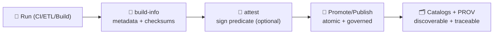

<a id="top"></a>

# 📦 `.github/actions/build-info/` — Build Metadata + Checksums (KFM)

[](#-what-this-action-does)


> 🧾 **Purpose:** generate a **boring, standardized** `build-info.json` (+ `checksums.sha256`) so KFM runs are **traceable, reproducible, and auditable** across **ETL → Catalogs (STAC/DCAT/PROV) → Graph → API → UI → Story Nodes → Focus Mode**.  
> 🧯 **Rule:** checksums help detect **accidental drift** and aid auditing — **they do not replace signatures/attestations** for adversarial tampering.

---

## 🧾 Policy metadata

| Field | Value |
|---|---|
| File | `.github/actions/build-info/README.md` |
| Action ID | `kfm/build-info` *(repo-local composite action)* |
| Status | ✅ Active (spec + implementation guide) |
| Last updated | **2026-01-09** |
| Baseline | **KFM-MDP v11.2.6** • **Master Guide v13 (draft)** |
| Outputs | `build-info.json` + `checksums.sha256` (+ optional `build-info.md`) |

> [!TIP]
> Keep this action **single-purpose**: “emit build metadata + digests.”  
> SBOM generation belongs in an `sbom/` action; signing belongs in an `attest/` action.

---

## ⚡ Quick links

| Need | Go |
|---|---|
| 🧭 Repo overview | [`../../README.md`](../../README.md) |
| 🤝 Collaboration rules | [`../README.md`](../README.md) |
| 🧪 CI/CD lanes | [`../workflows/README.md`](../workflows/README.md) |
| 🛡️ Security policy | [`../../SECURITY.md`](../../SECURITY.md) *(or `../SECURITY.md` mirror)* |
| 🔏 Attestations action | [`../attest/README.md`](../attest/README.md) *(recommended companion)* |

---

<details>
<summary><strong>📌 Table of contents</strong></summary>

- [🧠 What this action does](#-what-this-action-does)
- [📦 What it generates](#-what-it-generates)
- [🧭 Where it fits in KFM](#-where-it-fits-in-kfm)
- [🧾 Inputs](#-inputs)
- [📤 Outputs](#-outputs)
- [🧬 Build-info schema (recommended shape)](#-build-info-schema-recommended-shape)
- [🧰 Usage examples](#-usage-examples)
- [🔐 Security & integrity notes](#-security--integrity-notes)
- [🧪 Testing the action](#-testing-the-action)
- [🧯 Troubleshooting](#-troubleshooting)
- [📚 Reference library (why we do it this way)](#-reference-library-why-we-do-it-this-way)

</details>

---

## 🧠 What this action does

This action creates a **run-scoped provenance-friendly “receipt”** for CI/CD runs.

It:
- ✅ records **who/what/when** for a run (repo, sha, run id, workflow/job, runner OS)
- ✅ records key **toolchain versions** (python/node/docker when available)
- ✅ computes **SHA-256 checksums** for selected files (catalogs, provenance bundles, build artifacts)
- ✅ emits a **machine-readable JSON** plus a human-friendly summary (optional)
- ✅ is designed to be attached to:
  - PR artifacts (debug + review)
  - releases (supply chain)
  - data promotion lanes (catalog publish)

> [!IMPORTANT]
> `build-info` is **not** a signer. It produces the predicate/receipt.  
> Signing/attestation happens in `attest/` (Sigstore/Cosign / in-toto / SLSA-ish).

---

## 📦 What it generates

Recommended output folder (configurable):

```text
artifacts/build-info/
├─ build-info.json         # 🧾 machine-readable build metadata
├─ checksums.sha256        # 🔎 sha256sum of selected files (stable ordering)
└─ build-info.md           # 🧠 optional human summary (PR-friendly)
```

### ✅ Typical “subjects” you checksum in KFM

- 🗂️ STAC: `data/catalog/stac/**/collection.json`, `data/catalog/stac/**/item.json`
- 🗃️ DCAT: `data/catalog/dcat/**/*.json`
- 🧬 PROV: `data/prov/**/run.jsonld` *(or your canonical PROV folder)*
- 📦 Web builds: `web/dist/**` *(if you publish viewer/docs)*
- 🐳 Docker: image digest text file(s) emitted by build workflow
- 🧪 Reports: `tools/validation/**/out/**` *(QA evidence)*

---

## 🧭 Where it fits in KFM

KFM’s guardrails are “pipeline-first.” `build-info` supports the **audit chain**.



### Why it matters (KFM-shaped)
- 🧾 **Auditor-friendly linkage:** every artifact can point to **(a)** the build receipt and **(b)** the exact CI run URL.
- 🔁 **Repro checks:** downstream lanes can rebuild or re-validate and compare hashes.
- 🧯 **Rollback sanity:** releases and promotions can be tied to **immutable digests**.

---

## 🧾 Inputs

> Inputs should be explicit and safe-by-default. Prefer allowlists over “grab everything.”

| Input | Required | Default | Notes |
|---|---:|---|---|
| `out_dir` | ❌ | `artifacts/build-info` | Output directory (created if missing) |
| `artifact_globs` | ❌ | *(empty)* | Newline-separated globs to checksum |
| `include_git` | ❌ | `true` | Include repo + sha + ref metadata |
| `include_toolchain` | ❌ | `true` | Include python/node/npm versions (best effort) |
| `include_docker` | ❌ | `false` | Adds docker version info if available |
| `include_runner` | ❌ | `true` | OS/arch, runner name, GitHub context |
| `safe_env_keys` | ❌ | `KFM_*` | Allowlist env keys to record (never dump all env) |
| `commit_seed` | ❌ | *(empty)* | Optional determinism seed (record only; do not invent) |
| `fail_on_missing` | ❌ | `true` | If a glob matches nothing, fail (keeps receipts honest) |
| `write_summary_md` | ❌ | `true` | Write `build-info.md` for PR readability |

> [!TIP]
> Keep `artifact_globs` focused. For huge trees, checksum only:
> - the top-level catalog JSONs
> - provenance bundle(s)
> - build output manifests  
> …not every tile in the world 🌎😅

---

## 📤 Outputs

| Output | Meaning |
|---|---|
| `build_info_path` | Full path to `build-info.json` |
| `checksums_path` | Full path to `checksums.sha256` |
| `summary_path` | Full path to `build-info.md` (if enabled) |
| `build_id` | Stable-ish build identifier (recommended: `${repo}@${sha}` + run context) |

---

## 🧬 Build-info schema (recommended shape)

> This is intentionally “boring JSON.” It should be easy to validate and easy to ingest into PROV/OpenLineage later.

```json
{
  "schema_version": 1,
  "kfm": {
    "mdp_baseline": "v11.2.6",
    "master_guide": "v13-draft",
    "pipeline_invariant": "ETL → STAC/DCAT/PROV → Graph → API → UI → Story Nodes → Focus Mode"
  },
  "build": {
    "repo": "bartytime4life/Kansas-Frontier-Matrix",
    "sha": "0123456789abcdef...",
    "ref": "refs/heads/main",
    "run_id": "1234567890",
    "run_attempt": 1,
    "workflow": "CI",
    "job": "python",
    "timestamp_utc": "2026-01-09T00:00:00Z",
    "commit_seed": "424242"
  },
  "runner": {
    "os": "ubuntu-latest",
    "arch": "x64"
  },
  "toolchain": {
    "python": "3.12.1",
    "node": "20.11.0",
    "npm": "10.2.4",
    "docker": "25.0.0"
  },
  "inputs": {
    "artifact_globs": [
      "data/catalog/stac/**/collection.json",
      "data/catalog/dcat/**/*.json",
      "data/prov/**/run.jsonld"
    ]
  },
  "artifacts": [
    {
      "path": "data/catalog/stac/ks/collection.json",
      "sha256": "…",
      "bytes": 12345
    }
  ],
  "checksums_file": {
    "path": "artifacts/build-info/checksums.sha256",
    "algo": "sha256"
  },
  "links": {
    "ci_run_url": "https://github.com/<org>/<repo>/actions/runs/<run_id>"
  }
}
```

✅ Recommended companion file:
- `schemas/build-info.schema.json` *(validate in CI so receipts stay stable)*

---

## 🧰 Usage examples

### ✅ Minimal usage (PR lane)

```yaml
- name: 📦 Emit build-info (receipt)
  uses: ./.github/actions/build-info
  with:
    out_dir: "artifacts/build-info"
    artifact_globs: |
      data/catalog/stac/**/collection.json
      data/catalog/dcat/**/*.json
      data/prov/**/run.jsonld
```

### 🗂️ Data PR usage (catalog + provenance-heavy)

```yaml
- name: 📦 Build-info for data promotion evidence
  uses: ./.github/actions/build-info
  with:
    out_dir: "artifacts/build-info"
    commit_seed: "${{ env.PIPELINE_SEED }}"
    artifact_globs: |
      tools/validation/**/out/**
      data/catalog/stac/**/collection.json
      data/catalog/stac/**/item.json
      data/catalog/dcat/**/*.json
      data/prov/runs/**/*
```

### 🐳 Docker usage (pair with image digest)

```yaml
- name: 🐳 Write image digest file
  run: |
    echo "${IMAGE_DIGEST}" > artifacts/image-digest.txt

- name: 📦 Build-info (include digest)
  uses: ./.github/actions/build-info
  with:
    out_dir: "artifacts/build-info"
    include_docker: "true"
    artifact_globs: |
      artifacts/image-digest.txt
      artifacts/sbom.spdx.json
      artifacts/build_provenance.json
```

### 🔏 Signing pattern (handoff to `attest/`)

```yaml
- name: 📦 build-info
  id: receipt
  uses: ./.github/actions/build-info

- name: 🔏 attest receipt (optional)
  uses: ./.github/actions/attest
  with:
    predicate_path: ${{ steps.receipt.outputs.build_info_path }}
    subject: "git+https://github.com/${{ github.repository }}@${{ github.sha }}"
```

---

## 🔐 Security & integrity notes

### ✅ Checksums ≠ signatures
- A checksum helps detect **accidental changes** and supports reproducibility.
- A checksum alone does **not** prove **who** produced it or prevent an attacker from swapping the checksum with the artifact.

✅ If you need adversarial integrity:
- generate an **attestation** (in-toto / SLSA predicate)
- **sign** it (Sigstore/Cosign keyless, or key-based, depending on your policy)

### ✅ Never record secrets
This action must **never**:
- dump the full environment
- print secret values
- write secrets into `build-info.json`

**Design rule:** only record env values from an explicit allowlist like `KFM_*` (and avoid anything resembling credentials).

### ✅ Treat CI inputs as untrusted
If `artifact_globs` is user-controlled (e.g., workflow inputs), guard against:
- path traversal / sneaky `..`
- symlink escapes
- huge file expansions (keep a size budget)

---

## 🧪 Testing the action

Recommended smoke workflow:

- `.github/workflows/actions-smoke.yml` (manual dispatch)
  - runs `build-info` on a tiny fixture directory
  - uploads `artifacts/build-info/**`
  - validates JSON schema (if present)

Checklist:
- [ ] `build-info.json` written
- [ ] `checksums.sha256` written
- [ ] stable ordering (same globs → same checksum file ordering)
- [ ] fails closed if configured (`fail_on_missing=true`) and files missing
- [ ] never prints secrets (scan logs)

---

## 🧯 Troubleshooting

### “Glob matched nothing” (and the job failed)
That’s usually correct behavior. Fix one of:
- the glob path(s)
- the job working directory
- set `fail_on_missing: "false"` **only when justified** (rare)

### “Checksums file changes every run”
Common causes:
- non-deterministic build outputs
- timestamps embedded in generated files
- unordered directory listing / non-stable glob expansion

Fix:
- make the upstream build deterministic (seeded)
- ensure files are written in stable order
- normalize metadata outputs where possible

### “We need to include huge rasters/tiles”
Don’t checksum every tile in CI.
Prefer:
- checksum the **manifest** listing tiles (with sizes + digests)
- checksum only **catalog JSONs** + **PROV bundle**
- store deep digests in object storage with a stable manifest reference

---

## 📚 Reference library (why we do it this way)

KFM treats **traceability** as a first-class feature:
- 🧾 provenance + evidence bundles reduce “mystery artifacts”
- 🧪 deterministic runs support scientific repeatability
- 🔐 supply chain discipline supports trust and downstream safety

Suggested project docs to keep nearby:
- `docs/specs/Kansas Frontier Matrix (KFM) – Comprehensive Technical Documentation.docx`
- `docs/specs/MARKDOWN_GUIDE_v13.md` *(exported from `.gdoc`)*  
- `docs/specs/Scientific Method _ Research _ Master Coder Protocol Documentation.pdf`
- `docs/library/Scientific Modeling and Simulation_ A Comprehensive NASA-Grade Guide.pdf`
- `docs/library/Understanding Statistics & Experimental Design.pdf`
- `docs/library/Scalable Data Management for Future Hardware.pdf`
- `docs/library/PostgreSQL Notes for Professionals - PostgreSQLNotesForProfessionals.pdf`
- `docs/library/Data Spaces.pdf`
- `docs/library/ethical-hacking-and-countermeasures-secure-network-infrastructures.pdf` *(defense mindset)*

---

<p align="right"><a href="#top">⬆️ Back to top</a></p>

