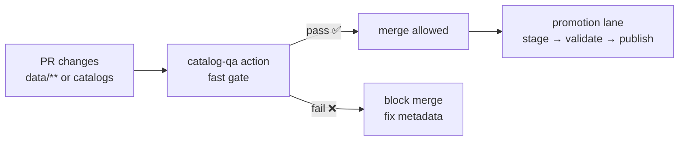

<a id="top"></a>

# ✅ `catalog-qa` — STAC/DCAT Quick Gate (Kansas Frontier Matrix)


> This is a **repo-local composite action** that runs KFM’s **Catalog QA** checks to prevent broken or unsafe catalogs from merging.
>
> **Position in the pipeline:** **ETL → Catalogs (STAC/DCAT/PROV) → Graph → API → UI → Story Nodes → Focus Mode**  
> Catalog QA is a *fast PR gate* that protects **trust**: metadata completeness, link integrity, and “promotion readiness”.

---

## 🧾 Action metadata

| Field | Value |
|---|---|
| Action name | `kfm/catalog-qa` (local composite action) |
| Action file | `.github/actions/catalog-qa/action.yml` |
| Docs file | `.github/actions/catalog-qa/README.md` |
| Status | Active ✅ *(or “spec” until `action.yml` exists)* |
| Last updated | **2026-01-09** |
| KFM-MDP baseline | **v11.2.6** |
| Master Guide | **v13 (draft)** |
| Default lane | PR (fast / required when data catalogs change) |

---

## ⚡ Quick links

| Need | Go |
|---|---|
| 🧩 All local actions | [`../README.md`](../README.md) |
| 🧰 Workflows (how this is used) | [`../../workflows/README.md`](../../workflows/README.md) |
| ✅ Catalog QA tool code | [`../../../tools/validation/catalog_qa/`](../../../tools/validation/catalog_qa/) |
| 🧭 Project overview | [`../../../README.md`](../../../README.md) |
| 🛡️ Security policy | [`../../../SECURITY.md`](../../../SECURITY.md) *(or `../../SECURITY.md` if mirrored in `.github/`)* |

---

<details>
<summary><strong>🧭 Table of contents</strong></summary>

- [🎯 What this action does](#-what-this-action-does)
- [🧱 Where it fits in KFM promotion](#-where-it-fits-in-kfm-promotion)
- [✅ What gets checked](#-what-gets-checked)
- [🔧 Inputs](#-inputs)
- [📤 Outputs](#-outputs)
- [🚀 Usage](#-usage)
- [🧪 Local run (developer workflow)](#-local-run-developer-workflow)
- [🔐 Security notes (link checking & SSRF)](#-security-notes-link-checking--ssrf)
- [📦 Artifacts & reports](#-artifacts--reports)
- [🧯 Troubleshooting](#-troubleshooting)
- [🧩 Extending the gate](#-extending-the-gate)
- [📚 Reference library](#-reference-library)

</details>

---

## 🎯 What this action does

This action runs a **fast, deterministic** QA pass over catalog/metadata files to catch high-impact problems early:

- ✅ Required fields present (KFM minimum bar)
- 🔗 Link integrity checks for key `href`s (fail-closed by default)
- 🧾 Optional policy checks aligned with KFM’s “boundary artifacts” discipline (STAC/DCAT/PROV)

> [!IMPORTANT]
> In KFM, **metadata is security-critical**. Broken catalog links, missing licenses, or missing provenance can become downstream supply-chain and trust failures.

---

## 🧱 Where it fits in KFM promotion



Catalog QA is intentionally **not** the entire validation universe.
It is a **high-ROI PR filter**. Full schema validation can run in a heavier lane (nightly or manual dispatch).

---

## ✅ What gets checked

### ✅ Baseline checks (fast PR gate)

By default, KFM Catalog QA targets these failure modes:

1) **Required metadata is present**
- `license` exists and non-empty *(fail if missing/empty)*
- `providers` exists and non-empty *(fail if missing/empty)*
- `stac_extensions` key exists *(fail if missing; warn if empty — configurable)*

2) **Link integrity**
- Checks critical `links[].href` and/or `assets.*.href` via `HEAD`/`GET` (implementation-defined)
- Fails if links are dead/unreachable (unless explicitly configured to warn)

3) **Promotion readiness (lightweight)**
- Verifies the repo can treat catalogs as “boundary artifacts” to downstream stages (graph/API/UI)

### 🧭 Optional checks (toggle on when needed)

Depending on your repo maturity and performance budget, you can enable stricter checks:

- **STAC core sanity**
  - `id`, `type`, `stac_version`, `bbox`
  - valid `geometry` (when present)
  - temporal coverage present (`properties.datetime` OR `start_datetime` + `end_datetime`)
  - `links` array shape sanity
  - `assets.*.href` present for publishable Items

- **DCAT sanity**
  - title/description/license/keywords present
  - at least one distribution link (points to STAC or downloads)

- **PROV presence**
  - verify a PROV record exists for promoted artifacts (repo may use `data/prov/` or `data/provenance/`)
  - enforce “no orphan catalogs” (catalog entries must correspond to real outputs)

- **Geo sanity**
  - bbox plausibility checks (and optional Kansas bounds sanity)
  - geometry validity checks for vectors (self-intersections, empties)

- **Governance**
  - optional SPDX allowlist for `license`
  - optional “stable extensions only” enforcement for production catalogs

> [!TIP]
> Keep PR gates fast. Put deep validation in **nightly** or **promotion** lanes.

---

## 🔧 Inputs

> Composite action inputs are **strings** (even for booleans). Use `"true"` / `"false"`.

| Input | Required | Default | Meaning |
|---|---:|---|---|
| `root` | ❌ | `data/` | Root directory to scan |
| `glob` | ❌ | `**/collection.json` | Glob for catalog files to check (adjust to your layout) |
| `fail_on_warn` | ❌ | `"true"` | Treat warnings as failures |
| `check_links` | ❌ | `"true"` | Enable link checking (`href` validation) |
| `output_dir` | ❌ | `tools/validation/catalog_qa/out` | Where reports are written |
| `python_version` | ❌ | `"3.12"` | Python version to run the QA tool (if action sets up Python) |

> [!NOTE]
> If your repo stores STAC Items under `data/stac/items/**` and Collections under `data/stac/collections/**`, consider setting `glob` to multiple patterns by running the action twice, or implementing a newline-separated glob input.

---

## 📤 Outputs

| Output | Description |
|---|---|
| `report_json` | Path to machine-readable QA report (`.json`) |
| `report_md` | Path to a human-readable summary (`.md`) |
| `error_count` | Integer-like string |
| `warning_count` | Integer-like string |

> Outputs are intended for workflow steps like artifact upload, PR annotations, and promotion gating decisions.

---

## 🚀 Usage

### ✅ Recommended: PR gate workflow (paths-filtered)

```yaml
name: Catalog QA

on:
  pull_request:
    paths:
      - "data/**"
      - "tools/validation/catalog_qa/**"
      - ".github/actions/catalog-qa/**"
      - ".github/workflows/catalog-qa.yml"
  workflow_dispatch:

permissions:
  contents: read

jobs:
  catalog-qa:
    runs-on: ubuntu-latest
    timeout-minutes: 10

    steps:
      - uses: actions/checkout@v4

      # Option A: let the action set up Python (if implemented that way)
      - name: Run Catalog QA
        uses: ./.github/actions/catalog-qa
        with:
          root: "data/"
          glob: "**/collection.json"
          fail_on_warn: "true"
          check_links: "true"

      # Always upload reports (especially on failure)
      - name: Upload Catalog QA reports
        uses: actions/upload-artifact@v4
        if: always()
        with:
          name: catalog-qa-${{ github.sha }}
          path: tools/validation/catalog_qa/out/**
```

### ✅ Alternative: workflow owns setup (action is “runner only”)

If your action does **not** install Python or deps, use:

```yaml
- uses: actions/setup-python@v5
  with:
    python-version: "3.12"
    cache: "pip"

- name: Install QA deps
  run: |
    python -m pip install -U pip
    pip install -r requirements-dev.txt

- name: Run Catalog QA
  uses: ./.github/actions/catalog-qa
  with:
    root: "data/"
    glob: "**/collection.json"
    fail_on_warn: "true"
```

---

## 🧪 Local run (developer workflow)

If you’re iterating locally, run the same tool the action wraps.

```bash
python3 tools/validation/catalog_qa/run_catalog_qa.py \
  --root data/ \
  --glob "**/collection.json" \
  --fail-on-warn
```

> [!TIP]
> Use small fixtures (tiny STAC collections/items + dummy links) to keep iteration fast.

---

## 🔐 Security notes (link checking & SSRF)

Link checking is valuable — and also a classic SSRF foot-gun if implemented carelessly.

This action/tool **should** enforce safe defaults:

- ✅ Only allow `http://` and `https://` schemes
- ✅ Deny private/loopback/link-local destinations (no `127.0.0.1`, `10.0.0.0/8`, `169.254.0.0/16`, etc.)
- ✅ Cap redirects (and re-check destination after redirects)
- ✅ Use timeouts and max-size limits
- ✅ Never send credentials/Authorization headers to external URLs
- ✅ Avoid downloading large assets (prefer `HEAD` or range-limited `GET`)

> [!CAUTION]
> If you enable link checks on PRs from forks, treat the catalogs as **untrusted input** and keep SSRF defenses strict.

---

## 📦 Artifacts & reports

### ✅ Recommended report files

Write both machine + human outputs:

```text
tools/validation/catalog_qa/out/
├─ catalog-qa.json
├─ catalog-qa.md
└─ link-checks.csv            # optional
```

### 🧾 Example JSON shape (illustrative)

```json
{
  "summary": {"checked": 12, "errors": 1, "warnings": 0},
  "errors": [
    {
      "code": "MISSING_LICENSE",
      "file": "data/stac/collections/example/collection.json",
      "message": "STAC collection is missing required field: license"
    }
  ],
  "link_checks": [
    {"href": "https://example.com/data.tif", "status": 404, "ok": false}
  ]
}
```

> The exact schema is implementation-defined — but keep it stable once consumers depend on it.

---

## 🧯 Troubleshooting

### Common failures

| Failure | Meaning | Fix |
|---|---|---|
| `MISSING_LICENSE` | `license` absent/empty | Add license (prefer SPDX id) and attribution |
| `MISSING_PROVIDERS` / `EMPTY_PROVIDERS` | `providers` absent/empty | Add provider objects |
| `MISSING_STAC_EXTENSIONS` | `stac_extensions` key missing | Add key (empty list can be warn-only) |
| `LINK_DEAD` | `href` unreachable | Fix URL, publish asset, or remove broken link |
| `BBOX_OUT_OF_RANGE` | bbox invalid/implausible | Fix CRS/coordinates and regenerate metadata |
| `GEOMETRY_INVALID` | geometry invalid | Repair geometry, simplify, or correct source |

### Debug tips
- Run locally with `--fail-on-warn` to match CI behavior.
- If link checks are flaky:
  - add retries with backoff (tool-side)
  - prefer HEAD; fall back to GET only when needed
  - consider allowlisting stable domains used by your published artifacts

---

## 🧩 Extending the gate

When you add new checks:

- ✅ Keep it deterministic (no time-based output)
- ✅ Make it fast (PR lane)
- ✅ Emit stable error codes (CI + dashboards love this)
- ✅ Add fixtures that prove the check works
- ✅ Treat governance requirements as first-class (license, provenance, sensitivity)

> [!NOTE]
> Deeper validation (full STAC schema validation, heavy geometry checks, large link sweeps) belongs in **nightly** or **promotion** workflows.

---

## 📚 Reference library

This action’s philosophy is shaped by KFM’s governance + reproducibility discipline: **catalogs and provenance are boundary artifacts**, not “documentation”.

<details>
<summary><strong>📖 Core KFM references (project files)</strong></summary>

- `docs/specs/Kansas Frontier Matrix (KFM) – Comprehensive Technical Documentation.docx`
- `docs/specs/MARKDOWN_GUIDE_v13.md.gdoc`
- `docs/notes/Latest Ideas.*` *(agent + governance blueprint)*

</details>

<details>
<summary><strong>🗺️ GIS + remote sensing (why metadata and QA matter)</strong></summary>

- `docs/library/python-geospatial-analysis-cookbook.pdf`
- `docs/library/PostgreSQL Notes for Professionals - PostgreSQLNotesForProfessionals.pdf`
- `docs/library/Cloud-Based Remote Sensing with Google Earth Engine-Fundamentals and Applications.pdf`
- `docs/library/making-maps-a-visual-guide-to-map-design-for-gis.pdf`
- `docs/library/compressed-image-file-formats-jpeg-png-gif-xbm-bmp.pdf`

</details>

<details>
<summary><strong>🔐 Security & governance mindset (defense only)</strong></summary>

- `SECURITY.md`
- `docs/library/Data Spaces.pdf`
- `docs/library/Introduction to Digital Humanism.pdf`
- `docs/library/ethical-hacking-and-countermeasures-secure-network-infrastructures.pdf`
- `docs/library/Gray Hat Python - Python Programming for Hackers and Reverse Engineers (2009).pdf`

</details>

---

<p align="right"><a href="#top">⬆️ Back to top</a></p>

