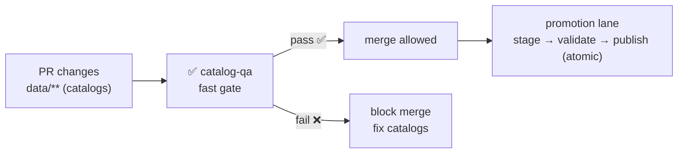

<a id="top"></a>

# ✅ `catalog-qa` — STAC/DCAT/PROV Quick Gate (Kansas Frontier Matrix)

[](https://github.com/bartytime4life/Kansas-Frontier-Matrix/actions/workflows/ci.yml)
[](https://github.com/bartytime4life/Kansas-Frontier-Matrix/actions/workflows/codeql.yml)


> 🧪 This is a **repo-local composite action** that wraps the KFM Catalog QA tool (`tools/validation/catalog_qa/`) to prevent **broken, unsafe, or non-governed metadata** from merging.
>
> **Non‑negotiable pipeline order:**  
> 🧰 ETL → 🗂️ Catalogs (**STAC/DCAT/PROV**) → 🕸️ Graph → 🔌 API → 🌐 UI → 🎬 Story Nodes → 🧠 Focus Mode

> [!IMPORTANT]
> In KFM, catalogs are **boundary artifacts** (interfaces), not “documentation.”  
> If the catalogs can’t be trusted, **Graph/API/UI/Narrative must not proceed**. 🚦

---

## 🧾 Action metadata

| Field | Value |
|---|---|
| Action name | `kfm/catalog-qa` (repo-local composite action) |
| Action file | `.github/actions/catalog-qa/action.yml` |
| Docs file | `.github/actions/catalog-qa/README.md` |
| Tool wrapped | `tools/validation/catalog_qa/` |
| Status | ✅ Active *(or “spec” until `action.yml` exists)* |
| Last updated | **2026-01-09** |
| Default lane | PR (fast / required when catalogs change) |
| Default stance | **Fail‑closed** (warnings can be promoted to failures) |

---

## ⚡ Quick links

| Need | Go |
|---|---|
| 🧩 All local actions | [`../README.md`](../README.md) |
| 🧰 Workflows (how this is used) | [`../../workflows/README.md`](../../workflows/README.md) |
| ✅ Catalog QA tool code | [`../../../tools/validation/catalog_qa/`](../../../tools/validation/catalog_qa/) |
| 🧭 Repo overview | [`../../../README.md`](../../../README.md) |
| 🛡️ Security policy | [`../../../SECURITY.md`](../../../SECURITY.md) |
| 🧱 KFM metadata profiles | [`../../../docs/standards/`](../../../docs/standards/) *(expects `KFM_STAC_PROFILE.md`, `KFM_DCAT_PROFILE.md`, `KFM_PROV_PROFILE.md`)* |
| 🧾 Schemas (contract-first) | [`../../../schemas/`](../../../schemas/) *(expects `schemas/stac/`, `schemas/dcat/`, `schemas/prov/`)* |

---

<details>
<summary><strong>🧭 Table of contents</strong></summary>

- [🎯 What this action does](#-what-this-action-does)
- [🗂️ What counts as a “catalog” in KFM](#️-what-counts-as-a-catalog-in-kfm)
- [🧱 Where it fits in KFM promotion](#-where-it-fits-in-kfm-promotion)
- [✅ What gets checked](#-what-gets-checked)
- [🎛️ Inputs](#️-inputs)
- [📤 Outputs](#-outputs)
- [🚀 Usage](#-usage)
- [🧪 Local run (developer workflow)](#-local-run-developer-workflow)
- [🔐 Security notes (link checking & SSRF)](#-security-notes-link-checking--ssrf)
- [📦 Artifacts & reports](#-artifacts--reports)
- [🧯 Troubleshooting](#-troubleshooting)
- [🧩 Extending the gate](#-extending-the-gate)
- [📚 Reference library](#-reference-library)

</details>

---

## 🎯 What this action does

This action runs a **fast, deterministic** QA pass over KFM’s metadata boundary artifacts:

- ✅ Finds and validates catalogs (STAC/DCAT/PROV) in **canonical locations**
- ✅ Enforces **profile-minimum** required fields (license, attribution, distributions, etc.)
- ✅ Enforces **cross-layer linkage** expectations (STAC ↔ DCAT ↔ PROV)
- 🔗 Optionally checks external `href`s with **SSRF-safe link checking**
- 📄 Writes:
  - a **machine report** (`catalog-qa.json`)
  - a **human summary** (`catalog-qa.md`)
  - (optional) link check CSV / details
- 🧾 Appends a short summary to `$GITHUB_STEP_SUMMARY` so PR reviewers see results immediately

> [!NOTE]
> This is intentionally **not** the full validation universe.  
> It’s a **high‑ROI PR filter**. Deep schema validation and heavy geometry checks belong in nightly/promotion lanes.

---

## 🗂️ What counts as a “catalog” in KFM

KFM’s v13 directory expectations (canonical intent):

```text
data/
├─ raw/<domain>/                 # raw sources (read-only)
├─ work/<domain>/                # intermediate outputs
├─ processed/<domain>/           # publishable outputs ✅
├─ stac/
│  ├─ collections/**/collection.json
│  └─ items/**/*.json
├─ catalog/
│  └─ dcat/**/*.{json,jsonld}    # DCAT discovery layer
└─ prov/**/*.{json,jsonld}       # W3C PROV lineage bundles
```

> [!TIP]
> If your repo still uses `data/provenance/` (legacy), the QA tool/action should support a `prov_root` override so we can migrate safely without breaking lanes. 🧭

---

## 🧱 Where it fits in KFM promotion



Catalog QA protects the **interface** to downstream subsystems. If the interface is broken, we stop early. 🧯

---

## ✅ What gets checked

> Keep PR gates fast. If you need more strictness, add toggles and move heavy work to nightly/promotion lanes.

### ✅ Baseline checks (fast PR gate)

**1) Canonical placement & file discovery**
- Catalog files exist in the expected roots (`data/stac/**`, `data/catalog/dcat/**`, `data/prov/**`)
- No path traversal / symlink escape surprises when resolving files
- Optional: forbid “catalogs committed under random folders” unless explicitly configured

**2) Profile-minimum required fields (contract-first)**
- **STAC**: `id`, `type`, `stac_version`, `license`, `links`, spatial + temporal coverage
- **DCAT**: title/description/license/keywords + at least one distribution link
- **PROV**: agents + activities + entities; includes parameters/config and run identity

**3) Cross-layer linkage (evidence-first)**
- STAC Items must reference **real assets** (preferably under `data/processed/**` or stable storage)
- DCAT must point to STAC/distributions (so external harvesters can discover data)
- PROV must connect raw → work → processed and identify the producing run/config

**4) Determinism-friendly output**
- Stable ordering of findings (so reports don’t churn between runs)
- No timestamps injected into the report unless explicitly requested (and then recorded consistently)

### 🧭 Optional checks (enable as repo matures)

**Governance + sovereignty**
- Required “sensitivity/classification” tags present for protected datasets
- “No sensitive location leaks” checks (basic coordinate/bbox constraints where applicable)

**Kansas sanity (geo QA)**
- bbox plausibility checks (and optional Kansas bounds sanity)
- geometry validity checks for vectors (self-intersections, empties)

**Link checking (SSRF-safe)**
- Validate `links[].href` and `assets.*.href` for key artifacts only (budgeted)
- Domain allowlist and/or scheme restrictions

**Evidence artifact rules (AI/analysis outputs)**
- Derived outputs must be cataloged like any other dataset (STAC/DCAT/PROV)
- PROV must document method + parameters + confidence/uncertainty when relevant

---

## 🎛️ Inputs

> GitHub Action inputs are **strings**. Use `"true"` / `"false"` for booleans.

| Input | Required | Default | Meaning |
|---|---:|---|---|
| `data_root` | ❌ | `data/` | Root directory containing canonical folders |
| `stac_globs` | ❌ | `stac/collections/**/collection.json\nstac/items/**/*.json` | Newline-separated patterns (relative to `data_root`) |
| `dcat_globs` | ❌ | `catalog/dcat/**/*.{json,jsonld}` | Newline-separated patterns (relative to `data_root`) |
| `prov_globs` | ❌ | `prov/**/*.{json,jsonld}` | Newline-separated patterns (relative to `data_root`) |
| `fail_on_warn` | ❌ | `"true"` | Treat warnings as failures (recommended for PR lanes) |
| `check_links` | ❌ | `"true"` | Enable SSRF-safe link checking |
| `link_policy` | ❌ | `safe` | `safe` = deny private IPs, cap redirects, timeouts |
| `max_link_checks` | ❌ | `200` | Budget to keep PR lane fast |
| `output_dir` | ❌ | `out/catalog-qa` | Where reports are written |
| `python_version` | ❌ | `"3.12"` | Python version used (if action performs setup) |

> [!NOTE]
> If your current action only supports a single `root` + `glob`, keep that contract — but consider evolving toward newline-separated globs for STAC/DCAT/PROV to reduce “run it three times” YAML duplication.

---

## 📤 Outputs

| Output | Description |
|---|---|
| `ok` | `"true"` if gate passed, else `"false"` |
| `report_json` | Path to machine-readable report (`.json`) |
| `report_md` | Path to human-readable summary (`.md`) |
| `error_count` | Integer-like string |
| `warning_count` | Integer-like string |

---

## 🚀 Usage

### ✅ Recommended PR gate workflow (paths-filtered)

```yaml
name: Catalog QA

on:
  pull_request:
    paths:
      - "data/stac/**"
      - "data/catalog/dcat/**"
      - "data/prov/**"
      - "tools/validation/catalog_qa/**"
      - ".github/actions/catalog-qa/**"
      - ".github/workflows/catalog-qa.yml"
  workflow_dispatch:

permissions:
  contents: read

jobs:
  catalog-qa:
    runs-on: ubuntu-latest
    timeout-minutes: 10

    steps:
      - uses: actions/checkout@v4

      - name: ✅ Catalog QA (fast gate)
        uses: ./.github/actions/catalog-qa
        with:
          data_root: "data/"
          fail_on_warn: "true"
          check_links: "true"
          output_dir: "out/catalog-qa"

      - name: 📦 Upload Catalog QA reports
        uses: actions/upload-artifact@v4
        if: always()
        with:
          name: catalog-qa-${{ github.sha }}
          path: out/catalog-qa/**
```

### ✅ Alternative: workflow owns setup (action is “runner only”)

```yaml
- uses: actions/setup-python@v5
  with:
    python-version: "3.12"
    cache: "pip"

- name: Install QA deps
  run: |
    python -m pip install -U pip
    pip install -r requirements-dev.txt

- name: ✅ Catalog QA
  uses: ./.github/actions/catalog-qa
  with:
    data_root: "data/"
    check_links: "true"
    fail_on_warn: "true"
```

---

## 🧪 Local run (developer workflow)

Run the same tool the action wraps (command shape depends on implementation):

```bash
python3 tools/validation/catalog_qa/run_catalog_qa.py \
  --data-root data/ \
  --stac-globs "stac/collections/**/collection.json" \
  --stac-globs "stac/items/**/*.json" \
  --dcat-globs "catalog/dcat/**/*.json" \
  --prov-globs "prov/**/*.{json,jsonld}" \
  --fail-on-warn \
  --check-links \
  --out out/catalog-qa
```

> [!TIP]
> Keep fixtures tiny for iteration: one STAC Collection + 1–2 Items + a minimal DCAT entry + a minimal PROV bundle.

---

## 🔐 Security notes (link checking & SSRF)

Link checking is valuable — and a classic SSRF foot-gun if implemented loosely.

Recommended safe defaults for `link_policy: safe`:

- ✅ allow only `http://` and `https://`
- ✅ deny private/loopback/link-local targets (`127.0.0.1`, `10.0.0.0/8`, `169.254.0.0/16`, etc.)
- ✅ cap redirects (and re-check destination after redirects)
- ✅ strict timeouts + max response size
- ✅ never send credentials/Authorization headers to external URLs
- ✅ prefer `HEAD`; fall back to range-limited `GET` only when needed

> [!CAUTION]
> For fork PRs, treat catalogs as **untrusted inputs**. If you can’t guarantee SSRF safety, disable link checking on forks and enforce it on trusted branches only.

---

## 📦 Artifacts & reports

### ✅ Recommended report files

```text
out/catalog-qa/
├─ catalog-qa.json
├─ catalog-qa.md
└─ link-checks.csv              # optional
```

### 🧾 Example JSON shape (illustrative)

```json
{
  "summary": { "checked": 12, "errors": 1, "warnings": 0 },
  "errors": [
    {
      "code": "MISSING_LICENSE",
      "file": "data/stac/collections/example/collection.json",
      "message": "STAC Collection missing required field: license"
    }
  ],
  "link_checks": [
    { "href": "https://example.com/data.tif", "status": 404, "ok": false }
  ]
}
```

> Keep the JSON schema stable once downstream gates/reports depend on it. 📌

---

## 🧯 Troubleshooting

### Common failures

| Failure | Meaning | Fix |
|---|---|---|
| `MISSING_LICENSE` | license absent/empty | Add license (prefer SPDX id) + attribution |
| `MISSING_DCAT_DISTRIBUTION` | no distribution link | Add distribution to STAC entry or download |
| `MISSING_PROV` | lineage missing | Emit a PROV bundle for the run/output |
| `ASSET_NOT_FOUND` | STAC asset link points nowhere | Fix `href` or publish the asset |
| `LINK_DEAD` | `href` unreachable | Fix URL, publish asset, or remove broken link |
| `BBOX_OUT_OF_RANGE` | bbox invalid/implausible | Fix coordinates / CRS; regenerate |
| `GEOMETRY_INVALID` | geometry invalid | Repair/simplify geometry |

### Debug tips
- Run locally with `--fail-on-warn` to match CI.
- If link checks are flaky:
  - add retries with backoff
  - prefer HEAD
  - allowlist stable domains used in publishing

---

## 🧩 Extending the gate

When adding checks, keep these rules:

- ✅ deterministic output (no time-based churn)
- ✅ fast PR budget (save heavy checks for nightly/promotion lanes)
- ✅ stable error codes (CI dashboards love stable codes)
- ✅ fixtures proving each check works
- ✅ governance fields (license, provenance, sensitivity) are first-class

---

## 📚 Reference library

This action’s philosophy is shaped by KFM’s governance + reproducibility discipline:
**catalogs and provenance are boundary artifacts**, required before graph/API/UI/narrative.

### Core KFM references (project files)
- `docs/specs/Kansas Frontier Matrix (KFM) – Comprehensive Technical Documentation.docx`
- `docs/specs/MARKDOWN_GUIDE_v13.md.gdoc` *(Master Guide v13 draft)*
- `docs/standards/KFM_STAC_PROFILE.md`
- `docs/standards/KFM_DCAT_PROFILE.md`
- `docs/standards/KFM_PROV_PROFILE.md`

### GIS + remote sensing (why metadata QA matters)
- `docs/library/python-geospatial-analysis-cookbook.pdf`
- `docs/library/PostgreSQL Notes for Professionals - PostgreSQLNotesForProfessionals.pdf`
- `docs/library/Cloud-Based Remote Sensing with Google Earth Engine-Fundamentals and Applications.pdf`
- `docs/library/making-maps-a-visual-guide-to-map-design-for-gis.pdf`
- `docs/library/compressed-image-file-formats-jpeg-png-gif-xbm-bmp.pdf`

### Governance & human constraints (defense mindset)
- `SECURITY.md`
- `docs/library/Data Spaces.pdf`
- `docs/library/Introduction to Digital Humanism.pdf`

---

<p align="right"><a href="#top">⬆️ Back to top</a></p>
