# 🧪 Catalog QA Action — STAC · DCAT · PROV Gatekeeper

<p align="left">
  
  
  
  
  
</p>

**Catalog QA** is a repo-local GitHub Action that blocks merges when data/catalog artifacts are missing, inconsistent, or violate governance rules.  
It’s the “✅ do we trust this dataset change?” gate before anything can ship downstream to graph/API/UI.

---

<details>
<summary>📚 Contents</summary>

- [What this action does](#-what-this-action-does)
- [Where it fits in the KFM truth path](#-where-it-fits-in-the-kfm-truth-path)
- [Quick start](#-quick-start)
- [Recommended workflow wiring](#-recommended-workflow-wiring)
- [Common failures and how to fix them](#-common-failures-and-how-to-fix-them)
- [Run locally](#-run-locally)
- [Extending Catalog QA](#-extending-catalog-qa)
- [Directory context](#-directory-context)

</details>

---

## 🎯 What this action does

This action is meant to enforce **“nothing enters without provenance”** by validating the repo’s *boundary artifacts* that make datasets discoverable, auditable, and safe to use.

Typical checks include:

### 🗂️ Catalog completeness
- Verifies that changes to **processed outputs** are accompanied by the expected catalog artifacts:
  - 🧾 **STAC** (Collections/Items)
  - 🧾 **DCAT** (dataset discovery entries)
  - 🧬 **PROV** (lineage bundles)

### 🔗 Cross-links & file integrity
- STAC assets reference real files (or stable URLs) and don’t point to nowhere.
- DCAT distributions point to STAC and/or the underlying data.
- PROV chains reference inputs/outputs consistently (raw → work → processed).

### ✅ Schema validation
- Validates JSON artifacts against repo schemas/profiles (ex: `schemas/`).
- Catches missing required fields (license/citation/title/etc.), malformed GeoJSON, broken links, etc.

### 🛡️ Governance policy checks
- Runs **policy-as-code** gates (OPA/Rego via Conftest-style checks) so that:
  - missing license/citation metadata fails CI
  - restricted/sensitive data rules are enforced
  - “fail closed” behavior happens automatically

> 💡 **Design intent:** If a contributor forgets the metadata or provenance files, CI fails fast—before review time is wasted.

---

## 🧭 Where it fits in the KFM truth path

```mermaid
flowchart LR
  A[📥 Raw Sources] --> B[⚙️ ETL + Normalization]
  B --> C[🧾 STAC Items + Collections]
  C --> D[🧾 DCAT Dataset Views]
  C --> E[🧬 PROV Lineage Bundles]
  E --> F[🧱 DB / Graph / Index]
  F --> G[🛰️ API Contracts]
  G --> H[🗺️ UI + Story Nodes + Focus Mode]

  subgraph QA["🧪 Catalog QA Action"]
    Q1[Validate schemas] --> Q2[Validate cross-links]
    Q2 --> Q3[Run policy gates]
  end

  C --> QA
  D --> QA
  E --> QA
```



---

## 🚀 Quick start

Minimal usage (no inputs):

```yaml
- name: 🧪 Catalog QA
  uses: ./.github/actions/catalog-qa
```

> 🔎 Want to tune behavior? Check `action.yml` in this folder for the canonical `with:` inputs supported by this action.

---

## 🧩 Recommended workflow wiring

A practical PR gate that runs only when relevant paths change:

```yaml
name: catalog-qa

on:
  pull_request:
    paths:
      - "data/**"
      - "schemas/**"
      - "policy/**"
      - ".github/actions/catalog-qa/**"

jobs:
  catalog-qa:
    runs-on: ubuntu-latest
    permissions:
      contents: read

    steps:
      - name: 📦 Checkout
        uses: actions/checkout@v4

      - name: 🧪 Catalog QA
        uses: ./.github/actions/catalog-qa
```

<details>
<summary>✨ Optional: stronger gating patterns</summary>

- Add a *second job* that only runs when `data/processed/**` changes, and requires `catalog-qa` to pass.
- Attach a summary to the PR using `$GITHUB_STEP_SUMMARY` (if your action supports it).
- Upload QA reports as artifacts (if your action generates `reports/*.json` / `reports/*.md`).

</details>

---

## 🧯 Common failures and how to fix them

### ❌ “Processed file changed but catalog entry is missing”
**Fix:** Add/refresh the dataset’s boundary artifacts:
- STAC Collection/Item(s) ✅
- DCAT dataset entry ✅
- PROV bundle ✅

> Tip: treat the metadata and provenance as *part of the dataset*, not an optional add-on.

---

### ❌ “Schema validation failed”
**Fix:** Open the error message and:
- add missing required fields (license/title/description/citation/etc.)
- correct JSON formatting
- ensure geometry/temporal fields match the expected profile

---

### ❌ “Broken asset href / link target not found”
**Fix:** Update STAC/DCAT distributions so links point to:
- the correct `data/processed/**` path, or
- a stable, fetchable URL (when using external/LFS storage)

---

### ❌ “Policy violation”
**Fix:** Update metadata to comply with policy:
- include license + attribution
- set sensitivity/access fields correctly
- remove restricted content from public artifacts (or mark as restricted per governance rules)

---

## 🧰 Run locally

If you want to replicate CI behavior before pushing (recommended 🧠):

1. Run the repo’s schema validators (whatever the action uses internally).
2. Run policy checks (commonly Conftest against `policy/*.rego`).

Example pattern (adjust to repo conventions):

```bash
# (optional) validate JSON + schemas
python -m tools.validate_catalog --changed-only

# (optional) run policy-as-code checks
conftest test --policy policy/ data/ schemas/
```

> ✅ If local checks pass, the PR gate should be predictable and boring (the good kind of boring).

---

## 🧱 Extending Catalog QA

When adding a new rule, keep it deterministic and reviewable:

- 🛡️ **Policy rules:** add/update `policy/*.rego`
- 🧾 **Schema rules:** add/update JSON Schema files in `schemas/`
- 🧪 **Regression tests:** add fixtures that demonstrate pass/fail cases
- 📝 **Docs:** update this README with the new check category + fix guidance

---

## 🗂️ Directory context

```text
📁 .github/
  └─ 📁 actions/
     └─ 📁 catalog-qa/
        ├─ 📄 action.yml        # ✅ action definition (inputs/steps live here)
        └─ 📄 README.md         # 👈 you are here
```

---

### 🧭 Maintainer notes
- Keep this action **fast** (PR gates should be minutes, not hours).
- Prefer **fail-closed** rules when provenance or licensing is incomplete.
- When in doubt, enforce **clarity**: metadata > assumptions.

🔒 “Trust is built by defaults, not by exceptions.”