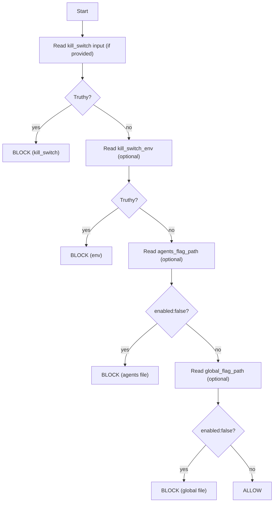

# 🧯 `check-kill-switch` — Fail‑Closed CI Circuit Breaker (Kansas Frontier Matrix)


> A tiny, boring, high‑leverage guardrail: **stop risky/mutating jobs** (publish, deploy, promotion, agent executor) when an emergency **kill switch** is enabled.  
> In KFM terms: this helps us preserve **trust** (provenance + integrity) before **speed**.

---

## 🧾 Policy metadata

| Field | Value |
|---|---|
| File | `.github/actions/check-kill-switch/README.md` |
| Status | ✅ Active (spec + usage docs) |
| Last updated | **2026-01-09** |
| KFM baseline | **KFM‑MDP v11.2.6** |
| Primary use | Guardrails for **promotion/deploy/automation** lanes |
| Default behavior | **Fail‑closed** when kill switch is ON |

---

## 🎯 What this action does

`check-kill-switch` evaluates one or more **kill switch sources** (repo/env + file flags) and returns a clear decision:

- ✅ **allowed** → proceed with the job
- 🛑 **blocked** → stop (fail) or “soft stop” (output-only), depending on `mode`

This action is meant to run **first** in any job that:
- publishes data / catalogs / provenance
- pushes containers
- deploys Pages or other environments
- runs automated agents that can open PRs / write artifacts
- performs expensive or potentially unsafe ETL/model operations

---

## 🧭 Why KFM needs a kill switch

KFM is **not** “just code.” A bad automation run can:
- publish broken STAC/DCAT links (downstream consumers break)
- publish artifacts without PROV lineage (auditability breaks)
- leak sensitive spatial precision (governance breaks)
- push a compromised container or workflow (supply chain breaks)

A kill switch is your **circuit breaker**: simple, fast to toggle, and easy to audit.

---

## 🧩 Kill switch sources and precedence

This action supports a **layered** (and intentionally boring) control plane:

| Priority | Source | Typical owner | Intended use |
|---:|---|---|---|
| 1 (highest) | **Repo/Environment secret/var** (e.g., `KFM_KILL_SWITCH`) | Maintainers/Ops | Immediate stop without code changes |
| 2 | **File-based flag** (e.g., `ops/feature_flags/agents.yml`) | Maintainers via PR | Disable specific subsystems (agents) in a traceable way |
| 3 (optional) | **Project kill switch file** (e.g., `.kfm/kill-switch.yml`) | Maintainers via PR | Repo-wide “stop publish/deploy” guardrail |

**Precedence rule:** if any source says “STOP”, we stop.

> [!IMPORTANT]
> Kill switches are intentionally **simple**.  
> If you need complex policy logic, use OPA/Conftest gates in workflows (and keep this action as the emergency brake).

---

## 🧯 Quickstart

### ✅ Typical usage (job guardrail step)

```yaml
steps:
  - uses: actions/checkout@v4

  - name: 🧯 Kill-switch guardrail
    uses: ./.github/actions/check-kill-switch
    with:
      # Preferred: pass repo var/secret (maintainers control this in Settings)
      kill_switch: ${{ vars.KFM_KILL_SWITCH }}
      mode: fail
      scope: publish
```

### ✅ Recommended usage (gate downstream jobs cleanly)

Use a dedicated `guardrails` job and gate all mutation jobs with `if:`:

```yaml
jobs:
  guardrails:
    runs-on: ubuntu-latest
    outputs:
      allowed: ${{ steps.ks.outputs.allowed }}
      reason:  ${{ steps.ks.outputs.reason }}
    steps:
      - uses: actions/checkout@v4
      - id: ks
        uses: ./.github/actions/check-kill-switch
        with:
          kill_switch: ${{ vars.KFM_KILL_SWITCH }}
          mode: output-only
          scope: all

  publish:
    needs: guardrails
    if: needs.guardrails.outputs.allowed == 'true'
    runs-on: ubuntu-latest
    steps:
      - run: echo "Publishing…"
```

This keeps CI “green but paused” when you want to stop scheduled jobs without creating panic red ❌ runs.

---

## ⚙️ Inputs

> Composite actions receive everything as strings. Treat booleans as `"true"` / `"false"`.

| Input | Required | Default | Description |
|---|---:|---|---|
| `mode` | no | `fail` | `fail` → exit 1 when blocked. `output-only` → never fails, only sets outputs. |
| `scope` | no | `all` | Logical area this job represents: `all`, `publish`, `deploy`, `agents`, `docker`, `pages`, `data`, `models`. |
| `kill_switch` | no | *(empty)* | Explicit kill-switch value (recommended). Pass a repo var/secret like `${{ vars.KFM_KILL_SWITCH }}`. |
| `kill_switch_env` | no | `KFM_KILL_SWITCH` | Env var name to read if `kill_switch` isn’t passed (optional convenience). |
| `agents_flag_path` | no | `ops/feature_flags/agents.yml` | File flag for agent subsystem (simple YAML expected). |
| `global_flag_path` | no | `.kfm/kill-switch.yml` | Optional global file kill switch (simple YAML expected). |
| `require_files` | no | `false` | If `true`, missing flag files are treated as an error (useful for strict prod lanes). |
| `truthy` | no | `true,1,yes,on` | Comma-separated “true” values (case-insensitive). |

---

## 📤 Outputs

| Output | Meaning |
|---|---|
| `allowed` | `"true"` if the job should proceed |
| `blocked` | `"true"` if kill switch is engaged |
| `scope` | resolved scope value |
| `source` | which control triggered the block (`kill_switch`, `env`, `agents_flag_path`, `global_flag_path`) |
| `reason` | human-readable reason (best-effort; may be blank) |
| `report_path` | path to a JSON report (if the action writes one) |

> [!TIP]
> Even if you run in `fail` mode, you can still upload `report_path` as an artifact for audit/debug.

---

## 🗂️ Expected file formats

### 1) `ops/feature_flags/agents.yml` (agent kill switch)
Keep this file **simple** so it’s parseable with boring tooling:

```yaml
# ops/feature_flags/agents.yml
enabled: true
reason: "Set enabled:false to stop Planner/Executor immediately."
```

Setting `enabled: false` blocks agent operations.

### 2) `.kfm/kill-switch.yml` (global kill switch)
This is optional but recommended for “one file to stop promotion.”

```yaml
# .kfm/kill-switch.yml
enabled: true
reason: "Set enabled:false to halt publish/deploy lanes."
scopes:
  - publish
  - deploy
```

Suggested semantics:
- if `enabled: false` → block everything in `scope: all`
- if `enabled: true` + `scopes` present → block only those named scopes *(optional implementation)*

> [!CAUTION]
> Keep YAML **flat and boring** (no anchors, no multiline structures) if you want deterministic parsing.

---

## 🧠 Behavior rules (how decisions are made)



---

## 🔐 Security notes

### ✅ This action is designed to be safe
- Needs **no write permissions**.
- Should run with `permissions: contents: read`.
- Does not require secrets unless your workflow passes one explicitly.

### ⚠️ Don’t over-trust PR results
If a contributor changes kill-switch files in a PR, that PR can make the PR run “look allowed.”  
This is why **publish/deploy jobs** must still be protected by:
- branch protection (no direct pushes to `main`)
- protected GitHub Environments (approval gates)
- no secrets on untrusted forks
- attestation/signing lanes for releases

**Kill switch = emergency brake, not your only lock.**

---

## 🧩 Suggested workflow placement

Place this action:
- **as the first step** in any mutation job, or
- in a dedicated `guardrails` job that all other jobs depend on

### 🧯 Best places to guard
- `publish-catalog.yml` (STAC/DCAT/PROV promotion)
- `docker.yml` (image push)
- `pages.yml` (deploy)
- any “agent executor” workflow that can open PRs
- scheduled ETL or model regression workflows

---

## 🧪 Testing & maintenance

Recommended:
- Add an `actions-smoke.yml` workflow that runs this action on:
  - `kill_switch: true` (expects blocked)
  - `kill_switch: false` (expects allowed)
  - a fixture `ops/feature_flags/agents.yml` with `enabled: false`

---

## 🔗 Related KFM actions

- ✅ `../catalog-qa/` — validate STAC/DCAT links and required metadata  
- 📦 `../build-info/` — emit build-info + checksums for audit trails  
- 🖊️ `../attest/` — attach SBOM/attestations (SLSA-ish provenance)  

---

## 📚 References inside this repo

- `.github/workflows/README.md` — CI lane architecture & gate matrix  
- `docs/specs/Latest Ideas.pdf` — runtime invariants (including kill switch patterns)  
- `docs/specs/Kansas Frontier Matrix (KFM) – Comprehensive Technical Documentation.docx` — provenance-first architecture & governance context  

---

## 📄 License

MIT (repo default), unless otherwise noted.

