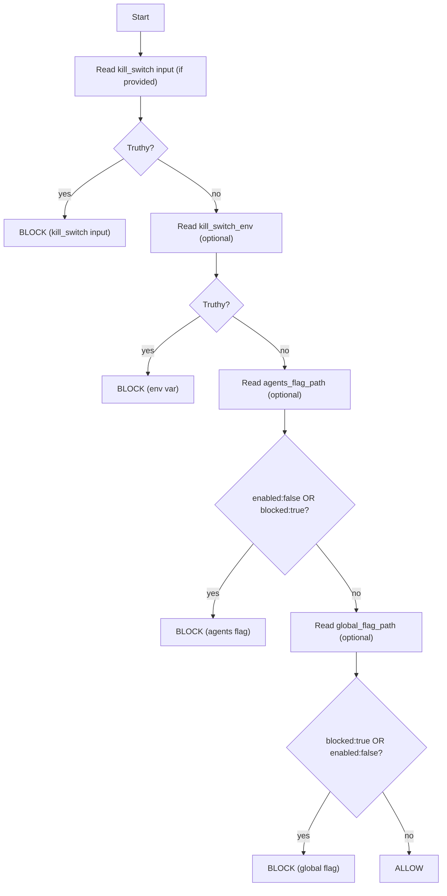

<a id="top"></a>

# 🧯 `check-kill-switch` — Fail‑Closed CI Circuit Breaker (Kansas Frontier Matrix)

[](https://github.com/bartytime4life/Kansas-Frontier-Matrix/actions/workflows/ci.yml)
[](https://github.com/bartytime4life/Kansas-Frontier-Matrix/actions/workflows/codeql.yml)


> A tiny, boring, high‑leverage guardrail: **stop risky/mutating jobs** (publish, deploy, promotion, agent executor) when an emergency **kill switch** is enabled.  
> In KFM terms: preserve **trust** (provenance + integrity) before **speed** 🧾🔐

> [!IMPORTANT]
> **KFM pipeline order (don’t break it):** 🧰 ETL → 🗂️ Catalogs (STAC/DCAT/PROV) → 🕸️ Graph → 🔌 API → 🌐 UI → 🎬 Story Nodes → 🧠 Focus Mode

---

## 🧾 Action metadata

| Field | Value |
|---|---|
| 📄 Docs file | `.github/actions/check-kill-switch/README.md` |
| 🧩 Action file | `.github/actions/check-kill-switch/action.yml` *(expected)* |
| 📦 Action folder | `.github/actions/check-kill-switch/` |
| 🎯 Primary job | Circuit breaker for publish/deploy/promotion/agent lanes |
| 🧯 Default behavior | **Fail‑closed** when a kill switch is ON |
| 🔐 Default perms | `contents: read` |
| 🧭 KFM baseline | **KFM‑MDP v11.2.6** • **Master Guide v13 (draft)** |
| 🗓️ Last updated | **2026-01-11** |

---

## ⚡ Quick links

| Need | Go |
|---|---|
| 🧩 All local actions | [`../README.md`](../README.md) |
| 🧪 Workflows hub | [`../../workflows/README.md`](../../workflows/README.md) |
| 🛡️ Security policy | [`../../../SECURITY.md`](../../../SECURITY.md) |
| 🧾 Policy gates (OPA/Conftest) | `../../../tools/validation/policy/` |
| 🤖 Agents feature flags | `../../../ops/feature_flags/agents.yml` *(recommended)* |
| 🧯 Global kill switch | `../../../.kfm/kill-switch.yml` *(optional, recommended)* |

---

<details>
<summary><strong>📌 Table of contents</strong></summary>

- [🎯 What this action does](#-what-this-action-does)
- [🧭 Why KFM needs a kill switch](#-why-kfm-needs-a-kill-switch)
- [🧩 Kill switch sources & precedence](#-kill-switch-sources--precedence)
- [🧠 Scopes (what you’re blocking)](#-scopes-what-youre-blocking)
- [⚙️ Inputs](#️-inputs)
- [📤 Outputs](#-outputs)
- [🗂️ Expected flag file formats](#️-expected-flag-file-formats)
- [🧠 Decision logic](#-decision-logic)
- [🧯 Quickstart examples](#-quickstart-examples)
- [🔐 Security notes](#-security-notes)
- [🧪 Testing & maintenance](#-testing--maintenance)
- [🔗 Related KFM actions](#-related-kfm-actions)
- [📚 Project reference library](#-project-reference-library)

</details>

---

## 🎯 What this action does

`check-kill-switch` evaluates one or more **kill switch sources** (repo/env + file flags) and returns a clear decision:

- ✅ **allowed** → proceed with the job
- 🛑 **blocked** → stop (fail) or “soft stop” (output-only), depending on `mode`

Run this **first** in any job that:
- 📦 publishes catalogs / provenance / releases
- 🐳 pushes containers
- 🚀 deploys environments (Pages, API, infra)
- 🤖 runs “Executor” agent lanes (opens PRs, writes artifacts)
- 🧪 runs expensive model/ETL pipelines where “stop now” matters

> [!NOTE]
> This action is intentionally **dumb by design**.  
> It is the **emergency brake**. Complex governance logic belongs in policy gates (OPA/Conftest).

---

## 🧭 Why KFM needs a kill switch

KFM is **not** “just code.” A bad automation run can:

- 🔗 publish broken STAC/DCAT links (downstream consumers break)
- 🧾 publish artifacts without PROV lineage (auditability breaks)
- 🧬 ship SBOM/provenance drift (supply chain breaks)
- 🧑‍⚖️ accidentally violate governance rules (privacy/sensitive location concerns)
- 🐳 push a compromised container or workflow (credibility breaks)

A kill switch is your **circuit breaker**: simple, fast to toggle, easy to audit, and aligned with KFM’s governance posture (human review + fail‑closed promotion).

> [!TIP]
> Think of this as **“stop mutation”**, not “stop all CI.”  
> You can keep PR lanes running while freezing publish/promotion/deploy.

---

## 🧩 Kill switch sources & precedence

This action supports a **layered** (boring on purpose) control plane:

| Priority | Source | Typical owner | Intended use |
|---:|---|---|---|
| 1 (highest) | **Repo/Environment Variable or Secret** (e.g., `KFM_KILL_SWITCH`) | Maintainers/Ops | Immediate stop without code changes |
| 2 | **Agents feature flag file** (e.g., `ops/feature_flags/agents.yml`) | Maintainers via PR | Disable agent subsystem (W–P–E) in a traceable way |
| 3 | **Global file flag** (e.g., `.kfm/kill-switch.yml`) | Maintainers via PR | Repo-wide stop for specific scopes (publish/deploy/etc.) |

**Precedence rule:** if any source says “STOP”, we stop 🛑

> [!CAUTION]
> File-based flags are excellent for traceability, but they can be modified in a PR.  
> For protected lanes (publish/deploy), prefer **repo/environment variables** + **protected environments**.

---

## 🧠 Scopes (what you’re blocking)

Scopes help you communicate intent (and optionally implement fine-grained blocking).

| Scope | Examples | Why it’s risky |
|---|---|---|
| `publish` | STAC/DCAT/PROV promotion, dataset publish | breaks consumers + trust |
| `deploy` | API/UI deployment, infra pushes | can impact availability/security |
| `pages` | GitHub Pages deploy | public-facing drift |
| `docker` | image build + push | supply chain risk |
| `agents` | Watcher/Planner/Executor workflows | automated edits must be stoppable |
| `data` | ETL jobs mutating catalog outputs | governance + reproducibility |
| `models` | modeling/regression workloads | expensive + determinism sensitive |
| `all` | “stop everything mutating” | incident response |

> [!NOTE]
> Minimum viable implementation: treat **any kill switch as global** (blocks all scopes).  
> Optional enhancement: `.kfm/kill-switch.yml` can list `scopes:` to block selectively.

---

## ⚙️ Inputs

> Composite action inputs are strings. Treat booleans as `"true"` / `"false"`.

| Input | Required | Default | Description |
|---|---:|---|---|
| `mode` | ❌ | `fail` | `fail` → exit 1 when blocked. `output-only` → never fails, only sets outputs. |
| `scope` | ❌ | `all` | `all`, `publish`, `deploy`, `agents`, `docker`, `pages`, `data`, `models`. |
| `kill_switch` | ❌ | *(empty)* | Preferred explicit value (e.g., `${{ vars.KFM_KILL_SWITCH }}` or `${{ secrets.KFM_KILL_SWITCH }}`). Truthy → block. |
| `kill_switch_env` | ❌ | `KFM_KILL_SWITCH` | Env var name to read if `kill_switch` isn’t passed. |
| `agents_flag_path` | ❌ | `ops/feature_flags/agents.yml` | YAML flag file for agent subsystem. |
| `global_flag_path` | ❌ | `.kfm/kill-switch.yml` | Optional global YAML kill switch. |
| `require_files` | ❌ | `false` | If `true`, missing flag files become errors (useful in strict prod lanes). |
| `truthy` | ❌ | `true,1,yes,on` | Comma-separated “true” values (case-insensitive). |
| `out_dir` | ❌ | `out/check-kill-switch` | Where to write a JSON report (recommended). |

> [!IMPORTANT]
> If you rely on `agents_flag_path` or `global_flag_path`, you must `actions/checkout@v4` first (so the runner has the files).

---

## 📤 Outputs

| Output | Meaning |
|---|---|
| `allowed` | `"true"` if the job should proceed |
| `blocked` | `"true"` if a kill switch is engaged |
| `decision` | `allow` or `block` |
| `scope` | resolved scope value |
| `source` | which control triggered the block (`kill_switch`, `env`, `agents_flag_path`, `global_flag_path`) |
| `reason` | human-readable reason (best-effort; may be blank) |
| `report_path` | path to a JSON report (if written) |

> [!TIP]
> Even if you run in `fail` mode, write a report + Step Summary first so operators can see **why** it stopped.

---

## 🗂️ Expected flag file formats

> Keep YAML **flat and boring** for deterministic parsing (no anchors, no complex merges).

### 1) `ops/feature_flags/agents.yml` (agent subsystem switch 🤖)

```yaml
# ops/feature_flags/agents.yml
enabled: true
reason: "Set enabled:false to stop Watcher/Planner/Executor immediately."
```

Recommended semantics:
- `enabled: false` → **block** scope `agents` *(and optionally `all` if you want a hard stop)*

### 2) `.kfm/kill-switch.yml` (global switch 🧯)

```yaml
# .kfm/kill-switch.yml
blocked: false
reason: "Set blocked:true to halt publish/deploy lanes during an incident."
scopes:
  - publish
  - deploy
  - docker
```

Recommended semantics:
- `blocked: true` with no `scopes:` → **block all scopes**
- `blocked: true` with `scopes:` → block only matching scopes *(optional implementation)*

> [!NOTE]
> Backward-compat is okay: if you already use `enabled: false` in `.kfm/kill-switch.yml`, support that too.

---

## 🧠 Decision logic



> [!IMPORTANT]
> **Fail-closed means:** if a kill switch says “stop”, we stop.  
> It does **not** mean “CI is always red.” Prefer the guardrails-job pattern for “paused but green” ✅⏸️

---

## 🧯 Quickstart examples

### ✅ Typical usage (job guardrail step)

```yaml
steps:
  - uses: actions/checkout@v4

  - name: 🧯 Kill-switch guardrail
    uses: ./.github/actions/check-kill-switch
    with:
      kill_switch: ${{ vars.KFM_KILL_SWITCH }}
      mode: fail
      scope: publish
```

### ✅ Recommended: guardrails job (pause safely without red runs)

```yaml
jobs:
  guardrails:
    runs-on: ubuntu-latest
    permissions:
      contents: read
    outputs:
      allowed: ${{ steps.ks.outputs.allowed }}
      reason:  ${{ steps.ks.outputs.reason }}
    steps:
      - uses: actions/checkout@v4
      - id: ks
        uses: ./.github/actions/check-kill-switch
        with:
          kill_switch: ${{ vars.KFM_KILL_SWITCH }}
          mode: output-only
          scope: all

  publish:
    needs: guardrails
    if: needs.guardrails.outputs.allowed == 'true'
    runs-on: ubuntu-latest
    steps:
      - run: echo "Publishing…"
```

### 🤖 Agent lanes (W–P–E Executor model)

If you run automation that can open PRs, gate it hard:

```yaml
jobs:
  executor:
    runs-on: ubuntu-latest
    permissions:
      contents: read
      pull-requests: write
    steps:
      - uses: actions/checkout@v4

      - name: 🧯 Stop agents if flagged
        uses: ./.github/actions/check-kill-switch
        with:
          scope: agents
          mode: fail

      - name: 🤖 Run Executor (no merge)
        run: python tools/agents/executor.py --no-merge
```

> [!CAUTION]
> Even with `pull-requests: write`, agents must **never** merge. Keep merges under branch protection + human review.

---

## 🔐 Security notes

### ✅ Designed to be safe
- Requires **no write permissions**
- Should run with:
  ```yaml
  permissions:
    contents: read
  ```
- Does not require secrets unless your workflow passes one explicitly

### ⚠️ Trust boundary: PRs are untrusted
If a contributor changes kill-switch files in a PR, that PR can make the PR run “look allowed.”  
This is why **publish/deploy** jobs must still be protected by:

- ✅ branch protection (no direct pushes to `main`)
- ✅ protected GitHub Environments (approval gates)
- ✅ no secrets on untrusted forks
- ✅ policy gates + attestations in promotion lanes

**Kill switch = emergency brake, not your only lock.**

---

## 🧪 Testing & maintenance

Recommended:
- Add `.github/workflows/actions-smoke.yml` that runs this action on fixtures:
  - `kill_switch: true` → expects blocked
  - `kill_switch: false` → expects allowed
  - `ops/feature_flags/agents.yml` with `enabled: false` → expects blocked
  - `.kfm/kill-switch.yml` with `blocked: true` + scopes → expects scoped block (if implemented)

Also recommended:
- Write a small JSON report to `out/check-kill-switch/report.json`
- Append a human summary to `$GITHUB_STEP_SUMMARY` (operators love this)

---

## 🔗 Related KFM actions

- ✅ `../catalog-qa/` — validate STAC/DCAT links + required metadata (fast PR gate)  
- 📦 `../build-info/` — emit build-info + checksums for audit trails  
- 🧬 `../sbom/` — generate SBOM artifacts (SPDX/CycloneDX)  
- 🖊️ `../attest/` — attach SBOM/provenance attestations (SLSA-ish / Sigstore)  
- 🧑‍⚖️ `../policy-gate/` — OPA/Conftest governance enforcement (default deny)  

---

## 📚 Project reference library

> ⚠️ Reference materials may have licenses different from repo code.  
> Keep them under `docs/library/` (or outside the repo) and respect upstream terms.

<details>
<summary><strong>🧭 KFM core specs (why kill switches exist)</strong></summary>

- `docs/specs/Kansas Frontier Matrix (KFM) – Comprehensive Technical Documentation.docx`
- `docs/notes/🌟 Kansas Frontier Matrix – Latest Ideas & Future Proposals.docx` *(W–P–E agents, idempotency, kill switch)*
- `SECURITY.md` *(repo security + governance posture)*

</details>

<details>
<summary><strong>🧠 Governance + human-centered framing</strong></summary>

- `docs/library/Introduction to Digital Humanism.pdf`
- `docs/library/Principles of Biological Autonomy - book_9780262381833.pdf`
- `docs/library/On the path to AI Law’s prophecies and the conceptual foundations of the machine learning age.pdf`
- `docs/library/Data Spaces.pdf`

</details>

<details>
<summary><strong>🗺️ GIS, cartography, remote sensing (why “bad publish” is high impact)</strong></summary>

- `docs/library/python-geospatial-analysis-cookbook.pdf`
- `docs/library/PostgreSQL Notes for Professionals - PostgreSQLNotesForProfessionals.pdf`
- `docs/library/making-maps-a-visual-guide-to-map-design-for-gis.pdf`
- `docs/library/Mobile Mapping_ Space, Cartography and the Digital - 9789048535217.pdf`
- `docs/library/Cloud-Based Remote Sensing with Google Earth Engine-Fundamentals and Applications.pdf`
- `docs/library/compressed-image-file-formats-jpeg-png-gif-xbm-bmp.pdf`

</details>

<details>
<summary><strong>📈 Modeling + reproducibility discipline (why we stop unsafe runs)</strong></summary>

- `docs/library/Scientific Modeling and Simulation_ A Comprehensive NASA-Grade Guide.pdf`
- `docs/library/Understanding Statistics & Experimental Design.pdf`
- `docs/library/regression-analysis-with-python.pdf`
- `docs/library/Regression analysis using Python - slides-linear-regression.pdf`
- `docs/library/graphical-data-analysis-with-r.pdf`
- `docs/library/think-bayes-bayesian-statistics-in-python.pdf`
- `docs/library/Generalized Topology Optimization for Structural Design.pdf`
- `docs/library/Spectral Geometry of Graphs.pdf`

</details>

<details>
<summary><strong>⚙️ Systems + scaling + concurrency (why a circuit breaker is “boring but necessary”)</strong></summary>

- `docs/library/Scalable Data Management for Future Hardware.pdf`
- `docs/library/concurrent-real-time-and-distributed-programming-in-java-threads-rtsj-and-rmi.pdf`

</details>

<details>
<summary><strong>🧰 Programming shelf bundles (general implementation support)</strong></summary>

- `docs/library/A programming Books.pdf`
- `docs/library/B-C programming Books.pdf`
- `docs/library/D-E programming Books.pdf`
- `docs/library/F-H programming Books.pdf`
- `docs/library/I-L programming Books.pdf`
- `docs/library/M-N programming Books.pdf`
- `docs/library/O-R programming Books.pdf`
- `docs/library/S-T programming Books.pdf`
- `docs/library/U-X programming Books.pdf`
- `docs/library/Deep Learning for Coders with fastai and PyTorch - Deep.Learning.for.Coders.with.fastai.and.PyTorchpdf`

</details>

---

<p align="right"><a href="#top">⬆️ Back to top</a></p>
